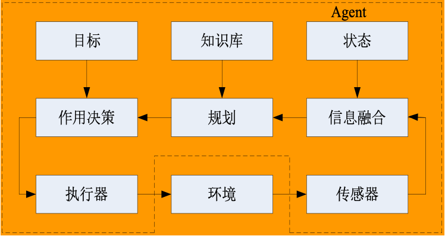
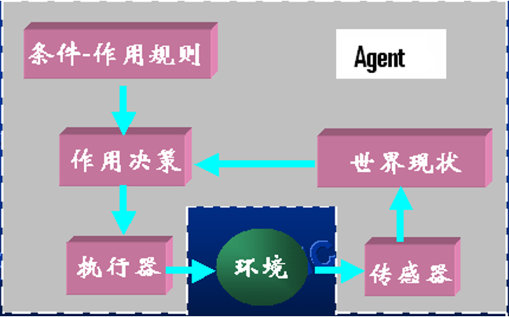
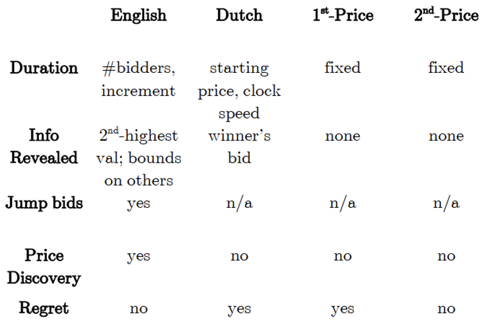

## 智能体

### 定义

Agent 是指驻留在某一环境下能够**自主**（Autonomous）、**灵活**（Flexible）地执行动作以满足设计目标的行为实体。

上述定义具有如下二个特点。

- (1) 定义方式 : Agent 概念定义是基于 Agent 的外部可观察行为特征，而不是其内部的结构
- (2) 抽象层次 : Agent 概念更加贴近于人们对现实世界（而不是计算机世界）中行为实体的理解

### 特点

#### 驻留性

#### 自主性

智能体能在没有人类或其他智能体的干涉和指导的情况下运行，并能根据其内部状态和感知到的环境信息来决定该实施什么样的动作，进而控制自身的行为

#### 灵活性

智能体行为的灵活性主要体现为以下三方面：

##### 反应性

（Reactive）

反应性是指智能体能够感知所处的环境，并能对环境中发生的相关事件（比如智能体间的交互、用户的指令等）作出适时反应，以满足系统设计目标

##### 自发性

（Pro-active）

自发性是指智能体不仅具有目标并根据目标行事，而且能够主动地产生目标，进而实施自发的行为

##### 社会性

（Social）

社会性是指智能体所驻留的环境可能存在其他智能体，它拥有这些智能体的有关信息和知识（比如这些智能体的物理位置、所拥有的资源和能力等），并能与它们进行交互和通信，实现灵活多样和复杂的合作、协商和竞争，以满足系统的设计目标

#### 其他特性

Agent 与**分布式人工智能系统**一样具有协作性、适应性等特性

- (1) 行为自主性
- (2) 作用交互性（也称反应性）
- (3) 环境协调性
- (4) 面向目标性
- (5) 存在社会性
- (6) 工作协作性
- (7) 运行持续性
- (8) 系统适应性
- (9) 结构分布性
- (10) 功能智能性

### BDI 模型

Agent 必须利用知识修改其内部状态(心理状态)，以适应环境变化和协作求解的需要。

人类心理状态的要素可分为以下三种

- 认知 (信念、知识、学习等)
- 情感 (愿望、兴趣、爱好等)
- 意向 (意图、目标和承诺等)

受人类心理启发，传统 Agent 理论模型研究的主要方向为：

- 信念 (Belief)
- 愿望 (Desire)
- 意图 (Intention)

的关系及其形式化描述，力图建立 Agent 的**BDI 模型**

### 结构

计算机系统为 Agent 的开发和运行提供软件和硬件环境支持，使各个 Agent 依据全局状态协调地完成各项任务。具体地说：

(1)在计算机系统中，Agent 相当于一个独立的功能模块、独立的计算机应用系统，它含有独立的外部设备、输入输出驱动装备、操作系统、数据结构和相应的输出。

(2) Agent 程序的核心部分叫做**决策生成器**或**问题求解器**，起到主控作用。

(3) Agent 的运行是一个或多个进程，并接受总体调度。

(4) 各个 Agent 在多个计算机 CPU 上并行运行，其运行环境由体系结构支持。

#### 知识型体系结构

将智能体视为一个定理证明器，智能体的行为决策是一个基于知识库的定理证明过程

智能体的内部状态对应于智能体所拥有的知识

各个知识条目用逻辑语言（比如经典的一阶谓词逻辑或者 Hoare 逻辑）来表示

基于知识型体系结构的智能体开发方法、技术和工具，代表性工作包括：

- Lesperance 等人基于格局演算（Situation Calculus）理论的 ConGolog ，它是 Golog（Goal-Oriented Language）的扩展
- Fisher 基于可执行时序逻辑（Temporal Logic）的多智能体系统编程语言[Concurrent MetateM](https://en.wikipedia.org/wiki/Concurrent_MetateM)

知识型体系结构的不足：

- 表达能力问题
- 计算复杂性问题
- 易用性问题

##### Concurrent MetateM

一个由 Concurrent MetateM 实现的系统包含一组可并发、异步执行的智能体：

- 每个智能体由一组可直接执行的时序逻辑公式加以描述
- 多个智能体间通过广播消息进行通信

对智能体进行编程的本质实际上就是用逻辑符号来定义智能体规约。一个智能体规约对应于一组时序逻辑公式，它描述了智能体行为。

由 Concurrent MetateM 所定义的智能体实际上是一个迭代地建立关于智能体规约逻辑模型的过程。因此，Concurrent MetateM 中的智能体类似于一个定理证明器

Concurrent MetateM 中的每一个智能体包含以下二个主要的部件：

- 一个描述智能体行为的规约，每一个智能体规约均包含有一个接口（Interface）定义，用来描述智能体是如何与其所驻留的环境（即其他智能体）进行通信的；
- 一个计算引擎，它负责执行智能体规约。

#### 反应型体系结构

智能体对环境事件的响应是通过一组简单的反应式规则来实现的，这些规则描述了智能体的感知输入与响应动作之间的映射关系。

基于这些反应式规则，智能体无需通过复杂的推理和证明就可针对环境事件作出简单、快速地响应。

## 多智能体系统

多智能体系统是指由多个相对独立同时又相互作用的智能体所构成的系统

### 特点

#### 独立性

每个智能体都是自主的行为实体，封装了行为以及行为控制机制，可以在无需外部指导的情况下实施行为；

#### 协同性

这些智能体并不是孤立的，它们之间存在各种关系，需要相互交互和协同进而达成问题的求解

#### 无全局视角

对于绝大多数多智能体系统而言，系统中的智能体要获得关于系统以及环境的完整、准确和及时的信息是非常困难的。这是由于智能体所驻留的**环境**可能会比较复杂，具有以下特点：

- 开放性
- 不确定性
- 动态性
- ......

#### 不可预测和不确定性

在多智能体系统中，由于智能体行为的自主性、智能体行为对环境影响的有限性、系统中无全局控制智能体、智能体间交互行为的动态性，多智能体系统的运行具有不可预测性和不确定性的特点。

## Agent 研究分类

### 知识表示与推理/规划

核心假设：人工智能可以通过符号推理形式化刻画。

研究目的：将知识表达为计算机可处理（computer-tractable）的形式，以供智能体使用。

### 非合作博弈

Non-cooperative Game Theory

- Actions are taken by individual agents
- No binding agreements

#### 拍卖理论

四种类型拍卖：

- (1) 英式拍卖(English Auction)：又叫升价拍卖，竞价者在一起公开竞标，往上拾价，出价最高者获得拍品。这是我们最常见到的拍卖。
- (2) 荷式拍卖(Dutch Auction)：又叫降价拍卖，价格由高往低降，第一个接受价格的人获得拍品。
- (3) 第一价格拍卖(Fist-price Auction)：每个竞买人对拍品进行单独密封报价，但相互不知道其他竞买人的出价，标的装在信封里交上去，然后拍卖人拆开信封，拍卖人按各个标价的大小排序，最后在规定的时间、地点宜布标价，出价最高的竞买人获胜。
- (4) 第二价格拍卖(Second-price Auction)：二级价格拍卖与一级价格拍卖类似，不同的是最后出价最高的竞买人获得拍品，但只需要按照排位第二高的价格进行支付，即第二价格，因此这种拍卖方式被称为二级密封价格拍卖或“维克里拍卖”。

四种拍卖形式奠定了拍卖的基本类型，其他无论什么形式的拍卖都只是这四种形式的变型与组合：

#### 收益等价定理

在一些合理的约束条件保证下，四种拍卖形式最终的收益是相等的。

给定买方人数，假定所有买方都是风险中性的，各买方的价值独立且具有相同的连续分布，而且分布函数严格递增。

那么，任何满足下列两个条件的拍卖机制对于卖方都会产生相同的期望收益（对于买方则产生相同的期望支出）：

- 条件 1：标的物总是为最高信号的买方获得；
- 条件 2：如果买方的信号位于信号区间的下限，那么他的期望剩余为零。

“收益等价定理”是整个拍卖理论研究的起点。它表明：对于委托人来说，只要拍卖品不变，购买对象不变，无论采用什么拍卖方式，最终收益都是一样的。

当然“收益等价定理”说的是**理想状态**，这里我们千万不要忘记**约束条件**。在现实中，虽然拍卖品是共同的，但由于参与竞标的人不同、不同的拍卖流程和规则，结果产生拍卖结果的巨大差异。甚至同样一种拍卖办法，放到不同的国家，结果也会有天壤之别，原因在于现实的约束条件不同。

### 合作博弈

Cooperative / Colitional Game Theory

- Actions are taken by groups of agents
- Binding agreements are possible

合作博弈是一种侧重于**玩家群体行为**的模型。与非合作博弈不同，合作博弈中的战略互动没有被明确建模。

#### 基本过程

- Agent 们组成多个联盟（coalitions）
- 每个联盟隐性地选择动作
- 可转让效用（TU）博弈：联盟行动的选择（由所有联盟决定） 决定了每个联盟的回报——联盟中的 Agents 随后需要决定如何分配这个总回报

### 人-Agent 交互

仅仅拥有自主性（Autonomy）的 Agent 并不足以作为人-Agent 交互的研究对象

当人们塑造他们与物体或技术的互动，好像它们有目的、动机或意图时，我们就有了人-Agent 交互

!!! info 
    通常，技术被设计成鼓励人们赋予它们 Agent 的性质，尽管这并非 Agent 的必要条件。人们会将 Agent 的性质赋予许多日常生活中的事物和技术，这是一个常见的研究领域

人机互补——人类和 agent 各自互补缺点，利用优点
