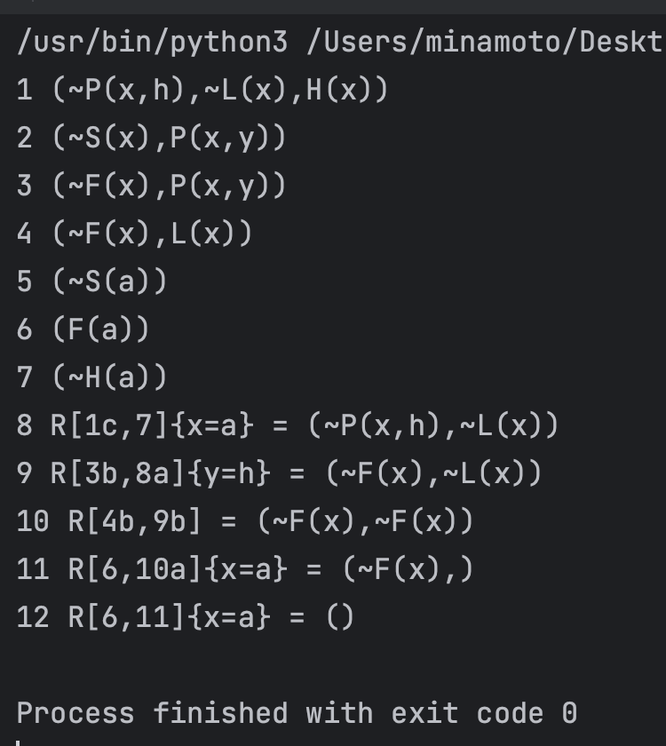

## 知识和知识表示

### 知识

- **数据**一般指单独的事实，是信息的载体
- **信息**由符号组成，如文字和数字，但是对符号赋予了一定的意义，因此有一定的用途或价值
- **知识**是由经验总结升华出来的，因此知识是经验的结晶。知识在信息的基础上增加了上下文信息，提供了更多的意义，**因此也就更加有用和有价值**。知识是随着时间的变化而动态变化的，新的知识可以根据规则和已有的知识推导出来。

知识是经过加工的信息，它包括：

- 事实：是关于对象和物体的知识。
- 规则：是有关问题中与事物的行动、动作相联系的因果关系的知识。
- 元知识：是有关知识的知识，是知识库中的高层知识。
- 常识性知识：泛指普遍存在而且被普遍认识了的客观事实一类知识。

### 策略

策略——关于如何解决问题的政策方略，包括在什么时间、什么地点、由什么主体采取什么行动、达到什么目标、注意什么事项等等一整套完整而具体的行动计划规划、行动步骤、工作方式和工作方法

### 智能

在给定的 问题-问题环境-主体目的 的条件下，**智能**就是有针对性地获取 问题-环境 的**信息**，恰当地对这些**信息**进行处理以**提炼知识**达到认知，在此基础上，把已有的知识与主体的目的信息相结合，合理地产生解决问题的**策略**信息，并利用所得到的策略信息在给定的环境下成功地解决问题达到主体的目的(**行为**)。

省流：信息经加工提炼而成知识，知识被目的激活而成智能。

智能具有 4 个能力：

- 获取有用**信息**的能力
- 由信息生成**知识(认知)**的能力
- 由知识和目的生成**策略(决策)**的能力
- 实施**策略**取得**效果**(**施效**)的能力

### 知识表示语言问题

- **语法**——语言的语法描述了组成语句的可能的搭配关系。
- **语义**——语义定义了语句所指的世界中的事实。

从语法和语义，可以给出使用该语言的 Agent 的必要的推理机制。

基于该推理机制，Agent 可以从已知的语句推导出结论，或判断某条信息是不是已蕴涵在现有的知识当中。

知识表示语言需要：

- 语法规则
- 语义解释
- 用于演绎和推导的规则

知识表示语言应该**支持知识不完全**的情况。不能表达这种不完全性的语言是表达能力不够的语言

!!! info 
    程序设计语言比较善于描述算法和具体的数据结构

### 现代逻辑学的基本研究方法

逻辑学(logic)是研究人类思维规律的科学，而现代逻辑学则是用数学(**符号化、公理化、形式化**)的方法来研究这些规律。

#### 符号化

所谓符号化即是用“一种只作整体认读的记号(signs)”——符号(symbols)表示**量、数及数量关系**。也有用字母、符号表示思维的物理对象、概念对象、判断对象等。

语言化是符号化的初级阶段。

现代逻辑学对思维的研究，需要更加彻底的符号化过程。

#### 公理化

欧氏几何公理系统中的所有概念都有鲜明的直观背景，其公理、定理也都有强烈的客观意义。像欧氏几何这样的公理系统，常被称为具体公理系统。

始于 Aristotle 的逻辑学被符号化、公理化，逐步演化为现代逻辑学。

#### 形式化

所谓形式化，就是彻头彻尾的 “**符号化 + 抽象公理化**”

现代逻辑学形式系统组成：

- 用于将概念符号化的符号语言，通常为一形式语言，包括一符号表 ∑ 及语言的文法，可生成表示对象的语言成分项，表示概念、判断的公式；
- 表示思维规律的逻辑学公理模式和推理规则模式(抽象公理系统)，及其依据它们推演可得到的全部定理组成的理论体系。

## 命题逻辑

!!! abstract
    以下讨论实际上均为**二值逻辑**

### 基本概念

#### 命题

命题是具有真假意义的陈述句。

在特殊的情况下都具有 “真 (True)” 和“假（False)”的意义句子，都是命题。真值——用 T 和 F 表示。

命题有两种类型：

- 原子命题
- 复合命题——由以下内容复合构成的命题：
  - 联结词
  - 标点符号
  - 原子命题

#### 命题逻辑

命题逻辑就是研究命题和命题之间关系的符号逻辑系统。

#### 命题逻辑的符号

命题逻辑的符号：

- 命题常元：True(T) 和 False(F)
- 命题标识符：P、Q、R 等；
- 联结词：
  - ¬（否定）
  - $\land$（合取）
  - $\lor$ （析取）
  - →（蕴含）
  - ↔︎（等价）
- 括号：( )

#### 命题标识符

用 P、Q、R、S 等来表示命题。可分为：

- **命题常量**（表示确定的命题的命题标识符）
- **命题变元**（只表示任意命题的位置标志的命题标识符）
  - 当命题变元表示原子命题时，该变元称为**原子变元**

!!! warning
    因为命题变元可以表示任意命题，所以它不能确定真值，故命题变元不是命题。

#### 联结词

复合命题的意义是命题组成成份的函数。

**联结词的语义**可以定义如下：

- ¬P 为真，当且仅当 P 为假
- $P \land Q$ 为真，当且仅当 P 和 Q 都为真
- $P \lor  Q$ 为真，当且仅当 P 为真，或者 Q 为真
- P → Q 为真，当且仅当 P 为假，或者 Q 为真
- P ↔︎ Q 为真，当且仅当 P→Q 为真，并且 Q→P 为真

### 指派

当命题变元 P 用一个特定的命题取代时，P 才能确定真值，这时也称为对**命题变元** P 进行**指派**

设 G 是公式，A1, ... , An, 为 G 中出现的所有原子命题。**公式** G 的一种**指派**是对 A1, ... , An 赋予的一组真值，其中每个 Ai (i=1 , ... , n) 或者为 T 或者为 F。

公式 G 称为**在一种指派下为真**，当且仅当 G 按该指派算出的真值为 T，否则称为**在该指派下为假**。

!!! abstract
    若在公式中有 n 个不同的原子 A1 , ... , An，那么该公式就有 $2^n$个不同的指派。

### 永真/可满足/永假

公式 $A$ 称为**永真式**或**重言式**(tautology)，如果**对任意**指派 α，α 均**弄真** A，即 α(A)=T 。

公式 $A$ 称为**可满足**的( satisfiable)， 如果**存在**指派 α 使 α(A)=T，否则称 $A$ 为**不可满足**的(unsatisfiable)，或**永假式**。

!!! info 
    永真式是可满足的

当 $A$ 为永真式(永假式)时， $\neg A$ 为永假式(永真式)

### 蕴含/等价

称公式 $A$ **逻辑蕴涵**公式 B，记为 $A\to B$ ，如果所有弄真 $A$ 的指派亦必弄真公式 B

称公式集 $\Gamma$ **逻辑蕴涵**公式 B，记为 $\Gamma \to B$ ，如果弄真 $\Gamma$ 中所有公式的指派亦必弄真公式 B

称公式 $A$ **逻辑等价**公式 B，记为 $A\Leftrightarrow B$ ，如果 $A\to B$ 且 $B\to A$

- 逻辑蕴涵关系具有
  - 自反性
  - 反对称性
  - 传递性
- 逻辑等价关系具有
  - 自反性
  - 对称性
  - 传递性

### 代换

设 A 为含有命题变元 p 的永真式，那么将 A 中 p 的所有出现均代换为命题公式 B，所得公式(称为 A 的代入实例)仍为永真式。

### 替换

设命题公式 $A$ 含有子公式 C (C 为 A 中的符号串，且 C 为命题公式)，如果 $C\Leftrightarrow D$，那么将 $A$ 中子公式 C 的某些出现(未必全部)用 D 替换后所得公式 B 满足 $A\Leftrightarrow B$。

### 合/析 取范式

命题公式 B 称为命题公式 $A$ 的**合取**（或**析取**）**范式**，如果 $B\Leftrightarrow A$，且 B 呈如下形式：

$$
C_1\land C_2\land ...\land C_m(或 C_1\lor C_2\lor ...\lor C_m)\ \ ,\ \ C_i (i=1, 2,...,m)
$$

其中 $C_i$ 形如:

$$
L_1\lor L_2\lor ...\lor L_n (或L_1\land L_2\land ...\land L_n)\ \ ,\ \ L_j(j=l,2,...,n)
$$

其中 $L_i$ 为原子公式或原子公式的否定，并称 $L_j$ 为**文字**。

【定理】

任一命题公式 φ 有其对应的合取(析取)范式。

### 主 合/析 取范式

命题公式 B 称为公式 A 的主合取(或主析取)范式，如果:

- B 是 $A$ 的合取(或析取)范式
- B 中每一子句均有 $A$ 中命题变元的全部出现，且仅出现一次。

!!! abstract
    n 元命题公式的全体可以划分为 $2^{2^n}$ 个等价类，每一类中的公式彼此逻辑等价，并等价于它们共同的主合取范式(或主析取范式)。

## 命题演算形式系统 PC

### 合式公式

$p_l,p_2,p_3,...$为命题逻辑的合式公式

如果 A，B 是公式，那么这些也是命题逻辑的合式公式：

- $(\neg A)$
- $(A→B)$

### 形式系统 PC 的组成

命题逻辑的形式系统 PC 包括 3 条**公理模式** $(A_1-A_3)$ 和 1 条**推理规则**（即**分离规则**）$r_{mp}$：

- $A_1 : A\to(B\to A)$；
- $A_2 : A\to(B\to C)\to (A\to B)\to(A\to C)$；
- $A_3 : (\neg A\to\neg B)\to(B\to A)$；
- $r_{mp}:\frac{A,A\to B}{B}$；

### 证明

称下列**公式序列**为公式 $A$ 在 PC 中的一个**证明**(proof)：

$$
A_1,A_2,...,A_m(=A)
$$

其中 $A_i (i=1,2,...,m)$

- 或者是 PC 的公理
- 或者是 $A_j (j\lt i)$
- 或者是由 $A_j,A_k (j,k\lt i)$ 使用分离规则所导出
- $A_m =A $

### 定理

称 $A$ 为 PC 中的定理，记为 $\vdash_{PC} A$，如果公式 $A$ 在 PC 中有一个证明。

!!! abstract
    $\vdash$ (`\vdash`) 断定符，表示可被推导出，可被证明

$\vDash A$ (`\vDash`) 表示 $A$ 永真

### 演绎

设 $\Gamma$ 为一公式集，称以下公式序列为公式 $A$ 的，以 $\Gamma$ 为前提的**演绎**：

$$
A_1,A_2,...,A_m=A\ \ ,\ \  A_i (i=1,2,...,m)
$$

其中 $A_i$ 满足：

- 或者是 PC 的公理
- 或者是 $\Gamma$ 的成员
- 或者是 $A_j (j<i)$
- 或者是由 $A_j, A_k (j,k\lt i)$ 使用分离规则所导出
- $A_m=A$

### 带前提的演绎

称 $A$ 为前提 $\Gamma$ 的演绎结果，如果公式 $A$ 有以 $\Gamma$ 为前提的演绎。记为：

$$
\Gamma\vdash_{PC}A
$$

若 $\Gamma=\{B\}$， $\Gamma\vdash_{PC}A$ 可以表示为：

$$
B\vdash_{PC}A
$$

若 $B\vdash_{PC}A$， $A\vdash_{PC}B$ 则记为：

$$
A\vdash\dashv B
$$

### 演绎定理

对应离散数学课程中的“附加前提证明法”

对 PC 中任意公式集 $\Gamma$ 和公式 $A,B$ ：

$$
\Gamma\cup\{A\}\vdash_{PC}B\Leftrightarrow\Gamma\vdash_{PC}(A\to B)
$$

### 可靠性定理

PC 是可靠的，即对任意公式集 $\Gamma$ 及公式 $A$ ：

$$
\Gamma\vdash A\to \Gamma\vDash A
$$

特别地，若 $A$ 为 PC 的定理 $(\vdash A)$ ，则 $A$ 永真 $(\vDash A)$ :

$$
\vdash A\to \vDash A
$$

### 一致性定理

PC 是一致的(consistent)，即不存在公式 A，使得 $A$ 与 $\neg A$ 均为 PC 之定理。

### 完全性定理

PC 是完全的，即对任意公式集 $\Gamma$ 和公式 $A$ ：

$$
\Gamma\vDash A\to \Gamma\vdash A
$$

特别地，若 $A$ 永真 $(\vDash A)$ ，A 必为 PC 的定理 $(\vdash A)$：

$$
\vDash A\to \vdash A
$$

## 谓词逻辑

谓词逻辑的语法元素表示如下。

- 常量符号: A、B、张三、李四 等，通常是对象名称
- 变量符号: 通常用小写字母表示，如 x、 y、z 等
- 函数符号: 通常用**小写**英文字母或小写英文字母串表示，如 plus、f、g
  - 一元函数、二元函数、...... n 元函数
- 谓词符号: 通常用**大写**英文字母或(首字母)大写英文字母串表示
  - 一元谓词、二元谓词、...... n 元谓词
- 联结词: ......
- 量词 :全称量词 $\forall$、存在量詞 $\exists$， $\forall x$ 表示 “対个体域中所有 $x$”、$\exists x$ 表示“在个 体域中存在个体 $x$ ”。$\forall$ 和 $\exists$ 后面跟的 $x$ 叫作量词的**指导变元**

!!! info 
    一般一元谓词表达了个体的性质，而多元谓词表达了个体之间的关系

### 谓词的阶

如果谓词 P 中的所有个体都是：

- 个体常量
- 变元
- 函数

则该谓词为**一阶谓词**，如果某个个体本身又是一个一阶谓词，则称 $P$ 为**二阶谓词**，以此类推递归定义 **$n$ 阶谓词**

### 项

项可递归定义如下：

1. 单独一个个体是项(包括常量和变量)
2. 若 $f$ 是 $n$ 元函数符号，而 $t_1,t_2,...,t_n$ 是项，则 $f(t_1,t_2,...,t_n)$ 是项
3. 任何项仅由规则(1)、(2)生成。

### 原子公式

若 $P$ 为 $n$ 元谓词符号，$t_1,t_2,...,t_n$ 都是项，则称 $P(t_1,t_2,...,t_n)$ 为原子公式。在原子公式中，若 $t_1,t_2,...,t_n$ 都不含变量，则 $P(t_1,t_2,...,t_n)$ 是命题。

## 归结推理

### 最一般合一算法

给定公式集 $S=\{S_1,S_2\}$ 进行合一，就是对 $S_1,S_2$ 进行合一。

DEMO：$S=\{P(a,x,f(g(y))),P(z,h(z,u),f(u))\}$：

1. 令
   - $\delta_0=\epsilon$；
   - $W_0=S=\{P(a,x,f(g(y))),P(z,h(z,u),f(u))\}$；
   - $D_0=\{a,z\}$；
2. 令
   - $\delta_1=a/z$；
   - $W_1=\{P(a,x,f(g(y)),P(a,h(a,u),f(u))\}$；
   - $W_1$ 未合一，令 $D_1=\{x,h(a,u)\}$；
3. 令
   - $\delta_2=\{a/z,h(a,u)/x\}$；
   - $W_2=\{P(a,h(a,u),f(g(y))),P(a,h(a,u),f(u))\}$；
   - $W_2$ 未合一，令 $D_2=\{g(y),u\}$；
4. 令
   - $\delta_3=\{a/z,h(a,u)/x,u/g(y)\}$；
   - $W_3=\{P(a,h(a,u)f(u)),P(a,h(a,u),f(u))\}$；
   - $W_3$ 合一。所以 $\delta_3=\{a/z,h(a,u)/x,u/g(y)\}$ 为最一般合一。

### 归结推理解题步骤

求证一个目标 $G$ 时，利用**归结反演**：若子句集 $S$ 是不可满足的，则可以使用归结规则由 $S$ 产生空子句 NIL ，具体解题步骤：

1. 谓词公式表示问题

   1. （optional，定义常量）

   2. 定义谓词

   3. 将前提表示成谓词公式

      - 规则：

        $R_1:\cdots$

        $R_2:\cdots$

        ......

      - 事实

   4. 将要求证的问题表示成谓词公式

      - $G=\cdots$ （target）

2. 问题化为子句集

   1. $R_1:\cdots \Rightarrow S_1=\dots$，

      $R_1:\cdots \Rightarrow S_1=\cdots$，

      ......

   2. 事实：$S_i=\cdots$

   3. 目标：$S_{\sim G}=\cdots$（:warning:注意是 $\sim G$:warning:）

   4. 得到 $S=S_1\cup S_2\cup\cdots\cup S_{\sim G}=\{\cdots\lor\cdots,\cdots\}$。

3. 利用归结原理进行归结
   $$
   \begin{aligned}
   &(1) S_1\\
   &(2) S_2\\
   &\cdots\\
   &(k)\cdots  &(1)(2)\text{归结}&,\sigma=\{a/x,b/y\}\\
   &(k+1)\cdots  &(3)(k)\text{归结}&,\sigma=\{c/u,d/v\}\\
   &\cdots\\
   &\text{NIL}
   \end{aligned}
   $$

### 搜索策略

对子句集进行归结时，一个关键问题是决定**选取哪两个子句作归结**，为此需要研究有效的归结控制策略。

#### 排序策略

假设原始子句(包括待证明合式公式的否定的子句)称为 $0$ 层归结式。$(i+1)$ 层的归结式是一个 $i$ 层归结式和一个 $j(j≤i)$ 层归结式进行归结所得到的归结式。

##### 宽度优先

宽度优先就是先生成第 $1$ 层所有的归结式，然后是第 $2$ 层所有的归结式，以此类推，直到产生空子句结束，或不能再进行归结为止。

##### 深度优先

深度优先是产生一个第 $1$ 层的归结式，然后用第 $1$ 层的归结式和第 $0$ 层的归结式进行归结，得到第 $2$ 层的归结式，直到产生空子句结束，否则，用第 $2$ 层及其以下各层进行归结，产生第 $3$ 层，以此类推。

##### 单元优先

单元优先(unit preference)策略，即在归结过程中优先考虑仅由一个文字构成的子句，这样的子句称为单元子句。

#### 精确策略

精确策略不涉及被归结子句的排序，它们只允许某些归结发生。

##### 支持集

支持集(set of support)策略，实际是一种目标制导的反向推理

每次归结时，参与归结的子句中至少应有一个是:

- 由目标公式的否定得到的子句
- 或者是它们的后裔

所谓后裔是说，如果 $S_i$ 是 $S_{i+1}$ 与另外某子句的归结式，或者 $S_{i+1}$ 是 $S_i$ 的后裔与其他子句的归结式，则称 $S_{i+1}$ 是 $S_i$ 的后裔， $S_i$ 是 $S_{i+1}$ 的祖先。

支持集策略是**完备的**，即假如对一个不可满足的子句集合运用支持集策略进行归结，那么最终会导出空子句。

##### 线性输入

线性输人(linear input)策略中参与归结的两个子句中至少有一个是原始子句集中的子句(包括那些待证明的合式公式的否定)。

线性输人策略是**高效的**，但是**不完备的**，如子句集合 $\{P\lor Q,\ P\lor \sim Q,\ \sim P\lor Q,\ \sim P\lor \sim Q\}$ 不可满足，但是无法用线性输入归结推出。

##### 线性归结

在归结过程中，除第一次归结都用给定的子句集中的子句外，其后每次归结则至少要有一个亲本子句是上次归结的结果。线性归结策略是**完备的**，**高效的**

##### 祖先过滤

由于线性输入策略是不完备的，改进该策略得到祖先过滤(ancestry filtering)策略，该策略是**完备的**而且是**高效的**。参与归结的两个子句中：

- 至少有一个是初始子句集中的句子
- 或者一个子句是另一个子句的祖先

##### 单元归结

不完备但是高效，与单元优先的区别在于每次**只考虑**单元子句进行归结。

### 例题

实际上是我的作业

#### 不是兄弟

已知:

- 规则 1:任何人的兄弟不是女性
- 规则 2:任何人的姐妹必是女性
- 事实:Mary 是 Bill 的姐妹

用归结推理方法证明 Mary 不是 Tom 的兄弟

---

定义谓词：

- $F(x)$ : $x$ 是女性；(female)
- $M(x)$ : $x$ 是男性；(male)
- $B(x,y)$ : $x$ 是 $y$ 的兄弟; (brother)
- $S(x,y)$ : $x$ 是 $y$ 的姐妹; (sister)

问题用谓词公式表示：

$$
\begin{aligned}
&R_1:(\forall x)(\forall y)(B(x,y)\to\sim F(x))\\
&R_2:(\forall x)(\forall y)(S(x,y)\to F(x))\\
&Fact:(S(Marry,Bill))\\
&\Rightarrow\\
&G:\sim B(Marry,Tom)
\end{aligned}
$$

再将问题化为子句集：

$$
\begin{aligned}
&R_1:S_1=\{\sim B(x,y)\lor\sim F(x)\}\\
&R_2:S_2=\{\sim S(x,y)\lor F(x)\}\\
&Fact:S_3=\{S(Marry,Bill)\}\\
&\sim G:S_4=S_{\sim G}=\{B(Marry,Tom)\}\\
&S=S_1\cup S_2\cup S_3\cup S_4
\end{aligned}
$$

归结过程：

$$
\begin{aligned}
(1)& \sim B(x,y)\lor\sim F(x)\\
(2)& \sim S(x,y)\lor F(x)\\
(3)& S(Marry,Bill)\\
(4)& B(Marry,Tom)\\
(5)& \sim F(x) &(1)(4)\text{归结}&,\sigma=\{Marry/x,Tom/y\}\\
(6)& \sim S(x,y) &(2)(5)\text{归结}&\\
(7)&\text{NIL}&(3)(6)\text{归结}&,\sigma=\{Marry/x,Bill/y\}\\
\end{aligned}
$$

程序验证：


#### John 偷东西

用谓词逻辑的子句集表示下述刑侦知识，并用反演归结的支持集策略证明结论。

(1) 用子句集表示下述知识。

1. John 是贼;
2. Paul 喜欢酒 (wine);
3. Paul(也) 喜欢奶酪 (cheese);
4. 如果 Paul 喜欢某物，则 John 也喜欢;
5. 如果某人是贼，而且喜欢某物，则他就可能会偷窃该物。

(2) 求:John 可能会偷窃什么?

##### 用子句集表示知识

定义常量：

- $John$
- $Paul$
- $wine$：酒
- $cheese$：奶酪

定义谓词：

- $T(x)$ : $x$ 是贼；(thief)
- $L(x,y)$ : $x$ 喜欢 $y$ ；(like)
- $S(x,y)$ : $x$ 可能会偷窃 $y$ ; (stole)

用谓词逻辑的子句集表示：

$$
\begin{aligned}
&S_1=\{T(John)\}\\
&S_2=\{L(Paul,wine)\}\\
&S_3=\{L(Paul,cheese)\}\\
&S_4=\{\sim L(Paul,x)\lor L(John,x)\}\\
&S_5=\{\sim T(x)\lor\sim L(x,y)\lor S(x,y)\}
\end{aligned}
$$

##### 求解问题

> 这个 $ANSWER(z)$ 是我按照网上答案做的，实际上我觉得不需要这么麻烦，用 $S(John,z)$ 就可以了...

定义谓词 $ANSWER(z)$ : $z$ 是所求问题的一个答案；

则问题 "John 可能会偷窃什么?" 可以表示为 $S(John,z)\to ANSWER(z)$ 也就是析取式： $\sim S(John,z)\lor ANSWER(z)$

所有可能的答案包括：

- $ANSWER(wine)$
- $ANSWER(cheese)$

证明 $G=ANSWER(wine)\land ANSWER(cheese)$ 问题，化为子句集：

$$
\begin{aligned}
&S_1=\{T(John)\}\\
&S_2=\{L(Paul,wine)\}\\
&S_3=\{L(Paul,cheese)\}\\
&S_4=\{\sim L(Paul,x)\lor L(John,x)\}\\
&S_5=\{\sim T(x)\lor\sim L(x,y)\lor S(x,y)\}\\
&S_6=\{\sim S(John,z)\lor ANSWER(z)\}\\
&S_7=S_{\sim G}=\sim ANSWER(wine)\lor\sim ANSWER(cheese)\\
&S=S_1\cup\cdots\cup S_7
\end{aligned}
$$

支持集策略归结过程：

$$
\begin{aligned}
(1)& T(John)\\
(2)& L(Paul,wine)\\
(3)& L(Paul,cheese)\\
(4)& \sim L(Paul,x)\lor L(John,x)\\
(5)& \sim T(x)\lor\sim L(x,y)\lor S(x,y)\\
(6)& \sim S(John,z)\lor ANSWER(z)\\
(7)& \sim ANSWER(wine)\lor\sim ANSWER(cheese)\\
(8)& \sim T(John)\lor\sim L(John,z)\lor ANSWER(z)
&(5)(6)\text{归结}&,\sigma=\{John/x,z/y\}\\
(9)& \sim T(John)\lor\sim L(Paul,z)\lor ANSWER(z)
&(4)(8)\text{归结}&,\sigma=\{z/x\}\\
(10)& \sim L(Paul,z)\lor ANSWER(z)
&(1)(9)\text{归结}\\
(11)& ANSWER(wine)
&(2)(10)\text{归结}&,\sigma=\{wine/z\}\\
(12)& \sim ANSWER(cheese)
&(7)(11)\text{归结}\\
(13)& ANSWER(cheese)
&(3)(10)\text{归结}&,\sigma=\{cheese/z\}\\
(14)& \text{NIL}
&(12)(13)\text{归结}
\end{aligned}
$$

可证得：John 可能会偷酒（wine）和奶酪（cheese）

程序验证：


#### 小张是快乐的

任何通过了历史考试并中了彩票的人都是快乐的。任何肯学习或幸运的人都可以通过所有考试，小张不学习，但很幸运，任何人只要是幸运的，就能中彩。

求证:小张是快乐的。

---

定义常量；

- $a$ 表示小张
- $h$ 表示历史考试（history）

定义谓词：

- $P(x,y)$ : $x$ 可以通过考试 $y$（pass）
- $F(x)$ : $x$ 是幸运的（fortune）
- $S(x)$ : $x$ 肯学习（study）
- $H(x)$ : $x$ 是快乐的（happy）
- $L(x)$ : $x$ 中了彩票（lottery）

用谓词公式表示问题：

$$
\begin{aligned}
& R_1:(\forall x)(P(x,h)\land L(x)\to H(x))\\
& R_2:(\forall x)(S(x)\to(\forall y)(P(x,y)))\\
& R_3:(\forall x)(F(x)\to(\forall y)(P(x,y)))\\
& R_4:(\forall x)(F(x)\to L(x))\\
& F_1:\sim S(a)\\
& F_2:F(a)
\end{aligned}
$$

求证目标为：

$$
G:H(a)
$$

反演归结，将问题表示为子句集：

$$
\begin{aligned}
& S_1=\{\sim P(x,h)\lor\sim L(x)\lor H(x)\}\\
& S_2=\{\sim S(x)\lor P(x,y)\}\\
& S_3=\{\sim F(x)\lor P(x,y)\}\\
& S_4=\{\sim F(x)\lor L(x)\}\\
& S_5=\{\sim S(a)\}\\
& S_6=\{F(a)\}\\
& S_7=S_{\sim G}=\{\sim H(a)\}\\
& S=S_1\cup\cdots\cup S_7
\end{aligned}
$$

归结推理过程；

$$
\begin{aligned}
(1)& \sim P(x,h)\lor\sim L(x)\lor H(x)\\
(2)& \sim S(x)\lor P(x,y)\\
(3)& \sim F(x)\lor P(x,y)\\
(4)& \sim F(x)\lor L(x)\\
(5)& \sim S(a)\\
(6)& F(a)\\
(7)& \sim H(a)\\
(8)& P(a,y)
&(3)(6)\text{归结}&,\sigma=\{a/x\}\\
(9)& L(a)
&(4)(6)\text{归结}&,\sigma=\{a/x\}\\
(10)& \sim L(a)\lor H(a)
&(1)(8)\text{归结}&,\sigma=\{a/x,h/y\}\\
(11)& H(a)
&(9)(10)\text{归结}\\
(12)& \text{NIL}
&(7)(11)\text{归结}
\end{aligned}
$$

由此证得了：小张是快乐的。

程序验证：



### 程序实现

实际上是我的作业

```python
import queue
def parse(KB: str):
    KB = KB.replace("{(", "").replace(")}", "")
    items = KB.split("),(")
    resolution_steps = map(lambda x: f'{items.index(x) + 1} ({x})', items)
    clauses = []
    for item in items:
        if item.endswith(')'):
            item = item[:-1]
        clause = []
        elements = item.split("),")
        if elements[-1] ** '':
            elements.pop()
        for i in range(len(elements)):
            key, value = elements[i].split("(")
            clause.append([key, value.split(',')])
        clauses.append(clause)
    return clauses, list(resolution_steps)

def MGU(l1, l2):
    variants = ('x', 'y', 'z', 'u', 'v', 'w', 'xx', 'yy', 'zz', 'uu', 'vv', 'ww')
    dimension = len(l1)
    mapdict = {}
    for i in range(dimension):
        if l1[i] in variants and l2[i] not in variants:
            if mapdict.get(l1[i]) is None or mapdict[l1[i]] ** l2[i]:
                mapdict[l1[i]] = l2[i]
            else:
                return None
        elif l1[i] not in variants and l2[i] in variants:
            if mapdict.get(l2[i]) is None or mapdict[l2[i]] ** l1[i]:
                mapdict[l2[i]] = l1[i]
            else:
                return None
        elif l1[i] not in variants and l2[i] not in variants and l1[i] != l2[i]:
            return None
        else:
            if l1[i] != l2[i]:
                mapdict[l1[i]] = l2[i]
    return mapdict

## 以下是广度优先搜索策略

def resolve(c1, c2):
    list_c1keys = [sublist[0] for sublist in c1]
    list_c2keys = [sublist[0] for sublist in c2]
    for i in range(len(list_c1keys)):
        c1key: str = list_c1keys[i]
        idx_c1key = i
        flag = c1key.startswith('~')
        if flag:
            complement = c1key[1:]
        else:
            complement = '~' + c1key
        if complement in list_c2keys:
            idx_complement = list_c2keys.index(complement)
            mapdict = None
            if c1[idx_c1key][1] != c2[idx_complement][1]:
                result = MGU(c1[idx_c1key][1], c2[idx_complement][1])
                if result is None:
                    return None
                else:
                    mapdict = result
            if len(c1) > 1:
                char1 = chr(ord('a') + idx_c1key)
            else:
                char1 = '0'
            if len(c2) > 1:
                char2 = chr(ord('a') + idx_complement)
            else:
                char2 = '0'
            c1_to_del = list(c1)
            c2_to_del = list(c2)
            del c1_to_del[idx_c1key]
            del c2_to_del[idx_complement]
            c1_to_del.extend(c2_to_del)
            return c1_to_del, char1, char2, mapdict
    return None

def resolution(KB: str):
    clauses, resolution_steps = parse(KB)
    steps_idx = list(range(1, len(clauses) + 1))
    min_len = len(clauses)
    while True:
        l = len(clauses)
        for i in range(len(clauses)):
            for j in range(i + 1, len(clauses)):
                if i ** j:
                    continue
                result = resolve(clauses[i], clauses[j])
                if result is None:
                    continue
                resolvent = result[0]
                if resolvent is None or resolvent in clauses:
                    continue
                clauses.append(resolvent)
                steps_idx.append([i, j])
                char1 = result[1]
                char2 = result[2]
                mapdict = result[3]
                if char1 ** '0' and char2 ** '0':
                    pre_string = f"R[{i + 1},{j + 1}]"
                elif char1 != '0' and char2 ** '0':
                    pre_string = f"R[{i + 1}{char1},{j + 1}]"
                elif char1 ** '0' and char2 != '0':
                    pre_string = f"R[{i + 1},{j + 1}{char2}]"
                else:
                    pre_string = f"R[{i + 1}{char1},{j + 1}{char2}]"
                map_string = ''
                if mapdict is not None:
                    pairs = []
                    for key, value in mapdict.items():
                        pairs.append(f"{key}={value}")
                    map_string = "{" + ",".join(pairs) + "}"
                result_string = ''
                for [key, value] in resolvent:
                    result_string += f'{key}({",".join(value)}),'
                if len(resolvent) > 1:
                    result_string = result_string[:-1]
                result_string = f'({result_string})'
                resolution_steps.append(f"{len(resolution_steps) + 1} {pre_string}{map_string} = {result_string}")
                if len(resolvent) ** 0:
                    return resolution_steps, steps_idx, min_len
        if l ** len(clauses):
            return None

def simplify_steps(steps, steps_idx, min_len):
    q = queue.Queue()
    not_del = [len(steps) - 1]
    q.put(steps_idx[len(steps) - 1][0])
    q.put(steps_idx[len(steps) - 1][1])
    while not q.empty():
        i = q.get()
        if i < min_len:
            continue
        not_del.append(i)
        q.put(steps_idx[i][0])
        q.put(steps_idx[i][1])
    for i in range(len(steps) - 1, min_len - 1, -1):
        if i not in not_del:
            del steps[i]
    num_map = dict()
    for i in range(len(steps)):
        num = (steps[i].split(' '))[0]
        num_map[num] = f'{i+1}'
        for t in list(num_map.keys()):
            steps[i] = steps[i].replace(t, num_map[t])
    return steps

def ResolutionFOL(KB):
    result = resolution(KB)
    if result is None:
        print("Can't be resolved!")
    else:
        (steps, steps_idx, min_len) = result
        steps = simplify_steps(steps, steps_idx, min_len)
        for step in steps:
            print(step)

if __name__ ** '__main__':
    KB0 = "{(GradStudent(sue),),(~GradStudent(x),Student(x)),(~Student(x),HardWorker(x)),(~HardWorker(sue),)}"
    KB1 = "{(A(tony),),(A(mike),),(A(john),),(L(tony,rain),),(L(tony,snow),),(~A(x),S(x),C(x)),(~C(y),~L(y,rain)),(L(z,snow),~S(z)),(~L(tony,u),~L(mike,u)),(L(tony,v),L(mike,v)),(~A(w),~C(w),S(w))}"
    KB2 = "{(On(tony,mike),),(On(mike,john),),(Green(tony),),(~Green(john),),(~On(xx,yy),~Green(xx),Green(yy))}"
    KB3 = "{(~B(x,y),~F(x)),(~S(x,y),F(x)),(S(Marry,Bill)),(B(Marry,Tom))}"
    KB4 = "{(T(John),),(L(Paul,wine),),(L(Paul,cheese),),(~L(Paul,x),L(John,x)),(~T(x),~L(x,y),S(x,y)),(~S(John,z),ANSWER(z)),(~ANSWER(wine),~ANSWER(cheese))}"
    KB5 = "{(~P(x,h),~L(x),H(x)),(~S(x),P(x,y)),(~F(x),P(x,y)),(~F(x),L(x)),(~S(a)),(F(a)),(~H(a))}"
    ResolutionFOL(KB0)
    print("\x1B[31m--------------------\x1B[m")
    ResolutionFOL(KB1)
    print("\x1B[31m--------------------\x1B[m")
    ResolutionFOL(KB2)
    print("\x1B[31m--------------------\x1B[m")
    ResolutionFOL(KB3) ## 不是兄弟
    print("\x1B[31m--------------------\x1B[m")
    ResolutionFOL(KB4) ## John偷东西
    print("\x1B[31m--------------------\x1B[m")
    ResolutionFOL(KB5) ## 小张是快乐的


## 以下为单元归结策略

def resolve_2(c1, c2):
    list_c1keys = [sublist[0] for sublist in c1]
    list_c2keys = [sublist[0] for sublist in c2]
    c1key: str = list_c1keys[0]
    idx_c1key = list_c1keys.index(c1key)
    flag = c1key.startswith('~')
    if flag:
        complement = c1key[1:]
    else:
        complement = '~' + c1key
    if complement in list_c2keys:
        idx_complement = list_c2keys.index(complement)
        mapdict = None
        if c1[idx_c1key][1] != c2[idx_complement][1]:
            result = MGU(c1[idx_c1key][1], c2[idx_complement][1])
            if result is None:
                return None
            else:
                mapdict = result
        if len(c1) > 1:
            char1 = chr(ord('a') + idx_c1key)
        else:
            char1 = '0'
        if len(c2) > 1:
            char2 = chr(ord('a') + idx_complement)
        else:
            char2 = '0'
        c2_to_del = list(c2)
        del c2_to_del[idx_complement]
        return c2_to_del, char1, char2, mapdict
    return None

def resolution_2(KB: str):
    clauses, resolution_steps = parse(KB)
    singles = set()
    for i in range(len(clauses)):
        if len(clauses[i]) ** 1:
            singles.add(i)
    while True:
        l = len(clauses)
        for i in range(len(clauses)):
            if i not in singles:
                continue
            for j in range(len(clauses)):
                if i ** j:
                    continue
                result = resolve_2(clauses[i], clauses[j])
                if result is None:
                    continue
                resolvent = result[0]
                if resolvent is None or resolvent in clauses:
                    continue
                clauses.append(resolvent)
                char1 = result[1]
                char2 = result[2]
                mapdict = result[3]
                if char1 ** '0' and char2 ** '0':
                    pre_string = f"R[{i + 1},{j + 1}]"
                elif char1 != '0' and char2 ** '0':
                    pre_string = f"R[{i + 1}{char1},{j + 1}]"
                elif char1 ** '0' and char2 != '0':
                    pre_string = f"R[{i + 1},{j + 1}{char2}]"
                else:
                    pre_string = f"R[{i + 1}{char1},{j + 1}{char2}]"
                map_string = ''
                if mapdict is not None:
                    pairs = []
                    for key, value in mapdict.items():
                        pairs.append(f"{key}={value}")
                    map_string = "{" + ",".join(pairs) + "}"
                result_string = ''
                for [key, value] in resolvent:
                    result_string += f'{key}({",".join(value)}),'
                if len(resolvent) > 1:
                    result_string = result_string[:-1]
                result_string = f'({result_string})'
                resolution_steps.append(f"{len(resolution_steps) + 1} {pre_string}{map_string} = {result_string}")
                if len(resolvent) ** 0:
                    return resolution_steps
                elif len(resolvent) ** 1:
                    singles.add(len(clauses) - 1)
        if l ** len(clauses):
            return None

def ResolutionFOL_2(KB):
    result = resolution_2(KB)
    if result is None:
        print("Can't be resolved!")
    else:
        for step in result:
            print(step)
```
