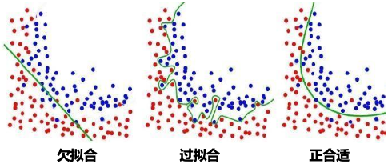

## 概述

### 机器学习范式

- 监督学习（归纳学习）
  - 给定训练数据 training data
  - 和期望的输出（标签）desired outputs (with labels)
- 半监督学习
  - 给定训练数据 training data
  - 和部分期望的输出 some labels
- 无监督学习
  - 仅给定训练数据 training data
  - without labels
- 强化学习 Reinforce Learning (RL)
  - 从序列决策中获取奖励 observations and periodic rewards as the agent takes sequential actions;

#### 监督学习

##### 回归问题

给定 $(x_1,y_1),(x_2, y_2),\cdots,(x_n,y_n)$ ，学习一个函数 $f(x)$ 能够根据输入 $x$ 预测 $y$ ，其中 $y$ 为**数值**，即**回归**。

##### 分类问题

给定 $(x_1,y_1),(x_2, y_2),\cdots,(x_n,y_n)$ ，学习一个函数 $f(x)$ 能够根据输入 $x$ 预测 $y$ ，其中 $y$ 为**类别**，即**分类**。

##### 聚类问题

给定 $x_1,x_2,\cdots,x_n$（无标签），$x$ 是多维的，每一维对应一个属性，输出 $x$ 的隐变量

#### 无监督学习

独立分量分析（ICA）：一种用于分离混合信号中不同独立源的方法

e g :

- 构建计算集群
- 社交网络分析
- 天文数据分析
- 市场分割

#### 强化学习

输入一组包括状态、动作、延迟奖励的序列，输出一个策略

策略是一个从状态到行动的映射函数，表明每个状态下所采取的行动或行动的分布

e g ：

- 分配问题
- 游戏 AI
- 机器人走迷宫
- 控制平衡问题

### 机器学习归纳

现如今已有数以万计的机器学习算法，每年仍有数百种新方法。万变不离其宗，每种机器学习都由以下三部分组成：

- 表征（模型）
- 优化 / 搜索
- 评估

#### 表征(模型)

##### 数值函数

线性回归

神经网络

支持向量机

##### 符号函数

决策树

命题逻辑中的规则

一阶谓语逻辑中的规则

##### 基于实例的函数

最近邻

基于案例求解

##### 概率图解模型

朴素贝叶斯

贝叶斯网络

隐性马尔可夫模型（HMMs）

概率上下文自由语法（PCFGs）

马尔可夫网络

#### 优化/搜索

##### 梯度下降

感知机

反向传播算法

##### 动态编程

HMM 学习

PCFG 学习

##### 分而治之

决策树归纳法

规则学习

##### 进化计算

遗传算法（GA）

遗传编程（GP）

神经进化算法

#### 评估方法

准确率

精度和召回率

均方误差

先验概率

后验概率

成本/效率

边际效用

熵

KL 散度

......

#### 一些经验

机器学习可以被看作是利用直接或间接的经验来逼近一个选定的目标函数。

函数近似可以看作是在假定的空间（函数的表征）中寻找最适合一组参数。

不同的学习方法设定不同的假定空间（表征语言）和 / 或 采用不同的搜索技术

## 基本方法

机器学习的开发流程：

1. 数据搜集
2. 数据清洗
3. 特征工程
4. 数据建模

### 模型

机器学习首先要考虑使用什么样的模型，直观理解就是使用什么分布函数拟合数据。

模型的类别，大致有两种：

- 概率模型 (Probabilistic Model)
  - 决策树、朴素贝叶斯、隐马尔科夫模型、高斯混合模型
- 非概率模型 (Non-Probabilistic Model)
  - 感知机、支持向量机、KNN、AdaBoost、K-means 以及神经网络

### 损失函数

- 0-1 损失函数 (0-1 Loss Function)
  $$
  L(Y,f(X))=\begin{cases}
  1,Y\ne f(x)\\
  0,Y=f(X)
  \end{cases}
  $$
- 平方损失函数 (Quadratic Loss Function)
  $$
  L(Y,f(X))=(Y-f(X))^2
  $$
- 绝对损失函数 (Absolute Loss Function)
  $$
  L(Y,f(X))=|Y-f(X)|
  $$
- 对数损失函数 (Logarithmic Loss Function)
  $$
  L(Y,P(Y|X))=-\log P(Y|X)
  $$

根据上述损失函数模型，我们可知，损失函数值越小，模型性能越好。给定一个数据集，我们将训练数据集的平均损失称为**经验风险**。

基于经验风险最小化原则，可构建全局损失函数求解最优化问题：

$$
\min_{f}\frac{1}{N}\sum_{n=1}^{N}L(y_n,f(x_n))
$$

当样本数量足够大时，根据大数定理，经验风险会近似于模型的期望风险。此时，经验风险最小化能确保有好的学习性能。

然而，当样本数量不足时，单单利用经验风险最小化可能会导致 “**过拟合**” 的问题。为此，我们在原有基础上加上用于控制模型复杂度的**正则项** (Regularizer)，得到结构最小化准则。

### 优化算法

定义了损失函数计算 loss 之后，问题就转化为了求 loss 最小化的问题；如何使得 loss 最小化？就需要使用优化算法。

算法指的是模型学习中的具体计算方法。

一般来说，基于参数模型构建的统计学习问题都为最优化问题，它们都具有显式的解析解。

现有的优化方法主要有：

- 梯度下降法:star:
  - 一阶导数为 0 的点，不断下降寻找极小值
- 牛顿法
- 拟牛顿法
- ADAM
- ......

## 回归

### 损失函数

$y^{(i)}$ 和 $\hat{y}^{(i)}$ 分别表示第 $i$ 个样本的真实值和预测值， $m$ 为样本个数

#### MSE

均方误差(Mean Square Error, MSE)

$$
MSE(y,\hat y)=\frac 1m \sum_{i=1}^m (y^{(i)}-\hat{y}^{(i)})^2
$$

#### RMSE

均方根误差(Root Mean Square Error, RMSE)

$$
RMSE(y,\hat y)=\sqrt{\frac 1m \sum_{i=1}^m (y^{(i)}-\hat{y}^{(i)})^2}
$$

#### MAE

平均绝对误差(Mean Absolute Error, MAE)

$$
MAE(y,\hat y)=\frac 1m \sum_{i=1}^m |y^{(i)}-\hat{y}^{(i)}|
$$

### 线性回归

线性回归（Linear Regression）

是一种通过属性的线性组合来进行**预测**的线性模型，其目的是找到一条直线或者一个平面或者更高维的超平面，使得预测值与真实值之间的误差最小化。

- **损失函数**（Loss Function）度量单样本预测的错误程度，损失函数值越小，模型就越好。
- **代价函数**（Cost Function）度量全部样本集的平均误差。常用的代价函数包括均方误差、均方根误差、平均绝对误差等。
- **目标函数**（Object Function）代价函数和正则化函数，最终要优化的函数。
- **学习率** $\alpha$ ，可以理解为**步长**：


### 梯度下降

- 批量梯度下降 BGD（Batch Gradient Descent）
  - 梯度下降的**每一步**中，都用到了**所有**的训练样本
- 随机梯度下降 SGD（Stochastic Gradient Descent）
  - 梯度下降的**每一步**中，用到**一个**样本，在每一次计算之后便更新参数 ，而不需要首先将所有的训练集求和
- 小批量梯度下降 MBGD（Mini-Batch Gradient Descent）
  - 梯度下降的**每一步**中，用到了**一定批量**的训练样本

$$
w_{j}:=w_{j}-\alpha\frac{1}{b}\sum_{k=i}^{i+b-1}\big(h\big(x^{(k)}\big)-y^{(k)}\big)x_{j}^{(k)}
$$

$b=1$ 为随机梯度下降 (SGD, Stochastic Gradient Descent)

$b=m$ 为批量梯度下降 (BGD, Batch Gradient Descent)

$b=batch\_ size$ 为小批量梯度下降 (MBGD, Mini-Batch Gradient Descent)

归一化

数据归一化的目的是使得各特征对目标变量的影响一致，会将特征数据进行伸缩变化，所以数据归一化是会改变特征数据分布的

将数据映射到 $[0,1]$ 区间

Z-Score

数据标准化为了不同特征之间具备可比性，经过标准化变换之后的特征数据分布没有发生改变。

就是当数据特征取值范围或单位差异较大时，最好是做一下标准化处理

处理后的数据均值为 0，方差为 1



### 过拟合的处理

#### 交叉验证

交叉验证 Cross Validation

最常见的缓解过拟合问题的方法，将数据集分为训练用的和测试用的两份数据集（大多是 训练:测试 = 9:1 ）

多重交叉验证 N-fold Cross Validation

!!! abstract
    迁移学习

#### 获得更多的训练数据

使用更多的训练数据是解决过拟合问题最有效的手段，因为更多的样本能够让模型学习到更多更有效的特征，减小噪声的影响

#### 降维

即丢弃一些不能帮助我们正确预测的特征。可以是手工选择保留哪些特征，或者使用一些模型选择的算法来帮忙（例如 PCA）。

#### 正则化

正则化 (regularization)的技术，保留所有的特征，但是减少参数的大小（magnitude），它可以改善或者减少过拟合问题。

#### 集成学习方法

集成学习是把多个模型集成在一起，来降低单一模型的过拟合风险。

### 欠拟合的处理

#### 添加新特征

当特征不足或者现有特征与样本标签的相关性不强时，模型容易出现欠拟合。通过挖掘组合特征等新的特征，往往能够取得更好的效果。

#### 增加模型复杂度

简单模型的学习能力较差，通过增加模型的复杂度可以使模型拥有更强的拟合能力。例如，在线性模型中添加高次项，在神经网络模型中增加网络层数或神经元个数等。

#### 减小正则化系数

正则化是用来防止过拟合的，但当模型出现欠拟合现象时，则需要有针对性地减小正则化系数。

## 分类问题

分类问题和回归问题有一定的相似性，都是通过对数据集的学习来对未知结果进行预测，区别在于输出值不同。

- 分类问题的输出值是离散值（如垃圾邮件和正常邮件）。
- 回归问题的输出值是连续值（例如房子的价格）。

在回归问题的基础上，对预测结果值进行量化，即将连续值量化为离散值，就能解决分类问题。

### 逻辑回归

逻辑回归是线性回归的一种扩展，用来处理分类问题。

常用的逻辑函数 Sigmoid 及其导函数：

$$
\sigma(x)=\frac{1}{1+e^{-x}}\\
\sigma'(x)=\sigma(x)\cdot[1-\sigma(x)]
$$

损失函数：

$$
J(w)=-\frac{1}{m}l(w)=-\frac{1}{m}\sum_{i=1}^{m}\big[y^{(i)}\ln(\hat y^{(i)})+(1-y^{(i)})\ln(1-\hat y^{(i)})\big]
$$

梯度为：

$$
\frac{1}{m}\sum_{i=1}^{m}(\hat y^{(i)}-y^{(i)})x^{(i)}_j
$$

梯度下降更新参数 $w_j$：

$$
w_{j}:=w_{j}-\alpha\frac{\partial J(w)}{\partial w_j}
$$

### SVM

**支持向量机**，Support Vector Machines，SVM

- 支持向量：支撑平面上把两类类别划分开来的超平面的向量点
- 机：一个算法

## 聚类问题

> 只考 K-means

### K-means

K-means 算法是一种无监督学习方法，是最普及的聚类算法，算法使用一个没有标签的数据集，然后将数据聚类成不同的组。

#### 算法流程

1. 初试化簇质心为的任意点（$K$ 个）。初试化时，必须注意簇的质心必须小于训练数据点的数目。

2. 遍历所有数据点，计算所有质心与数据点的距离。这些簇将根据质心的最小距离而形成。
3. 移动质心，因为上面步骤中形成的簇没有优化，所以需要形成优化的簇。为此需要迭代地将质心移动到一个新位置。取一个簇的数据点，计算平均值，然后将簇的质心移动到这个新位置。所有簇重复相同的步骤。
4. 重复上述步骤，直至收敛。

#### 优点缺点

- 优点

  - 原理简单，实现容易，收敛速度快

  - 聚类效果较优

  - 算法的可解释度比较强

  - 主要需要调参的参数仅仅时簇数 K

- 缺点

  - 需要预先指定簇的数量

  - 如果有两个高度重叠的数据，那么它就无法区分，也不能判断有两个簇

  - 欧几里得距离限制了能处理的数据变量类型

  - 随机选择质心并不能带来理想的结果

  - 无法处理异常值和噪声数据

  - 不适用于非线性数据

  - 对特征尺度敏感

  - 如果遇到非常大的数据集，那么计算机可能回崩溃

## 决策树模型

决策树基于“树”结构进行决策

- 每个“内部结点”对应于某个属性上的“测试”(test)
- 每个分支对应于该测试的一种可能结果(即该属性的某个取值 )
- 每个“叶结点”对应于一个“预测结果”

学习过程:通过对训练样本的分析来确定“划分属性”(即内部结点所对应的属性 )

预测过程:将测试示例从根结点开始沿着划分属性所构成的“判定测试序列”下行，直到叶结点

策略:“分而治之”( divide-and-conquer)

自根至叶的递归过程在每个中间结点寻找一个“划分”( split or test)属性。

三种停止条件

- 当前结点包含的样本全属于同一类别，无需划分
- 当前属性集为空,或是所有样本在所有属性上取值相同，无法划分
- 当前结点包含的样本集合为空，不能划分

### 伪代码

- 输入:

  - 训练集 $D=\{(x_1,y_1),(x_2,y_2),\cdots,(x_m,y_m)\}$；
  - 属性集 $A=\{a_1,a_2,\cdots,a_d\}$；

- 过程:

  - 函数 `TreeGenerate(D,A)`

- 输出:
  - 以 node 为根结点的一棵决策树

```python
生成结点 node;
if D 中样本全属于同一类别 C then:
		将 node 标记为 C 类叶结点;
  	return;
end if;
if A is not None or D 中样本在 A 上取值相同 then:
		将 node 标记为叶结点,其类别标记为 D 中样本数最多的类;  ## 利用当前结点的后验分布
  	return;
end if;
从 A 中选择最优划分属性 a ;
for a  的每一个值 a(i) do
		为 node 生成一个分支;
  	令 D(i) 表示 D 中在 a 上取值为 a(i) 的样本子集;
    if D(i) is None then:
    		将分支结点标记为叶结点,其类别标记为 D 中样本最多的类;  ## 将父结点的样本分布作为当前结点的先验分布
      	return;
    else:
				以 TreeGenerate(D(i), A\{a}) 为分支结点
    end if;
end for;
```

### 信息增益(ID3)

(ID3 算法)

一个离散属性 $a$ 的取值：$\{a^1,a^2,\cdots,a^V\}$；

$D$ 的信息熵定义为

$$
\text{Ent}(D)=-\sum_{k=1}^{|y|}p_k\log_2(p_k)
$$

$\text{Ent}(D)$ 的值越小，则 $D$ 的纯度越高

以属性 $a$ 对数据集 $D$ 进行划分，$D^v$ 为 $D$ 在 $a$ 上取值为 $a_v$ 的样本集合，获得属性 $a$ 的**信息增益**为：

$$
\text{Gain}(D,a)=\text{Ent}(D)-\sum_{v=1}^{V}\frac{|D^v|}{|D|}\text{Ent}(D^v)
$$

其中：

- $\text{Ent}(D)$ 是划分前的信息熵；
- $\sum_{v=1}^{V}\frac{|D^v|}{|D|}$ 是第 $v$ 个分支的权重，样本越多权重越大，该分支也就越重要；
- $\text{Ent}(D^v)$ 是划分后的信息熵；

$\text{Ent}(D)$ 满足以下性质

$$
\begin{aligned}
\text{Ent}(D)&=-\sum_{k=1}^{|y|}p_k\log_2(p_k)=\sum_{k=1}^{|y|}p_k\log_2(\frac 1{p_k})\\
&\le \log_2\bigg(\sum_{k=1}^{|y|}p_k\frac 1{p_k}\bigg)=\log_2(|y|)
\end{aligned}
$$

### 增益率(C4.5)

(C4.5 算法)

信息增益对可取值数目较多的属性有所偏好，有明显弱点，例如考虑将“编号”作为一个属性。所以引入**增益率**：

$$
\text{GainRatio}(D,a)=\frac{\text{Gain}(D,a)}{\text{IV}(a)}
$$

其中：

$$
\text{IV}(a)=-\sum_{v=1}^{V}\frac{|D^v|}{|D|}\log_2\frac{|D^v|}{|D|}
$$

属性 a 的可能取值数目越多 (即 V 越大)，则 IV(a) 的值通常就越大

启发式: 先从候选划分属性中找出信息增益高于平均水平的，再从中选取增益率最高的。

### 基尼系数(CART)

(CART 算法)

样本集（数据集）$D$ 的基尼系数定义如下：

$$
\text{Gini}(D)=\sum_{k=1}^{|y|}\sum_{k'\neq k}p_kp_{k'}=1-\sum_{k=1}^{|y|}p_k^2
$$

反映了从 D 中随机抽取两个样例，其类别标记不一致的概率。

样本集（数据集）$D$ 的属性 $a$ 的基尼系数定义如下：

$$
\text{Gini}(D,a)=\sum_{v=1}^{V}\frac{|D^v|}{|D|}\text{Gini}(D)
$$

建立决策树时，在候选属性集合中，选取那个使划分后基尼指数最小的属性。

### 剪枝

为了尽可能正确分类训练样本，有可能造成分支过多，也就是决策树的过拟合问题，可通过主动去掉一些分支来降低过拟合的风险

基本策略 :

- 预剪枝 (pre-pruning) : 提前终止某些分支的生长

  在构造决策树的过程中，先对每个结点在划分前进行估计，如果当前结点的划分不能带来决策树模型泛化性能的提升，则不对当前结点进行划分并且将当前结点标记为叶结点。（泛化性能可根据在测试集上的准确率衡量）

  - 训练时间开销**降低**，测试时间开销**降低**
  - :过拟合风险**降低**，欠拟合风险**增加**

- 后剪枝 (post-pruning) : 生成一棵完全树，再“回头”剪枝

  先把整颗决策树构造完毕，然后自底向上的对非叶结点进行考察，若将该结点对应的子树换为叶结点能够带来泛化性能的提升，则把该子树替换为叶结点。

  - 训练时间开销**增加**，测试时间开销**降低**
  - 过拟合风险**降低**，欠拟合风险基本**不变**

泛化性能: 后剪枝通常优于预剪枝

剪枝过程中需评估剪枝前后决策树的优劣

- 现在我们假定使用“留出法”

推荐阅读 https://blog.csdn.net/u012328159/article/details/79285214
