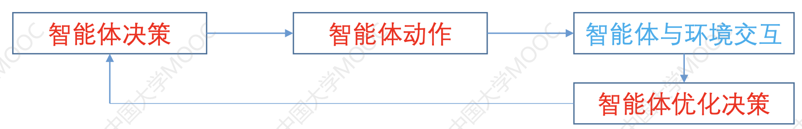
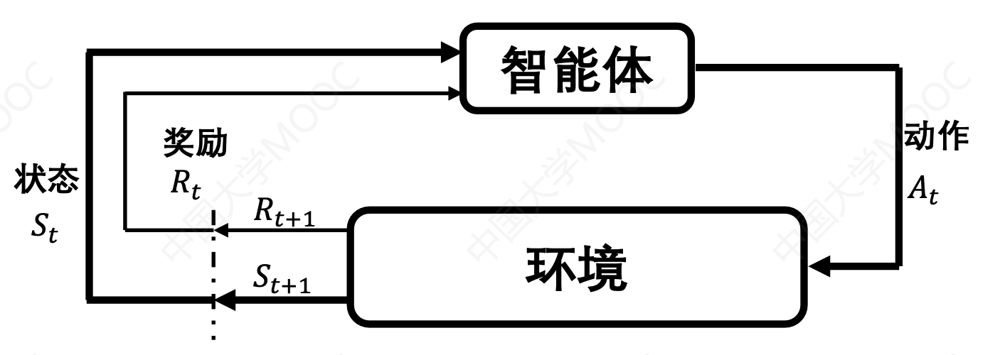
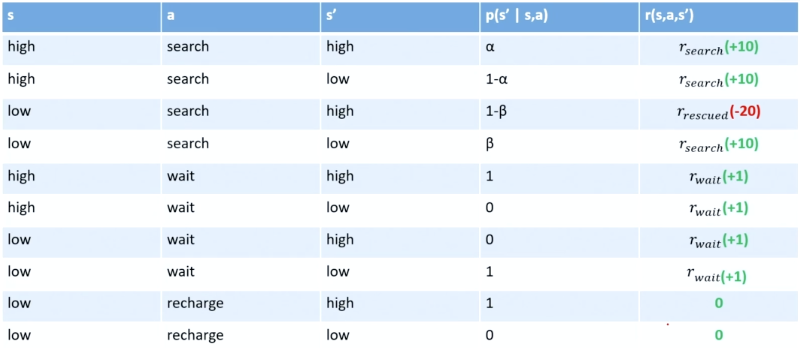
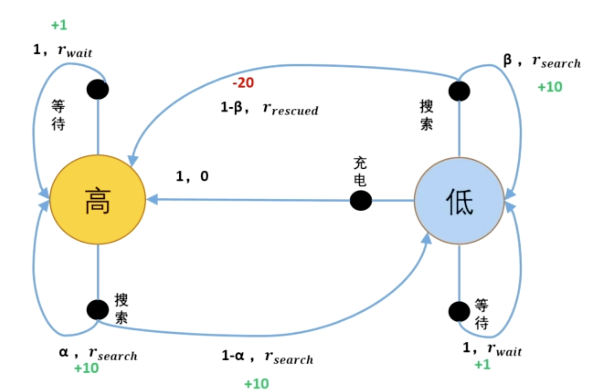
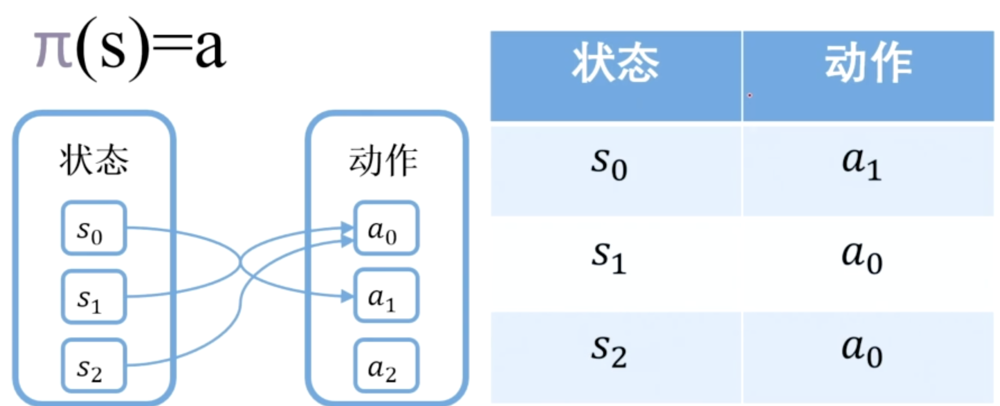
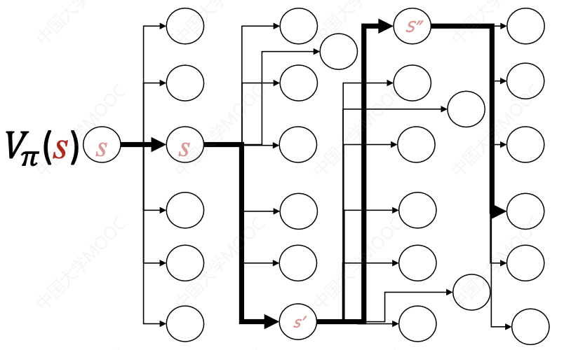
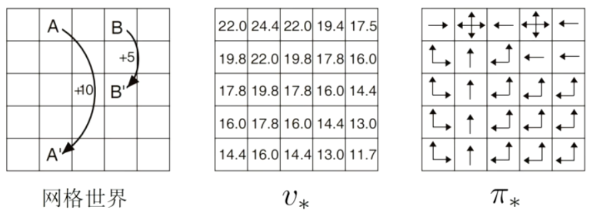

> 强烈推荐：https://hrl.boyuai.com/

## 基本概念

> RL, in a nutshell, is to “learn to make good sequences of decisions through trail-and-errors”

### 机器学习范式

- 监督

  - 给定训练数据 training data
  - 和期望的输出（标签）desired outputs (with labels)

- 半监督

  - 给定训练数据 training data
  - 和部分期望的输出 some labels

- 无监督

  - 仅给定训练数据 training data
  - without labels

- **强化学习** Reinforce Learning (RL)
  - 从序列决策中获取奖励 observations and periodic rewards as the agent takes sequential actions;

强化学习是一种自动化目标导向的计算方法，与其他机器学习范式最大的区别在于：

- **交互**：与环境之间存在交互，从环境中学习
- **决策序列**：以前的决策会影响以后的决策，也就是学习的过程
- **探索**：不断试错、探索的学习过程

### 强化学习算法构成

#### 给定

##### 三大集合

- 状态集合
- 动作集合
- 奖励值集合

##### 两大模型 (两大主角)

###### 环境模型（optional）

述了环境的具体表现。在给定状态和动作情况下，模型可能会预测结果的下一个状态和下一个奖励

- 有环境模型：定义了环境模型
- 无环境模型：不定义环境模型，靠智能体感知实时状态来理解环境

###### 主角模型（智能体）

概念来源于分布式人工智能思想。通常意义上，智能体是一个能够感知并施加某种作用到自身和环境、有生命周期的一个物理的或抽象的计算实体。智能体接受一个任务指令后，经过学习，可自主完成该任务

#### 目标

智能体获取从任务开始到任务结束过程中每一步的最优动作

#### 三大特征

- 探索试错
- 延迟回报
- 长期目标

强化学习的关键特征是**长期目标优化**，智能体关注整体学习问题，优化整个过程

大多强化学习算法的关键特征是**值函数**的使用

#### 特有挑战

**探索和开发** (exploration and exploitation)：短期和长期目标的权衡

### 强化学习的问题建模

#### 问题模型

##### 状态空间

智能体所处的实际环境所有状态**集合**

##### 当前状态

智能体感知到的环境当前所处的状态

##### 动作策略

智能体在某时间的行为

##### 奖励信号

智能体收到的关于动作效果的反馈

#### 价值函数

**奖励信号** 只能说明 **动作的即时效果**，而 **价值函数** 则指明什么策略的 **长期效果** 是好还是差。

## 马尔科夫决策问题模型

- [参考](<(https://hrl.boyuai.com/chapter/1/%E9%A9%AC%E5%B0%94%E5%8F%AF%E5%A4%AB%E5%86%B3%E7%AD%96%E8%BF%87%E7%A8%8B/#33-%E9%A9%AC%E5%B0%94%E5%8F%AF%E5%A4%AB%E5%A5%96%E5%8A%B1%E8%BF%87%E7%A8%8B)>)

### 马尔可夫奖励过程(MRP)

**马尔可夫奖励过程**（Markov reward process）

#### 动作序列集

动作序列集（Action Sequence Set）是指一组按特定顺序排列的动作序列。它通常用于描述某个系统、机器人或智能体在特定环境中的行为。动作序列集可以包含一系列离散的动作步骤，也可以包含连续的动作序列。

动作序列集可以被分为两类：

- 有终止态的离散动作（动作幕）
- 无终止态的连续动作

#### 动作幕(Episode)

一个完整的有**起始终止状态**的**动作序列集**（Episode，简称**动作幕**）

- 从标准起始态或从标准分布的初始态集合中抽取初始态开始
- 以终止态结束
- 不同动作序列集都可以认为是在同一个终止态结束，只是序列具体元素不同

!!! warning
    区分奖励和收益

#### 简单收益

Return (aka cumulative future reward) ，未来的累积奖励，也就是**简单收益**

#### 折扣回报

Discounted Return ，**折扣回报**，也就是引入了折扣因子的简单收益。

### 马尔科夫决策过程(MDP)

**马尔可夫决策过程**（Markov decision process，MDP）

MDP 与 MRP 非常相像，主要区别为 MDP 中的状态转移函数和奖励函数都比 MRP 多了动作 $a$ 作为自变量。

#### 问题模型

MDP（马尔科夫决策过程）是一个描述智能体和环境交互的**四元组 (S, A, 𝑅, 𝑝)**

- S ：Status 状态的集合
- A ：Action 动作的集合
- R ：Reward 奖励的集合
- p ：当前状态执行了一个动作跳转到下一个状态的概率

- 对象
  - 智能体
  - 环境
- 交互
  - 动作
  - 状态
  - 奖励

#### 状态-奖励表

扫地机器人状态-奖励表

#### 状态迁移图

扫地机器人状态迁移图

#### 游戏轨迹

(state, action, reward) trajectory **游戏轨迹**：

$$
s_1,a_1,r_1,s_2,a_2,r_2,\cdots s_T,a_T,r_T
$$

!!! info 
    即时奖励和长期目标的关系

某一决策的即时奖励较高不一定带来较高的长期目标

追求长期目标 ≠ 追求即时奖励

## 强化学习的值函数

### 基础概统知识

以下定义针对离散型随机变量：

#### 概率

随机变量 A = a 发生的概率

$$
p(A=a)
$$

#### 条件概率

在 C = c 条件下，A = a 的概率

$$
p(A=a|C=c)
$$

!!! abstract
    智能体处于状态 $s(S=s)$ 时，它的策略 $\pi$ 执行动作 $a(A=a)$ 的概率

$$
\pi(a|s)
$$

#### 期望

也称随机变量 𝑿 的期待值

$$
\mathbb{E}[X]=\sum_i x_i p(X=x_i)
$$

#### 条件期望

Y=y 条件下，X 的期望

$$
\mathbb{E}[X|Y=y]=\sum_i x_i p (X=x_i |Y=y)
$$

### 简单值函数

直觉上看，为找到一个好的动作决策，需为每个动作赋值，只考虑了即时奖励，未考虑长期过程

有了值函数 q(a) ，决策问题即可转为优化问题求解，找最优动作：

$$
\underset{a}{argmax} \ q(a)
$$

#### 定义

$$
q(a)=\mathbb{E}[R|A=a]\forall a\in \{ 1,...,k \}=\sum_r p(r|a)r
$$

其中 p( r | a ) 是在执行 a 动作情况下观察到智能体获得奖励 r 的概率；R 字母表示 Reward 奖励。

#### 采样平均

除了按定义方法计算，还可以通过**采样平均**方法计算，即通过以往动作所获奖励情况来估算值函数

$$
Q(a)=\frac{\text{获得奖励的总和}}{\text{动作a的执行次数}}
$$

具体计算公式为：

$$
Q(a)=\frac{\sum_{i=1}^{n-1}R_i \mathbb{1}_{A_i = a}}{\sum_{i=1}^{n-1}\mathbb{1}_{A_i = a}}
$$

其中 $\mathbb{1}_{A_i = a}$ 表示 $A_i =a$ 时取 1 ，否则取 0

#### 问题

未考虑长期过程，实际并不采用

### 简单收益

#### 简单收益的定义

G 字母表示 Gain 收益，也叫做回报 Return

$$
G_t= R_{t+1}+R_{t+2}+R_{t+3}+...+R_T
$$

#### 简单收益的期望

##### 离散动作的简单收益

$$
\mathbb{E}[G_t]=\mathbb{E}[R_{t+1}+R_{t+2}+R_{t+3}+...+R_T]
$$

##### 连续动作的简单收益

$$
\mathbb{E}[G_t]=\mathbb{E}[R_{t+1}+R_{t+2}+R_{t+3}+...]
$$

#### 存在问题

若奖励都是非负的，收益会不会是无穷大？

### 折扣目标收益

引入**折扣因子** $\gamma$ ，$\gamma \lt 1$，得到**折扣回报**（Discounted Return）：

$$
G_t= R_{t+1}+\gamma R_{t+2}+\gamma^2 R_{t+3}+...+ \gamma^{k-1}R_{t+k}+...=\sum_{k=0}^{\infty}\gamma^k R_{t+k+1}
$$

当 $\gamma =0$ 时：

$$
G_t= R_{t+1}+0 R_{t+2}+0^2 R_{t+3}+...+ 0^{k-1}R_{t+k}+...=R_{t+1}
$$

令 $R_{max}$ 为智能体所能获取的最大奖励，则:

$$
R_{t+k+1}\leq R_{max}
$$

$$
G_t = \sum_{k=0}^{\infty}\gamma^k R_{t+k+1} \leq \sum_{k=0}^{\infty}\gamma^k R_{max} = R_{max}\sum_{k=0}^{\infty}\gamma^k  = \frac{R_{max}}{1-\gamma}
$$

#### 目标收益的递归计算

定义 $G_T = 0\ ,\ t\leq T$

$$
\begin{aligned}
G_t &= R_{t+1}+\gamma R_{t+2}+\gamma^2 R_{t+3}+...+ \gamma^{k-1}R_{t+k}+... \\
&= R_{t+1}+\gamma (R_{t+2}+\gamma R_{t+3}+...+ \gamma^{k-2}R_{t+k}+...) \\
&= R_{t+1}+\gamma G_{t+1}
\end{aligned}
$$

从而有：

$$
G_t =R_{t+1}+\gamma G_{t+1}
$$

特别地，t = T 时有 $G_T = 0$ ；t = T-1 时有 $G_{t-1} = R_T +\gamma G_T$ 。

### 标准状态值函数

一个状态在策略 𝝅 下的值函数，记作：$v_\pi(s)$，是指该策略 𝝅 下，智能体在时间步 t 和所处状态 s 所能获得的奖励的期望值，即该值是从 s 开始，按照策略 𝝅 执行动作的预期收益

$$
v_\pi(s)\doteq \mathbb{E}_\pi[G_t|S_t=s]=\mathbb{E}_\pi[\sum_{k=0}^{\infty}\gamma^k R_{t+k+1} |S_t=s]
$$

!!! info 
    符号 $\doteq$ 表示两个数值、表达式、模型之间的近似等于关系。这个符号通常用于数学和工程领域，在数值计算中，表示两个量非常接近或几乎相等，但并非完全相等。

### 标准动作值函数

一个动作在某个策略下的值函数，记作：$q_\pi(s,a)$ ，是指该策略 𝝅 下, 智能体在时间步 t 和所处状态 s，执行动作 𝒂 所获得的奖励的期望值，即从 s 开始，按照策略 𝝅 执行动作 𝒂 ，能获得的预期收益

$$
q_\pi(s,a)\doteq \mathbb{E}_\pi[G_t|S_t=s,A_t=a]=\mathbb{E}_\pi[\sum_{k=0}^{\infty}\gamma^k R_{t+k+1} |S_t=s,A_t=a]
$$

!!! abstract
    两种值函数的区别在于：

- 状态值函数相当于将当前状态 _s_ 所有可能执行的动作都执行一遍，求奖励总和的期望
- 动作值函数相当于只求当前状态 _s_ 下某一个动作 _a_ 的奖励的期望

### V 值的递归计算(贝尔曼方程)

由目标收益的递归计算可以得到 V 值的递归计算：

$$
V(s)=R(s)+\gamma\cdot\sum_{s'\in S}P(s'|s)\cdot V(s')
$$

其中：

- $V(s)$ 是 $s$ 状态的 V 值；
- $R(s)$ 是 $s$ 状态的奖励
- $P(s'|s)$ 是从 $s$ 状态转变为到 $s'$ 的概率；
- $\gamma$ 是折扣因子。

该式子也就是贝尔曼方程(?)

## 从值函数计算最优策略

- **策略**：在每一个状态下执行何种动作？
- **最优策略**：能够最大化收益的动作执行决策

### 策略

#### 确定性策略

在某一状态下智能体的策略采取动作 _a_ 的概率是 100% ，即 $\pi(s)=a$

#### 不确定性策略（随机策略）

也叫随机策略

$\pi (a|s)$ 是在状态 $s$ 上采取的动作的概率分布，也可以表示某一状态 `s` 采取可能的行为 `a` 的概率，满足：

$$
\sum_{a\in \mathcal{A}(s)}\pi (a|s)=1 \\
\pi (a|s)\geq 0
$$

### 值函数的应用

### 贝尔曼期望方程

**贝尔曼方程(Bellman Equation)** 就是递归计算值函数得到的值函数的方程。

**贝尔曼期望方程**（Bellman Expectation Equation）是为了与接下来的贝尔曼最优方程进行区分

#### 状态值函数

> v 值

$$
\begin{aligned}
v_\pi(s) &\doteq \mathbb{E}_\pi[G_t|S_t=s] \\
&= \mathbb{E}_\pi[R_{t+1}+\gamma G_{t+1}|S_t =s] \\
&= \mathbb{E}_\pi[R_{t+1}] + \gamma \mathbb{E}_\pi [G_{t+1}|S_t =s] \\
\mathbb{E}_\pi[R_{t+1}] &=\sum_a \pi (a|s)\sum_{s'}\sum_{r}p(s',r|s,a)[r] \\
\gamma \mathbb{E}_\pi [G_{t+1}|S_t =s] &= \sum_a \pi (a|s)\sum_{s'}\sum_{r}p(s',r|s,a)[\gamma \mathbb{E}_\pi [G_{t+1}|S_{t+1} =s']]\\
&= \sum_a \pi (a|s)\sum_{s'}\sum_{r}p(s',r|s,a)[\gamma v_{\pi}(s')]\\
v_\pi(s) &=  \sum_a \pi (a|s)\sum_{s'}\sum_{r}p(s',r|s,a)[r+\gamma v_{\pi}(s')]
\end{aligned}
$$

其中 $S_{t+1}=s'$

#### 动作值函数

> q 值

$$
\begin{aligned}
q_\pi(s,a) &\doteq \mathbb{E}_\pi[G_t|S_t=s ,A_t=a] \\
&=\sum_{s'}\sum_{r}p(s',r|s,a)[r+\gamma \mathbb{E}_\pi [G_{t+1}|S_{t+1} =s']]\\
&=\sum_{s'}\sum_{r}p(s',r|s,a)[r+\gamma\sum_{a'}\pi (a'|s') \mathbb{E}_\pi [G_{t+1}|S_{t+1} =s',A_{t+1}=a']]\\
q_\pi(s,a) &=\sum_{s'}\sum_{r}p(s',r|s,a)[r+\gamma\sum_{a'}\pi (a'|s') q_{\pi}(s',a')]\\
\end{aligned}
$$

其中 $S_{t+1}=s',A_{t+1}=a'$

### 最优策略的数学表达

$$
\forall s\in \mathcal{S}:\pi_1\geq\pi_2\Leftrightarrow v_{\pi_1}(s)\geq v_{\pi_2}(s)
$$

$$
\forall s\in \mathcal{S},\forall a\in\mathcal{A}:\pi_1\geq\pi_2\Leftrightarrow q_{\pi_1}(s,a)\geq q_{\pi_2}(s,a)
$$

从而有：

$$
v_{\pi_*}(s)\doteq\mathbb{E}_{\pi_*}[G_t|S_t=s]=\max_\pi v_{\pi}(s),\forall s\in\mathcal{S}
$$

$$
q_{\pi_*}(s,a)=\mathbb{E}_{\pi_*}[G_{t}|S_{t} =s,A_{t}=a]=\max_\pi q_{\pi}(s,a),\forall s\in\mathcal{S},\forall a\in\mathcal{A}
$$

!!! abstract
    $*$ 表示最优的，这里 $\pi_*$ 表示最优策略

### 贝尔曼最优方程

用 $v_*(s)=v_{\pi_*}(s)?$ 代替原来的 $v_{\pi}(s)$ ，$q_{\pi_*}(s,a)$ 代替原来的 $q_{\pi}(s,a)$ ，那么原本的贝尔曼方程就变成**贝尔曼最优方程**，得到的表达式就是**最优值函数**。

参考：https://blog.csdn.net/november_chopin/article/details/106589197，有 demo 更方便掌握。

#### 最优状态值函数

$$
\begin{aligned}
v_{*}(s) &= \sum_{a=\pi_{*}(s)} \pi_{*} (a|s)\sum_{s'}\sum_{r}p(s',r|s,a)[r+\gamma v_{*} (s')]\\
&= \max_{a}\sum_{s'}\sum_{r}p(s',r|s,a)[r+\gamma v_{*} (s')]
\end{aligned}
$$

#### 最优状态值函数

$$
\begin{aligned}
q_{\pi_*}(s,a)&=\sum_{s'}\sum_{r}p(s',r|s,a)[r+\gamma\sum_{a'=\pi_*(s')}\pi_* (a'|s') q_{\pi_*}(s',a')]\\
&=\sum_{s'}\sum_{r}p(s',r|s,a)[r+\gamma \max_{a'} q_{\pi_*}(s',a')]
\end{aligned}
$$

#### 两种最优值函数的关系

$$
\begin{aligned}
v_{*}(s) &= \max_{a}\sum_{s'}\sum_{r}p(s',r|s,a)[r+\gamma v_{*} (s')]\\
&= \max_{a}\mathbb{E}_\pi[R_{t+1}+\gamma v_{*}(S_{t+1})|S_t =s,A_t=a]\\
&= \max_{a}\mathbb{E}_{\pi_*}[R_{t+1}+\gamma G_{t+1}|S_t =s,A_t=a]\\
&= \max_{a}\mathbb{E}_{\pi_*}[G_t|S_t =s,A_t=a]\\
v_{*}(s) &= \max_{a\in\mathcal{A(s)}}q_{\pi_{*}}(s,a)
\end{aligned}
$$

## TDL

Temporal Difference Learning 差分学习

TD target ：

$$
\begin{aligned}
y_t&=r_t+\gamma\cdot Q(s_{t+1},a_{t+1};w)\\
&=r_t+\gamma\cdot \max_aQ(s_{t+1},a;w)
\end{aligned}
$$

损失函数：

$$
L=\frac{1}{2}[Q(w)-y]^2
$$

梯度：

$$
\frac{\partial L}{\partial w}=[Q(w)-y]\cdot\frac{\partial Q(w)}{\partial w}
$$

梯度下降计算：

$$
w_{t+1}=w_t-\alpha\cdot\frac{\partial L_t}{\partial w}\large|_{w=w_t}
$$

### 算法流程

1. Observe state $S_t=s_t$ and perform action $A_t=a_t$
2. Predict the value: $q_t=Q(s_t,a_t;w_t)$
3. Differentiate the value network: $d_t=\frac{\partial Q(s_t,a_t;w)}{\partial w}\large|_{w=w_t}$；
4. Environment provides new state $s_{t+1}$ and reward $r_t$
5. Compute TD target: $y_t=r_t+\gamma\cdot\max_a𝑄(s_{t+1},a;w_t)$
6. Gradient descent: $w_{t+1}=w_t-\alpha\cdot(q_t-y_t)\cdot d_t$

## 值估计

### Sarsa

State-Action-Reward-State-Action (SARSA)

使用 $(s_t,a_t,r_t,a_{t+1})$ 更新 $Q_{\pi}$。

#### 表格

> Tabular version

#### 神经网络

> Value network version

### Q-Learning

#### 表格

> Tabular version

#### 神经网络

> DQN version

## 策略
