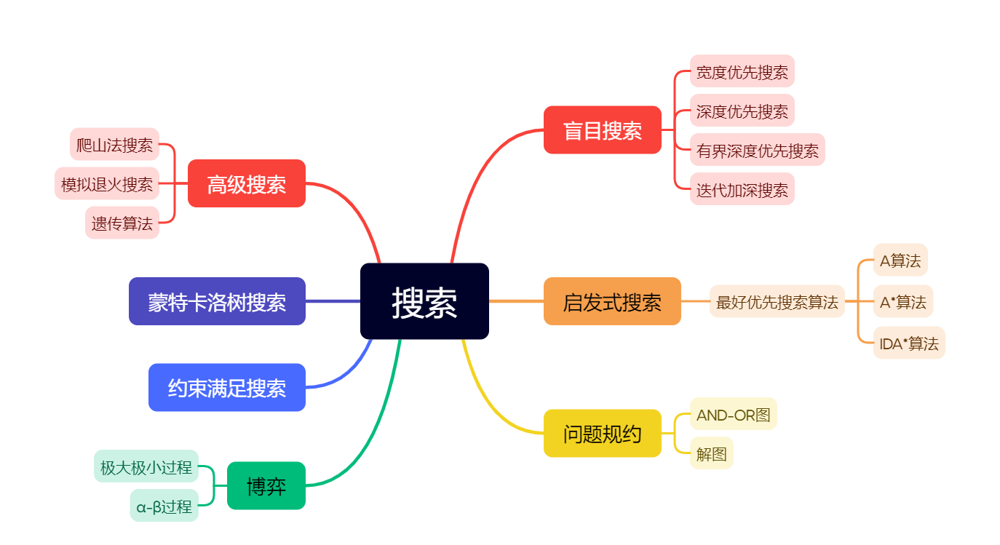

## 搜索相关概念

对于给定的问题，智能系统的行为一般是**找到能够达到所希望目标的动作序列**，并使其所付出的代价最小、性能最好。

基于给定的问题，问题求解的第一步是目标的表示。

搜索就是**找到智能系统的动作序列的过程**。

搜索算法的：

- 输入是给定的问题
  - 搜索什么（目标）
  - 在哪里搜索（搜索空间）
    - 和通常的搜索空间不同，人工智能中大多数问题的状态空间在问题求解之前不是全部知道的
- 输出是表示为动作序列的方案。

一旦有了方案，就可以执行该方案所给出的动作了。（执行阶段）

求解问题包括：

- 目标表示
- 搜索
- 执行

### 搜索的分类

根据是否使用启发式信息分为

- 盲目搜索
  - 只是可以区分出哪个是目标状态
  - 一般是按预定的搜索策略进行搜索
  - 没有考虑到问题本身的特性，这种搜索具有很大的盲目性，效率不高，不便于复杂问题的求解
- 启发式搜索
  - 是在搜索过程中加入了与问题有关的启发式信息，用于指导搜索朝着最有希望的方向前进，加速问题的求解并找到最优解。

按表示方式分为

- 状态空间搜索
  - 用状态空间法来求解问题所进行的搜索
- 与或树搜索
  - 用问题规约方法来求解问题时所进行的搜索

### 搜索策略评价标准

#### 完备性

如果存在一个解答，该策略是否保证能够找到？

#### 时间复杂性

需要多长时间可以找到解答？

#### 空间复杂性

执行搜索需要多少存储空间？

#### 最优性

如果存在不同的几个解答，该策略是否可以发现最高质量的解答？

### 搜索控制策略

- 不可撤回的控制策略——可能无解
- 试探性控制策略
  - 回溯型
  - 图搜索

## 盲目搜索方法

定义一个四元组，以此来表示状态空间:

```raw
{ nodes, arc, goal, current }
```

- nodes 表示当前搜索空间中现有状态的集合
- arc 表示可应用与当前状态的操作符，把当前状态转换为另一个状态
- goal 表示需要到达的状态，是 nodes 中的一个状态
- current 表示现在生成的用于和目标状态比较的状态（包括初始状态）

各种算法的完备性、时间复杂度、空间复杂度、能否找到最优解的比较如下：

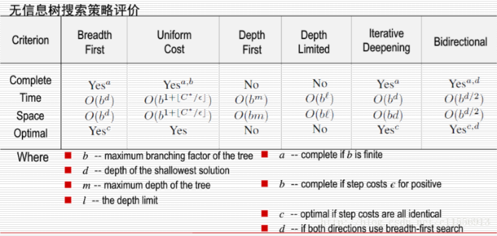

::: warning
无论是宽度优先还是深度优先，都不适用于**有环图**！
### 宽度优先搜索

优点:

目标节点如果存在，用宽度优先搜索算法总可以找到该目标节点，而且是最小（即**最短路径**）的节点。

问题：

宽度优先搜索是一种盲目搜索，时间和空间复杂度都比较高，当目标节点距离初始节点较**远**时会产生许多无用的节点，搜索效率低。

宽度优先搜索中，时间需求是一个很大的问题，特别是当搜索的深度比较大时，尤为严重，但是空间需求是比执行时间更严重的问题。

### 双向宽度优先搜索法

> Bidirectional search

双向广度优先搜索法适用于具有**可逆性**的问题。广度优先搜索法搜索时，结点不断扩张，深度越大，结点数越多。如果从两个方向向对方搜索，就会在路径中间某个地方相会，这样，双方的搜索的深度都不大，所搜索过的结点数就少得多，搜索时间也就节省不少。

同时进行两个搜索：

- 一个是从初始状态向前搜索；
- 另一个则从目标向后搜索；

同时从初始状态和目标状态出发，采用广度优先搜索的策略，向对方搜索，如果问题存在解，则两个方向的搜索会在中途相遇，即搜索到同一个结点。将两个方向的搜索路径连接起来，就可以得到从初始结点到目标结点的搜索路径。

### 深度优先搜索

也称为回溯搜索，它总是首先扩展树的最深层次上的某个节点，只是当搜索遇到一个死亡节点（非目标节点而且不可扩展），搜索方法才会返回并扩展浅层次的节点

上述原理对树中的每一节点是递归实现的(实现该递归用栈)

优点：

是比宽度优先搜索算法需要较少的空间，该算法只需要保存搜索树的一部分，它由当前正在搜索的路径和该路径上还没有完全展开的节点标志所组成

:warning:但是对于现实中很多问题深度可能是无穷的！这种时候认为深度优先搜索是**不完备的**。后面的(迭代)有界深度优先搜索就是为了解决这一问题。

深度优先搜索的**存储器要求**是**深度**约束的线性函数。

### 有界深度优先搜索

> Deep-limited Search

!!! abstract
    若状态空间无限，DFS 可能会出现循环，搜索失败；通过预定一个深度限制来解决这个问题

有界深度优先搜索过程总体上按深度优先算法方法进行，但对搜索深度需要给出一个深度限制 $d_m$ ，当深度达到了 $d_m$ 的时候，如果还没有找到解答，就停止对该分支的搜索，换到另外一个分支进行搜索

深度限制 $d_m$ 很重要。当问题有解，且解的路径长度小于或等于 $d_m$ 时，则搜索过程一定能够找到解，但是和深度优先搜索一样这并不能保证最先找到的是最优解

- 但是当 $d_m$ 取得太小，解的路径长度大于 $d_m$ 时，则搜索过程中就找不到解，即这时搜索过程甚至是不完备的
- $d_m$ 不能太大。当 $d_m$ 太大时，搜索过程会产生过多的无用节点，既浪费了计算机资源，又降低了搜索效率

有界深度搜索的主要问题是深度限制值 $d_m$ 的选取

### 迭代加深搜索

> Iterative Deepening Search

在有界深度优先搜索的基础上改进，试图尝试所有可能的深度限制

先任意给定一个较小的数作为 $d_m$，然后按有界深度算法搜索，通过典型的深度优先算法，生成深度为 m 的树:

- 若在此深度限制内找到了解，则算法结束
- 若在此限制内没有找到问题的解，则增大深度限制 $d_m$ ，继续搜索

!!! abstract
    - 宽度优先搜索需要指数数量的空间
- 深度优先搜索的空间复杂度和最大搜索深度呈线性关系
- 迭代加深搜索对一棵深度受控的树采用深度优先的搜索。它结合了宽度优先和深度优先搜索的优点：
  - 和宽度优先搜索一样，它是最优的，也是完备的
  - 但对空间要求和深度优先搜索一样是适中的

## 启发式搜索

启发式搜索用于两种不同类型的问题：

- 前向推理
  - 一般用于状态空间的搜索。在前向推理中，推理是从预选定义的初始状态出发向目标状态方向执行
- 反向推理
  - 反向推理一般用于问题规约中。在反向推理中，推理是从给定的目标状态向初始状态执行

启发式搜索：如果在选择节点时能充分利用与问题有关的特征信息，估计出节点的重要性，就能在搜索时选择重要性较高的节点，以便求得最优解。

### 启发性信息和评估函数

#### 评估函数

用来评估节点重要性的函数称为**评估函数** $f(x)$ ，定义为从初始节点 $S_0$ 出发，约束地经过节点 $x$ 到达目标节点 $S_g$ 的所有路径中最小路径代价的估计值：

$$
f(x)=g(x)+h(x)
$$

- $g(x)$——从初始节点 $S_0$ 到节点 $x$ 的**实际代价**；
- $h(x)$——从$x$到目标节点 $S_g$ 的最优路径的评估代价，它体现了问题的启发式信息，其形式要根据问题的特性确定，$h(x)$ 称为**启发式函数**

- 在正方形网格中，允许向 $4$ 邻域的移动，使用曼哈顿距离（$L1$）
- 在正方形网格中，允许向 $8$ 邻域的移动，使用对角线距离（$L∞$）等等

#### OR 图

大多数前向推理问题可以表示为 OR 图，其中图中的节点表示问题的状态，弧表示应用于当前状态的规则，该规则引起状态的转换；

当有多个规则可用于当前状态的时候，可以从该状态的各个子状态中选择一个比较好的状态作为下一个状态。

### 最好优先搜索算法

最好优先搜索算法是一个**通用图搜索算法框架**，不是一个具体的算法。将其 $f(n)$ 评估函数具体化，就能得到后面的 $A$ 算法、$A*$ 算法。

图搜索算法只记录状态空间中那些被搜索过的状态，它们组成一个搜索图 $G$。

$G$ 由两种节点组成：

- Open 节点，如果该节点已经生成，而且启发式函数值 $h(x)$ 已经计算出来，但是它没有扩展。这些节点也称为未考察节点
- Closed 节点，如果该节点已经扩展并生成了其子节点。Closed 节点是已经考察过的节点。

可以给出两个数据结构 OPEN 和 CLOSED 表，分别存放了 Open 节点和 Closed 节点。

节点 $x$ 总的费用函数 $f(x)$ 是 $g(x)$ 和 $h(x)$ 之和。

生成费用 $g(x)$ 可以比较容易地得到，如， 如果节点 $x$ 是从初始节点经过 $m$ 步得到，则 $g(x)$ 应该和 $m$ 成正比（或者就是 $m$ ）。

$h(x)$ 只是一个预测值。

上述图搜索算法生成一个明确的图 $G$（称为**搜索图**）和一个 $G$ 的子集 $T$（称为**搜索树**），图 $G$ 中的每一个节点也在树 $T$ 上。

搜索树是由返回指针来确定的。

$G$ 中的每一个节点（除了初始节点 $S_0$）都有一个指向 $G$ 中一个父辈节点的指针。该父辈节点就是树中那个节点的惟一父辈节点。

从最有希望的节点开始，并且生成其所有的子节点

- 计算每个节点的性能（合适性）
- 选择最有希望的节点进行扩展，而不是仅仅从当前节点所生成的子节点中进行选择
- 如果在早期选择了一个错误的节点，最好优先搜索就提供了一个修改的机会

最好优先搜索算法并没有显式地给出如何定义启发式函数，

它不能保证当从起始节点到目标节点的最短路径存在时，一定能够找到它。

最好优先搜索算法伪代码：

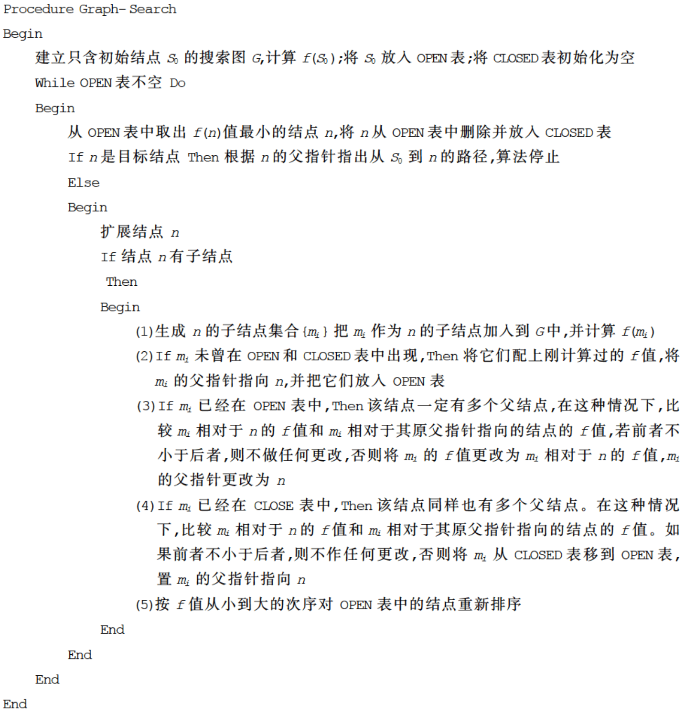

算法的特例：

$$
f(n)=g(n)+h(n)
$$

- 当 $g(n)=0$ 时，$f(n)=h(n)$，称为**贪婪最好优先搜索算法**。
- 当 $h(n)=0$ 时，$f(n)=g(n)$，变成宽度优先搜索算法。

### A 算法和 A\*算法

如果最好优先搜索算法中的 $f(n)$ 被实例化为 $f(n)=g(n)+h(n)$，则称为 **$A$ 算法**。

进一步细化，将 $A$ 算法中能够保证找到最优解的这一类称为 **$A*$ 算法**，如果：

- 启发函数 $h$ 满足对于任一结点 $n$，$h(n)$ 的值都不大于 $n$ 到目标结点的最优代价；
  - 也就是 $h(n)\leq h^*(n)$。
- 搜索空间中的每个结点都具有有限个后继。
- 搜索空间中的每个有向边的代价均为正值。
  称以上 3 个条件为“运行条件”。

定义评估函数 $f^*$：

$$
f^*(n)=g^*(n)+h^*(n)
$$

其中：

- $g^*(n)$ 为起始节点到节点 $n$ 的**最短**路径的代价
- $h^*(n)$ 是从 $n$ 到目标节点的**最短**路径的代价。

这样 $f^*(n)$ 就是从起始节点出发通过节点 $n$ 到达目标节点的最佳路径的总代价的估值。

把估价函数 $f(n)$ 和 $f^*(n)$ 相比较，$g^*(n)$ 是对 $g(n)$ 的估价；$h^*(n)$ 是对 $h(n)$ 的估价。

在这两个估价中，尽管 $g(n)$ 容易计算，但它不一定就是从起始节点 $S_0$ 到节点 $n$ 的真正的最短路径的代价，很可能从初始节点 $S_0$ 到节点 $n$ 的真正最短路径还没有找到，所以一般都有：

$$
g(n)\geq g^*(n)
$$

最好优先搜索算法框架中保证了能够计算出更好的 $g(n)$。

$A*$ 算法中要求 $h(n)$ 是 $h^*(n)$ 的下界，即对任意节点 $n$ 均有 $h(n)\leq h^*(n)$。称这个时候 $h(n)$ 是**可采纳的**，这保证了 $A*$ 算法是收敛的！

### IDA\*算法

也叫**迭代加深 A\*算法**。

- 迭代加深搜索算法，它以深度优先的方式在有限制的深度内搜索目标节点。在每个深度上，该算法在每个深度上检查目标节点是否出现，如果出现则停止，否则深度加 1 继续搜索。
- 而 $A*$ 算法是选择具有最小估价函数值的节点扩展。

迭代加深 $A*$ 搜索算法 是 上述两种算法的结合，这里启发式函数用做深度的限制，而不是选择扩展节点的排序

伪代码：

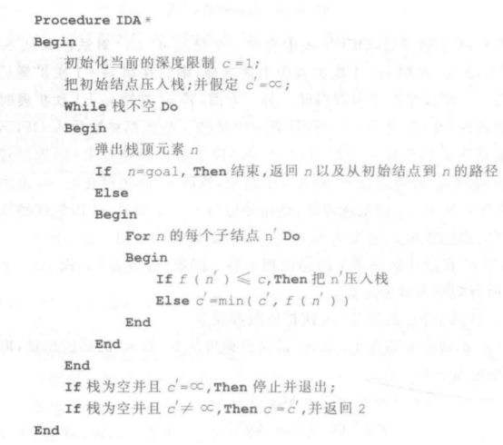

## 问题归约和 AND-OR 图启发式搜索

### 问题归约的描述

问题归约可以用三元组表示：$(S_0,O,P)$ ，其中：

- $S_0$ 是初始问题
- $P$ 是本原问题集(不用证明的，公理、已知事实，或已证明过的问题)
- $O$ 是操作算子集(操作算子把一个问题化成若干个子问题)

问题归约表示方法就是由初始问题出发，运用操作算子产生一些子问题，对子问题再运用操作算子产生子问题的子问题，这样一直进行到产生的问题均为本原问题，则问题得解。所有问题归约的最终目的是产生本原问题

### :star:AND-OR 图

#### 超图

> 这个不考

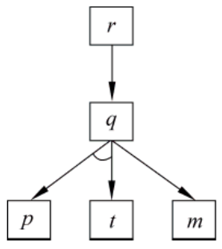

$q$ 指向 $p$ 和 $t$ 的两条有向边被一个圆弧连接，用于表示 $q$ 被分解 (归约) 为 $p$ 与 $t$ : 只有当 $p$ 和 $t$ 对应的问题都被解决时，$q$ 才能被解决。把圆弧连接的有向边看作 一个整体，把有向边 $\langle q,m\rangle$ 看作另一个整体，这两个整体表示可以将 $q$ 按照前一个整体进行分解，或者，将 $q$ 按照后一个整体进行分解

**超图** (hypergrah) 用二元组 $(N,H)$ 表示，其中 :

- $N$ 为结点的有穷集合
- $H$ 为“超边” (Hyperarce) 的集合

一个**超边**表示为 $\langle s,D\rangle$，也称为“k 连接符”(k-conector)，其中 $k=|D|$ 其中 :

- $s\in N$ ，称 $s$ 为该超边的源结点
- $D\in N$ ，称 D 该超边的目的结点集。每个超边 $\langle s,D\rangle$ 都表示结点 $s$ 对应的问题的一个可行的分 解方法.
  - 若 $|D|=1$ ，则该超边称为“或弧”，同时称 $D$ 中的结点为 $s$ 的“或子结点”(OR-node)，也称它为 s 的“或后继”(OR-descendents)，也就是**或节点**
  - 若 $|D|>1$ ，则该超边称为“与弧”，同时称 $D$ 中的结点为 $s$ 的“与子结点”(AND-node)，也称它们为 s 的“与后继”(AND-descendents)，也就是**与节点**

#### 与或图(AND-OR)

用 AND-OR 图把问题归约为子问题替换集合，将：

- **初始节点**表示初始问题描述
- 对应于本原问题的节点称为**叶节点**

它的四元组表示为 $(N,n_0,H,T)$ ，其中:

- N 是结点集合，其中每个结点都对应一个唯一的问题
- $n_0\in N$ ，对应于初始问题
- H 是超边的集合，其中每个超边 $\langle S,D\rangle$ 都表示结点 s 对应的问题的一个可行的分解方法
  - 若 $|D|=1$，则该超边称为“或弧”，同时称 $D$ 中的结点为;的“或子结点”(OR-node)，也称它为 $s$ 的“或后继”(OR-descendents)，也就是**或节点**
  - 若 $|D|>1$，则该超边称为“与弧”，同时称 $D$ 中的结点为;的“与子结点”(AND-node)，也称它们力;的“与后继”(AND-descendents)，也就是**与节点**
- $t$ 是 $N$ 的子集，其中每个结点对应的问题都为本原问题，$T$ 中的结点也称为叶结点

#### 可解节点

可解节点可递归地定义如下：

- 叶节点是可解节点
- 如果某节点为或子节点，那么该节点可解当且仅当至少有一个子节点为可解节点
- 如果某节点为与子节点，那么该节点可解当且仅当所有子节点均为可解节点

#### 不可解节点

不可解节点可递归定义如下：

- 有后裔节点的非叶节点是不可解节点
- 或节点是不可解节点（含有或后继节点），当且仅当它的所有子节点都是不可解节点
- 与节点是不可解节点（含有与后继节点），当且仅当它的子节点中至少有一个是不可解节点。

#### 解图

能导致初始节点可解的那些可解节点及有关连线组成的子图称为该 AND-OR 图的解图

## 博弈

!!! abstract
    这里讲的博弈是二人博弈，二人零和、全信息、非偶然博弈，博弈双方的利益是完全对立的；

（1）对垒的双方 MAX 和 MIN 轮流采取行动，博弈的结果只能有 3 种情况：MAX 胜、MIN 败；MAX 败，MIN 胜；和局。

（2）在对垒过程中，任何一方都了解当前的格局和过去的历史。

（3）任何一方在采取行动前都要根据当前的实际情况，进行得失分析，选择对自己最为有利而对对方最不利的对策，在不存在“碰运气”的偶然因素，即双方都很理智地决定自己的行动。

### 博弈树

把双人博弈过程用图的形式表示出来，这样就可以得到一棵 AND-OR 树，这种 AND-OR 树称为博弈树；

博弈树特点：

- 博弈的初始状态是初始节点
- 博弈树的 “与” 节点 和 “或” 节点是逐层交替出现的
- 向前看 $n$ 步，则博弈树有 $2n$ 层（$2n$ 层树枝，$2n+1$ 层节点）

整个博弈过程始终站在某一方的立场上，不同立场决定节点的性质：

- 能使自己一方获胜的终局都是本原问题，相应的节点也是**可解**节点；
- 所有使对方获胜的节点都是**不可解**节点
- 轮到自己一方走的节点都是**或**节点
- 轮到对方走的节点都是**与**节点

从 MAX 一方的角度来看，也就是希望 MAX 获胜，博弈树中的节点分为：

- MAX 节点 —— 下一步该 MAX 走的节点，所有 MAX 节点都是**或节点**
- MIN 节点 —— 下一步该 MIN 走的节点，所有 MIN 节点都是**与节点**

### 极大极小过程

极大极小过程是考虑双方对弈若干步之后，从可能的走法中选一步相对好的走法来走，即在**有限的搜索深度范围内进行求解**

定义一个静态估价函数 $f$ ,以便对棋局的态势做出评估，这个函数可以根据棋局的态势特征进行定义。假定对弈双方分别为 MAX 和 MIN ，规定：

- 有利于 MAX 方的态势：$f(p)$ 取正值
- 有利于 MIN 方的态势：$f(p)$ 取负值
- 态势均衡的时候：$f(p)$ 取零

其中 $p$ 代表棋局

MINMAX 基本思想：

1. 当轮到 MIN 走步的节点时，MIN 应考虑最坏的情况（即 $f(p)$ 取极小值）
2. 当轮到 MAX 走步的节点时，MAX 应考虑最好的情况（即 $f(p)$ 取极大值）
3. 评价往回倒推时，相应于两位棋手的对抗策略，交替使用（1）和（2）两种方法传递倒推值

所以这种方法称为**极大极小过程**

#### 井字棋

设只进行两层，即每方只走一步

估价函数 $e(p)$：

- 若格局 p 对任何一方都不是获胜的，则：$e(p)$ = (所有空格都放上 MAX 的棋子之后三子成一线的总数) –（所有空格都放上 MIN 的棋子后三子成一线的总数）
- 若 $p$ 是 MAX 获胜，则：$e(p) = +∞$
- 若 $p$ 是 MIN 获胜，则：$e(p) = -∞$

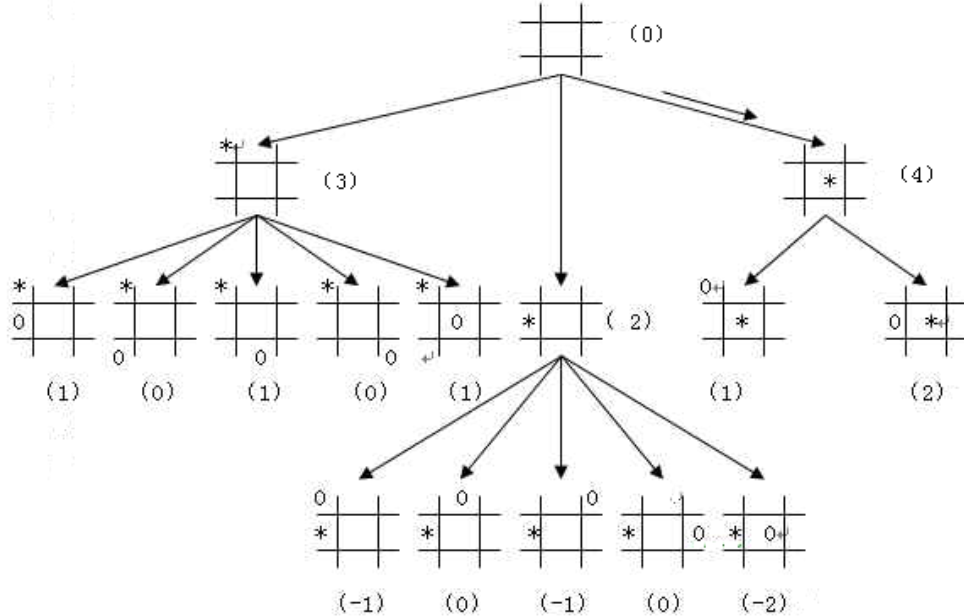

在生成后继节点时，可以利用棋盘的对称性，省略了从对称上看是相同的格局

!!! abstract
    极大极小方法是把搜索树的生成和估值这两个过程完全分开，只有在已经生成树之后才开始进行估值,这一分离导致了低效率的策略

### $\alpha$-$\beta$过程

$\alpha$-$\beta$ 剪枝技术是极大极小方法的改进，是一种提高博弈树搜索效率的方法

$\alpha$-$\beta$ 剪枝技术是一种边生成节点，边计算估值和倒推值的方法，从而剪去某些分枝

- 对于一个“与”（MIN）节点,它取当前子节点中的最小的倒推值作为它的倒推值的上界,称此值为 $\beta$ 值.也就是说 $\beta$ 值可以等于其后继节点当前最小的最终倒推值.“与”节点的 $\beta$ 值是永远不会增加的
- 对于一个“或”（MAX）节点,它取当前子节点中得最大的倒推值作为它的倒推值的下界,称此值为 $\alpha$ 值.也就是说 $\alpha$ 值可以等于其后继节点当前最大的最终倒推值.“或”节点的 $\alpha$ 值是永远不会减少的.

---

**$\beta$ 剪枝**：任何“或”（MAX）节点 x 的 $\alpha$ 值如果大于等于其父节点的 $\beta$ 值，则：

- 对节点 x 以下的分枝可以停止搜索
- 并使 x 的倒推值为 $\alpha$

**$\alpha$ 剪枝**：任何“与”（MIN）节点 x 的 $\beta$ 值如果小于等于其父节点的 $\alpha$ 值，则：

- 对节点 x 以下的分枝可以停止搜索
- 并使 x 的倒推值为 $\beta$

要进行 $\alpha$-$\beta$ 剪枝,至少必须使某一部分的搜索树生长到最大深度.因为 $\alpha$ 和 $\beta$ 值必须以某个端节点的静态估值为依据.因此采用 $\alpha$-$\beta$ 过程都要使用某种深度优先的搜索方法

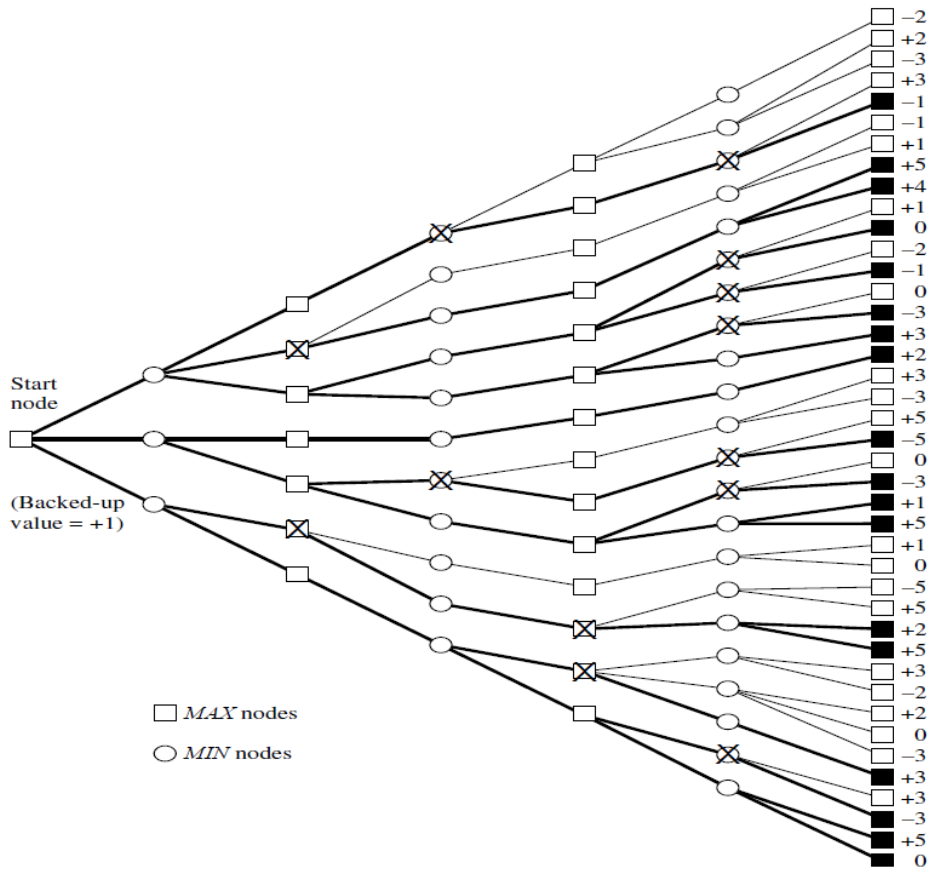

剪枝并不影响最后的结果

好的招数序列可以改进剪枝的效率

对于最佳情况，即 MIN 结点先扩展出最小估值的后继结点，MAX 结点先扩展出最大估值的后继结点。这种情况 可使得修剪的枝数最大：

- 时间复杂度为：$O(b^{\frac{m}{2}})$。
- 有效的分支系数为 $\sqrt{b}$。

其中树的深度为 $d$，且每个非叶结点的分枝系数为 $b$。

$\alpha$-$\beta$ 搜索向前看的走步数是极大极小搜索的两倍

$\alpha$-$\beta$ 过程就是把生成后继和倒推值估计结合起来，及时剪掉一些无用分支

## 约束满足搜索

约束满足问题（CSP）就是为一组变量寻找满足约束的赋值。

例如，N-皇后问题就是一个约束满足问题。这里的问题就是为 N 个变量赋值，每个变量的值表示每行上皇后的问题，值域均为 $[1，N]$，约束就是 N 个皇后谁也“吃”不到谁。

类似的，还有地图着色问题

一个约束满足问题表述为一个三元组 $(V,D,C)$：

- $V$：n 个变量的集合 $V={v_1,\dots,v_n}$，
- $D$：变量 $v_i (i=1,2,\dots,n)$ 相应的取值集合
  $D=\{D_1,\dots,D_n\}$，
- $C$：约束的有限集合，其中每个约束对若干变量同时可取的值做出限制。

如果至少存在一个解答满足某个约束，则称该约束是可满足的。

如果找不到一个变量值的组合，使之满足所有的约束，则可以找到一个满足最大数目约束的解，这种情况称为最大约束满足问题。

## 蒙特卡洛树搜索

分为四个阶段：

- 选择（Selection）
- 扩展（Expansion）
- 模拟（Simulation）
- 反向传播（Backpropagation）

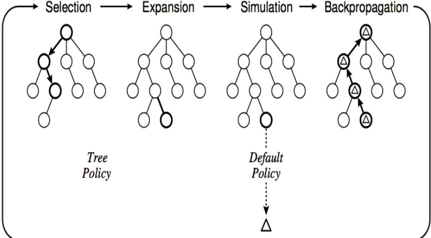

推荐观看[【双语字幕】MCTS 蒙特卡洛树搜索算法详细步骤解释](https://www.bilibili.com/video/BV1fY4y1876L)

### 选择(Selection)

在选择阶段，需要从根节点，也就是要做决策的局面 R 出发向下选择出一个最急迫需要被拓展的节点 N，局面 R 是是每一次迭代中第一个被检查的节点；对于被检查的局面而言，他可能有三种可能：

- 该节点所有可行动作都已经被拓展过
  - 使用 **UCB 公式** 计算该节点所有子节点的 UCB 值，并找到值最大的一个子节点继续检查。反复向下迭代
- 该节点有可行动作还未被拓展过
  - 认为这个节点就是本次迭代的的目标节点 N，并找出 N 还未被拓展的动作 A。执行模拟
- 这个节点游戏已经结束了
  - 从该节点直接执行反向传播

#### 信任度上限树

N 表示总模拟次数，W 表示胜局次数。每次都选择胜率最大的节点进行模拟。但是这样会导致新节点无法被探索到。为了在最大胜率和新节点探索上保持平衡，UCT（Upper Confidence Bound，上限置信区间算法）被引入：

$$
\frac{w_i}{n_i}+c\sqrt{\frac{\ln{t}}{n_i}}
$$

- $w_i$ 代表第 i 次移动后取胜的次数；
- $n_i$ 代表第 i 次移动后仿真的次数；
- $c$ 为探索参数，理论上等于 $2\sqrt{2}$ ；在实际中通常可凭经验选择；
- $t$ 代表仿真总次数，等于所有 $n_i$ 的和；

目前蒙特卡洛树搜索的实现大多是基于 UCT 的一些变形

### 拓展(Expansion)

在选择阶段结束时候，我们查找到了一个最迫切被拓展的节点 N，以及他一个尚未拓展的动作 A。在搜索树中创建一个新的节点$N_n$作为 N 的一个新子节点。$N_n$的局面就是节点 N 在执行了动作 A 之后的局面

### 模拟(Simulation)

为了让$N_n$得到一个初始的评分。我们从$N_n$开始，让游戏随机进行，直到得到一个游戏结局，这个结局将作为$N_n$的初始评分。一般使用胜利/失败来作为评分，只有 1 或者 0。

### 反向传播(Back Propagation)

在 $N_n$ 的模拟结束之后，它的父节点 N 以及从根节点到 N 的路径上的所有节点都会根据本次模拟的结果来添加自己的累计评分

---

!!! abstract
    有些搜索算法在内存中保留一条或多条路径，并且记录哪些是已经探索过的，哪些是还没有探索过的。当找到目标时，到达目标的路径同时也构成了这个问题的一个解。

但是在许多问题中，问题的**解**与到达目标的**路径**是**无关**的。例如，在八皇后问题中，重要的是最终皇后的布局，而不是加入皇后的次序

**局部搜索算法**从单独的一个当前状态出发，通常只移动到与之相邻的状态。典型情况下，搜索的路径是不保留的

- 只用很少的内存
- 通常能在很大状态空间中找到合理的解

## 爬山法

**贪婪局部搜索**

一直向值增加的方向持续移动，将会在到达一个“峰顶”时终止

爬山法有许多变化的形式：

- 随机爬山法，它在上山移动中随机地选择下一步；选择的概率随着上山移动的陡峭程度而变化。
- 首选爬山法，它在实现随机爬山法的基础上，采用的方式是随机地生成后继节点直到生成一个优于当前节点的后继。这个算法在有很多后继节点的情况下有很好的效果。
- 随机重新开始爬山法，它通过随机生成的初始状态来进行一系列的爬山法搜索，找到目标时停止搜索。这个算法是完备的，概率接近于 1

## 模拟退火算法

S.A. (Simulated annealing) 算法，是一种通用[概率算法](https://zh.wikipedia.org/wiki/概率演算法)，适用于一定时间内寻找在一个很大[搜寻空间](https://zh.wikipedia.org/w/index.php?title=搜尋空間&action=edit&redlink=1)中的近似最优解

$$
P=e^{-\frac{\delta}{t}}
$$

其中 $\delta$ 为邻近解与当前解的目标函数之差；$t$ 为**温度参数**；

### 初始化

由一个产生函数从当前解产生一个位于解空间的新解，并定义一个足够大的数值作为初始温度。

### 迭代过程

迭代过程是模拟退火算法的核心步骤，分为**新解的产生**和**接受新解**两部分：

1. 由一个产生函数从当前解产生一个位于解空间的新解；为便于后续的计算和接受，减少算法耗时，通常选择由当前新解经过简单地变换即可产生新解的方法，如对构成新解的全部或部分元素进行置换、互换等，注意到产生新解的变换方法决定了当前新解的邻域结构，因而对冷却进度表的选取有一定的影响。
   - 计算与新解所对应的目标函数差。因为目标函数差仅由变换部分产生，所以目标函数差的计算最好按增量计算。事实表明，对大多数应用而言，这是计算目标函数差的最快方法。
2. 判断新解是否被接受，判断的依据是一个接受准则
   - 最常用的接受准则是 Metropolis 准则：
     - 若 $\delta\lt0$ 则接受 $S'$ 作为新的当前解 $S$，
     - 否则以概率 $P=e^{-\frac{\delta}{t}}$ 接受 $S'$ 作为新的当前解 $S$。
   - 当新解被确定接受时，用新解代替当前解，这只需将当前解中对应于产生新解时的变换部分予以实现，同时修正目标函数值即可。此时，当前解实现了一次迭代。可在此基础上开始下一轮试验。
   - 而当新解被判定为舍弃时，则在原当前解的基础上继续下一轮试验。

模拟退火算法与初始值无关，算法求得的解与初始解状态 S（是算法迭代的起点）无关；模拟退火算法具有渐近收敛性，已在理论上被证明是一种以概率 1 收敛于全局最优解的全局优化算法；模拟退火算法具有并行性。

### 停止准则

迭代过程的一般停止准则：温度 T 降低至某阈值时，或连续若干次迭代均未接受新解时，停止迭代，接受当前寻找的最优解为最终解。

### 退火方案

在某个温度状态 $T$ 下，当一定数量的迭代操作完成后，降低温度 T，在新的温度状态下执行下一个批次的迭代操作。

### 伪代码

```python
// Initialization
// Randomly generate a solution X0,
// and calculate its fitness value f(X0).
Xbest=X0;
k=0;
t(k)=T;
while not stop
  //The search loop under the temperature tk
  for i=1 to L : //The loop times
    // Generate a new solution Xnew based on the current
    // solution Xk, and calculate its fitness value f(Xnew).
    if f(Xnew) < f(X(k)) :
    	Xk = Xnew;
    if f(X(k)) < f(Xbest) Xbest=X(k) :
      continue;
    end if
    Calculate P(tk) = exp[(f(Xnew)-f(X(k)))/t(k)];
    if random(0,1) < $p$ :
      X(k) = Xnew;
    end if
  end for
  //Drop down the temperature
  t(k+1) = drop(t(k));
  k=k+1;
  end while
print Xbest
```

## 遗传算法:star:

遗传算法的特点：

- 自组织、自适应和自学习性(智能性)
- 遗传算法具有**并行性**——遗传算法按并行方式搜索一个种群数目的点，而不是单点
- 遗传算法不需要求导或其他辅助知识，而只需要影响搜索方向的目标函数和相应的适应度函数
- 遗传算法强调概率转换规则，而不是确定的转换规则
- 遗传算法可以更加直接地被应用
- 遗传算法对给定问题，可以产生许多潜在解，最终的选择由使用者确定

由于遗传算法是基于**随机搜索**的算法，遗传算法对给定问题，可以产生许多的潜在解，最终由使用者决定最终解。只运行一次算法的结果并不能反映算法的性能。为了更好地分析遗传算法的性能, 应该以不同的初始随机种子或用不同的参数 (例如种群数量, 变异概率等) 多次运行算法

(在某些特殊不止一个解存在情况下，如**多目标优化问题**有一组 pareto 最优解。这种遗传算法对于确认可替代解集而言是特别合适的)

采用多种群(即有子种群)的算法往往会获得更好的结果。每个子种群像单种群遗传算法一样独立地演算若干代后，在子种群之间进行个体交换。这种多种群遗传算法更贴近于自然种族的进化，称为**并行遗传算法**(ParallelingGeneticAlgorithm,PGA)。

遗传算法包括 3 个基本操作：

- 选择
- 交叉或基因重组
- 变异

### 编码

解的**染色体表示**：

- 随机排列

  对于 $N$ 个城市的 TSP 问题，对 $N$ 个城市从 1 开始编号，解表示为 1 到 $N$ 的排列

  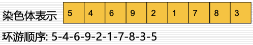

- 随机数排序

  生成 $N$ 个 $(0,1)$ 范围内的随机数对 $N$ 个城市编号，这 $N$ 个随机数的排序对应旅游城市的顺序

  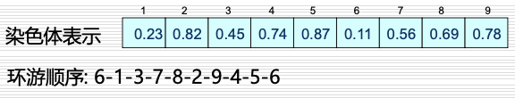

### 选择

选择是用来确定重组或交叉个体，以及被选个体将产生多少个子代个体。

首先计算适应度：

- (1) 按比例的适应度计算；
- (2) 基于排序的适应 s 计算；

适应度计算之后是实际的**选择**，按照适应度进行父代个体的选择。

选择策略如下：

#### 轮盘赌选择

（Roulette-wheel selection）

#### 锦标赛选择

（Tournament selection）

遗传算法中最流行的选择策略

- 更小的复杂度
- 易并行化处理
- 不易陷入局部最优点
- 不需要对所有的适应度值进行排序处理

#### 截断选择

（Truncation selection）

#### 蒙特卡洛选择

（Monte Carlo selection）

#### 概率选择

（Probability selection）

#### 线性排序选择

（Linear-rank selection）

#### 指数排序选择

（Exponential-rank selection）

#### 玻尔兹曼选择

（Boltzmann selection）

#### 随机遍历选择

（Stochastic-universal selection）

#### 精英选择

（Elite selection）

### 交叉(基因重组)

#### 单点交叉

随机产生一个交叉点位置，父个体 1 和父个体 2 在交叉点位置之右(后)的部分基因码互换，形成子个体 1 和子个体 2。

#### 部分映射交叉

(Partial-Mapped Crossover ,PMX)

- step 1 : 随机选择下标 s,t
- step 2 : 交叉子串，2 个 parent 的 s-t 部分子串交换
- step 3 : 确定映射关系，参考[置换群](https://fuuzen.github.io/math/discrete-math/algebra/permutation-group/)的操作
- step 4 : 生成后代染色体

#### 其他交叉操作

order crossover (OX)

cycle crossover (CX)

position-based crossover

order-based crossover

### 变异

(mutation)

交叉之后子代经历的变异，实际上是子代基因按小概率扰动产生的变化。

#### 倒置变异

(Inversion Mutation)

- step 1: 随机选择下标 s,t
- step 2 : 将 parent 的 s-t 中间部分倒置，得到 offspring

### 流程

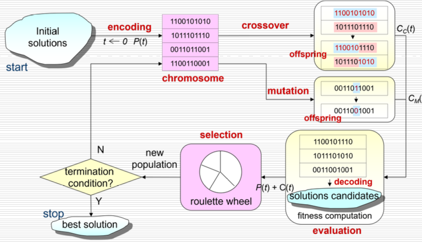

1. 随机产生初始种群，个体数目一定，每个个体表示为染色体的基因编码
2. 计算个体的适应度，并判断是否符合优化准则，若符合，输出最佳个体及其代表的最优解，并结束计算；否则转向第 3 步
3. 依据适应度选择再生个体，适应度高的个体被选中的概率高，适应度低的个体可能被淘汰
4. 按照一定的交叉概率和交叉方法，生成新的个体
5. 按照一定的变异概率和变异方法，生成新的个体
6. 由交叉和变异产生新一代的种群，返回到第 2 步

### 伪代码

```python
输入 $N$ 个城市的坐标 (这里单纯以欧式距离作为路程代价)
(还可以输入距离矩阵，在算法运行前计算距离)
随机生成10个不同个体的初始种群 P(0)
for t=0 to 最大选代轮数 :
  初始化后代种群 C(t)
  for i = 1 to 每一代后代数目 :
    依据适应度，从 P(t) 中选取一对父母 p1,p2
    利用交叉操作，从 p1,p2 产生后代 c1,c2
    以一定概率对 c1,c2 进行变异操作
    C(t) <= {c1,c2}
  end for
  依据适应度，从 Union{P(t),C(t)} 选取优异个体作为 P(t+1)
end for
依据适应度，从最后一代种群中选择最优个体作问题的解
```

### TSP:star:

用遗传算法 (GA) 旅行商问题 (TSP) 。(python 中可以直接用 `GA.tsp` ...)

可供测试的数据集：[National Traveling Salesman Problems (uwaterloo.ca) ](https://www.math.uwaterloo.ca/tsp/world/countries.html)

## 自然启发式优化搜索算法

群体智能（Swarm intelligence，SI）和生物启发（u）

!!! abstract
    This part is to be completed
