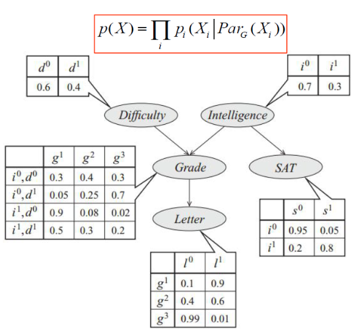
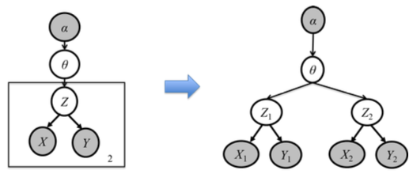

按照所用知识的确定性，可以分为确定性和不确定性推理：

- **确定性推理**是建立在经典逻辑基础上的，经典逻辑的基础之一就是集合论。这在很多实际情况中是很难做到的，如高、矮、胖、瘦就很难精确地分开；
- **不确定性推理**就是从不确定性初始证据出发，通过运用不确定性的知识，最终推出具有一定程度的不确定性但却是合理或者近乎合理的结论的思维过程。

常识（common sense）具有不确定性。一个常识可能有众多的例外，一个常识可能是一种尚无理论依据或者缺乏充分验证的经验。常识往往对环境有极强的依存性。

不确定知识表示和推理方法：

- 确定性理论
  - 用**可信度**表示不确定性
- 证据理论
  - 用**信任函数**度量不确定性
- 模糊逻辑和模糊推理
  - **模糊集合论**应用于近似或模糊推理，形成了可能性理论
  - **模糊逻辑**可以看作是多值逻辑的扩展。模糊推理是在一组可能不精确的前提下推出一个可能不精确的结论

!!! abstract
    - 概率论处理的是由随机性引起的不确定性；
- 可能性理论处理的是由模糊性引起的不确定性

## 概率图模型

### 基础知识

这是概率论与图论结合的产物，为统计推理和学习提供了一个统一的灵活框架

- 节点表示变量节点
- 之间的边表示局部变量间的概率依赖关系
- 局部变量分布的连乘积表示系统的联合概率分布

该表示框架不仅避免了对复杂系统的联合概率分布直接进行建模，而且易于引入先验知识

!!! abstract
    概率图模型统一了目前广泛应用的许多统计模型和方法:

- 马尔科夫随机场（MRF）
- 条件随机场（CRF）
- 隐马尔科夫模型（HMM）
- 多元高斯模型
- 卡尔曼滤波、粒子滤波、变分推理\cdots \cdots

!!! info 
    概率论基础【回顾】

- 频率论学派
  - 事件的概率是当我们无限次重复试验时，事件发生次数的比值
    - 投掷硬币、掷骰子等
- 贝叶斯学派
  - 将事件的概率视为一种主观置信度
    - 我认为明天下雨的概率是 30%；他认为明天下雨的概率是 80%

基础：

- 乘法/链式法则 求 联合概率
- 加法法则
- 贝叶斯定理：$\text{后验概率}=\frac{\text{先验概率}\times\text{似然度}}{\text{标准化常量}}$

三个概念：

- 联合概率分布
- 边缘概率分布
- 最大后验概率状态

### 分类

贝叶斯网络以外不作重点，那基本是不考了

- 有向图模型 Directed graphs
  - :star:贝叶斯网络
  - 隐马尔科夫模型
  - 卡尔曼滤波
- 无向图模型 Undirected graphs
  - 马尔可夫随机场
  - 条件随机场
- 因子图模型 Factor graphs

### 贝叶斯网络:star:

!!! abstract
    $a,b$ 相互独立：$a\perp\llap{\perp}b$；

$a,b$ 在给定 $c$ 的条件下相互独立（条件独立）：$a\perp\llap{\perp}b|c$；

#### 定义

贝叶斯网络（Bayesian Network，简称 BN）是不确定知识表示与推理的一种有效方法，属于有向图模型，它由这些组成：

- 一个有向无环图（Directed Acyclic Graph, DAG）
- 一系列条件概率表（衡量了上述关系的强度）

令 _G_ 为定义在 $\{X_1,X_2,\cdots,X_N\}$ 上的一个贝叶斯网络，其联合概率分布可以表示为**各个节点的条件概率分布的乘积** ：

$$
p(X)=\prod_{i}p_i(X_i|Par_G(X_i))
$$

联合概率分布结构化分解，原本表示 $n$ 个二元随机变量的联合分布需要 $2^n-1$ 个参数，用贝叶斯网络建模，假设每个节点最多有 $k$ 个父节点，所需要的参数最多为 $n\ 2^k$ ，所需参数大幅减少

---

贝叶斯网络举例

节点定义：

- 试题难度（Difficulty）
- 智力（Intelligence）
- 考试等级（SAT）
- 高考成绩（Grade）
- 是否得到推荐信（Letter）

#### 盘式记法

贝叶斯网络的一种简洁的表示方法，其将相互独立的、由相同机制生成的多个变量放在一个方框（盘）内，并在方框中标出类似变量重复出现的个数。方框可以嵌套，且通常用阴影标注出可观察到的变量

#### 举例

##### 一元语言模型

假设文本中每个词都和其他词独立，和它的上下文无关。通过一元语言模型，我们可以计算一个序列的概率，从而判断该序列是否符合自然语言的语法和语义规则。

##### 一元混合语言模型

假设给定文本主题（z）的前提下，该文本中的每个词都和其他词条件独立。其中，z 为隐变量。

##### 概率潜在语义分析

##### 潜在狄利克雷分配

#### 构建步骤

- 步骤 1：

  在某种变量顺序下，对所有变量的联合概率应用链式法则

  $$
  Pr(X_1,\cdots ,X_n)=Pr(X_n|X_1,\cdots ,X_{n-1})Pr(X_{n-1}|X_1,\cdots ,X_{n-2})\cdots Pr(X_1)
  $$

- 步骤 2：

  对于每个变量 $X_i$ ，考虑该变量的条件集合 $\{X_1,\cdots,X_{i-1}\} $，采用如下方法递归地判断条件集合中的每个变量 $X_j$ 是否可以删除：

  如果给定其余变量的集合，$X_i$ 和 $X_j$ 是条件独立的，则将 $X_i$ 从 $X_j$ 的条件集合中删除。

  经过这一步骤，可以得到下式:

  $$
  Pr(X_1,\cdots,X_n)=Pr(X_n|Par(X_n))Pr(X_{n-1}|Par(X_{n-1}))\cdots Pr(X_1)
  $$

- 步骤 3：

  基于上述公式，构建一个有向无环图。其中，对于每个用节点表示的变量 $X_i$ ，其父节点为 $Par(X_i)$ 中的变量集合。

- 步骤 4：

  为每个家庭（即变量及其父节点集合）确定条件概率表的取值

#### D-分离:star:

对于一个有向无环图，D-分离（D-Separation）是一种用来判断其变量是否条件独立的图形化方法。在基于贝叶斯网络的不确定性知识推理中，采用 D-分离方法可以简化概率计算，提高运行速度

D-分离可用于判断任意两个节点的相关性和独立性。

- 若存在一条路径将这两个节点（直接）连通，则称这两个节点是**有向连接**（d-connected）的，即这两个节点是**相关的**
- 若不存在这样的路径将这两个节点连通，则这两个节点不是有向连接的，则称这两个节点是**有向分离**的（d-separated），即这两个节点**相互独立**

定义：路径 𝑝 被限定集 𝑍 阻塞（block）当且仅当：

- 路径 𝑝 含有链结构 A→𝐵→C 或分连结构 A←𝐵→C 且中间节点 𝐵 在 𝑍 中
- 或者路径 𝑝 含有汇连结构 A→𝐵←C 且汇连节点 𝐵 及其后代都不在 𝑍 中

定义：若 𝑍 阻塞了节点 X 和节点 𝑌 之间的每一条路径，则称给定 𝑍 时，X 和 𝑌 是 D-分离，即给定 𝑍 时，X 和 𝑌 条件独立

引理：父节点已知时，该节点与其所有非后代的节点（ non-descendants）满足 D-separated

定理：父节点已知时，该节点与其所有非后代的节点（ non-descendants）条件独立

#### 具体例子

- 单一：Naive Bayes（朴素贝叶斯）
- 混合：GMM （混合高斯模型）
- 加入时间维度

  - Markov Chain
  - Gaussian Process（无限维高斯分布）

- 连续：Gaussian Bayesian Network
- 混合模型与时间结合起来：动态模型
  - HMM（离散）
  - Karman Filter（连续[高斯]、线性）
  - Particle Filter（非高斯、非线性）

总的来说，用两句话总结这些模型：从单一到混合、从有限到无限

两个角度：空间（随机变量的取值从离散到连续）、时间（加入时间维度，从某一时刻延长到无限时间）

## 概率图模型的推理

（贝叶斯网络为主）

### 变量消元算法(VE)

变量消除（Variable Elimination，VE）基本思想：通过从联合概率分别逐步消除变量，来求边缘概率

给定一个贝叶斯网络的一系列条件概率表 $\mathbf F$，查询变量 $Q$，证据变量的取值 $\mathbf E=e$ ，剩余变量 $\mathbf Z$ ，需要计算 $Pr(Q|\mathbf E)$

#### 因子及相关操作

$f(\mathbf{X},\mathbf{Y})$ 指代涉及变量集合 $\mathbf{X}\cup\mathbf{Y}$ 的因子，如条件概率表中的 $Pr(C|A)$ 可以用因子 $f(C,A)$ 或者 $f(A,C)$ 来表示；

- 限制：给定 $f(X,\mathbf{Y})$ 且 $X=a$ ，则 $f_{X=a}=h(\mathbf{Y})=f(a,\mathbf{Y})$；

- 相乘：给定 $f(\mathbf{X},\mathbf{Y})$ 和 $g(\mathbf{Y},\mathbf{Z})$ ，则

  $$
  h(\mathbf{X},\mathbf{Y},\mathbf{Z})=f(\mathbf{X},\mathbf{Y})\times g(\mathbf{Y},\mathbf{Z})
  $$

- 求和：给定 $f(X,\mathbf{Y})$ ，则该因子在变量 $X$ 上求和将得到

  $$
  h(\mathbf{Y})=\sum_{x\in Dom(X)}f(x,\mathbf{Y})
  $$

-

#### 算法流程

- 对于任意因子 $f\in\mathbf F$ ，如果该因子涉及 $E$ 中的一个或多个变量，则将其替换为限制后的因子 $f_{\mathbf E=e}$

- 给定一个消元顺序，对于变量 $Z_j\in\mathbf Z$：

  - 令 $f_1,f_2,\cdots,f_k$ 为 $\mathbf F$ 中包含 $Z_j$ 的所有因子；

  - 将这些因子相乘并在 $Z_j$ 上求和后得到新的因子：

    $$
    g_j=\sum_{Z_j}f_1\times f_2\times\cdots\times f_k
    $$

  - 从 $\mathbf F$ 中删除 $f_1,f_2,\cdots,f_k$ ，并将 $g_j$ 加入到 $\mathbf F$ 中

- 剩下的因子将只涉及查询变量 $Q$，对这些因子相乘并归一化后得到 $Pr(Q|\mathbf E)$ 。

#### 算法理解

第一种角度是理解为乘法对加法的分配律

第二种角度是 message 的传播过程，也就是**局部的消息传递**

### 信念传播算法(BP)

信念传播算法（Belief Propagation， BP），基于**局部的消息传递**，可以视为 VE 算法 + 缓存 的推广：BP = VE + Caching

- 在树状图模型上能收敛，且能达到精确推理
- 但在一般图模型上，BP 为近似推理算法

$$
m_{b\to a}(x_a)=\sum_{b}\varphi_{ab}\cdot\varphi_{b}\cdot m_{c\to b}(x_b)\cdot m_{d\to b}(x_b)
$$

称 $\varphi_{b}\cdot m_{c\to b}(x_b)\cdot m_{d\to b}(x_b)$ 为**信念** (belief)

- $\varphi_{b}$ 来自 $b$ 自己；
- $m_{c\to b}(x_b)\cdot m_{d\to b}(x_b)$ 来自 $b$ 的 children

一般化形式：

$$
\begin{aligned}
m_{j\to i}(x_i)
&=\sum_{x_j}\varphi_{ij}\cdot\varphi_{j}\prod_{k\in\text{NB}(j)-i}m_{k\to j}(x_j)\\
P(x_i)
&=\varphi_i\prod_{j\in\text{NB}(i)}m_{j\to i}(x_i)\\
&=\varphi_i\prod_{j\in\text{NB}(i)}\sum_{x_j}\varphi_{ij}\cdot\varphi_{j}\prod_{k\in\text{NB}(j)-i}m_{k\to j}(x_j)
\end{aligned}
$$

#### 因子图 BP

## 概率图模型的学习

（不考）

条件概率表的学习方法：

- 极大似然
- 期望最大化

贝叶斯网络结构学习常用方法：

- 基于约束的结构学习 （constraint-based structure learning）：将贝叶斯网络看作是一种独立关系的表示。尝试对数据中的条件依赖和条件独立关系进行检验，找到能够对这些依赖和独立关系给出最好解释的某个网络。
- 基于得分的结构学习 （score-based structure learning）：定义模型对观测数据拟合程度的得分函数，通过最大化得分函数完成结构学习。
  - 结构斯然得分
  - 贝叶斯得分
