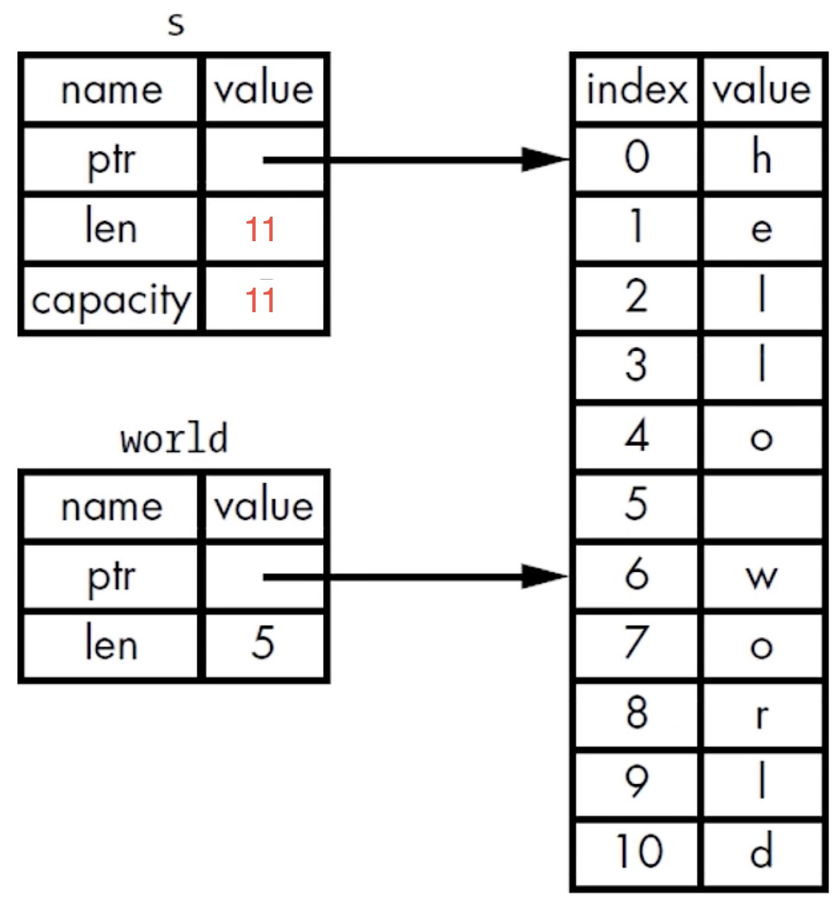

## 参考资料

- [Rust 语言圣经(自称)](https://course.rs)
  - [锈书](https://rusty.course.rs)
- [官网](https://www.rust-lang.org)

## 环境配置

更新 Rust

```bash bash
rustup update
```

卸载 Rust

```bash bash
rustup self uninstall
```

查看版本

```bash bash
rustc --version

### 显示格式
rustc.x.y.z([commit hash] [commit date])
```

安装 Rust 同时还会安装文档，查看本地文档

```bash bash
rustup doc
```

## Rust 工具

## 编译器

### `rustc`

只适合单文件编译

```shell
rustc xxx.rs <output>
```

### `cargo`

Cargo 是 Rust 的构建系统和包管理工具，适用于较大型项目编译、链接

- 构建代码
- 下载依赖的库
- 构建这些库

创建项目，会创建一个新目录 `project` 并且初始化一个 git 项目

```shell
cargo new project
```

创建好的项目结构

```shell
.
├── .git
├── .gitignore
├── Cargo.toml
└── src
    └── main.rs
```

检查代码能否通过编译，并不会编译项目，很常用

```shell
cargo check
```

构建项目

```shell shell
cargo build           ## 默认为调试模式即 --debug
cargo build --debug   ## 同上
cargo build --release ## 发布模式，编译出的程序性能更高
```

运行项目

```shell shell
cargo run           ## 默认为调试模式即 --debug
cargo run --debug   ## 同上
cargo run --release ## 发布模式，编译出的程序性能更高
```

#### 安装依赖库换源

!!! warning
    目前 `cargo search` 无法使用镜像

- 字节镜像源[参考](https://rsproxy.cn)
- 华科镜像源[参考](https://mirrors.ustc.edu.cn/help/crates.io-index.html)

##### 方法一

在 `$HOME/.cargo/config.toml` 文件 (没有则创建一个) 添加如下内容：

```toml toml
## 华科镜像源
[registries]
ustc = { index = "https://mirrors.ustc.edu.cn/crates.io-index/" }

## 或者
[registries.ustc]
index = "https://mirrors.ustc.edu.cn/crates.io-index/"
```

或者稀疏索引的方式，要求 cargo >= 1.68 ：

```toml toml
[source.ustc-sparse]
registry = "sparse+https://mirrors.ustc.edu.cn/crates.io-index/"
```

同时需要在项目 `cargo.toml` 使用注册方式引入依赖库：

```toml toml
[dependencies]
<要引入的包> = { registry = "ustc" }
<要引入的包> = { registry = "rsproxy" }
```

##### 方法二

不需要对项目 `cargo.toml` 添加配置，只需要 `$HOME/.cargo/config.toml` 文件 (没有则创建一个) 添加如下内容：

```toml toml
[source.crates-io]
replace-with = 'rsproxy' ## 字节跳动镜像源

[source.rsproxy]
registry = "https://rsproxy.cn/crates.io-index" ## 镜像源 url
```

稀疏索引，要求 cargo >= 1.68 ：

```toml toml
[source.rsproxy-sparse]
registry = "sparse+https://rsproxy.cn/index/"

[registries.rsproxy]
index = "https://rsproxy.cn/crates.io-index"

[net]
git-fetch-with-cli = true
```

## 项目结构

### 项目结构要求

- Cargo.toml 在项目顶层下
- 源代码都应该在 src 目录下
- 顶层目录可以放置：README、许可信息、配置文件和其它与程序源码无关的文件

如果创建项目时没有使用 cargo，也可以把项目转化为使用 cargo：

- 把源代码文件移动到 src 下
- 创建 Cargo.toml 并填写相应的配置

### `Cargo.toml`

eg:

```toml toml
[package]
name = "my-project"
version = "0.1.0"
authors = ["fuuzen <fuuzen.github.io>"]
edition = "2024"

[dependencies]
...
```

#### `[package]`

- name
- version
- authors
- edition

#### `[dependencies]`

- crate 包
- ...

三种描述：

- 基于 Rust 官方仓库 `crates.io`，通过版本说明来描述
- 基于项目源代码的 git 仓库地址，通过 URL 来描述
- 基于本地项目的绝对路径或者相对路径，通过类 Unix 模式的路径来描述

eg :

```toml toml
[dependencies]
rand = "0.3"
hammer = { version = "0.5.0"}
color = { git = "https://github.com/bjz/color-rs" }
geometry = { path = "crates/geometry" }
```

## 变量和常量

### 变量

#### `let`变量绑定 (binding)

rust 中 `let` 表达式的类似其他语言赋值的作用，实际上不是赋值，而叫做 **绑定**，这与 rust **所有权** 这一核心概念有关

默认绑定变量类型为 `immutable` 不可变的，需要可变则须加上 `mut` 显式声明

```rust
// 使用let来声明变量，进行绑定，a是不可变的
// 此处没有指定a的类型，编译器会默认根据a的值为a推断类型：i32，有符号32位整数
// 语句的末尾必须以分号结尾
let a = 10;
// 主动指定b的类型为i32
let b: i32 = 20;
// 这里有两点值得注意：
// 1. 可以在数值中带上类型:30i32表示数值是30，类型是i32
// 2. c是可变的，mut是mutable的缩写
let mut c = 30i32;
// 还能在数值和类型中间添加一个下划线，让可读性更好
let d = 30_i32;
// 跟其它语言一样，可以使用一个函数的返回值来作为另一个函数的参数
let e = add(add(a, b), add(c, d));
```

#### `_`编译器忽略未使用变量

告诉编译器不要警告未使用的变量，为此可以用下划线作为变量名的开头

```rust
let _a = 5
```

#### `let`变量解构

从一个复杂的变量中匹配出部分内容

```rust
let (a, mut b): (bool,bool) = (true, false);
// a = true,不可变; b = false，可变

println!("a = {:?}, b = {:?}", a, b);

b = true;
assert_eq!(a, b);
```

#### 解构式赋值

在 [Rust 1.59](https://course.rs/appendix/rust-versions/1.59.html) 版本后可以在赋值语句的左式中使用元组、切片和结构体模式，不需要 `let`

```rust
struct Struct {
    e: i32
}

fn main() {
    let (a, b, c, d, e);

    (a, b) = (1, 2);
    // _ 代表匹配一个值，但是我们不关心具体的值是什么，因此没有使用一个变量名而是使用了 _
    [c, .., d, _] = [1, 2, 3, 4, 5];
    Struct { e, .. } = Struct { e: 5 };

    assert_eq!([1, 2, 1, 4, 5], [a, b, c, d, e]);
}
```

这种使用方式跟之前的 `let` 保持了一致性，但是 `let` 会重新绑定，而这里仅仅是对之前绑定的变量进行再赋值。

!!! warning
    使用 `+=` 的赋值语句还不支持解构式赋值

#### 变量遮蔽 (shadowing)

Rust 允许声明相同的变量名，在后面声明的变量会遮蔽掉前面声明的。

变量遮蔽的用处在于，如果你在某个作用域内无需再使用之前的变量（在被遮蔽后，无法再访问到之前的同名变量），就可以重复的使用变量名字，而不用绞尽脑汁去想更多的名字。

- 可以使用相同的名字声明新的变量，新的变量就会 shadow（隐藏）之前声明的同名变量

- 在后续的代码中这个变量名代表的就是新的变量

shadow 和把变量标记为 mut 是不一样的：

- 如果不使用 `let` 关键字，那么重新给非 `mut` 的变量赋值会导致编译时错误
- 而使用 `let` 声明的同名新变量，也是不可变的
- 使用 `let` 声明的同名新变量，它的类型可以与之前不同

### 常量

常量也是绑定到一个常量名且不允许更改的值

#### 常量和变量之间的差异

- 常量不允许使用 `mut`。**常量不仅仅默认不可变，而且自始至终不可变**，因为常量在编译完成后，已经确定它的值。
- 常量使用 `const` 关键字而不是 `let` 关键字来声明，并且值的**类型必须标注**。

#### Rust 常量的命名约定

- 全部字母都使用大写
- 使用下划线分隔单词，另外对数字字面量可插入下划线以提高可读性

## 基本类型 (标量)

### 原始类型

#### 整数类型

类型定义的形式统一为：`有无符号 + 类型大小(位数)`

| 长度       | 有符号类型 | 无符号类型 |
| ---------- | ---------- | ---------- |
| 8 位       | `i8`       | `u8`       |
| 16 位      | `i16`      | `u16`      |
| 32 位      | `i32`      | `u32`      |
| 64 位      | `i64`      | `u64`      |
| 128 位     | `i128`     | `u128`     |
| 视架构而定 | `isize`    | `usize`    |

##### `isize` 和 `usize` 类型

`isize` 和 `usize` 类型的位数由程序运行的计算机的架构所决定：

- 如果是 64 位计算机，那就是 64 位的
- 如果是 32 位计算机，那就是 32 位的
- ...

##### 整数字面值

rust 有以下 5 种整数字面类型：

| Number literals | Example     |
| --------------- | ----------- |
| Decimal         | 98_222      |
| Hex             | 0xff        |
| Octal           | 0o77        |
| Binary          | 0b1111_0000 |
| Byte (u8 only)  | b'A'        |

- 除了 `Byte` 类型外，所有的数值字面值都允许使用类型后缀。

  - 例如 `57u8`

- 如果不太清楚应该使用那种类型，可以使用 Rust 相应的默认类型
  - 整数的默认类型就是 `i32` ，其速度整体上是较快的，即使是在 64 位操作系统中

##### 整数溢出

- 调试模式 (--debug) 下编译：Rust 会检查整数溢出，如果发生溢出，程序在运行时就会 panic

- 发布模式下（--release）编译：Rust 不会检查可能导致 panic 的整数溢出

  - 如果溢出发生：Rust 会执行 “环绕” 操作：(取模)

    - 例如：`u8` 的范围是 0-255，如果把一个 `u8` 变量的值设为 256，那么 Rust 会将 256 变成 0，257 变成 1 ⋯

  - 但程序不会 panic

#### 浮点类型

Rust 有两种基础的浮点类型，也就是含有小数部分的类型：

- `f32`，32 位，单精度
- `f64`，64 位，双精度

Rust 的浮点类型使用了 IEEE-754 标准来表述

**`f64` 是**默认**类型，因为在现代 CPU 上 `f64`和 `f32` 的速度差不多，而且精度更高。**

#### 布尔类型

- 符号是 `bool`
- Rust 的布尔类型也有两个值：
  - `true`
  - `false`
- 占一个字节大小

!!! warning
    Rust 不允许其他类型直接当作布尔类型使用，和其他语言不太一样！

#### 字符类型

- 符号是 `char`
- Rust 语言中 `char` 类型被用来描述语言中最基础的单个字符。
- 字符类型的字面值使用单引号
- 占用 **4 字节**大小
- 是 Unicode 标量值，可以表示比 ASCII 多得多的字符内容，包括：拼音、中日韩文、零长度空白字符、emoji 表情等。

!!! warning
    Unicode 中并没有“字符”的概念，所以直觉上认为的字符也许与 Rust 中的概念并不相符

### 基本类型转换

#### 隐式

1. 整数类型之间的转换：Rust 允许在整数类型之间进行隐式转换，只要目标类型的表示范围足够容纳源类型的值。例如，可以将 `u8` 转换为 `u16`、`i32` 转换为 `u64` 等。
2. 浮点数类型之间的转换：Rust 允许在浮点数类型之间进行隐式转换，只要目标类型能够表示源类型的精度和范围。例如，可以将 `f32` 转换为 `f64`。
3. 整数类型到浮点数类型的转换：Rust 允许将整数类型隐式转换为相应的浮点数类型。例如，可以将 `i32` 转换为 `f64`。
4. 字面量的隐式转换：在字面量的使用中，Rust 会根据上下文自动进行隐式类型转换。例如，可以将整数字面量 `42` 隐式转换为 `u8`、`i32` 或其他整数类型，或将浮点数字面量 `3.14` 隐式转换为 `f32` 或 `f64`。

#### 显式

Rust 鼓励显式的类型转换，并提供了一些安全的类型转换方法，以确保程序在类型转换时保持安全和可预测。Rust 有三种变量类型显式转换的方法：

- `as` 关键字
- `from` 和 `into` 这些 `trait` 进行转换
- 字符串类型可以使用 `parse` 方法转换到数字类型

##### `as` & `as_<T>()`

`as` 运算符转换示例：

```rust rust
let x: i32 = 5;
let y: u32 = x as u32;
```

`as` 运算符还有一个安全版本 `as_<T>()`，它会在溢出时返回一个 `Option` 值。

eg：

```rust
fn main() {
    let num: u32 = 42;

    // 将 u32 类型转换为 i16 类型
    let converted: Option<i16> = num.as_();

    match converted {
        Some(value) => println!("Converted value: {}", value),
        None => println!("Conversion failed"),
    }
}
```

##### `From` & `Into`

在 Rust 中，`From` 和 `Into` 是用于自定义类型转换的 trait。通过实现这些 trait，可以定义自定义类型之间的转换规则。

`From` trait 定义了一个类型转换的关联函数 `from()`，用于将其他类型转换为当前类型。

`Into` trait 则定义了一个类型转换的方法 `into()`，用于将当前类型转换为其他类型。

eg：

```rust
// 定义一个自定义类型
struct MyType(u32);

// 实现 From trait，将 u32 类型转换为 MyType
impl From<u32> for MyType {
    fn from(value: u32) -> Self {
        MyType(value)
    }
}

// 实现 Into trait，将 MyType 转换为 u32 类型
impl Into<u32> for MyType {
    fn into(self) -> u32 {
        self.0
    }
}

fn main() {
    let num: u32 = 42;

    // 使用 From trait 进行转换
    let my_type: MyType = MyType::from(num);

    // 使用 Into trait 进行转换
    let back_to_num: u32 = my_type.into();

    println!("MyType: {:?}", my_type);
    println!("Back to u32: {}", back_to_num);
}
```

##### `parse`

使用 `parse` 方法将字符串类型转换为数字类型，如整数或浮点数。`parse` 方法是定义在 `str` 类型上的一个函数，它返回一个 `Result` 枚举类型，表示解析操作的结果。

eg：

```rust
fn main() {
    let num_str = "42";

    // 将字符串转换为整数类型
    let num: Result<i32, _> = num_str.parse();

    match num {
        Ok(n) => println!("Parsed number: {}", n),
        Err(e) => println!("Error: {}", e),
    }
}
```

### 复合类型

- 复合类型可以将多个值放在一个类型里。
- Rust 提供了两种基础的复合类型：元组（Tuple）、数组

#### `Tuple`

- `Tuple` 可以将多个类型的多个值放在一个类型里
- `Tuple` 的长度是固定的：一旦声明就无法改变
- `Tuple` 中的每个位置都对应一个类型，`Tuple` 中各元素的类型不必相同

##### 创建 `Tuple`

在小括号里，将值用逗号分开

```rust
let tup: (132, f64, 48) = (500, 6.4, 1);
```

##### 获取 `Tuple` 的元素值

可以使用**模式匹配**来解构（destructure）一个 `Tuple` 来取元素的值

```rust
let (x, y, z) = tup;
```

##### 访问 `Tuple` 的元素

在 tuple 变量使用**点标记法**，后接元素的索引号

```rust
println!("{} {} {}", tup.O, tup.1, tup.2);
```

#### 数组

- 数组也可以将多个值放在一个类型里
- 数组中每个元素的类型必须相同
- 数组的长度也是固定的

数组没有 `Vector` 灵活，如果想让你的数据存放在 stack（栈）上而不是 heap（堆）上，或者想保证有固定数量的元素，这时使用数组更有好处

##### 数组的类型

数组的类型以这种形式表示：`[类型;长度]`

##### 声明一个数组

两种方法：

- 在中括号里，各值用逗号分开
- 如果数组的每个元素值都相同，那么可以定义为：`[初始值;长度]`

```rust
let a = [1, 2, 3, 4, 51];

let a =［3;5]
// 它就相当于：let a= ［3, 3, 3, 3, 3];
```

##### 访问数组的元素

可以使用索引来访问数组的元素。

如果访问的索引超出了数组的范围，那么：

- 索引是字面量等，编译器能检查出来，编译不通过
- 编译器没能检查出来，编译通过
  - 运行会报错（runtime 时会 panic）
  - Rust 不会允许其继续访问相应地址的内存

#### 枚举类型

`enum` 关键字表示枚举类型

##### 定义枚举

例如 IP 地址：IPV4、IPv6

```rust
enum IpAddrKind {
  V4,
  V6,
}
```

!!! abstract
    标准库中的 `IpAddr`

```rust
struct Ipv4Addr {
  // --snip--
｝

struct Ipv6Addr {
  // --snip--
}

enum IpAddr {
  V4(Ipv4Addr),
  V6(Ipv6Addr),
}
```

##### 变体、标识符、枚举值

- 变体是枚举类型的不同选项或可能的值之一
- 标识符是用于表示枚举类型的变体的名称
- 枚举值是通过选择枚举类型的一个变体来实例化的具体值

枚举的变体都位于标识符的命名空间下，使用两个冒号 `::` 进行分隔

```rust
let four = IpAddrKind::V4;
let six = IpAddrKind::V6;
```

##### 将数据附加到枚举的变体中

```rust
enum IpAddr {
  V4(String),
  V6(String),
}
//每个变体可以拥有不同的类型以及关联的数据量
enum IpAddr {
  V4(u8, u8, u8, u8),
  V6(String),
}
```

- 优点：
  - 不需要额外使用 `struct`
  - 每个变体可以拥有不同的类型以及关联的数据量

##### 枚举方法

与 `struct` 类似，也使用 `impl` 关键字

##### `Option` 枚举

- 定义于标准库中
- 在 Prelude（预导入模块）中
- 描述了：某个值可能存在（某种类型）或不存在的情况

###### `Option<T>`

!!! info 
    Rust 没有 Null。其它语言中，Null 是一个值，它表示“没有值”，一个变量可以处于两种状态：空值（nuI）、非空。

Null 引用: Billion Dollar Mistake

Null 的问题在于：当你尝试像使用非 Null 值那样使用 NuIl 值的时候，就会引起某种错误

Null 的概念还是有用的：因某种原因而变无效或缺失的值

Rust 中类似 Null 概念的枚举 `Option<T>` ，定义如下：

```rust
enum Option<T>{
  Some(T),
  None,
}
```

`T` 是一个类型参数，代表值的类型。这里出现三个类型都定义在标准库中：

- `Option<T>`
- `Some (T)` ，`Some` 表示存在一个值，并将该值包装在 `Some` 中
- `None`

`Option<T>` 和 `T` 是不同的类型，不可以把 `Option<T>` 直接当成 `T` ，例如以下代码会报错：

```rust
let x:i8 =5;
let y: Option<i8> = Some(5);
let sum = x + y; //编译报错：error [E0277]: cannot add `Option<i8>` to `i8`
```

若想使用 `Option<T>` 中的 `T` ，必须将它转换为 `T`

## 基础控制流

### 选择分支

#### `if else`

```rust
if ... {
  ...
} else if ... {
  ...
} else {
  ...
}
```

!!! warning
    如下代码在 rust 编译器环境下会产生报错：

```rust
let number = if condition { 5 } else { "6" }
```

因为返回给 `number` 的结果类型不确定！

#### `match`

允许一个值与一系列模式进行匹配，并执行匹配的模式对应的代码，模式可以是字面值、变量名、通配符...

`match` 匹配**必须穷举所有的可能**，否则会产生报错：

```bash bash
error [E0004]: non-exhaustive patterns:...
```

- `_` 通配符：替代其余没列出的值

```rust
match ... {
  a => (...),
  b => (...),
  _ => (...),
}
```

#### `if let`

语法的一般形式如下：

```rust
if let pattern = expression {
  // 匹配成功的处理逻辑
} else if let pattern = expression {
  // 匹配成功的处理逻辑
} else {
  // 匹配失败的处理逻辑
}
```

在上述语法中，`pattern` 是要匹配的模式，`expression` 是要进行匹配的表达式。如果表达式与模式匹配成功，则执行匹配成功的处理逻辑。如果匹配失败，则执行匹配失败的处理逻辑。

下面是一个示例，展示了如何使用 `if let` 处理 `Option` 类型：

```rust
fn main() {
    let some_value: Option<i32> = Some(5);

    if let Some(x) = some_value {
        println!("Got value: {}", x);
    } else {
        println!("Value is None");
    }
}
```

在上述示例中，`some_value` 是一个 `Option<i32>` 类型的变量，被赋值为 `Some(5)`。通过使用 `if let Some(x) = some_value`，我们尝试将 `some_value` 解构为 `Some` 并提取其中的值。如果匹配成功，将会执行 `println!("Got value: {}", x)`，打印提取到的值。如果匹配失败（即 `some_value` 是 `None`），则执行 `println!("Value is None")`。

使用 `if let` 处理只关心一种匹配而忽略其它匹配的情况，可以使代码更简洁、清晰地处理特定模式的匹配，减少了手动编写 `match` 表达式的工作量，

!!! info 
    可以把 iflet 看作是 match 的语法糖

### 循环

#### `loop`

- 没有条件判断
- 使用 `break` 跳出循环
- `loop` 有返回值，为 `break` 后面的表达式

```rust
let result = loop {
  ...
  if ... {
    break (expression) ;
  }
}
```

#### `while`

```rust
while ... {
  ...
}
```

和其他语言差别不大

#### `for`

比 `loop` 和 `while` 更适合遍历容器，更安全、高效

```rust
// eg:
let a = [10, 20, 30, 40, 50];
for element in a.iter() {
  println! ("the value is: {}", element);
}
```

## 所有权 `Ownership`

### 什么是所有权

Rust 的**核心特性**就是所有权

所有程序在运行时都必须管理它们使用的计算机内存

- 有些语言有垃圾收集机制 (GC)，在程序运行时，它们会不断地寻找不再使用的内存
- 还有一些语言，程序员必须显式地分配和释放内存 (eg: C)
- Rust 采用了第三种方式：
  - 内存是通过一个**所有权系统**来管理的，其中包含一组编译器在编译时检查的规则
  - 当程序运行时，所有权特性不会减慢程序的运行速度，因为 Rust 的所有权系统将将内存的管理提前到了编译阶段

在像 Rust 这样的系统级编程语言里，一个值是在 stack 上还是在 heap 上对语言的行和你为什么要做某些决定是有更大的影响的。**管理 heap 数据就是所有权存在的原因。**

### Stack vs Heap

在代码运行的时候，Stack 和 Heap 都是你可用的内存，但他们的结构很不相同：

- Stack

  - Stack 按值的接收顺序来存储，按相反的顺序将它们移除（后进先出，LIFO）

    - 添加数据叫做压入栈 `push`
    - 移除数据叫做弹出栈 `pop`

  - 所有存储在 Stack 上的数据必须拥有已知的固定的大小
    - 因为指针是已知固定大小的，可以把指针存放在 stack 上。但如果想要实际数据，你必须使用指针来定位，然后访问 heap
  - 把数据压到 stack 上要比在 heap 上分配快得多，因为操作系统不需要寻找用来存储新数据的空间，那个位置永远都在 stack 的顶端
  - 如果数据存放的距离比较近，那么处理器的处理速度就会更快一些

- Heap

  - 当你把数据放入 heap 时，你会请求一定数量的空间，这个过程叫做在 heap 上进行分配，有时仅仅称“**分配**”。在 heap 上分配空间需要做**更多的工作**：

    - 操作系统在 heap 里找到一块足够大的空间
    - 然后要做好记录方便下次分配，把它标记为在用
    - 并返回一个**指针**，也就是这个空间的地址

  - 编译时大小未知的数据或运行时大小可能发生变化的数据必须存放在 heap 上
  - 如果数据之间的距离比较远，那么处理速度就会慢一些

所有权解决的问题：

- 跟踪代码的哪些部分正在使用 heap 的哪些数据
- 最小化 heap 上的重复数据量
- 清理 heap 上未使用的数据以避免空间不足。

掌握了所有权，那么就不需要经常去想 stack 或 heap 了

### 所有权规则

#### 三条规则

- 每个值都有一个变量，这个变量是该值的所有者
- 每个值同时只能有一个所有者
- 当所有者超出作用域（scope）时
  - 它拥有它的值的所有权，就会被 `drop` 函数清理 (heap 上的数据)
  - 它没有它的值的所有权，不会清理

#### 返回值与作用域

函数在返回值的过程中同样也会发生所有权的转移，返回表达式的值的所有权将转移到函数结果所赋值的变量上

### 复制 `Copy trait`

用于像整数这样完全存放在 stack 上面不包含 heap 上的简单数据类型（标量）

- 如果一个类型实现了 `Copy` 这个 `trait`，那么旧的变量在赋值后仍然可用
- 如果一个类型或者该类型的一部分实现了 `Drop trait` ，那么 Rust 不允许让它再去实现 `Copy trait` 了

```rust
let x = 5;
let y = x;
// x和y都是有效的
println! ("{} {}", x, y);
```

### 移动 `Move`

多个变量可以与同一个数据使用一种独特的方式 `Move` 来交互

以 `String` 类型为例

```rust
let s1 = String::from ("hello");
let s2 = s1;
```

当把 `s1` 赋给 `s2`，`String` 在 stack 上的数据被复制了一份，heap 内容不变


当 `s1` 、`s2` 离开作用域时，它们都会尝试释放相同的内存，就会导致**二次释放(double free) bug** 。为了避免这个问题，Rust 会让原来的 `s1` **失效** ，此后当 s1· 离开作用域的时候，Rust 不需要释放任何东西。

`s1` 此后处于 `moved` 状态，即失效。

!!! info 
    - 浅拷贝（shallow copy）
  - 只拷贝 stack 上的数据，有可能产生二次释放(double free) bug
- 深拷贝（deep copy）
  - 同时拷贝 stack 和 heap 上的数据

Rust 中采用的是第三种“拷贝”，也就是 **移动 `Move` **，在浅拷贝的基础上让原来的 stack 数据失效。

这体现了 Rust 隐含的一个设计原则：Rust 不会自动创建数据的深拷贝。就运行时性能而言，任何自动赋值的操作都是廉价的。

### 克隆 `CLone`

针对包含 heap 数据的矢量数据类型，相当于深拷贝

```rust
let s1 = String::from("Hello");
let s2 = s1.clone();
```


### 引用 `Reference`

`&` 符号就表示引用，允许引用该值而不取得其所有权；

对应的解引用符号是 `*`

!!! info 
    和 C/C++ 一样，Rust 引用是符号是 `&` ，解引用符号是 `*`


Rust 中的引用在任何给定的时刻，引用必须一直有效(非悬空引用)，只能满足下列条件之一：

- 一个可变的引用
- 任意数量不可变的引用

#### 可变引用 `Mutable Reference`

Rust 支持**可变引用** ，用 `&mut` 符号代替 `&` 即为可变引用。

但是可变引用有以下几个限制：

- 在特定作用域内，对于某一块数据，只能有一个可变引用
- 不可以同时拥有可变引用和不可变引用
- （多个不变的引用是可以的）

第一个限制的好处是可在编译时防止数据竞争。违反将出现如下报错：

```bash bash
error[E0499]: cannot borrow 'xxx' as mutable more than once at a time
```

第二个限制避免了可变引用对不可变引用的影响。违反将出现如下报错：

```bash bash
error[E0502]: cannot borrow 'xxx' as mutable because it is also borrowed as immutable
```

::: infromation

以下三种行为下会发生数据竞争：

- 两个或多个指针同时访问同一个数据
- 至少有一个指针用于写入数据
- 没有使用任何机制来同步对数据的访问

数据竞争在运行时是很难发现的（C/C++ 里经常出现），所以 Rust 从根本上避免了这种问题来保证运行时的安全性

可以通过创建新的作用域，来允许**非同时**的创建**多个可变引用**

```rust
fn main () {
  let mut s = String:: from "Hello");
	{
	  let s1 = &mut s;
	}
  let s2 = &mut s;
}
```

#### 悬空引用 `Dangling Reference`

也叫悬垂引用，在 Rust 里，编译器可保证引用永远都不是悬空引用。如果你引用了某些数据，编译器将保证在引用离开作用域之前数据不会离开作用域。对于任何出现的悬空引用， Rust 在编译阶段就会报错：

```bash bash
error[E0106]: missing lifetime specifier
```

!!! info 
    悬空指针（Dangling Pointer）：一个指针引用了内存中的某个地址，而这块内存可能已经释放并分配给其它人使用了。

### 借用 `Borrow`

**引用作为函数参数**这个行为叫做**借用** ，本质上就是引用。

```rust
fn main () {
  let mut s1 = String::from("Hello");
  let len = calculate_length(&mut s1);
  println!("The length of '{}' is {}.", s1, len);
}

fn calculate_length(s: &mut String) -> usize {
  s.push_str(", world");
  s.len()
}
```

### 切片类型 `slice`

Rust 的另外一种不持有所有权的数据类型

#### 字符串切片

字符串切片是指向字符串中一部分内容的引用

形式： `[开始索引..结束索引]`

- 开始索引就是切片起始位置的索引值，若不写则默认为 0
- 结束索引是切片终止位置的下一个索引值，若不写则默认为 String 的 Capacity

```rust
fn main(){
  let s = String::from("Hello world");
  let hello = &s[0..5]; //左闭右开
  let world = &s[6..11];//左闭右开
}
```



!!! warning
    字符串切片的范围索引必须发生在有效的 UTF-8 字符边界内

如果尝试从一个多字节的字符中创建字符串切片，程序会报错并退出

字符串字面值实际上就是字符串切片 `String slice`

```rust
// s的类型是 &str
let s = "Hello, World!"
```

:star: 将字符串切片作参数传递

```rust
fn first_words:(&String) -> &str {}
```

对于这样接受字符串作为参数的函数，有经验的 Rust 开发者会采用 `&str` 作为参数类型，因这样就可以同时接收 String
和 &str 类型的参数了：

```rust
fn first_words:(&str) -> &str {}
```

- 使用字符串切片，直接作为参数调用该函数 `first_words(mystr)`
- 使用 String，可以创建一个完整的 String 切片作为参数来调用该函数 `firstwords(&mystr[..])`

定义函数时使用字符串切片来代替字符串引用会使我们的 API 更加通用，且不会损失任何功能。

#### 数组切片

```rust
let a = [1, 2, 3, 4, 5];
let slice = &a[1..3];
```

## 矢量变量

### String 类型

**字符串字面值**是程序里手写的那些字符串值，它们是不可变的、硬编码的。

Rust 还有第二种字符串类型：`Sting` 。

String 比那些基础标量数据类型更复杂，在 heap 上分配。能够存储在编译时未知数量的文本。

#### 数据结构

一个 String 由 stack 上的 3 部分组成：

- 一个指向存放字符串内容的内存的指针
- 长度 len，就是存放字符串内容所需的字节数
- 容量 capacity ，是 String 从操作系统总共获得内存的总字节数

存放字符串内容的部分在 heap 上


#### 创建 `String` 类型的值

可以使用 `from` 函数从字符串字面值创建出 `String` 类型

```rust
let s = String::from("hello");
```

`::` 表示 `from` 是 `String` 类型下的函数

这类字符串是可以被修改的

### `Vector` 类型

## `struct`

### `struct` 基础操作

#### 定义 `struct`

- 使用 `struct` 关键字，并內整个 `struct` 命名
- 在花括号内，为所有字段（Field）定义名称和类型

```rust
struct User {
  username: String,
  email: String,
  sign_in_count: u64,
  active: bool,
}
```

#### 实例化 `struct`

想要使用 `struct`，需要创建 `struct` 的实例：

- 为**每个**字段指定具体值
- 无需按声明的顺序进行指定

```rust
let user1 = User {
  email: String::from("someone@example.com"),
  username: String::from("someusername123"),
  active: true,
  sign_in_count: 1,
}
```

!!! warning
    一旦 `struct` 的实例是可变的，那么实例中所有的字段都是可变的

#### 取得 `struct` 里面的某个值

使用点标记法：

```rust
user1.email = String::from("anotheremail@example.com");
```

#### 字段初始化简写

当**字段名与字段值对应变量名相同**时，就可以使用字段初始化简写的方式：

```rust
fn build_user(email: String, username: String) -> User {
  User {
    email,
    username,
    active: true,
    sign_in_count: 1,
  }
}
```

#### `struct` 更新语法

当你想基于某个 `struct` 实例来创建一个新实例的时候，可以使用 `struct` 更新语法：

```rust
// 不使用struct更新语法
let user2 = User {
  email: String::from("another@example.com"),
  username: String::from("anotherusername567"),
  active: user1.active,
  sign_in_count: user1.sign_in_count,
}

// 使用struct更新语法
let user2 = User {
  email: String::from("another@example.com"),
  username: String: from ("anotherusername567"),
  ..user1
};
```

#### debug 阶段打印 `struct`

```rust
#[derive(Debug)] //添加注解，表示派生自Debug这个trait
...
println!("{:?}", mystruct);//输出为一行，不够清晰直观
println!("{:#?}", mystruct);//输出结构化信息，更清晰直观
```

### `struct` 数据的所有权

```rust
struct User {
  username: String,
  email: String,
  sign_in_count: u64,
  active: bool,
}
```

这里的字段使用了 String 而不是 &str：

- `struct` 实例拥有其所有的数据
- 只要 `struct` 实例是有效的，那么里面的字段数据也是有效的
- `struct` 里也可以存放引用，但这需要使用生命周期

### `struct` 的方法

Rust 是一个多范式的语言，也支持面向对象编程

使用 `impl` 关键字：

```rust
impl mystruct {
  fn ... (&self, ...){

  }
  ...
}
```

Rust 方法与函数不同之处：

- 方法是在 `struct`（或 `enum` 、`trait` 对象）的上下文中定义
- 第一个参数是 `self` ，表示方法被调用的 `struct` 实例

### `struct` 扩展定义

#### `tuple struct`

Rust 可定义类似 `tuple` 的 `struct`，叫做 `tuple struct`

`Tuple struct` 整体有个名字，但里面的元素没有名字

适用于想给整个 `tuple` 起名，并让它不同于其它 `tuple `，而且又不需要给每个元素起名

##### 定义 `tuple struct`

使用 `struct` 关键字，后边是名字，以及里面元素的类型

```rust
struct Color(i32, i32, i32);
struct Point(i32, i32, i32);
let black = Color(0, 0, 0);
let origin = Point(0, 0, 0);
// black 和 origin 是不同的类型，是不同 tuple struct 的实例
```

#### `Unit-Like Struct`

可以定义没有任何字段的 struct，叫做 Unit-Like struct（因为与空元组 `()` 也就是单元类型类似）

适用于需要在某个类型上实现某个 trait，但是在里面又没有想要存储的数据

## Package, Crate, Module

Rust 的模块系统：

- Package（包）：Cargo 的特性，让你构建、测试、共享 crate
- Crate（单元包）：一个模块树，它可产生一个 library 或可执行文件
- Module（模块）：`use`：让你控制代码的组织、作用域、私有路径
- Path（路径）：为 `struct` 、`function` 或 `module` 等项命名的方式

### Package

一个 Package 包含：

- 1 个 `Cargo.toml`，它描述了如何构建这些 Crates
- 必须至少包含一个 crate （library 或 binary）
  - 只能包含 0-1 个 library crate
  - 可以包含任意数量的 binary crate

#### Package 项目结构

这些是 Cargo 的惯例

- 一个 Package 包含一个 binary crate `src/main.rs` 和 `src/lib.rs`

  - `src/main.rs` 即为唯一的 binary crate
    - binary crate 的 crate root

- 一个 Package 可以包含多个 binary crate

  - `src/bin` 下每个文件是单独的 binary crate

- 一个 Package 包含 0 或 1 个 library crate
  - `src/lib.rs` 存在则包含 1 个 library crate ，否则不包含
  - library crate 的 crate root

crate 名与 package 名 (`name`) 相同

Cargo 把 crate root 文件交给 rustc 来构建 library 或 binary

### Crate

Crate 的作用：将相关功能组合到一个作用域内，便于在项目间进行共享，防止冲突

Crate 的类型有两类：

- binary
- library

Crate Root 是源代码文件，Rust 编译器从这里开始，组成 Crate 的根 Module

`src/main.rs` 和 `src/lib.rs` 叫做 crate roots

### Module

其作用在于：

- 在一个 crate 内，将代码进行分组
- 增加可读性，易于复用
- 控制项目（item）的私有性（public、private）

#### 建立 module

使用 `mod` 关键字

- 可嵌套
- 可包含其它项（ `struct`、`enum` 、常量、`trait` 、函数等）的定义

#### 私有边界（privacy boundary）

模块不仅可以组织代码，还可以定义私有边界。如果想把 函数 或 `struct` 等设为私有，可以将它放到某个模块中。只要是在 `mod` 里，Rust 中所有的条目（函数，方法，`struct`，`enum`，模块，常量）默认是私有的。

这里的**条目**包括：函数，方法，`struct`，`enum`，模块，常量等所有可以被引用、调用的东西

- 父级模块无法访问子模块中的私有条目
- 子模块里可以使用所有祖先模块中的条目
- 文件的根级无论是私有还是公共的都可以互相调用

#### `pub` 关键字

使用 `pub` 关键字来将某些条目标记为公共的

```rust
mod front_of_house {
  pub mod hosting {
    pub fn add_to_waitlist() {}
  }
}

pub fn eat_at_restaurant() {
  crate::front_of_house::hosting::add_to_waitlist(); //绝对路径调用
  front_of_house::hosting::add_to_waitlist(); //相对路径调用
}
```

!!! warning
    `pub` 对 `struct` 使用，`struct` 内所有成员仍然默认是私有的！

`pub` 对 `enum` 使用，`enum` 内所有成员就都是公共的！

### Path

为了在 Rust 的模块中找到某个**条目**，需要使用路径。路径有两种形式：

- 绝对路径：从 crate root 开始，使用 crate 名 或字面值 crate
- 相对路径：从当前模块开始，使用 `self` ，`super` 或当前模块的标识符

路径至少由一个标识符组成，标识符之间使用 `::`

#### `super` 关键字

类似文件系统中的 `..` 表示上一级目录，`super` 表示用来访问父级模块路径中的内容。

```rust
fn serve_order() {}

mod back_of__house {
  fn fix_incorrect_order {
    cook_order();
    super::serve_order();
  }
  fn cook_order() {}
}
```

#### `use` 关键字

`use` 关键字将路径导入到作用域内，仍遵循私有性原则，即只有公共部分才能使用

```rust
mod front_of_house {
  pub mod hosting {
    pub fn add_to_waitlist() {}
  }
}

//绝对路径：
use crate::front_of_house::hosting;
//相对路径：
use front_of_house::hosting;

//默认导入到当前文件(crate)作用域内
// 此后hosting等效于如下效果：
mod hosting() {}
```

!!! warning
    Rust 惯用做法：并不直接 `use` 导入函数本身，而是导入函数的父模块，通过父模块调用函数，以此来表示这个函数不是本地定义的，而是从其他地方导入的。

但对于 `struct` , `enum` 则是直接导入它们本身，除非出现同名条目，则只好导入它们的父级模块来区分它们，或者用 `as` 关键字为他们取别名。

#### `pub use` 重导出

`use` 导入的是在本文件作用域内的私有的模块

该用 `pub use` 关键字则外部代码导入本 文件时也能使用这些模块

### 外部包和标准库

外部包以及标准库(`std`)的使用需要：

1. `Cargo.toml` 的 `dependencies` 添加依赖的包；标准库(`std`)也被当做外部包但不需要这一步
2. `use` 将特定条目引入作用域，外部包和标准库都需要。

#### 嵌套路径

如果使用同一个包或模块下的多个条目，可以使用**嵌套路径**清理大量的 `use` 语句

```rust
use 路径相同的部分::{self, 到包1路径差异的部分, 到包2 路径差异的部分, ...}
// 当需要导入路径相同部分所指向的包本身时可以用self
```

eg :

```rust
use std::io;
use std::io::Write;
// 上面代码等效于下面
use std::io::{self, Write}
```

#### 通配符 `*`

使用 `*` 可以把路径中所有的公共条目都引入到作用域。 但注意要谨慎使用。

应用场景：

- 测试，将所有被测试代码引入到 tests 模块
- 有时被用于预导入（prelude）模块

#### 将模块内容移动到其它文件

模块定义时，如果模块名后边是 `;` ，而不是代码块：

- Rust 会从与模块同名的文件中加载内容
- 模块树的结构不会变化

这里我详细解释我讲不清楚，也懒得写了 🤯

## 常用集合

### `Vec<T>`

#### 创建

`Vec::new()` 函数

`vec!` 宏

#### 更新

`push` 方法，注意是可变引用

#### 删除

与任何其它 `struct v` 一样，当 `Vec` 离开作用域后

- 它就被清理掉了
- 它所有的元素也被清理掉了

#### 读取

下标索引

`get` 方法 ，返回 `Option<T>` 类型，与 `match` 搭配

#### 遍历

```rust
for element in my_vector {
  ...element...
}

for element in &my_vector {
  ...*element...
}

for element in &mut my_vector {
  ...*element...
}
```

### `String`

!!! warning
    Rust 开发者经常会被字符串困扰的原因

- Rust 倾向于暴露可能的错误
- 字符串数据结构复杂
- UTF-8

Rust 选择将正确处理 `String` 数据作所有 Rust 程序的默认行为

- 缺点：程序员必须在处理 UTF-8 数据之前投入更多的精力

- 优点：可防止在开发后期处理涉及非 ASCII 字符的错误

#### 区分字符串和 `String`

字符串是什么

- Rust 的核心语言层面，只有一个字符串类型：字符串切片 str（或 &str）
- 字符串切片：对存储在其它地方、UTF-8 编码的字符串的引用
  - 字符串字面值：存储在二进制文件中，也是字符串切片

`String` 类型是什么

- 来自 标准库 而不是 核心语言
- 可增长、可修改、可拥有

二者都采用 UTF-8 編码。

Rust 的标准库还包含了很多其它的字符串类型，例如：`OsString`、`OsStr`、`GStrng`、`CStr`... 它们可能使用了不同的编码。通常 `String` 结尾的是可获得所有权的；`Str` 结尾的是可借用的。

!!! abstract
    `String` 的本质是对 `Vec<u8>` 的包装，很多 `Vec<T>` 的操作都可用于 String

#### 创建

`String::new()` 函数

`to_string()` 方法，可用于实现了 Display trait 的类型，包括字符串字面值

`String::from()` 函数

#### 更新

`push_str( xxx : &str )` 方法，把一个字符串切片附加到 `String` 后面，注意是可变引用，传入的参数是不获取所有权的借用

`push( x : char )` 方法，把单个字符附加到 `String` 后面，注意是可变引用，传入的参数是不获取所有权的借用

`+` 运算符，连接两个字符串 ，注意必须满足：`String = String + &str` 或 `String = String + &String ` ，**会取得 `+` 左边字符串的所有权**

!!! abstract
    这里 `+` 运算符使用了类似这个签名的方法 `fn add(self, s:&str)-> String{..}`

标准库中的 `add` 方法使用了**泛型** ；本来只能 `String = String + &str` ，但这里出现了解引用强制转換（deref coercion），从而可以 `String = String + &String `

`format!` 宏，连接多个字符串，**不会取得任何参数的所有权**

```rust
let s3 = s1 + "-" + &s2 + "_" + &s3;
// 等效于
let s3 = format!("{}-{}-{}", s1, s2, s3);
```

#### 读取

Rust 的字符串不支持索引语法访问，原因在于采用的是 UTF-8 编码，很多语言的字符并不能只通过一个字节表示，这些字符专业术语叫 Unicode 标量值，例如汉字需要 3 个字节。

Rust 的字符串不支持索引语法访问的另外一个原因在于索引操作应消耗一个常量时间 `O(1)` ，而 `String` 无法保证：需要遍历所有内容，来确定有多少个合法的字符。

`len()` 方法，返回字符串长度

#### 删除

`[..]` 切片，由于上述 UTF-8 编码的原因，虽然编译通过，但对于很多语言的字符，如果切割时跨越了字符边界就会 出现 panic

#### 遍历

Rust 有三种看待字符串的方式:

- Bytes, 字节，可以用 `bytes` 方法返回迭代器遍历
- Scalar Values, 标量值，可以用 `chars` 方法返回迭代器遍历
- Grapheme Clusters, 字形簇（最接近所谓的“字母”），比较复杂，标准库未提供

### `HashMap<K,V>`

`HashMap` 用的较少，不在 Prelude 中，所以要使用它就需要 `use std::collections::HashMap` ;标准库对其支持较少，没有内置的宏来创建 `HashMap` 。

注意 `HashMap` 数据存储在 heap 上。

`HashMap` 时同构的，即一个 `HashMap` 中：

- 所有的 `K` 必须是同一种类型
- 所有的 `V` 必须是同一种类型

#### 创建

`HashMap::new()` 函数

`collect()` 方法，`collect()` 方法可以把数据整合成很多种集合类型，包括 `HashMap` ，返回值需要显式指明类型

- 在元素类型 `Vec<Tuple>` 上使用 `collect()` 方法，可以组建一个 `HashMap` ，要求有两个 `Tuple` ：一个作为 `K`，一个作为 `V`

- eg :

- ```rust
  use std::collections::HashMap;
  fn main () {
    let teams = vec![String::from("Blue"), String::from("Yellow")];
    let intial_scores = vec! [10, 50];
  	let scores: HashMap<_, _> = teams.iter().zip(intial_scores.iter()).collect();
  }
  ```

#### 更新

`insert()` 方法

- 替换现有的 `V `

  - 如果向 `HashMap` 插入一对 `K ` 和 `V` ，然后再插入同样的 `K`，但是不同的 `V`，那么原来的 `V` 会被替换掉

- 只在 `K` 不对应任何值的情况下，才插入 `V`
  - `entry()` 方法：检查指定的 `K` 是否对应一个 `V`
    - `参数为 `K`
    - 返回 `enum Entry` ：代表值是否存在
  - `or_insert()` 方法：
    - 当返回 `enum Entry` 代表值不存在，即 `Entry` 的 `VacantEntry` 变体，将方法参数作为 `K` 的新值插进去，返回到这个值的可变引用
    - 否则返回到对应的 `V` 的一个可变引用

```rust
scores.entry(String::from("Blue")).or_insert(50);
```

#### 所有权

- 对于实现了 Copy trait 的类型（例如 `i32`），值会被复制到 `HashMap` 中
- 对于拥有所有权的值（例如 `String`），值会被移动，所有权会转移给 `HashMap`
- 如果将值的引用插入到 `HashMap`，值本身不会移动，在 HashMap 有效的期间，被引 用的值必须保持有效

```rust
use std:: collections:: HashMap;
fn main() {
  let field_name = String::from("Favorite color");
  let field_value = String::from("Blue");
  let mut map = HashMap::new();
  map.insert(&field_name, &field_value);
	println!("{}: {}", field_name, field_value);//这一句可以通过编译
	map.insert(field_name, field_value);
	println!("{}: {}", field_name, field_value);//这一句无法通过编译
｝
```

#### 读取

`get()` 方法，借用一个参数 `K`；返回类型为 `Option<&V>`

```rust
match scores.get(&String::from("Blue")) {
  Some(s) => println!("{}", s),
  None => println!("team not exist"),
}
```

#### 遍历

`for`循环+模式匹配

```rust
for (k, v) in &scores {
  printin! ("{}: {}", k, v);
}
```

#### Hash 函数

默认情况下，`HashMap` 使用加密功能强大的 Hash 函数，可以抵抗拒绝服务（DoS）攻击。它具有如下特点：

- 不是可用的最快的 Hash 算法
- 但具有更好安全性。

可以指定不同的 hasher 来切换到另一个函数。

- hasher 是实现 BuildHasher trait 的类型

## 错误处理

错误处理体现了 Rust 的可靠性，大部分情况下在编译时提示错误并处理。

Rust 没有类似异常的机制。

错误的分类：

- 可恢复错误：文件未找到，可再次尝试
  - 返回 `Result<T , E>`
- 不可恢复错误，bug，例如访问的索引超出范围
  - 调用 `panic!` 宏

### 不可恢复错误

当 `panic!` 宏执行：

- 程序会打印一个错误信息，可自定义，即传递给 `panic!` 的 `&str` 类型字符串
  - 调试 (默认 `--debug`) 模式下才会打印
  - `--release` 模式下不会打印
- 执行以下两个操作之一
  - (默认) 程序**展开**调用栈（工作量大）
    - Rust 沿着调用栈往回走
    - 清理每个遇到的函数
  - 立即**中止**调用栈
    - 不进行清理，直接停止程序
    - 内存需要 OS 进行清理
- 退出程序

想让二进制文件更小，把设置从“展开”改为“中止”，只需在 `Cargo.toml` 文件下增加：

```toml toml
[profile.release]
panic = 'abort'
```

将环境变量 `RUST_BACKTRACE` 设置为

- `0` ，使 `panic!` 报错指出源代码出错的地方，即开发者所写的代码中
- `1` ，使 `panic!` 报错指出真正出错的地方，即依赖的代码中，它将回溯，打印出包含错误点的所有调用函数的列表
- `full` ，比 `1` 更加详细

### 可恢复错误

```rust
enum Result<T, E> {
  Ok(T),
  Err(E),
}
```

- `T` ：操作成功情况下，`Ok` 变体里返回的数据的类型
- `E` ：操作失败情况下，`Err ` 变体里返回的错误的类型

`match` 表达式处理

和 `Option` 枚举一样，Result 及其变体也是由 prelude 带入作用域

```rust
use std::fs::File;
// simple demo
fn main() {
  let f = File::open("hello.txt");
  let f = match f {
    Ok(file) => file,
    Err(error) => {
      panic!("Error opening file {:?}", error);
    }
  };
}
// complex demo
fn main() {
  let f = File::open( "hello.txt");
  let f = match f {
    Ok(file) => file,
    Err(error) => match error.kind() {
      ErrorKind::NotFound => match File::create("hello.txt") {
        Ok(fc) => fc,
        Err(e) => panic!("Error creating file: {:?}", e),
      }
      other_error => panic!("Error opening the file: {:?}", other_error),
    },
  };
}
```

闭包处理

```rust
let f = File::open ("hello.txt").unwrap_or_else(|error| {
  if error.kind() ** ErrorKind::NotFound {
    File::create( "hello.txt").unwrap_or_else(|error| {
      panic!("Error creating file: {:?}", error);
    })
  } else {
    panic! ("Error opening file: {:?}", error);
  }
});
```

`unwrap()` 方法，是 `match` 方法处理 `Result<T, E>` 的快捷方式，但是无法自定义错误信息

```rust
let f = File::open("hello.txt");
let f = match f {
  Ok(file) => file,
  Err(error) => {
    panic!("Error opening file {:?}", error);
  }
};

// 等价于
let f = File::open("hello.txt").unwrap();
```

`expect()` 方法，在 `unwrap` 的基础上，支持 自定义错误信息

#### 传播错误

`?` 用于快捷地传播错误

- 如果 `Result<T, E>` 是 `Ok` : `Ok` 中的值就是表达式的结果，然后继续执行程序
- 如果 `Result<T, E>` 是 `Err` : `Err` 本身 就是整个函数的返回值，就像使用了 `return`

```rust
fn read username_from_file() -> Result<String, io::Error> {
  let f = File::open("hello.txt");
  let mut f = match f {
    Ok(file) => file,
    Err(e) => return Err(e),
  };
  let mut s = String::new();
  match f.read_to_string(&mut s) {
    Ok(_) => Ok(s),
    Err(e) => Err(e)，
// 相当于 Err(e) => return Err(e)，
  }
}
// 等价于
fn read username_from_file() -> Result<String, io::Error> {
  let f = File::open("hello.txt")?;
  let mut s = String::new();
  f.read_to_string(&mut s)?;
  Ok(s)
}
// 链式调用优化
fn read username_from_file() -> Result<String, io::Error> {
  let mut s = String::new();
  File::open("hello. txt")?.read_to_string(&mut s)?;
  Ok(s)
}
```

`?` 与 `from` 函数

`trait` `std::convert::From` 上的 `from` 函数用于错误之间的转换

- 被 `?` 所应用的错误，会隐式的被 `from` 函数处理
- 当 `?` 调用 `from` 函数时它所接收的错误类型会被转化为当前函数返回类型所定义的错误类型

适用于要求针对不同错误原因，返回同一种错误类型，需要 每个错误类型实现了转换为所返回的错误类型的 `from` 函数

`?` 运算符与 `main` 函数

`?` 返回类型只能是 `Result<T, E>` 或 `Option<T>` 或任何实现了的 Try 类型

main 函数返回类型是：`()` ，不能直接返回 `?` 运算符的结果

`main` 函数的返回类型也可以是：Result<T,E> ，可以定义其返回`Box<dyn Error>` ，这是 trait 对象，简单理解：“任何可能的错误类型”

```rust
use std::fs::File;
use std::error::Error;
fn main() -> Result<(), Box<dyn Error>> {
  let f = File::open ("hello.txt")?;
  Ok(())
}
```

#### 数据类型有效性检查

`panic!` 的主要应用场景之一，自定义结构体方法（以下 demo 是 `new` ）来处理数据是否有效

```rust rust
pub struct Guess {
  value: i32,
}

impl Guess {
  pub fn new(value: i32) -> Guess {
    if value <1 || value > 100 {
      panic!("Guess value must be between 1 and 100, got {}", value);
    }
    Guess { value }
  }

  pub fn value(&self) -> i32 {
    self.value
  }
}
```

`getter` ：返回字段数据

## 抽象化

### 泛型

泛型类似 C++ 的模版可以提高代码复用能力，处理重复代码的问题

泛型是具体类型或其它属性的抽象代替，你编写的代码不是最终的代码，而是一种模板，里面有一些“占位符”，编译器在编译时将“占位符”替换具体的类型。

占位符的声明：

- 定义函数时，在 `fn 函数名` 的后面用 `<T, K, ...>` 尖括号声明

- 定义结构体时，在 `struct 结构体名` 的后面用 `<T, K, ...>` 尖括号声明

- 定义枚举类型时，在 `enum 枚举类型名` 的后面用 `<T, K, ...>` 尖括号声明

- 定义方法时，若结构体/枚举类型是用泛型定义的，则也需要声明占位符或类型

  - ```rust
    impl<T> Point<T> { //在类型T上实现方法
      fn x(&self) -> &T {
        &self.x
      }
    }
    ```

  - ```rust
    impl Point<i32> { //只针对具体类型实现方法
      fn x1(&self) -> i32 {
        &self. X
      }
    }
    ```

  - `struct ` 里的泛型类型参数可以和方法的泛型类型参数不同

例如：`fn largest<T>(list:&T) -> T{...}` 中 `T` 就是一个泛型占位符

当出现需要太多类型参数，代码往往 需要重组为多个更小的单元

!!! abstract
    单态化（monomorphization）

Rust 在编译时将泛型替换具体类型，这一过程叫单态化，使泛型代码性能与非泛型代码无异

### `trait`

Rust 中的 `trait` 是抽象的定义共享行为，与其它语言的接口 (interface) 类似，但有些区别，它告诉 Rust 编译器某种类型具有哪些并且可以与其它类型共享的功能

`trait bounds`（约束）：泛型类型参数指定为实现了特定行为的类型

#### 定义`trait`

`trait` 的定义：把方法签名放在一起，来定义实现某种目的所必需的一组行为。

- 关键字：`trait`
- 只有方法签名，没有具体实现
- `trait` 可以有多个方法：每个方法签名占一行，以 `;` 结尾
- 实现该 `trait` 的类型必须提供具体的方法实现

```rust
pub trait MyTrait {
  fn my_trait_function(&self) -> ... ;
}
```

#### 实现 `trait`

在类型上实现 `trait` 与为类型实现方法类似。格式：

```rust
impl MyTrait for MyStruct1 {
  fn my_trait_function(&self) -> ... {
    ...
  }
}

impl MyTrait for MyStruct2 {
  fn my_trait_function(&self) -> ... {
    ...
  }
}
```

这样的实现实际上叫做**重写实现**

##### 约束

可以在某个类型上实现某个 `trait` 的前提条件是：这个类型或这个 `trait` 是在本地 crate 里定义的。

也就是无法外部类型来实现外部的 `trait` ，这个限制是程序属性的一部分（也就是一致性）。

更具体地说是**孤儿规则**：之所以这样命名是因为父类型不存在。

此规则的目的和原因：

- 确保其他人的代码不能破坏您的代码，反之亦然。
- 如果没有这个规则，两个 crate 可以为同一类型实现同一个 `trait` ，Rust 就不知道应该使用哪个实现了

##### 默认实现

在定义 `trait` 的时候，不再只是函数签名，而是直接实现该函数，那么这个实现就是所有类型可以调用（虽然不一定正确）的默认实现

注意：

- 默认实现的方法可以调用 `trait` 中其它的方法，即使这些方法没有默认实现
- 无法从方法的重写实现里面调用默认的实现

#### 项目结构惯例

`trait` 的定义和实现常放在 `src/lib.rs` ，并加上 `pub` 关键字 ，在其他文件通过 `use package_name::trait_name` 导入

#### `trait`作为参数

##### `impl trait`

适用于简单情况，实际上 `impl trait` 语法是 `trait bound` 的语法糖

```rust
pub fn notify(item: impl MyTrait) {
  //notify这个函数将只能使用实现了MyTrait的类型作为参数item
}
```

##### `trait bound`

可用于复杂情况

```rust
pub fn notify<T: MyTrait>(item1: T, item2: T, ... ) {
  //notify这个函数将只能使用实现了MyTrait的类型作为参数item1,item2...
}
```

## 实用包、crate

### `std::env`

`args` 函数收集传入程序的参数

`collect` 方法可以将参数按空格分割转化为 `Vec<String>`

```rust
use std::env;
fn main () {
  let args: Vec<String> = env::args().collect();
  //env::args_os() //OsString 迭代器
  println! ("{:?}", args);
}
```

### `std::fs`

file system 缩写，显然是处理文件相关的模块

`read_to_string(filename)` 函数读取 `filename ` 路径的文件
