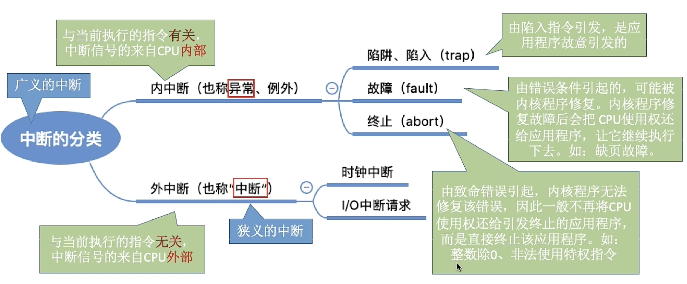
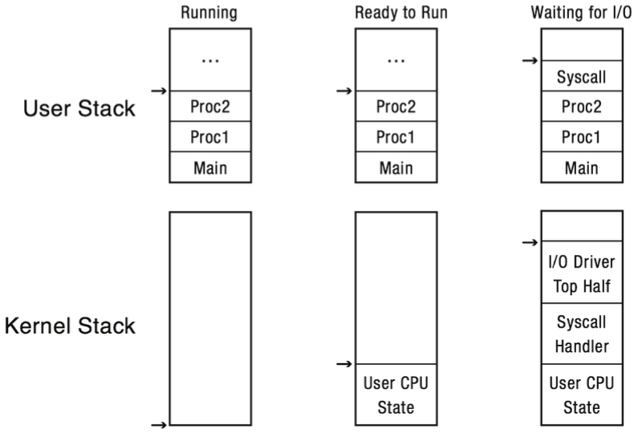
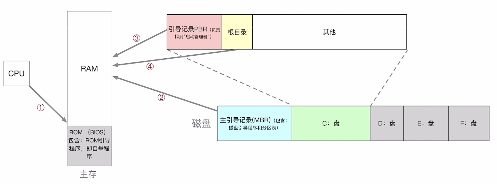
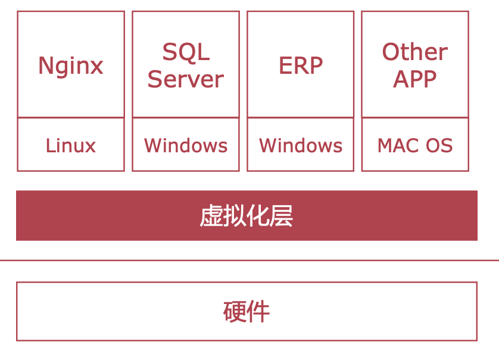
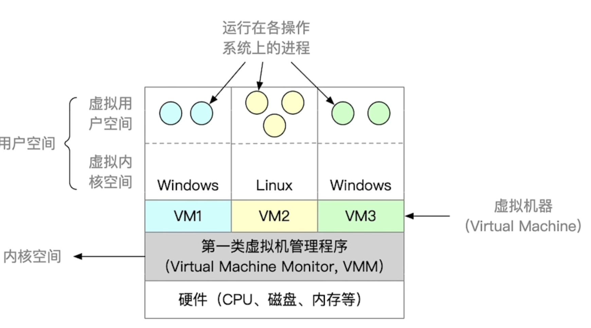
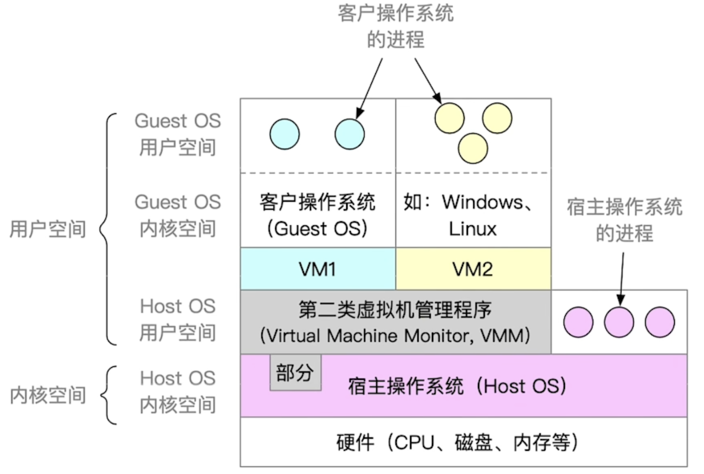

## 操作系统的定义

实际上操作系统没有普遍接受的定义

操作系统 （Operating System,OS）是指**控制**和**管理**整个计算机系统的**硬件和软件资源**，并合理地**组织调度**计算机的**工作**和**资源**的**分配**；以提供给**用户**和**其他软件**方便的**接口**和**环境**；它是计算机系统中**最基本的系统软件**。

## 操作系统的功能和目标

### 作为系统资源的管理者

#### 提供的功能

- 处理机管理

- 存储器管理

- 文件管理

- 设备管理

#### 目标

安全、高效

### 向上层提供方便易用的服务

#### GUI

(Graphical User Interface) 图形化用户接口

#### CLI

(Command Line Interface) 命令行接口

- 联机命令接口=交互式命令接口
- 脱机命令接口=批处理命令接口

#### 程序接口

可以在程序中进行**系统调用**来使用程序接口。普通用户不能直接使用程序接口，只能通过程序代码**间接**使用。

软件和程序员才能使用程序接口

!!! info 
    封装思想：操作系统把一些丑陋的硬件功能封装成简单易用的服务，使用户能更方便地使用计算机，用户无需关心底层硬件的原理，只需要对操作系统发出命令即可

### 作为最接近硬件的层次

目标：实现**对硬件机器的拓展**

没有任何软件支持的计算机称为**裸机**。在裸机上安装的操作系统，可以提供资源管理功能和方便用户的服务功能，将裸机改造成功能更强、使用更方便的机器

通常把覆盖了软件的机器成为**扩充机器**，又称之**虚拟机**

## 操作系统的特征

### 并发

并发：指两个或多个事件在同一时间间隔内发生。这些事件**宏观**上是同时发生的，但**微观**上是交替发生的

操作系统的并发性：计算机系统中“同时”运行着多个程序，这些程序宏观上看是同时运行着的，而微观上看是交替运行的。

操作系统就是伴随着“多道程序技术”而出现的。因此，操作系统和程序并发是一起诞生的。

注意（重要考点）：单核 CPU 同一时刻只能执行一个程序，各个程序只能并发地执行多核 CPU 同一时刻可以同时执行多个程序，多个程序可以并行地执行

### 共享

共享即资源共享，是指系统中的资源可供内存中多个并发执行的进程共同使用。

#### 互斥共享方式

系统中的某些资源，虽然可以提供给多个进程使用，但一个时间段内只允许一个进程访问该资源

#### 同时共享方式

系统中的某些资源，允许一个时间段内由多个进程“同时”对它们进行访问

所谓的“同时”往往是宏观上的，而在微观上，这些进程可能是交替地对该资源进行访问的（即分时共享）

!!! info 
    **并发** 和 **共享** 的关系是**相互依存，不可分割**的

如果失去并发性，则系统中只有一个程序正在运行，则共享性失去存在的意义;

如果失去共享性，则不同的程序不能同时访问硬盘资源，就无法实现同时发送文件，也就无法并发

### 虚拟

虚拟是指把一个物理上的实体变为若干个逻辑上的对应物。物理实体（前者）是实际存在的，而逻辑上对应物（后者）是用户感受到的。

#### 空分复用技术

如虚拟存储器技术

#### 时分复用技术

如虚拟处理器

!!! info 
    **并发** 和 **共享** 的关系是**相互依存，不可分割**的

如果失去了并发性，则一个时间段内系统中只需运行一道程序，那么就失去了实现虚拟性的意义了。因此，没有并发性，就谈不上虚拟性

### 异步

异步指，在多道程序环境下，允许多个程序并发执行，但由于资源有限，进程的执行不是一贯到底的，而是走走停停，以不可预知的速度向前推进，这就是进程的异步性。

## 操作系统的发展和分类

### 手工操作阶段

主要缺点：

用户独占全机、**人机速度矛盾**导致**资源利用率极低**

### 批处理阶段

引入**脱机**输入/输出技术（用外围机+磁带完成），并由监督程序负责控制作业的输入、输出，通过外围机把程序提前存到磁带里

目标是追求**吞吐量**，提高**资源利用率**。

#### 脱机

在主机以外的设备上进行输入/输出操作，需要时再送主机处理。

#### 批处理 bash

后端运行的作业，开始运行之后就不再需要任何交互。由于无法交互控制程序，所以还不算真正意义上的操作系统。

#### 单道批处理系统

也叫简单批处理系统。已经出现操作系统的一些特征：

- 用户态、内核态（monitor）
- 时钟

---

主要优点：

缓解了一定程度的人机速度矛盾，资源利用率有所提升。

---

主要缺点：

内存中仅能有一道程序运行，只有该程序运行结束之后才能调入下一道程序。

CPU 有大量的时间是在空闲等待 1/0 完成。**资源利用率依然很低**。

没有人机交互功能。

#### 多道程序设计

多道程序的运行环境比单道程序等更加复杂。

特点：

- **多道**——计算机内存中同时存放多道相互独立的程序
- **宏观上并行**
- **微观上串行**
- **非封闭、非顺序**——引入多道程序后，程序的执行就失去了封闭性和顺序性
- **相互制约**——程序执行因为共享资源以及相互协同的原因相互制约
- **断续性**——考虑到竞争的公平性，程序的执行是断续的

多道程序设计的实现需要解决如下问题：

- 处理机的分配
- 多道程序的内存分配
- I/O 设备的分配
- 如何组织和存放大量的程序和数据，以方便用户使用并保证**一致性**和**安全性**
  - 一定需要实现虚拟存储吗？——不一定，早期多道批处理操作系统将所有进程数据全部调入主存

这些问题的处理也会增加系统开销。

多道程序设计开始引入**中断**，目的是使**CPU 和 I/O 设备并行运行**，提高资源利用率。

#### 多道批处理系统（操作系统开始出现）

在批处理系统中采用**多道程序设计**就形成了多道批处理系统。

每次往内存中读入多道程序，操作系统正式诞生，用于支持多道程序并发运行。

---

主要优点：

多道程序**并发**执行，共享计算机资源。**资源利用率大幅提升**，CPU 和其他资源更能保持“忙碌”状态，系统吞吐量增大。

---

主要缺点：

用户响应时间长，仍然**没有人机交互**功能（用户提交自己的作业之后就只能等待计算机处理完成，中间不能控制自己的作业执行。eg：无法调试程序/无法在程序运行过程中输入一些参数）

### 分时操作系统

计算机以**时间片**为单位**轮流**为各个用户/作业服务，各个用户可通过终端与计算机进行交互。

目标是追求**时延（latency）**

---

主要特征：

- 同时性、也叫多路性
- 交互性
- 独立性
- 及时性

---

主要优点：

用户请求可以被即时响应，解决了人机交互问题。允许多个用户同时使用一台计算机，并且用户对计算机的操作相互独立，感受不到别人的存在。

---

主要缺点：

**不能优先处理一些紧急任务**。操作系统对各个用户/作业都是完全公平的，循环地为每个用户/作业服务一个时间片，不区分任务的紧急性。

### 实时操作系统

主要优点：

能够优先响应一些紧急任务，某些紧急任务不需时间片排队。

在实时操作系统的控制下，计算机系统接收到外部信号后及时进行处理，并且要在**严格的时限内处理完事件**。实时操作系统的主要特点是**及时性**和**可靠性**

#### 硬实时系统

必须在绝对严格的规定时间内完成处理

eg: 导弹控制系统、自动驾驶系统

#### 软实时系统

能接受偶尔违反时间规定

如：12306 火车订票系统

### 网络操作系统

是伴随着计算机网络的发展而诞生的，能把网络中各个计算机有机地结合起来，实现数据传送等功能，**实现网络中各种资源的共享（如文件共享）和各台计算机之间的通信**。（如：Windows NT 就是一种典型的网络操作系统，网站服务器就可以使用）

### 分布式操作系统

主要特点是分布性和并行性。系统中的各台计算机地位相同，任何工作都可以分布在这些计算机上，由它们并行、协同完成这个任务。

### 个人计算机操作系统

eg: windows、macos

## 操作系统服务

- 资源分配
- 记账
- 日志服务

## 内核

内核是操作系统最重要最核心的部分，也是最接近硬件的部分

甚至可以説，一个操作系統只要有内核就够了（eg:Docker->仅需 Linux 内核）

操作系统的功能未必都在内核中，如图形化用户界面 GUI

由很多内核程序组成了“操作系统内核”，或简称“内核、（Kernel）”

### 内核程序——运行在内核态

微软、苹果有一帮人负责实现操作系统，他们写的是“内核程序”。操作系统内核作为“管理者”，有时会让 CPU 执行一些“特权指令”，如：内存清零指令。这些指令影响重大，只允许“管理者”——即操作系统内核来使用

普通程序员写的程序就是“应用程序”，应用程序只能使用“非特权指令”，如：加法指令、减法指令等

!!! info 
    在 CPU 设计和生产的时候就划分了特权指令和非特权指令，因此 CPU 执行一条指令前就能判断出其类型

CPU 中有一个寄存器叫 程序状态字寄存器（PSW），其中有个二进制位，1 表示“内核态”，0 表示“用户态”

### 内核态——运行内核程序

CPU 有两种状态，“内核态”和“用户态”。处于内核态时，说明此时正在运行的是内核程序，此时可以执行特权指令处于用户态时，说明此时正在运行的是应用程序，此时只能执行非特权指令

!!! info 
    内核态 = 核心态 = 管态；用户态 = 目态

#### 内核态和用户态的切换 (变态)

变态的过程是有成本的，要消耗不少时间，频繁地变态会降低系统性能

##### 内核态 -> 用户态

执行一条特权指令一一修改 PSW 的标志位为“用户态”，这个动作意味着操作系统将主动让出 CPU 使用权

##### 用户态 -> 内核态

由“中断”引发，硬件自动完成变态过程，触发中断信号意味着操作系统将强行夺回 CPU 的使用权。除了非法使用特权指令之外，还有很多事件会触发中断信号。一个共性是，旦凡**需要操作系统介入的地方，都会触发中断信号**

## 系统调用

|     对象     |                                      与系统调用、库函数的关系                                      |
| :----------: | :------------------------------------------------------------------------------------------------: |
| 普通应用程序 |              可直接进行系统调用，也可使用库函数。 有的库函数涉及系统调用，有的不涉及               |
|   编程语言   | **向上提供库函数**。有时会将系统调用封装成库函数，以隐藏系统调用的一些细节，使程序员编程更加方便。 |
|   操作系统   |                         **向上提供系统调用**，使得上层程序能请求内核的服务                         |
|     裸机     |                                                                                                    |

不涉及系统调用的库函数.eg

- “取绝对值”的函数

涉及系统调用的库函数.eg

- “创建一个新文件”的函数

### 按功能分类

- 设备管理——完成**设备**的 **请求 / 释放 / 启动** 等功能
- 文件管理——完成**文件**的 **读 / 写 / 创建 / 删除** 等功能
- 进程控制——完成**进程**的 **创建 / 撒销 / 阻塞 / 唤醒** 等功能
- 进程通信——完成**进程**之间的 **消息传递 / 信号传递** 等功能
- 内存管理——完成**内存**的 **分配 / 回收** 等功能

应用程序通过系统调用请求操作系统的服务。而系统中的各种共享资源都由操作系统内核统一掌管，**因此凡是与共享资源有关的操作（如存储分配、1/0 操作、文件管理等），都必须通过系统调用的方式向操作系统内核提出服务请求**，由操作系统内核代为完成。这样**可以保证系统的稳定性和安全性**，防止用户进行非法操作。

### 系统调用过程

1. 传递系统调用参数
   - 寄存器传递参数
   - 内存中存储在块或表中的参数，以及作为参数在寄存器中传递的块地址
     - linux 和 solaris 采用这种方式
   - 由程序放置或推送到堆栈上并由操作系统弹出堆栈到参数

!!! info 
    块和堆栈的方式传递参数大小不受限制

2. 执行陷入指令（用户态）
3. 执行相应的内请求核程序处理系统调用（内核态）
4. 返回应用程序

!!! info 
    陷入指令 = trap 指令 = 访管指令

!!! warning
    **陷入指令**是在**用户态**执行的，执行陷入指令之后立即引发一个**内中断**，使 CPU 进入内核态

**发出系统调用请求**是在**用户态**，而**对系统调用的相应处理**在**内核态**下进行

## 计算计组成原理相关基础概念

### 中断和异常

参考[这个](https://fuuzen.github.io/cs/principles-of-computer-composition/exception-and-interruption/)

!!! warning
    没有中断就没有并发，也就没有操作系统

**中断**是让操作系统**内核**夺回 CPU 使用权的**唯一**途径，使 CPU 由用户态变为内核态

| **通用概念** | **产生 原因** | **AArch64**              | **x86-64**              |
| ------------ | ------------- | ------------------------ | ----------------------- |
| 中断         | 硬件 异步     | 异步异常 (重置/中断)     | 中断 (可屏蔽/不可屏蔽)  |
| 异常         | 软件 同步     | 同步异常 (终止/异常指令) | 异常 (Fault/Trap/Abort) |

（广义上的中断包括）Interrupt Handlers used in all 3 scenarios :

- HW -> CPU -> Kernel: Classic HW Interrupt (狭义上的中断)
- User -> Kernel: SW Interrupt
- CPU -> Kernel: Exception

#### 其他类型(非狭义)中断

- SW Interrupt
  - Interrupts caused by the execution of a software instruction: `INT<interrupt_number>`
  - Used by the system call interrupt()
  - Initiated by the running (user level) process
  - Cause current processing to be interrupted and transfers control to the corresponding interrupt handler in the kernel
- Exceptions
  - Initiated by processor hardware itself
  - Example: divide by zero
  - Cause a transfer of control to the kernel to handle the exception (like a software interrupt)

#### Linux 系统的中断

- 在中断处理中做尽量少的事
- 推迟非关键行为

结构：

- Top half ：马上做，找到 handler

  - 最小的、公共行为

    - 保存寄存器、屏蔽其他中断
    - 恢复寄存器，返回原来场景

    最重要:调用合适的由硬件驱动提供的中断处理 handler

    因为中断被屏蔽，所以不要做太多事情(时间、空间)

    使用将请求放入队列，或者设置标志位将其他处理推迟到 bottom half

    现代处理器中，多个 I/O 设备共享一个 IRQ 和中断向量 v 多个 ISR (interrupt service routines)可以结合在一个向量上
    调用每个设备对应该 IRQ 的 ISR

- Bottom half :推迟处理 (softirq, tasklets, 工作队列，内核线程)

  - 提供一些推迟完成任务的机制

  - softirqs
  - tasklets (建立在 softirqs 之上)
  - 工作队列
  - 内核线程

  这些工作可以被中断

!!! warning
    中断处理没有进程上下文！

中断(和异常相比)和具体的某条指令无关

也和中断时正在跑的进程、用户程序无关

中断处理 handler 不能睡眠!

中断处理的一些约束条件：

- 不能睡眠
  - 或者调用可能会睡眠的任务
- 不能调用 schedule()调度
- 不能释放信号或调用可能睡眠的操作
- 不能和用户地址空间交换数据

#### 中断向量表

每一个处理器有一个中断向量表，由操作系统内核建立，指向处理不同时间的中断处理程序入口

结构：

#### 需要中断的场景举例

Hardware devices may need asynchronous and immediate service. For example:

- Timer interrupt: Timers and time-dependent activities need to be updated with the passage of time at precise intervals
- Network interrupt: The network card interrupts the CPU when data arrives from the network
- I/O device interrupt: I/O devices (such as mouse and keyboard) issue hardware interrupts when they have input (e.g., a new character or mouse click)

#### 多核系统上的中断

Howareinterruptshandledonmulticoremachines?

- On x86 systems each CPU gets its own local Advanced Programmable Interrupt Controller (APIC). They are wired in a way that allows routing device interrupts to any selected local APIC.
- The OS can program the APICs to determine which interrupts get routed to which CPUs.
- The default (unless OS states otherwise) is to route all interrupts to processor 0

### 陷入指令

执行“陷入指令”，意味着应用程序主动地将 CPU 控制权还给操作系统内核。“系统调用”就是通过陷入指令完成的

### I/O (输入输出系统)

### BUS (总线)

## 并行系统

### 多核处理器

### 多处理器系统

又称并行系统、紧耦合系统

!!! warning
    区分 **多处理器系统** 和 **多核系统** ，实际计算机往往既是多核的也是多处理器的

多核和多处理器系统都用于加速计算过程。多核包含在单个 CPU 中的多个核或处理单元。多处理器由多个 CPU 组成。多核处理器不需要像多处理器那样复杂的配置。相反，多处理器更可靠并且能够运行许多程序。

#### 三个优点一个缺点？？？

老师出的作业题 😅 难道本来是想问多道批处理系统？而且那个也是单处理器系统啊）

- 增加吞吐量，并行处理？
- 规模经济，降低成本，比多核处理器便宜？
- 增加可靠性？
- ？？？

#### 非对称多处理器系统 (AMP)

非对称多处理是指一种计算机结构，其中有多个处理器，但它们并不都是一样的。这意味着，一个 CPU 可能正在处理操作系统代码，而另一个 CPU 正在执行输入和输出工作。它使用两个或更多的处理器由一个**主处理器**处理。所有的 CPU 都是相互连接的，但**不是自我调度的**。它用于根据任务的优先级和重要性将特定任务安排到一个 CPU。

!!! info 
    非对称处理器的应用场景：被用于嵌入式系统，在这些系统中，特定任务需要并发执行，但系统不需要像对称多处理系统那样的通用计算能力

#### 对称多处理器系统 (SMP)

SMP（Sysmmetric Multi-Processor System，对称多处理器），它由多个具有对称关系的处理器组成。所谓对称，即处理器之间**没有主从之分**。SMP 架构使得一台计算机不再由单个 CPU 组成，而是由两个或更多的处理器连接到一个**共享的主存储器**上，并能够共同执行任务。这些处理器通常是相同的，能够运行分配给它们的任何任务。这可以提高性能，因为任务可以在处理器之间分配，使其更快完成。

对称多处理将多个 CPU 应用于一个任务，以**并行**和更快的方式完成。因此，在对称多处理系统中，两个或更多的 CPU 被连接到一个共享的主存储器。同时，所有这些 CPU 都可以完全访问输入和输出设备。在对称多处理系统中，操作系统认为所有的处理器都是**平等**的。

!!! info 
    对称处理器 (SMP) 架构同时也是 UMA 架构

SMP 是一个紧密耦合的多处理器系统，它有一组独立运行的相同的 CPU。每个 CPU 处理不同的程序，执行不同的数据集。对称多处理系统共享公共资源，如输入设备、输出设备、内存等。

##### 问题

所有处理器相同，没有考虑不同任务要求处理器的差异性

### 多处理器环境的 3 种内存共享模型

#### UMA

UMA（Uniform Memory Access，一致性存储器访问)，实际上就是 **SMP** 。其中，****一致性**指的就是在任意时刻，多个处理器只能为内存的每个数据保存或共享一个唯一的数值**。它的结构特征就是**多处理器共享一个集中式存储器**，每个处理器访问存储器所需的时间一致，工作负载能够均匀的分配到所有可用处理器上，极大地提高了整个系统的数据处理能力。但是，如果多个处理器同时请求访问共享资源时，就会引发资源竞争，需要软硬件实现加锁机制来解决这个问题。

因此，这样的架构设计无法拥有良好的处理器数量扩展性，因为共享内存的资源竞态总是存在的，处理器利用率最好的情况只能停留在 2 到 4 颗。

#### NUMA

NUMA（Non-Uniform Memory Access，非一致性存储器访问）架构优化了 SMP 架构扩展性差以及存储器带宽窄的问题。采用了分布式存储器，将处理器和存储器划分为**不同的节点**（NUMA Node），每个节点都包含了若干的处理器与内存资源。多节点的设计有效提高了存储器的带宽和处理器的扩展性。

另一方面，NUMA 节点的处理器可以访问到整体存储器。按照节点内外，内存被分为：

- 节点内部的本地内存
- 节点外部的远程内存

当处理器访问本地内存时，走的是内部总线，当处理器访问远程内存时，走的是主板上的 QPI 互联模块。访问前者的速度要远快于后者，NUMA（非一致性存储器访问）因此而得名。

##### 问题

各个处理器访问自己的内存速度**很快**，但如果出现需要跨处理器访存，即访问另一处理器的内存时会非常**缓慢**

#### COMA

Cache-only Memory Access (COMA) 是 ccNUMA(Cache Coherent NUMA, 缓存一致性 NUMA) 的一种演变。COMA 可以看成是专用的 NUMA，将 NUMA 中的分布式内存用高速缓存来取代。全局地址空间由高速缓存组成。访问远端的高速缓存借助分布式高速缓存目录进行。

### 集群系统

类似多处理系统，集群系统时多个机器，每台机器有自己的操作系统，并行工作。

- Usually sharing storage via a storage-area network (SAN)
- Provides a high-availability service which survives failures

  - Asymmetric clustering has one machine in hot-standby mode
  - Symmetric clustering has multiple nodes running applications, monitoring each other

- Some clusters are for high-performance computing (HPC)

  - Applications must be written to use parallelization

- Some have distributed lock manager (DLM) to avoid conflicting operations

## 操作系统的结构

不同结构操作系统举例：

- 大内核/宏内核/单内核： Windows、Android、iOS、UNIX、Linux、MacOS
- 微内核：Windows NT、Mach、Fuchsia、鸿蒙
- 模块化：Solaris

| 操作系统体系结构         | 区别                                                 | 优点                           | 缺点                                       |
| ------------------------ | ---------------------------------------------------- | ------------------------------ | ------------------------------------------ |
| 大内核 / 宏内核 / 单内核 | 将操作系统的主要功能模块都作为系统内核，运行在核心态 | 高性能                         | 内核代码庞大，结构混乱，难以维护           |
| 微内核                   | 只把最基本的功能保留在内核                           | 内核功能少，结构清晰，方便维护 | 需要频繁地在核心态和用户态之间切换，性能低 |

|                 | 特性、思想                                                                                                     | 优点                                                                                            | 缺点                                                                                                                |
| --------------- | -------------------------------------------------------------------------------------------------------------- | ----------------------------------------------------------------------------------------------- | ------------------------------------------------------------------------------------------------------------------- |
| 分层结构        | 内核分多层，每层可单向调用更低一层提供的接                                                                     | 1. 便于调试和验证，自底向上逐层调试验证                                                         | 1. 仅可调用相邻低层，难以合理定义各层的边界                                                                         |
|                 |                                                                                                                | 2. 效率低，不可跨层调用，系统调用执行时间长                                                     | 2. 效率低，不可跨层调用，系统调用执行时间长                                                                         |
| 模块化          | 将内核划分为多个模块，各模块之间相互协作。内核 = 主模块 ＋ 可加载内核模块                                      | 1. 模块间逻辑清晰易于维护，确定模块间接口后即可多模块同时开发                                   | 1. 模块间的接口定义未必合理、实用                                                                                   |
|                 | 主模块：只负责核心功能，如进程调度、内存管                                                                     | 2. 支持动态加载新的内核模块（如：安装设备驱动程序、安装新的文件系统模块到内核），增强 OS 适应性 | 2. 模块间相互依赖，更难调试和验证                                                                                   |
|                 | 可加载内核模块：可以动态加载新模块到内核，而无需重新编译整个内核                                               | 3.任何模块都可以直接调用其他模块，无需采用消息传递进行通信，效率高                              |                                                                                                                     |
| 宏内核(大内核)  | 所有的系统功能都放在内核里（大内核结构的 OS 通常也采用了"模块化”的设计思想）                                   | 性能高，内核内部各种功能都可以直接相互调用                                                      | 1. 内核庞大功能复杂，难以维护                                                                                       |
|                 |                                                                                                                |                                                                                                 | 2. 大内核中某个功能模块出错，就可能导致整个 系统崩溃                                                                |
| 微内核          | 只把中断、原语、进程通信等最核心的功能放入内核。进程管理、文件管理、设备管理等功能以用户进程的形式运行在用户态 | 1. 内核小功能少、易于维护，内核可靠性高                                                         | 1. 性能低，需要频繁的切换 用户态/核心态。用户态下的各功能模块不可以直接相互调用，只能通过内核的"消息传递"来间接通信 |
|                 |                                                                                                                | 2. 内核外的某个功能模块出错不会导致整个系统 崩溃                                                | 2. 用户态下的各功能模块不可以直接相互调用，只能通过内核的"消息传递"来间接通信                                       |
| 外核(exokernel) | 内核负责进程调度、进程通信等功能，外核负责为用户进程分配未经抽象的硬件资源，且由外核负责保证资源使用安全       | 1. 外核可直接给用户进程分配"不虚拟、不抽象"的硬件资源，使用户进程可以更灵活的使用硬件           | 1. 降低了系统的一致性                                                                                               |
|                 |                                                                                                                | 2. 减少了虚拟硬件资源的“映射层”，提升效率                                                       | 2. 使系统变得更复杂                                                                                                 |

### 非内核功能（如 GUI）

操作系统的非内核功能运行在**用户态**

### (大) 内核

内核是操作系统最基本、最核心的部分。

实现操作系统内核功能的那些程序就是内核程序。

操作系统内核需要运行在**内核态**

#### 对系统资源进行管理的功能

**大内核**结构中运行在**内核态**，所以大内核结构操作系统变态不那么频繁

**微内核**结构中运行在**用户态**，所以微内核结构操作系统变态更加频繁

##### 进程管理

##### 存储器管理

##### 设备管理等功能

#### (微内核)

##### 时钟管理

实现计时功能

##### 中断处理

负责实现中断机制

##### 原语（设备驱动、CPU 切换等）

是一种特殊的程序，具有如下特点：

- 处于操作系统最底层，是最接近硬件的部分
- 这种程序的运行具有原子性——其运行只能一气呵成，不可中断
- 运行时间较短、调用频繁

## 操作系统的引导

操作系统引导过程

1. CPU 从一个**特定主存地址**开始，取指令，执行 ROM 中的引导程序（先进行硬件自检，再开机）
2. 将磁盘的第一块——主引导记录 读入内存，执行磁盘引导程序，扫描分区表
3. 从活动分区（又称主分区，即安装了操作系统的分区）读入分区引导记录，执行其中的程序
4. 从根目录下找到完整的操作系统初始化程序（即启动管理器）并执行，完成“开机”的一系列动作
   1. 加载内核
      - BIOS
      - UEFI，逐渐取代 BIOS，加载更简洁
      - GRUB，更加复杂，可以选择加载不同的内核
   2. 启动系统守护进程（在内核之外提供的服务）
   3. 启动内核中断驱动（硬件和软件）
      1. 启动设备的硬件中断
      2. 启动软件中断（异常或陷阱）
         - 软件错误（例如，除零）
         - 操作系统服务请求-系统调用
         - 故障处理：其他进程问题包括无限循环、进程相互修改,甚至修改操作系统；

不同体系结构下，不同 OS 启动也有不同：

x86 需要兼顾“历史包袱”，需要兼容 32 位

ARM

!!! info 
    完整的操作系统初始化程序（即启动管理器）可在根目录下找到

Eg : windows 操作系统完整的开机初始化程序在 `根目录/Windows/Boot` 下

## 双/多 模式操作

### 双模式操作

即经典的内核态、用户态两个模式

### 多重模式操作

两模式扩展到多模式，典型场景是**虚拟化**；

支持虚拟化技术的 CPU 有一种单独模式，用于表示虚拟机管理器 VMM；

这种模式的特权多于用户，但少于内核；

## 虚拟机

虚拟机：使用虚拟化技术，将一台物理机器虚拟化多台虚拟机器（Virtual Machine, VM），每个虚拟机器都可以独立运行一个操作系统

同义术语：

- 虚拟机管理程序
- 虚拟机监控程序
- Virtual Machine Monitor
- Hypervisor

当源 CPU 类型不同于目标类型（例如 PowerPC 到 Intel x86）时使用**仿真**

当计算机语言未编译本机代码时进行**解释**

### 第一类 VMM

直接运行在硬件上

KVM（Kernel-based Virtual Machine）是一种基于硬件虚拟化扩展的完全虚拟化技术。使用 KVM，虚拟机可以在真实硬件上运行，并获得对硬件的直接访问。每个 KVM 虚拟机都被视为一个独立的虚拟计算机，具有自己的虚拟硬件，包括虚拟的 CPU、内存、磁盘和网络接口等。

WSL（Windows Subsystem for Linux）是一项由 Microsoft 开发的技术，旨在在 Windows 操作系统上运行本地的 Linux 环境。WSL 提供了一个兼容层，允许在 Windows 上运行原生的 Linux 二进制文件（如命令行工具、实用程序和应用程序）。在 WSL 中，并没有采用传统的虚拟化技术来创建完全虚拟化的虚拟机。相反，WSL 利用 Windows 操作系统的内核功能，通过在用户模式和内核模式之间进行转换，提供了对 Linux 系统调用的兼容支持。

### 第二类 VMM

运行在宿主操作系统上

LXC（Linux Containers）是一种操作系统级虚拟化技术，也被称为容器化。使用 LXC，虚拟机实际上是在宿主机的操作系统内运行的，共享宿主机的内核。这些虚拟机被称为容器，它们与宿主机共享相同的内核和一些系统资源。相比于 KVM，LXC 提供了更轻量级的虚拟化解决方案，更适合运行基于 Linux 的应用程序。

VMware：完全虚拟化

VirtualBox：“半虚拟化”

!!! info 
    PVE 中的虚拟机就是 KVM 技术实现，而容器 CT 就是 LXC 技术实现

### 两类 VMM 的对比

|                    | 第一类 VMM                                                                                                                                                      | 第二类 VMM                                                                                                            |
| ------------------ | --------------------------------------------------------------------------------------------------------------------------------------------------------------- | --------------------------------------------------------------------------------------------------------------------- |
| 对物理资源的控制权 | 直接运行在硬件之上，能直接控制和分配物理资 源                                                                                                                   | 运行在 Host OS 之上，依赖于 Host OS 为其分配物理资源                                                                  |
| 资源分配方式       | 在安装 Guest OS 时，VMM 要在原本的硬盘上自行分配存储空间，类似于“外核”的分配方式，分配未经抽象的物理硬件                                                        | GuestOS 拥有自己的虚拟磁盘，该盘实际上是 Host OS 文件系统中的一个大文件。GuestOS 分配到的内存是虚拟内存               |
| 性能               | 性能更好                                                                                                                                                        | 性能更差，需要 HostOS 作为“中介"                                                                                      |
| 可支持的虚拟机数量 | 更多，不需要和 Host OS 竞争资源，相同的硬件资源可以支持更多的虚拟机                                                                                             | 更少，Host OS 本身需要使用物理资源，Host OS 上运行的其他进程也需要物理资源                                            |
| 虚拟机的可迁移性   | 更差                                                                                                                                                            | 更好，只需导出虚拟机镜像文件即可迁移到另一台 HostOS 上，商业化应用更广泛                                              |
| 运行模式           | 第一类 VMM 运行在最高特权级（Ring O），可以执行最高特权的指令；上层操作系统内核运行在次高特权级（Ring 1）；上层操作系统非内核程序程序运行在次高特权级（Ring 1） | 第二类 VMM 部分运行在用户态、部分运行在内核态。GuestOS 发出的系统调用会被 VMM 截获，并转化为 VMM 对 HostOS 的系统调用 |
