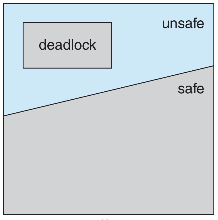

## Intro

死锁的必要条件

- **互斥**：一次只有一个进程使用一个资源,其他进程不能访问分配给其他进程的资源
- **占有等待**(持有且等待)：当一个进程等待其他进程时，继续占有已分配的资源
- **非抢占**：不能强行抢占进程已占有的资源
- **循环等待**：存在一个闭合的进程链，每个进程至少占有此链中下一个进程所需的一个资源前三个只会导致死锁的可能性，而最后一个**循环等待**是导致死锁的“最终极条件”

处理死锁的方法：

- 确保系统永远不会进入死锁状态
  - 锁预防，在 OS 设计阶段就设计成不会出现死锁
  - 死锁避免，在 OS 运行的时候尽量避免死锁产生条件
- 允许系统进入死锁状态，然后检测和恢复
- 忽略该问题，并假装系统中从未发生死锁
  - 绝大多数操作系统所采用的的方法
  - 合理性：死锁的发生实际上是一个小概率性事件

## 死锁预防

使死锁的四个必要条件之一无效，破坏任意一个死锁必要条件：

- 互斥：通常不能否定互斥条件来预防死锁，必须保留不可共享的资源
- 持有且等待：必须保证每当进程请求资源时，它不会占有任何其他资源
  - 一种实现：在进程开始执行之前请求并分配其所有资源
  - 另一种实现：仅当进程在未分配任何资源时才允许进程请求资源
- 非抢占
  - 如果持有某些资源的进程请求另一个无法立即分配给它的资源，那么当前持有的所有资源都将被释放(隐式释放)
  - 被抢占资源被添加到进程正在等待的资源列表中
  - 只有当进程能够恢复其原有的资源以及它所请求的新资源 时，才会重新启动进程
- 循环等待 (最常见)
  - 强制所有类型的资源进行完全排序，也就是为每个资源 (即互斥锁) 分配一个唯一的编号，并要求每个进程以同一特定顺序 (例如递增) 请求资源
  - 可以反证这样的做法不存在循环等待
  - 如果能够**动态获得锁**，那么制定一个加锁顺序并不保证死锁预防，因为并不能保证请求资源的顺序是同一特定顺序

!!! abstract
    动态获得锁：获得锁的函数与输入的参数有关

问题

- 一个进程需要多少资源无法精确预测
- 副作用是设备使用率低，系统吞吐率低

## 死锁避免

死锁避免使用算法动态检查资源分配状态，以确保不存在循环等待条件

优势：

- 无须死锁预防中的抢占和回滚进程
- 与死锁预防相比限制较少

限制：

- 必须事先声明每一个进程请求的最大资源；
- 所讨论的进程必须是无关的，即他们的执行顺序必须没有任何同步要求的限制；
- 分配的资源数量必须是固定的；
- 在占有资源时，进程不能退出；

!!! abstract
    这些限制使得银行家算法这样的死锁避免算法实际上是不可行的，只能用于理论检测

### 安全状态

只有至少存在一个安全序列，系统才处于安全状态

系统中存在所有进程的序列 $<P_1,P_2,\cdots,P_n>$ 在当前分配状态下为安全序列是指:

对于每个 $P_i$ ，$P_i$ 请求的资源可以通过 **当前可用资源+所有 $P_j(j<i)$ 持有的资源** 来满足。

即:

- 如果 $P_i$ 资源需求不能立即可用，则 $P_i$ 可以等待所有 $P_j$ 完成，释放资源
- 当 $P_j$ 完成时，$P_i$ 可以获得所需的资源、执行、返回分配的资源并终止
- 当 $P_i$ 终止时，$P_{i+1}$ 可以获得它所需的资源，依此类推

!!! abstract
    :warning:安全状态一定不是死锁状态，非安全状态只是死锁的必要条件，可能导致死锁，但不是死锁的充分条件。

死锁避免两种方法

- 在进程某次请求资源的时候，如果为其分配资源后系统进入非安全状态，则拒绝分配
- 进程启动拒绝：在进程初始化启动的时候，如果对某种资源，它的最大需求 + 当前所以进程的需求 > 系统总资源量，则拒绝分配

### 资源分配图算法

:warning:每种资源都**只有一个**实例（都是唯一）的时候才能依据资源分配图判断死锁是否产生：

- 资源分配图中没有环，那么系统就没有进程死锁
- 如果有环，可能存在死锁

:warning:必须在系统中预先声明资源；也就是只有当进程 $P_i$ 的所有边都为需求边时，才能允许将需求边增加到图中

### 银行家算法

:warning:每个进程都必须先验地给出最大需求资源的数量

#### 数据结构

设 `n` =进程数，`m` =资源类型数。

`Available` : 长度为 `m` 的向量。如果 `Available[j]=k` ，则有 k 个资源类型 Rj 的实例可用;

`Max` : nxm 矩阵，定义每个进程的最大需求。如果 `Max[i, j]=k` ，那么进程 Pi 最多可以请求 k 个资源类型 Rj 的实例

`Allocation` : n×m 矩阵,定义每个进程现在分配的每种资 源类型的实例数量。如果`Allocation[i,j]=k` ，则 Pi 当前被分配给了 Rj 的 k 个实例

`Need` : nxm 矩阵，表示每个进程还需要的剩余资源。如果 `Need[i,j]=k` ，那么 Pi 可能还需要 k 个 Rj 实例来完成它的任务 `Need[i,j]=Max[i,j]–Allocation[i,j]`

#### 算法流程

判断安全状态：

`judge_safe()`

1. Let Work and Finish be vectors of length m and n, respectively.

   Initialize:

   Work = Available

   Finish [i] = false for i = 0, 1, ..., n- 1

2. Find an i such that both:

   - (a) Finish [i] = false

   - (b) Needi <= Work

   If no such i exists, go to step 4

3. Work = Work + Allocationi

   Finish[i] = true

   go to step 2

4. If Finish [i] ** true for all i, then the system is in a safe state

判断是否允许某次资源请求：

Requesti = request vector for process Pi. If Requesti [j] = k then process Pi wants k instances of resource type Rj

1. If Requesti <= Needi go to step 2.

   Otherwise, raise error condition, since process has exceeded its maximum claim

2. If Requesti <= Available, go to step 3.

   Otherwise Pi must wait, since resources are not available

3. Pretend to allocate requested resources to Pi by modifying the state as follows:

   - Available = Available – Requesti;

   - Allocationi = Allocationi + Requesti;

   - Needi = Needi – Requesti;

   If `judge_safe()` => the resources are allocated to Pi

   else => Pi must wait, and the old resource-allocation state is restored

## 死锁检测与恢复

### 死锁检测

允许系统进入死锁状态，死锁检测可以频繁地在每个资源请求发生时进行，也可以检测得少一些，具体取决于发生死锁的可能性。检测出死锁之后进行死锁恢复。

优点：

- 尽早地检测死锁情况
- 算法相对简单

缺点

- 频繁的检测会耗费相当多的处理器时间

何时以及多久调用一次取决于:

- 死锁可能发生的**频率**有多高?
- 需要**回滚**多少个进程?

如果任意调用检测算法，资源图中可能会有许多循环，因此我们无法判断是哪些死锁进程“导致”了死锁

死锁检测产生大量的代价，可以周期性检测死锁，或者 CPU 的利用率低于某个阈值时再执行死锁检测

### 等待图

在资源分配图的基础上，只画出进程，不再画出资源。

和资源分配图一样，只适用于所有类型的资源都是唯一的，只有一个实例的情况。

### 死锁恢复

- **取消所有**的死锁进程，这是**实际**操作系统最常用的方法
- 把每个死锁进程**回滚**到前面定义的某些检查点，并重新启动所有进程，要求在系统中构建回滚和重启机制
- **连续取消**死锁进程**直到**不再存在死锁，所取消的进程的顺序应基于某种最小代价原则
- **连续抢占资源直到**不再存在死锁，需要使用一种基于代价的选择方法，且需要在抢占后重新调用检测算法

后两种策略的选择 (受害者) 原则：

- 目前为止消耗的处理器时间最少
- 目前为止产生的输出最少
- 预计剩下的时间最长
- 目前为止分配的资源总量最少
- 优先级最低

实际上 OS 的死锁恢复

- 重启
- 随机 `sleep`
