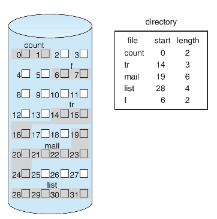
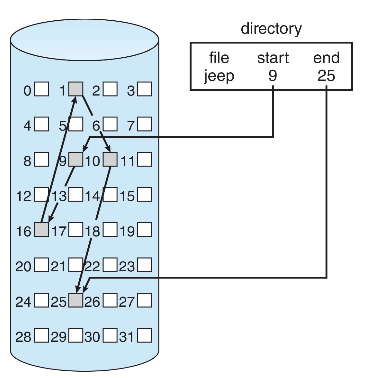
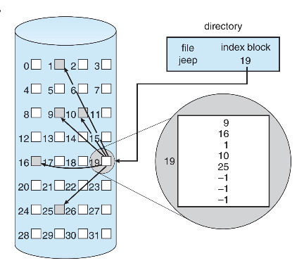
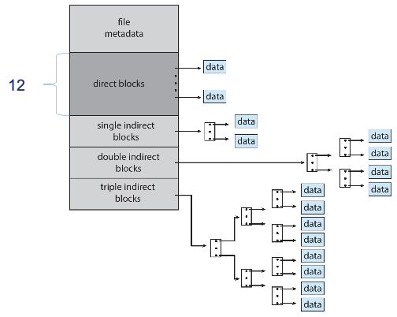

!!! abstract
    磁盘的 block 和文件系统的 block 不是一回事：

- 磁盘的 block ：往往是固定的 512 B；
- 文件系统的 block 是基本单位，可以自定义，不一定和磁盘的 block 大小相等。
  - 文件系统分配空间的基本单位往往是页面大小 4 KB ，

文件系统结构：（自上而下分层）

- application programs，应用程序
- logical file system，逻辑文件系统
- file-organization module，文件组织模块
- basic file system，基本文件系统
- I/O control，I/O 控制
- devices，设备

!!! warning
    修改文件要**写回**磁盘！计算访问磁盘次数的时候要注意写操作比读操作多 `1`！

## 数据结构

> 面向对象

### FCB

别名：**文件目录项**、**文件控制块**

包含：

- 指向关联的 inode 的指针
- 指向父目录、子目录的指针

### 文件目录

FCB 的有序集合

### inode

别名：**索引节点**、**文件描述信息**、index node

`ext2`、`ext3` 采用 inode 表

将 FCB 中的一部分文件描述信息分离出来，这些是检索目录时不需要的不必放在内存的，所以只将指向这部分的一个指针放在内存的目录项里。

采用 inode 可以减少查找文件时的 I/O 信息量，相当于**简化了内存中的文件目录项**(FCB)，将其中一部分留在磁盘，只保留指向他们的指针。例如 Linux 的文件目录项就只包含文件名和指向 indoe 的指针。

:star:硬连接和软链接与 inode

- **硬链接**文件指向**同一个** inode
- **软链接**文件指向**不同的** inode，相当于不同的文件，只不过存的是路径

!!! warning
    在文件的物理结构中，则 inode 中就存储了索引文件的**主索引表**。

直接以**数组**方式存储的 indoe 表，相当于单级索引；也可以有**多级索引**。

- 磁盘索引节点，每个文件唯一都有一个
  - 文件主标识符
  - 文件类型
  - 文件存取权限
  - 文件物理地址
  - 文件长度
  - 文件链接计数
    - :star: `count`，实现**硬链接**文件共享，表示链接到本索引节点的用户目录项的数量。只有 `count=0` 的时候才能删除文件。
  - 文件存取时间
- 内存索引节点，文件被打开时，磁盘索引节点复制放在内存的副本
  - 索引节点号，用于标识内存索引节点
  - 状态，是否被上锁
  - 访问计数，为 0 时文件关闭
  - 逻辑设备号
  - 链接指针，指向空闲列表或散列队列

### 打开文件表

本质上是实现只需要一次访问磁盘定位文件在磁盘的位置，将其存储到内存，后续在内存可以找到文件在磁盘的位置。

两级表：

- 整个系统一个表，包含与进程无关的信息，每一个文件条目包含：
  - **文件描述符(File Descriptor, FD)**
    - 这是 Linux 中的名字，Windows 中也叫**文件句柄**
  - 文件打开次数
    - 变为 0 之后就可以“关闭文件”，从表中删除该项
  - 文件磁盘位置
  - 访问日期
  - 文件大小
- 每个进程有一个表，包含与进程有关的信息，每一个文件条目包含：
  - 读写指针
  - 访问权限
  - 指向系统打开文件表的对应文件条目指针

:warning:系统只会在第一次打开一个文件的时候使用其文件名在磁盘上定位，然后在内存中创建文件表中的条目，此后就不再需要文件名。

:warning:`open` 系统调用由用户调用，一个文件可能对某一用户是第一次打开，但是对系统而言不是第一次，只会在用户进程的打开文件表增加条目。

## 文件保护

- 口令保护
- 加密保护
- 访问控制

### 文件访问控制表

> 可能也有叫做**存取控制矩阵**之类的 (?)

为每个文件和目录设置一个文件访问控制表。用来管理不同用户、用户组对该文件或目录的访问权限

## 文件结构

### 文件逻辑结构

**文件访问、存取**，或者文件中查找数据的方式，是由文件的逻辑结构决定的。

文件的逻辑结构分为：

- **无结构文件**，也叫做**流式文件**，对该类型文件中记录的访问只能通过穷举搜索。
- **有结构文件**，也叫做**记录式文件**，这里讨论的都是这种，这样的文件是由一个以上的记录构成的。
  - 定长记录
  - 变长记录

#### 顺序

每次读写大批量数据时，顺序文件的效率是最高的。

#### 直接

直接文件也叫做散列文件、哈希文件。

- 优点
  - 存取速度快

#### 索引

建立一张**索引表**，索引表本身是**定长记录的顺序文件**，其中的每一个**索引表项**包含：指向记录的指针、记录的长度

- 优点
  - 提升了查找速度
- 缺点
  - 索引表增加了存储空间

#### 索引顺序

在索引文件的基础上，索引表项指向的单个记录变为一组记录组成的顺序表，就得到了一级索引的索引顺序文件。

优缺点和索引文件仍然一样...

#### 记录成组分解

**记录成组分解技术**是指若干逻辑记录存入一个块，一个逻辑记录**不能跨越** 2 个块。

搭配**隐式链接**，每个个块存储固定长度的若干逻辑记录，剩余的字节用于存储指向下一个块的指针。

### 文件物理结构

#### 连续分配

配合使用**空闲表**法管理空闲磁盘空间。

进程访问磁盘时所需的寻道数和寻道时间最小

:warning:磁带只能使用连续分配，只能顺序存取！

#### 扩展连续分配

例如：`ext4`、`ext3`

FCB 中比连续分配多增加一项为指向下一个扩展块的指针

#### 链接分配(隐式链接)

每一个块包含该文件指向下一个块的指针，这些指针对用户来说是透明的，空指针表示文件末尾。

- 优点：

  - 不会产生外部碎片，提高了磁盘利用率。

- 缺点：

  - **只支持顺序访问**，随机访问效率低

  - 稳定性可靠性低，链指针“断掉”就会导文件数据丢失

  - 指向下一个盘块的指针消耗了磁盘空间

#### 显式链接(FAT)

用于链接文件各个物理块的指针显式地存放在**内存**地一张唯一的链接表中，称为**文件分配表(Fils Alloction Table, FAT)**，每个表项存放指向下一个块的指针。

:warning:FAT 本身就可以实现空闲磁盘块管理，若磁盘块空闲，则其表项可标记为 `-1` 等

FAT 在系统启动时被读入内存，检索记录都在内存中进行。

- 优点：

  - 支持**顺序访问**和**随机访问**（磁盘，不是 FAT）

  - 检索在内存中完成，速度快效率高，减少了磁盘访问次数

- 缺点：

  - FAT 表需要占用一定的内存空间

以“簇”(cluster)为单位分配，cluster `0` 和 `1` 保留，从 `2` 开始计数

LFN 目录项

#### 索引分配

建立一张**索引表**

- 优点：
  - 支持**直接访问**，索引表的第 `i` 个条目指向的就是第 `i` 个块
  - 不会产生外部碎片，提高了磁盘利用率。
- 缺点：
  - 索引块增加了额外磁盘存储开销

可以分为：

- 单级索引
  - 局限：
    - 只适用于小文件
- 多级索引
  - 通过**主索引**查找**二级索引**......
  - 优点：
    - 极大加快了对大型文件的查找速度
  - 问题：
    - 对小文件来说没必要使用深层级的索引，会造成磁盘存储浪费和访问开销增大
- 混合索引
  - 

UNIX 采用最深为三级的混合索引

## 目录

### 目录逻辑结构

#### 单级目录

实现了**按名存取**，每个文件名对应唯一一个文件。

缺点：

- 文件不允许重名
- 不方便文件共享

#### 两级目录

- 主文件目录 Maste File Directory (MFD)
  - 用户文件目录 User File Directory (UFD)
  - 用户文件目录 User File Directory (UFD)
  - 用户文件目录 User File Directory (UFD)
  - ......

解决了多用户之间文件重名的问题。

#### 树形目录

理论上可以实现无限深度的目录层次。

出现了**相对路径**和**绝对路径**的概念。

#### 无环图目录

比树形目录多了共享子目录，实现了文件、目录共享。

一个文件可以有多个路径，称为**别名**。例如：

- Linux 中的软链接、硬链接
- Windows 的快捷方式

#### 通用图目录

允许了环的出现，实现了**自引用**的特殊需求。

### 目录物理实现

目录第物理实现决定了**目录检索**的方式，包括 2 中检索方式：

- 顺序检索
- 散列法 / 哈希表

#### 线性列表

查找比较费时。

#### 哈希表

- 优点：
  - 查找非常迅速
  - 插入、删除比较简单
- 缺点：
  - 会有冲突，链式处理溢出。

## 空闲空间管理

### 空闲表

属于**连续分配方式**，建立一张空闲表，和连续分配方式的目录类似，每一个表项记录一个空闲盘区，包括第一个空闲盘块号和空闲盘块数。

空闲盘区分配与回收与内存动态分配、回收类似。

### 空闲链表

> free-space list

- 空闲盘块链
  - 以盘块为单位拉成一条链
  - 优点：回收分配过程简单
  - 缺点：简单但是需要重复多次效率低，且盘块链会很长
- 空闲盘区链
  - 以盘区为单位拉成一条链
  - 优点：分配回收效率高
  - 缺点：回收分配过程复杂

### 位(示)图

> bit vector or bit map，似乎也叫**空闲向量表**

- 优点：
  - 容易找到一个或一组连续的空闲磁盘块
  - 位示图小，可以放在内存中，节省访问磁盘的开销
- 缺点：
  - 位示图大小随磁盘容量增大而增大，因而常用于小型计算机

#### Space Maps

位示图的改进，将磁盘设备分为 metaslab 的单位，每一个 metslab 内对空闲盘块计数

### 成组链接

> grouping

:star: UNIX 采用该方法

第一组空闲盘块总数和空闲盘块号称为**空闲盘块号栈**

### 超级块

> super block

包含：

- 空闲向量表 / 位(示)图 / 空闲盘块号栈
- 卷中目录区、文件区的划分信息

一般放在**卷头**位置，超级块要预先读入内存才能对该卷文件操作，并且经常保持内存与磁盘超级块的一致性。

缓存

- page cache，为用户程序服务（用户程序以页的方式访问）
- disk block cache，为操作系统管理文件服务

> A unified buffer cache uses the same page cache to cache both memory-mapped pages and ordinary file system I/O to avoid double caching
>
> But which caches get priority, and what replacement algorithms to use?

Linux VFS 对象：

- 超级块
- 索引节点
- 目录项
- 文件
