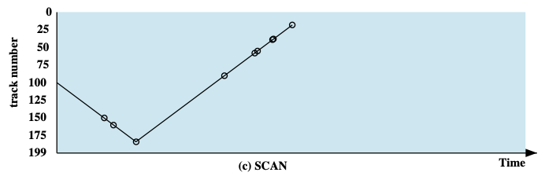
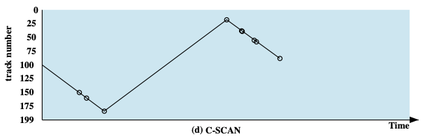

I/O 的访问、管理分为两种类型：（或者说按照编址类型划分）

- I/O 指令（独立编址）
  - 通过 I/O 端口号访问设备管理器
  - 涉及模态转换、状态更迭时才采用
- 内存映射 I/O （统一编址）
  - 设备的寄存器或存储被映射到内存物理地址空间中；
  - 通过内存 load/store 指令完成 I/O 操作；
  - MMU 设置映射，硬件跳线或程序在启动时设置地址；
  - 实际上绝大多数采用的方式

I/O 控制：

- 轮询，或者程序直接控制
  - 通过忙等待（轮询）检查 I/O 控制器状态
  - 完全交给 CPU
- 中断
  - 等待中断来得到 I/O 控制器状态信息
  - 中断到来前 CPU 可以干其他事（CPU、I/O 并行）
- DMA
  - 磁盘和 I/O 设备之间直接传输数据
  - CPU 极少介入，仅在数据传输完成时介入，其他时候 CPU、I/O 并行工作
  - CPU 上专门的部件作为 DMA 控制器
- \*通道控制
  - 一种特殊的、独立于 CPU 的处理机，相当于独立性更强的 DMA
  - 指令类型单一，与 CPU 共享内存
  - 实现 CPU、通道、I/O 三者并行工作

## 磁盘调度算法

给定磁盘访问 LBA 序列： 55, 58, 39, 18, 90, 160, 150, 38, 184

### FIFO

> 无论在哪个场景都是**最公平**的调度算法

### 优先级(PRI)

调度的控制超出了磁盘管理软件的控制范围

目标不是优化磁盘利用率，而是实现其他目标

短批作业和交互式作业的优先级更
提供良好的交互式响应时间

较长的工作可能需要等待过长的时间
对数据库系统是一种糟糕策略

### 最短服务时间优先(SSTF)

选择使磁头臂从当前位置开始移动最少的磁盘 I/O 请求

总是选择导致最小寻道时间的请求

### 扫描算法(SCAN)

也叫电梯算法、NOOP 算法、SCAN 算法。

**非公平的**，不同请求获得的优先级是不一样的：越靠近外侧的扇区请求响应的优先级更高

### 循环扫描算法(C-SCAN)

C-SCAN 也就是 Circular Scan 算法。

### 其他 SCAN 变种

以下介绍的 2 中变种 SCAN 调度算法的目的在于避免**磁臂黏着**现象，具体可参考：https://blog.csdn.net/m0_52733659/article/details/133840705

#### N 步 SCAN

设置多个队列，每个队列容量为 N ，轮流对每个队列采用 SCAN 扫描算法，该队列不接受请求，所有请求按照 FIFO 放入下一个队列。每一次扫描，都只处理 N 个请求。

#### FSCAN

设置 2 个队列，轮流对 2 个队列采用 SCAN 扫描算法，扫描其中一个队列的时候，该队列不接受请求，所有请求按照 FIFO 放入另一个队列

### 总结

SSTF 是常见的，具有天然的吸引力

SCAN 和 C-SCAN 对于磁盘负载较大的系统性能更好

## NVM 调度

没有磁头或旋转延迟，但仍有优化空间

在 RHEL 7 中，使用 NOOP (无操作、电梯调度)，但合并相邻的 LBA 请求

- :star: NVM 最佳随机 I/O
- :star: 硬盘最佳顺序 I/O

## 存储设备管理

### 低级格式化

低级格式化，或者说物理格式化

将磁盘划分为磁盘控制器可以读写的扇区

每个扇区可以保存头信息、数据和纠错码(ECC)

通常 512 字节的数据，但可以选择

### 高级格式化

高级格式化，或者说逻辑格式化、“创建文件系统”

文件系统的单位往往和低级格式化的扇区不一样！

将磁盘划分为一组或多组柱面，每组柱面都视为逻辑磁盘

为了提高效率，大多数文件系统将块分组到簇中

- 磁盘 I/O 在块中完成
- 文件 I/O 在簇中完成

### 原始磁盘访问

绕过操作系统的文件系统，也就是绕过操作系统的高级格式化，往往适用于自己进行数据管理的应用程序（例如数据库）

## RAID

| Category           | Level | Description                               | Disks required | Data availability                                           | Large I/O data transfer capacity                                           | Small I/O request rate                                                       |
| ------------------ | ----- | ----------------------------------------- | -------------- | ----------------------------------------------------------- | -------------------------------------------------------------------------- | ---------------------------------------------------------------------------- |
| Striping           | 0     | Nonredundant                              | $N$            | Lower than single disk                                      | Very high                                                                  | Very high for both read and write                                            |
| Mirroring          | 1     | Mirrored                                  | $2N$           | Higher than RAID 2, 3, 4, or 5; lower than RAID 6           | Higher than single disk for read; similar to single disk for write         | Up to twice that of a single disk for read; similar to single disk for write |
| Parallel access    | 2     | Redundant via Hamming code                | $N+m$          | Much higher than single disk; comparable to RAID 3, 4, or 5 | Highest of all listed alternatives                                         | Approximately twice that of a single disk                                    |
|                    | 3     | Bit-interleaved parity                    | $N+1$          | Much higher than single disk; comparable to RAID 2, 4, or 5 | Highest of all listed alternatives                                         | Approximately twice that of a single disk                                    |
| Independent access | 4     | Block-interleaved parity                  | $N+1$          | Much higher than single disk; comparable to RAID 2,3, or 5  | Similar to RAID O for read; significantly lower than single disk for write | Similar to RAID 0 for read; significantly lower than single disk for write   |
|                    | 5     | Block-interleaved distributed parity      | $N+1$          | Much higher than single disk; comparable to RAID 2,3, or 4  | Similar to RAID 0 for read; lower than single disk for write               | Similar to RAID 0 for read; generally lower than single disk for write       |
|                    | 6     | Block-interleaved dual distributed parity | $N+2$          | Highest of all listed alternatives                          | Similar to RAID 0 for read; lower than RAID 5 for write                    | Similar to RAID 0 for read; significantly lower than RAID 5 for write        |
