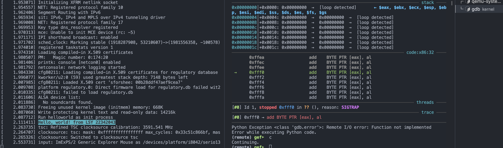

!!! abstract
    这是老师布置的一个小作业，让我们在 linux 内核源码里增加自定义的系统调用程序，用这篇文章记录一下完整的操作过程；

这样扩展 Linux 内核的传统方式需要每次都重新编译内核，更现代的方式是使用 [eBPF](https://ebpf.io/zh-cn/)

使用清华镜像源下载 linux 内核 5.10.19 版本，解压然后进入解压目录：

```shell
wget https://mirrors.tuna.tsinghua.edu.cn/kernel/v5.x/linux-5.10.19.tar.gz
......
tar -zxvf linux-5.10.19.tar.gz
......
cd linux-5.10.19
```

在 `kernel/sys.c` 中用 `SYSCALL` 宏增加系统调用源代码：

```c
SYSCALL_DEFINE1(myhello, int, arg)
{
	printk("\x1B[1;46mHello, world! from LSY %d\x1B[m", arg);
	return 0;
}
```

在 `include/linux/syscalls.h` 中增加自定义系统调用的声明：

```c
asmlinkage void sys_myhello(int arg);
```

在 `arch/x86/entry/syscalls/syscall_32.tbl` 和 `arch/x86/entry/syscalls/syscall_64.tbl` 中增加调用号：

```raw
441	64	myhello		sys_myhello
```

然后配置：

```shell
make i386_defconfig
make menuconfig
```

在 `make menuconfig` 打开的图像界面中依次选择`Kernel hacking`、`Compile-time checks and compiler options`，最后在`[ ] Compile the kernel with debug info`输入`Y`勾选，保存退出；

然后就可以编译内核：

```shell
make -j$(nproc)
```

写一个简单的 initramfs 程序 `helloworld.c` 调用自定义的系统调用函数，传入我的学号作为参数，源代码如下：

```c
#include<stdio.h>
void main(){
    syscall(441, 22342043);
    fflush(stdout);
    while (1);
}
```

将该程序编译：

```shell
gcc -o helloworld -m32 -static helloworld.c
```

用 cpio 打包 initramfs ：

```shell
echo helloworld | cpio -o --format=newc > hwinitramfs
```

调试模式启动内核，并加载 initramfs ，让内核程序暂停运行等待 gdb 连接 :

```shell
qemu-system-i386 -kernel linux-5.10.19/arch/x86/boot/bzImage -initrd hwinitramfs -s -S -append "console=ttyS0 rdinit=helloworld" -nographic
```

然后启动 gdb ：

```shell
gdb
```

加载符号表，并连接 qemu 调试服务提供的默认端口 1234 ，然后就可以输入 `c` 继续运行内核：

```shell gdb
file linux-5.10.19/vmlinux
target remote:1234
c
```

输出结果：


