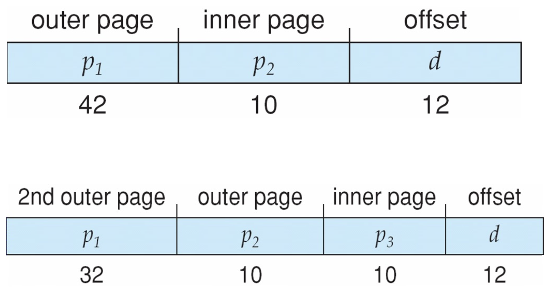

> 冯·诺伊曼计算机体系决定了操作系统需要内存管理

## 虚拟内存物理实现

- 连续分配
  - 单一连续分配
  - 分区
    - 固定分区分配
    - 动态分区分配
- 非连续分配
  - 段式
  - 页式
  - 段页式

:star:内部碎片和外部碎片

- 内部碎片
  - 是已经被分配给某个进程的，该进程没有利用的
  - 固定分区分配产生这种碎片
- 外部碎片
  - 是无法被分配给任何进程的，不属于任何进程的
  - 动态分区分配产生这种碎片
  - 可以通过**紧凑**技术克服，需要**动态重定位寄存器**硬件支持

### 分区(连续分配)

#### 单一连续分配

将内存分为两部分：

- 系统区
- 用户区
  - 唯一一个用户程序独占整个用户区

内存中只有一个用户程序，只能用于单用户、单任务的操作系统。

有内部碎片，无外部碎片。

#### 固定分区

使用**空闲分区链/表**。

有内部碎片，无外部碎片。

#### 动态分区

使用**空闲分区链/表**。

无内部碎片，有外部碎片。

##### 首次适应

空闲分区按**地址递增**顺序排列。

每次分配时从头开始顺序查找到第一个满足大小的空闲分区。

性能最好。

##### 邻近适应

空闲分区按**地址递增**顺序排列。和首次适应一样。

每次分配时从上次查找结束位置开始查找到第一个满足大小的空闲分区。

##### 最佳适应

空闲分区按**容量递增**顺序排列。

产生**最多外部碎片**。

##### 最坏适应

空闲分区按**容量递减**顺序排列。

::: primary
前面三种都基于**顺序搜索**，后面三种则都基于**索引搜索**。
##### 快速适应

基于**索引分配**，对空闲分区按大小相同的分为一类，每一类单独设置一个空闲分区链。建立一张**索引表**管理所有空闲分区链，索引表项包含对应大小的空闲分区链的**头指针**。

根据进程需要的大小，在索引表中找到能容纳它的最小的空闲分区链表，直接从链表取出第一块进行分配。

优劣：

- 优点
  - 查找效率高
  - 不产生内部碎片（当然啊这不是动态分区吗）
- 缺点
  - 回收分区复杂，导致算法复杂、系统开销大

##### 伙伴系统

> 我感觉应该算固定分区分配才对？

规定所有分区大小为 $2$ 的 $k$ 次幂。

每次分配大小为 $n$ ($2^{i-1}<n\leq 2^i$) 的分区时，在

导致过多内部碎片:warning:

Slab 分配器——一般只有内核内存使用

###### 哈希算法

根据空闲分区链表的分布规律建立哈希函数，构建一张以哈希表：

- 关键字 `key` 为空闲分区大小
- 表项 `value` 为对应空闲分区链的头指针

### 分段

程序员或者编译器会把程序和数据指定到不同的分段，需要知道段的最大长度限制

将程序产生的二维地址即 $<段号,偏移>$ 映射到一维物理地址， 这个地址是通过段表实现;

段表中每个条目由段基址和段界限构成

CPU 去哪里找段表？—— GDTR 寄存器，GDTR 寄存器的结构如下：

- 低 2 字节（16 位）存储了 limit ，全局描述符表的大小（以字节为单位），减去 1 的结果。
- 高 4 字节（32 位）存储了 base ，全局描述符表的基地址。

### 分页

**页放到页帧/框里**，区分：:warning:

- 页（Page）
- 页帧（Page frame）或者页框，是空的，没有数据

页框 $\geq$ 页，现代操作系统大多二者是相等的，方便管理

#### 页表

系统中有一个唯一的**页表寄存器**（PTR），包含页表首地址（PTBR），只能由特权指令访问。

> 页表长度寄存器（PTLR），可以直接用于判断是否越界（好像不一定有）

!!! abstract
    x86_64 , i386 中的 PTR 寄存器叫做 CR3 寄存器

页表从属于进程，每创建一个新进程就需要创建一个**独立**的新页表给它。

#### TLB

转换表缓冲区/快表/... 详细参考计组

#### 共享页

共享代码

- 进程(即文本编辑器、编译器、窗口系统)之间共享的只读 (可重入) 代码的一个副本;
- 类似于共享同一进程空间的多个线程;
- 如果允许共享读写页面，则还可用于进程间通信;

#### 多级/层页表

经典：在现代计算机上考虑 32 位逻辑地址空间，页面大小为 4KB ($2^{12}$)，页面表将有 4M 个条目 ($2^{32}/2^{12}=2^{20}$) ，如果每个条目为 4B ，每个进程需要为页表分配 16MB 的物理地址空间，这片连续的物理空间太大了！

相同条件下考虑 64 位，即使采用 2 级分页，外层页表也需要 16384GB 大小的连续物理空间！所以 x86_64 采用 4 级页表

!!! abstract
    现代 OS 大多采用 3 到 4 级页表

64 位下的 2 级页表 和 3 级页表：

#### 散列页表/哈希表

##### 聚簇页表

64 位地址的变体，哈希值对应的不是一个页，而是一簇页（一个页族）

特别适用于稀疏地址空间 (内存引用不连续且分散)

#### 倒排页表

不再为每个进程设置一个页表并跟踪所有可能的逻辑页，而是跟踪所有物理页，此时整个架构自 CPU 开始到 OS 都有较大变化

内存的每一物理页有一个条目，条目包含：

- 存储在该实际内存位置的页的虚拟地址
- 有关拥有该页的进程的信息组成

CPU 产生的逻辑地址：

优点：

- 减少存储每个页表所需的内存

缺点：

- 发生页引用时增加搜索表所需的时间
- 共享内存不太容易实现：虚拟地址到共享物理地址的一种映射

### 现代 OS 举例

#### Oracle SPARC Solaris

考虑现代 64 位操作系统目标是效率，低开销

基于哈希，但更复杂

两个哈希表

- 一个内核
- 一个用于所有用户进程

每个都将内存地址从虚拟内存映射到物理内存

每个条目表示映射虚拟内存的连续区域

比为每个页面提供单独的哈希表条目更高效

每个条目都有基址和跨距(表示条目所代表的页数)

#### IA-32/64

英特尔 IA-32 和 IA-64 均支持分段、分页管理

记录段号的基地址的描述符表，按私有、公有分为：

- LDT 局部描述符表
- GDT 全局描述符表

早期 IA-32 利用 PAE 实现页地址扩展

#### ARM

> Apple

段页混合式管理，较大连续内存走分段，较小连续内存走分页：

## 虚拟内存软件实现

:star:虚拟内存的实现建立在离散分配的内存管理方式基础上

三个特征：

- 多次性
- 对换性
- 虚拟性

虚拟内存可以通过以下方式实现:

- 请求分页
- 请求分段（按需分段）
- 请求段页式存储管理

### 请求分页

> 按需分页

- 固定分配局部置换
- 可变分配全局置换
- 可变分配局部置换

请求分页系统的**外存**：

- 文件区
  - 存放文件，采用离散分配方式
- 对换区（交换区）
  - 存放对换页面，采用连续分配方式，I/O 速度更快

可以在加载时将整个进程放入内存或者只在需要时才将页面放入内存

所需的 I/O 更少，没有不必要的 I/O

- 所需内存更少
- 更快的响应
- 更支持多用户

类似于带交换的分页系统 (需要硬件支持)

- 页面是必需的——引用它
- 无效引用——终止
- 不在内存中——调入内存

惰性交换程序：除非需要页，否则永远不要将页交换到内存中

处理页面的交换程序是“调页程序”

#### 处理缺页

1. 检查进程的内部表，通常与 PCB 一起保存，以确定内存引用是否有效;
2. 如果：（页面错误(缺页) ）
   - 无效，那么终止进程
   - 引用有效但是未调入页面， 那么发生缺页中断;
3. 找到空闲帧;（或 victim 帧）
4. 通过磁盘调度操作将页面交换到刚分配的帧中;
5. 当磁盘操作读取完成后，重置内部表和页表，以指示当前页面在内存中;
6. 重新启动导致缺页的指令，该进程能够访问所需的页;（**指令重启**）

#### 问题

##### 启动进程时内存中没有页面

操作系统将指令指针设置为进程的第一条指令，非内存驻留->页面错误

- 进程其他页面的访问也是一样;
- 纯请求分页;

##### 多页错误

- 考虑从内存中将 2 个数加和并将结果存储回内存的指令的读取和解码,可能产生多个缺页错误;
- 产生性能痛点，幸运的是因为局部引用的存在，使得请求分页 具有较为合理的性能;

##### 硬件支持

具有有效/无效位的页表
辅助内存(带交换空间的交换设备)

指令重启，在缺页错误后能够重启任何指令;

#### 指令重启

- **微代码**计算试图访问源块和目的块的两端，如果出现缺页错误，那么在这一步出现，完成缺页逻辑后，执行移动操作;
- 使用**临时寄存器**来保存覆盖位置的值，如果有缺页错误，则在陷阱发生之前，所有旧值都将写回到内存中。该动作是将内存恢复到指令启动之前的状态，这样能够重复执行该指令;

#### 写时复制

写时复制 (CoW) 允许父进程和子进程最初共享内存中的相同页面

如果任一进程修改了共享页面，则该页面被复制

CoW 允许更高效的进程创建 (fork) ，因为只复制修改过的页面

#### 系统抖动

频繁发生缺页，系统忙于进行页面的换入和换出，而没有进行有效的计算。

导致 CPU 利用率低，并发度低。

系统还会自动检测 CPU 利用率，系统抖动时检测到 CPU 利用率降低，会创建更多精进程来提高 CPU 利用率，但这会反而加剧系统抖动。

局部性原理告诉我们，访问磁盘总是在一个局部到另一个局部变化。而系统抖动从这个角度来说，就是局部性访问的大小超过了内存大小，所以导致了系统抖动。

本地或优先级替换算法来缓解系统抖动。

##### 工作集

$WSS_i$ (Working Set of Process $P_i$ )：进程在某一个固定的时间窗口 $\Delta$（可以按时间算、指令数算）内，访问的所有页面

- if $\Delta$ too small will not encompass entire locality
- if $\Delta$ too large will encompass several localities
- if $\Delta=\infty$ will encompass entire program

最理想的情况就是 WSS 能够被全部放在 TLB 中

:star: $t$ 时刻的工作集为该时刻及其以前 $\Delta$ 时间窗口范围内的访问的页面。

解决方案 1

建立“可接受的” PFF (page-fault frequency) 并使用本地替换策略

内核的内存管理就比较简单，因为它在内存里一定是连续的，可以完全利用线性地址偏移解决。

预调页

访问到某一内存页，很有可能下次就要访问它的邻居内存页，所以利用空间局部性

在程序启动的时候可以减少大量的缺页

当然也是有可能造成 I/O 和内存的浪费的

#### 帧分配

在进程之间如何分配固定数量的可用内存?

- 固定分配
- 优先级分配

- 全局置换——进程从所有帧集中选择替换帧，一个进程可以从另一个进程获取帧
  - 高优先级进程可以置换低优先级进程
  - 缺点:进程不能控制他自己的缺页错误率
- 局部置换——每个进程仅从其自己的一组分配帧中进行选择
  - 每个进程的性能更加一致
  - 但可能是未充分利用的内存

#### 页面回收

#### 性能指标

Three major activities

- Service the interrupt – careful coding means just several hundred instructions needed
- Read the page – lots of time
- Restart the process – again just a small amount of time

**Effective Access Time (EAT)**

$$
EAT=(1–p)\times MA+p\times(PFO+SPO-SPI)
$$

- Page Fault Rate $0\leq p\leq1$：
  - if $p=0$, no page faults
  - if $p=1$, every reference is a fault
- $MA$ : memory access
- $PFO$ : page fault overhead
- $SPO$ : swap page out ( if dirty )
- $SPI$ : swap page in

#### 性能优化

交换空间 I/O 比文件系统 I/O 快，即使在同一设备上也是如此

交换分配在更大的块中，比文件系统所需的管理更少;

在进程加载时将整个进程映像复制到交换空间

然后在交换空间内执行调页;
在旧的 BSD Unix 中使用;

从磁盘上的程序二进制文件请求分页，但在释放帧时将页面直 接放弃(被覆盖)，而不是分页调出;

在 Solaris 和当前 BSD 中使用 § 仍然需要写入以交换空间

与文件不关联的页面(如栈和堆)-匿名内存

在内存中修改但尚未写回文件系统的页面; v 移动系统

通常不支持交换
相反，从文件系统请求页面并回收只读页面(如代码)

### 页面置换算法

#### 空闲帧列表

当出现页面错误时，操作系统必须将所需页面从辅助存储器带入主存。

大多数操作系统都维护一个空闲帧列表——一个用于满足此类请求的空闲帧池。

操作系统通常使用一种称为按需零填充 (zero-fill-on-demand) 的技术来分配空闲帧，即在分配前将帧的内容清零。

当系统启动时，所有可用内存都会放在空闲帧列表中。

#### 页面置换

一定发生在缺页故障处理中，空闲帧列表基础上的补充，**防止内存过度分配**。

- 不一定要在空闲帧列表为空的时候才进行页面置换，也可能在空闲帧数量低于某一阈值的时候就开始
- 往往不是一个页面一个页面置换，因为这样效率比较低，而是批处理多个页面进行置换

使用修改 (dirty) 位来减少⻚面（内存到磁盘）传输的开销——只有修改过的 victim ⻚面才会写入磁盘;

⻚面替换完成了逻辑内存和物理内存之间的分离——可以 在较小的物理内存上提供较大的虚拟内存;

#### FIFO

**Belady 异常**，出现帧数增加后缺页异常数量也增加的现象，只会在 FIFO 调度中出现

#### OPT 算法

> 最优页面置换算法

替换在最长时间内不使用的页面，实际上不能预测，所以是不可行的，但可以用于理论上测量其他算法性能，作为比较的基线

#### LRU 算法

> 最少最近使用(LRU)算法

使用过去的知识而不是未来的知识，替换在最长时间内未使用的页面，将最后一次使用的时间与每页关联

一般来说，算法很好，经常使用

- 计数器实现，为每一个页面（页表项）设置计数位，每次页面被引用，将当前时钟的时间戳复制到计数位
- 使用堆栈记录最近的页面引用，栈顶为最近一次引用的页面，使用双向链表排序

#### 额外引用位算法

通过定期记录引用位，可以获得额外的排序信息;

为每个页面的页表项设置一个 8 位的字节;

将每个页面的引用位移到 8 位字节的高位，右移一位，并丢 弃最低位，保存 8 个时间周期的页面使用情况;

> 具有 `11000100` 的历史寄存器值的页面比具有值为 `01110111` 的 页面更为“最近使用”;

替换最小编号;

#### 第二次机会/时钟算法

通常为 FIFO，加上硬件提供的引用位。为每个页面设置一个访问位，再将内存中的页面都通过链接指针链接成一个循环队列

一般默认初始情况没有调入任何页面，依次调入页面后，各个页面的访问位为 `1`，替换指针指向第一个页帧。

::: warning
替换指针总是指向上一次被调入页面的下一个页帧！若为最后一个页帧则回到第一个页帧！
替换规则：

- 引用位=`0`，替换它，然后替换指针指向下一个页帧。
- 引用位=`1`，则:
  - 设置引用位 `0`，将页面保留在内存中
  - 替换指针指向下一个页帧，继续找按该规则 victim

第二轮扫描中一定会有访问位为 `0` 的页面，因此简单的 CLOCK 算法选择一个淘汰页面最多会经过两轮扫描

#### 增强型第二次机会算法

在第二次机会/时钟置换算法的基础上，除了考虑一个页面最近有没有被访问过之外，操作系统还应考虑页面有没有被修改过。在其他条件都相同时，应优先淘汰没有修改过的页面。

为每个页面页表项增加修改位（dirty）：

- 修改位=`0`，表示页面没有被修改过；
- 修改位=`1`，表示页面被修改过。

方便讨论，用 `(访问位,修改位)` 的形式表示各页面状态：

- `(0,0)` 最近未使用未修改——要替换的最佳页面
- `(0,1)` 最近未使用但已修改——不太好，必须在置换之前将页面写出;
- `(1,0)` 最近使用但没有修改——可能很快会再次使用
- `(1,1)` 最近使用和修改的——可能很快会再次使用，需要在更换前将页面写出;

将所有可能被置换的页面排成一个循环队列，和原本的时钟置换相比，每一轮的操作都有不同。

- 第一轮：从当前位置开始扫描到第一个 `(0,0)` 的帧用于替换。本轮扫描不修改任何标志位
- 第二轮：若第一轮扫描失败，则重新扫描，查找第一个 `(0,1)` 的帧用于替换。本轮将所有扫描过的帧访问位设为 `0`
- 第三轮：若第二轮扫描失败，则重新扫描，查找第一个 `(0,0)` 的帧用于替换。本轮扫描不修改任何标志位
- 第四轮：若第三轮扫描失败，则重新扫描，查找第一个 `(0,1)` 的帧用于替换。

这里的第 2、3 轮相当于原来的时钟置换算法的(可能的)， 2 轮。

由于第二轮已将所有帧的访问位设为 `0` ，因此经过第三轮、第四轮扫描一定会有一个帧被选中，因此改进型时钟置换算法选择一个淘汰页面最多会进行四轮扫描

#### 页面缓冲算法

始终保持一个空闲帧池

- 当出现缺页错误时，会像以前一样选择一个牺牲帧;

- 将页面读入空闲帧，选择要退出的牺牲帧并添加到空闲 池;

- 方便时，驱逐牺牲帧，无需等待写出牺牲帧; v 可能的话，保留修改过的页面列表

  当备份存储为空闲时，在那里写入页面并设置为非脏; 增加了无需写出的页面的概率;

可能的话，保持空闲帧池，并且记住哪些页面在哪些帧内;

如果在重用之前再次引用，则无需再次从磁盘加载内容

如果选择了错误的受害者帧，通常有助于减少惩罚

双缓冲

- 操作系统将页面副本作为 I/O 缓冲区保存在内存中
- 应用程序将页保留在内存中以供自己工作;

可能带来好处，也可能带来坏处
