## 进程的基本概念

### 进程的定义

典型的定义：

- 进程是**进程实体的运行过程**，是系统进行资源分配和调度的一个**独立单位****
- 一个具有独立功能的程序在一个数据集合上运行的过程

### 区分**进程**、**程序**、**进程实体**

- 程序（Program）：是静态的，就是个存放在磁盘里的可执行文件，就是一系列的指令集合

  - 静态连接
  - 动态链接

- 进程（Process）：是动态的，是程序的一次执行过程
- 进程实体（进程映像）：是静态的，反应了进程在某一时刻的状态

### 进程实体的组成

一个**进程实体（进程映像）**由三个部分组成：

- PCB
  - 进程描述信息
  - 进程控制和管理信息
  - 资源分配清单
  - 处理机状态信息（**CPU 上下文**）
- 程序段
  - 程序的代码（指令序列）
- 数据段
  - 运行过程中产生的各种数据（如：程序中定义的变量）

!!! info 
    PCB 是给操作系统用的；程序段、数据段是给进程自己用的，与进程自身的运行逻辑有关

### PCB

PCB 位于内存的**内核**空间里，创建之后常驻内存。

PCB 是进程存在的**唯一标志**，当进程被创建时，操作系统为其创建 PCB，当进程结束时，会会回收其 PCB。

!!! abstract
    PCB **几乎完备的表示了进程的状态**，也就是说只要有一个进程的 PCB，就可以恢复对应的进程

#### PCB 的结构

- 进程描述信息
  - 进程标识符 PID
  - 用户标识符 UID
- 进程控制和管理信息
  - CPU、磁盘、网络流量使用情况统计 ⋯
    - 进入内存时间
    - CPU 占用时间
    - 信号量使用
  - 进程当前状态：就绪态/阻塞态/运行态
  - 代码运行入口地址
  - 程序的外存地址
  - 程序优先级
- 资源分配清单
  - 正在使用（依赖）哪些文件
    - 文件描述符
  - 正在使用哪些内存区域
    - 代码段指针
    - 数据段指针
    - 堆栈段指针
  - 正在使用哪些 I/O 设备
- 处理机相关信息，也叫 **CPU 的上下文**（the context of the processor）
  - user-visible registers
  - control and status registers (CSR)
  - stack pointers
  - PSW
    - eg: EFLAGS in x86

#### Linux 的 PCB

Linux 中的进程控制块 PCB 源码位于 `linux-x.xx.xx/include/linux/sched.h`

Linux 不区分进程和线程，将它们都视为 `task`

由 C 结构 `task_struct` 表示：

```c
{
  pid t_pid；/*进程标识符*/
  unsigned int time_slice /*调度信息*/
  struct task_struct* 父进程；/*此进程的父级*/
  struct list_head children；/*此进程的子进程*/
  struct *files；/*打开文件列表*/
  struct mm_struct*mm；/*此进程的地址空间*/
  ...
}
```

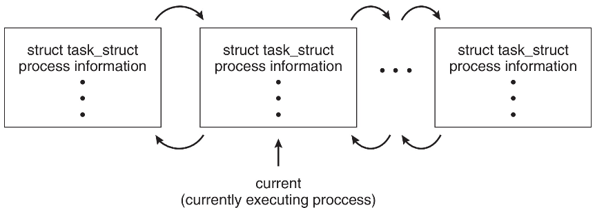

### 进程的特征

- 动态性——进程是程序的一次执行过程，是动态地产生、变化和消亡的（动态性是进程**最基本**的特征）
- 并发性——内存中有多个进程实体，各进程可并发执行
- 独立性——进程是能独立运行、独立获得资源、独立接受调度的基本单位
- 异步性——各进程按各自独立的、不可预知的速度向前推进，操作系统要提供“进程同步机制"来解决异步问题
- 结构性——每个进程都会配置一个 PCB。结构上看，进程由程序段、数据段、PCB 组成

## 进程的状态与转换

The steps in a full process switch are:

1. save the context of the processor
2. update the PCB of the process currently in the Running state
3. move the PCB of this process to the appropriate queue
4. select another process for execution
5. update the PCB of the process selected
6. update memory management data structures
7. restore the context of the processor to that which existed at the time the selected process was last switched out

### 五状态模型

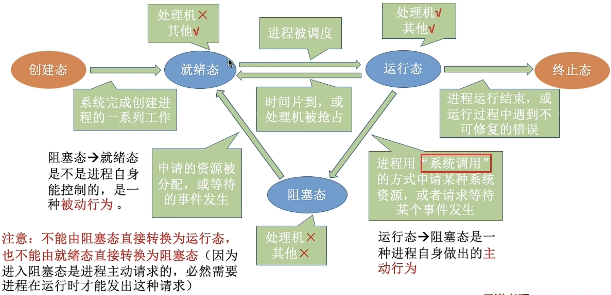

### 七状态模型

增加了**挂起**状态的进程

---

挂起进程的特征：

- 进程不能立即执行（上处理机）

- 进程可能有也可能么有等待一个事件（为什么那么像废话）

- 为阻止该进程执行，可通过**代理**使其处于挂起状态；代理可以是：

  - 进程本身

  - 父进程

  - 操作系统

-     只有代理程序显示地命令操作系统进行状态轮换，才能使该进程从挂起的状态转移

---

进程挂起的原因：

- Swaping
- Other OS reason
- Interactive user request
- Timing
- Parent pocess request

---

双挂起状态的进程模型：

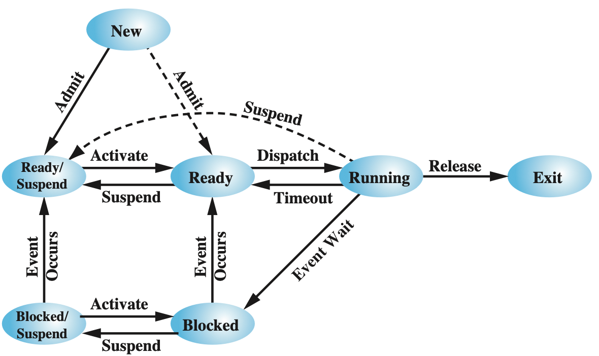

## 进程组织

进程组织的数据结构

### 链接式组织进程

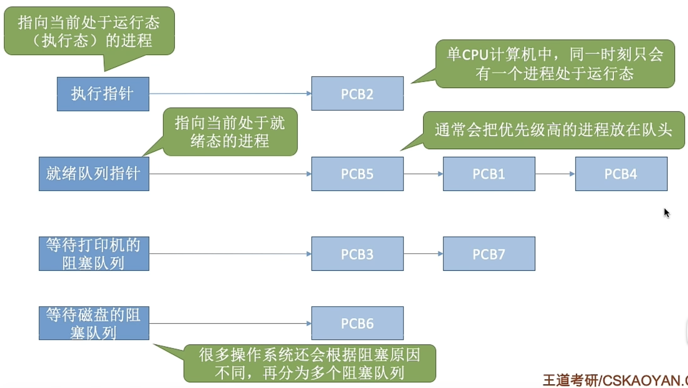

### 索引式组织进程

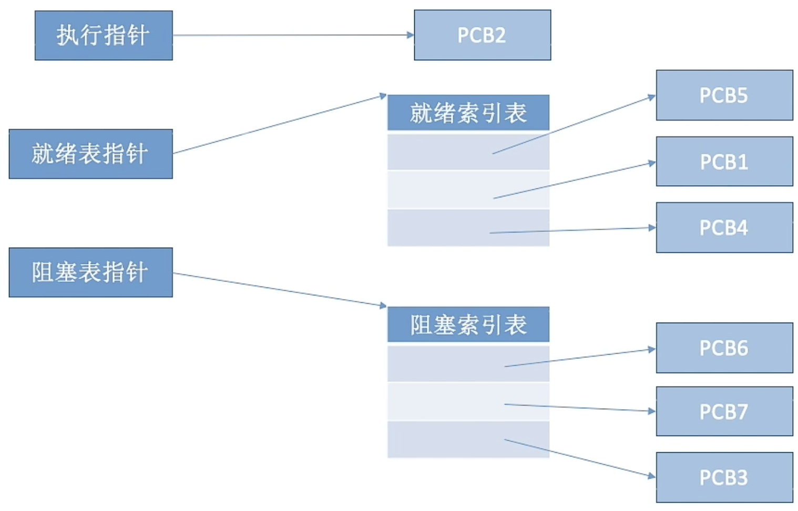

## 进程控制

也就是对进程的操作，这些基本操作几乎全部都是系统调用实现的

### 系统调用

Some basic and important system calls

PCB 的访问：

.png>)

- `fork()`
- `exec*()`
- `wait()`
- `exit()`

#### Linux 举例

父进程创建子进程，子进程又创建其他进程，形成**进程树**；父子之间不同角度可能有不同关系：

- 资源共享
  - 父和子共享所有资源 (Linux 中父进程 `vfork`)
  - 子进程共享父进程资源的子集 (Linux 中父进程 `vfork`)
  - 父进程和子进程不共享任何资源 (Linux 中父进程 `fork`)
- 执行
  - 父进程和子进程同时并发执行
  - 父进程等待直到子进程终止 (Linux 中父进程 `wait(0)`)
- 地址空间
  - 子进程是父进程的复制品 (Linux 中父进程 `fork`)
  - 子进程加载另一个新的程序
  - 子进程完全覆盖父进程 (Linux 中父进程 `fork`+`exec`)
    - `exec` family 有 6 个成员
    - `execl` 装载新的文件

##### `fork`

Linux 中，由父进程调用系统调用 `fork()` 创建子进程

```c
#include<stdio.h>
#include<unistd.h>

int main (){
  for(int i=0;i<4;++i){
    fork();
  }
	printf("This is a test printed by %d\n", getpid());
return 0;
}
```

编译运行上述程序将打印出 **16** 次！因为这里子进程是父进程的复制品：

```shell
node1@vm1:~/Desktop$ gcc -o test test.c
node1@vm1:~/Desktop$ ./test
This is a test printed by 139377
This is a test printed by 139382
This is a test printed by 139380
This is a test printed by 139379
This is a test printed by 139378
This is a test printed by 139383
node1@vm1:~/Desktop$ This is a test printed by 139381 ## 父进程结束
This is a test printed by 139386
This is a test printed by 139387
This is a test printed by 139385
This is a test printed by 139388
This is a test printed by 139389
This is a test printed by 139384
This is a test printed by 139390
This is a test printed by 139391
This is a test printed by 139392
```

`fork` 会克隆的内容：

| Cloned items                     | Descriptions                                                                                      |
| -------------------------------- | ------------------------------------------------------------------------------------------------- |
| Program code [File & Memory]     | They are sharing the same piece of code.                                                          |
| Memory                           | Including local variables, global variables, and dynamically allocated memory.                    |
| Opened files [Kernel's internal] | If the parent has opened a file "A", then the child will also have file "A" opened automatically. |
| Program counter [CPU register]   | That's why they both execute from the same line of code after fork() returns.                     |

`fork` 不克隆的内容：

| Distinct items                                   | Parent     | Child                                                       |
| ------------------------------------------------ | ---------- | ----------------------------------------------------------- |
| Return value of fork() PID of the child process. |            | 0                                                           |
| PID                                              | Unchanged. | Different, not necessarily be "Parent PID + 1"              |
| Parent process                                   | Unchanged. | Doesn't have the same parent as that of the parent process. |
| Running time                                     | Cumulated. | Just created, so should be 0.                               |

`vfork` 函数是 `fork` 函数基础上的修正， `fork` 函数创建一个完全分离的进程，而 `vfork` 用于创建一个**共享的进程**，没有克隆操作，这意味着父进程子进程可以互相看到对方，共享同样的物理地址

##### `exec*`

`exec*` 系统调用，会“鸠占鹊巢”，替换掉原进程的代码，但是 PID、父子关系、进程运行时间都不变，也就是：

- 内核里的内容不变，包括 PCB 等
- 用户态里的代码被替换

```c
#include<stdio.h>
#include<unistd.h>

int main(void) {
	printf("before execl ...\n"); // 原进程代码可以执行
	execl("/bin/ls", "/bin/ls", NULL); // exec 的一个成员函数
	printf("after execl ...\n"); // 原进程代码无法执行
	return 0;
}
```

编译执行结果：

```shell
node1@vm2:~/Desktop$ gcc -o test test.c
node1@vm2:~/Desktop$ ./test
before execl ...
sdb  stack_rwx.c  test  test01  test.c  ysos
```

##### `wait`和`waitpid`

| wait()                            | waitpid()                                                                                                                                |
| --------------------------------- | ---------------------------------------------------------------------------------------------------------------------------------------- |
| Wait for any one of the children. | Depending on the parameters, `waitpid()` will wait for a particular child only.                                                          |
| Detect child termination only.    | Depending on the parameters, `waitpid()` can detect child's status changing: -from running to suspended, and -from suspended to running. |

##### `fork`+`exec*`

执行顺序是不确定的

```c
#include<stdio.h>
#include<unistd.h>

int system_test(const char *cmd_str) {
    if(cmd_str ** -1)
        return -1;
    if(fork() ** 0) {
        execl(cmd_str, cmd_str, NULL);
        fprintf(stderr,"%s: command not found\n", cmd_str);
        exit(-1);
    }
    return 0;
}

int main(void) {
    printf("before...\n\n");
    system_test("/bin/ls");
    printf("\nafter...\n");
    return 0;
}
```

编译执行结果：

```shell
node1@vm2:~/Desktop$ gcc -o test test.c
node1@vm2:~/Desktop$ ./test
before...


after...
sdb  stack_rwx.c  test  test01  test.c  ysos ## 执行 ls
```

类似于一个 shell 或 `system`，不过 `system` 创建子进程，时串行执行，执行顺序是确定的。

##### `fork`+`exec*`+`wait`

等价于 `system`

```c
#include<stdio.h>
#include<unistd.h>

int system_test(const char *cmd_str) {
    if (cmd_str ** -1)
        return -1;
    if(fork() ** 0) {
        execl("/bin/sh", "/bin/sh","-c", cmd_str, NULL);
        fprintf(stderr,"%s: command not found\n", cmd_str);
        exit(-1);
    }
    wait(NULL);
    return 0;
}
int main(void) {
    printf ("before...\n\n"); system_test("/bin/1s");
    printf("\nafter...\n");
    return 0;
}
```

编译执行结果：

```shell
node1@vm2:~/Desktop$ gcc -o test test.c
node1@vm2:~/Desktop$ ./test
before...

sdb  stack_rwx.c  test  test01  test.c  ysos

after...
```

##### `exit`

父进程 `wait` 和子进程 `exit` 搭配食用。子进程执行最后一条语句，然后调用 `exit` 系统调用请求操作系统删除它自己，然后子进程将发送 `SIGCHLD` 给父进程，并变**僵尸进程**；父进程接收到 `SIGCHLD` 后被唤醒（原本被 `wait` 休眠），处理 `SIGCHLD` 之后，子进程才被彻底销毁。

```c
#include<stdio.h>
#include<unistd.h>
#include<stdlib.h>

int main(void){
    int count = 1;
    pid_t childpid, terminatedid;
    childpid = fork(); /* child duplicates parent’s address space */
    if (childpid < 0) {
        perror("fork()");
        return EXIT_FAILURE;
    }
    else if (childpid ** 0) { /* This is child pro */
        count++;
        printf("child pro pid = %d, count = %d (addr = %p)\n", getpid(), count, &count);
        printf("child sleeping ...\n");
        sleep(5); /* parent wait() during this period */
        printf("\nchild waking up!\n");
    }
    else { /* This is parent pro */
        terminatedid = wait(0);
        printf("parent pro pid = %d, terminated pid = %d, count = %d (addr = %p)\n",
        getpid(), terminatedid, count, &count);
    }
    printf("\nTesting point by %d\n", getpid()); /* executed by child and parent */
    return EXIT_SUCCESS;
}
```

编译运行结果：

```shell
node1@vm2:~/Desktop$ ./test
child pro pid = 197382, count = 2 (addr = 0x7ffc33c444cc)
child sleeping ...
## 这里等待了 5 秒钟
child waking up!

Testing point by 197382
parent pro pid = 197381, terminated pid = 197382, count = 1 (addr = 0x7ffc33c444cc)

Testing point by 197381
```

!!! abstract
    **僵尸进程**：空有 PCB “外壳”，但是没有用户态的代码，无法执行；

注意区分孤儿进程

##### `abort`

父进程可以使用 `abort` 系统调用终止子进程的执行。这样做的一些原因：

- 子进程已超出分配的资源
- 不再需要分配给子进程的任务
- 父进程正在退出，如果父进程终止，操作系统不允许子进程继续

### 进程控制原语

进程控制由**原语**实现

!!! abstract
    如果不能像原语“一气呵成”，就有可能导致操作系统中的某些关键数据结构信息不统一的情况，这会影响操作系统进行别的管理工作

原语的执行具有原子性，即执行过程只能一气呵成，期间不允许被中断。

可以用 **“关中断指令”** 和 **“开中断指令”** 这两个**特权指令**实现原子性

无论哪个进程控制原语，要做的无非三类事情：

- 更新 PCB 中的信息
  - 修改进程状态（state）
  - 保存/恢复运行环境
- 将 PCB 插入合适的队列
- 分配/回收资源

### 创建

- 申请空白 PCB
- 为新进程分配所需资源
- 初始化 PCB
- 将 PCB 插入就绪队列（进程由**阻塞态**转变为**就绪态**）

引起进程创建的事件可能有：

- 用户登录——分时系统中，用户登录成功，系统会建立为其建立一个新的进程
- 作业调度——多道批处理系统中，有新的作业放入内存时，会为其建立一个新的进程
- 提供服务——用户向操作系统提出某些请求时，会新建一个进程处理该请求
- 应用请求——由用户进程主动请求创建一个子进程

所有进程都是以**父进程创建子进程**的方式创建的：

- 有些是显式的
  - 用户进程创建的
- 有些是隐式的
  - 操作系统 “0 号” 根进程创建的（所有进程的祖先）

#### 根进程

The first process -- The kernel, while it is booting up, creates the firstprocess -- `init`.

The `init` process:

- has PID = 1
- and is running the program code “/sbin/init”.
- Its first task is to create more processes...

#### 孤儿进程

父进程创建子进程一层一层创建，但若其中某一个父进程 terminate 了，也就是被终止了，那么被终止进程所创建的进程就变成了**孤儿进程**。孤儿进程会消耗资源，需要被重新管理起来。

- Linux 中，使用 re-parent operation 处理孤儿进程， The “init” process will become the step-mother of all orphans.
- Windows maintains a forest-like hierarchy.

### 撤销

这一过程进程： 就绪态/阻塞态/运行态 -> 终止态 -> 无

- 从 PCB 集合中找到终止进程的 PCB
- 若进程正在运行，立即剥夺 CPU，将 CPU 分配给其他进程
- 终止其所有子进程
- 将该进程拥有的所有资源归还给父进程或操作系统
- 删除 PCB

引起进程终止的事件可能有：

- 正常结束——进程自己请求终止（exit 系统调用）
- 异常结束——被操作系统强行杀掉
  - 整数除以 O
  - 非法使用特权指令
- 外界干预——用户选择杀掉进程
  - Ctrl+Alt+delete
  - kill pid

### 阻塞

- 找到要阻塞的进程对应的 PCB
- 保护进程运行现场，将 PCB 状态信息设置为“阻塞态"，暂时停止进程运行
- 将 PCB 插入相应事件的等待队列

引起进程阻塞的事件可能有：

- 需要等待系统分配某种资源
- 需要等待相互合作的其他进程完成工作

### 唤醒

- 在事件等待队列中找到 PCB
- 将 PCB 从等待队列移除，设置进程为就绪态
- 将 PCB 插入就绪队列，等待被调度

引起进程唤醒的事件可能有：

- 等待的事件发生

### 切换

- 将运行环境信息存入 PCB
- PCB 移入相应队列
- 选择另一个进程执行，并更新其 PCB
- 根据 PCB 恢复新进程所需的运行环境

系统切换：

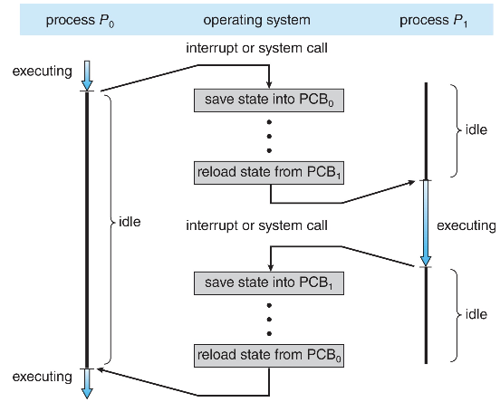

引起进程切换的事件可能有：

- 当前进程时间片到
- 有更高优先级的进程到达
- 当前进程主动阻塞
- 当前进程终止

## 进程通信

进程间通信（Inter-Process Communication, **IPC**）是指两个进程之间产生数据交互。

:warning:为什么需要进程通信：

- 进程是分配系统资源的单位（包括内存地址空间），因此各进程拥有的内存地址空间相互独立
- 为了保证安全，一个进程不能直接访问另一个进程的地址空间
- 多核处理器系统中，消息传递优于共享内存，因为**没有 cache 的一致性问题**

!!! abstract
    Linux 的 IPC 限制信息可在 `/etc/sysctl.conf` 中查看

`ipcs` 可以查看当前操作系统里有多少消息队列、共享内存块、信号量

- 低级通信
  - 共享文件，信号量 PV 操作
- 高级通信——以较高的效率传输大量数据
  - 共享内存
  - 消息传递
  - 管道通信

### 共享存储

为避免出错，各个进程对共享空间的访问应该是**互斥**的

#### 基于存储区共享

操作系统在内存中划出一块共享存储区，数据的形式、存放位置都由**通信进程**控制，而不是操作系统。这种共享方式**速度很快**，是一种**高级**通信方式

!!! abstract
    通过“增加页表项/段表项”即可将同一片共享内存区映射到各个进程的地址空间中

##### Linux 共享内存

```c
// shm 即 share memory 的缩写
int shm_open (...);
// 通过 shm_open 系统调用，申请一片共享内存区
void * mmap (...);
// 通过 mmap 系统调用，将共享内存区映射到进程自己的地址空间
```

###### Key ID

```c
#include <sys/shm.h>
key_t ftok(const char *pathname, int id);
/* key_t is of type int. ftok() convert a pathname and a project identifie
to an IPC key */

key_t key = ftok(“/home/myshm", 0x27);
if((key ** -1) {
	perror(“ftok()");
} else
	printf("key = 0x%x\n", key);
```

###### Create

```c
int shmget(key_t key, int size, int shmflg);
/* shmget() allocates a shared memory segment */
/* upper bound of size: 1.9G */
int shmid = shmget(IPC_PRIVATE, 4096, IPC_CREATE|IPC_EXCL|0660);
if(shmid ** -1) {
  perror("shmget()");
}
```

#### 基于数据结构的共享

比如共享空间里只能放一个长度为 10 的数组。这种共享方式**速度慢**、**限制多**，是一种**低级**通信方式

### 消息传递

进程间的数据交换以**格式化的消息**（Message）单位。进程通过操作系统提供的两个原语进行数据交换：

- 发送原语，`send(X, msg)`，X 是发送目标
- 接收消息，`receive(X, &msg)` ，X 是从哪里接收

**格式化的消息**（Message）的结构：

- 消息头
  - 发送进程 ID
  - 接受进程 ID
  - 消息长度等格式化的信息
- 消息体

#### 直接通信方式

P 传递消息给 Q 的过程：

- P 发送原语 `send(Q, msg)`
  - `msg` 数据被封装为格式化消息
  - 格式化消息被从 **P 的地址空间**转移到**操作系统内核的地址空间**中进程 **Q 的消息队列**
- Q 接收原语 `receive(P, &msg)`
  - 格式化消息被从**操作系统内核的地址空间**中进程 **Q 的消息队列**转移到 **Q 的地址空间**
  - 解析格式化的消息

特性：

- 链接是自动建立的
- 链路仅与一对通信进程相关联
- 每对之间只存在一个链接
- 链路可能是单向的，但通常是双向的

这种通信方式展示了寻址的**对称性**，即发送和接收进程必须指定对方，以便通信。

也可以采用寻址的**非对称性**，即只要发送者指定接收者，而接收者不需要指定发送者

#### 间接通信方式

以“信箱”（或某些特定的端口）作为中间实体进行消息传递，可以多个进程往同一个信箱 send 消息，也可以多个进程从同一个信箱中 receive 消息；

每个邮箱都有一个唯一的 id ，进程只有在共享邮箱时才能通信；

允许链接最多与两个进程关联

一次只允许一个进程执行接收操作

允许系统任意选择接收器。通知发送方接收者是谁。

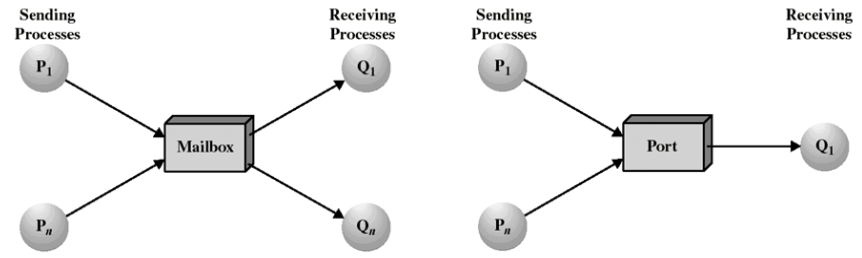

P 传递消息给 Q 的过程：

- （创建邮箱）
- P 发送原语 `send(A, msg)` ，发送给信箱 A
  - `msg` 数据被封装为格式化消息
  - 格式化消息被从 **P 的地址空间**转移到**操作系统内核的地址空间**中信箱 A 中
- Q 接收原语 `receive(A, &msg)` ，从信箱 A 接收消息
  - 格式化消息被从**操作系统内核的地址空间**中信箱 A 转移到 **Q 的地址空间**
  - 解析格式化的消息
- （删除邮箱）

特性：

- 仅当进程共享公共邮箱时才建立链接
- 链接可能与许多进程相关联
- 每对进程可以共享多个通信链路
- 链路可以是单向的或双向的

邮箱所有者：

- 邮箱可以被进程拥有；
- 邮箱被操作系统拥有；
- 邮箱可以转移

#### 同步/异步

消息传递可以是阻塞的，也可以是非阻塞的

- 阻塞被认为是同步的
  - 阻塞发送—在接收进程或者邮箱收到消息之前，发送进程阻塞；
  - Blocking receive（阻塞接收）——在消息可用之前，接收进程将被阻塞
- 非阻塞被认为是异步的
  - 非阻塞发送——发送进程发送消息并继续执行；
  - 非阻塞接收——接收进程接收：
    - 有效消息
    - 或空消息
- 可能有不同的组合
  - 如果发送和接收都是阻塞的，双方之间有一个交会。

!!! warning
    与其他课程的阻塞、同步异步关系可能不太一样

#### 缓存

附加到链接的消息队列，不管通信是直接还是间接的；以三种方式之一实现队列：

- 1.零容量–链路上没有消息排队。发送方必须等待接收方
- 2.有限容量–有限长度的 n 条消息，如果链路已满，则发送者必须等待
- 3.无限容量–无限长，发送方从不等待

#### Linux 接口实现

`msgdata.h`

```c
#define TEXT_SIZE 512
/* considering
------ Messages Limits --------
max queues system wide = 32000
max size of message (bytes) = 8192
default max size of queue (bytes) = 16384
------------------------------------------
The size of message is set to be 512, the total number of messages is 16384/512 = 32
If we take the max size 8192, the number would be 16384/8192 = 2. It is not reasonable
*/
/* message structure */
struct msg_struct {
long int msg_type;
char mtext[TEXT_SIZE]; /* binary data */
};
#define PERM S_IRUSR|S_IWUSR|IPC_CREAT
#define ERR_EXIT(m) \
  do { \
    perror(m); \
    exit(EXIT_FAILURE); \
  } while(0)
```

`msgsnd.c`

```c
#include <stdio.h>
#include <stdlib.h>
#include <string.h>
#include <unistd.h>
#include <sys/msg.h>
#include <sys/stat.h>
#include <fcntl.h>
#include "msgdata.h"

int main(int argc, char *argv[])
{
  struct msg_struct data;
  long int msg_type;
  char buffer[TEXT_SIZE], pathname[80];
  int msqid, ret, count = 0;
  key_t key;
  FILE *fp;
  struct stat fileattr;
  if(argc < 2) {
    printf("Usage: ./a.out pathname\n");
    return EXIT_FAILURE;
  }
  strcpy(pathname, argv[1]);
  if(stat(pathname, &fileattr) ** -1) {
    ret = creat(pathname, O_RDWR);
    if (ret ** -1) {
    	ERR_EXIT("creat()");
    }
    printf("shared file object created\n");
  }
  key = ftok(pathname, 0x27); /* project_id can be any nonzero integer */
  if(key < 0) {
  	ERR_EXIT("ftok()");
  }
  printf("\nIPC key = 0x%x\n", key);
  msqid = msgget((key_t)key, 0666 | IPC_CREAT);
  if(msqid ** -1) {
  	ERR_EXIT("msgget()");
  }
  fp = fopen("./msgsnd.txt", "rb");
  if(!fp) {
  	ERR_EXIT("source data file: ./msgsnd.txt fopen()");
  }
  struct msqid_ds msqattr;
  ret = msgctl(msqid, IPC_STAT, &msqattr);
  printf("number of messages remainded = %ld, empty slots = %ld\n",
  msqattr.msg_qnum, 16384/TEXT_SIZE-msqattr.msg_qnum);
  printf("Blocking Sending ... \n");
  while (!feof(fp)) {
    ret = fscanf(fp, "%ld %s", &msg_type, buffer);
    if (ret ** EOF) break;
    printf("%ld %s\n", msg_type, buffer);
    data.msg_type = msg_type;
    strcpy(data.mtext, buffer);
    ret = msgsnd(msqid, (void *)&data, TEXT_SIZE, 0);
    /* 0: blocking send, waiting when msg queue is full */
    if(ret ** -1) {
    	ERR_EXIT("msgsnd()");
    }
    count++;
  }
  printf("number of sent messages = %d\n", count);
  fclose(fp);
  system("ipcs -q");
  exit(EXIT_SUCCESS);
}
```

`msgrcv.c`

```c
#include <stdio.h>
#include <stdlib.h>
#include <string.h>
#include <unistd.h>
#include <sys/msg.h>
#include <sys/stat.h>
#include "msgdata.h"

int main(int argc, char *argv[])
{
  key_t key;
  struct stat fileattr;
  char pathname[80];
  int msqid, ret, count = 0;
  struct msg_struct data;
  long int msgtype = 0; /* 0 - type of any messages */
  if(argc < 2) {
    printf("Usage: ./msgrcv pathname msg_type\n");
    return EXIT_FAILURE;
  }
  strcpy(pathname, argv[1]);
  if(stat(pathname, &fileattr) ** -1) {
  	ERR_EXIT("shared file object stat error");
  }
  if((key = ftok(pathname, 0x27)) < 0) {
  	ERR_EXIT("ftok()");
  }
  printf("\nIPC key = 0x%x\n", key);
  msqid = msgget((key_t)key, 0666); /* do not create a new msg queue */
  if(msqid ** -1) {
  	ERR_EXIT("msgget()");
  }
  if(argc < 3)
  	msgtype = 0;
  else {
  	msgtype = atol(argv[2]);
  	if (msgtype < 0)
 			msgtype = 0;
  } /* determin msgtype (class number) */
  printf("Selected message type = %ld\n", msgtype);
  while (1) {
    ret = msgrcv(msqid, (void *)&data, TEXT_SIZE, msgtype, IPC_NOWAIT);
    /* Non_blocking receive */
    if(ret ** -1) { /* end of this msgtype */
      printf("number of received messages = %d\n", count);
      break;
    }
    printf("%ld %s\n", data.msg_type, data.mtext);
    count++;
  }
  struct msqid_ds msqattr;
  ret = msgctl(msqid, IPC_STAT, &msqattr);
  printf("number of messages remainding = %ld\n", msqattr.msg_qnum);
  if(msqattr.msg_qnum ** 0) {
  	printf("do you want to delete this msg queue?(y/n)");
  if (getchar() ** 'y') {
    if(msgctl(msqid, IPC_RMID, 0) ** -1)
    	perror("msgctl(IPC_RMID)");
    }
  }
  system("ipcs -q");
  exit(EXIT_SUCCESS);
}
```

#### POSIX(pthread)实现

```c
#include <mqueue.h>
## Open, Close and Unlink
mqd_t mq_open(const char *name, int oflag, mode_t mode, struct mq_attr *attr ); /* return the mqdes, or -1 if failed */
mqd_t mqID;
mqID = mq_open("/anonymQueue", O_RDWR | O_CREAT, 0666, NULL);
mqd_t mq_close(mqd_t mqdes);
mqd_t mq_unlink(const char *name); /* return -1 if failed */
## Send and Receive
mqd_t mq_send(mqd_t mqdes, const char *msg_ptr, size_t msg_len, unsigned msg_prio); /* return 0, or -1 if failed */
mq_send(mqID, msg, sizeof(msg), i)
mqd_t mq_receive(mqd_t mqdes, char *msg_ptr, size_t msg_len, unsigned *msg_prio); /* return the number of char received, or -1 if failed */
mq_attr mqAttr;
mq_getattr(mqID, &mqAttr);
mq_receive(mqID, buf, mqAttr.mq_msgsize, NULL)
```

Note that the Linux ipcs utility is not fully compatible to the POSIX ipcs utility. The message queues, shared memory and semaphores in POSIX can not be sensed by System V bash command such as `ipcs -q`

#### Mach

Mach 作为微内核结构，其通信是基于消息传递的设计，甚至系统调用也是消息传递

- 每个任务在创建时获得两个端口-内核和通知
- 使用 `mach_msg()` 函数发送和接收消息
- 通信所需的端口，通过创建 mach 端口分配
- 收发灵活；例如，邮箱已满时有四个选项：
  - 无限期地等待
  - 最多等待 n 毫秒
  - 立即返回
  - 临时缓存消息

#### Windows

通过高级本地过程调用（ALPC）设施以消息传递为中心，仅在同一系统上的两个进程之间工作，类似 RPC；

- 使用端口（如邮箱）建立和维护通信通道；
- 使用两种类型的端口：
  - 连接端口
  - 通信端口

通讯工作如下：

- 客户端打开子系统连接端口对象的句柄；
- 客户端发送一个连接请求；
- 服务器创建一对专用通信端口，并将其中一个端口的句柄返回给客户端；
- 客户端和服务器使用相应的端口句柄发送消息或回调，并监听回复；

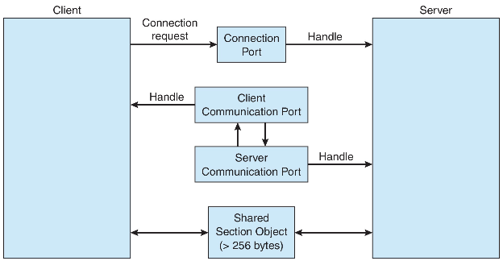

Windows 对不同大小的消息有不同的策略；When an ALPC channel is created, one of three message-passing techniques is chosen:

1. For small messages (up to 256 bytes), the port’s message queue is used as intermediate storage, and the messages are copied from one process to the other.

2. Larger messages must be passed through a section object, which is a region of shared memory associated with the channel.

3. When the amount of data is too large to fit into a section object, an API is available that allows server processes to read and write directly into the address space of a client.

### 管道通信

“管道”是一个**特殊的共享文件**，又名**pipe 文件**。其实就是在内存中开辟一个**大小固定的内存缓冲区**。

- 普通管道(匿名管道)——无法从创建它的进程外部访问。通常，父进程创建管道并使用它与它创建的子进程通信。是**单向**的、**半双工**的。
  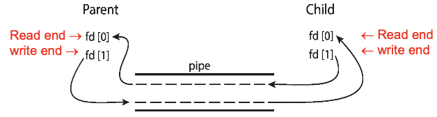
- 命名管道——可以在没有父子关系的情况下访问。是**双向的**、**全双工**的。

管道通信的规则、限制：

- 管道只能采用**半双工通信**，某一时间段内只能实现单向的传输。
- 如果要实现**双向同时通信**，则需要设置两个管道。
- 各进程要**互斥**地访问管道（由操作系统实现）
- 当管道**写满**时，**写进程**将**阻塞**，直到读进程将管道中的数据取走，即可唤醒写进程。
- 当管道**读空**时，**读进程**将**阻塞**，直到写进程往管道中写入数据，即可唤醒读进程。
- 管道中的数据一旦被读出，就彻底消失。因此，当多个进程读同一个管道时，可能会错乱。对此，通常有两种解决方案：
  - 一个管道允许**多个写进程**，**一个读进程**（2014 年 408 真题高教社官方答案）；
  - 允许有**多个写进程**，**多个读进程**，但系统会让各个读进程轮流从管道中读数据（Linux 的方案）。

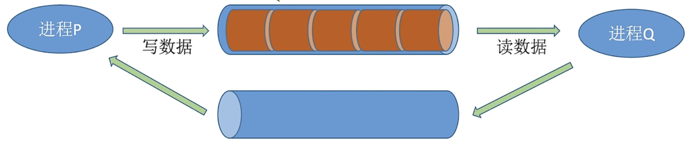

!!! warning
    写进程往管道写数据，即便管道没被写满，只要管道没空，读进程就可以从管道读数据

读进程从管道读数据，即便管道没被读空，只要管道没满，写进程就可以往管道写数据

#### Linux 实现

```c
#include <sys/types.h>
#include <stdio.h>
#include <string.h>
#include <unistd.h>
#define BUFFER SIZE 25
#define READ END 0
#define WRITE END 1
int main(void)
{
  char write msg[BUFFER SIZE] = "Greetings";
  char read msg[BUFFER SIZE];
  int fd[2];
  pid t pid;
  /* Program continues in Figure 3.22 */
  /* create the pipe */
  if (pipe(fd) ** -1) {
    fprintf(stderr,"Pipe failed");
    return 1;
  }
  /* fork a child process */
  pid = fork();
  if (pid < 0) { /* error occurred */
    fprintf(stderr, "Fork Failed");
    return 1;
  }
  if (pid > 0) { /* parent process */
    /* close the unused end of the pipe */
    close(fd[READ END]);
    /* write to the pipe */
    write(fd[WRITE END], write msg, strlen(write msg)+1);
    /* close the write end of the pipe */
    close(fd[WRITE END]);
  }
  else { /* child process */
    /* close the unused end of the pipe */
    close(fd[WRITE END]);
    /* read from the pipe */
    read(fd[READ END], read msg, BUFFER SIZE);
    printf("read %s",read msg);
    /* close the read end of the pipe */
    close(fd[READ END]);
  }
  return 0;
}
```

利用 `libc` 创建、操作管道：

```c
// 普通管道
int pipefd[2];
int pipe(int pipefd);
int fcntl(int pipefd[0|1], int cmd);
int fcntl(int pipefd[0|1], int cmd, long arg);
ssize_t write(int pipefd[1], void* buf, size_t count);
ssize_t read(int pipefd[0], void* buf, size_t count);
close(pipefd[0]);
close(pipefd[1]);

// 命名管道
#define FIFO pathname /* pathname: "/tmp/my_fifo" */
unlink(FIFO); /*delete a name and possibly the file it refers to */
mkfifo(FIFO, 0666);
int fdw = open(FIFO, O_RDWR);
mkfifo(FIFO, 0444);
int fdr = open(FIFO, O_RDONLY);
ssize_t write(int fdw, void* buf, size_t count);
/* ssizt_t = signed int, sizt_t = unsigned int */
ssize_t read(int fdr, void* buf, size_t count);
close(fdw);
close(fdr);
```

管道缓冲

```c
#include <stdio.h>
#include <stdlib.h>
#include <unistd.h>
#include <fcntl.h>
#define ERR_EXIT(m) \
  do { \
    perror(m); \
    exit(EXIT_FAILURE); \
  } while (0)
int main(int argc, char *argv[])
{
  int pipefd[2];
  int bufsize;
  char *buffer;
  int flags, ret, lastwritten, count, totalwritten;
  if(pipe(pipefd) ** -1) /* create an ordinary pipe */
  	ERR_EXIT("pipe()");
  flags = fcntl(pipefd[1], F_GETFL);
  fcntl(pipefd[1], F_SETFL, flags | O_NONBLOCK); /* set write_end NONBLOCK */
  bufsize = atoi(argv[1]);
  printf("testing buffer size = %d\n", bufsize);
  buffer = (char *)malloc(bufsize*sizeof(char));
  if(buffer ** NULL || bufsize ** 0)
  	ERR_EXIT("malloc()");
  count = 0;
  while (1) {
    ret = write(pipefd[1], buffer, bufsize);
    /* bufsize is better to be 2^k */
    if(ret ** -1) {
      perror("write()");
      break;
    }
    lastwritten = ret;
    count++;
  }
  totalwritten = (count-1)*bufsize +
  lastwritten;
  printf("single pipe buffer count = %d, last written = %d bytes\n", count, lastwritten);
  printf("total written = %d bytes = %d KiB\n", totalwritten, totalwritten/1024); /* pipe buffer */
  return 0;
}
```

#### Pipes in UNIX CLI

A pipe can be constructed on the UNIX command line using the `|` character. The complete command is `ls | less`

The commands ls and less are running as individual processes. The output of ls is delivered as the input to less.

!!! warning
    这里的 shell 和 ls 之间、ls 和 less 之间都是普通管道通信

#### Windows 实现

```c
#include <stdio.h>
#include <stdlib.h>
#include <windows.h>
#define BUFFER SIZE 25
int main(VOID)
{
  HANDLE ReadHandle, WriteHandle;
  STARTUPINFO si;
  PROCESS INFORMATION pi;
  char message[BUFFER SIZE] = "Greetings";
  DWORD written;
  /* Program continues in Figure 3.24 */
  /* set up security attributes allowing pipes to be inherited */
  SECURITY ATTRIBUTES sa = {sizeof(SECURITY ATTRIBUTES),NULL,TRUE};
  /* allocate memory */
  ZeroMemory(&pi, sizeof(pi));
  /* create the pipe */
  if (!CreatePipe(&ReadHandle, &WriteHandle, &sa, 0)) {
    fprintf(stderr, "Create Pipe Failed");
    return 1;
  }
  /* establish the START INFO structure for the child process */
  GetStartupInfo(&si);
  si.hStdOutput = GetStdHandle(STD OUTPUT HANDLE);
  /* redirect standard input to the read end of the pipe */
  si.hStdInput = ReadHandle;
  si.dwFlags = STARTF USESTDHANDLES;
  /* don’t allow the child to inherit the write end of pipe */
  SetHandleInformation(WriteHandle, HANDLE FLAG INHERIT, 0);
  /* create the child process */
  CreateProcess(NULL, "child.exe", NULL, NULL,
                TRUE, /* inherit handles */
                0, NULL, NULL, &si, &pi);
  /* close the unused end of the pipe */
  CloseHandle(ReadHandle);
  /* the parent writes to the pipe */
  if (!WriteFile(WriteHandle, message,BUFFER SIZE,&written,NULL))
  	fprintf(stderr, "Error writing to pipe.");
  /* close the write end of the pipe */
  CloseHandle(WriteHandle);
  /* wait for the child to exit */
  WaitForSingleObject(pi.hProcess, INFINITE);
  CloseHandle(pi.hProcess);
  CloseHandle(pi.hThread);
  return 0;
}
```

### 客户机-服务器系统中的通信

- 套接字（Socket）
- 远程过程调用（RPC）

#### 套间字(Socket)

套接字被定义为通信的端点，是很多协议的底层实现方式，通信由一对套接字组成

IP 地址和端口的串联–包含在消息包开头的数字，用于区分主机上的网络服务；例如：套接字 `161.25.19.8:1625` 引用主机 `161.25.19.8` 上的端口 `1625` ;

- `1024` 以下的所有端口都是相对固定的，用于标准服务；
- 特殊 IP 地址 `127.0.0.1`（环回），用于表示正在运行进程的系统；

三种类型的套接字

- 面向连接（TCP）
- 无连接（UDP）
- Multicast Socket 类：数据可以发送到多个收件人

#### 远程过程调用(RPC)

远程过程调用（RPC）是抽象网络系统上进程之间的过程调用，也使用端口进行服务区分

Stubs（桩函数）——服务器上实际过程的客户端代理，提供封装好的调用接口：

- 客户端存根定位服务器并封送参数
- 服务器端存根接收此消息，解压缩封送的参数，并在服务器上执行该过程

通过外部数据表示（XDL）格式处理数据表示，以考虑不同的体系结构，例如大端和小端;

远程通信比本地通信有更多的故障场景，消息可以只传递一次，而不是最多一次

操作系统通常提供会合（或配对）服务来连接客户端和服务器

在 Windows 上，存根代码根据用 Microsoft 接口定义语言（MIDL）编写的规范编译

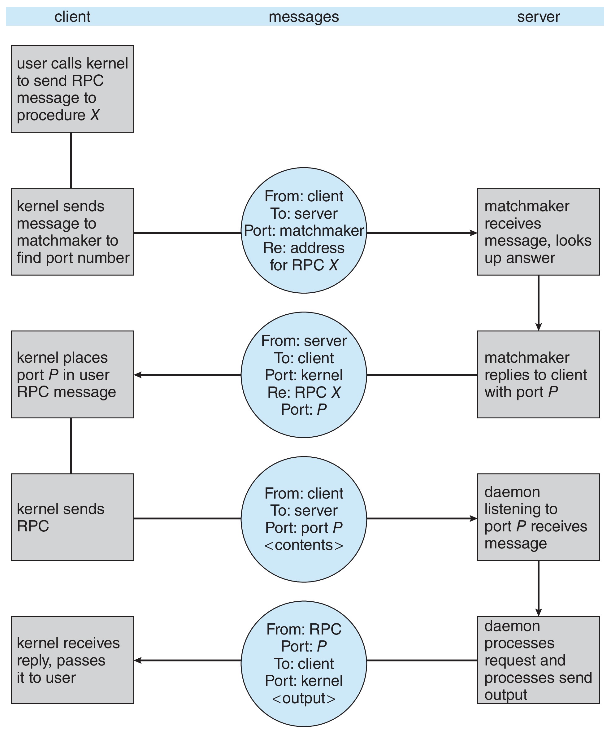

##### DCE RPC

[参考](https://en.wikipedia.org/wiki/Distributed_Computing_Environment)：Distributed Computing Environment ，OSF（开放软件基金会）下的一个软件系统框架（慢慢消亡）

**DCE**的构成：

- 远程过程调用 DCE/RPC；
- 命名/目录服务；
- 时间服务；
- 安全服务；
- 分布式文件系统 DCE/DFS；

目前 Linux 标配 RPC

## 进程调度

Process scheduler 从可用进程中选择下一个在 CPU 核心上执行的进程

目标——最大限度地利用 CPU，快速将进程切换到 CPU 核心

维护进程的**调度队列**

- 就绪队列 (ready queue)——驻留在主内存中、就绪并等待执行的所有进程的集合
- 等待队列 (wait queue)——等待事件（即 I/O）的一组进程
  - I/O wait queue
  - child termination wait queue
  - interrupt wait queue
- 进程在各种队列之间迁移
