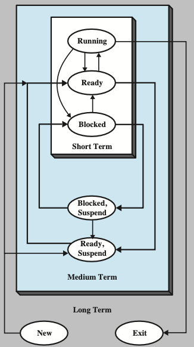
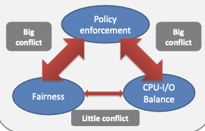

## 调度相关概念

为什么需要调度？

释放被阻塞、挂起的进程占用的 CPU 资源

实现 I/O 操作和 CPU 并行执行（ I/O 密集型和 CPU 密集型）

---

调度的层次、类型

- 处理器 / CPU 调度:star:（进程调度的主要内容）

  - 作业调度 / long-term scheduling / 长程调度 / 高级调度

    The decision to add to the pool of processes to be executed

  - 内存调度 / medium-term scheduling / 中程调度 / 中级调度

    The decision to add to the number of processes that are partially or fully in main memory

  - (狭义?) 进程调度 / short-term scheduling / 短程调度 / 初级调度

    The decision as to which available process will be executed by the processor

- 微调度 —— CPU 内部的指令调度（计组的内容了）
- I/O scheduling

  The decision as to which process's pending I/O request shall be handled by an available I/O device

### 三种层次进程调度

三种层次 CPU 进程调度频繁程度：长程 < 中程 < 短程

#### 长程调度

**控制了系统的并发度**

创建的进程越多，每个进程的执行时间的百分比越小，系统并发度越高；

长程调度程序可能会限制系统的并发度，为了给当前的进程提供满意的服务；

多道批处理系统中大多配有该层次进程调度，而其他系统中则通常没有；

每个进程只会被该层次调度 2 次 ：

- 调入 1 次
- 调出 1 次

::: warning
作业与进程不一定是一一对应的！也可能是一个作业对应多个进程！
#### 中程调度

中程调度是交换功能的一部分，

典型的情况下，换入（swapping-in）决定取决于管理系统并发度的需求。

存储管理是一个问题，换入决策将考虑换出进程的存储需求；

!!! abstract
    严格来讲，是进程在内存和系统盘交换区之间的交换

!!! info 
    关掉交换区 `swqpoff` ，进程就会被锁到内存里执行，可以大幅提高内存占用率高的程序效率

#### 短程调度

也称为分派程序（dispatcher），是最基本的调度，任何系统都需要配置这种调度

精确决定 CPU 下次执行哪一个进程；在 Ready、Running、Blocked 之间切换进程状态

导致当前进程**阻塞**或**抢占**当前运行进程的事件发生时，触发短程调度程序；

触发三种层次进程调度的事件：

| Process                            |                                                                                                                                          |
| ---------------------------------- | ---------------------------------------------------------------------------------------------------------------------------------------- |
| A new process is created.          | When `fork()` is invoked and returns successfully. Then, whether the parent or the child is scheduled is up to the scheduler's decision. |
| An existing process is terminated. | The CPU is freed. The scheduler should choose another process to run.                                                                    |
| A process waits for I/O            | The CPU is freed if the process is using CPU. The scheduler should choose another process to run.                                        |
| A process finishes waiting for I/O | The interrupt handling routine makes a scheduling request, if necessary.                                                                 |

## 调度算法的概念

### 分类

#### Offline

在提前知道所有进程所有事件的前提下。

只是用来评测的（做题就是这样的？），实际应用不可能实现。

#### Online

实际应用的算法都是这种类型

#### 非抢占式

Non-preemptive

在非抢占式调度下，一旦 CPU 分配给进程，进程将保持 CPU ，直到通过终止或切换到等待状态释放 CPU 为止。也就调度仅在以下情况发生：

- 从运行状态切换到等待状态（ I/O 请求或 `wait()` 调用）
- 终止

#### 抢占式

Preemptive

几乎所有现代操作系统，包括 Windows、MacOS、Linux 和 UNIX ，都使用抢占式调度算法。

CPU 调度决策可能在以下情况下发生：

- 从运行状态切换到等待状态（ I/O 请求或 `wait()` 调用）
- 从运行状态切换到就绪状态（出现中断）
- 从等待切换到就绪 （ I/O 完成）
- 终止

当数据在多个进程之间共享时，抢占式调度可能导致**竞争条件**：考虑两个共享数据的进程的情况，当一个进程更新数据时，它被抢占，以便第二个进程可以运行。然后，第二个进程可能读取处于不一致状态的数据。

抢占也影响操作系统内核的设计, 在上下文切换之前，等待系统调用的完成，或者等待 I/O 阻塞的发生。确保内核简单，但是难以应用于实时系统中。

### 评价标准与优化

评价标准也叫做调度准则，包括：

#### CPU 利用率

CPU utilization

$$
\text{CPU利用率}=\frac{\text{CPU有效工作时间}}{\text{CPU有效工作时间}+\text{CPU空闲等待时间}}
$$

#### 吞吐量

Throughput

$$
\text{吞吐量}=\frac{\text{单位时间}}{\text{CPU完成的作业数量}}
$$

#### 周转时间

Turnaround time

$$
\begin{aligned}
\text{一个作业的周转时间}&=\text{作业完成时间}-\text{作业提交时间}\\
n\text{个作业的平均周转时间}&=\frac{\text{作业1的周转时间}+\text{作业2的周转时间}+\cdots+\text{作业n的周转时间}}{n}\\
\text{一个作业的带权周转时间}&=\frac{\text{作业的周转时间}}{\text{作业实际运行时间}}\\
n\text{个作业的平均带权周转时间}&=\frac{\text{作业1的带权周转时间}+\text{作业2的带权周转时间}+\cdots+\text{作业n的带权周转时间}}{n}\\
\end{aligned}
$$

#### 等待时间

Waiting time

$$
\text{一个作业的等待时间}=\text{作业处于等待CPU的时间之和}
$$

#### 响应时间

Response time

$$
\text{一个作业的响应时间}=\text{系统首次产生响应的时间}-\text{用户提交请求的时间(作业提交时间?)}
$$

#### 响应比

$$
\text{一个作业的响应比}=\frac{\text{作业的周转时间}}{\text{作业的等待时间}}
$$

#### 优化原则

- 最大 CPU 利用率
- 最大吞吐量
- 最小周转时间
- 最小等待时间
- 最小响应时间

大多数情况下，优化的是平均值；有些情况下优化的是最小值或最大值，也可以最小化方差；

## 基本调度算法

| Algorithms                                                      | Preemptive?  | Target System   |
| --------------------------------------------------------------- | ------------ | --------------- |
| First-come, first-served or First-in, First-out ( FCFS / FIFO ) | No.          | Out-of-date     |
| Shortest-job-first (SJF)                                        | Can be both. | Out-of-date     |
| Round-robin (RR)                                                | Yes.         | Modern          |
| Priority scheduling                                             | Yes.         | Modern          |
| Priority scheduling with multiple queues.                       | The real     | implementation! |

### FCFS/FIFO

先来先服务调度。先请求 CPU 的进程首先分配到 CPU ，通过 FIFO 队列**容易实现**。

各个评价指标受进程到达就绪队列的时间顺序影响大，也就是**对输入敏感**。

#### 护航效应

FCFS / FIFO 算法容易引发护航效应，也就是很多后来的短作业被先来的长作业阻塞，导致平均等待时时间、平均周转时间长

### 非抢占 SJF

最短作业优先调度的非抢占式版本

### 抢占 SJF

:warning:需要限制发生抢占的条件！在这里只允许有一个新进程到来的时候（被用户提交）才发生抢占

优点：

- 平均等待时间降低
- 平均周转时间降低

代价是增加了上下文切换的成本

可以证明 **SJF** 调度算法是最优的，因为 **SJF** 的平均等待时间最小；但是这个算法需要**预先知道所有进程剩余 CPU 执行时间，这在实际应用中世不可能的**！

### RR

Round Robin

RR 专门为分时系统设计，类似 FCFS 但是增加了抢占以切换进程。

RR 是**抢占式**调度的；（preemptive）

每个进程给定一个较小的时间单位成为时间片，时间片用完后，

CPU 选择另外一个进程调度执行；

CPU 调度程序循环整个就绪队列，一个一个执行；

每个进程获得一个小的 CPU 时间单位（时间量和时间片），通常为 10-100 毫秒。此时间过后，进程将被抢占并添加到就绪队列的末尾。

如果就绪队列中有 $n$ 个进程，且时间片为 $q$ ，则每个进程一次最多以 $q$ 个时间单位的块获取 $\frac{1}{n}$ 的 CPU 时间。没有进程等待超过 $n-1$ 个时间单位。

计时器中断每个时间片以安排下一个进程

#### 时间片

quantum——时间片（量子化思想？）

- 时间片 $q$ 如果非常大， 退化为先进先出（FCFS），性能降低；
- 时间片 $q$ 如果非常小，导致大量的上下文切换，性能降低；
  - 所以相对于上下文切换，$q$ 必须很大，否则开销太高

现代操作系统往往提供了设置时间片大小的接口

:warning:：时间片的大小和平均周转时间等指标没有规律性的关系，实际时间片的大小设置往往是依据实验经验的

#### 性能

相比 SJF ，RR 的平均等待时间、平均周转时间都更差！但是**响应性**得到了提升！这就是 RR 的最大优势！

## 优先级调度

### 实时系统

对于实时调度，调度器必须支持抢占式、基于优先级的调度，但只能保证软实时性；

对于硬实时系统，还必须提供满足截止期限的能力，需要添加新的调度特征;

进程新的特点：周期性进程需要以固定的时间间隔使用 CPU

具有处理时间 $T$、截止日期 $D$、周期 $P$：$0≤ T≤ D≤ P$；

定期任务的速率为 $\frac{1}{p}$；

### 基本优先级调度

优先级编号（整数）与每个进程相关联；CPU 分配给具有最高优先级（一般默认最小整数，除非题目额外说明）的进程（最高优先级）

定义优先级

- 内部定义
- 外部定义

:warning:误区：基于优先级的调度算法并非都是抢占式的：

- 可以是抢占式的
- 也可以是非抢占式

SJF 也是优先级调度，其中优先级是预测的下一个 CPU 执行时间的倒数；

问题：饥饿——低优先级进程可能永远不会执行；

解决方案：老化(aging)——随着时间的推移，进程的优先级会增加；

### 多级队列调度

仍然是优先级调度，也就是“多(优先)级队列调度”；

就绪作业队列分成多个单独的队列，每个队列具有不同的调度算法；

例如分成前台进程（RR）和后台进程（FCFS）；

eg：

| Priority         | Scheduling algorithm        |
| ---------------- | --------------------------- |
| Priority class 5 | Non-preemptive, FIFO        |
| Priority class 4 | Non-preemptive, SJF         |
| Priority class 3 | RR with quantum = 10 units. |
| Priority class 2 | RR with quantum = 20 units. |
| Priority class 1 | RR with quantum = 40 units. |

不同的队列之间应用调度，通常采用固定优先级抢占调度，如前台队列可以比后台队列具有绝对的优先，只要前台队列非空，后台队列的进程就无法被调度；

### 多级反馈调度队列

为了解决多级反馈调度队列中固定化优先级导致的饥饿问题，在调度程序运行时不断调整进程的优先级

通常，多级反馈队列调度程序可由以下参数定义：

- 队列数量；
- 每个队列的调度算法；
- 用于确定何时**升级**到高优先级队列的方法；
- 用于确定何时**降级**到更低优先级队列的方法；
- 用于确定当某个进程需要服务时该进程将进入哪个队列的方法；

成为**最通用**的调度算法，通过配置适应特定的系统，也是最复杂的调度方法；

老化可以使用多级反馈队列来实现；

### 单调速率调度

单调速率调度算法采用抢占的、静态优先级的策略，调度周期性任务；

每个周期性任务分配一个优先；

优先级是根据其周期的倒数来分配的;

- 周期越短 => 优先级越高；
- 周期越长 => 优先级越低；

P1 (周期为 50,处理时间为 20)的优先级高于 P2（周期为 100，处理时间为 35）；截止时间为下一个周期开始的时间

单调速率调度可认为是**最优**的，因为如果一组进程不能由此算法调度，它不能由任何其他分配静态优先级的算法调度

#### 错过截止时间

单调速率调度有一个限制——CPU 利用率是有限的，并不能完全最大化 CPU 资源利用率，调度 N 个进程的最坏情况下的 CPU 利用率为：

$$
n(2^{\frac{1}{n}}-1)
$$

### 最早截止期限有限调度(EDF)

调度根据截止期限动态分配优先级；截止期限越早，优先级越高；截止期限越晚，优先级越低；

单调速率调度的优先级是固定的，而 EDF 是动态的；

此外，EDF 调度不要求进程是周期执行的，也不要求进程的 CPU 时间是固定的，唯一的要求是：进程在变成可运行时，应给出它的截止时间。

理论上，最佳情况下 CPU 利用率会到 100%。

### 优先级翻转现象

低优先的进程占有了高优先级进程需要的资源，特别是一些共享资源，导致高优先级进程被阻塞，这种现象就叫**优先级翻转**。

- **有界**优先级翻转，发生优先级翻转，没有外界干预的情况下也能自己恢复
- **无界**优先级翻转，一旦发生优先级翻转，没有外界干预的情况下将无法恢复，高优先级永远被阻塞

#### 优先级继承

## 选择函数

选择函数决定选择哪个就绪进程下次执行；

这个函数可以根据优先级、资源需求或进程的执行特性来进行选择；

对于执行特性，可以根据以下三个重要的参数：

- w (wait) = 目前为止在系统中的等待时间；
- e (exec) =目前为止花费的执行时间；
- s (serv) = 进程所需要的总服务时间，包括 e；这个参数通常须进行估计或由用户提供；

|                     | FCFS                                                                            | Round robin                                     | SPN                                             | SRT                         | HRRN                        | Feedback                      |
| ------------------- | ------------------------------------------------------------------------------- | ----------------------------------------------- | ----------------------------------------------- | --------------------------- | --------------------------- | ----------------------------- |
| Selection function  | $\max[w]$                                                                       | constant                                        | $\min[s]$                                       | $\min[s-e]$                 | $\max \frac{w+s}{s}$        | (see text)                    |
| Decision mode       | Non-preemptive                                                                  | Preemptive (at time quantum)                    | Non-preemptive                                  | Preemptive (at arrival)     | Non-preemptive              | Preemptive (at time quantum)  |
| ThroughPut          | Not emphasized                                                                  | May be low if guantum is too small              | High                                            | High                        | High                        | Not emphasized                |
| Response time       | May be high, especially if there is a large variance in process execution times | Provides good response time for short processes | Provides good response time for short processes | Provides good response time | Provides good response time | Not emphasized                |
| Overhead            | Minimum                                                                         | Minimum                                         | Can be high                                     | Can be high                 | Can be high                 | Can be high                   |
| Effect on processes | Penalizes short processes; penalizes I/0 bound processes                        | Fair treatment                                  | Penalizes long processes                        | Penalizes long processes    | Good balance                | May favor I/0 bound processes |
| Starvation          | No                                                                              | No                                              | Possible                                        | Possible                    | No                          | Possible                      |

$$
\frac{T_r}{T_s}=\frac{w+s}{s}=\frac{1}{1-\rho}
$$

$\rho$ 是处理器利用率（processor utilization）

## 公平调度算法

### 传统的 Unix 调度

调度形式化：

$$
\begin{aligned}
CPU_j(i)&=\frac{CPU_j(i-1)}{2}\\
P_j(i)&=Base_j+\frac{CPU_j(i)}{2}+nice_j
\end{aligned}
$$

`chrt -m` 可以用于在 Linux OS 中查看调度相关的信息

`chrt -f -p   [priority-level]   [pid]` 修改进程的调度策略以及优先级

### 比例分享调度

调度程序在所有进程之间分配 $T$ 股（通证）；

应用程序接收 $N$ 股，其中 $N<T$；

这确保每个应用程序将收到总处理器时间的 $\frac{N}{T}$；

采用准入控制策略，以确保每个进程能够得到分配时间。

准入控制策略是：只有客户请求的股数小于可用的股数，才能允许客户进入。

现代很多网络、磁盘共享等需要**共享**的情况下往往采用这种调度方式，这是一种比较**公平**的调度算法

## 线程调度

- PCS —— Process Contention Scope ，进程级争用范围、作用域，调度竞争在进程内
  - 通常情况下，PCS 采用优先级调度
- SCS —— System Contention Scope ，系统级争用范围、作用域，调度到可用 CPU 上的内核线程，系统中所有线程之间的竞争
  - 对于一对一模型的系统，如 Windows、Linux、Solaris 等只采用 SCS 调度

## 多处理器调度

前面讲述的内容都是单处理器系统的调度问题，如果有多个处理器，负载分配成为可能，但是调度问题更加复杂

主要关注**同构处理器**：(SMP)

- 非对称多处理器，太复杂，不关注
- 对称多处理器（SMP）

对称多处理（SMP）是指每个处理器都是自调度的。

- 所有线程都可能位于**公共就绪队列**（a）中
- 每个处理器可能有自己的**线程专用队列**（b）

多线程多核处理器需要两个级别的调度：

- 一个级别由操作系统调度；
- 另一个级别是指定每个核心如何运行哪个硬件线程

## Linux

### CFS

完全公平调度，内核在 2.6 以后采用

Linux 系统的调度基于调度类；

每个调度类都有特定的优先权；

调度程序在最高调度类中选择优先级最高的任务；

而不是基于固定时间分配的时间片，基于 CPU 时间的比例；

包括两个调度类，可以添加其他调度类；

- 采用 CFS 调度算法的默认调度类；
- 实时

### 调度优先级

## 调度算法评估

### 排队模型

描述进程的到达，以及 CPU 和 I/O 执行的概率

通常是指数型的，用平均值来描述

计算平均吞吐量、利用率、等待时间等。

描述为服务器网络的计算机系统，每个服务器都有等待进程队列

了解到达率和服务率

计算利用率、平均队列长度、平均等待时间等

#### Little's Law

### CPU 调度仿真

排队模型能力有限

更精确的模拟

计算机系统的程序模型

时钟是一个变量

收集指示算法性能的统计信息

用于驱动通过以下方式收集的模拟的数据：

基于概率的随机数发生器

数学上或经验上定义的分布

跟踪磁带记录真实系统中真实事件的序列
