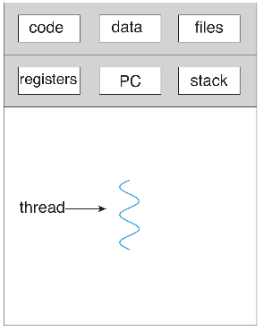
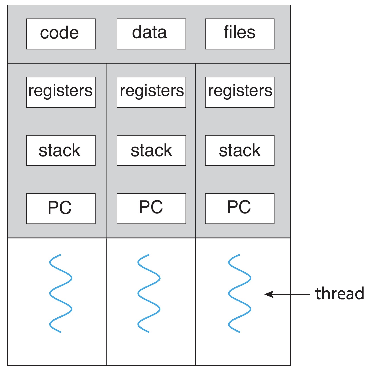
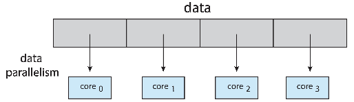
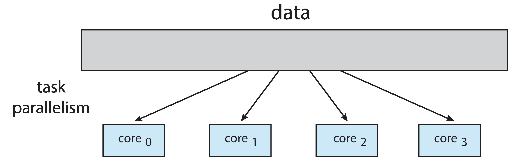
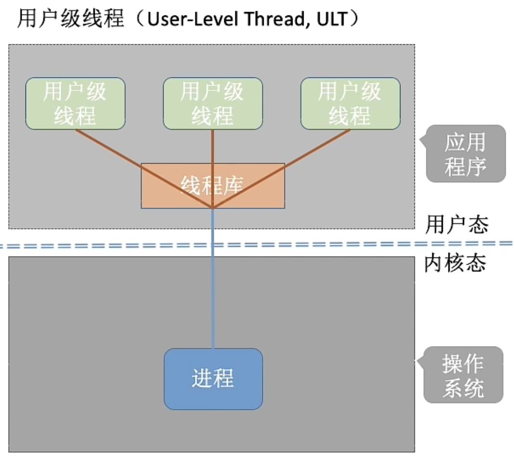
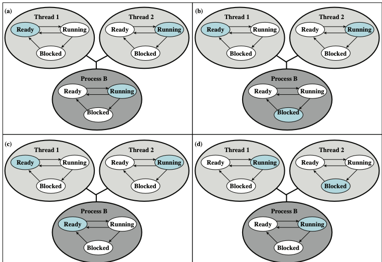
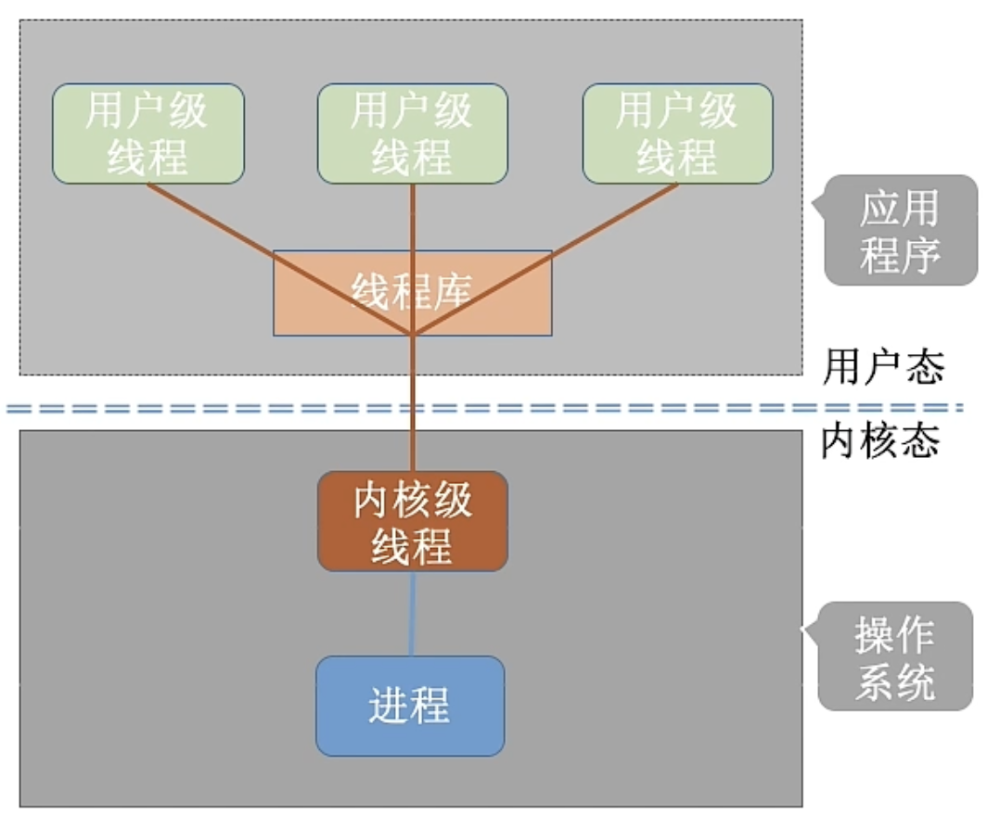
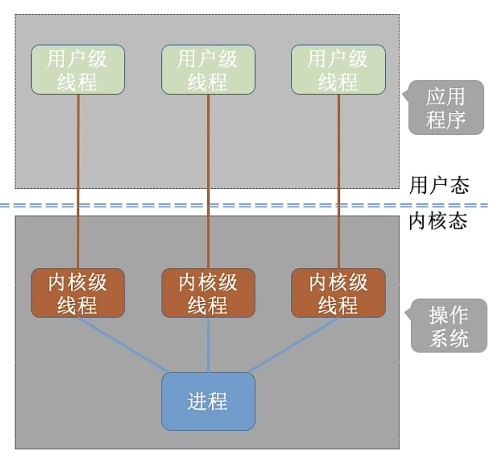
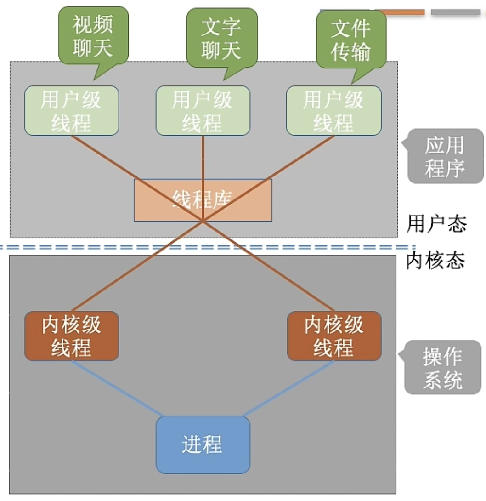

## 线程的基本概念

### 为什么需要线程

有的进程可能需要“同时”做很多事，而传统的进程只能串行地执行一系列程序。为此，引入了“线程”，来增加并发度。

大多数现代应用程序都是多线程的，线程在应用程序中运行，应用程序的多个任务可以由单独的线程实现

如 Web 浏览器：

- 更新显示
- 获取数据
- 拼写检查
- 响应网络请求

进程创建很**重载**，而线程创建很**轻量**;

可以简化代码，提高效率;

内核(作为内核程序进程) 通常是多线程的，多个线程在内核中运行，每个线程执行一个特定的任务;

现代服务器——多线程服务器，可以同时处理多个并发请求

### 线程进程对比

系统资源分配与处理器调度

引入线程后，**进程**只作为**除 CPU 之外的系统资源 的 基本分配单元**(最小单位)（如打印机、内存地址空间等都是分配给进程的）；**CPU 的 分配单元** 则是**线程**

---

并发性

引入线程之后，不仅是进程之间可以并发，进程内的各线程之间也可以并发，从而进一步提升了系统的并发度，使得一个进程内也可以并发处理各种任务。

---

系统开销

- 传统的进程间并发，需要切换进程的运行环境，系统开销很大
- 线程间并发，如果是同一进程内的线程切换，则不需要切换进程环境，系统开销小

---

独立性

某个进程中的线程对其他进程是不可见的

每个进程都拥有独立的地址空间和资源，除了共享全局变量不允许其他进程访问

---

支持多处理器系统

- 传统单线程进程不管系统有多少 CPU ，进程只能运行在一个 CPU 上
- 对于多线程进程，进程多个线程可以分配到多个 CPU 上执行

### 线程的组成

线程也有叫做轻量级进程（LWP），线程只包含运行时的状态

- （用户空间）静态部分由进程提供，与其他线程共享：
  - 代码段 text
  - 数据段 data
  - 堆 heap
  - 其他操作系统资源
- （内核空间）TCB——包括了执行所需的最小状态(主要是寄存器和栈);
  - TID
  - 程序计数器 PC
  - 寄存器
  - 栈 stack（的指针）（每个线程拥有自己的栈，内核中也有为线程准备的内核栈）
  - 指向父进程/线程的指针
  - 指向子进程/线程的指针

一个进程可以包含多个线程

- 每个线程共享同一地址空间(方便数据共享和交互);
- 允许进程内并行;

### 单线程

早期操作系统多为单线程进程的结构，实际上也没有形成线程的概念。例如 MS-DOS

### 多线程

多线程是指操作系统在单个进程内支持多个并发执行路径的能力。

多线程的优点：

- 响应性——如果部分线程被阻塞，仍可以继续执行，这对于 用户界面设计尤其重要，快速响应;
- 资源共享——线程共享进程资源，比进程共享内存或消息传 递更容易，允许一个应用程序在同一地址空间内有多个不 同的活跃线程;
- 经济——比进程创建更便宜，线程切换比上下文切换开销更 低。进程创建是线程创建的几十倍，进程切换比线程切换 慢 5 倍;
- 可扩展性(可伸缩性)——线程可以利用多核体系结构;

## 多核并行

单核下只能并发执行的任务，现在可以通过多核（多线程）并行执行

### 两类并行

- **数据**并行性——将相同数据的子集分布在多个核上，每个核上的操作相同;

  

- **任务**并行性——将任务而不是数据分配到多个计算核心， 每个线程执行唯一的操作，不同线程可以操作相同的数据，也可以操作不同的数据;

  

!!! info 
    OpenAI 采用的就是数据并行、任务并行混合使用

### Amdahl 定律

N 条并行，串行占比 S :

$$
speedup\leq\frac{1}{S+\frac{(1-S)}{N}+\cdots}
$$

定律是否考虑了当代多核系统?——分母部分会增加“通信项”，代表核间通信的开销

## TCB

Linux 中进程与线程使用的是同一种数据结构 `task_struct` ，大多数操作系统也都是线程进程共享这样的数据结构

## 线程的实现方式

“用户级线程” 就是 “从用户视角看能看到的线程”，早期操作系统只有用户级线程

“内核级线程” 就是 “从操作系统内核视角看能看到的线程” ，现代操作系统支持内核级线程

### 用户级线程

User-Level Thread，ULT

1. 用户级线程由应用程序通过**线程库**（例如 pthreads ）实现，所有的线程管理工作都由应用程序负责（包括线程切换）
2. 用户级线程中，**线程切换**可以在**用户态**下即可完成，无需操作系统干预。
3. 在用户看来，是有多个线程。但是从内核、操作系统的角度来看，并意识不到线程的存在。

线程**不存在挂起态**，因为线程不拥有资源！进程才拥有资源，才有“挂起态”。

三状态线程模型：

优缺点

- 优点：

  - 用户级线程的切换在用户空间即可完成，不需要切换到核心态，线程管理的系统**开销小**，**效率高**
  - 可以由用户程序自己的调度算法来调度线程
  - **跨平台**，在任何操作系统都可以运行，可迁移性强

- 缺点：

  - 当一个用户级线程被阻塞后，整个进程都会被阻塞，**并发度不高**。多个线程不可在多核处理机上并行运行。

    - 没有内核线程在阻塞时提供并行能力
    - 解决方案：
      - 套管（Jacketing）把一个产生阻塞的系统调用转化为一个非阻塞的系统调用；
      - 把应用程序写成一个多进程程序而非多线程程序，每次切换都变成进程间的切换而非线程间切换，例如 Python

  - 在纯 ULT 策略中，多线程应用程序不能利用多处理技术。内核一次只把一个进程分配给一个处理器，因此一个进程中只有一个线程可以执行。

### 内核级线程

Kernel-Level Thread, KLT，又称“内核支持的线程”

1. 内核级**线程管理**工作由**操作系统内核**完成。
2. 线程调度、切换等工作都由内核负责，因此内核级线程的切换必然需要在核心态下才能完成。
3. 操作系统会为每个内核级线程建立相应的 TCB (Thread Control Block, 线程控制块），通过 TCB 对线程进行管理。
4. 应用级没有线程管理代码，只有一个内核线程设施的应用编程接口（API），例如 Windows

优缺点

- 优点：

  - 内核可以同时把同一个进程中的多个线程调度到多个处理器；
  - 当一个线程被阻塞后，别的线程还可以继续执行，**并发能力强**。多线程可在多核处理机上并行执行。
  - 内核线程自身也可以是多线程

- 缺点：
  - 一个用户进程会占用多个内核级线程，线程切换由操作系统内核完成，需要切换到核心态，因此线程管理能**成本高**，**开销大**。

## 多线程模型

在支持内核级线程的系统中，根据用户级线程和内核级线程的映射关系，可以划分为几种多线程模型

### 多对一模型

!!! abstract
    个人理解就是只支持用户级线程，而不支持内核级线程的情况，早期操作系统的类型

多个用户级线程映射到一个内核级线程。且一个进程只被分配一个内核级线程。

例如 UNIX

- 优点：
  - 用户级线程的切换在用户空间即可完成，不需要切换到核心态，线程管理的系统开销小，效率高
- 缺点：
  - 当一个用户级线程被阻塞后，整个进程都会被阻塞
  - 并发度不高。多个线程不可在多核处理机上并行运行

!!! warning
    操作系统只“看得见”内核级线程，因此只有内核级线程才是处理机分配的单位。

### 一对一模型

一个用户级线程映射到一个内核级线程。每个用户进程有与用户级线程同数量的内核级线程。

例如 Linux 、Windows

- 优点：
  - 当一个线程被阻塞后，别的线程还可以继续执行
  - 并发能力强。多线程可在多核处理机上并行执行
- 缺点：
  - 一个用户进程会占用多个内核级线程， 线程切换由操作系统内核完成，需要切换到核心态，开销大
  - 由于内核存储空间的限制，无法创建太多的线程
  - 每创建一个用户线程就要创建一个内核线程，一个用户进程可能占用很多内核线程，开销大

### 多对多模型

ULT 和 KLT 混合的模式，例如 Solaris 。实际上非常复杂，目前没有操作系统能够很好地实现这种模型

多对多模型：n 用户及线程映射到 m 个内核级线程（$n\geq m$）。每个用户进程对应 m 个内核级线程。

- 克服了多对一模型并发度不高的缺点（一个阻塞全体阻塞）
- 克服了一对一模型中一个用户进程占用太多内核级线程，开销太大的缺点

!!! abstract
    可以这么理解：

- 用户级线程是“代码逻辑”的载体
- 内核级线程是“运行机会”的载体

内核级线程中可以运行任意一个有映射关系的用户级线程代码，**一个进程只有所有与其有映射关系的内核级线程中正在运行的代码逻辑都阻塞时，这个进程才会阻塞**！

- 优点：
  - 可以创建很多线程
  - 并发度高
- 缺点：
  - 复杂、难以管理、难实现

### 一对多模型？

一个线程对应多个进程

执行过程中发生状态的迁移，就需要将线程从一个进程迁移到另一个进程

例如银行系统，一个请求会多个有一模一样的进程处理，如果其中一个出现了错误，就会将其他正确的进程迁移过去

## 现代多线程

- 异步线程 Asynchronous threading

  父线程创建子线程后继续运行，父子线程并发、独立运行。

- 同步线程 Synchronous threading

  父线程创建子线程后等待子线程结束后再继续运行，采用 Fork-join strategy ，类似于 Linux 进程中的 fork+wait+exit 。

### 线程库

线程库程序员提供了创建和管理线程的 API；

两种主要的实施方式：

- 第一种方式：在用户空间中提供一个没有内核支持的库；
- 第二种方法：实现操作系统支持的内核级库；

三种主要的线程库：

- POSIX Pthreads（用户层次或者内核层次）；

  - `#include<pthread>`

- Windows API（内核层次）；

  - 特色：`WaitForSingleObject(...)` / `WaitForMultipleObject(...)`
  - 支持线程池

- Java（利用 Windows API 或者 pthreads 来实现）；

  - 由 JVM 管理，通常使用底层操作系统提供的线程模型实现
  - Java 线程可以通过以下方式创建：

    - 扩展线程类
    - 实现可运行接口
    - 标准实践是实现可运行接口

  - 允许围绕 Executor 接口创建线程，典型的线程池
    - `static ExecutorService newSingleThreadExecutor()`
    - `static ExecutorService newFixedThreadPool (int size)`
    - `static ExecutorService newCachedThreadPool()`

#### Linux 线程

Linux 将它们称为任务（task）而不是线程

线程创建是通过 `clone()` 系统调用完成的（Linux 上用 pthread 库的创建线程也是使用这个系统调用）

`clone()` 允许子任务共享父任务(进程)的地址空间

标记控件行为...

结构 `task_struct` 指向流程数据结构 (共享或唯一)

### 隐式多线程

随着线程数量的增加，程序员来控制多线程程序变得越来越困难，于是诞生了由编译器和运行时库而不是程序员创建和管理线程的**隐式多线程**

探索了五种方法

- 线程池
- Fork-Join

  - 适用于超算、高性能计算场景，利用嵌套创建子线程可以短时间创建数百万子线程

- OpenMP

  - 让编译器实现程序的多线程并行化
  - 指令指定代码编译为多线程并行程序
    - `#pragma omp parallel {...}`
    - `#pragma omp for ...`

- 中央大调度 (GCD) (eg: Apple...)

  - 目标是自动识别程序的并行部分并实现并行化
  - C、C++ 和 Obj-C 语言、API 和运行库的扩展

- 英特尔线程构件(TBB)
  - 设计并行 C++ 程序的模板库
  - `parallel_for` ： `for` 的并行化版本

## 多线程引入的问题

- `fork()` 和 `exec()` 系统调用的语义
  - `fork()` 是只复制调用线程，还是复制该进程的所有线程？
    - 有些 UNIX 有 2 种 `fork` 版本
  - `exec()` 通常正常工作，**替换**正在运行的进程，包括所有线程

!!! abstract
    UNIX 中的信号——用于通知进程某个特定事件已发生。

信号处理器用于处理信号

1. 信号由特定事件产生

2. 信号被传送到进程

3. 信号由两个信号处理程序之一处理:

   - 缺省的信号处理程序
   - 用户定义

每个信号都有内核在处理信号时运行的默认处理程序

- 用户定义的信号处理程序可以覆盖默认值
- 对于单线程，信号传输到进程

- 信号处理
  - 同步 / 异步
  - 多线程的信号应该在哪里传递?
    - 将信号传递到应用该信号的线程（一对一）
    - 将信号传递给进程中的每个线程（一对多）
    - 将信号传递给进程中的某些线程（一对一）
    - 指定一个特定线程来接收进程的所有信号（多对一）
- 线程取消（要终止的线程一般叫做目标线程）
  - 异步——立即终止目标线程
  - 延迟——允许目标线程定期——也就是执行到代码中的“取消点”的时候——检查是否应该取消，缺省情况下都是这种情况
  - Linux 由信号处理，而且应该是一对一的
  - Java 用 `interrupt` 方法
- 线程本地存储

  - 线程本地存储 (TLS) 允许每个线程拥有自己的数据副本，有这些好处：

    - 当无法控制线程创建过程时 (即，当使用线程池时)，此功能非常有用
    - 可以避免不同线程之间访问同一互斥变量带来的性能损失

  - 与局部变量不同

    - 局部变量仅在单个函数调用期间可见
    - TLS 在函数调用中可见

  - 类似于静态数据
    - TLS 对于每个线程都是唯一的

- 调度程序激活

  - 多对多模型和一对一模型都需要通信来维护分配给应用程序的适当数量的内核线程
  - 通常在用户线程和内核线程之间使用中间数据结构——轻量级进程(LWP, Light Weight Process)

    - 似乎是一个虚拟处理器，进程可以 在该处理器上调度用户线程运行
    - 每个 LWP 都连接到内核线程
    - 要创建多少 LWP?

  - 调度器激活提供了 upcall ——一种从内核到线程库中 upcall 处理程序的通信机制
  - 这种通信允许应用程序保持正确的内核线程数
