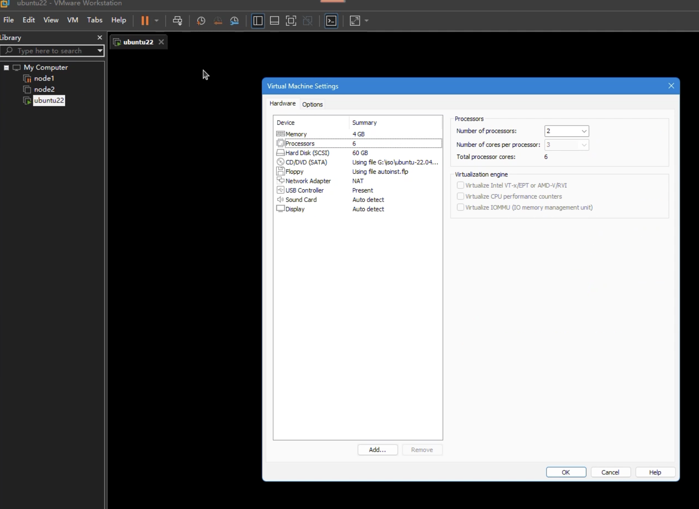
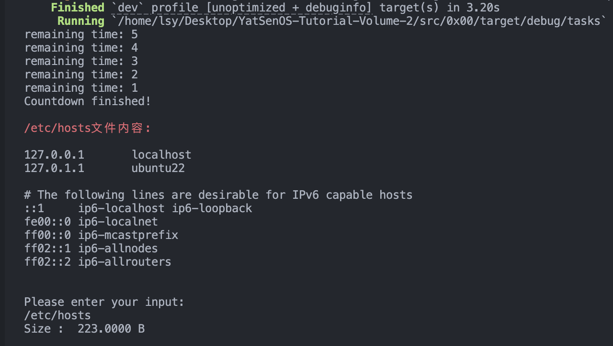
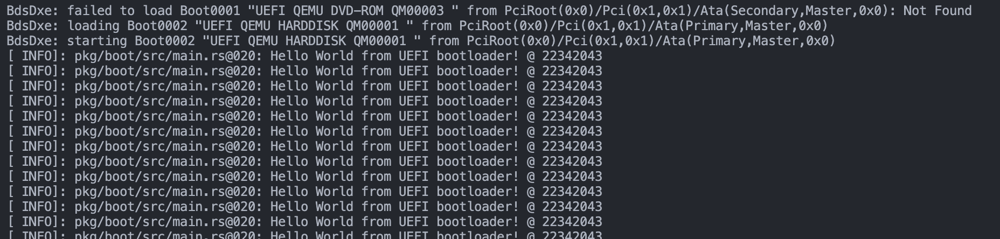
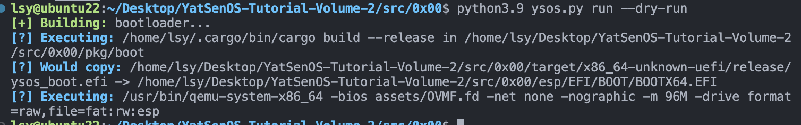

## 配置实验环境

我的实验环境：Ubuntu 22.04 LTS (jammy)

在 Windows 上使用 VMware Work Station 作为 VMM，具体配置见下图：



### 安装项目开发环境

在 Linux 平台上通过 VSCode (Remote) + Python / make + GDB 结合 gef 进行开发、调试。

## 尝试使用 Rust 进行编程

### 使用 Rust 编写一个程序，完成以下任务：

#### 创建一个函数 `count_down(seconds: u64)`

该函数接收一个 u64 类型的参数，表示倒计时的秒数。

函数应该每秒输出剩余的秒数，直到倒计时结束，然后输出 `Countdown finished!`。

```rust
fn count_down(mut seconds: u64){
    while seconds>0 {
        println!("remaining time: {}",seconds);
        thread::sleep(Duration::from_secs(1));
        seconds = seconds-1;
    }
    println!("Countdown finished!");
}
```

#### 创建一个函数 `read_and_print(file_path: &str)`

该函数接收一个字符串参数，表示文件的路径。

函数应该尝试读取并输出文件的内容。如果文件不存在，函数应该使用 `expect` 方法主动 panic，并输出 `File not found!`。

!!! tip "尝试使用 `io::Result<()>` 作为返回值，并使用 `?` 将错误向上传递。"

```rust
fn read_and_print(file_path: &str) -> io::Result<()> {
    let mut s = String::new();
    let mut f = File::open(file_path).expect("File not found!\n");
    f.read_to_string(&mut s)?;
    println!("{}",s);
    Ok(())
}
```

#### 创建一个函数 `file_size(file_path: &str) -> Result<u64, &str>`

该函数接收一个字符串参数，表示文件的路径，并返回一个 `Result`。

函数应该尝试打开文件，并在 `Result` 中返回文件大小。如果文件不存在，函数应该返回一个包含 `File not found!` 字符串的 Err。

!!! tip "尝试将 `std::io::Result` 转换为 `std::Result`，你可能需要 `map_err` 等函数。"

```rust
fn file_size(file_path: &str) -> Result<u64, &str>{
    match fs::metadata(file_path.trim()) {
        Ok(m) => Ok(m.len()),
        Err(_) => Err("File not found!").map_err(|e| {e.into()}),
    }
}
```

#### 在 `main` 函数中，按照如下顺序调用上述函数：

- 首先调用 `count_down(5)` 函数进行倒计时
- 然后调用 `read_and_print("/etc/hosts")` 函数尝试读取并输出文件内容
- 最后使用 `std::io` 获取几个用户输入的路径，并调用 `file_size` 函数尝试获取文件大小，并处理可能的错误。

代码：

```rust
//首先调用 count_down(5) 函数进行倒计时
count_down(5);

//调用 read_and_print("/etc/hosts") 函数尝试读取并输出文件内容
println!("\n{}\n", "/etc/hosts文件内容:".red());
read_and_print("/etc/hosts").expect("Reading file error! Can't convert the content of the file into String!\n");

//使用 std::io 获取几个用户输入的路径，并调用 file_size 函数尝试获取文件大小，并处理可能的错误。
println!("\nPlease enter your input:");
let mut input = String::new();
io::stdin().read_line(&mut input).expect("Failed to read line\n");
match file_size(&input){
    Ok(size) => {
				let (num, unit) = humanized_size(size);
        println!("Size :  {:.4} {}", num, unit)
    }
    Err(msg) => println!("{}",msg),
}
```

运行结果：



### 几个函数和结构体、枚举类型方法测试

#### 实现一个进行字节数转换的函数，并格式化输出：

实现函数 `humanized_size(size: u64) -> (f64, &'static str)` 将字节数转换为人类可读的大小和单位

代码：

```rust
fn humanized_size(size: u64) -> (f64, &'static str){
    let unit: [&str; 4] = ["B", "KiB", "MiB", "GiB"];
    let mut index = 0;
    let mut num = size as f64;
    while num >= 1024 as f64 && index <= 3 {
        num /= 1024 as f64;
        index += 1;
    }
    (num , unit[index])
}
```

#### 自行搜索学习如何利用现有的 crate\*\* 在终端中输出彩色的文字

输出一些带有颜色的字符串，并尝试直接使用 `print!` 宏输出一到两个相同的效果。

尝试输出如下格式和内容：

- `INFO: Hello, world!`，其中 `INFO:` 为绿色，后续内容为白色
- `WARNING: I'm a teapot!`，颜色为黄色，加粗，并为 `WARNING` 添加下划线
- `ERROR: KERNEL PANIC!!!`，颜色为红色，加粗，并尝试让这一行在控制行窗口居中
- 一些你想尝试的其他效果和内容......

```rust
println!("{} {}", "INFO:".green(), "Hello, world!".white());
println!("{}{}", "WARNING".yellow().bold().underline(), ": I'm a teapot!".yellow().bold());
let w = if let Some((Width(w), _)) = terminal_size() {w} else {0};
let padding = cmp::max((w as usize - "ERROR: KERNEL PANIC!!!".chars().count()) / 2, 0);
println!("{}{}", format!("{0: >1$}", "", padding), "ERROR: KERNEL PANIC!!!".red().bold());
```

#### 使用 `enum` 对类型实现同一化

实现一个名为 `Shape` 的枚举，并为它实现 `pub fn area(&self) -> f64` 方法，用于计算不同形状的面积。

- 你可能需要使用模式匹配来达到相应的功能

- 请实现 `Rectangle` 和 `Circle` 两种 `Shape`，并使得 `area` 函数能够正确计算它们的面积

```rust
enum Shape {
    Rectangle{
        width: f64,
        height: f64,
    },
    Circle{
        radius: f64,
    }
}

impl Shape {
    pub fn area(&self) -> f64{
        match self {
            Shape::Rectangle { width, height } => width * height,
            Shape::Circle { radius } => PI * radius * radius,
        }
    }
}
```

#### 实现一个元组结构体 `UniqueId(u16)`

使得每次调用 `UniqueId::new()` 时总会得到一个新的不重复的 `UniqueId`。

- 你可以在函数体中定义 `static` 变量来存储一些全局状态
- 你可以尝试使用 `std::sync::atomic::AtomicU16` 来确保多线程下的正确性（无需进行验证，相关原理将在 Lab 5 介绍，此处不做要求）

```rust
pub struct UniqueId1(u16);

impl UniqueId1 {
    pub fn new() -> u16{
        //多线程下不安全的实现
        static mut PIDS :u16 = 0;
        unsafe{
            PIDS = PIDS + 1;
            PIDS
        }
    }
}

lazy_static! {
    static ref PIDS: Mutex<AtomicU16> = Mutex::new(AtomicU16::new(0));
}

pub struct UniqueId2(u16);

impl UniqueId2 {
    pub fn new() -> u16{
        //多线程下更安全的实现
        let pids = PIDS.lock().unwrap();
        let current_pid = pids.fetch_add(1, Ordering::SeqCst);
        current_pid
    }
}
```

#### 测试结果


### 运行 UEFI Shell

#### 初始化你的仓库

校验文件是否完整：


#### 使用 QEMU 启动 UEFI Shell

看到如下输出：


### YSOS 启动！

#### 运行第一个 UEFI 程序



## 思考题

### 操作系统的启动过程

- 现代操作系统（如 Windows）的启动过程通常包括以下几个关键步骤：
  1. 加电自检（Power-On Self-Test，POST）：当计算机加电时，计算机的固件（例如 BIOS 或 UEFI）会执行自检程序，以确保硬件设备的正常工作。自检过程包括检查内存、处理器、硬盘驱动器和其他连接的设备。
  2. 启动固件：自检完成后，固件会查找并加载操作系统启动程序。在传统的 BIOS 系统中，这个启动程序通常位于硬盘驱动器的主引导记录（Master Boot Record，MBR）中。在 UEFI 系统中，启动程序位于 EFI 系统分区中的特定路径下。
  3. 启动加载程序（Boot Loader）：启动程序的主要任务是加载操作系统的启动加载程序，例如 Windows 的引导管理器（Boot Manager）。引导管理器会提供一个菜单，列出可用的操作系统选项。用户可以选择要启动的操作系统。
  4. 操作系统内核加载：一旦用户选择了要启动的操作系统，引导管理器将加载操作系统的内核文件。对于 Windows 来说，内核文件是 ntoskrnl.exe。
  5. 初始化：加载内核后，操作系统开始初始化过程。这包括初始化设备驱动程序、创建系统进程、设置内核数据结构等。还会加载系统注册表、启动服务和执行其他必要的系统初始化任务。
  6. 用户会话启动：当操作系统的初始化完成后，会启动用户会话子系统。这会创建用户界面（如 Windows 桌面）并加载用户配置文件。用户可以登录系统，并开始使用操作系统提供的功能和应用程序。
- `UEFI`（统一固件接口）和 `Legacy`（传统 BIOS）是计算机系统中两种不同的固件接口标准，它们在功能和特性上有一些显著的区别。`UEFI` 相对于 `Legacy` BIOS 具有更先进的特性和功能，包括更快的启动速度、更好的安全性、更大的硬盘支持和更友好的用户界面。它逐渐取代了传统的 Legacy BIOS 成为现代计算机系统的标准固件接口。

  1. 启动方式：`Legacy` BIOS 使用主引导记录（MBR）作为启动方式，而 `UEFI` 使用统一的可扩展固件接口（`GPT`）作为启动方式。`GPT` 支持更大的硬盘容量和更多的分区，而 MBR 则有一些限制。
  2. 启动速度：`UEFI` 启动速度通常比 Legacy BIOS 更快。UEFI 固件可以并行加载硬件驱动程序和操作系统，而 `Legacy` BIOS 是逐个加载的，导致启动时间相对较长。
  3. 安全性：`UEFI` 提供了更强大的安全功能，如安全启动（Secure Boot）。安全启动能够验证操作系统和引导加载程序的数字签名，防止未经授权的恶意软件和操作系统加载。
  4. 图形界面：`UEFI` 支持图形界面，可以提供更友好、直观的用户界面，使用户更容易进行设置和配置。而 `Legacy` BIOS 通常只支持文本界面，操作相对更繁琐。
  5. 设备支持：`UEFI` 更好地支持新一代硬件设备，如大容量硬盘、固态硬盘（SSD）、USB 3.0 和 NVMe 等。`Legacy` BIOS 对这些设备的支持相对较差。
  6. 扩展性：`UEFI` 提供了更大的扩展性和灵活性，可以支持更多的功能和特性。它可以加载驱动程序和应用程序，提供更多的硬件控制和管理功能。

### Makefile

```makefile makefile
## 定义OVMF固件的路径
OVMF := assets/OVMF.fd

## 定义ESP（EFI系统分区）的路径
ESP := esp

## 定义一个空的变量以用于构建参数
BUILD_ARGS :=

## 设置QEMU虚拟机的参数
QEMU_ARGS := -m 64M

## 设置QEMU输出为无图形界面
QEMU_OUTPUT := -nographic

## 如果未指定，则将默认模式设置为"release"
MODE ?= release

## 获取当前工作目录
CUR_PATH := $(shell pwd)

## 将调试信息标志设置为false
DBG_INFO := false

## 如果模式为"release"，则将构建参数设置为"--release"
ifeq (${MODE}, release)
	BUILD_ARGS := --release
endif

## 声明与文件无关的目标
.PHONY: build run debug clean launch intdbg target/x86_64-unknown-uefi/$(MODE)/ysos_boot.efi

## make run 相当于执行 make build 后再执行 make launch
run: build launch

## make launch 执行的指令，即一条qemu指令
launch:
	@qemu-system-x86_64 \
		-bios ${OVMF} \
		-net none \
		$(QEMU_ARGS) \
		$(QEMU_OUTPUT) \
		-drive format=raw,file=fat:rw:${ESP}

## make intdbg 执行的指令，即一条qemu指令
intdbg:
	@qemu-system-x86_64 \
		-bios ${OVMF} \
		-net none \
		$(QEMU_ARGS) \
		$(QEMU_OUTPUT) \
		-drive format=raw,file=fat:rw:${ESP} \
		-no-reboot -d int,cpu_reset

## make debug 执行的指令，即一条qemu指令
debug:
	@qemu-system-x86_64 \
		-bios ${OVMF} \
		-net none \
		$(QEMU_ARGS) \
		$(QEMU_OUTPUT) \
		-drive format=raw,file=fat:rw:${ESP} \
		-s -S

## make clean 执行的指令，用于清理构建生成的文件
clean:
	@cargo clean

## "build"目标依赖于$(ESP)目标
build: $(ESP)

## $(ESP)目标依赖于$(ESP)/EFI/BOOT/BOOTX64.EFI目标
$(ESP): $(ESP)/EFI/BOOT/BOOTX64.EFI

## $(ESP)/EFI/BOOT/BOOTX64.EFI目标 依赖于 target/x86_64-unknown-uefi/$(MODE)/ysos_boot.efi目标
$(ESP)/EFI/BOOT/BOOTX64.EFI: target/x86_64-unknown-uefi/$(MODE)/ysos_boot.efi
	@mkdir -p $(@D)
	cp $< $@

## target/x86_64-unknown-uefi/$(MODE)/ysos_boot.efi目标 依赖于 pkg/boot目标
target/x86_64-unknown-uefi/$(MODE)/ysos_boot.efi: pkg/boot
	cd pkg/boot && cargo build $(BUILD_ARGS)
```

`make run` 等价于终端执行：

```shell shell
make build
make launch
```

`make build` 等价于终端执行：

```shell shelll
cd pkg/boot/ ## 进入UEFI引导程序的Rust源代码项目
cargo build --release ## 编译
cd ../.. ## 回到原来目录
mkdir -p esp/EFI/BOOT ## 创建目录
cp target/x86_64-unknown-uefi/release/ysos_boot.efi esp/EFI/BOOT/BOOTX64.EFI ## 复制文件到新创建的目录
```

当然这是默认的 `make` 的指令，如果 `make MODE=debug` 指定了 `MODE` 的值，那么`make build` 等价于执行：

```shell shelll
...... ## 前面部分一样
cp target/x86_64-unknown-uefi/debug/ysos_boot.efi esp/EFI/BOOT/BOOTX64.EFI
```

`make launch` 等价于终端执行：

```shell shell
qemu-system-x86_64 -bios assets/OVMF.fd -net none -m 64M -nographic -drive format=raw,file=fat:rw:esp
```

这条指令启动 QEMU 模拟器，并配置模拟器的各种参数。以下是对每个参数的解释：

- `-bios assets/OVMF.fd`: 指定模拟器使用的 BIOS 文件为 `assets/OVMF.fd`。BIOS 是用于引导和初始化计算机系统的固件。
- `-net none`: 禁用网络功能。这意味着模拟器将不会有任何网络连接。
- `-m 64M`: 设置模拟器的内存大小为 64MB。这会限制模拟器可用的内存量。
- `-nographic`: 在非图形模式下运行模拟器。这意味着模拟器将不会显示图形界面，而是将所有输出发送到终端。
- `-drive format=raw,file=fat:rw:esp`: 添加一个驱动器到模拟器。这个驱动器使用 FAT 文件系统格式，并将文件系统挂载为可读写的。`esp` 是挂载点的名称

`make debug` 等价于 `make launch` 的基础上加上 `-no-reboot -d int,cpu_reset` 参数，等价于终端执行：

```shell shell
qemu-system-x86_64 -bios assets/OVMF.fd -net none -m 64M -nographic -drive format=raw,file=fat:rw:esp -no-reboot -d int,cpu_reset
```

`-no-reboot` 和 `-d int,cpu_reset` 参数也用于调试目的。

- `-no-reboot` 参数告诉 QEMU 在出现重启指令时不要自动重启。默认情况下，当运行的程序发出重启指令时，QEMU 会自动重启。使用 `-no-reboot` 参数可以使 QEMU 在接收到重启指令时停止执行，以便能够观察和分析程序在重启前的状态。
- `-d int,cpu_reset` 参数用于启用 QEMU 的调试输出。`int` 表示打印中断和异常相关的调试信息，`cpu_reset` 表示打印 CPU 重置相关的调试信息

`make intdbg` 等价于 `make launch` 的基础上加上 `-s -S` 参数，等价于终端执行：

```shell shell
qemu-system-x86_64 -bios assets/OVMF.fd -net none -m 64M -nographic -drive format=raw,file=fat:rw:esp
```

其中 `-s` 和 `-S` 参数用于开启调试功能。

- `-s` 参数启用 GDB 服务器。它使得 QEMU 在启动后监听一个 TCP 端口，以便 GDB 可以连接到该端口并与 QEMU 进行调试通信。通过与 GDB 连接，可以对运行在 QEMU 中的程序进行源代码级别的调试，设置断点，查看变量等
- `-S` 参数在启动后暂停执行。它使得 QEMU 在启动后不会自动运行，而是停留在启动阶段，等待 GDB 连接

`make clean` 等价于终端执行：

```shell shell
cargo clean
```

运行 `python ysos.py run --dry-run` 结果如下：



实际上正是执行了：

```shell shell
cd pkg/boot/
cargo build --release
cd ../..
cp ......
qemu-system-x86_64 ......
```

### 第三方库

利用 `cargo` 的包管理和 `docs.rs` 的文档，我们可以很方便的使用第三方库。这些库的源代码在哪里？它们是什么时候被编译的？

在使用`cargo`引入第三方库时，`cargo`会自动从 Rust 的包索引 （默认源是 https://crates.io/，也可以通过修改 `~/.cargo` 换源为其他镜像源)中下载依赖的库。https://crates.io/是一个公共的仓库，存储了Rust社区发布的所有库的源代码和元数据，可以在 https://github.com/rust-lang 中找到 Rust 本身以及其他 Rust 生态系统中的库的源代码。

Rust 社区提供了一个名为`docs.rs`的文档托管服务，用于为 Rust 库生成和托管在线文档。当你在`cargo`中使用`cargo doc`命令时，它会根据项目的`Cargo.toml`文件中的依赖信息，自动下载所需的库，并在本地构建这些库的文档。构建完成后，`cargo doc`会生成 HTML 格式的文档，并将其保存在项目目录的`target/doc`目录下。可以通过在浏览器中打开生成的 HTML 文档来查看库的文档

### `#[entry]`

为什么我们需要使用 `#[entry]` 而不是直接使用 `main` 函数作为程序的入口？

用 Rust 来编写操作系统，就需要与底层平台进行适配。比如自己处理底层的硬件初始化、内存管理、任务调度等操作，这些都需要直接与底层平台进行交互和适配。

具体地，对本实验的 `pkg/boot/src/main.rs` 编写的 `UEFI` 引导程序分析如下：

```rust
#![no_std]
#![no_main]
//这两个属性告诉Rust编译器不使用标准库，并将main函数替换为#[no_mangle]的函数作为程序的入口点
// TODO
#[macro_use]
extern crate log;//用于日志记录
extern crate alloc;//用于动态内存分配

use core::arch::asm;//用于使用内联汇编的asm!宏
use uefi::prelude::*;//提供了UEFI开发所需的各种类型和trait

#[entry]
//程序的入口点函数，被标记为#[entry]
fn efi_main(image: uefi::Handle, mut system_table: SystemTable<Boot>) -> Status {
  	//这个函数接收两个参数：image表示UEFI镜像的句柄、system_table表示UEFI系统表的实例
  	//这样的要求与原本标准的main函数不匹配
    uefi_services::init(&mut system_table).expect("Failed to initialize utilities");
  	//uefi_services::init函数初始化UEFI服务和实用工具
    log::set_max_level(log::LevelFilter::Info);
  	//设置日志记录的最大级别为Info，这意味着只记录信息级别及以上的日志消息
  	//包括Error、Warn、Info，不包括Debug和Trace
		let std_num = 22342043;//我的学号
  	loop {
        info!("Hello World from UEFI bootloader! @ {}", std_num);
				//使用info!宏记录一条日志消息，包含学号
        for _ in 0..0x10000000 {
            unsafe {
                asm!("nop");
              //通过嵌入汇编的asm!宏执行了一段空操作（nop指令）
              //可以增加loop循环的延迟
            }
        }
    }
}
```

在 Rust 中，`main`函数的签名是固定的，它接收一个`argc: isize`参数和一个`argv: *const *const u8`参数，用于处理命令行参数。这个签名与 UEFI 环境下的入口点函数的要求不匹配，所以需要使用 `#[entry]`。

## 加分项

### 日志级别输出

代码：

```rust
env_logger::init();
// 需要日志级别至少为 RUST_LOG=error
error!("{}", "This message is logged at the error level.".bright_red());
// 需要日志级别至少为 RUST_LOG=warn
warn!("{}", "This message is logged at the warn level.".bright_yellow());
// 需要日志级别至少为 RUST_LOG=info
info!("{}", "This message is logged at the info level.".bright_green());
// 需要日志级别至少为 RUST_LOG=debug
debug!("{}", "This message is logged at the debug level.".bright_blue());
// 需要日志级别至少为 RUST_LOG=trace
trace!("{}", "This message is logged at the trace level.".bright_cyan());
```

运行结果：


### 简单的 shell 程序

- 实现 `cd` 命令，可以切换当前工作目录（可以不用检查路径是否存在）
- 实现 `ls` 命令，尝试列出当前工作目录下的文件和文件夹，以及有关的信息（如文件大小、创建时间等）
- 实现 `cat` 命令，输出某个文件的内容
- 正常处理 `cd ../../././../a/b/c/../.././d/` 情况

代码：

`shell.rs`

```rust
use std::env;
use std::fs;
use std::io::{self, BufRead, BufReader, Write};
use colored::*;
use chrono::{DateTime, Local};

//之前实现的函数
fn humanized_size(size: u64) -> (f64, &'static str){
    let unit: [&str; 4] = ["B", "KiB", "MiB", "GiB"];
    let mut index = 0;
    let mut num = size as f64;
    while num >= 1024 as f64 && index <= 3 {
        num /= 1024 as f64;
        index += 1;
    }
    (num , unit[index])
}

pub fn shell() {
    println!("\n{}\n", "The shell starts...".bright_yellow());
    loop {
        print_prompt();
        let mut input = String::new();
        io::stdin().read_line(&mut input).expect("Failed to read line");
        let input = input.trim();

        let args: Vec<&str> = input.split_whitespace().collect();
        if args.is_empty() {
            continue;
        }

        match args[0] {
            "cd" => {
                if args.len() < 2 {
                    println!("cd: missing directory");
                    continue;
                }
                let path = args[1];
                if let Err(err) = change_directory(path) {
                    println!("cd: {}", err);
                }
            }
            "ls" => {
                let path = if args.len() > 1 { args[1] } else { "." };
                if let Err(err) = list_directory_contents(path) {
                    println!("ls: {}", err);
                }
            }
            "cat" => {
                if args.len() < 2 {
                    println!("cat: missing file");
                    continue;
                }
                let path = args[1];
                if let Err(err) = display_file_contents(path) {
                    println!("cat: {}", err);
                }
            }
            "exit" => {
                println!("\n{}\n", "The shell exits...".bright_yellow());
                break;
            }
            _ => {
                println!("Unrecognized command: {}", args[0]);
            }
        }
    }
}

fn print_prompt() {
    let current_dir = env::current_dir().expect("Failed to get current directory");
    print!("{} $ ", current_dir.display().to_string().bright_blue());
    io::stdout().flush().unwrap();
}

fn change_directory(path: &str) -> io::Result<()> {
    env::set_current_dir(path)
}
fn list_directory_contents(path: &str) -> io::Result<()> {
    let entries = fs::read_dir(path)?;
    for entry in entries {
        let entry = entry?;
        let file_name = entry.file_name().to_string_lossy().to_string();
        let file_type = entry.file_type()?;
        let file_size = entry.metadata()?.len();
        let created: DateTime<Local> = entry.metadata()?.created()?.into();
        // .map_err(|_| io::Error::new(io::ErrorKind::Other, "Failed to get file creation time"))?
        let is_dir = file_type.is_dir();
        let file_info = if is_dir {
            format!("{:^13}", "directory")
        } else {
            let (num, unit) = humanized_size(file_size);
            format!("{:>9.4} {:<3}", num, unit)
        };
        println!("{: <30}{}, {}", file_name, file_info, created);
    }
    Ok(())
}

fn display_file_contents(path: &str) -> io::Result<()> {
    let file = fs::File::open(path)?;
    let reader = BufReader::new(file);
    for line in reader.lines() {
        println!("{}", line?);
    }
    Ok(())
}
```

运行结果：


### 使用线程模型验证

- 尝试证明 `static mut` 变量在多线程下的不安全（可能获得相同的 `UniqueId`）
- 尝试验证 `AtomicU16` 来实现 `UniqueId` 时的正确性

代码：

`multi_thread_test.rs`

```rust
use std::collections::HashSet;
use std::thread;
use std::sync::atomic::{AtomicU16, Ordering};
use std::sync::mpsc;
use lazy_static::lazy_static;
use std::sync::{Mutex, Arc};

pub struct UniqueId1(u16);

impl UniqueId1 {
    pub fn new() -> u16{
        //多线程下不安全的实现
        static mut PIDS :u16 = 0;
        unsafe{
            PIDS = PIDS + 1;
            PIDS
        }
    }
}

lazy_static! {
    static ref PIDS: Mutex<AtomicU16> = Mutex::new(AtomicU16::new(0));
}

pub struct UniqueId2(u16);

impl UniqueId2 {
    pub fn new() -> u16{
        //多线程下更安全的实现
        let pids = PIDS.lock().unwrap();
        let current_pid = pids.fetch_add(1, Ordering::SeqCst);
        current_pid
    }
}

pub fn multi_thread_test1() {
    let (sender1, receiver1) = mpsc::channel();
    let (sender2, receiver2) = mpsc::channel();
    let (sender3, receiver3) = mpsc::channel();
    let (sender4, receiver4) = mpsc::channel();
    let thread1 = thread::spawn(move || {
        let mut pids = HashSet::new();
        for _ in 0..16383{
            pids.insert(UniqueId1::new());
        }
        sender1.send(pids).unwrap();
    });
    let thread2 = thread::spawn(move || {
        let mut pids = HashSet::new();
        for _ in 0..16383{
            pids.insert(UniqueId1::new());
        }
        sender2.send(pids).unwrap();
    });
    let thread3 = thread::spawn(move || {
        let mut pids = HashSet::new();
        for _ in 0..16383{
            pids.insert(UniqueId1::new());
        }
        sender3.send(pids).unwrap();
    });
    let thread4 = thread::spawn(move || {
        let mut pids = HashSet::new();
        for _ in 0..16383{
            pids.insert(UniqueId1::new());
        }
        sender4.send(pids).unwrap();
    });
    let set1 = receiver1.recv().unwrap();
    let set2 = receiver2.recv().unwrap();
    let set3 = receiver3.recv().unwrap();
    let set4 = receiver4.recv().unwrap();
    thread1.join().unwrap();
    thread2.join().unwrap();
    thread3.join().unwrap();
    thread4.join().unwrap();
    let intersection_set = set1
        .intersection(&set2)
        .filter(|&&x| set3.contains(&x))
        .filter(|&&x| set4.contains(&x))
        .cloned()
        .collect::<HashSet<_>>();
    println!("Here are the duplicate pids:");
    for x in intersection_set {
        print!("{}, ", x);
    }
    println!("");
}

pub fn multi_thread_test2() {
    let (sender1, receiver1) = mpsc::channel();
    let (sender2, receiver2) = mpsc::channel();
    let (sender3, receiver3) = mpsc::channel();
    let (sender4, receiver4) = mpsc::channel();
    let thread1 = thread::spawn(move || {
        let mut pids = HashSet::new();
        for _ in 0..16383{
            pids.insert(UniqueId2::new());
        }
        sender1.send(pids).unwrap();
    });
    let thread2 = thread::spawn(move || {
        let mut pids = HashSet::new();
        for _ in 0..16383{
            pids.insert(UniqueId2::new());
        }
        sender2.send(pids).unwrap();
    });
    let thread3 = thread::spawn(move || {
        let mut pids = HashSet::new();
        for _ in 0..16383{
            pids.insert(UniqueId2::new());
        }
        sender3.send(pids).unwrap();
    });
    let thread4 = thread::spawn(move || {
        let mut pids = HashSet::new();
        for _ in 0..16383{
            pids.insert(UniqueId2::new());
        }
        sender4.send(pids).unwrap();
    });
    let set1 = receiver1.recv().unwrap();
    let set2 = receiver2.recv().unwrap();
    let set3 = receiver3.recv().unwrap();
    let set4 = receiver4.recv().unwrap();
    thread1.join().unwrap();
    thread2.join().unwrap();
    thread3.join().unwrap();
    thread4.join().unwrap();
    let intersection_set = set1
        .intersection(&set2)
        .filter(|&&x| set3.contains(&x))
        .filter(|&&x| set4.contains(&x))
        .cloned()
        .collect::<HashSet<_>>();
    println!("Here are the duplicate pids:");
    for x in intersection_set {
        print!("{}, ", x);
    }
    println!("");
}
```

利用标准库 `std::thread` 创建了 4 个线程，同时并行运行 UniqueId 模拟操作系统生成 PID ，将`static mut` 变量实现和 `AtomicU16` 实现的各个线程生成的所有 PID 分别收集起来作为一个集合，将 4 个线程生成的 PID 集合求交集，并打印出交集包含元素。

测试程序运行后：

- `static mut` 变量实现下总是交集非空，即存在重复的 PID；
- `AtomicU16` 实现下交集总是空空集，即总是不会产生重复的 PID。

运行结果：


#### 关于我对 Rust 的 `unsafe` 的看法

Rust 是非常严格且安全的语言，编译器将尽可能地，与 C/C++不同，将所有可能带来的内存不安全操作全部：

- 要么在编译阶段被限制不允许通过编译。
- 要么部分指令被程序员标记为 `unsafe` 则可以通过编译。

`unsafe` 的标记可以使得 Rust 像许多其他不那么安全的语言一样执行一些不那么安全的操作：

- 解引用裸指针
- 调用不安全的函数或方法
- 访问或修改可变静态变量
- 实现不安全 trait
- 访问 `union` 的字段

在 `UniqueId` 的任务中，利用 `unsafe` 的第一种不安全的 实现就是**访问或修改可变静态变量**。

`unsafe` 具有这些特点：

- 强大的底层控制能力：`unsafe`允许直接操作原始指针、执行未经检查的访问和更改内存布局。这为底层编程提供了极大的灵活性和控制能力，使 Rust 能够与底层系统进行高效的交互。
- 性能优势：通过使用`unsafe`，可以绕过一些 Rust 的安全检查，从而提高性能。这对于需要高性能的关键代码路径非常有用，例如编写低级算法或与其他语言的接口交互。
- 可控的安全性：`unsafe`代码块内的代码不受 Rust 的安全保证限制，因此需要开发人员自己负责确保代码的安全性。这提供了一种灵活的方法，可以在需要的情况下进行底层操作，但同时也需要更高的责任和谨慎。
- 风险和复杂性：使用`unsafe`代码需要更高的技术水平和对底层系统的深入理解。`unsafe`代码可能引入各种问题，如空指针解引用、数据竞争和未定义行为。因此，编写和维护`unsafe`代码需要谨慎，并进行严格的测试和代码审查。

Reference:

- https://doc.rust-lang.org/book/ch19-01-unsafe-rust.html?highlight=unsafe#unsafe-superpowers
- https://kaisery.github.io/trpl-zh-cn/ch19-01-unsafe-rust.html
