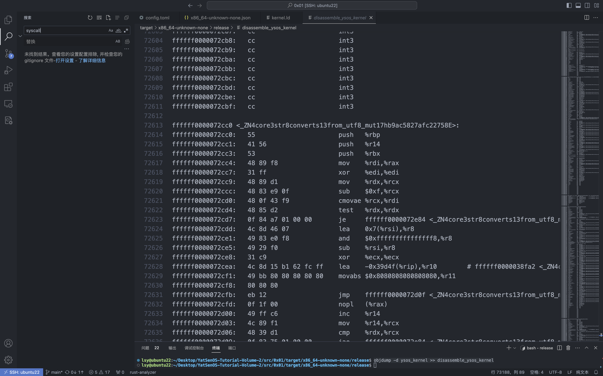

## 编译内核 ELF

### 配置文件的解读

在 `pkg/kernel` 目录下运行 `cargo build` ，所用到的配置文件 `pkg/kernel/.cargo/config.toml` 内容 ：

```toml toml
[build]
target = "config/x86_64-unknown-none.json"
## 指定 pkg/kernel/config/x86_64-unknown-none.json 作为配置文件
```

配置文件 `pkg/kernel/config/x86_64-unknown-none.json` 内容如下：

```json json
{
  "llvm-target": "x86_64-unknown-none", ## 编译程序为运行在x86_64架构无操作系统的裸机环境的程序
  "data-layout": "e-m:e-p270:32:32-p271:32:32-p272:64:64-i64:64-i128:128-f80:128-n8:16:32:64-S128",
  "linker-flavor": "ld.lld",
  "target-endian": "little", ## 小端存储
  "target-pointer-width": "64",
  "target-c-int-width": "32",
  "arch": "x86_64", ## x86_64架构
  "os": "none", ## 编译程序为运行在无操作系统的裸机环境的程序
  "executables": true,
  "linker": "rust-lld",
  "disable-redzone": true,
  "features": "-mmx,-sse,+soft-float",
  "panic-strategy": "abort",
  "pre-link-args": { ## 告诉链接器使用配置文件pkg/kernel/config/kernel.ld
    "ld.lld": ["-Tpkg/kernel/config/kernel.ld", "-export-dynamic"]
  }
}
```

其中 `"pre-link-args"` 指定了链接阶段传递给连接器一个配置文件：`pkg/kernel/config/kernel.ld` ，其内容如下：

```raw
ENTRY(_start)

KERNEL_BEGIN = 0xffffff0000000000; ## 内核起始地址，即所有segment地址应该以0xffffff...开头

SECTIONS {

  . = KERNEL_BEGIN;

  .rodata ALIGN(4K): ## 按4KB=0x1000B对齐
  {
    *(.rodata .rodata.*)
  }

  .text ALIGN(4K): ## 按4KB=0x1000B对齐
  {
    *(.text .text.*)
  }

  .data ALIGN(4K): ## 按4KB=0x1000B对齐
  {
    *(.data .data.*)
  }

  .got ALIGN(4K): ## 按4KB=0x1000B对齐
  {
    *(.got .got.*)
  }

  .bss ALIGN(4K): ## 按4KB=0x1000B对齐
  {
    *(.bss .bss.*)
  }
}
```

### 编译产物的架构信息

运行 `objdump -d ysos_kernel >> disassemble_ysos_kernel` ，查看 `disassemble_ysos_kernel` 反汇编内容:




从上面可以看出，在反汇编代码中搜索 `int 0x80` 和 `syscall` 均没有结果，表明程序并没有使用系统调用，或者说我们的内核程序还没有实现系统调用，验证了编译结果符合程序运行在无操作系统的裸机环境的编译配置；

运行指令 `objdump -f ysos-kernel` 得到结果如下：


- 文件格式（file format）：`ysos_kernel` 是一个 ELF 64 位可执行文件，采用 elf64-x86-64 格式。
- 架构（architecture）：`ysos_kernel` 的架构是 i386:x86-64，表示它是 x86-64 架构的程序，符合编译配置。
- 标志（flags）：0x00000112 是一个十六进制数，代表不同的标志位。解析该标志位可以得到以下信息：
  - `EXEC_P`：指示该可执行文件是可以执行的。
  - `HAS_SYMS`：指示该可执行文件包含有关符号的信息，即具有调试符号表。
  - `D_PAGED`：指示该可执行文件被设定为按页（page）进行加载。
- 启动地址（start address）：`ysos_kernel` 的启动地址是 `0xffffff000003a0b0` 。这是程序在内存中的起始执行位置，从这个地址开始执行代码。这个地址是以 `0xffffff...` 开头的，符合链接脚本中起始地址 `0xffffff0000000000` 的配置

### 内核的入口点及其如何被控制

由上面的指令可知内核入口点是 `0xffffff000003a0b0`

#### 源码

在源码 `pkg/boot/src/lib.rs` 中，使用`#[macro_export]` 定义了`entry_point!`宏，用来，相关内容如下：

```rust
#[macro_export]
macro_rules! entry_point {
    ($path:path) => {
        #[export_name = "_start"]
        pub extern "C" fn __impl_start(boot_info: &'static $crate::BootInfo) -> ! {
            // validate the signature of the program entry point
            let f: fn(&'static $crate::BootInfo) -> ! = $path;

            f(boot_info)
        }
    };
}
```

返回一个`!`类型的“发散”值，即一个永远不会返回的结果，也就是说内核程序将永远运行（直到关机）

这里使用`#[export_name = "_start"]`属性将函数`__impl_start`与`_start`关联起来。这个属性告诉编译器将`__impl_start`函数导出为可执行文件的`_start`函数；

其中 `extern "C"`表示该函数使用 C 语言的函数调用约定。这意味着该函数的参数和返回值的传递方式、堆栈布局等将与 C 语言中的函数一致。这是因为底层的组件通常使用 C 语言编写和调用约定，这样的导出函数能够与底层的启动代码和链接器进行正确的交互。 C 语言中的程序入口点就是 `_start` ，所以将内核入口点导出名字为 `_start` ，编译器才能按照 C 语言相关约定实现链接。

在 `pkg/kernel/src/main.rs` 中：

```rust
boot::entry_point!(kernel_main);

pub fn kernel_main(boot_info: &'static boot::BootInfo) -> ! {
    ysos::init(boot_info);

    loop {
        info!("Hello World from YatSenOS v2!");

        for _ in 0..0x10000000 {
            unsafe {
                asm!("nop");
            }
        }
    }
}
```

使用上面定义的宏 `boot::entry_point!(kernel_main)` 生成一个函数 `kernel_main，这意味着在程序启动时，将首先调用 `kernel_main` 函数来开始执行程序。

这一过程也在反汇编得到的汇编代码中得到了验证：

```raw
ffffff000003a000 <_ZN11ysos_kernel11kernel_main17hc0e3ef9df9bca286E>: ## kernel_main 函数
ffffff000003a000:	55                   	push   %rbp
...(content of the kernel_main function)...
ffffff000003a0af:	cc                   	int3

ffffff000003a0b0 <_start>: ## 内核程序入口点
ffffff000003a0b0:	50                   	push   %rax ## 保存寄存器的值
ffffff000003a0b1:	e8 4a ff ff ff       	call   ffffff000003a000 <_ZN11ysos_kernel11kernel_main17hc0e3ef9df9bca286E> ## 首先调用 kernel_main 函数
ffffff000003a0b6:	cc                   	int3
ffffff000003a0b7:	cc                   	int3
ffffff000003a0b8:	cc                   	int3
ffffff000003a0b9:	cc                   	int3
ffffff000003a0ba:	cc                   	int3
ffffff000003a0bb:	cc                   	int3
ffffff000003a0bc:	cc                   	int3
ffffff000003a0bd:	cc                   	int3
ffffff000003a0be:	cc                   	int3
ffffff000003a0bf:	cc                   	int3

...(other functions)...
```

值得注意的是，这里调用的时候没有传入 `kernel_main` 的参数，这个传参过程实际上是 bootloader 完成的，在后面分析中会提及。

#### 链接

传递给连接器的配置文件 `pkg/kernel/config/kernel.ld` 部分内容如下：

```raw
ENTRY(_start)

KERNEL_BEGIN = 0xffffff0000000000; ## 内核起始地址，即所有segment地址应该以0xffffff...开头

SECTIONS {

  . = KERNEL_BEGIN;

  ......
}
```

可见链接器将把源码中导出具有 C 语言调用约定的 `_start` 函数作为内核程序的入口点，所以 `_start` 的地址 `ffffff000003a0b0` 是内核程序的启动地址

同时 `. = KERNEL_BEGIN;` 将所有 section 的起始地址，也就是整个内核程序存放到内存中的起始地址指定为 `KERNEL_BEGIN = 0xffffff0000000000;` ，在加载阶段就会将内核程序放在这个地址开始的内存空间

#### 加载

在操作系统启动过程中，引导加载程序（Bootloader）负责将内核程序加载到内存中的特定位置。加载程序会将内核映像从磁盘或其他存储介质中读取，并将其复制到内存中的指定位置。加载程序还会设置好内存分页和其他必要的环境，以便内核能够正确运行。

此时我们的内核程序 `ysos-kernel` 就应该被加载到内存空间 `0xffffff0000000000` 开始的区域

然后内核才能从它的启动点 `ffffff000003a0b0` 开始运行

### 编译产物的 section、segment 信息查看

查看 section 和 segment 相关信息：

```shell
lsy@ubuntu22:~/Desktop/YatSenOS-Tutorial-Volume-2/src/0x01/target/x86_64-unknown-none/release$ hexdump -C ./ysos_kernel | head -1
00000000  7f 45 4c 46 02 01 01 00  00 00 00 00 00 00 00 00  |.ELF............|
## 前四个字节：7f 45 4c 46 表明这是一个ELF文件
lsy@ubuntu22:~/Desktop/YatSenOS-Tutorial-Volume-2/src/0x01/target/x86_64-unknown-none/release$ readelf -lS  ./ysos_kernel
There are 17 section headers, starting at offset 0xb1398:

Section Headers:
  [Nr] Name              Type             Address           Offset
       Size              EntSize          Flags  Link  Info  Align
  [ 0]                   NULL             0000000000000000  00000000
       0000000000000000  0000000000000000           0     0     0
  [ 1] .dynsym           DYNSYM           ffffff0000000000  00001000
       0000000000006a68  0000000000000018   A       4     1     8
  [ 2] .gnu.hash         GNU_HASH         ffffff0000006a68  00007a68
       0000000000001e34  0000000000000000   A       1     0     8
  [ 3] .hash             HASH             ffffff000000889c  0000989c
       0000000000002380  0000000000000004   A       1     0     4
  [ 4] .dynstr           STRTAB           ffffff000000ac1c  0000bc1c
       000000000001c391  0000000000000000   A       0     0     1
  [ 5] .rodata           PROGBITS         ffffff0000027000  00028000 ## 按4KB=0x1000B对齐
       00000000000124c8  0000000000000000  AM       0     0     16
  [ 6] .eh_frame_hdr     PROGBITS         ffffff00000394c8  0003a4c8
       000000000000000c  0000000000000000   A       0     0     4
  [ 7] .eh_frame         PROGBITS         ffffff00000394d8  0003a4d8
       000000000000001c  0000000000000000   A       0     0     8
  [ 8] .text             PROGBITS         ffffff000003a000  0003b000 ## 按4KB=0x1000B对齐
       000000000003a277  0000000000000000  AX       0     0     16
  [ 9] .data             PROGBITS         ffffff0000075000  00076000 ## 按4KB=0x1000B对齐
       0000000000005b30  0000000000000000  WA       0     0     8
  [10] .got              PROGBITS         ffffff000007b000  0007c000 ## 按4KB=0x1000B对齐
       00000000000000c8  0000000000000000  WA       0     0     8
  [11] .dynamic          DYNAMIC          ffffff000007b0c8  0007c0c8
       0000000000000080  0000000000000010  WA       4     0     8
  [12] .bss              NOBITS           ffffff000007c000  0007d000 ## 按4KB=0x1000B对齐
       0000000000000020  0000000000000000  WA       0     0     8
  [13] .comment          PROGBITS         0000000000000000  0007d000
       0000000000000048  0000000000000001  MS       0     0     1
  [14] .symtab           SYMTAB           0000000000000000  0007d048
       000000000000b5b0  0000000000000018          16   804     8
  [15] .shstrtab         STRTAB           0000000000000000  000885f8
       0000000000000083  0000000000000000           0     0     1
  [16] .strtab           STRTAB           0000000000000000  0008867b
       0000000000028d1c  0000000000000000           0     0     1
Key to Flags:
  W (write), A (alloc), X (execute), M (merge), S (strings), I (info),
  L (link order), O (extra OS processing required), G (group), T (TLS),
  C (compressed), x (unknown), o (OS specific), E (exclude),
  D (mbind), l (large), p (processor specific)

Elf file type is EXEC (Executable file)
Entry point 0xffffff000003a0b0 ## 内核程序入口地址
There are 8 program headers, starting at offset 64

Program Headers: ## segment 的信息，一共有 8 个 segment
  Type           Offset             VirtAddr           PhysAddr
                 FileSiz            MemSiz              Flags  Align
  LOAD           0x0000000000001000 0xffffff0000000000 0xffffff0000000000 ## 内核的起始地址
                 0x00000000000394f4 0x00000000000394f4  R      0x1000
  LOAD           0x000000000003b000 0xffffff000003a000 0xffffff000003a000 ## 内核程序入口地址所在segment可执行
                 0x000000000003a277 0x000000000003a277  R E    0x1000
  LOAD           0x0000000000076000 0xffffff0000075000 0xffffff0000075000
                 0x0000000000006148 0x0000000000006148  RW     0x1000
  LOAD           0x000000000007d000 0xffffff000007c000 0xffffff000007c000
                 0x0000000000000000 0x0000000000000020  RW     0x1000
  DYNAMIC        0x000000000007c0c8 0xffffff000007b0c8 0xffffff000007b0c8
                 0x0000000000000080 0x0000000000000080  RW     0x8
  GNU_RELRO      0x000000000007c000 0xffffff000007b000 0xffffff000007b000
                 0x0000000000000148 0x0000000000000148  R      0x1
  GNU_EH_FRAME   0x000000000003a4c8 0xffffff00000394c8 0xffffff00000394c8
                 0x000000000000000c 0x000000000000000c  R      0x4
  GNU_STACK      0x0000000000000000 0x0000000000000000 0x0000000000000000
                 0x0000000000000000 0x0000000000000000  RW     0x0

 Section to Segment mapping: ## 每个 segment 包含的 section 信息
  Segment Sections...
   00     .dynsym .gnu.hash .hash .dynstr .rodata .eh_frame_hdr .eh_frame
   01     .text
   02     .data .got .dynamic
   03     .bss
   04     .dynamic
   05     .got .dynamic
   06     .eh_frame_hdr
   07
```

可以看出编译产物的架构，与配置文件中的描述一致；编译产物的 segments 的数量为 8 个。

其中一些重要的 `section` 如下：

- `.text`：该段包含内核的代码指令。这些指令是内核功能的实现，包括任务调度、中断处理、系统调用处理等。
- `.rodata`：该段包含内核中的只读数据。这些数据可能包括字符串常量、全局常量和只读的静态数据。它们在运行时不可修改，用于存储内核中的常量值。
- `.data`：该段包含内核的可读写数据。它存储了内核在运行时需要修改的全局变量和静态变量。例如，内核的全局状态信息、内核数据结构等可以存储在该段中。
- `.bss`：该段包含内核的未初始化数据（block started by symbol）。这些数据在编译时被初始化为零或空值，并在运行时根据需要进行初始化。该段用于存储内核的未初始化全局变量和静态变量。

表格的形式说明每一个 segment 的权限、是否对齐等信息：

| Segment      | 可读 | 可写 | 可执行 | 是否按照 4kB 对齐 |
| ------------ | ---- | ---- | ------ | ----------------- |
| LOAD         | 是   | 否   | 否     | 是                |
| LOAD         | 是   | 否   | 是     | 是                |
| LOAD         | 是   | 是   | 否     | 是                |
| LOAD         | 是   | 是   | 否     | 是                |
| DYNAMIC      | 是   | 是   | 否     | 否                |
| GNU_RELRO    | 是   | 否   | 否     | 否                |
| GNU_EH_FRAME | 是   | 否   | 否     | 否                |
| GNU_STACK    | 是   | 是   | 否     | 否                |

从表格可见只有第 2 个 segment 是可执行的，这也就是内核程序所在的 segment，因为这里包含 `.text` section，内核程序代码指令存放在这里，内核程序启动入口也位于这里。

更具体的，细分到 section 的内核程序文件结构如下：

| Section       | 功能                                                                                                                   |
| :------------ | :--------------------------------------------------------------------------------------------------------------------- |
| .dynsym       | 动态符号表，存储动态链接所需的符号信息。                                                                               |
| .gnu.hash     | GNU 哈希表，用于快速查找共享库中的符号。                                                                               |
| .hash         | 哈希表，用于查找共享库中的符号。                                                                                       |
| .dynstr       | 动态字符串表，存储与动态符号表相关的字符串。                                                                           |
| .rodata       | 只读数据段，存储只读的全局常量数据。                                                                                   |
| .eh_frame_hdr | 异常处理帧头表，用于处理异常和堆栈展开。                                                                               |
| .eh_frame     | 异常处理帧表，定义异常处理和堆栈展开的规则。                                                                           |
| .text         | 存储可执行代码，包括操作系统内核程序的指令和函数代码。                                                                 |
| .data         | 存储已初始化的全局和静态变量，包括操作系统内核程序需要在运行时进行读写的数据。                                         |
| .got          | 全局偏移表，存储全局变量的偏移地址。在动态链接时，这个表中的条目会被动态链接器填充，以便在运行时能够正确访问全局变量。 |
| .dynamic      | 动态段，存储动态链接器所需的信息，包括共享库的名称、地址和其他动态链接相关的信息。                                     |
| .bss          | 未初始化的数据段，存储未初始化的全局和静态变量，作为操作系统内核程序的静态内存分配区域。在程序加载时，这个段会被清零。 |

## 在 UEFI 中加载内核

### 代码补全

#### 加载相关文件

```rust
    // 1. Load config
    let config = {
        let mut file = open_file(bs, CONFIG_PATH);
        let buf = load_file(bs, &mut file);
        crate::config::Config::parse(buf)
    };
```

```rust
    // 2. Load ELF files
    let elf = {
        let mut file = open_file(bs, config.kernel_path);
        let buf = load_file(bs, &mut file);
        ElfFile::new(buf).expect("Failed to load ElfFile!")
    };
```

#### 更新控制寄存器

```rust
// FIXME: root page table is readonly, disable write protect (Cr0)
    // 代码包裹在 unsafe 块中，这是为了表示其中的操作是不安全的
    //
    unsafe {
        Cr0::update(|f| f.remove(Cr0Flags::WRITE_PROTECT));
    }
```

代码包裹在 unsafe 块中，因为直接操作底层硬件寄存器可能带来潜在的风险和系统不稳定性，在 Rust 中这样的操作是不安全的。

#### 映射内核文件

```rust
    // FIXME: map physical memory to specific virtual address offset
    let mut frame_allocator = UEFIFrameAllocator(bs);

    elf::map_physical_memory(
        config.physical_memory_offset,
        max_phys_addr,
        &mut page_table,
        &mut frame_allocator
    );

    // FIXME: load and map the kernel elf file
    elf::load_elf(
        &elf,
        config.physical_memory_offset,
        &mut page_table,
        &mut frame_allocator
    ).expect("Failed to load and map kernel elf file!");

    // FIXME: map kernel stack
     let _page_range = elf::map_range(
        config.kernel_stack_address,
        config.kernel_stack_size,
        &mut page_table,
        &mut frame_allocator
    ).expect("Failed to map kernel stack!");
```

#### 恢复控制寄存器

```rust
    // FIXME: recover write protect (Cr0)
    unsafe {
        Cr0::update(|f| f.insert(Cr0Flags::WRITE_PROTECT));
    }
```

#### 设置 flag

传给函数 `load_segment` 的变量 `segment` 定义如下：

```rust
#[derive(Copy, Clone, Debug, Default)]
#[repr(C)]
pub enum ProgramHeader<'a> {
    Ph32(&'a ProgramHeader32),
    Ph64(&'a ProgramHeader64),
}
#[derive(Copy, Clone, Debug, Default)]
#[repr(C)]
pub struct ProgramHeader32 {
    ......
    pub flags: Flags,
    ......
}
```

其中包含了用来确认 segment 权限的变量 `flags` ，该变量对应定义如下：

```rust
pub struct Flags(pub u32);

impl Flags {
    pub fn is_execute(&self) -> bool {
        self.0 & FLAG_X ** FLAG_X
    }

    pub fn is_write(&self) -> bool {
        self.0 & FLAG_W ** FLAG_W
    }

    pub fn is_read(&self) -> bool {
        self.0 & FLAG_R ** FLAG_R
    }
}
```

其中 `FLAG_X` 、`FLAG_W` 、`FLAG_R` 的定义如下：

```rust
pub const FLAG_X: u32 = 0x1;
pub const FLAG_W: u32 = 0x2;
pub const FLAG_R: u32 = 0x4;
```

`PageTableFlags` 结构体的定义如下：

```rust
bitflags! {
    /// Possible flags for a page table entry.
    #[derive(PartialEq, Eq, PartialOrd, Ord, Hash, Debug, Clone, Copy)]
    pub struct PageTableFlags: u64 {
        /// Specifies whether the mapped frame or page table is loaded in memory.
        const PRESENT =         1;
        /// Controls whether writes to the mapped frames are allowed.
        ///
        /// If this bit is unset in a level 1 page table entry, the mapped frame is read-only.
        /// If this bit is unset in a higher level page table entry the complete range of mapped
        /// pages is read-only.
        const WRITABLE =        1 << 1;
        /// Controls whether accesses from userspace (i.e. ring 3) are permitted.
        const USER_ACCESSIBLE = 1 << 2;
        ......
        /// Can be only used when the no-execute page protection feature is enabled in the EFER
        /// register.
        const NO_EXECUTE =      1 << 63;
    }
}
```

最终在 `pkg/elf/src/lib.rs` 中补全的代码如下：

```rust
    // FIXME: handle page table flags with segment flags
    if segment.flags().0 & 0x4 != 0x4 { //readable
        page_table_flags |= PageTableFlags::USER_ACCESSIBLE;
    }
    if segment.flags().0 & 0x1 != 0x1 { //not executable
        page_table_flags |= PageTableFlags::NO_EXECUTE;
    }
    if segment.flags().0 & 0x2 ** 0x2 { //writable
        page_table_flags |= PageTableFlags::WRITABLE;
    }
```

#### 跳转执行

在 `pkg/boot/src/main.rs` 末尾加上如下代码：

```rust
    unsafe{
        jump_to_entry(&bootinfo, stacktop);
    }
```

### 回答实验任务问题

#### `set_entry`

**这个函数做了什么，为什么它是 unsafe 的**

```rust
pub unsafe fn set_entry(entry: usize) {
    ENTRY = entry;
}
```

`ENTRY` 定义如下：

```rust
/// The entry point of kernel, set by BSP.
static mut ENTRY: usize = 0;
```

这个函数将内核程序文件 `elf` 的入口点，也就是传入的参数 `entry` 作为 boot 阶段结束后启动的程序入口点 `ENTRY` ，使得 boot 阶段结束后 `jump_to_entry` 跳转到内核程序

#### `jump_to_entry`

**这个函数做了什么，要传递给内核的参数位于哪里，查询 `call` 指令的行为和 x86_64 架构的调用约定，借助调试器进行说明**

```rust
pub unsafe fn jump_to_entry(bootinfo: *const BootInfo, stacktop: u64) -> ! {
    assert!(ENTRY != 0, "ENTRY is not set");
    asm!("mov rsp, {}; call {}", in(reg) stacktop, in(reg) ENTRY, in("rdi") bootinfo);
    unreachable!()
}
```

这段代码即为 `jump_to_entry` 的定义，可知这个函数：

首先检查了 `ENTRY` 变量是否非 0，也就是内核入口地址是否有；

然后使用了内联汇编执行了汇编指令：

- `mov rsp, {}` ，首先将栈指针 `rsp` 的值设置为 `stacktop` 变量的值，使用 `in(reg)` 语法指定了它是一个寄存器输入；
- `call {}` ，跳转到 `ENTRY` 标签所代表的位置，此后开始执行内核程序；
- 同时还用 `in("rdi") bootinfo` 将 `bootinfo` 变量的指针传递给 `rdi` 寄存器，也就是将 bootloader 的映射物理地址、运行时间等信息存储位置的指针通过寄存器将交给内核程序，因此要传递给内核的参数位于 `rdi` 寄存器指向的地址空间；

最后 `unreachable!()` 意味着刚刚跳转执行的内核程序永远不会终止

x86_64 常用的调用约定 System V ABI（Application Binary Interface）：

- 函数参数传递
  - 前六个整型或指针类型的参数通过寄存器传递，分别是 RDI、RSI、RDX、RCX、R8 和 R9
  - 如果参数超过六个，多余的参数通过栈传递
- 返回值：
  - 整型或指针类型的返回值通常通过 RAX 寄存器返回
  - 如果返回值是浮点类型，则通过 XMM0 寄存器返回
- 栈帧：栈帧通常由函数调用者负责创建。在函数调用时，返回地址会被压入栈中。局部变量和临时变量也会被分配在栈帧中
- 栈对齐：栈在函数调用前需要按照 16 字节对齐。也就是说，栈指针（RSP）的值必须是 16 的倍数
- 寄存器的保护：在函数调用时，一些寄存器（RBX、RBP、R12、R13、R14、R15）需要被调用者保护，即在函数内部使用这些寄存器时需要先保存其值，并在函数返回前恢复它们的值

可以得知，在 `jump_to_entry` 执行的汇编指令中，相当于将 `bootinfo` 作为参数调用了内核程序函数，这在内核程序签名中也可以看出，确实传入了一个参数 bootinfo ：

```rust
pub fn kernel_main(boot_info: &'static boot::BootInfo)
```

这些在先前分析内核入口点的时候也提及过，内核程序此后开始运行时，就可以使用已经传入的参数 `boot_info` 。也就是说调用 `kernel_main` 函数的过程实际上是：

```shell raw
bootloader
--> jump_to_entry ## 调用
    --> kernel_main ## 调用
```

调试器只能对编译产生的内核程序打断点调试，所以只看得到 `kernel_main` 被调用的过程：


其中 `0xffffff000003c1f0` 是本次编译得到的内核程序入口点，进入之后 `kernel_main` 马上就被调用，跳转到这个函数的起始地址 `0xffffff000003c000` ；

同时，还可以看到进入 `kernel_main` 后很快就开始调用 `init` 函数，在该函数里还使用 `lea` 指令读取了 `rdi` 寄存器指向的地址空间的数据，也就是读取了 bootloader 传来的 `bootinfo`的数据，表明传参过程顺利执行。

#### `entry_point!`

**这个宏做了什么，内核为什么需要使用它声明自己的入口点**

这个宏的作用在前面分析内核入口点时已经分析过，在 `pkg/boot/src/lib.rs` 定义了`entry_point!`宏，并在 `pkg/kernel/src/main.rs` 中使用这个宏生成了程序入口点函数 `kernel_main` ；

根据 `pkg/boot/src/lib.rs` 中注释给出的 https://docs.rs/bootloader/0.10.12/src/bootloader/lib.rs.html 的资料可知：

这个宏创建了一个叫 `_start` 的函数，使其符合汇编语言的相关约定，从而链接器可以以此作为内核程序入口点；

而内核使用这个宏而不是直接自定义函数的原因是：由于 `_start` 函数是在外部从引导程序中调用的，所以没有对函数签名进行检查。这意味着它可以接受任意参数而不出现任何编译错误，但在运行时它会失败或导致未定义行为；`entry_point` 宏提供了一种类型检查的方法来定义一个函数作为入口点，保证了函数及其参数类型的正确性。

#### 为内核提供直接访问物理内存的能力

##### 不同方式

访问物理内存，实际上就是让内核实现从虚拟地址到物理地址到映射转换，可以分为三类结构： 页式、段式、段页式（也就是页+段混合）；根据参考资料有如下几种映射方式：

- 直接映射（段式）
- 映射一个固定的偏移量（页式）
- 映射完整的物理内存
- 临时映射
- 递归页表

##### 代码所采用方式

代码采用了映射完整的物理内存的方式

`pkg/elf/src/lib.rs` 中的 `map_physical_memory` 函数如下：

```rust
pub fn map_physical_memory(
    offset: u64,
    max_addr: u64,
    page_table: &mut impl Mapper<Size2MiB>,
    frame_allocator: &mut impl FrameAllocator<Size4KiB>,
) {
    trace!("Mapping physical memory...");
    let start_frame = PhysFrame::containing_address(PhysAddr::new(0));
    let end_frame = PhysFrame::containing_address(PhysAddr::new(max_addr));

    for frame in PhysFrame::range_inclusive(start_frame, end_frame) {
        let page = Page::containing_address(VirtAddr::new(frame.start_address().as_u64() + offset));
        let flags = PageTableFlags::PRESENT | PageTableFlags::WRITABLE;
        unsafe {
            page_table
                .map_to(page, frame, flags, frame_allocator)
                .expect("Failed to map physical memory")
                .flush();
        }
    }
}
```

这个函数对 x86_64 裸机已有的页表 `page_table` （CR3 寄存器所指向的页表）将物理内存范围 [0，max_addr) 映射到虚拟地址空间[offset，offset + max_addr) ，其中 offset = 0xFFFF800000000000 ，是 `esp/EFI/BOOT/boot.conf` 决定的。

经过这个映射处理后，所有 [offset，offset + max_addr) 范围内的虚拟地址都可以有效的执行程序，足够内核程序使用了，因为我们链接阶段指定了内核程序就只运行在这个范围内的虚拟地址。

内核程序使用的虚拟地址，在处理器执行指令的时候虚拟地址就会被 qemu 模拟的内存管理单元 MMU 截获，然后 MMU 会查找页表基址寄存器 CR3，找到内存对应的页表，完成虚拟地址到物理地址到转换。

#### GDB 指令

##### `layout asm`

切换调试界面的布局，将当前源代码窗格切换为汇编代码窗格。它的功能是在调试过程中同时显示当前源代码和对应的汇编指令，以便更深入地分析程序的执行。

该指令可以搭配 `step`、`next` 或 `continue`，同时在汇编窗格中观察底层指令的执行情况

##### 定位源码

`list`：显示当前代码的源代码行。在 GDB 中输入`list`命令，它将显示当前执行点周围的源代码行

`list <function>`：显示函数 `<function>` 源代码。通过在`list`命令后面加上函数名，可以显示特定函数的源代码

`info sources`：列出当前已加载的源代码文件，并显示它们的路径

#### `DBG_INFO=true`

在项目根目录 `Cargo.toml` 文件中有：

```toml toml
[profile.release-with-debug]
inherits = "release"
debug = true

[profile.release-with-debug.package."*"]
debug = false
```

其中 `[profile.release-with-debug]` 定义了一个名为 `release-with-debug` 的构建配置，它继承了默认的 `release` 构建配置项，`debug = true` 表示在 `release-with-debug` 构建配置中启用调试信息。这意味着 `cargo build --profile=release-with-debug` 生成的可执行文件将包含调试符号，以便在调试时进行源代码级别的调试。

而 `[profile.release-with-debug.package."*"]` 进一步细化了 `release-with-debug` 配置的作用范围。它指定了包括依赖项的所有包使用 `release-with-debug` 配置，`debug = false` 表示在 `release-with-debug` 构建配置中禁用调试信息，也就是禁止外部依赖包生成调试符号。

`Makefile` 中相关部分如下所示：

```makefile makefile
## 默认 MODE=release
MODE ?= release
## 默认 DBG_INFO=false
DBG_INFO ?= false

## 如果 DBG_INFO=true
ifeq (${DBG_INFO}, true)
    ## 设置 PROFILE 变量为 release-with-debug
    PROFILE = release-with-debug
    ## 设置 PROFILE_ARGS 变量为 --profile=release-with-debug
    PROFILE_ARGS = --profile=release-with-debug
## 如果 DBG_INFO=false
else
    ## 设置 PROFILE 变量为 MODE 变量的值
    PROFILE = ${MODE}
    ## 设置 PROFILE_ARGS 变量为 BUILD_ARGS 变量的值
    PROFILE_ARGS = $(BUILD_ARGS)
endif

## 如果 MODE=release
ifeq (${MODE}, release)
  ## 设置 PROFILE_ARGS 变量为 --release
	BUILD_ARGS := --release
endif
......
```

结合 `makefile` 其它内容可知：

启用 `DBG_INFO=true` ，即运行 `make build DBG_INFO=true` ，那么等价于在终端直接执行：

```shell
cd pkg/boot
cargo build --release
cd ../..
cp target/x86_64-unknown-uefi/release/ysos_boot.efi esp/EFI/BOOT/BOOTX64.EFI
cp pkg/kernel/config/boot.conf esp/EFI/BOOT/boot.conf
cd pkg/kernel
cargo build --profile=release-with-debug ## 编译包含调试符号的内核文件
cp target/x86_64-unknown-none/release-with-debug/ysos_kernel esp/KERNEL.ELF
```

那么编译产生的内核程序将可以用于调试。

若在编译时没有启用 `DBG_INFO=true` ，即运行 `make build` ，那么等价于在终端直接执行：

```shell
cd pkg/boot
cargo build --release
cd ../..
cp target/x86_64-unknown-uefi/release/ysos_boot.efi esp/EFI/BOOT/BOOTX64.EFI
cp pkg/kernel/config/boot.conf esp/EFI/BOOT/boot.conf
cd pkg/kernel
## 前面部分与启用`DBG_INFO=true`一致
cargo build --release ## 编译不包含调试符号的内核文件
cp target/x86_64-unknown-none/release/ysos_kernel esp/KERNEL.ELF
```

`cargo build --release` 此时使用的是 Cargo 默认提供的用于发布模式的构建配置`[profile.release]` ，构建的可执行文件不包含调试符号，无法调试。

#### 我的调试环境

##### GDB + GEF

我的 `.gdbinit` ：

```raw .gdbinit
file esp/KERNEL.ELF
gef-remote localhost 1234
tmux-setup
b kernel_main
b ysos_kernel::init
b drivers::serial::init
b logger::init
```


##### VSCode


## UART 与日志输出

### 串口驱动


从给出的 c 代码实现的串口初始化、发送接收数据可知，各个端口需要的读取、写入权限如下表所示：

| 端口 | 可读 | 可写 |
| ---- | ---- | ---- |
| COM1 | 1    | 1    |
| COM2 | 0    | 1    |
| COM3 | 0    | 1    |
| COM4 | 0    | 1    |
| COM5 | 0    | 1    |
| COM6 | 1    | 0    |
| COM7 | 0    | 0    |
| COM8 | 0    | 0    |

- COM1 是既可读又可写的，应该使用 Port 定义；
- COM2 到 COM5 是只可写的，应该使用 PortWriteOnly 定义；
- COM6 是只可读的，对应线控寄存器，应该使用 PortReadOnly 定义；
- COM7 和 COM8 是读写权限都没有的，可以不定义这两个端口。

最终实现的 `pkg/kernel/src/drivers/uart16550.rs` 内容如下：

```rust
use core::fmt;
use x86_64::instructions::port::{Port, PortReadOnly, PortWriteOnly};

/// A port-mapped UART 16550 serial interface.
pub struct SerialPort<const BASE_ADDR: u16> {
    COM1: Port<u8>,
    COM2: PortWriteOnly<u8>,
    COM3: PortWriteOnly<u8>,
    COM4: PortWriteOnly<u8>,
    COM5: PortWriteOnly<u8>,
    COM6: PortReadOnly<u8>,
}

impl<const BASE_ADDR: u16> SerialPort<BASE_ADDR> {
    pub const unsafe fn new() -> Self {
        Self {
            COM1: Port::new(BASE_ADDR),
            COM2: PortWriteOnly::new(BASE_ADDR + 1),
            COM3: PortWriteOnly::new(BASE_ADDR + 2),
            COM4: PortWriteOnly::new(BASE_ADDR + 3),
            COM5: PortWriteOnly::new(BASE_ADDR + 4),
            COM6: PortReadOnly::new(BASE_ADDR + 5),
        }
    }

    /// Initializes the serial port.
    pub unsafe fn init(&mut self) {
        // FIXME: Initialize the serial port
        self.COM2.write(0x00);    // Disable all interrupts
        self.COM4.write(0x80);    // Enable DLAB (set baud rate divisor)
        self.COM1.write(0x03);    // Set divisor to 3 (lo byte) 38400 baud
        self.COM2.write(0x00);    //                  (hi byte)
        self.COM4.write(0x03);    // 8 bits, no parity, one stop bit
        self.COM3.write(0xC7);    // Enable FIFO, clear them, with 14-byte threshold
        self.COM5.write(0x0B);    // IRQs enabled, RTS/DSR set
        self.COM5.write(0x1E);    // Set in loopback mode, test the serial chip
        self.COM1.write(0xAE);    // Test serial chip (send byte 0xAE and check if serial returns same byte)

        // Check if serial is faulty (i.e: not same byte as sent)
        if self.COM1.read() != 0xAE {
            panic!("Serial is faulty, not same byte as sent!")
        }

        // If serial is not faulty set it in normal operation mode
        // (not-loopback with IRQs enabled and OUT#1 and OUT#2 bits enabled)
        self.COM5.write(0x0F);
    }

    /// Sends a byte on the serial port.
    pub unsafe fn send(&mut self, data: u8) {
        // FIXME: Send a byte on the serial port
        while self.COM6.read() & 0x20 ** 0 {};
        self.COM1.write(data);
    }

    /// Receives a byte on the serial port no wait.
    pub unsafe fn receive(&mut self) -> Option<u8> {
        // FIXME: Receive a byte on the serial port no wait
        while self.COM6.read() & 1 ** 0 {};
        Some(self.COM1.read())
    }
}
......
```

同时，`pkg/kernel/src/drivers/serial.rs` 中需要稍作修改如下：

```rust
......
// once_mutex!(pub SERIAL: SerialPort); // 修改前
once_mutex!(pub SERIAL: SerialPort<SERIAL_IO_PORT>); // 修改后

pub fn init() {
    // init_SERIAL(SerialPort::new(SERIAL_IO_PORT)); // 修改前
    init_SERIAL(SerialPort::new()); // 修改后
......
```

### 日志输出

log crate 中 Level 枚举类型的定义：

```rust
pub enum Level {
    Error = 1,
    Warn,
    Info,
    Debug,
    Trace,
}
```

最终实现的 `pkg/kernel/src/utils/logger.rs` 内容如下：

```rust
use log::{Metadata, Record};

pub fn init() {
    static LOGGER: Logger = Logger;
    log::set_logger(&LOGGER).unwrap();

    // FIXME: Configure the logger
    log::set_max_level(log::LevelFilter::Trace);

    info!("Logger Initialized.");
}

struct Logger;

impl log::Log for Logger {
    fn enabled(&self, _metadata: &Metadata) -> bool {
        // metadata.level() <= log::LevelFilter::Info
        true
    }

    fn log(&self, record: &Record) {
        // FIXME: Implement the logger with serial output
        if self.enabled(record.metadata()) {
            let file_str = match record.file_static() {
                None => "unknown file",
                Some(str) => str,
            };
            println!(
                "\x1B[1;{}m[{}]\x1B[0m in {} :\n\x1B[1;{}m{}\x1B[0m\n",
                match record.metadata().level() {
                    log::Level::Error => "41",
                    log::Level::Warn => "43",
                    log::Level::Info => "47",
                    log::Level::Debug => "42",
                    log::Level::Trace => "46",
                },
                record.metadata().level(),
                file_str,
                match record.metadata().level() {
                    log::Level::Error => "31",
                    log::Level::Warn => "33",
                    log::Level::Info => "37",
                    log::Level::Debug => "32",
                    log::Level::Trace => "36",
                },
                record.args()
            );
        }
    }

    fn flush(&self) {}
}
```

### Panic 处理

`PanicInfo` 定义如下

```rust
pub struct PanicInfo<'a> {
    payload: &'a (dyn Any + Send),
    message: Option<&'a fmt::Arguments<'a>>,
    location: &'a Location<'a>,
    can_unwind: bool,
    force_no_backtrace: bool,
}
```

`Location` 定义如下：

```rust
pub struct Location<'a> {
    file: &'a str,
    line: u32,
    col: u32,
}
```

最终实现 `pkg/kernel/src/utils/macros.rs` 中自定义的 `panic!` 宏：

```rust
#[allow(dead_code)]
#[cfg_attr(not(test), panic_handler)]
fn panic(info: &core::panic::PanicInfo) -> ! {
    let (l, c) = match info.location() {
        Some(loc) => (loc.line(), loc.column()),
        None => (0, 0),
    };
    let message = match info.message() {
        Some(msg) => match msg.as_str() {
            Some(m) => m,
            None => "Unknown reason",
        },
        None => "Unknown reason",
    };
    if l != 0 && c != 0 {
        error!(
            "Panic occurred! line:{} column:{}\nInstruction address: {:p}\n{}",
            l, c, info.payload(), message
        );
    } else {
        error!(
            "Panic occurred! Position unknown!\nInstruction address: {:p}\n{}",
            info.payload(), message
        );
    }
    // 在最简的情况下，使用 Debug trait 的 {:#?} 来输出
    // error!("Panic occurred!\n{:#?}", info);
    loop {}
}
```

### 测试输出

如图，正常看到 `[+] Serial Initialized.` 的输出，说明串口驱动已经成功初始化：


## 思考题

### 内核禁用 boot 的 feature

在 `pkg/kernel` 的 `Cargo.toml` 中，指定了依赖中 `boot` 包为 `default-features = false`，这是为了避免什么问题？请结合 `pkg/boot` 的 `Cargo.toml` 谈谈你的理解。

```tomel toml
[dependencies]
boot = { package = "ysos_boot", path = "../boot", default-features = false}
```

在 `pkg/boot/Cargo.toml` 中，可以看到这样一个包 `uefi-services` ，以及它启用的 features :

```rust
[dependencise]
......
uefi-services = { version = "0.23", optional = true}
......
[features]
boot = ["uefi/alloc", "uefi-services"]
```

其中 `"uefi/alloc"` 将会启用[uefi 包的官方文档](https://docs.rs/uefi/latest/uefi/index.html)中描述的 `alloc` feature ：

- `alloc`: Enable functionality requiring the [`alloc`](https://doc.rust-lang.org/nightly/alloc/index.html) crate from the Rust standard library. For example, methods that return a `Vec` rather than filling a statically-sized array. This requires a global allocator; you can use the `global_allocator` feature or provide your own.

`"uefi-services"` 将会启用[uefi-services 包的官方文档](https://docs.rs/uefi-services/latest/uefi_services/)中描述的所有 feature ：

- `logger` (enabled by default): Initialize a global logger.
- `panic_handler` (enabled by default): Register a panic handler. A panic handler must be provided for your program to compile, but you can choose to provide your own if you don’t want to use this one.
- `qemu`: On x86_64, make qemu exit with code 3 if a panic occurs. This feature assumes the program is running under QEMU.

其中的 `logger` 是用来记录 boot 阶段的相关信息的，也就是在 "YatSenOS" 打印出来前，各种被打印输出的 [INFO] ，这些日志都是这个 feature 实现的，但是却会和我们内核自己做的 logger 冲突，所以是需要禁用这些 feature 的

### 计算`max_phys_addr`

在 `pkg/boot/src/main.rs` 中参考相关代码，聊聊 `max_phys_addr` 是如何计算的，为什么要这么做？

```rust
let max_phys_addr = mmap
        .entries()
        .map(|m| m.phys_start + m.page_count * 0x1000)
        .max()
        .unwrap()
        .max(0x1_0000_0000); // include IOAPIC MMIO area
```

这条语句遍历内存映射条目并计算每个条目的物理起始地址加上页数乘以 0x1000（页的大小），得到这个条目所需要的最大的物理地址，然后使用`.max()`方法找到这些地址中最大的物理地址，再通过`.unwrap()`方法获取该值；

IOAPIC MMIO 区域是用于访问和控制 IOAPIC 芯片的一块特定内存区域，它需要 [0, 0x1_0000_0000] 的物理空间，内核需要与 IOAPIC 进行交互来配置和管理系统中的中断。内核需要读取和写入 IOAPIC 的寄存器来设置中断向量、中断触发模式、中断优先级等参数。上述结算结果使用`.max(0x1_0000_0000)`将其与 0x1_0000_0000 进行比较，以确保包括内核占用的物理地址空间包括 IOAPIC MMIO 区域。

计算出这个内核占用的物理地址最大范围可以方便接下来将内核虚拟地址映射到物理地址，在 `map_physical_memory` 只需一个 for 循环中从 0 地址到 `max_phys_addr` 地址以 2 MiB 为单位建立映射即可。

### boot 阶段的输出

串口驱动是在进入内核后启用的，那么在进入内核之前，显示的内容是如何输出的？

使用了外部包 log ，利用其 `info!` 、`trace!` 等宏记录日志；

同时，还启用了 `uefi-services` 这个包的所有 feature，也就包括：

- `logger` (enabled by default): Initialize a global logger.

这就为没有标准库的环境提供了 log 包相关宏打印输出日志功能的实现

### QEMU 参数

4.  在 QEMU 中，我们通过指定 `-nographic` 参数来禁用图形界面，这样 QEMU 会默认将串口输出重定向到主机的标准输出。

    - 假如我们将 `Makefile` 中取消该选项，QEMU 的输出窗口会发生什么变化？请观察指令 `make run QEMU_OUTPUT=` 的输出，结合截图分析对应现象。
    - 在移除 `-nographic` 的情况下，如何依然将串口重定向到主机的标准输入输出？请尝试自行构造命令行参数，并查阅 QEMU 的文档，进行实验。
    - 如果你使用 `ysos.py` 来启动 qemu，可以尝试修改 `-o` 选项来实现上述功能。

    !!! note "现象观察提示"

        若此时启动 QEMU 的输出提示是 `vnc server running on ::1:5900`，则说明 QEMU 的图形界面被启用并通过端口 5900 输出。你可以考虑使用 `VNC Viewer` 来观察 QEMU 界面。

        **这一步骤不做要求，如果自身环境实现遇到困难，可以尝试与其他同学合作进行观察。**

去掉 `-nographic` 也就是直接运行：

```shell
qemu-system-x86_64 -bios assets/OVMF.fd -net none -m 96M  -drive format=raw,file=fat:rw:esp
```

那么就会~~(像隔壁 YSOSv1 一样)~~打开 qemu 窗口，输出到该窗口：


只需给 qemu 加上 `mon:stdio` 的参数就可以将串口重定向到主机的标准输入输出：

```shell
qemu-system-x86_64 -bios assets/OVMF.fd -net none -m 96M  -drive format=raw,file=fat:rw:esp mon:stdio
```

## 加分项

### 线控寄存器

😋 线控寄存器的每一比特都有特定的含义，尝试使用 `bitflags` 宏来定义这些标志位，并在 `uart16550` 驱动中使用它们。

查阅资料得到线控寄存器（LCR）各个控制位相关信息：


在 `pkg/kernel/src/drivers/uart16550.rs` 中增加 `bitflags` 宏定义 `LCR` 结构体 ：

```rust
use bitflags::bitflags;

bitflags! {
    pub struct LCR: u8 {
        const DATA_BITS_5 = 0b00000000;
        const DATA_BITS_6 = 0b00000001;
        const DATA_BITS_7 = 0b00000010;
        const DATA_BITS_8 = 0b00000011;
        const STOP_BITS_1 = 0b00000000;
        const STOP_BITS_2 = 0b00000100;
        const PARITY_NONE = 0b00000000;
        const PARITY_ODD = 0b00001000;
        const PARITY_EVEN = 0b00011000;
        const PARITY_HIGH = 0b00101000;
        const PARITY_LOW = 0b00111000;
        const BREAK_SIGNAL_DISABLE = 0b00000000;
        const BREAK_SIGNAL_ENABLE = 0b01000000;
        const DLAB_0 = 0b00000000;
        const DLAB_1 = 0b10000000;
    }
}
```

然后修改 `init` 函数，对 COM4 也就是 LCR 的设置操作用 `LCR` 结构体实现 ：

```rust
pub fn init(&mut self) {
        // FIXME: Initialize the serial port
        unsafe {
            self.COM2.write(0x00);    // Disable all interrupts

            // Enable DLAB (set baud rate divisor)
            self.COM4.write(LCR::DLAB_1.bits());

            self.COM1.write(0x03);    // Set divisor to 3 (lo byte) 38400 baud
            self.COM2.write(0x00);    //                  (hi byte)

            // 8 bits, no parity, one stop bit
            self.COM4.write((LCR::DATA_BITS_8 | LCR::PARITY_NONE | LCR::STOP_BITS_1).bits());
            ......
```

reference:

- https://www.lammertbies.nl/comm/info/serial-uart
- https://exploreembedded.com/wiki/LPC1768:_UART_Programming
- https://wiki.osdev.org/Serial_Ports#Port_Addresses

### 清屏并输出学号

😋 尝试在进入内核并初始化串口驱动后，使用 escape sequence 来清屏，并编辑 `get_ascii_header()` 中的字符串常量，输出你的学号信息。

在 `pkg/kernel/src/drivers/serial.rs` 中 `init` 函数增加清屏功能：

```rust
pub fn init() {
    // init_SERIAL(SerialPort::new(SERIAL_IO_PORT)); // 修改前
    init_SERIAL(SerialPort::new()); // 修改后
    get_serial_for_sure().init();

    print!("\x1B[2J"); // 清屏
    println!("{}", crate::get_ascii_header());
    println!("[+] Serial Initialized.");
}
```

修改 `pkg/kernel/src/utils/mod.rs` 中的 `get_ascii_heade` 函数输出学号：

```rust
pub const fn get_ascii_header() -> &'static str {
    concat!(
        r"
__  __      __  _____            ____  _____
\ \/ /___ _/ /_/ ___/___  ____  / __ \/ ___/
 \  / __ `/ __/\__ \/ _ \/ __ \/ / / /\__ \
 / / /_/ / /_ ___/ /  __/ / / / /_/ /___/ /
/_/\__,_/\__//____/\___/_/ /_/\____//____/

                                       v",
        env!("CARGO_PKG_VERSION"),
        r"
                                     22342043"
    )
}
```

最终效果：


### 添加启动参数 `log_level`

🤔 尝试添加字符串型启动配置变量 `log_level`，并修改 `logger` 的初始化函数，使得内核能够根据启动参数进行日志输出。

由于还没有实现中断，也没有键盘输入相关的宏，无法在内核程序运行时读取用户输入的 `log_level` 参数；所以这里使用了 UEFI 的 Boot 阶段，利用 Rust 的 uefi 包，读取一个字符来控制日志等级，相关的关键代码如下：

`pkg/boot/src/main.rs` 中在 `5. Exit boot and jump to ELF entry` 之前添加输入字符的逻辑：

```rust
    let mut exit_flag = false;
    let mut log_level = 5;
    info!("Please input a char from '1' to '5' to set log level from Error to Trace:");
    while !exit_flag {
        let key = system_table.stdin().read_key().unwrap();
        match key {
            Some(k) =>  {
                match k {
                    uefi::proto::console::text::Key::Printable(p) => {
                        if p ** Char16::try_from(49u16).unwrap() {
                            log_level = 1;
                            exit_flag = true;
                        } else if p ** Char16::try_from(50u16).unwrap() {
                            log_level = 2;
                            exit_flag = true;
                        } else if p ** Char16::try_from(51u16).unwrap() {
                            log_level = 3;
                            exit_flag = true;
                        } else if p ** Char16::try_from(52u16).unwrap() {
                            log_level = 4;
                            exit_flag = true;
                        } else if p ** Char16::try_from(53u16).unwrap() {
                            log_level = 5;
                            exit_flag = true;
                        }
                    }
                    uefi::proto::console::text::Key::Special(s) => {
                        if s ** ScanCode::ESCAPE {
                            exit_flag = true;
                        }
                    }
                };
            },
            None => {}
        };
    };
    info!("Your input log level is {}", log_level);
```

跳转到内核入口点的同时传入日志等级参数：

```rust
    unsafe{
        jump_to_entry(&bootinfo, stacktop, &log_level);
    }
```

`pkg/boot/src/lib.rs` 中的 `jump_to_entry` 函数和 `entry_point` 宏增加参数：

```rust
pub unsafe fn jump_to_entry(bootinfo: *const BootInfo, stacktop: u64, log_level: *const u8) -> ! {
    assert!(ENTRY != 0, "ENTRY is not set");
    asm!("mov rsp, {}; call {}", in(reg) stacktop, in(reg) ENTRY, in("rdi") bootinfo, in("rsi") log_level);
    unreachable!()
}
......
#[macro_export]
macro_rules! entry_point {
    ($path:path) => {
        #[export_name = "_start"]
        pub extern "C" fn __impl_start(boot_info: &'static $crate::BootInfo, log:&'static u8) -> ! {
            // validate the signature of the program entry point
            let f: fn(&'static $crate::BootInfo,&'static u8) -> ! = $path;

            f(boot_info,log)
        }
    };
}
```

`pkg/kernel/src/main.rs` 中给内核程序 `kernel_main` 增加传入的日志等级参数，并将日志等级参数传递给 ysos 的初始化函数：

```rust
pub fn kernel_main(boot_info: &'static boot::BootInfo, log_level: &'static u8) -> ! {
    ysos::init(boot_info, *log_level);
    ......
}
```

`pkg/kernel/src/lib.rs` 中 ysos 的初始化函数 `init` 增加传入的日志等级参数，并将日志等级参数传递给 logger 的初始化函数：

```rust
pub fn init(_boot_info: &'static BootInfo, log_level: u8) {
    drivers::serial::init(); // init serial output
    logger::init(log_level); // init logger system

    info!("YatSenOS initialized.");
}
```

`pkg/kernel/src/utils/logger.rs` 的 logger 的初始化函数接收参数，并增加日志等级控制逻辑：

```rust
pub fn init(log_level: u8) {
    static LOGGER: Logger = Logger;
    log::set_logger(&LOGGER).unwrap();

    // FIXME: Configure the logger
    match log_level {
        1 => log::set_max_level(LevelFilter::Error),
        2 => log::set_max_level(LevelFilter::Warn),
        3 => log::set_max_level(LevelFilter::Info),
        4 => log::set_max_level(LevelFilter::Debug),
        5 => log::set_max_level(LevelFilter::Trace),
        _ => log::set_max_level(LevelFilter::Info),
    }

    info!("Logger Initialized.");
}
```

最终实现效果如下

日志等级 1：


日志等级 2：


日志等级 3：


日志等级 4：


日志等级 5：


Reference: https://stackoverflow.com/questions/73113685/how-do-i-read-user-input-in-uefi-rs-uefi-rust-wrapper

### 寄存器和段位置

4. 🤔 尝试使用调试器，在内核初始化之后中断，查看、记录并解释如下的信息：

   - 内核的栈指针、栈帧指针、指令指针等寄存器的值。
   - 内核的代码段、数据段、BSS 段等在内存中的位置。

​ 记录栈指针、栈帧指针、指令指针等寄存器的值如下：

| 函数执行情况                                             | 栈指针 `rsp`          | 栈帧指针 `rbp`       | 指令指针 `rip`        |
| -------------------------------------------------------- | --------------------- | -------------------- | --------------------- |
| `kernel_main` 开始                                       |                       |                      |                       |
| `ysos_kernel::init` 开始                                 | `0xffffff01001fffa8`  | `0x0000000000000000` | `0xffffff000003c005`  |
| `drivers::serial::init`开始                              | `0xffffff01001fff68`  |                      | `0xffffff000003c5b5`  |
|                                                          | `0xffffff01001fff08`  |                      | `0xffffff000003ce1e`  |
|                                                          |                       |                      | `0xffffff000003ce2b`  |
|                                                          |                       |                      | `0xffffff000003ce32`  |
|                                                          |                       |                      | `0xffffff000003ce34`  |
|                                                          |                       |                      | `0xffffff000003cf7c`  |
|                                                          | `0xffffff01001ffee8`  |                      | `0xffffff000003c236`  |
|                                                          |                       |                      | `0xffffff000003c23d`  |
|                                                          |                       |                      | `0xffffff000003c23f`  |
|                                                          |                       |                      | `0xffffff000003c24e`  |
|                                                          |                       |                      | `0xffffff000003c263`  |
|                                                          |                       |                      | `0xffffff000003c267`  |
|                                                          | `0xffffff01001fff08`  |                      | `0xffffff000003ce3a`  |
|                                                          | `0xffffff01001fff00`  |                      | `0xffffff000003d027`  |
|                                                          |                       |                      | `0xffffff000003d029`  |
|                                                          |                       |                      | `0xffffff000003d02d`  |
|                                                          |                       |                      | `0xffffff000003d037`  |
|                                                          |                       |                      | `0xffffff000003d039`  |
|                                                          | `0xffffff01001fff08`  |                      | `0xffffff000003ce45`  |
|                                                          |                       |                      | `0xffffff000003ce49`  |
|                                                          |                       |                      | `0xffffff000003ce4e`  |
|                                                          |                       |                      | `0xffffff000003ce53 ` |
|                                                          |                       |                      | `0xffffff000003ce59`  |
|                                                          |                       |                      | `0xffffff000003ce5d`  |
|                                                          |                       |                      | `0xffffff000003ce6b`  |
|                                                          |                       |                      | `0xffffff000003ce71`  |
|                                                          |                       |                      | `0xffffff000003ce75`  |
|                                                          |                       |                      | `0xffffff000003ce78`  |
|                                                          |                       |                      | `0xffffff000003ce7c`  |
|                                                          |                       |                      | `0xffffff000003ce84`  |
|                                                          |                       |                      | `0xffffff000003ce8a`  |
|                                                          |                       |                      | `0xffffff000003ce8b`  |
|                                                          |                       |                      | `0xffffff000003ce93`  |
|                                                          |                       |                      | `0xffffff000003ce98`  |
|                                                          |                       |                      | `0xffffff000003ce9b`  |
|                                                          |                       |                      | `0xffffff000003ced3`  |
|                                                          | `0xffffff01001ffee8`  |                      | `0xffffff000003c317`  |
|                                                          |                       |                      | `0xffffff000003c319`  |
|                                                          |                       |                      | `0xffffff000003c31e`  |
|                                                          |                       |                      | `0xffffff000003c320`  |
|                                                          | `0xffffff01001ffee0`  |                      | `0xffffff000003cfe7`  |
|                                                          |                       |                      | `0xffffff000003cfe9`  |
|                                                          |                       |                      | `0xffffff000003cfed`  |
|                                                          |                       |                      | `0xffffff000003d003`  |
|                                                          |                       |                      | `0xffffff000003d007`  |
|                                                          | `0xffffff01001ffee8`  |                      | `0xffffff000003c32d`  |
| 打印出 清屏符                                            |                       |                      | `0xffffff000003c33f`  |
|                                                          |                       |                      | `0xffffff000003c343`  |
|                                                          |                       |                      | `0xffffff000003c347`  |
|                                                          | `0xffffff01001fff08`  |                      | `0xffffff000003ced8`  |
|                                                          |                       |                      | `0xffffff000003cef2`  |
|                                                          |                       |                      | `0xffffff000003cf03`  |
|                                                          |                       |                      | `0xffffff000003cf39`  |
|                                                          | `0xffffff01001ffee8`  |                      | `0xffffff000003c317`  |
|                                                          |                       |                      | `0xffffff000003c319`  |
|                                                          |                       |                      | `0xffffff000003c31e`  |
|                                                          |                       |                      | `0xffffff000003c32`   |
|                                                          | `0xffffff01001ffee0`  |                      | `0xffffff000003cfe7`  |
|                                                          |                       |                      | `0xffffff000003cfe9`  |
|                                                          |                       |                      | `0xffffff000003cfed`  |
|                                                          |                       |                      | `0xffffff000003d003`  |
|                                                          |                       |                      | `0xffffff000003d007`  |
|                                                          | `0xffffff01001ffee8`  |                      | `0xffffff000003c32d`  |
| 打印出 "YatSenOS"                                        |                       |                      | `0xffffff000003c33f`  |
|                                                          |                       |                      | `0xffffff000003c343`  |
|                                                          |                       |                      | `0xffffff000003c347`  |
|                                                          | `0xffffff01001fff08`  |                      | `0xffffff000003cf3e`  |
|                                                          |                       |                      | `0xffffff000003cf72`  |
|                                                          | ` 0xffffff01001ffee8` |                      | `0xffffff000003c317`  |
|                                                          |                       |                      | `0xffffff000003c319`  |
|                                                          |                       |                      | `0xffffff000003c31e`  |
|                                                          |                       |                      | `0xffffff000003c320`  |
|                                                          | `0xffffff01001ffee0`  |                      | `0xffffff000003cfe7`  |
|                                                          |                       |                      | `0xffffff000003cfe9`  |
|                                                          |                       |                      | `0xffffff000003cfed`  |
|                                                          |                       |                      | `0xffffff000003d003`  |
|                                                          |                       |                      | `0xffffff000003d007`  |
|                                                          | `0xffffff01001ffee8`  |                      | `0xffffff000003c32d`  |
| 打印出 "[+] Serial Initialized."                         |                       |                      | `0xffffff000003c33f`  |
|                                                          |                       |                      | `0xffffff000003c343`  |
| `drivers::serial::init`结束                              |                       |                      | `0xffffff000003c347`  |
| `logger::init` 开始                                      | `0xffffff01001fff0`   |                      | `0xffffff000003cf77`  |
| `logger::init` 结束                                      | `0xffffff01001fff68`  |                      | `0xffffff000003c5ba`  |
|                                                          | `0xffffff01001fff68`  |                      | `0xffffff000003c5ba`  |
|                                                          |                       |                      | `0xffffff000003c5d5`  |
|                                                          |                       |                      | `0xffffff000003c5e3`  |
|                                                          |                       |                      | `0xffffff000003c5e6`  |
|                                                          |                       |                      | `0xffffff000003c5fb`  |
|                                                          |                       |                      | `0xffffff000003c62d`  |
| 打印出 "Logger Initialized."                             |                       |                      | ` 0xffffff000003c649` |
|                                                          |                       |                      | `0xffffff000003c64c`  |
|                                                          |                       |                      | `0xffffff000003c652`  |
|                                                          |                       |                      | `0xffffff000003c684`  |
| 打印出 "YatSenOS initialized.", `ysos_kernel::init` 结束 |                       |                      | `0xffffff000003c6a0`  |
|                                                          | ` 0xffffff01001fffa8` |                      | `0xffffff000003c00a`  |

- `rsp` 指针的变化表示了函数的调用与返回；
- `rbp` 指针始终不变，
- `rip` 指针的变化表现了机器指令的执行；

`readelf -lS esp/KERNEL.ELF ` 查看各段的虚拟地址：

```shell
  [Nr] Name              Type             Address           Offset
       Size              EntSize          Flags  Link  Info  Align
  ......
  [ 8] .text             PROGBITS         ffffff000003c000  0003d000
       000000000003ab15  0000000000000000  AX       0     0     16
  [ 9] .data             PROGBITS         ffffff0000077000  00078000
       0000000000005078  0000000000000000  WA       0     0     8
  ......
  [12] .bss              NOBITS           ffffff000007e000  0007f000
       0000000000000028  0000000000000000  WA       0     0     8
  ......
```

对应内存物理地址为：

- 代码段 `.text` —— [`000000000003c000`, `000000000076d15`]
- 数据段 `.data` —— [`0000000000077000`, `00000000007d598`]
- BSS 段 `.bss` —— [`000000000007e000`, `000000000007e028`]

### 栈上运行程序

5. 🤔 “开发者是愿意用安全换取灵活的”，所以，我要把代码加载到栈上去，可当我妄图在栈上执行代码的时候，却得到了 `Segment fault`，你能解决这个问题吗？请尝试利用 `gcc` 在 Linux 平台上编译一个简单的 C 语言程序，将其编译为 ELF 格式的文件，并尝试在栈上执行它，使它输出 `Hello, world!`。

   实际上在 C/C++ 程序中的 “嵌套函数”，也就是 nested function 本身就是使用栈来运行的，从而确保了这些函数能使用上一级函数的各种变量。而这个使用可执行栈的功能只有出现这些必要情况的时候编译器才会打开，否则编译器默认不打开，那么妄图在栈上执行代码的时候就会得到 `Segment fault`。

   只需要在编译器编译的时候指定使用可执行栈，就可以在栈上执行自己的程序，例如 gcc 可以增加参数 `-z execstack`。

   如图是我的程序源代码、编译指令、输出了 Hello 以及我的学号的结果：


