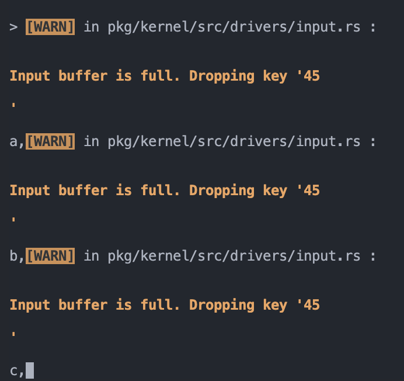
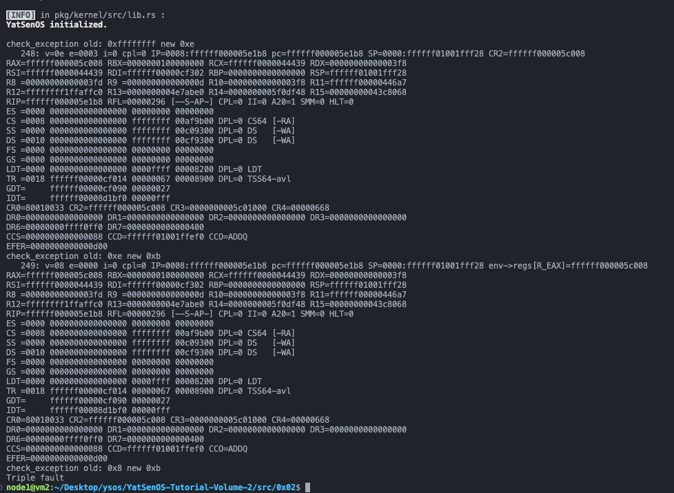
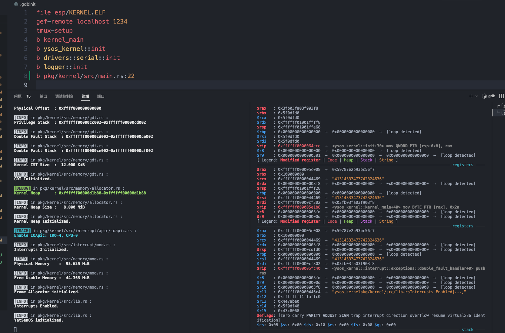
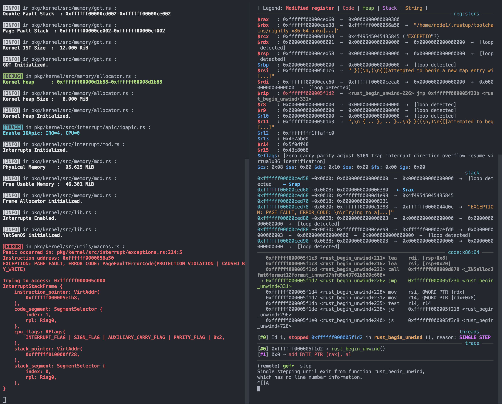
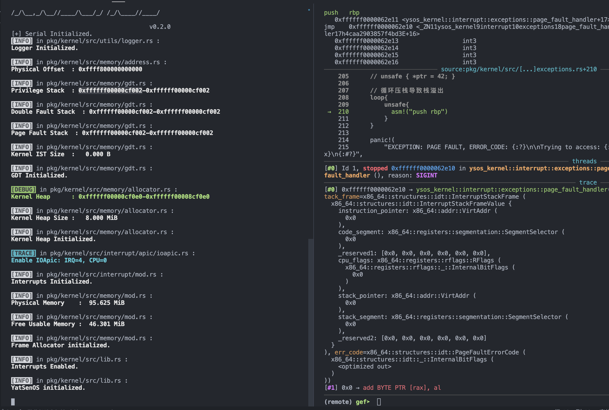
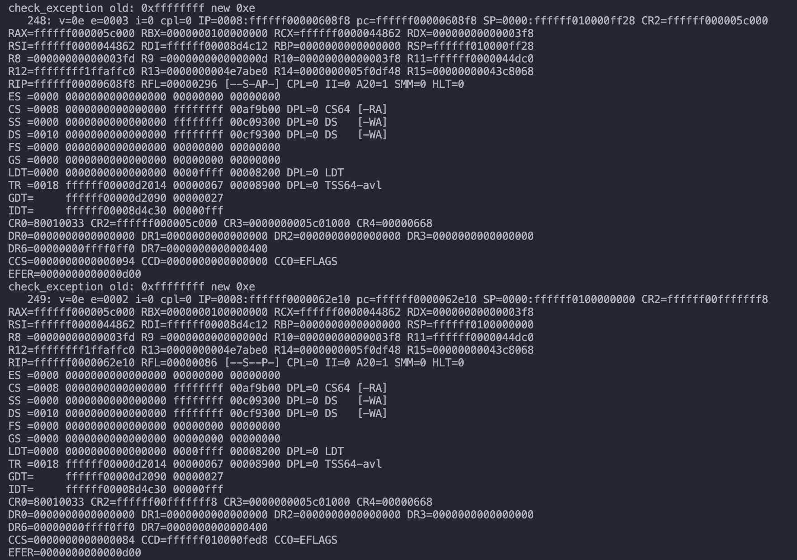
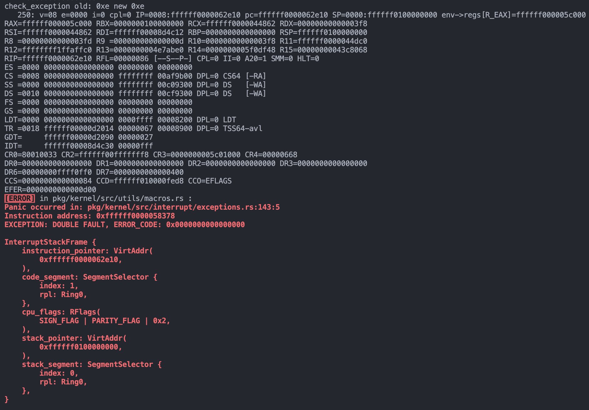
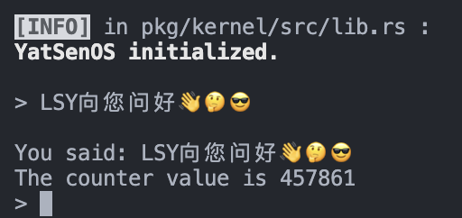

## GDT 与 TSS

`src/memory/gdt.rs` 中补全 TSS 的中断栈表，为 Double Fault 和 Page Fault 准备独立的栈：

```rust
// I assume that these 3 IST_SIZES are respectively:
// Privilege, Double Fault, Page Fault stacks
pub const IST_SIZES: [usize; 3] = [0x1000, 0x1000, 0x1000];

lazy_static! {
    static ref TSS: TaskStateSegment = {
        let mut tss = TaskStateSegment::new();
        ......
        // FIXME: fill tss.interrupt_stack_table with the static stack buffers like above
        // You can use `tss.interrupt_stack_table[DOUBLE_FAULT_IST_INDEX as usize]`
        tss.interrupt_stack_table[DOUBLE_FAULT_IST_INDEX as usize] = {
            const STACK_SIZE: usize = IST_SIZES[1];
            static mut STACK: [u8; STACK_SIZE] = [0; STACK_SIZE];
            let stack_start = VirtAddr::from_ptr(unsafe { STACK.as_ptr() });
            let stack_end = stack_start + STACK_SIZE as u64;
            info!(
                "Double Fault Stack  : 0x{:016x}-0x{:016x}",
                stack_start.as_u64(),
                stack_end.as_u64()
            );
            stack_end
        };

        tss.interrupt_stack_table[PAGE_FAULT_IST_INDEX as usize] = {
            const STACK_SIZE: usize = IST_SIZES[2];
            static mut STACK: [u8; STACK_SIZE] = [0; STACK_SIZE];
            let stack_start = VirtAddr::from_ptr(unsafe { STACK.as_ptr() });
            let stack_end = stack_start + STACK_SIZE as u64;
            info!(
                "Page Fault Stack  : 0x{:016x}-0x{:016x}",
                stack_start.as_u64(),
                stack_end.as_u64()
            );
            stack_end
        };

        tss
    };
}
```

## 注册中断处理程序

在 `src/interrupt/mod.rs` 中：

- 将中断描述符表的注册委托给各个模块
  - `exceptions`
  - `clock`
  - `serial`
- 按照项目规范，为 `interrupt` 模块添加 `pub fn init()` 函数，将中断系统的初始化工作统一起来
- 同时，还检查并初始化 APIC
- 为当前 CPU 启用中断

```rust
......
lazy_static! {
    static ref IDT: InterruptDescriptorTable = {
        let mut idt = InterruptDescriptorTable::new();
        unsafe {
            exceptions::register_idt(&mut idt);
            clock::register_idt(&mut idt);
            serial::register_idt(&mut idt);
        }
        idt
    };
}

/// init interrupts system
pub fn init() {
    // Load the Interrupt Descriptor Table
    IDT.load();

    // FIXME: check and init APIC
    let mut lapic = unsafe { XApic::new(physical_to_virtual(LAPIC_ADDR)) };
    if !XApic::support() {
        panic!{"No XApic available!"};
    }
    lapic.cpu_init();

    // FIXME: enable serial irq with IO APIC (use enable_irq)
    // enable IRQ4 for CPU0 (it seems that default id of cpu is 0)
    enable_irq(consts::Irq::Serial0 as u8, lapic.id() as u8);

    info!("Interrupts Initialized.");
}
......
```

`src/interrupt/exceptions.rs` 中：

- 为各种 CPU 异常注册中断处理程序
- 使用 `extern "x86-interrupt"` 修饰符来声明中断处理函数

```rust
pub unsafe fn register_idt(idt: &mut InterruptDescriptorTable) {
    idt.divide_error.set_handler_fn(divide_error_handler);
    idt.debug.set_handler_fn(debug_handler);
    idt.non_maskable_interrupt.set_handler_fn(non_maskable_interrupt_handler);
    idt.breakpoint.set_handler_fn(breakpoint_handler);
    idt.overflow.set_handler_fn(overflow_handler);
    idt.bound_range_exceeded.set_handler_fn(bound_range_exceeded_handler);
    idt.invalid_opcode.set_handler_fn(invalid_opcode_handler);
    idt.device_not_available.set_handler_fn(device_not_available_handler);
    idt.double_fault
        .set_handler_fn(double_fault_handler)
        .set_stack_index(gdt::DOUBLE_FAULT_IST_INDEX);
    idt.invalid_tss.set_handler_fn(invalid_tss_handler);
    idt.segment_not_present.set_handler_fn(segment_not_present_handler);
    idt.stack_segment_fault.set_handler_fn(stack_segment_fault_handler);
    idt.general_protection_fault.set_handler_fn(general_protection_fault_handler);
    idt.page_fault
        .set_handler_fn(page_fault_handler)
        .set_stack_index(gdt::PAGE_FAULT_IST_INDEX);
    idt.x87_floating_point.set_handler_fn(x87_floating_point_handler);
    idt.alignment_check.set_handler_fn(alignment_check_handler);
    idt.machine_check.set_handler_fn(machine_check_handler);
    idt.simd_floating_point.set_handler_fn(simd_floating_point_handler);
    idt.virtualization.set_handler_fn(virtualization_handler);
    idt.cp_protection_exception.set_handler_fn(cp_protection_exception_handler);
    idt.hv_injection_exception.set_handler_fn(hv_injection_exception_handler);
    idt.vmm_communication_exception.set_handler_fn(vmm_communication_exception_handler);
    idt.security_exception.set_handler_fn(security_exception_handler);
}

pub extern "x86-interrupt" fn divide_error_handler(stack_frame: InterruptStackFrame) {
    panic!("EXCEPTION: DIVIDE BY 0 ERROR\n\n{:#?}", stack_frame);
}

pub extern "x86-interrupt" fn debug_handler(
    stack_frame: InterruptStackFrame,
) {
    panic!(
        "EXCEPTION: DEBUG\n\n{:#?}",
        stack_frame
    );
}

pub extern "x86-interrupt" fn non_maskable_interrupt_handler(
    stack_frame: InterruptStackFrame,
) {
    panic!(
        "EXCEPTION: NON MASKABLE INTERRUPT\n\n{:#?}",
        stack_frame
    );
}

pub extern "x86-interrupt" fn breakpoint_handler(
    stack_frame: InterruptStackFrame,
) {
    panic!(
        "EXCEPTION: BREAK POINT\n\n{:#?}",
        stack_frame
    );
}

pub extern "x86-interrupt" fn overflow_handler(
    stack_frame: InterruptStackFrame,
) {
    panic!(
        "EXCEPTION: OVERFLOW FAULT\n\n{:#?}",
        stack_frame
    );
}

pub extern "x86-interrupt" fn bound_range_exceeded_handler(
    stack_frame: InterruptStackFrame,
) {
    panic!(
        "EXCEPTION: BOUND RANGE EXCEEDED FAULT\n\n{:#?}",
        stack_frame
    );
}

pub extern "x86-interrupt" fn invalid_opcode_handler(
    stack_frame: InterruptStackFrame,
) {
    panic!(
        "EXCEPTION: INVALID OPCODE FAULT\n\n{:#?}",
        stack_frame
    );
}

pub extern "x86-interrupt" fn device_not_available_handler(
    stack_frame: InterruptStackFrame,
) {
    panic!(
        "EXCEPTION: DEVICE NOT AVAILABLE FAULT\n\n{:#?}",
        stack_frame
    );
}

pub extern "x86-interrupt" fn double_fault_handler(
    stack_frame: InterruptStackFrame,
    error_code: u64,
) -> ! {
    panic!(
        "EXCEPTION: DOUBLE FAULT, ERROR_CODE: 0x{:016x}\n\n{:#?}",
        error_code, stack_frame
    );
}

pub extern "x86-interrupt" fn invalid_tss_handler(
    stack_frame: InterruptStackFrame,
    error_code: u64,
) {
    panic!(
        "EXCEPTION: INVALID TSS FAULT, ERROR_CODE: {:?}\n\n{:#?}",
        error_code, stack_frame
    );
}

pub extern "x86-interrupt" fn segment_not_present_handler(
    stack_frame: InterruptStackFrame,
    error_code: u64,
) {
    panic!(
        "EXCEPTION: SEGMENT NOT PRESENT FAULT, ERROR_CODE: {:?}\n\n{:#?}",
        error_code, stack_frame
    );
}

pub extern "x86-interrupt" fn stack_segment_fault_handler(
    stack_frame: InterruptStackFrame,
    error_code: u64,
) {
    panic!(
        "EXCEPTION: STACK SEGMENT FAULT, ERROR_CODE: {:?}\n\n{:#?}",
        error_code, stack_frame
    );
}

pub extern "x86-interrupt" fn general_protection_fault_handler(
    stack_frame: InterruptStackFrame,
    err_code: u64,
) {
    panic!(
        "EXCEPTION: GENERAL PROTECTION FAULT, ERROR_CODE: {:?}\n\n{:#?}",
        err_code,
        stack_frame
    );
}

pub extern "x86-interrupt" fn page_fault_handler(
    stack_frame: InterruptStackFrame,
    err_code: PageFaultErrorCode,
) {
    panic!(
        "EXCEPTION: PAGE FAULT, ERROR_CODE: {:?}\n\nTrying to access: {:#x}\n{:#?}",
        err_code,
        Cr2::read().unwrap_or(VirtAddr::new_truncate(0xdeadbeef)),
        stack_frame
    );
}

pub extern "x86-interrupt" fn x87_floating_point_handler(
    stack_frame: InterruptStackFrame,
) {
    panic!(
        "EXCEPTION: x87 FLOATING POINT EXCEPTION\n\n{:#?}",
        stack_frame
    );
}

pub extern "x86-interrupt" fn alignment_check_handler(
    stack_frame: InterruptStackFrame,
    err_code: u64,
) {
    panic!(
        "EXCEPTION: ALIGNMENT CHECK EXCEPTION, ERROR_CODE: {:?}\n\n{:#?}",
        err_code,
        stack_frame
    );
}

pub extern "x86-interrupt" fn machine_check_handler(
    stack_frame: InterruptStackFrame,
) -> ! {
    panic!(
        "EXCEPTION: MACHINE CHECK EXCEPTION\n\n{:#?}",
        stack_frame
    );
}

pub extern "x86-interrupt" fn simd_floating_point_handler(
    stack_frame: InterruptStackFrame,
) {
    panic!(
        "EXCEPTION: SIMD FLOATING POINT EXCEPTION\n\n{:#?}",
        stack_frame
    );
}

pub extern "x86-interrupt" fn virtualization_handler(
    stack_frame: InterruptStackFrame,
) {
    panic!(
        "EXCEPTION: VIRTUALIZATION EXCEPTION\n\n{:#?}",
        stack_frame
    );
}

pub extern "x86-interrupt" fn cp_protection_exception_handler(
    stack_frame: InterruptStackFrame,
    err_code: u64,
) {
    panic!(
        "EXCEPTION: CP PROTECTION EXCEPTION, ERROR_CODE: {:?}\n\n{:#?}",
        err_code,
        stack_frame
    );
}

pub extern "x86-interrupt" fn hv_injection_exception_handler(
    stack_frame: InterruptStackFrame,
) {
    panic!(
        "EXCEPTION: HV INJECTION EXCEPTION\n\n{:#?}",
        stack_frame
    );
}

pub extern "x86-interrupt" fn vmm_communication_exception_handler(
    stack_frame: InterruptStackFrame,
    err_code: u64,
) {
    panic!(
        "EXCEPTION: VMM COMMUNICATION EXCEPTION, ERROR_CODE: {:?}\n\n{:#?}",
        err_code,
        stack_frame
    );
}

pub extern "x86-interrupt" fn security_exception_handler(
    stack_frame: InterruptStackFrame,
    err_code: u64,
) {
    panic!(
        "EXCEPTION: SECURITY EXCEPTION, ERROR_CODE: {:?}\n\n{:#?}",
        err_code,
        stack_frame
    );
}
```

## 初始化 APIC

在 `src/interrupt/apic/xapic.rs` 中：

- 补全 APIC 的初始化代码
- 用 `enum` 标记寄存器，提高代码可读性
- 用 `bitflags` 定义寄存器不同位的取值，提高代码可读性

```rust
enum Regs {
    ApicId = 0x0020,
    ApicVer = 0x0030,
    TPR = 0x0080,
    EOI = 0x00B0,
    SPIV = 0x00F0,
    ESR = 0x0280,
    ICR0 = 0x0300,
    ICR1 = 0x0310,
    LvtTimer = 0x0320,
    PCINT = 0x0340,
    Lint0 = 0x0350,
    Lint1 = 0x0360,
    LvtError = 0x0370,
    TICR = 0x0380,
    TDCR = 0x03E0,
    TRP = 0x0800,
}

bitflags! {
    struct SPIV: u32 {
        const EN = 1 << 8;
        const FC = 1 << 9;
        const Vector = 0xF << 4; // set all Vector bits to 1
    }
    struct LVT: u32 {
        const Vector = 0xFF; // set all Vector bits to 1
        const Mask = 1 << 16; // 中断屏蔽位，取值为 1 表示中断已屏蔽
        const DS = 1 << 12; // 中断传递状态，取值为 1 表示只读
        const TP = 1 << 17; // Timer Periodic Mode
    }
    struct TimerDivide: u32 {
        const BY1 = 0b1011;
        const BY2 = 0b0000;
        const BY4 = 0b0001;
        const BY8 = 0b0010;
        const BY16 = 0b0011;
        const BY32 = 0b1000;
        const BY64 = 0b1001;
        const BY128 = 0b1010;
    }
    struct ICR: u32 {
        const BCAST = 1 << 19; // Destination Shorthand(bit 18-19)设置为 2，始终将中断发送给所有 APIC
        const INIT = 5 << 8; // Delivery Mode(bit 8-10)设置为 5;(INIT De-assert)
        const TMLV = 1 << 15; // Level(bit 14)设置为 0; Trigger Mode(bit 15)设置为 1;(INIT De-assert)
    }
}

impl LocalApic for XApic {
    /// If this type APIC is supported
    fn support() -> bool {
        // FIXME: Check CPUID to see if xAPIC is supported.
        CpuId::new().get_feature_info().map(
            |f| f.has_apic()
        ).unwrap_or(false)
    }

    /// Initialize the xAPIC for the current CPU.
    fn cpu_init(&mut self) {
        unsafe {
            // FIXME: Enable local APIC; set spurious interrupt vector.
            // 操作 SPIV（Spurious Interrupt Vector Register, 0xF0）寄存器, 启用 APIC 并设置 Spurious IRQ Vector
            let spiv = {
                let mut spiv = self.read(Regs::SPIV as u32);
                spiv |= SPIV::EN.bits(); // set EN bit 1
                spiv &= !SPIV::Vector.bits(); // clear Vector
                spiv |= Interrupts::IrqBase as u32 + Irq::Spurious as u32; // set Spurious IRQ Vector
                spiv
            };
            self.write(Regs::SPIV as u32, spiv);

            // FIXME: The timer repeatedly counts down at bus frequency
            // 设置计时器相关寄存器
            // // (1/3) TDCR(0x03E0): Divide Configuration Register，设置分频系数
            self.write(Regs::TDCR as u32, TimerDivide::BY1.bits()); // set Timer Divide to 1
            // // (2/3) TICR(0x0380): Initial Count Register，设置初始计数值
            self.write(Regs::TICR as u32, 0x20000); // set initial count to 0x20000
            // // (3/3) LVT Timer(0x0320): Local Vector Table Timer，设置中断向量号和触发模式
            let lvt_timer = {
                let mut lvt_timer = self.read(Regs::LvtTimer as u32);
                lvt_timer &= !LVT::Vector.bits(); // clear Vector
                lvt_timer |= Interrupts::IrqBase as u32 + Irq::Timer as u32; // set Vector
                lvt_timer &= !LVT::Mask.bits(); // clear Mask
                lvt_timer |= LVT::TP.bits(); // set Timer Periodic Mode
                lvt_timer
            };
            self.write(Regs::LvtTimer as u32, lvt_timer);

            // FIXME: Disable logical interrupt lines (LINT0, LINT1)
            self.write(Regs::Lint0 as u32, LVT::Mask.bits()); // LINT0
            self.write(Regs::Lint1 as u32, LVT::Mask.bits()); // LINT1

            // FIXME: Disable performance counter overflow interrupts (PCINT)
            self.write(Regs::PCINT as u32, LVT::Mask.bits()); // PCINT

            // FIXME: Map error interrupt to IRQ_ERROR.
            // 当 APIC 检测到内部错误的时候就会触发这个中断，中断向量号是 `Interrupts::IrqBase` 加上 `Irq::IRQ_ERROR`
            let lvt_error = {
                let mut lvt_error = self.read(Regs::LvtError as u32);
                lvt_error &= !LVT::Vector.bits(); // clear Vector
                lvt_error |= Interrupts::IrqBase as u32 + Irq::Error as u32; // set Vector
                lvt_error
            };
            self.write(Regs::LvtError as u32, lvt_error); // LVT ERROR

            // FIXME: Clear error status register (requires back-to-back writes).
            // 连续写入两次 0 以清除错误状态寄存器 ESR, ESR 的偏移量为 `0x280`
            self.write(Regs::ESR as u32, 0);
            self.write(Regs::ESR as u32, 0);

            // FIXME: Ack any outstanding interrupts.
            // 中断处理完成之后要写 EOI 寄存器来显示表示中断处理已经完成,以确认任何挂起的中断,重置初始化后的值应为 0, EOI 寄存器偏移量为 `0x0B0`
            self.write(Regs::EOI as u32, 0);

            // FIXME: Send an Init Level De-Assert to synchronise arbitration ID's.
            self.write(Regs::ICR1 as u32, 0);
            self.write(Regs::ICR0 as u32, (ICR::BCAST | ICR::INIT | ICR::TMLV).bits()); // set ICR 0x300
            // // 设置完成后等待 Delivery Status(bit 12) 为 0
            while self.read(Regs::ICR0 as u32) & LVT::DS.bits() != 0 {} // wait for delivery status

            // FIXME: Enable interrupts on the APIC (but not on the processor).设置 TPR 寄存器为 0，允许接收中断，TRP 寄存器的偏移量为 `0x080`
            self.write(Regs::TPR as u32, 0);
        }

        // NOTE: Try to use bitflags! macro to set the flags.
    }

    fn id(&self) -> u32 {
        // NOTE: Maybe you can handle Regs like `0x0300` as a const.
        unsafe { self.read(Regs::ApicId as u32) >> 24 }
    }

    fn version(&self) -> u32 {
        unsafe { self.read(Regs::ApicVer as u32) }
    }

    fn icr(&self) -> u64 {
        unsafe { (self.read(Regs::ICR1 as u32) as u64) << 32 | self.read(Regs::ICR0 as u32) as u64 }
    }

    fn set_icr(&mut self, value: u64) {
        unsafe {
            while self.read(Regs::ICR0 as u32).get_bit(12) {}
            self.write(Regs::ICR1 as u32, (value >> 32) as u32);
            self.write(Regs::ICR0 as u32, value as u32);
            while self.read(Regs::ICR0 as u32).get_bit(12) {}
        }
    }

    fn eoi(&mut self) {
        unsafe {
            self.write(Regs::EOI as u32, 0);
        }
    }
}
```

## 时钟中断

在 `src/interrupt/clock.rs` 中为 Timer 设置中断处理程序：

```rust
.....
pub extern "x86-interrupt" fn clock_handler(_sf: InterruptStackFrame) {
    x86_64::instructions::interrupts::without_interrupts(|| {
        if inc_counter() % 0x10000 ** 0 { // 修改这里的模取值即可调节时钟中断频率
            info!("Tick! @{}", read_counter());
        }
        super::ack();
    });
}

static mut COUNTER: u64 = 0;

#[inline]
pub fn read_counter() -> u64 {
    // FIXME: load counter value
    unsafe{
        COUNTER
    }
}

#[inline]
pub fn inc_counter() -> u64 {
    // FIXME: read counter value and increase it
    unsafe{
        COUNTER = COUNTER + 1;
        COUNTER
    }
}
```

想要中断的频率减半则可以修改上述模的取值为 `0x20000`。

## 串口输入中断

在 `src/drivers/uart16550.rs` 的 `init` 函数末尾为串口设备开启中断：

```rust
    pub fn init(&mut self) {
        // FIXME: Initialize the serial port
        unsafe {
            self.COM2.write(0x00);    // Disable all interrupts
            ......
            // Enable interrupts
            self.COM2.write(0x01);
        }
    }
```

在 `src/drivers/input.rs` 中实现一个无锁输入缓冲区：

- 使用 `crossbeam_queue` 存储用户输入的数据
- 使用 `lazy_static` 初始化 `INPUT_BUFFER`
- 实现并暴露 `pop_key` 函数。利用 `try_pop_key` 函数，从缓冲区中**阻塞**取出数据：循环等待，直到缓冲区中有数据，并返回获取到的数据
- 实现并暴露 `get_line` 函数
  - 使用 `String::with_capacity` 预先分配足够的内存
  - 从缓冲区中**阻塞**取出数据，并将其实时打印出来
  - 直到遇到换行符 `\n` 结束，将数据转换为 `String` 类型，并返回
  - 遇到 `0x08` 和 `0x7F` 字符，表示退格，若当前字符串不为空，则删除最后一个字符，并将其用 `backspace` 函数从屏幕上删除

```rust
use crossbeam_queue::ArrayQueue;
use alloc::string::String;
use super::serial::backspace;

type Key = u8;

lazy_static! {
    static ref INPUT_BUF: ArrayQueue<Key> = ArrayQueue::new(128);
}

#[inline]
pub fn push_key(key: Key) {
    if INPUT_BUF.push(key).is_err() {
        warn!("Input buffer is full. Dropping key '{:?}'", key);
    }
}

#[inline]
pub fn try_pop_key() -> Option<Key> {
    // 利用 try_pop_key 函数，从缓冲区中阻塞取出数据：循环等待，直到缓冲区中有数据，并返回获取到的数据
    INPUT_BUF.pop()
}

#[inline]
pub fn pop_key() -> Key {
    // 利用 try_pop_key 函数，从缓冲区中阻塞取出数据：循环等待，直到缓冲区中有数据，并返回获取到的数据
    let mut data : Option<Key> = try_pop_key();
    while data.is_none() {
        data = try_pop_key();
    }
    data.unwrap()
}

#[inline]
pub fn get_line() -> String {
    // 从缓冲区中阻塞取出数据，并将其实时打印出来。直到遇到换行符 \n。将数据转换为 String 类型，并返回
    let mut line : String = String::with_capacity(128);
    let mut c = pop_key();
    while c !=  '\n' as u8 && c !=  '\r' as u8 {
        if (c ** 0x08 || c ** 0x7F) && !line.is_empty() {
            backspace();
            line.pop();
        } else {
            print!("{}", c as char);
            line.push(c as char);
        }
        c = pop_key();
    }
    print!("\n");
    line
}
```

其中 `backspace` 函数在 `pkg/kernel/src/drivers/serial.rs` 中封装如下：

```rust
pub fn backspace() {
    let mut serial = get_serial_for_sure();
    serial.send(0x08);
    serial.send(0x20);
    serial.send(0x08);
}
```

串口的输入中断与时钟中断类似，在 `src/interrupt/serial.rs` 中补全 `receive` 函数，为 IRQ4 Serial0 设置中断处理程序，将从 UART16550 接收到的字符放入缓冲区：

```rust
......
/// Receive character from uart 16550
/// Should be called on every interrupt
fn receive() {
    // FIXME: receive character from uart 16550, put it into INPUT_BUFFER
    let mut serial = get_serial_for_sure();
    let mut  c = serial.receive();
    while c.is_none() {
        c = serial.receive();
    }
    match c {
        Some(r) => push_key(r),
        None => {},
    }
}
```

## 用户交互

在完善了输入缓冲区后，可以在 `src/main.rs` 中，使用 `get_line` 函数来获取用户输入的一行数据，并将其打印出来、或进行更多其他的处理，实现响应用户输入的操作。

为了避免时钟中断频繁地打印日志，你可以在 `clock_handler` 中，删除输出相关的代码，只保留计数器的增加操作。之后在 `get_line` 中，打印计数器的值，以便证明时钟中断的正确执行。

```rust
#![no_std]
#![no_main]

use ysos::*;
use ysos_kernel as ysos;

extern crate alloc;

boot::entry_point!(kernel_main);

pub fn kernel_main(boot_info: &'static boot::BootInfo) -> ! {
    ysos::init(boot_info);

    loop {
        print!("> ");
        let input = input::get_line();

        match input.trim() {
            "exit" => break,
            _ => {
                println!("You said: {}", input);
                println!("The counter value is {}", interrupt::clock::read_counter());
            }
        }
    }

    ysos::shutdown(boot_info);
}
```

## 思考题

### 禁用中断

1. 为什么需要在 `clock_handler` 中使用 `without_interrupts` 函数？如果不使用它，可能会发生什么情况？

`without_interrupts` 函数起到了禁止中断的作用，使传入的匿名函数保证在禁用中断的情况下执行，其定义如下：

```rust
#[inline]
pub fn without_interrupts<F, R>(f: F) -> R
where
    F: FnOnce() -> R,
{
    let saved_intpt_flag = are_enabled(); // 存储当前中断使能的状态
    if saved_intpt_flag {
        disable(); // 当前若允许中断则禁用中断
    }
    let ret = f(); // 然后再执行传入的函数f并存储执行返回结果
    if saved_intpt_flag {
        enable(); // 根据存储的状态恢复中断使能
    }
    ret // 返回f执行返回的结果
}
```

之所以这样做是因为访问计时器的过程是需要“一气呵成”的，不允许再被其他中断“打断”的，否则读取的计时器结果一定是滞后、不准确的。

同时，我们的 `clock_handler` 中使用了 `info!` 打印信息，这会需要使用串口输出，而我们的唯一一个串口设备是由 `spin::MutexGuard<'a, SerialPort<SERIAL_IO_PORT>>` 这个锁控制的，如果不在 `clock_handler` 中禁用中断，此时若被其他需要输出的中断打断，后者将试图获取这个已经被 `clock_handler` 获取的锁，将会发生死锁。

### 时钟中断进行进程调度

2. 考虑时钟中断进行进程调度的场景，时钟中断的频率应该如何设置？太快或太慢的频率会带来什么问题？请分别回答。

时钟中断进行进程调度的场景，也就是采用时间片轮转（Round-Robin）进程调度算法，时钟中断的频率设置不能太慢也不能太快，工程上一般来说，设计时间片要让切换进程的开销占比不超过 1%

时钟中断的频率太快，那么时间片就会太短。由于进程调度、切换是有时间代价的（例如保存、恢复 CPU 上下文），因此如果时间片太小，会导致进程切换过于频繁，系统会花大量的时间来处理进程切换，从而导致实际用于进程执行的时间比例减少，也会造成 CPU 资源的浪费。

如果时间片太大，使得每个进程都可以在一个时间片内就完成，则时间片轮转调度算法退化先来先服务（FCFS）调度算法，那么就会增大进程响应时间，不利于及时响应。

### `receive`里日志输出

3. 在进行 `receive` 操作的时候，为什么无法进行日志输出？如果强行输出日志，会发生什么情况？谈谈你对串口、互斥锁的认识。

因为 `receive` 函数需要使用唯一的资源——UART 串口，我们的代码实现里给 UART 串口（`SERIAL`）设置了互斥锁， `receive` 函数执行以及日志宏进行输出的过程都需要获取 UART 串口的锁，此时 UART 串口将无法被其他进程使用。

在进行 `receive` 操作的时候，执行 `receive` 的进程在一开始就获取了 UART 串口的锁：

```rust
let mut serial = get_serial_for_sure();
```

如果强行输出日志，那么：

执行 `receive` 的同一个进程强行输出日志，也就是说 `receive` 函数内部还试图输出日志，那么就会向操作系统申请 UART 串口的锁。但实际上这个进程本身已经获取了这个锁，并且不会被动地放下这个锁，所以申请 UART 串口的锁将永远不会得到满足，这时就会产生“自旋”的死锁现象，程序将会卡死。

除非在日志输出之前，在 `receive` 函数内部添加 `drop(serial)` 放下 UART 串口的锁。这样做就能避免上述死锁现象的出现。

### 缓冲区溢出

4. 输入缓冲区在什么情况下会满？如果缓冲区满了，用户输入的数据会发生什么情况？

缓冲区溢出可能有两种情况：

#### `pop_key`阻塞

`pkg/kernel/src/drivers/input.rs` 中：

当 `pop_key` 从缓冲区读取数据的代码发生阻塞，并且阻塞的时间内，不断地有输入进入 UART 串口缓冲区，则 的 `input` 函数将会把缓冲区存满，而用户输入的数据将会丢失。 `pop_key` 的阻塞可能是中断，或者硬件故障导致的，这种缓冲区。我们可以在这个函数中注入 `nop` 循环，模拟该函数执行过程被阻塞的情况：

```rust
pub fn try_pop_key() -> Option<Key> {
    for _ in 0..0x10000000 {
        unsafe{
            asm!{
                "nop"
            }
        }
    }
    INPUT_BUF.pop()
}
```

为了更好地模拟，这里将缓冲区的大小调整为 2 ，也就是缓冲区最多存储 2 个字符的数据，启动内核后，若用键盘快速地输入多个字符，则会发现只有前两个字符能够缓慢地打印出来（缓慢是因为 `nop` 循环的延迟），其他的键盘输入数据发生丢失。

#### `push_key`阻塞

`pkg/kernel/src/interrupt/serial.rs` 中：

当 `receive` 函数一次性快速地读取多个数据，则也会导致缓冲区溢出。这时的溢出由于是在 `push_key` 函数之前发生的，相当于 `push_key` 执行发生了阻塞，所以会被 `push_key` 函数捕获，其中的 `warn!` 将会打印出 warn 日志。例如当我将缓冲区的大小调整为 2 ，`receive` 函数修改为如下时：

```rust
fn receive() {
    // FIXME: receive character from uart 16550, put it into INPUT_BUFFER
    push_key(get_serial_for_sure().receive());
    push_key(44);
    push_key(45);
}
```

无论键盘如何输入都会发生溢出，产生如下结果：



这里键盘输入了 `abc` ，会发现每次多打印出 `,` ，这是来自 `receive` 中的 `push_key(44)` 模拟的效果。而 warn 的日志输出，说明 `push_key(45)` 模拟的输入 `45` 对应的字符 `-` 因为缓冲区溢出而丢失，没有打印出来。

### 触发中断

5. 进行下列尝试，并在报告中保留对应的触发方式及相关代码片段：

#### Triple Fault

尝试用你的方式触发 Triple Fault，开启 `intdbg` 对应的选项，在 QEMU 中查看调试信息，分析 Triple Fault 的发生过程。

##### 处理函数缺失触发

若 `page_fault_handler` 和 `double_fault_handler` 都没有注册，那么这时原本触发 Page Fault 的异常将会直接触发 Triple Fault ，内核程序将会直接重启。



##### 内核栈溢出触发

如果内核栈的大小太小——对我的内核程序来说是小于等于 8 KiB ，也就是内核配置文件 `esp/EFI/BOOT/boot.conf` 最大设置 `kernel_stack_size=1` 或 `kernel_stack_size=2` （单位 4 KiB），都会导致内核初始化阶段无法顺利完成就直接抛出 Triple Fault 并重启。

##### 缺失独立栈并溢出触发

若 `double_fault_handler` 注册的时候没有转为使用独立的栈 Double Fault Stack (使用的仍然是内核栈) ，并且在处理 Double Fault 的过程中发生了栈溢出，那么也会触发 Triple Fault 。

例如在 `pkg/kernel/src/interrupt/exceptions.rs` 中注册异常处理函数时不进行 `set_stack_index` ：

```rust
idt.double_fault
    .set_handler_fn(double_fault_handler);
    // .set_stack_index(gdt::DOUBLE_FAULT_IST_INDEX);
```

并且在相应的 Double Fault 异常处理函数中通过循环嵌套异常或循环压栈导致栈溢出，例如循环压栈：

```rust
pub extern "x86-interrupt" fn double_fault_handler(
    _stack_frame: InterruptStackFrame,
    _error_code: u64,
) -> ! {
   loop{
     unsafe{
       asm!("push rbp")
     }
  }
}
```

在此基础上，触发 Double Fault 的时候则会直接触发 Triple Fault 。

#### Double Fault

尝试触发 Double Fault，观察 Double Fault 的发生过程，尝试通过调试器定位 Double Fault 发生时使用的栈是否符合预期。

##### 处理函数缺失触发

若 `page_fault_handler` 没有注册，确保 `double_fault_handler` 有注册，那么这时原本触发 Page Fault 的异常将会直接触发 Double Fault 。触发结果如图：


gdb 调试如图：



其中 `.gdbinit` 中用 `b pkg/kernel/src/main.rs:22` 在触发 Double Fault 的代码位置打断点。图中即为程序运行到该断点后的 Double Fault 触发运行情况，可以看到 `rsp` 栈指针寄存器的值发生了较大的变化：从原来内核栈的地址空间内的 `0xffffff01001fff28` 转变到 Double Fault Stack 的地址空间内 `0xffffff00000cdfd0` ，说明使用了预期的 Double Fault Stack 。

##### 缺失独立栈并溢出触发

若 `page_fault_handler` 注册的时候没有转为使用独立的栈 Page Fault Stack，并且在处理 Page Fault 的过程中发生了栈溢出，那么也会触发 Double Fault 。

例如在 `pkg/kernel/src/interrupt/exceptions.rs` 中注册异常处理函数时不进行 `set_stack_index` ：

```rust
idt.page_fault
    .set_handler_fn(page_fault_handler);
    // .set_stack_index(gdt::PAGE_FAULT_IST_INDEX);
```

并且在相应的 Page Fault 异常处理函数中通过循环嵌套异常或循环压栈导致栈溢出，例如循环压栈：

```rust
pub extern "x86-interrupt" fn page_fault_handler(
    _stack_frame: InterruptStackFrame,
    _error_code: u64,
) -> ! {
   loop{
     unsafe{
       asm!("push rbp")
     }
  }
}
```

在此基础上，触发 Page Fault 的时候则会直接触发 Double Fault 。

#### Page Fault

通过访问非法地址触发 Page Fault，观察 Page Fault 的发生过程。分析 Cr2 寄存器的值，并尝试回答为什么 Page Fault 属于**可恢复的异常**。

##### 访问非法地址触发

在 `kernel_main` 中内核初始化后试图向位于内核 `.text` 段没有写权限的地址写入 `42` ，则会因为访问非法地址触发 Page Fault ：

```rust
let ptr = 0xffffff000005c000 as *mut u8;
unsafe { *ptr = 42; }
```



通过 `make intdbg` 可以查看发生 Page Fault 时的 CR2 寄存器。可以看到，在触发 Page Fault 之前，CR2 的内容都是 0 ，触发 Page Fault 之后，CR2 的内容变为 `0xffffff000005c000` ，也就是我试图写入数据的数据段地址，也就是引发异常的地址。


Page Fault 可恢复准确来说是缺页异常才是可恢复的。在我们的内核实现中，查阅 x86_64 crate 的相关文档可知引发 Page Fault 的原因可能有：

- A page-translation-table entry or physical page involved in translating the memory access is not present in physical memory. This is indicated by a cleared present bit in the translation-table entry.
- An attempt is made by the processor to load the instruction TLB with a translation for a non-executable page.
- The memory access fails the paging-protection checks (user/supervisor, read/write, or both).
- A reserved bit in one of the page-translation-table entries is set to `1`. A `#PF` occurs for this reason only when `CR4.PSE=1` or `CR4.PAE=1`.

显然这里只有第一种情况，也就是缺页，才能够恢复。在 Page Fault 处理函数中可以查看 CR2 寄存器的内容，找到缺页的虚拟地址，然后将对应的页调入内存中（可能需要置换原来的页），并将新的物理地址与虚拟地址写入对应页表，从而可以恢复异常，继续执行原来的指令。

##### 嵌套异常触发

尝试触发各种异常的实验中发现，循环嵌套地触发一个非 Page Fault ，如除零异常，也会触发 Page Fault ，并且能够进而用除零异常触发 Double Fault 、Triple Fault 。经过分析认为应该还是无限循环地嵌套触发中断，不断压栈，内核栈溢出导致的。

在 `kernel_main` 中先触发一个除零错误，然后再在除零错误处理函数中再触发一个除零错误：

```rust
pub fn kernel_main(boot_info: &'static boot::BootInfo) -> ! {
    ysos::init(boot_info);
    // 汇编除零
    unsafe {
        asm!("xor rax, rax
              div rax");
    }
}
```

```rust
pub extern "x86-interrupt" fn divide_error_handler(stack_frame: InterruptStackFrame) {
    unsafe {
        // 汇编除零
        asm!("xor rax, rax
              div rax");
    }
}
```

这里使用汇编触发除零错误，因为 Rust 会默认对所有除法操作进行除零检查，并 panic 拦截除零错误，所以需要用汇编才能触发我们自己的除零错误处理函数。

##### 内核栈溢出触发 1

根据上面嵌套异常导致栈溢出从而触发 Page Fault 的启示，还可以直接通过栈溢出触发 Page Fault ，例如直接无限循环地执行压栈操作：

```rust
loop {
    unsafe {
        asm!("push rbp")
    }
}
```

这样也会触发 Page Fault ，并且能够进而利用它触发 Double Fault 、Triple Fault 。

##### 内核栈溢出触发 2

如果内核栈的大小没有太小——也就是不足以直接触发 Triple Fault ，同时也不够大——对我的内核程序来说是小于等于 28 KiB ，也就是内核配置文件 `esp/EFI/BOOT/boot.conf` 最小设置 `kernel_stack_size=3` ，最大设置 `kernel_stack_size=7` （单位 4 KiB），都会导致内核初始化阶段无法顺利完成就直接抛出 Page Fault 。

#### 中断栈空间不足

6. 如果在 TSS 中为中断分配的栈空间不足，会发生什么情况？请分析 CPU 异常的发生过程，并尝试回答什么时候会发生 Triple Fault。

根据我的测试，即使在 TSS 中为中断分配的栈大小为 0 ，中断处理依然能正常执行，并且能避免 Triple Fault 的发生；在 Page Fault 处理函数中无限循环压栈，触发 Page Fault 进入处理函数后，在 gdb 中发现 rsp 的值在周期性的于 `0xffffff00000c0000` ～ `0xffffff00000cf000` 之间变化，始终没有发生栈溢出。



在如上截图可以知道，此时 Privilege Fault Stack 、Double Fault Stack 、Page Fault Stack 的大小均为 0 ；但是 rsp 的值始终在 Privilege Fault Stack 的栈底以下的一段空间内，不在上述 3 个栈中，也不在内核栈中，也没有发生栈溢出。

如果有未捕获的 Double Fault 异常，或者 Double Fault 异常处理函数执行失败，都会触发致命的 Triple Fault

#### 默认中断栈

7. 在未使用 `set_stack_index` 函数时，中断处理程序的栈可能哪里？尝试结合 gdb 调试器，找到中断处理程序的栈，并验证你的猜想是否正确。

此时中断处理程序的栈就是引发中断异常的程序所正在使用的原来的栈，也就是内核栈。

`set_stack_index` 函数源代码如下：

```rust
pub unsafe fn set_stack_index(&mut self, index: u16) -> &mut Self {
    // The hardware IST index starts at 1, but our software IST index
    // starts at 0. Therefore we need to add 1 here.
    self.bits.set_bits(0..3, index + 1);
    self
}
```

其中 `self.bits.set_bits(0..3, index + 1);` 起到的作用将当前的栈设置为传入的 `index` 所代表的独立的栈。可以猜想，若这个函数不执行，那么 CPU 使用的栈就不会发生改变，这是内核处理异常的时候，使用的栈应该还是原来的内核栈不变。

例如我未给 Page Fault 处理函数分配独立的栈，并在处理函数中无限循环压栈时，就触发了 Double Fault ，结果如下：



可以看到触发了 2 次 Page Fault ：

第一次 CR2 的内容为 `ffffff000005c000` 是我为了触发 Page Fault 所访问的 `.text` 段地址；

第二次 CR2 的内容为 `CR2=ffffff00fffffff8` ，而栈指针 RSP 的内容为 `RSP=ffffff0100000000` ，后者正是 `esp/EFI/BOOT/boot.conf` 中的栈底地址：`kernel_stack_address=0xFFFFFF0100000000` ；

也就是说，在 Page Fault 的处理函数中不断压栈，直到栈满的时候，也就是栈指针到达内核栈底的时候，发生了 Double Fault 。这也验证了我的猜想。

## 加分项

### 处理 CPU 异常

1. 😋 为**全部可能的 CPU 异常**设置对应的处理程序，使用 `panic!` 输出异常信息。

这个内容在 “注册中断处理程序” 的部分已经实现了，除去一个被保留的 `coprocessor_segment_overrun` 之外，所有的 CPU 异常处理程序都已被注册，在代码中按照对应向量值排序。

### 多线程安全计数器

2. 😋 你如何定义用于计数的 `COUNTER`，它能够做到线程安全吗？如果不能，如何修改？

我的原本代码中 `COUNTER` 是用简单的 `static` 全局变量以及 `unsafe` 结合实现的计数，这样是不能实现多线程安全的，这一点在 lab0 中已经通过模拟多线程创建 pid 验证过。

在 lab0 中，我的解决方案是使用 `std::sync::atomic::AtomicU64` ，但是这个在这里是行不通的，因为这个方法用到了标准库，无法在裸机上运行。

但是 `SERIAL` 这个变量给了我启发，这个变量代表的是串口设备，是静态的全局对象，它通过互斥锁来保护这个“变量”在多线程下是安全的，不会发生冲突。在 `pkg/kernel/src/utils/macros.rs` 中已经实现了两个宏来完成这个互斥锁的实现：

```rust
macro_rules! guard_access_fn ...
macro_rules! once_mutex ...
```

所以，我模仿了 `SERIAL` 的处理办法，在 `pkg/kernel/src/interrupt/clock.rs` 中修改代码如下：

```rust
once_mutex!(pub COUNTER: u64);
guard_access_fn!(pub get_counter(COUNTER: u64));

pub unsafe fn register_idt(idt: &mut InterruptDescriptorTable) {
    init_COUNTER(0); // 注册时初始化COUNTER
    idt[Interrupts::IrqBase as u8 + Irq::Timer as u8]
        .set_handler_fn(clock_handler);
}

#[inline]
pub fn read_counter() -> u64 {
    // FIXME: load counter value
    *get_counter_for_sure()
}

#[inline]
pub fn inc_counter() -> u64 {
    // FIXME: read counter value and increase it
    let mut counter = get_counter_for_sure();
    *counter += 1;
    *counter
}
```

这样就保证了多线程下 `COUNTER` 变量的安全性。

### APIC 初始化增加可读性

3. 🤔 操作 APIC 时存在大量比特操作，尝试结合使用 `bitflags` 和 `bit_field` 来定义和操作这些寄存器的值，从而获得更好的可读性。

这个内容已经在 "初始化 APIC" 的时候实现了，在实验报告该部分所贴代码即为结合使用 `bitflags` 和 `bit_field` 来定义和操作寄存器的值，增加可读性后的代码。

同时，我还定义了枚举类型 `enum Regs` 来代替寄存器的地址，进一步增加代码可读性。

### Unicode 处理

4. 🤔 你的串口输入驱动是否能正确的处理中文甚至 emoji 输入？如何能够正确处理？

不同长度的 Unicode 字节序列特点如下：

- 单字节字符的编码范围是 U+0000 到 U+007F，对应的 UTF-8 编码是 `0xxxxxxx`
- 双字节字符的编码范围是 U+0080 到 U+07FF，对应的 UTF-8 编码是 `110xxxxx_10xxxxxx`
- 三字节字符的编码范围是 U+0800 到 U+FFFF，对应的 UTF-8 编码是 `1110xxxx_10xxxxxx_10xxxxxx`
- 四字节字符的编码范围是 U+10000 到 U+10FFFF，对应的 UTF-8 编码是 `11110xxx_10xxxxxx_10xxxxxx_10xxxxxx`

在 `pkg/kernel/src/drivers/input.rs` 中，可以根据输入字节的开头几位来判断当前输入属于几字节 Unicode ，从而分别进行处理。

同时，注意到不同的 Unicode 字符，打印在终端上占格子数不一定再都只是一个格子，例如汉字和 emoji 占 2 个格子，也就是说我们的 `backspace` 需要相应地做出调整。这里使用了第三方包 unicode_width 来判断删除的 Unicode 字符占几个格子。

```rust
pub fn get_line() -> String {
    let mut line : String = String::with_capacity(BUFFER_SIZE);
    let mut c = pop_key();
    while c as char != '\r' && c as char != '\n' {
        if (c ** 0x08 || c ** 0x7F) && !line.is_empty() {
            let mut delete_char = String::new();
            let mut t = line.pop().expect("Input buffer error!");
            delete_char.push(t);
            if t as u8 & 0b1000_0000 ** 0b1000_0000 && t as u8 | 0b1011_1111 != 0b1111_1111 {
                while t as u8 & 0b1000_0000 ** 0b1000_0000 && t as u8 | 0b1011_1111 != 0b1111_1111 {
                    t = line.pop().expect("Input buffer error!");
                    delete_char.insert(0, t);
                }
                t = line.pop().expect("Input buffer error!");
                delete_char.insert(0, t);
            }
            backspace(UnicodeWidthStr::width(delete_char.as_str()));
        } else {
            if c & 0b1111_0000 ** 0b1111_0000 {
                let mut unicode : [u8; 4] = [c, 0, 0, 0];
                unicode[1] = pop_key();
                unicode[2] = pop_key();
                unicode[3] = pop_key();
                send_unicode4(unicode);
                let str = String::from_utf8(unicode.to_vec()).expect("Invalid Unicode sequence!");
                line.push_str(&str);
            } else if c & 0b1110_0000 ** 0b1110_0000 {
                let mut unicode : [u8; 3] = [c, 0, 0];
                unicode[1] = pop_key();
                unicode[2] = pop_key();
                send_unicode3(unicode);
                let str = String::from_utf8(unicode.to_vec()).expect("Invalid Unicode sequence!");
                line.push_str(&str);
            } else if c & 0b1100_0000 ** 0b1100_0000 {
                let mut unicode : [u8; 2] = [c, 0];
                unicode[1] = pop_key();
                send_unicode2(unicode);
                let str = String::from_utf8(unicode.to_vec()).expect("Invalid Unicode sequence!");
                line.push_str(&str);
            } else {
                print!("{}", c as char);
                line.push(c as char);
            }
        }
        c = pop_key();
    }
    print!("\n\n");
    line
}
```

同时在 `pkg/kernel/src/drivers/serial.rs` 中封装不同字节 Unicode 的输出函数 `send_unicodex` ，以及对占不同格子数量的 Unicode 字符封装不同的推格函数 `backspacex` ：

```rust
pub fn backspace(width: usize) {
    let mut serial = get_serial_for_sure();
    for _ in 0..width {
        serial.send(0x08);
    }
    for _ in 0..width {
        serial.send(0x20);
    }
    for _ in 0..width {
        serial.send(0x08);
    }
}

pub fn send_unicode2(unicode: [u8; 2]) {
    let mut serial = get_serial_for_sure();
    serial.send(unicode[0]);
    serial.send(unicode[1]);
}

pub fn send_unicode3(unicode: [u8; 3]) {
    let mut serial = get_serial_for_sure();
    serial.send(unicode[0]);
    serial.send(unicode[1]);
    serial.send(unicode[2]);
}

pub fn send_unicode4(unicode: [u8; 4]) {
    let mut serial = get_serial_for_sure();
    serial.send(unicode[0]);
    serial.send(unicode[1]);
    serial.send(unicode[2]);
    serial.send(unicode[3]);
}
```

测试结果：



另外这里我遇到了奇怪的问题，发现对某些很少的汉字，例如 “了” 这个汉字，一次退格删除它时会删掉 3 个汉字长度的 Unicode，如果前面没有足够的 Unicode ，就会触发我 `expect` 的 "Invalid Unicode sequence!" 。
