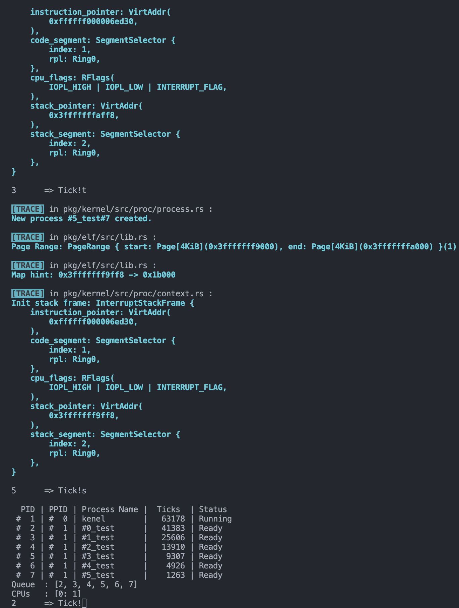
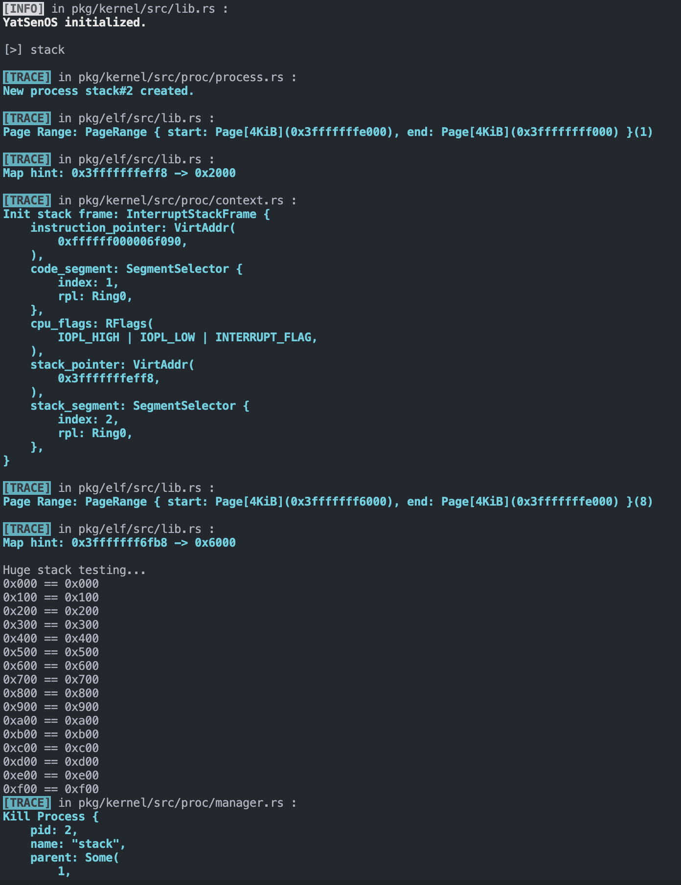
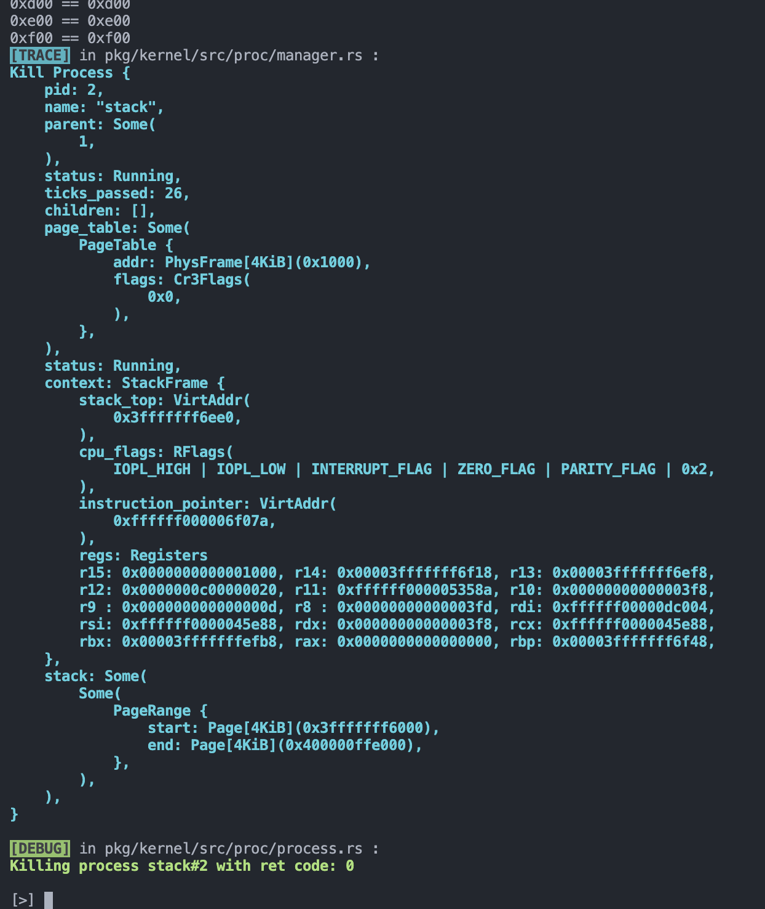
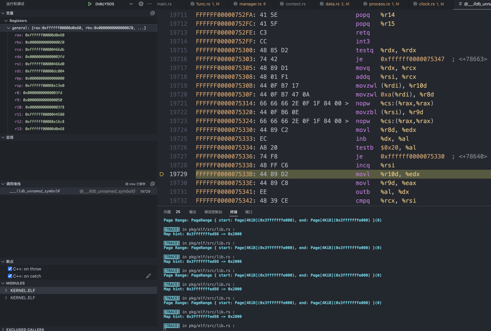

## 进程管理器的初始化

在 `src/proc/mod.rs` 中，

1. 设置内核相关信息

   根据 `esp/EFI/BOOT/boot.conf` 的配置，定义：`pub const KSTACK_DEF_PAGE: u64 = 512;`

   在 `init` 中，设置内核栈：

   ```rust
   // Done // FIXME: set the kernel stack
   kproc_data.set_stack(VirtAddr::new(KSTACK_INIT_TOP), KSTACK_DEF_SIZE);
   ```

2. 创建内核结构体

   调用 `Process::new` 函数，创建内核进程：

   - 内核进程的 PID 应为 `1` ；

   - 内核进程没有父进程，直接传入 `None` ；

   - 使用 `PageTableContext::new()` 加载当前 `Cr3` 寄存器的内容，传入内核进程的页表

   ```rust
   // kernel process
   let kproc = {
       // Done /* FIXME: create kernel process */
       Process::new(
           alloc::string::ToString::to_string(&"kernel"),
           None,
           PageTableContext::new(),
           Some(kproc_data)
       )
   };
   ```

内核进程的初始化状态在创建后，进程将会被传递至 `manager::init()` 函数。

在 `pkg/kernel/src/proc/manager.rs` 的 `init` 中将初始化进程设置为当前唯一正在运行的进程：

- 设置内核进程的状态为 `Running`；
- 并将其 PID 加载至当前的 CPU 核心结构体中；

```rust
// Done // FIXME: set init process as Running
init.write().resume();

// Done // FIXME: set processor's current pid to init's pid
set_pid(init.pid());
```

最后，在 `lib.rs` 中调用 `proc::init` 初始化进程管理器：

```rust
pub mod proc;
......
pub fn init(boot_info: &'static BootInfo) {
    ......
    memory::allocator::init(); // init kernel heap allocator
    proc::init(); // init process manager
    interrupt::init(); // init interrupts
    ......
```

## 进程调度的实现

修改时钟中断的内容，移除上次实验中的计数器等模块，并参考 `DOUBLE_FAULT_IST_INDEX` 的分配处理和声明，**在 TSS 中声明一块新的中断处理栈，并将它加载到时钟中断的 IDT 中**。

```rust
......
pub const DOUBLE_FAULT_IST_INDEX: u16 = 0;
pub const PAGE_FAULT_IST_INDEX: u16 = 1;
pub const CLOCK_IST_INDEX: u16 = 2;
pub const IST_SIZES: [usize; 4] = [0x1000, 0x1000, 0x1000, 0x1000];
......
lazy_static! {
    static ref TSS: TaskStateSegment = {
        ......
        tss.interrupt_stack_table[CLOCK_IST_INDEX as usize] = {
            const STACK_SIZE: usize = IST_SIZES[3];
            static mut STACK: [u8; STACK_SIZE] = [0; STACK_SIZE];
            let stack_start = VirtAddr::from_ptr(unsafe { STACK.as_ptr() });
            let stack_end = stack_start + STACK_SIZE as u64;
            info!(
                "Clock Inturrupt Stack  : 0x{:016x}-0x{:016x}",
                stack_start.as_u64(),
                stack_end.as_u64()
            );
            stack_end
        };
        ......
```

利用 `as_handler` 宏重新定义中断处理函数，在其中调用 `crate::proc::switch` 函数，进行进程调度切换：

```rust
once_mutex!(pub COUNTER: u64);
guard_access_fn!(pub get_counter(COUNTER: u64));

pub unsafe fn register_idt(idt: &mut InterruptDescriptorTable) {
    init_COUNTER(0);
    idt[Interrupts::IrqBase as u8 + Irq::Timer as u8]
        .set_handler_fn(clock_handler)
        .set_stack_index(gdt::CLOCK_IST_INDEX); // 分配独立栈
}

#[inline]
pub fn read_counter() -> u64 {
    *get_counter_for_sure()
}

#[inline]
pub fn inc_counter() -> u64 {
    let mut counter = get_counter_for_sure();
    *counter += 1;
    *counter
}

pub extern "C" fn clock(mut context: ProcessContext) {
    // do something
    x86_64::instructions::interrupts::without_interrupts(|| {
        if inc_counter() % 0x100 ** 0 { // 设置时间片为 100 ()
            crate::proc::switch(&mut context);
        }
        super::ack();
    });
}

as_handler!(clock);
```

之后在 `src/proc/mod.rs` 中，补全 `switch` 函数的实现：

```rust
pub fn switch(context: &mut ProcessContext) {
    x86_64::instructions::interrupts::without_interrupts(|| {
        // Done // FIXME: switch to the next process
        //      - save current process's context
        //      - handle ready queue update
        //      - restore next process's context
        let process_manager = get_process_manager();
        process_manager.save_current(&context);
        process_manager.push_ready(get_pid());
        process_manager.switch_next(context);
    });
}
```

这里禁用了中断，避免切换进程的过程被打断。

在 `pkg/kernel/src/proc/manager.rs` 中补全 `save_current` 和 `switch_next` 函数:

```rust
pub fn save_current(&self, context: &ProcessContext) {
    // Done // FIXME: update current process's tick count
    self.current().write().tick();

    // Done // FIXME: save current process's context
    self.current().write().save(context);
}
pub fn switch_next(&self, context: &mut ProcessContext) -> ProcessId {

    // Done // FIXME: fetch the next process from ready queue
    let mut ready_queue = self.ready_queue.lock();
    let mut next_process_pid = ready_queue.pop_front().expect("Ready Queue Empty!");
    let mut next_process_pcb = self.get_proc(&next_process_pid).expect("Get PCB Error");

    // Done // FIXME: check if the next process is ready,
    //        continue to fetch if not ready
    while next_process_pcb.read().status() != ProgramStatus::Ready {
        next_process_pid = ready_queue.pop_front().expect("Ready Queue Empty!");
        next_process_pcb = self.get_proc(&next_process_pid).expect("Get PCB Error");
    }

    drop(ready_queue);

    // Done // FIXME: restore next process's context
    self.current().write().restore(context);

    // Done // FIXME: update processor's current pid
    set_pid(next_process_pid);

    // Done // FIXME: return next process's pid
    next_process_pid
}
```

同时，还需要补全 `pkg/kernel/src/proc/process.rs` 中的 `ProcessInner` 的 `save` 和 `restore` 方法，这一点在实验文档中没有指出，而代码中由于调用这两个方法使用的是 `RwLockWriteGuard<ProcessInner>` ，编译器 IDE 环境没有很好地处理这里的依赖关系。

```rust
/// Save the process's context
/// mark the process as ready
pub(super) fn save(&mut self, context: &ProcessContext) {
    // Done // FIXME: save the process's context
    self.context.save(context);

    self.is_ready(); // 标记换下 CPU 的进程为就绪
}

/// Restore the process's context
/// mark the process as running
pub(super) fn restore(&mut self, context: &mut ProcessContext) {
    // Done // FIXME: restore the process's context
    self.context.restore(context);

    // Done // FIXME: restore the process's page table
    self.clone_page_table().load();

    self.resume(); // 标记换上 CPU 的进程为正在运行
}
```

## 进程信息的获取

### 环境变量

你补全 `src/proc/mod.rs` 中的 `env` 函数，使得外部函数可以获取到当前进程的环境变量。

尝试获取当前进程的读锁，并查询 `ProcessData` 的 `env` 函数。在期望中，这一操作只需要一行代码即可完成。

```rust
pub fn env(key: &str) -> Option<String> {
    x86_64::instructions::interrupts::without_interrupts(|| {
        // Done // FIXME: get current process's environment variable
        get_process_manager().current().read().env(key)
    })
}
```

### 进程返回值

在 `pkg/kernel/src/proc/manager.rs` 为 `ProcessManager` 添加 `get_exit_code` 方法获取指定进程的返回值。使用 `Option` 来作为这一调用的结果，如果该值为 `None`，则说明进程还没有退出，如果该值为 `Some`，则说明进程已经退出，可以获取到进程的返回值：

```rust
pub fn get_exit_code(&self, pid: ProcessId) -> Option<isize>{
    self.get_proc(&pid)
        .expect("Process not exist!")
        .read()
        .exit_code()
}
```

在 `pkg/kernel/src/proc/mod.rs` 中定义 `get_exit_code` 函数，供外部调用，同样使用 `Option` 来作为这一调用的结果：

```rust
pub fn get_exit_code(pid: ProcessId) -> Option<isize> {
    x86_64::instructions::interrupts::without_interrupts(|| {
        get_process_manager().get_exit_code(pid)
    })
}
```

最后在 `src/utils/mod.rs` 中，补全 `wait` 函数，使用 `proc::get_exit_code` 获取 Exit Code :

```rust
fn wait(pid: ProcessId) {
    loop {
        // Done // FIXME: try to get the status of the process
        let exit_code = get_exit_code(pid);

        // HINT: it's better to use the exit code
        if exit_code.is_none() {
            x86_64::instructions::hlt();
        } else {
            break;
        }
    }
}
```

## 内核线程的创建

补全 `pkg/kernel/src/proc/manager.rs` 中的 `spawn_kernel_thread` 函数：

```rust
pub fn spawn_kernel_thread(
    &self,
    entry: VirtAddr,
    name: String,
    proc_data: Option<ProcessData>,
) -> ProcessId {
    let kproc = self.get_proc(&KERNEL_PID).unwrap();
    let page_table = kproc.read().clone_page_table();
    let proc = Process::new(name, Some(Arc::downgrade(&kproc)), page_table, proc_data);

    // alloc stack for the new process base on pid
    let stack_top = proc.alloc_init_stack();

    // Done // FIXME: set the stack frame
    proc.write().set_stack(stack_top, STACK_DEF_SIZE);

    proc.write().init_stack_frame(entry, stack_top);

    // Done // FIXME: add to process map
    let pid = proc.pid();
    self.add_proc(pid, proc);

    // Done // FIXME: push to ready queue
    self.push_ready(pid);

    // Done // FIXME: return new process pid
    pid
}
```

在 `pkg/kernel/src/proc/process.rs` 中给 `ProcessInner` 增加 `init_stack_frame` 方法，利用 `ProcessContext` 的 `init_stack_frame` 函数来将栈顶地址、待执行函数的入口地址放入初始化的进程栈帧中：

```rust
pub fn init_stack_frame(&mut self, entry: VirtAddr, stack_top: VirtAddr) {
    self.context.init_stack_frame(entry, stack_top);
}
```

### 阶段性成果

我连续地执行了几次 `test` ，结果如下：



可以看到这里一共创建了除了内核程序之外的 6 个进程。每次 `ps` 之后，就绪队列都只有这 6 个进程，没有重复或缺漏。

并且，由 `TRACE` 日志打印出来的 `stack_segment` 可以看出，新的进程符合预期地使用了新的栈。

## 缺页异常的处理

在操作系统进行虚拟内存管理的时候经常会遇到缺页中断，作为可恢复的异常，它发生的可能性有很多：

- 内存页被标记为懒分配，只有当进程访问到这一页面时才会被分配。
- 部分可执行的代码段尚未被加载到内存中，需要从磁盘文件进行加载。
- 内存被交换到了磁盘上，再次使用需要交换回来。
- 内存页面被标记为只读，在进程尝试写页面的时候触发了 COW（Copy on Write）机制，需要进行页面的复制。
- 进程访问量权限不允许的内存区域，比如用户态进程尝试访问内核空间的内存。
- ......

在本实验设计中，并不会完全的实现上述的所有功能，只实现一个功能来作为缺页异常处理的示例：**为栈空间进行自动扩容。**

之前的内容中，提及了有关内存布局的相关设定，在本实验的 OS 中，每一个进程的栈空间最大为 4GiB。在初始化时，从栈顶（此进程具有的 4 GiB 的最大位置）开始，向下分配了 4 KiB 的栈空间。当进程使用的栈一直增长，直到超过了 4 KiB 的栈空间时，就会触发缺页异常。

!!! note "栈导致的缺页异常"

    在栈缺页导致的异常被触发的时候，当前访问的地址常常会与原来的栈有着**不止一个页面的差距**。

    这是因为对于一个栈需求很大的函数执行时，`rsp` 寄存器的值被直接减去了很大的值，并且为了访问栈上的变量，一些很大的偏移也会在接下来的访存中被使用。

    因此，虽然栈是逐渐增长的，但处理栈扩容时，仅仅对当前触发缺页异常的页面进行分配是不够的，为了防止过多的缺页异常，需要一次性为栈分配更多的页面。

在触发缺页异常时，尝试访问的地址会被保存在 `Cr2` 寄存器中，同时缺页异常的错误码也会随着中断栈一起传递给中断函数。

### 重定义 Page Fault 处理函数

在 `src/interrupt/exception.rs` 中，重新定义缺页异常的处理函数：

```rust
pub extern "x86-interrupt" fn page_fault_handler(
    stack_frame: InterruptStackFrame,
    err_code: PageFaultErrorCode,
) {
    let triggered_address = Cr2::read().expect("Stack address of this process not valid!");
    if !crate::proc::handle_page_fault(triggered_address, err_code) {
        warn!(
            "EXCEPTION: PAGE FAULT, ERROR_CODE: {:?}\n\nTrying to access: {:#x}\n{:#?}",
            err_code,
            triggered_address,
            stack_frame
        );
        // Done // FIXME: print info about which process causes page fault?
        panic!("Cannot handle page fault!");
    }
}
```

### 检查是否可恢复的逻辑

在 `ProcessManager` 中，检查缺页异常是否包含越权访问或其他非预期的错误码：

- 如果缺页异常是由于非预期异常导致的，或者缺页异常的地址不在当前进程的栈空间中，直接返回 `false`；
- 如果缺页异常的地址在当前进程的栈空间中，把缺页异常的处理委托给当前的进程

```rust
pub fn handle_page_fault(&self, addr: VirtAddr, err_code: PageFaultErrorCode) -> bool {
    // Done // FIXME: handle page fault
    let current_proc = self.current();
    // 如果缺页异常不是由于非预期异常导致的，而且缺页异常的地址在当前进程的栈空间中
    if !err_code.contains(PageFaultErrorCode::PROTECTION_VIOLATION) && current_proc.read().is_on_stack(addr){
        current_proc.write().alloc_and_set_more_stack(addr);
        return true
    }
    false
}
```

### 检查缺页地址是否在栈上

对当前进程调用了 `is_on_stack` 方法检查缺页地址是否在栈上，并补全 `pkg/kernel/src/proc/data.rs` 中的 `is_on_stack` 方法：

```rust
pub fn is_on_stack(&self, addr: VirtAddr) -> bool {
    // Done // FIXME: check if the address is on the stack
    let stack_start_address = self.stack_segment
        .expect("Failed to get stack segment information of this process!")
        .start
        .start_address()
        .as_u64();
    addr.as_u64() & STACK_START_MASK ** stack_start_address & STACK_START_MASK
}
```

#### 困难及解决

这里我遇到过困难—— `stack_test` 一直失败，经过排查发现这里出现了问题，我的问题代码是这样的：

```rust
pub fn is_on_stack(&self, addr: VirtAddr) -> bool {
    let stack_start_page = self.stack_segment.expect("Failed to get stack segment information of this process!").start;
    let triggered_page = Page::<Size4KiB>::containing_address(addr);
    let offset_pages = stack_start_page - triggered_page;
    offset_pages >= 0 && offset_pages < STACK_MAX_PAGES
}
```

这里我的思路是计算缺页地址和栈顶相差的页的偏移量 `offset_pages = stack_start_page - triggered_page` ，如果该偏移量位于区间 `[0, STACK_MAX_PAGES)` ，则缺页地址是位于栈内的。但是这样的实现出现了报错，判断总是返回 `false` ，无法正确处理 Page Fault 。

解决困难的关键是注意到 `STACK_START_MASK=0xFFFFFFFF00000000` 这个参考代码中定义的常量，这个变量在实验文档里也有介绍，利用它作掩码可以方便地判断两个地址是否位于同一进程的栈地址空间内，如果地址十六进制码的高 8 位相同，那就表明两个地址位于同一个进程栈中，因为这里我们定义的一个进程栈最大大小就是 `0x100000000`，也就是 4 GiB ：

```rust
pub const PAGE_SIZE: u64 = 0x1000;
pub const STACK_MAX_PAGES: u64 = 0x100000;
pub const STACK_MAX_SIZE: u64 = STACK_MAX_PAGES * PAGE_SIZE;
```

所以 `addr.as_u64() & STACK_START_MASK ** stack_start_address & STACK_START_MASK` 返回的结果为 `true` 时两个地址就位于同一个进程栈内，否则异常地址不在进程栈内无法通过栈增长解决。

### 分配新的栈

为 `ProcessInner` 添加用于分配新的栈、更新进程存储信息的函数 `alloc_and_set_more_stack` ，实现：

- 分配新的页面
- 更新页表
- 更新进程数据中的栈信息

```rust
pub fn alloc_and_set_more_stack(&mut self, addr: VirtAddr) {
    let stack_bottom_page = self.stack_segment
        .expect("Failed to get stack segment information of this process!")
        .start;
    let stack_top_page = self.stack_segment
        .expect("Failed to get stack segment information of this process!")
        .end;
    let triggered_page = Page::<Size4KiB>::containing_address(addr);
    let offset_pages = stack_bottom_page - triggered_page;
    let frame_allocator = &mut *get_frame_alloc_for_sure();
    let mut page_table = self.page_table
        .as_ref()
        .expect("Failed to get page table of kernel process!")
        .mapper();
    elf::map_range(
        addr.as_u64(),
        offset_pages,
        &mut page_table,
        frame_allocator,
    ).expect("Failed to map more stack!");
    let proc_data = self.proc_data
        .as_mut()
        .expect("Failed to get process data while trying to set more stack!");
    proc_data.stack_segment = Some(
    PageRange {
        start: triggered_page,
            end: stack_top_page,
        }
    );
}
```

这里我分配新栈时，新栈的大小是依据触发缺页异常的地址和当前栈底的地址确定的，分配这两个地址为边界，包括缺页异常地址所在页面的所有页面，这样的

## 进程的退出

在 `pkg/kernel/src/proc/process.rs` 中补全 `ProccessInner` 的 `kill` 方法，实现：

1. 调用 `exit_code` 方法存储进程的返回值，以便其他进程可以利用它来查询进程的退出状态
2. 在进程退出时，将进程的状态设置为 `Dead`
3. 删除进程运行时需要的部分数据 `proc_data`

```rust
pub fn kill(&mut self, ret: isize) {
    // Done // FIXME: set exit code
    self.exit_code = Some(ret);

    // Done // FIXME: set status to dead
    self.status = ProgramStatus::Dead;

    // Done // FIXME: take and drop unused resources
    self.proc_data = None;
}
```

另外还要确保进程不会被再次调度，这已经在 在 `pkg/kernel/src/proc/manager.rs` 中的 `switch_next` 函数通过在切换时添加检查、防止进程再次进入就绪队列实现。

### 阶段性成果





可以看到这个测试创建了的非常大的栈被正确地处理，打印信息可以看出栈大小为 `0x4000` Byte ，比默认初始大小 `0x1000` Byte 是要大的，经过栈增长处理，不会导致进程的崩溃。

等待这一进程结束运行后， `kill` 顺利删掉了这个进程，再进行下一步的操作。

## 思考题

### 初始`ProcessManager`

1. 为什么在初始化进程管理器时需要将它置为正在运行的状态？能否通过将它置为就绪状态并放入就绪队列来实现？这样的实现可能会遇到什么问题？

初始化进程管理器的时候，如果不设置为正在运行的状态，那么初始化结束后，OS 一开始就没有进程正在运行，那么：

- 内核进程没有被创建。这显然是不可能的，因为操作系统运行的第一个进程就是内核进程，没有别的进程可以创建内核进程
- 内核进程被创建了，但是没有在运行，而是处于就绪态位于就绪队列中。那么初始化结束后，ProcessManager 要做的第一件事就是在第一个时钟中断的时候：
  1. 将就绪队列的内核进程调上 CPU ，

### 解引用 trait

2. 在 `src/proc/process.rs` 中，有两次实现 `Deref` 和一次实现 `DerefMut` 的代码，它们分别是为了什么？使用这种方式提供了什么便利？

它们的源代码如下：

```rust
impl core::ops::Deref for Process {
    type Target = Arc<RwLock<ProcessInner>>;

    fn deref(&self) -> &Self::Target {
        &self.inner
    }
}

impl core::ops::Deref for ProcessInner {
    type Target = ProcessData;

    fn deref(&self) -> &Self::Target {
        self.proc_data
            .as_ref()
            .expect("Process data empty. The process may be killed.")
    }
}

impl core::ops::DerefMut for ProcessInner {
    fn deref_mut(&mut self) -> &mut Self::Target {
        self.proc_data
            .as_mut()
            .expect("Process data empty. The process may be killed.")
    }
}
```

可以看出，它们分别是为了实现重载解引用操作符（`*`）的行为，使得解应用重定向到我们想要的目标，在这里这个目标的类型被定义为 `Target` 。

这种方式完善了代码抽象，使得上层调用需要使用 `proc_data` 这样的经过多层抽象的数据更加方便，直接通过对最外层抽象的 `Process` 类型解引用就可以得到，使后续代码更加简洁。

### 切换栈

3. 中断的处理过程默认是不切换栈的，即在中断发生前的栈上继续处理中断过程，为什么在处理**缺页异常和时钟中断**时需要切换栈？如果不为它们切换栈会分别带来哪些问题？请假设具体的场景、或通过实际尝试进行回答。

缺页异常中，还有可能出现进程栈的指针指向了不可写的内存地址，所以不能再继续使用进程栈。

此外，进程栈还有可能不够大，这种时候如果是原本就发生了缺页异常，又因为栈不够大发生了缺页异常，就会产生上一次实验中分析过的 Double Fault 问题，这就离致命的 Triple Fault 更进一步了。

更加详细的缺页异常缺失独立栈的问题，我在上一次实验报告中已经仔细分析过了。

而对于时钟中断，实验中，单纯去掉时钟中断的独立栈不会有什么问题，也就是在 `pkg/kernel/src/interrupt/clock.rs` 中：

```rust
pub unsafe fn register_idt(idt: &mut InterruptDescriptorTable) {
    idt[Interrupts::IrqBase as u8 + Irq::Timer as u8]
        .set_handler_fn(clock_handler);
        // .set_stack_index(gdt::CLOCK_IST_INDEX);  // 不分配独立栈
}
```

但是若在这个时候运行 `test` 或 `stack` 测试，都会导致如下图的问题：



可以看到此时程序在反复对同一片区域进行 `map` 分配内存操作。仔细查看这段区域就会发现这是一段大小为 0 的内存空间。这种奇怪的现象我与另外几位同学的交流中在他们的 OS 上也复现过，可能是一种未定义行为导致的。

还会有可能导致安全问题，因为这个时候中断就相当于进入了内核态，如果还使用原来的进程栈，原来的进程栈如果处于用户态的，就造成了内核态的内核数据会被放到用户态可访问的用户栈内存地址空间，用户态程序有可能可以越权访问到这些数据，造成不安全的问题。
