## 用户进程

### 加载用户程序

在 `pkg\boot\src\lib.rs` 中：

- 定义一个 `App` 结构体存储用户程序的相关信息，包括：
  - 用户程序的名字 `name`
  - 具体的 ELF 文件
- 用 `ArrayVec<App>` 存储多个用户程序的信息，将该类型定义为 `AppList`
- 还定义了一个类型 `AppListRef` 作为 `loaded_apps.as_ref()` 的返回值类型
- 添加 `loaded_apps`字段到 `BootInfo` 结构体中，类型为 `AppList` 的 `Option`

```rust
pub struct App {
    pub name: ArrayString<16>,
    pub elf: ElfFile<'static>, // 抛弃生命周期，直接声明为 static
}

// 使用 const 指定用户程序数组的最大长度
const MAX_APP_LIST_LEN: usize = 16;

pub type AppList = ArrayVec<App, MAX_APP_LIST_LEN>;

// loaded_apps.as_ref() 的返回值类型
pub type AppListRef = Option<&'static AppList>;

pub struct BootInfo {
    pub memory_map: MemoryMap,
    pub physical_memory_offset: u64,
    pub system_table: SystemTable<Runtime>,
    pub loaded_apps: Option<AppList>,
}
```

在 `pkg/boot/src/fs.rs` 中，创建函数 `load_apps` 用于加载用户程序：

```rust
pub fn load_apps(bs: &BootServices) -> AppList {
    let mut root = open_root(bs);
    let mut buf = [0; 8];
    let cstr_path = uefi::CStr16::from_str_with_buf("\\APP\\", &mut buf).unwrap();

    let mut handle = root
        .open(cstr_path, FileMode::Read, FileAttribute::empty())
        .expect("Failed to open file")
        .into_directory()
        .expect("App directory not found");

    let mut apps = ArrayVec::new();
    let mut entry_buf = [0u8; 0x100];

    loop {
        let info = handle
            .read_entry(&mut entry_buf)
            .expect("Failed to read entry");

        match info {
            Some(entry) => {
                let file = handle
                    .open(entry.file_name(), FileMode::Read, FileAttribute::empty())
                    .expect("Failed to open file");

                if file.is_directory().unwrap_or(true) {
                    continue;
                }

                let elf = {
                    // FIXME: load file with `load_file` function
                    let mut f = file.into_regular_file().expect("Failed to get raggular file!");
                    let loaded_file = load_file(bs, &mut f);
                    // FIXME: convert file to `ElfFile`
                    ElfFile::new(loaded_file).expect("Failed to convert file to ElfFile!")
                };

                let mut name = ArrayString::<16>::new();
                entry.file_name().as_str_in_buf(&mut name).unwrap();

                apps.push(App { name, elf });
            }
            None => break,
        }
    }

    info!("Loaded {} apps", apps.len());

    apps
}
```

在 `boot/src/main.rs` 中，`main` 函数中加载好内核的 `ElfFile` 之后，根据配置选项按需加载用户程序，并将其信息传递给内核：

```rust
let elf = ......

let apps = if config.load_apps {
    info!("Loading apps...");
    Some(load_apps(bs))
} else {
    info!("Skip loading apps");
    None
};

......

// construct BootInfo
let bootinfo = BootInfo {
    ......
    loaded_apps: apps,
};
```

修改 `pkg/kernel/src/proc/manager.rs` 中 `ProcessManager` 的定义与初始化逻辑：

- 初始化函数 `init` 增加 `app_list` 参数，并将其传入 `ProcessManager` 构造函数
- 将 `AppList` 添加到 `ProcessManager` 中 `app_list` 字段
- `ProcessManager` 构造函数增加 `app_list`

```rust
pub fn init(init: Arc<Process>, app_list: boot::AppListRef) {
		......
    PROCESS_MANAGER.call_once(|| ProcessManager::new(init, app_list));
}

pub struct ProcessManager {
    ......
    app_list: boot::AppListRef, // new
}

impl ProcessManager {
    pub fn new(init: Arc<Process>, app_list: boot::AppListRef) -> Self {
        ......
        Self {
            processes: RwLock::new(processes),
            ready_queue: Mutex::new(ready_queue),
            app_list: app_list // new
        }
    }
  	.....
}
```

修改 `kernel/src/proc/mod.rs` 的 `init` 函数，接受 `boot_info` 参数，传递其中的 `loaded_apps` 的 ref 给 `ProcessManager` 的初始化函数 ：

```rust
/// init process manager
pub fn init(boot_info: &'static boot::BootInfo) {
    // ...
    let app_list = boot_info.loaded_apps.as_ref();
    manager::init(kproc, app_list);
}
```

同时还需要在 `pkg/kernel/src/lib.rs` 中调用该函数时传入参数：

```rust
pub fn init(boot_info: &'static BootInfo) {
    ......
    proc::init(boot_info); // init process manager
		......
}
```

之后，在 `kernel/src/proc/mod.rs` 中，定义一个 `list_app` 函数，列出当前系统中的所有用户程序和相关信息：

```rust
pub fn list_app() {
    x86_64::instructions::interrupts::without_interrupts(|| {
        let app_list = get_process_manager().app_list();
        if app_list.is_none() {
            println!("[!] No app found in list!");
            return;
        }
        let apps = app_list
            .unwrap()
            .iter()
            .map(|app| app.name.as_str())
            .collect::<Vec<&str>>()
            .join(", ");
        println!("[+] App list: {}", apps);
    });
}
```

同时在 `pkg/kernel/src/proc/manager.rs` 中增加如下方法返回 `app_list` 的引用，从而实现上述函数的功能：

```rust
impl ProcessManager {
  	.......
		pub fn app_list(&self) -> boot::AppListRef{
        self.app_list
    }
}
```

### 阶段性成果

初始化内核之后调用 `list_app` 函数，查看是否成功加载应用程序，修改 `pkg/kernel/src/main.rs` 如下：

```rust
pub fn kernel_main(boot_info: &'static boot::BootInfo) -> ! {
    ysos::init(boot_info);
    proc::list_app();
    ysos::shutdown(boot_info);
}
```

运行 `python ysos.py run` 后得到结果如下：

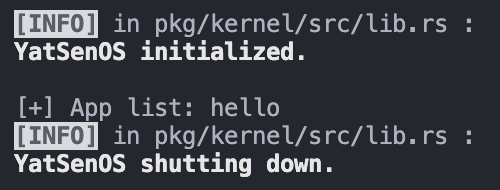

可以看到打印出来一个用户程序 hello ，说明应用程序 hello 已经被成功加载到内存中。

### 生成用户进程

在 `kernel/src/proc/mod.rs` 中定义：

- `spawn` 函数，根据 app 名字将 ELF 文件从列表中取出，调用 `elf_spawn` 生成用户程序
- `elf_spawn` 函数根据 ELF 文件生成用户程序

```rust
pub fn spawn(name: &str) -> Option<ProcessId> {
    let app = x86_64::instructions::interrupts::without_interrupts(|| {
        let app_list = get_process_manager().app_list()?;
        app_list.iter().find(|&app| app.name.eq(name))
    })?;

    elf_spawn(name.to_string(), &app.elf)
}

pub fn elf_spawn(name: String, elf: &ElfFile) -> Option<ProcessId> {
    let pid = x86_64::instructions::interrupts::without_interrupts(|| {
        let manager = get_process_manager();
        let process_name = name.to_lowercase();
        let parent = Arc::downgrade(&manager.current());
        let pid = manager.spawn(elf, name, Some(parent), None);

        debug!("Spawned process: {}#{}", process_name, pid);
        pid
    });

    Some(pid)
}
```

在 `pkg/kernel/src/proc/manager.rs` 中给 `ProcessManager` 增加 `spawn` 方法：

```rust
impl ProcessManager {
  	......
		pub fn spawn(
        &self,
        elf: &ElfFile,
        name: String,
        parent: Option<Weak<Process>>,
        proc_data: Option<ProcessData>,
    ) -> ProcessId {
        let kproc = self.get_proc(&KERNEL_PID).unwrap();
        let page_table = kproc.read().clone_page_table();
        let proc = Process::new(name, parent, page_table, proc_data);
        let pid = proc.pid();

        let mut inner = proc.write();
        // Done // FIXME: load elf to process pagetable
        // Done // FIXME: alloc new stack for process
        inner.load_elf(elf);
      	// initialize stack
        inner.init_stack_frame(
            VirtAddr::new_truncate(elf.header.pt2.entry_point()),
            VirtAddr::new_truncate(STACK_INIT_TOP),
        );
        // Done // FIXME: mark process as ready
        inner.pause();
        drop(inner);

        trace!("New {:#?}", &proc);

        // Done // FIXME: something like kernel thread
        self.add_proc(pid, proc);
        self.push_ready(pid);
        pid
    }
}
```

这里通过克隆内核页表给用户进程独立的页表，用户进程而言不再与内核共享页表，这意味着可以为每个用户进程分配同样的栈地址，而不会相互干扰，所以后面分配和初始化栈的时候直接使用了 `STACK_INIT_BOT` ，不会与内核栈冲突。

在 `pkg/kernel/src/proc/process.rs` 中给 `ProcessInner` 增加 `load_elf` 方法，用来加载用户程序、为其分配栈、并设置栈的相关信息：

```rust
impl ProcessInner {
    ......
		pub fn load_elf(&mut self, elf: &ElfFile) {
        let alloc = &mut *get_frame_alloc_for_sure();
        let page_table = self.page_table.as_ref().unwrap();
        let mut mapper = page_table.mapper();
        // load elf to process pagetable
        ProcessInner(
            elf,
            *PHYSICAL_OFFSET.get().unwrap(),
            &mut mapper,
            alloc,
            true,
        ).expect("Failed to load elf of app program");
        // alloc new stack for process
        let stack_segment =
            elf::map_range(
                STACK_INIT_BOT,
                STACK_DEF_PAGE,
                &mut mapper,
                alloc,
            ).expect("Failed to alloc stack for app process");
        // set stack
        let proc_data = self
            .proc_data
            .as_mut()
            .expect("Failed to get app process data to set initial stack");
        proc_data.stack_segment = Some(stack_segment);
    }
}
```

同时，这里用到了 `load_elf` ，增加了一个参数表示该进程用户是否拥有访问权限，需要对 `pkg/elf/src/lib.rs` 中相关函数做相应的修改：

```rust
pub fn load_elf(
    ......
    user_access: bool, // new
) -> Result<(), MapToError<Size4KiB>> {
		......
    for segment in elf.program_iter() {
        if segment.get_type().unwrap() != program::Type::Load {
            continue;
        }
        load_segment(
            ......
            user_access, // new
        )?
    }
    Ok(())
}

pub fn load_segment(
    ......
    user_access: bool,
) -> Result<(), MapToError<Size4KiB>> {
		......
    // new
    if user_access {
        page_table_flags |= PageTableFlags::USER_ACCESSIBLE;
    }
  	......
}
```

同时，修改 `pkg/boot/src/main.rs` 中对 `elf::load_elf` 的调用，增加传入参数 `false` ，设置内核进程是用户不可访问的，区分内核程序和用户程序，防止用户态程序访问内核的内存空间：

```rust
fn efi_main(...) -> Status {
  	......
		elf::load_elf(
        ......
        false // new
    ).expect("Failed to load and map kernel elf file!");
  	......
}
```

#### 用户态进程栈

在先前的实验中，生成的“进程”实际上还是内核线程，所以使用的栈依然是内核栈。现在对于用户进程，使用的栈需要相应地调整为一个独立的用户态的栈，所以在 `pkg/kernel/src/memory/gdt.rs` 中增加用户态栈的相关数据结构和定义，具体增加内容如下：

```rust
lazy_static! {
    static ref TSS: TaskStateSegment = {
        let mut tss = TaskStateSegment::new();
      	......
				tss.interrupt_stack_table[SYSCALL_IST_INDEX as usize] = {
            const STACK_SIZE: usize = IST_SIZES[4];
            static mut STACK: [u8; STACK_SIZE] = [0; STACK_SIZE];
            let stack_start = VirtAddr::from_ptr(unsafe { STACK.as_ptr() });
            let stack_end = stack_start + STACK_SIZE as u64;
            info!(
                "Syscall IST      : 0x{:016x}-0x{:016x}",
                stack_start.as_u64(),
                stack_end.as_u64()
            );
            stack_end
        };
        tss
    };
}

lazy_static! {
    static ref GDT: (GlobalDescriptorTable, KernelSelectors, UserSelectors) = {
				......
        let user_code_selector = gdt.append(Descriptor::user_code_segment());
        let user_data_selector = gdt.append(Descriptor::user_data_segment());
				......
      	(
          	......
            UserSelectors {
                user_code_selector,
                user_data_selector,
            },
        )
    };
}

......

pub struct UserSelectors {
    pub user_code_selector: SegmentSelector,
    pub user_data_selector: SegmentSelector,
}

......

pub fn get_user_selector() -> &'static UserSelectors {
    &GDT.2
}
```

最后，在 `pkg/kernel/src/proc/context.rs` 中修改 `proc::context::ProcessContext` 函数，使用刚刚定义的数据结构存储用户态栈的信息：

```rust
impl ProcessContext {
		......
  	pub fn init_stack_frame(&mut self, entry: VirtAddr, stack_top: VirtAddr) {
      	......
        self.value.stack_frame.code_segment = selector.user_code_selector;
        self.value.stack_frame.stack_segment = selector.user_data_selector;
  	}
}
```

### 阶段性成果

定义一个死循环用户程序 hello 如下：

```rust
#![no_std]
#![no_main]

use lib::*;

extern crate lib;

fn main() -> isize {
    println!("Hello, world!!!");
    loop {}
}

entry!(main);
```

初始化内核之后调用 `proc::spawn` 函数，创建用户程序 hello ，修改 `pkg/kernel/src/main.rs` 如下：

```rust
pub fn kernel_main(boot_info: &'static boot::BootInfo) -> ! {
    ysos::init(boot_info);
    proc::list_app();
    proc::spawn("hello").unwrap();
    ysos::shutdown(boot_info);
}
```

运行 `python ysos.py run` 后得到结果如下：

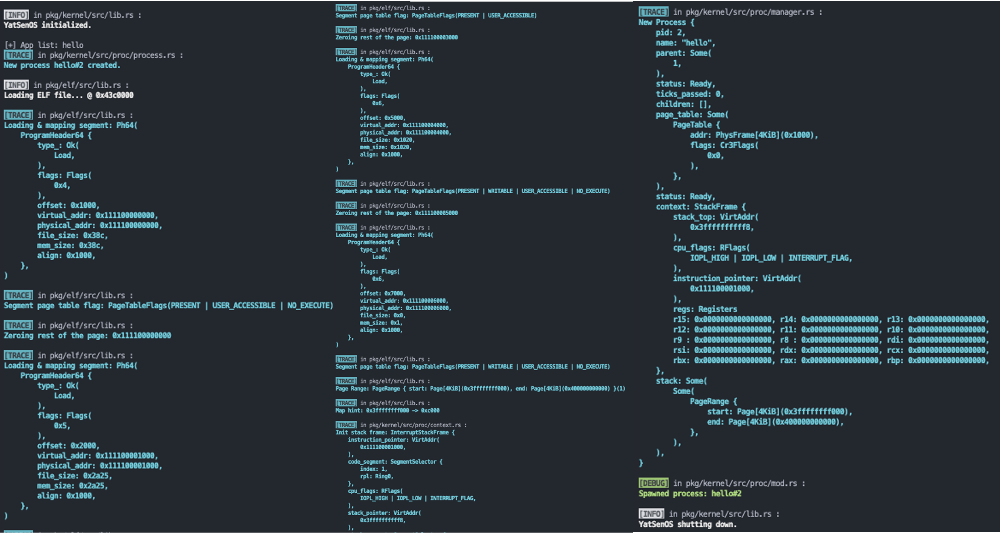

可以看到分配内存时的一系列 trace 日志都如预期打印出来，包括程序代码、栈的分配，以及最后 `Spawned process: hello#2` 表示通过 spawn 创建了 pid 为 2 的用户进程。

## 系统调用的实现

### 软中断处理

首先需要为系统调用准备一个独立的栈，类似先前 Page Fault 、Double Fault 、时钟中断，在 `pkg/kernel/src/memory/gdt.rs` 中定义处理系统调用专用的栈：

```rust
lazy_static! {
    static ref TSS: TaskStateSegment = {
        let mut tss = TaskStateSegment::new();
      	......
				tss.interrupt_stack_table[SYSCALL_IST_INDEX as usize] = {
            const STACK_SIZE: usize = IST_SIZES[4];
            static mut STACK: [u8; STACK_SIZE] = [0; STACK_SIZE];
            let stack_start = VirtAddr::from_ptr(unsafe { STACK.as_ptr() });
            let stack_end = stack_start + STACK_SIZE as u64;
            info!(
                "Syscall IST      : 0x{:016x}-0x{:016x}",
                stack_start.as_u64(),
                stack_end.as_u64()
            );
            stack_end
        };
        tss
    };
}
```

在 `pkg/kernel/src/interrupt/syscall/mod.rs` 中定义注册系统调用中断处理函数的函数 `syscall::register_idt` ，实现：

- 注册 `0x80` 号中断（ `consts::Interrupts::Syscall` ）的处理函数为 `syscall_handler`
- 为系统调用设置一个独立的栈 `SYSCALL_IST_INDEX`
- 使用 `set_privilege_level` 设置 `DPL` 为 `3`，以便用户态程序可以触发系统调用

```rust
pub unsafe fn register_idt(idt: &mut InterruptDescriptorTable) {
    // Done // FIXME: register syscall handler to IDT
    idt[consts::Interrupts::Syscall as u8]
        .set_handler_fn(syscall_handler)
        .set_stack_index(gdt::SYSCALL_IST_INDEX) // standalone syscall stack
        .set_privilege_level(x86_64::PrivilegeLevel::Ring3); // ring 3
}
```

在 `pkg/kernel/src/interrupt/mod.rs` 中调用注册系统调用中断处理函数的函数，使得在操作系统初始化的时候完成注册：

```rust
lazy_static! {
    static ref IDT: InterruptDescriptorTable = {
        let mut idt = InterruptDescriptorTable::new();
        unsafe {
            ......
            syscall::register_idt(&mut idt); // new
        }
        idt
    };
}
```

## 用户态库的实现

### 用户态堆初始化

`pkg/kernel/src/memory/user.rs` 中，在开始完成 `FIXME` 之前注意到有这样一条注释：

```rust
// NOTE: export mod user / call in the kernel init / after frame allocator
```

按照这条注释的指引，`pkg/kernel/src/memory/mod.rs` 中，在完成内核内存分配后，调用 `user::init` 分配用户堆内存：

```rust
pub fn init(boot_info: &'static boot::BootInfo) {
  	......
		user::init();

    info!("Frame Allocator initialized.");
}
```

在 `pkg/kernel/src/memory/user.rs` 中补全有关用户态堆初始化的过程:

- 指定合适的页面范围：
  - 从 `USER_HEAP_START` 地址开始
  - 用户堆堆页面总数量为 `USER_HEAP_PAGE`
- 指定合适的标志位：
  - 首先需要 `PRESENT` 和 `WRITABLE`
  - 用户对用户堆有访问权限，需要 `USER_ACCESSIBLE`
  - 这部分内存还需要 `NO_EXECUTE` 标志位以满足调试和安全性目的
- 分配并映射相关的页表，利用 `elf::map_range` 实现

```rust
pub fn init_user_heap() -> Result<(), MapToError<Size4KiB>> {
    // Get current pagetable mapper
    let mapper = &mut PageTableContext::new().mapper();
    // Get global frame allocator
    let frame_allocator = &mut *super::get_frame_alloc_for_sure();

    // Done // FIXME: use elf::map_range to allocate & map frames (R/W/User Access)
    let page_range = elf::map_range(
        USER_HEAP_START as u64,
        USER_HEAP_PAGE.try_into().unwrap(),
        mapper,
        frame_allocator,
        true
    );

    unsafe {
        USER_ALLOCATOR
            .lock()
            .init(USER_HEAP_START as *mut u8, USER_HEAP_SIZE);
    }

    Ok(())
}
```

### 标准输入输出

在 `src/proc/data.rs` 中：

- 修改 `ProcessData` 结构体，类似于环境变量 `env` 的定义，添加一个“文件描述符表” `resources`
- 在 `ProcessData` 的 `default` 函数中初始化，添加 `resources` 的默认的资源

```rust
pub struct ProcessData {
    // shared data
    pub(super) env: Arc<RwLock<BTreeMap<String, String>>>,
    pub(super) resources: Arc<RwLock<ResourceSet>>, // new
		......
}

impl Default for ProcessData {
    fn default() -> Self {
        Self {
          	env: Arc::new(RwLock::new(BTreeMap::new())),
            resources: Arc::new(RwLock::new(ResourceSet::default())), // new
            ......
        }
    }
}
```

同时还增加 `read` 和 `write` 方法以在系统调用中根据文件描述符进行读写：

```rust
impl ProcessData {
  	......
		pub fn read(&self, fd: u8, buf: &mut [u8]) -> isize {
        self.resources.read().read(fd, buf)
    }

    pub fn write(&self, fd: u8, buf: &[u8]) -> isize {
        self.resources.read().write(fd, buf)
    }
}
```

另外，在 `pkg/kernel/src/proc/mod.rs` 中增加封装获取当前进程、上锁等操作的函数：

```rust
pub fn read(fd: u8, buf: &mut [u8]) -> isize {
    x86_64::instructions::interrupts::without_interrupts(|| get_process_manager().read(fd, buf))
}

pub fn write(fd: u8, buf: &[u8]) -> isize {
    x86_64::instructions::interrupts::without_interrupts(|| get_process_manager().write(fd, buf))
}
```

在 `pkg/kernel/src/proc/manager.rs` 中进一步实现这些函数：

```rust
impl ProcessManager {
		......
  	#[inline]
    pub fn read(&self, fd: u8, buf: &mut [u8]) -> isize {
        self.current().read().read(fd, buf)
    }

    #[inline]
    pub fn write(&self, fd: u8, buf: &[u8]) -> isize {
        self.current().read().write(fd, buf)
    }
}
```

在 `interrupt/syscall/service.rs` 中补全 `sys_write` 函数的实现，用于处理 `write` 系统调用，使得用户程序得以进程输出。

- 使用 `core::slice::from_raw_parts` 将用户程序的缓冲区转换为 `&[u8]`
- 将缓冲区传入资源的 `write` 方法中，并返回写入的字节数

同时，类似地补全 `sys_read` 函数：

```rust
pub fn sys_write(args: &SyscallArgs) -> usize {
    // Done // FIXME: get buffer and fd by args
    //       - core::slice::from_raw_parts
    let buffer = unsafe {
        core::slice::from_raw_parts(
            args.arg1 as *const u8,
            args.arg2
        )
    };
    let fd = args.arg0 as u8;
    // Done // FIXME: call proc::write -> isize
    // Done // FIXME: return the result as usize
    write(fd, buffer) as usize
}

pub fn sys_read(args: &SyscallArgs) -> usize {
    // FIXME: just like sys_write
    let buffer = unsafe {
        core::slice::from_raw_parts_mut(
            args.arg1 as *mut u8,
            args.arg2
        )
    };
    let fd = args.arg0 as u8;
    read(fd, buffer) as usize
}
```

在分发函数中使用 `context.set_rax` 设置返回值，并调用 `sys_write` 和 `sys_read` 函数:

```rust
pub fn dispatcher(context: &mut ProcessContext) {
  	......
  	match args.syscall {
      	// fd: arg0 as u8, buf: &[u8] (ptr: arg1 as *const u8, len: arg2)
        Syscall::Read => context.set_rax(sys_read(&args)),
        // fd: arg0 as u8, buf: &[u8] (ptr: arg1 as *const u8, len: arg2)
        Syscall::Write => context.set_rax(sys_write(&args)),
    		......
  	}
  	......
}
```

为了实现标准输入，还需要在 `pkg/kernel/src/utils/resource.rs` 中补全 `utils::resource::Resource.read` 函数，调用串口相关库中在先前实验中实现的 `try_pop_key` ，将读取到的数据存储到缓冲区中，并用返回结果表示缓冲区中成功读到的数据长度。这里约定：

- 结果为 0 ，则代表没有输入
- 结果为 1 ，则表示普通的 ASCII 码输入、单字节 Unicode 输入
- 结果为 2、3、4 则表示输入为多字节 Unicode 输入

```rust
impl Resource {
    pub fn read(&mut self, buf: &mut [u8]) -> Option<usize> {
        match self {
            Resource::Console(stdio) => match stdio {
                StdIO::Stdin => {
                    // Done // FIXME: just read from kernel input buffer
                    if let Some(k) = input::try_pop_key() {
                        buf[0] = k;
                        Some(1)
                    } else {
                        Some(0)
                    }
                }
                _ => None,
            },
            Resource::Null => Some(0),
        }
    }
    ......
}
```

这里由于我在先前的实验实现串口库中定义的 `try_pop_key` 函数返回结果就是 `u8` ，所以考虑输入只有 ASCII 码，写入缓冲区只有一个字节，读取成功时总是返回 `Some(1)` 。在后续实现用户态 shell 的过程中，尝试进一步实现 Unicode 时，这里的实现是存在问题的，具体对这里的问题更深入的探讨和解决在后续用户态 shell 部分的实验报告中。

在这里还有一个困难点，是在后续测试输入的时候发现的，这里调用同样在先前实验中实现的串口库的 `pop_key` 函数则会导致无法读取输入，该函数具体定义如下：

```rust
pub fn pop_key() -> Key {
    let mut data : Option<Key> = try_pop_key();
    while data.is_none() {
        data = try_pop_key();
    }
    data.unwrap()
}
```

实际上就是在 `pop_key` 中实现了忙等待读取一个输入字节。经过代码检查与思考，发现了原因在于这里禁用了中断。调用这个 `read` 方法的过程是一条调用链：

```rust
syscall::sys_read() =>
proc::read() =>
proc::manager::ProcessManager.read() => // 在这里禁用了中断
proc::data::ProcessData.read() =>
utils::resource::ResourceSet.read() =>
utils::resource::Resource.read() =>
```

在其中 `proc::manager::ProcessManager.read()` 函数调用下一级的过程中使用了 `x86_64::instructions::interrupts::without_interrupts` 禁用中断。

所以，如果在最后一级 `read` 函数中忙等待，那么键盘输入将永远不能成功中断并写入缓冲区，所以缓冲区也就永远是空的，因此这里必须直接根据缓冲区读取结果返回。

### 进程的退出

在 `kernel/src/proc/mod.rs` 中实现 `exit` 函数，封装对应的功能，并暴露给系统调用：

```rust
pub fn exit(ret: isize, context: &mut ProcessContext) {
    x86_64::instructions::interrupts::without_interrupts(|| {
        let manager = get_process_manager();
        // Done // FIXME: implement this for ProcessManager
        manager.kill_self(ret);
        manager.switch_next(context);
    })
}
```

这里使用 `ProcessManager` 上一个实验完成的 `kill` 方法的基础上修改，能够完成所需的杀死当前正在运行进程的功能，增加了代码复用性；然后定义 `kill_self` 方法获取当前运行进程并执行 `kill` ：

```rust
impl ProcessManager {
  	......
		pub fn kill(&self, pid: ProcessId, ret: isize) {
        // Done // FIXME: get process by pid
        let proc = self.get_proc(&pid);

        if proc.is_none() {
            warn!("Process #{} not found.", pid);
            return;
        }

        let proc = proc.unwrap();

        if proc.read().status() ** ProgramStatus::Dead {
            warn!("Process #{} is already dead.", pid);
            return;
        }

        trace!("Kill {:#?}", &proc);

        // Done // FIXME: kill process and set return code
        proc.kill(ret);
    }

    pub fn kill_self(&self, ret: isize) {
        self.kill(processor::get_pid(), ret);
    }
  	......
}
```

然后在 `pkg/kernel/src/interrupt/syscall/service.rs` 中补全系统调用 `exit_process` 的实现：

```rust
pub fn exit_process(args: &SyscallArgs, context: &mut ProcessContext) {
    // Done // FIXME: exit process with retcode
    lib::sys_exit(ret);
}
```

### 阶段性成果

用户程序如下：

```rust
fn main() -> isize {
    println!("Hello, world!!!");
    sys_exit(233);  // 自定义退出码 233
    // 233 // 也可以
}
```

在这里我尝试按照实验文档要求运行用户程序输出 hello world ，但是还是没有打印出来，运行 `python ysos.py run` 后得到结果和上一次阶段性成果仍然一样。根据输出我推测可能是因为我在内核程序中创建用户进程之后马上执行了 `ysos::shutdown(boot_info);` 导致操作系统直接退出导致的，用户进程还没来得及运行输出。所以我将 `kernel_main` 修改如下：

```rust
pub fn kernel_main(boot_info: &'static boot::BootInfo) -> ! {
    ysos::init(boot_info);
    proc::spawn("hello").unwrap();
    loop {}
}
```

这样就能保证有充足的时间给用户程序运行，然后再运行 `python ysos.py run` 后得到结果入如下：

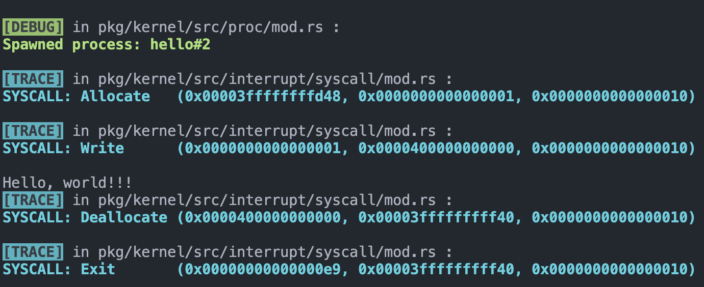

顺利打印出了 hello world ，说明标准输入输出系统调用正确执行。

同时，还看到：

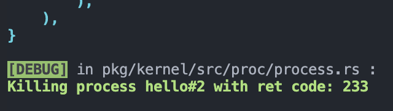

说明用户程序退出的系统调用也正确执行，并顺利返回了预期的在用户程序中自定义的退出码 233 。

### 进程的创建与等待

在 `kernel/src/lib.rs` 中定义函数 `ysos::wait` ，忙等待目标进程直到它退出：

```rust
pub fn wait(init: proc::ProcessId) {
    loop {
        if proc::still_alive(init) {
            x86_64::instructions::hlt();
        } else {
            break;
        }
    }
}
```

在 `kernel/src/proc/mod.rs` 中，定义：

- `still_alive` 函数根据进程状态是否为 DEAD 来判断进程是否还活着（没被 kill ）
- `get_current_pid` 函数来获取当前处理器上正在运行的进程的 pid

```rust
#[inline]
pub fn still_alive(pid: ProcessId) -> bool {
    x86_64::instructions::interrupts::without_interrupts(|| {
        // Done // check if the process is still alive
        let status = get_process_manager()
            .get_proc(&pid)
            .expect("The process to check whether is still alice doesn't exist")
            .read()
            .status();
        status != ProgramStatus::Dead
    })
}

pub fn get_current_pid() -> ProcessId {
    x86_64::instructions::interrupts::without_interrupts(get_pid)
}
```

在 `pkg/kernel/src/interrupt/syscall/service.rs` 中，定义：

- `spawn_process` 用来创建新的用户进程（补全 FIXME ）
- `sys_get_pid` 来调用 `proc::get_current_pid` 获取当前处理器上正在运行的进程的 pid
- `sys_wait_pid` 根据 `exit_code` 是否存在判断目标进程是否退出
  - 如果存在，那么直接返回 `exit_code`
  - 如果不存在，那么返回一个 `-1` 来表示进程没有退出

```rust
pub fn spawn_process(args: &SyscallArgs) -> usize {
    // Done // FIXME: get app name by args
    //       - core::str::from_utf8_unchecked
    //       - core::slice::from_raw_parts
    let buffer = unsafe {
        core::slice::from_raw_parts(
            args.arg0 as *const u8,
            args.arg1
        )
    };
    let name = unsafe { core::str::from_utf8_unchecked(buffer) };
    // FIXME: spawn the process by name
    let ret = proc::spawn(name);
    match ret {
        // Done // FIXME: handle spawn error, return 0 if failed
        None => 0,
        // Done // FIXME: return pid as usize
        Some(pid) => pid.0 as usize
    }
}

pub fn sys_get_pid() -> u16 {
    get_current_pid().into()
}

pub fn sys_wait_pid(args: &SyscallArgs) -> isize {
    let pid = ProcessId(args.arg0 as u16);
    let ret = get_exit_code(pid);
    match ret {
        None => -1,
        Some(exit_code) => exit_code,
    }
}
```

同时，为了实现用户进程等待另一个进程退出的功能，在 `pkg/lib/src/syscall.rs` 中，根据 `Syscall::WaitPid` 对应 match 的刚刚实现的 `sys_wait_pid` 的返回值实现忙等待。如果返回值为 `-1` ，则表明目标进程未退出，则循环等待，直到目标进程退出为止，最后返回退出码，补全用户态库的系统调用函数 `sys_wait_pid` 如下：

```rust
#[inline(always)]
pub fn sys_wait_pid(pid: u16) -> isize {
    // FIXME: try to get the return value for process
    //        loop until the process is finished
    loop {
        let exit_code = syscall!(
            Syscall::WaitPid,
            pid as u64
        ) as isize;
        if exit_code != -1 {
            return exit_code
        }
    }
}
```

#### 其他系统调用

为了方便后续的用户态 shell 的实现，还需要实现一些信息的查看的系统调用，需要在 `pkg/kernel/src/interrupt/syscall/mod.rs` 中补全并实现如下两个系统调用：

```rust
Syscall::Stat => list_process(),

Syscall::ListApp => list_app(),
```

`pkg/kernel/src/interrupt/syscall/service.rs`

```rust
pub fn list_process() {
    // Done // FIXME: list all processes
    proc::print_process_list();
}

```

`pkg/kernel/src/proc/mod.rs`

```rust
pub fn list_app() {
    x86_64::instructions::interrupts::without_interrupts(|| {
        let app_list = get_process_manager().app_list();
        if app_list.is_none() {
            println!("[!] No app found in list!");
            return;
        }

        let apps = app_list
            .unwrap()
            .iter()
            .map(|app|
                format!("name: {}  ; size: {}  ; entry point: {}",
                    app.name.to_string(),
                    app.elf.header.pt2.size().to_string(),
                    app.elf.header.pt2.entry_point().to_string(),
                )
            )
            .collect::<Vec<String>>()
            .join("\n");

        // Done // TODO: print more information like size, entry point, etc.

        println!("[+] App list:\n{}", apps);
    });
}
```

## 运行 Shell

### 完善用户态库输入

虽然前面输出 hello world 的程序已经初步实现了标准输入输出，但是对于实现一个 shell ，还需要进一步处理输入的一些控制字符，并且实现存储输入的功能，对于一些控制字符需要必要的处理，包括：

- `'\n'` 和 `'\r'` ，表示换行、回车，则结束本次读取，返回这一次读取的字符串
- `'\x03'` 即 Ctrl + C ，应该撤销本次输入
- `'\x04'` 即 Ctrl + D ，除了撤销本次输入，还需要返回该控制字符给 shell 程序，需要在 shell 程序中相应地实现收到该字符时让 shell 程序退出
- `'\x08'` 和 `'\x7F'` 表示推格、删除，则默认一个字符在终端占一个格子的情况，顺序输出：推格、空格、推格，实现终端屏幕上删除上一个字符，同时存储的字符串中也需要删去上一个字符。

所以还需要在 `pkg/lib/src/io.rs` 中补全 `io::Stdin.read_line` 函数如下：

```rust
impl Stdin {
		......
    pub fn read_line(&self) -> String {
        // FIXME: allocate string
        // FIXME: read from input buffer
        //       - maybe char by char?
        // FIXME: handle backspace / enter...
        // FIXME: return string
        let mut string = String::new();
        let mut buf = vec![0; 4];
        while let Some(bytes) = sys_read(0, &mut buf) {
            if bytes ** 0 {
                continue
            }
            let buf_ptr = &buf[..bytes];
            let t = String::from_utf8_lossy(buf_ptr);
            let c = t.to_string().remove(0);
            match c {
                '\n' | '\r' => {
                    stdout().write("\n");
                    break;
                }
                '\x03' => {
                    string.clear();
                    break;
                }
                '\x04' => {
                    string.clear();
                    string.push('\x04');
                    break;
                }
                '\x08' | '\x7F' => {
                    if !string.is_empty() {
                        stdout().write("\x08");
                        stdout().write("\x20");
                        stdout().write("\x08");
                        string.pop();
                    }
                }
                _ => {
                    self::print!("{}", c);
                    string.push(c);
                }
            }
        }
        string
    }
  	......
}
```

在这里按照之前 `utils::resource::Resource.read` 函数实现时的约定，系统调用返回的结果为成功读取的存储到缓冲区的字节数，如果字节数为 0 ，则说明还没有输入，则忙等待，直到返回结果不为 0 。

### 用户态 shell 程序

在 `pka/app` 中新建一个 `sh` 项目，作为用户态 shell 程序。其源代码 `main.rs` 如下：

```rust
#![no_std]
#![no_main]

use lib::{vec::Vec, *};

extern crate lib;

fn main() -> isize {
    loop {
        print!("\x1B[1;32m[>]\x1B[1;0m");
        let input = stdin().read_line();
        let command: Vec<&str> = input.trim().split(' ').collect();
        match command[0] {
            "\x04" | "exit" => {
                println!();
                break;
            }
            "ps" => sys_stat(),
            "app" => sys_list_app(),
            "run" => {
                let count = command.len();
                if count != 2 {
                    println!("Usage: run <app>");
                    continue;
                }
                sys_wait_pid(sys_spawn(command[1]));
            }
            "help" => print!("\x1B[1;32m{}\x1B[1;0m", HELP),
            "clear" => print!("\x1b[1;1H\x1b[2J"),
            _ => {
                if command[0].is_empty() {
                    println!();
                    continue;
                }
                println!("\x1B[1;32m[=] you said\x1B[1;0m \"{}\"", input)
            }
        }
    }
    0
}

entry!(main);

const HELP: &str = r"
----Command---|----------function-------
    help      | show this help
    ps        | show process list
    app       | list apps
    run <app> | run one app by the name
    clear     | clear screen
    exit      | exit shell
---Shortcuts--|----------function-------
    Ctrl + D  | exit shell
    Ctrl + C  | cancel current command

";
```

这里实现的指令用 `help` 可以输出使用方式，通过空格分隔处理输入的字符串实现了运行指定名字的用户程序的功能。相关的系统调用已经在先前的步骤中实现了，接下来重点放在了输入输出的完善上。

### 处理 Unicode 字符

Rust 中的字符串类型 String 和字符 char 本身就支持 Unicode 类型，所以我想可以像先前的实验中实现一个内核态 shell 程序一样比较容易地实现 Unicode 输入。但是我试图直接往我的 shell 中输入一个中文字符，却得到了这样的结果：


为了弄清楚打印出的到底是什么，我在 `pkg/lib/src/io.rs` 中的 `io::Stdin.read_line` 函数加上了 debug 用的输出逻辑：

```rust
pub fn read_line(&self) -> String {
        let mut string = String::new();
        let mut buf = vec![0; 4];
        while let Some(bytes) = sys_read(0, &mut buf) {
            if bytes <= 0 {
                continue
            }
            let buf_ptr = &buf[..bytes];
            for i in 0..bytes {
                self::print!("\n{:x}", buf_ptr[i]);
            }
            self::print!(";");
          	......
```

然后启动 sh 程序，并输入一个汉字 “啊”，得到这样的输出：

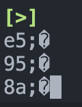

于是可以发现，我的一个中文字符被当做了 3 个字符处理，这 3 个非标准 ASCII 码就会导致这样的输出。原因就在于一个中文字符在 utf-8 编码下长度为 3 个字节，但是我先前实现的标准输入默认每个字符都是一个字节，这里汉字 “啊” 的 utf-8 编码就是 `e5 95 8a` ，需要将他们作为一个 Rust 类型 char 处理。

那么该怎么解决呢？可以在之前实现的 `utils::resource::Resource.read` 函数中识别多字节 Unicode ，得到完整的 Unicode 再放入 buf 中？在先前的实验中，我实现过内核态类似 shell 程序的 Unicode 的读取，是依据 Unicode 的一个字节的前 4 位判断这个 Unicode 的长度实现的。我尝试了将先前写的代码稍作修改放到这个函数，结果如下；

```rust
impl Resource {
    pub fn read(&mut self, buf: &mut [u8]) -> Option<usize> {
        match self {
            Resource::Console(stdio) => match stdio {
                StdIO::Stdin => {
                    if let Some(c) = input::try_pop_key() {
                        buf[0] = c;
                        if c & 0b1111_0000 ** 0b1111_0000 {
                            buf[1] = input::pop_key();
                            buf[2] = input::pop_key();
                            buf[3] = input::pop_key();
                            Some(4)
                        } else if c & 0b1110_0000 ** 0b1110_0000 {
                            buf[1] = input::pop_key();
                            buf[2] = input::pop_key();
                            Some(3)
                        } else if c & 0b1100_0000 ** 0b1100_0000 {
                            buf[1] = input::pop_key();
                            Some(2)
                        } else {
                            Some(1)
                        }
                    } else {
                        Some(0)
                    }
                }
                _ => None,
            },
            Resource::Null => Some(0),
        }
    }
  	......
```

这样测试却出现了我之前遇到的问题——使用 `input::pop_key()` 函数导致了这里卡死，永远在禁止中断的状态等待内核缓冲区输入。这个原因分析起来，看起来和前面的结果一样，是因为内核读取键盘输入总是一个字节一个字节的，内核缓冲区会出现只有一个多字节 Unicode 的第一个字节的情况，那么就会导致卡死。

这里我们的 OS 设计是系统调用 `sys_read` 、`sys_write` 总是传输 4 个字节的缓冲区的，所以应该在内核里就实现这一个 Unicode 的读取，因为如果在用户态库实现那么这个 4 字节缓冲区就没有意义了。所以这里的读取还是有问题的话，那么就需要重新实现内核里这个串口读取功能了。

接下来仔细分析这个问题，我认为问题的发生过程如下：

- 首先键盘每次读取一个字符输入需要申请中断，这个中断处理的过程被委托到了 `pkg/kernel/src/interrupt/serial.rs` 中的函数 `receive` 来处理：

  ```rust
  pub extern "x86-interrupt" fn serial_handler(_st: InterruptStackFrame) {
      receive();
      super::ack();
  }

  fn receive() {
      get_serial_for_sure();
      push_key();
  }
  ```

- 用户态程序每次从缓冲区读取一个字符需要申请中断，然后调用系统调用，而且调用系统调用执行的程序也是禁用了中断的，不会被中断打断。

- 用户态程序通过反复调用系统调用读取输入，在忙等待的过程中，键盘输入，并发起了中断，然后这个中断必须等待用户态程序系统调用结束才能执行处理函数

- 键盘输入开始执行后，用户态程序仍然在调用系统调用，等待这一次中断处理结束，然后就会马上轮到用户态程序的系统调用中断处理

- 上述 2 个过程反复发生，每次缓冲区都只能读取到最多一个字节，用户程序每次都会看到缓冲区里最多一个字节，然后就读取这一个字节作为结果，这就导致了我看到的现象

要解决这个问题，就必须解决缓冲区一次最多只读取一个字节的情况，所以就必须在键盘输入中断内实现读取一个完整的 Unicode 字符，所以应该修改完善 `pkg/kernel/src/interrupt/serial.rs` 中的函数 `receive` ，我对其修改结果如下：

```rust
fn receive() {
    let mut buf = alloc::vec![0; 4];
    let mut serial = get_serial_for_sure();
    buf[0]= serial.receive();
    if buf[0] & 0b1111_0000 ** 0b1111_0000 {
        buf[1] = serial.receive();
        buf[2] = serial.receive();
        buf[3] = serial.receive();
    } else if buf[0] & 0b1110_0000 ** 0b1110_0000 {
        buf[1] = serial.receive();
        buf[2] = serial.receive();
    } else if buf[0] & 0b1100_0000 ** 0b1100_0000 {
        buf[1] = serial.receive();
    }
    push_key(String::from_utf8_lossy(&buf).to_string().remove(0))
}
```

实际上就是将我先前实验实现的内核态 shell 处理 Unicode 的代码稍作修改即可，放在这里，然后就可以实现无论内核态还是用户态都能够处理 Unicode 的读取了。

接着，在 `pkg/kernel/src/drivers/input.rs` 中，将原来的 `type Key = u8;` 可以修改为 `type Key = char;` 了，内核缓冲区不再以 `u8` 为单位，而是以 Unicode 类型 `char` 为单位。

最后，在 `pkg/kernel/src/utils/resource.rs` 中，再调用 `input::try_pop_key()` 得到的结果就是 `char` 类型了，相应地作出处理，将结果放到 buf 缓冲区中并返回字节长度：

```rust
impl Resource {
    pub fn read(&mut self, buf: &mut [u8]) -> Option<usize> {
        match self {
            Resource::Console(stdio) => match stdio {
                StdIO::Stdin => {
                    // Done // FIXME: just read from kernel input buffer
                    if let Some(c) = input::try_pop_key() {
                        c.encode_utf8(buf);
                        Some(c.len_utf8())
                    } else {
                        Some(0)
                    }
                }
                _ => None,
            },
            Resource::Null => Some(0),
        }
    }
  	......
}
```

### 处理删除退格

实现了对 Unicode 的处理之后，还有一个需要调整的是相应的对输出屏幕上 Unicode 的删除退格处理。我在先前的实验中，实现内核态 shell 程序时也做了这样的处理，现在对于用户态 shell 可以借鉴之前的代码与思路。

在 `pkg/lib/src/io.rs` 中修改 `io::Stdin.read_line` 函数匹配到退格、删除字符时的代码如下：

```rust
'\x08' | '\x7F' => {
    if !string.is_empty() {
        let delete_char = string.pop().unwrap().to_string();
        let width = UnicodeWidthStr::width(delete_char.as_str());
        for _ in 0..width {
            stdout().write("\x08");
        }
        for _ in 0..width {
            stdout().write("\x20");
        }
        for _ in 0..width {
            stdout().write("\x08");
        }
    }
}
```

当然这里也和我之前一样，用到了一个外部包 `unicode_width` 来判断字符长度，据此删除并回退相应的格子数量。

### 测试结果

现在我的 shell 已经可以正确处理各种 Unicode 输入了，运行实验文档指定的测试程序，以及测试相关的指令结果如下：

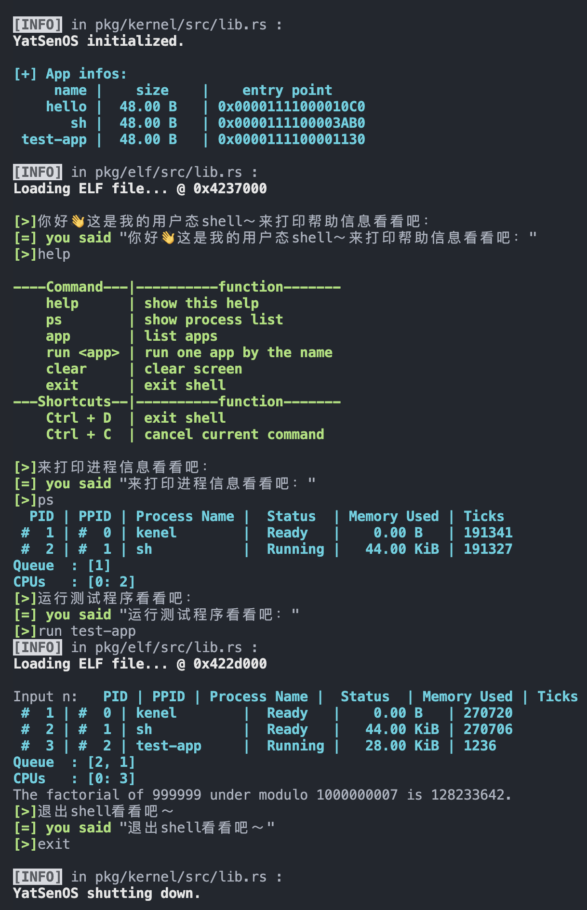

## 思考题

### 内核态使用系统调用

是否可以在内核线程中使用系统调用？并借此来实现同样的进程退出能力？

答案是可行的，系统调用就是一种用户态可以请求调用的中断处理函数，在内核态是完全可以调用的。同样也可以以此来实现进程退出的能力。

我在 `pkg/kernel/src/utils/func.rs` 中定义了如下内核线程来验证：

```rust
pub fn test() -> ! {
    // let mut count = 0;
    let id;
    if let Some(id_env) = crate::proc::env("id") {
        id = id_env
    } else {
        id = "unknown".into()
    }
    println!("Test kernel thread! pid: {}", id);
    syscall!(Syscall::Exit, 114514 as u64);
    unreachable!("This process should be terminated by now.")
}
```

其供内核进程调用的接口定义在 `pkg/kernel/src/utils/func.rs` 中：

```rust
pub fn new_kernel_test_thread(id: &str) -> ProcessId {
    let mut proc_data = ProcessData::new();
    proc_data.set_env("id", id);

    spawn_kernel_thread(
        func::test,
        alloc::format!("#{}_test", id),
        Some(proc_data),
    )
}
```

然后我在 `pkg/kernel/src/main.rs` 中调用了该函数：

```rust
pub fn kernel_main(boot_info: &'static boot::BootInfo) -> ! {
    ysos::init(boot_info);
    new_kernel_test_thread("114514");
    ysos::wait(spawn_init());
    ysos::shutdown(boot_info);
}
```

这会新建一个内核线程，按照预期应该打印出 `Test kernel thread! pid: 114514` 并顺利退出。测试结果如下：

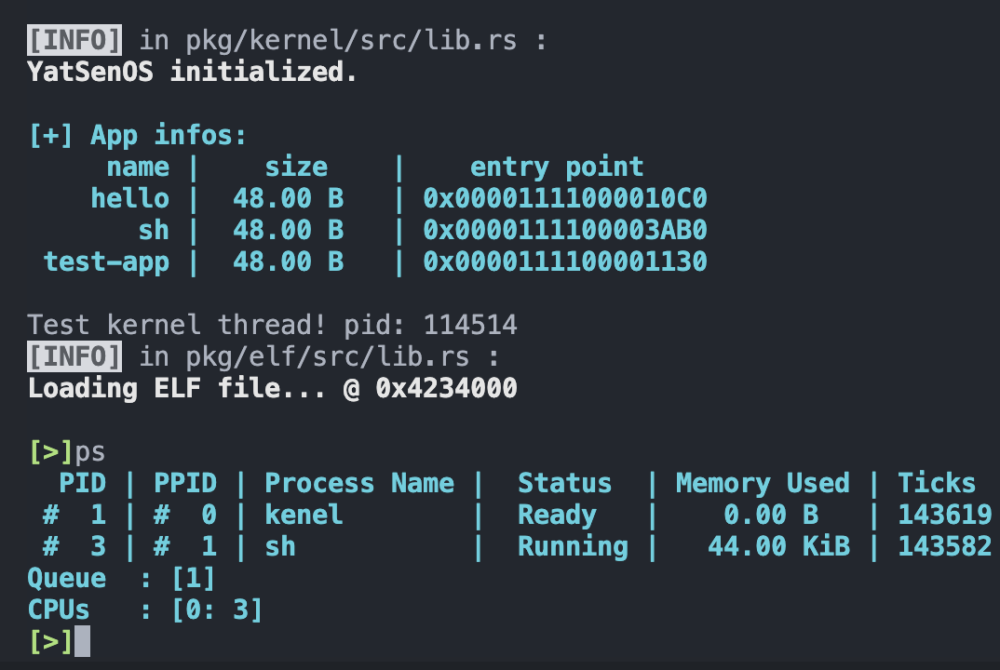

可以看到测试结果符合预期，验证了我的结论。

### 用户程序页表

为什么需要克隆内核页表？在系统调用的内核态下使用的是哪一张页表？用户态程序尝试访问内核空间会被正确拦截吗？尝试验证你的实现是否正确。

用户进程的创建过程中克隆了内核页表，获取了自己的页表，就可以为每个用户进程都分配同样的栈地址，而不会相互干扰。同时，每个用户进程都会看到共同一片内存空间，是属于内核的，也就是克隆内核页表过来得到的内核空间的记录。

在系统调用的内核态下使用的是内核自己的页表。

为例测试用户态程序尝试访问内核空间，我创建了一个用户程序 test2 ，其内容如下：

```rust
fn main() -> isize {
    println!("Trying to access keenel space!");
    let p : *mut u32 = 0xffffff0000000000 as *mut u32;
    unsafe { *p = 114514 };
    0
}
```

这个测试程序会尝试往内核空间进行写操作，测试结果如下：

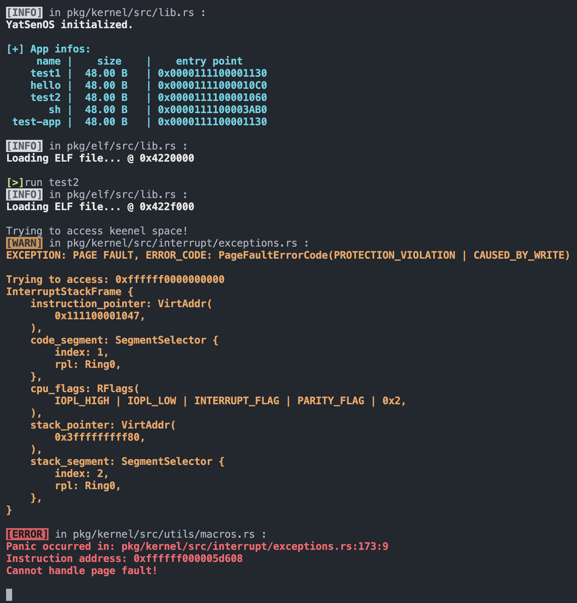

可以看到触发了 Page Fault ，也就是越界访问导致的异常成功被 CPU 捕获，验证了我的实现是正确的。

### 解释程序的运行

首先直接使用 gcc 编译，结果如下：

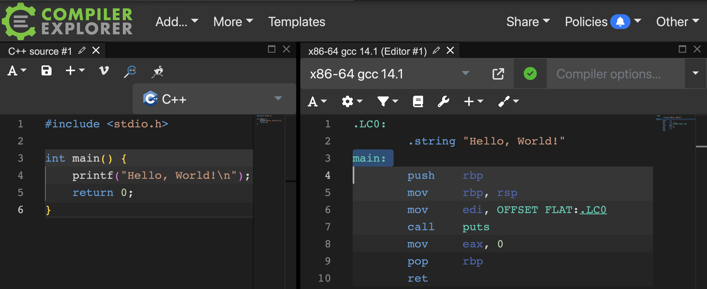

### 关闭中断

为什么在使用 `still_alive` 函数判断进程是否存活时，需要关闭中断？在不关闭中断的情况下，会有什么问题？

`still_alive` 函数内容如下：

```rust
pub fn still_alive(pid: ProcessId) -> bool {
    x86_64::instructions::interrupts::without_interrupts(|| {
        // Done // check if the process is still alive
        let status = get_process_manager()
            .get_proc(&pid)
            .expect("The process to check whether is still alice doesn't exist")
            .read()
            .status();
        status != ProgramStatus::Dead
    })
}
```

可以发现这里执行的一系列操作都依赖于 ProcessManager 的锁，使用 `get_process_manager()` 获取了这个锁。在内核进程这里获取了 ProcessManager 的锁的时候，如果有中断插入打断，有可能这个中断处理也需要获取 ProcessManage 的锁，那就会导致死锁。

我将关闭中断的部分注释掉，测试运行结果如下：

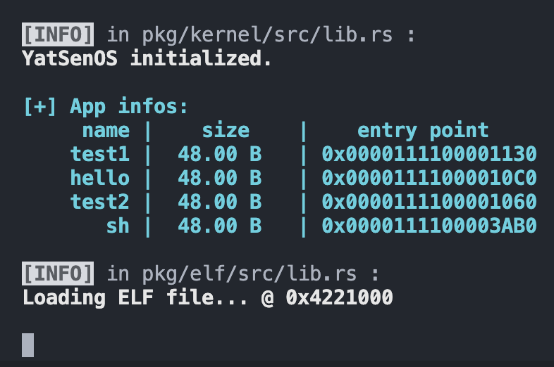

测试发现当尝试运行 `sh` 用户程序 shell 的时候死锁，用户程序无法正常运行。

而依赖于 ProcessManager 锁的操作之外的操作实际上是不需要关闭中断的，例如当我修改函数为这样：

```rust
pub fn still_alive(pid: ProcessId) -> bool {
    let status = x86_64::instructions::interrupts::without_interrupts(|| {
        // Done // check if the process is still alive
        get_process_manager()
            .get_proc(&pid)
            .expect("The process to check whether is still alice doesn't exist")
            .read()
            .status()
    });
    status != ProgramStatus::Dead
}
```

这里我将判断进程状态的逻辑放在了关闭中断部分的外面。然后测试，会发现一切正常，不会发生任何问题。

### 解释程序运行

编译程序结果如下：


假设编译得到可执行文件为 hello_world ，默认采用动态链接方式，下面为该程序运行过程的解释：

#### 创建

进程的创建由另一个进程完成，例如可以由内核进程创建，也可以由另一个用户进程创建。

如果由用户进程创建，那么就需要调用创建进程的系统调用，创建进程的过程实际上还是由内核来完成的。

创建进程的步骤包括：

读取指定位置的程序文件，也就是编译得到的可执行文件，新建一个该进程的页表，将程序加载到内存中，为该进程还需分配一片堆栈使用的内存空间，然后完成页表的映射和物理内存的分配，最后初始化用户栈，将 hello_world 的程序入口地址放到用户栈的栈顶。

#### 链接

这个程序使用了 C 标准库 libc 的 `puts` 这个函数，一般这个库也都是采用动态链接方式的，所以不需要在编译阶段处理链接，在加载进程的时候，调用该函数实际上是 libc 的全部内容将被映射到运行时相应进程的虚拟地址空间，hello_world 程序在运行时调用 `puts` 函数的时候跳转到这片虚拟地址空间中执行相应函数代码。

当然如果采用静态链接，需要在 gcc 编译的时候加上参数，这个时候 libc 中的 `puts` 函数及相关代码将也被编译，最后由链接器链接得到可执行文件 hello_world

#### 执行

运行 hello_world 的进程开始执行，这时就是 CPU 层面的过程了，刚刚编译得到的 x86_64 汇编指令实际上将从一个名为 `_start` 的入口函数开始执行，这个地址也就是刚刚加载进程的过程中初始化栈到时候放到栈顶的地址，CPU 从用户态栈中弹出这个地址，作为第一条执行的指令地址；然后进入 `main` 函数顺序执行，运行过程还会调用一次 `puts` 。

调用 `puts` 打印 `hello,world` 的过程是需要调用系统调用来实现串口输出的，这个系统调用由操作系统提供，在 libc 中依据不同操作系统平台提供了不同的调用，例如在 Linux 中需要的是 `write` 系统调用，然后将申请中断，进入内核态，交给内核完成将指定数据传输给串口的工作。

#### 退出

当程序执行结束，hello_world 没有自己主动调用系统调用来退出，所以将返回到调用它的父进程，由父进程来处理 hello_world 这次执行的进程的退出与否。

### 解释函数`x86_64::instructions::hlt`

`x86_64::instructions::hlt` 做了什么？为什么这样使用？为什么不可以在用户态中的 `wait_pid` 实现中使用？

该函数的定义如下：

```rust
/// Halts the CPU until the next interrupt arrives.
#[inline]
pub fn hlt() {
    unsafe {
        asm!("hlt", options(nomem, nostack, preserves_flags));
    }
}
```

这个函数将执行 x86_64 的 `hlt` 特权指令，这条指令将处理器置于空闲状态，即停止执行指令，并等待中断的到来。

使用该函数的目的是阻塞当前进程，可以用于等待另一个进程的退出。

用户态中的 `wait_pid` 实现中没有用该函数阻塞，因为这是特权级指令，不能在用户态使用。

尝试在 `wait_pid` 使用 `hlt` 特权指令，将 `pkg/lib/src/syscall.rs` 中修改 `sys_wait_pid` 为如下：

```rust
pub fn sys_wait_pid(pid: u16) -> isize {
    loop {
        let exit_code = syscall!(
            Syscall::WaitPid,
            pid as u64
        ) as isize;
        if exit_code != -1 {
            return exit_code
        }
        else {
            x86_64::instructions::hlt();
        }
    }
}
```

测试运行结果如下图所示：

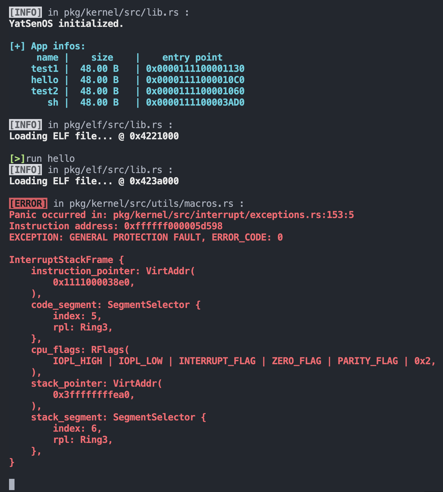

可以看到触发了 General Protection Fault ，验证了结论。

### 特权级栈

特权级栈的主要作用是在进程从一个特权级切换到另一个特权级时，保存和恢复重要的执行上下文信息，用于存储和管理进程的特权级的变化。

在用户程序使用系统调用的时候，实际上是程序从用户态申请了一次临时的向内核态的转变，这就需要特权级栈记录相关信息。

注释掉 `gdt.rs` 中特权级栈的相关设置后，直接运行测试输出 hello world 的程序，使用 `python ysos.py run` 指令运行，然后尝试输入一些字符，结果如下：

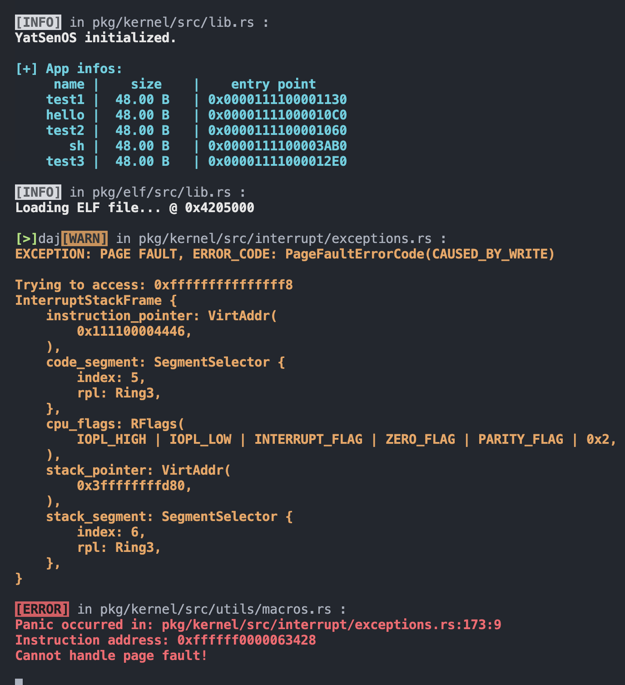

可以看到复现了思考题所描述的现象。同时发现，这个触发 Page Fault 的地址非常特别：`0xfffffffffffffff8` ，这是一个相当高的地址，按理来说我们不会访问到这个地方。

在尝试的过程中，我还发现只有输入才会触发 Page Fault ，也就是读取键盘输入的时候，而输出则不会，也就是说这有键盘输入的时候，通过系统调用会访问到 `0xfffffffffffffff8` 这个地址。

使用 `python ysos.py run -i` 指令运行，然后尝试输入一些字符，结果如下：

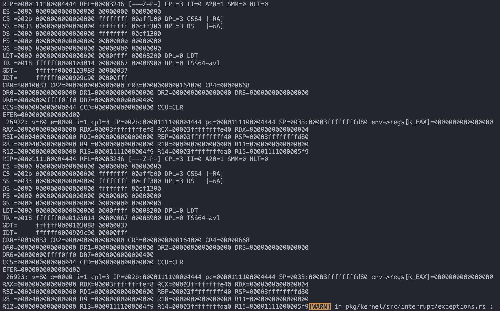

实际上，可以理解这个思考题问题中那位同学为什么注释掉特权级栈的相关代码——因为注释掉不会发生任何报错，可能他认为这就意味着这些设置是没有用的。

而之所以在我们的代码里没有使用，是因为特权级栈的使用本身是有 CPU 来完成的，也就是我们这里是由 qemu 模拟的 x86_64 CPU 来操作特权级栈的。

在 x86-64 架构中 CPU 对特权级栈的使用涉及到以下几个关键的步骤：

1. 初始化特权级栈：在系统启动时，操作系统会为每个内核线程和进程创建一个特权级栈。特权级栈是一个用于保存特权级别切换时上下文信息的专用栈。
2. 设置特权级栈指针：CPU 中有一个特殊的寄存器，称为特权级栈指针（Stack Pointer），它用于指示当前线程或进程正在使用的特权级栈的位置。
3. 特权级切换时的栈切换：当发生特权级别的切换（例如从用户模式切换到内核模式）时，CPU 会自动切换到相应的特权级栈。切换过程大致如下：
   - CPU 会保存当前特权级别的上下文信息（如寄存器状态）到当前使用的栈中。
   - CPU 会加载新的特权级别的栈指针，指向新的特权级栈。
   - CPU 会从新的特权级栈中恢复上一特权级别的上下文信息，包括寄存器状态等。
   - CPU 切换完成后，开始在新的特权级别下执行指令。
4. 特权级切换时的栈保护：为了确保特权级栈的数据安全，CPU 会使用特殊的机制来保护特权级栈。例如，在特权级切换时，CPU 可能会使用特权级栈的地址范围检查来验证栈的完整性，防止栈溢出等问题。

注释掉特权级栈之后会在系统调用获取键盘输入的时候发生 Page Fault ，我猜测和这些有关，但截至实验报告提交还没有得到准确的答案

---

此外我还发现了一个问题，不是将 `gdt.rs` 中特权级栈的相关代码注释掉，而是将特权级栈的大小改为：

- 一个很小的数，大概小于 `0x140` 左右 ，那么操作系统启动后就会发生 Triple Fault（然后不断重启）
- 一个比较小的数，大概 `0x140` 到 `0x190` 左右 ，那么试图键盘输入的时候就会触发 General Protection Fault

这些在先前的实验中我测试过是没有发生的，在这次实验开始会出现这种现象，应该和这道思考题相关。

这样的现象在先前的 lab2 中也有类似的，修改内核栈的大小的时候发现，内核栈大小太小会开机就触发 Triple Fault ，增大到一定程度后变为开机就触发 Page Fault ，再增大到一定程度才开机正常。

这两个现象感觉有一些相似之处，但其原因截至实验报告提交为止也没有得到准确的结论。

## 加分项

### 记录并打印进程页面

尝试在 `ProcessData` 中记录代码段的占用情况，并统计当前进程所占用的页面数量，并在打印进程信息时，将进程的内存占用打印出来。

在 `pkg/kernel/src/proc/data.rs` 中增加 `ProcessData` 中记录代码段的占用情况、统计当前进程所占用的代码段、栈页面数量的存储变量：

```rust
pub struct ProcessData {
    // shared data
    pub(super) env: Arc<RwLock<BTreeMap<String, String>>>,

    // process specific data
    pub(super) stack_segment: Option<PageRange>,
    pub(super) stack_memory_usage: usize, // new

    pub(super) code_segments: Option<Vec<PageRangeInclusive>>, // new
    pub(super) code_memory_usage: usize, // new
}

impl Default for ProcessData {
    fn default() -> Self {
        Self {
            env: Arc::new(RwLock::new(BTreeMap::new())),
            stack_segment: None,
            stack_memory_usage: 0, // new
            code_segments: None, // new
            code_memory_usage: 0, // new
        }
    }
}
```

在 `pkg/kernel/src/proc/process.rs` 中给 `ProcessInner` 改善 `load_elf` 方法，统计存储程序代码、进程栈占用的段并存到刚刚定义的存储变量中：

```rust
impl ProcessInner {
    ......
		pub fn load_elf(&mut self, elf: &ElfFile) {
        let alloc = &mut *get_frame_alloc_for_sure();
        let page_table = self.page_table.as_ref().unwrap();
        let mut mapper = page_table.mapper();
        // load elf to process pagetable
        let code_segments =
            elf::load_elf(
                elf,
                *PHYSICAL_OFFSET.get().unwrap(),
                &mut mapper,
                alloc,
                true,
            ).expect("Failed to load elf of app program");
        // alloc new stack for process
        let stack_segment =
            elf::map_range(
                STACK_INIT_BOT,
                STACK_DEF_PAGE,
                &mut mapper,
                alloc,
              	true,
            ).expect("Failed to alloc stack for app process");
        // set stack
        let proc_data = self
            .proc_data
            .as_mut()
            .expect("Failed to get app process data to set initial stack");
        proc_data.stack_memory_usage = stack_segment.count();
        proc_data.stack_segment = Some(stack_segment);
        proc_data.code_memory_usage = code_segments
            .iter()
            .map(|seg| seg.count())
            .sum();
        proc_data.code_segments = Some(code_segments);
    }
  	......
}
```

在 `pkg/kernel/src/proc/manager.rs` 中修改 `ProcessManager` 的 `print_process_list` 方法，增加内存占用的打印，用相似的方式实现了如下信息的输出：

- 每个进程占用的内存大小
- 内核堆 kernel heap 占用的内存大小
- 用户态堆 user heap 占用的内存大小
- 总共使用的内存大小

```rust
impl ProcessManager {
  	......
		pub fn print_process_list(&self) {
        let mut output = String::from("  PID | PPID | Process Name |  Ticks  | Memory Used | Status\n");
  			......
      	let allocator_lock = ALLOCATOR.lock();
        let kernel_heap_used = allocator_lock.used();
        drop(allocator_lock);
        let (kernel_heap_used_size, kernel_heap_used_unit) = humanized_size(kernel_heap_used as u64);
        let (kernel_heap_size, kernel_heap_unit) = humanized_size(HEAP_SIZE as u64);
        output += format!("Kernel heap used : {:>7.2} {:<3} / {:>7.2} {:<3}\n",
            kernel_heap_used_size,
            kernel_heap_used_unit,
            kernel_heap_size,
            kernel_heap_unit,
        ).as_str();

        let allocator_lock = USER_ALLOCATOR.lock();
        let user_heap_used = allocator_lock.used();
        drop(allocator_lock);
        let (user_heap_used_size, user_heap_used_unit) = humanized_size(user_heap_used as u64);
        let (user_heap_size, user_heap_unit) = humanized_size(USER_HEAP_SIZE as u64);
        output += format!("User heap used : {:>7.2} {:<3} / {:>7.2} {:<3}\n",
            user_heap_used_size,
            user_heap_used_unit,
            user_heap_size,
            user_heap_unit,
        ).as_str();

        let allocator_lock = get_frame_alloc_for_sure();
        let memory_used = allocator_lock.frames_used() as u64 * PAGE_SIZE;
        let memory_total = allocator_lock.frames_total() as u64 * PAGE_SIZE;
        drop(allocator_lock);
        let (memory_used_size, memory_used_unit) = humanized_size(memory_used );
        let (memory_total_size, memory_total_unit) = humanized_size(memory_total);
        output += format!("Memory used : {:>7.2} {:<3} / {:>7.2} {:<3}\n",
            memory_used_size,
            memory_used_unit,
            memory_total_size,
            memory_total_unit,
        ).as_str();
      	......
  	}
  	......
}
```

同时在 `pkg/kernel/src/proc/process.rs` 中修改打印进程信息的接口，统计之前存到 `ProcessData` 中的栈、代码占用的内存段总和，打印出来，并且修改打印格式，输出对齐：

```rust
impl core::fmt::Display for Process {
    fn fmt(&self, f: &mut core::fmt::Formatter) -> core::fmt::Result {
        let inner = self.inner.read();
        let (size, unit) = humanized_size(
            (inner.code_memory_usage + inner.stack_memory_usage) as u64 * 4096
        );
        write!(
            f,
            " #{:-3} | #{:-3} | {:12} |  {:<7} | {:>7.2} {:<3} | {:<7} ",
            self.pid.0,
            inner.parent().map(|p| p.pid.0).unwrap_or(0),
            inner.name,
            match inner.status {
                ProgramStatus::Running => "Running",
                ProgramStatus::Blocked => "Blocked",
                ProgramStatus::Dead => "Dead",
                ProgramStatus::Ready => "Ready",
            },
            size,
            unit,
            inner.ticks_passed,
        )?;
        Ok(())
    }
}
```

最终实现的效果如下：

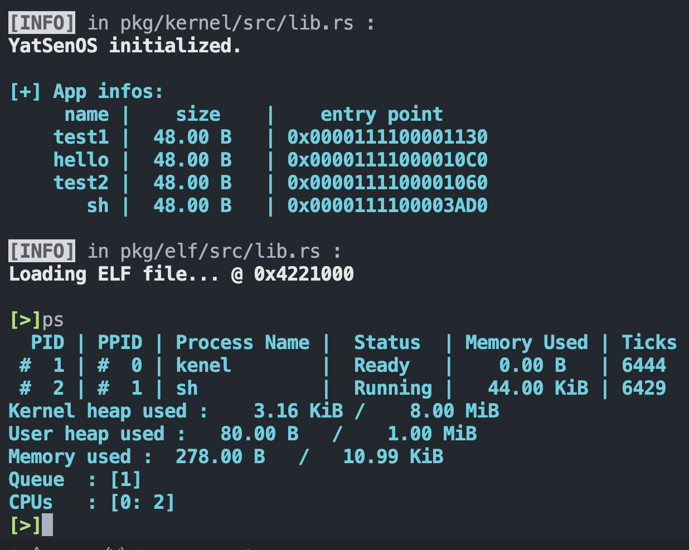

至此，可以查看内存的使用情况，然后我测试运行多几次了一下需要较大栈，占用大量内存的测试程序 test1 ：

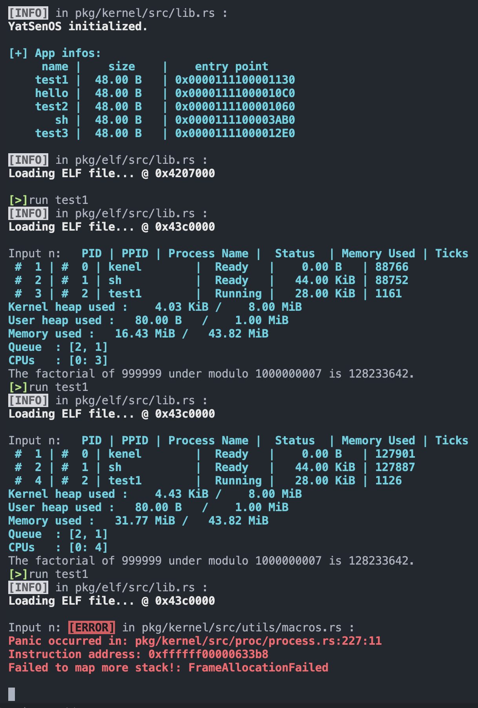

可以看到内存使用情况不断增长，每次运行 test1 程序都要消耗大约 15 MiB 左右内存，而总内存只有不到 44 MiB ，所以运行到第 3 次就会内存不够，如上图 panic 所示无法分配更多栈而 panic 报错。

### 帧分配器回收功能

在 `pkg/kernel/src/memory/frames.rs` 中：

- 给帧分配器 `BootInfoFrameAllocator` 增加一个数据结构 `Vec<PhysFrame>` 来存储回收的帧
- 实现 `FrameDeallocator` trait ，实现回收帧的功能
- 修改 `FrameAllocator` trait ，在分配帧的时候优先从回收的帧中取空余的帧来分配

```rust
pub struct BootInfoFrameAllocator {
    size: usize,
    used: usize,
    frames: BootInfoFrameIter,
    recycled: Vec<PhysFrame>,  // new
}

impl BootInfoFrameAllocator {
    pub unsafe fn init(memory_map: &MemoryMap, size: usize) -> Self {
        BootInfoFrameAllocator {
            size,
            frames: create_frame_iter(memory_map),
            used: 0,
            recycled: Vec::new(),  // new
        }
    }
}

unsafe impl FrameAllocator<Size4KiB> for BootInfoFrameAllocator {
    fn allocate_frame(&mut self) -> Option<PhysFrame> {
        if let Some(frame) = self.recycled.pop() {
            Some(frame)
        } else {
            self.used += 1;
            self.frames.next()
        }
    }
  	......
}

impl FrameDeallocator<Size4KiB> for BootInfoFrameAllocator {
    unsafe fn deallocate_frame(&mut self, frame: PhysFrame) {
        // Done // TODO: deallocate frame (not for lab 2)
        self.recycled.push(frame);
    }
}
```

### 进程栈的回收

基于帧回收器的实现，在 `elf` 中实现 `unmap_range` 函数，从页表中取消映射一段连续的页面，并使用帧回收器进行回收。之后，在合适的地方，结合 `ProcessData` 中存储的页面信息，利用这个函数实现进程栈的回收。其他进程资源（如页表、代码段、数据段等）的回收将会在后续实验中实现，目前暂时不需要考虑。

这里可以考虑在 kill 进程的时候调用 `unmap_range` 函数，这样就可以将其栈空间回收。所以修改 `pkg/kernel/src/proc/process.rs` 中的 `proc::process::ProcessInner.kill` 函数，增加对 `unmap_range` 函数的调用来实现回收内存：

```rust
impl ProcessInner {
  	......
		pub fn kill(&mut self, ret: isize) {
      	......
        let page_table = self.page_table.take().unwrap();
        let mut mapper = page_table.mapper();
        let frame_deallocator = &mut *get_frame_alloc_for_sure();
        let proc_data = self.proc_data.as_mut().unwrap();
        let stack = proc_data.stack_segment.unwrap();
        elf::unmap_range(
            stack.start.start_address().as_u64(),
            stack.count() as u64,
            &mut mapper,
            frame_deallocator,
            true,
        ).unwrap();
        drop(page_table);
        // 需要先调用回收，最后清空进程信息
        self.proc_data = None;
    }
}
```

然后测试运行，就可以看到打印出来的内存使用情况比之前改善了，每次运行一次用户态测试进程只会多消耗 0.02 KiB 左右的内存，按照现在的内存大小可以运行很多次测试程序：

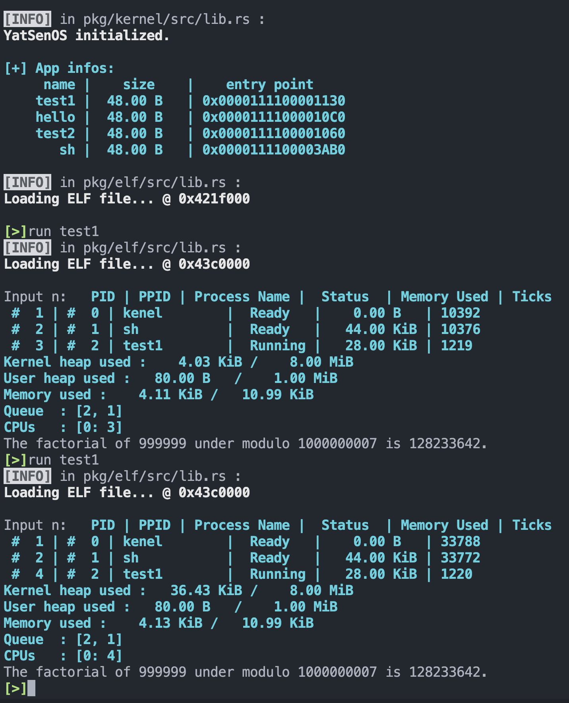

### 用户态 sleep

尝试利用 `UefiRuntime` 和 `chrono` crate，获取当前时间，并将其暴露给用户态，以实现 `sleep` 函数。

#### 内核部分

首先，在 `pkg/kernel/src/interrupt/clock.rs` 增添数据结构 `UefiRuntime` ，并使用锁进行保护。按照实验文档提示实现如下：

```rust
once_mutex!(UEFI_SERVICE: UefiRuntime);
guard_access_fn! {
    pub get_uefi_runtime(UEFI_SERVICE: UefiRuntime)
}

pub fn uefi_service_init(boot_info: &'static BootInfo) {
    unsafe {
        init_UEFI_SERVICE(UefiRuntime::new(boot_info));
    }
}

pub struct UefiRuntime {
    runtime_service: &'static RuntimeServices,
}

impl UefiRuntime {
    pub unsafe fn new(boot_info: &'static BootInfo) -> Self {
        Self {
            runtime_service: boot_info.system_table.runtime_services(),
        }
    }

    pub fn get_time(&self) -> Time {
        self.runtime_service.get_time().unwrap()
    }
}
```

这个锁还需要实现自己的初始化函数，所以这里实现了一个 `uefi_service_init` 函数。这个初始化的步骤可以放在中断模块的初始化中，在 `pkg/kernel/src/interrupt/mod.rs` 中给 `init` 函数增加：

```rust
pub fn init(boot_info: &'static BootInfo) {
    ......
    clock::uefi_service_init(boot_info);
}
```

当然这里原本没有 `boot_info` 参数，所以增加这个参数之后，`pkg/kernel/src/lib.rs` 中相应的对此的引用也要加上传入这个参数。

然后在此基础上实现获取当前时间的系统调用应该执行的函数，`pkg/kernel/src/interrupt/syscall/service.rs` ：

```rust
pub fn sys_clock() -> i64{
    let time = clock::get_uefi_runtime_for_sure().get_time();
    NaiveDate::from_ymd_opt(time.year() as i32, time.month() as u32, time.day() as u32)
        .unwrap_or_default()
        .and_hms_nano_opt(
            time.hour() as u32,
            time.minute() as u32,
            time.second() as u32,
            time.nanosecond(),
        )
        .unwrap_or_default()
        .timestamp_nanos_opt()
        .unwrap_or_default()
}
```

接着就可以调用这个函数作为系统调用了，不过还先需要定义获取当前时间的系统调用号，按照 linux 约定，在 `pkg/syscall/src/lib.rs` 中增加如下：

```rust
pub enum Syscall {
    ......
    Time = 201,
  	......
}
```

相应地，在 `pkg/kernel/src/interrupt/syscall/mod.rs` 中定义匹配系统调用号为 `Syscall:Time` 的处理函数为刚刚实现的 `sys_clock()` ：

```rust
pub fn dispatcher(context: &mut ProcessContext) {
  	......
		match args.syscall {
      	......
				Syscall::Time => context.set_rax(sys_clock() as usize),
      	......
		}
}
```

#### 用户态库部分

在 `pkg/lib/src/syscall.rs` 中，定义用户态库的接口来调用刚刚在内核实现的系统调用：

```rust
#[inline(always)]
pub fn sys_time() -> NaiveDateTime {
    let time = syscall!(Syscall::Time) as i64;
    const BILLION: i64 = 1_000_000_000;
    NaiveDateTime::from_timestamp_opt(time / BILLION, (time % BILLION) as u32).unwrap_or_default()
}
```

至此为止，就实现了获取当前时间的系统调用了。接下来实现 `sleep` 函数，在 `pkg/lib/src/lib.rs` 中实现这个用户态库函数：

```rust
pub fn sleep(millisecs: i64) {
    let start = sys_time();
    let dur = Duration::milliseconds(millisecs);
    let mut current = start;
    while current - start < dur {
        current = sys_time();
    }
}
```

#### 测试程序

新建一个用户程序 test3 ，内容如下：

```rust
fn main() -> isize {
    let start = sys_time();
    println!("Before sleep: {:#?}", start);
    sleep(1000);
    let end = sys_time();
    println!("After sleep: {:#?}", end);
    0
}
```

测试运行结果如下：

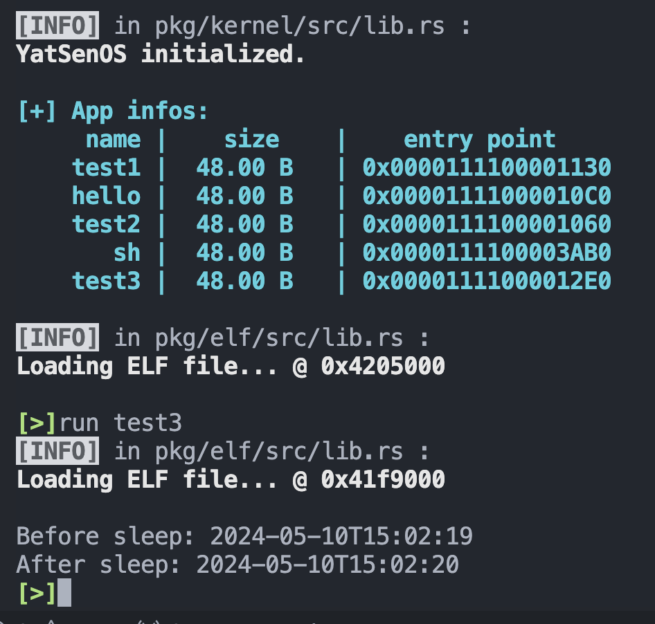
