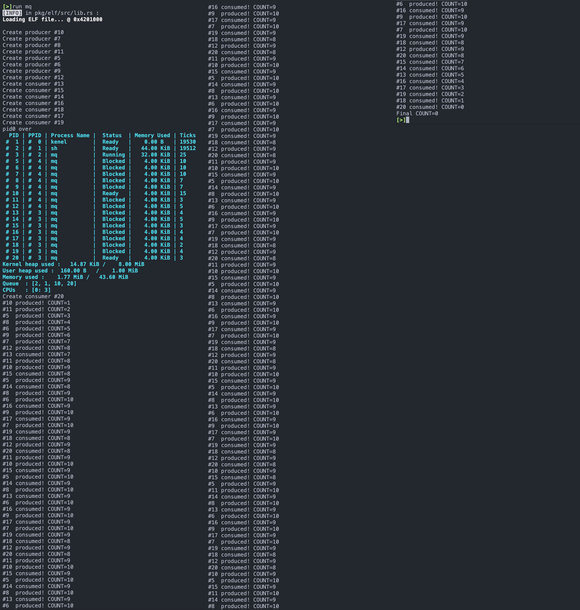

## fork 的实现

### 系统调用

在用户态库中定义一个可直接调用的系统调用函数，这里约定：

- 子进程在系统调用后将得到 `0` 的返回值，而父进程将得到子进程的 PID
- 如果创建失败，父进程将得到 `-1` 的返回值

```rust
#[inline(always)]
pub fn sys_fork() -> u16 {
    let pid = syscall!(Syscall::Fork) as i64;
    pid as u16
}
```

在 `pkg/syscall/src/lib.rs` 中增加系统调用号 ：

```rust
pub enum Syscall {
		......
    Fork = 58,
  	......
}
```

然后在 `pkg/kernel/src/interrupt/syscall/mod.rs` 中分派该系统调用号的执行函数，指定其为 `proc::fork` ：

```rust
        // context: &mut ProcessContext -> None
        Syscall::Fork => proc::fork(context),
```

接下来就着手实现 `proc::fork` 。

### 进程管理

`pkg/kernel/src/proc/paging.rs` 中增加 2 个函数供调用：

- 克隆页表信息所需的 `fork`
- 获取引用计数的 `using_count` ，来确保进程逐个退出时，只有最后一个退出的进程会进行页表内容的释放。

```rust
impl PageTableContext {
    // ...
    pub fn using_count(&self) -> usize {
        Arc::strong_count(&self.reg)
    }

    pub fn fork(&self) -> Self {
        // forked process shares the page table
        Self {
            reg: self.reg.clone(),
        }
    }
    // ...
}
```

子进程自己的处理器上下文和父进程的处理器上下文之间只有 2 个不同：

- 返回值不同，子进程需要返回 0 ，父进程不一定
- 栈指针不同，因为两者各自有独立的栈空间

对于第二个不同进行修改，需要在 `pkg/kernel/src/proc/context.rs` 中增加一个函数调用，实现将 rsp 寄存器的内容，也就是栈指针寄存器的内容，使其高位增加一个指定的位移，可以用于使其变为子进程的栈指针：

```rust
impl ProcessContext {
  	......
    #[inline]
    pub fn set_stack_offset(&mut self, offset: u64) {
        self.value.stack_frame.stack_pointer += offset;
    }
}
```

按照实验文档，可以定义如下函数，实现将父进程的栈空间高效地拷贝到子进程的栈空间：

```rust
fn clone_range(src_addr: u64, dest_addr: u64, size: usize) {
    trace!("Clone range: {:#x} -> {:#x}", src_addr, dest_addr);
    unsafe {
        copy_nonoverlapping::<u8>(
            src_addr as *mut u8,
            dest_addr as *mut u8,
            size * Size4KiB::SIZE as usize,
        );
    }
}
```

最后实现创建子进程 ProcessInner 所用的 `ProcessInner.fork` 函数方法：

```rust
impl ProcessInner {
  	pub fn fork(&mut self, parent: Weak<Process>) -> ProcessInner {
        // Done // FIXME: get current process's stack info
        let parent_stack_segment = self.stack_segment.expect("Failed to get stack info of parent");
        let parent_stack_base = parent_stack_segment.start.start_address();
        let mut child_stack_base = parent_stack_base - STACK_MAX_SIZE;
        let parent_stack_pages = parent_stack_segment.count() as u64;

        // Done // FIXME: clone the process data struct
        let mut child_proc_data = self.proc_data.clone().expect("Failed to clone proc data of parent");

        // Done // FIXME: clone the page table context (see instructions)
        let parent_page_table = self.page_table.as_ref().expect("Failed to get page table of parent");
        let child_page_table = parent_page_table.fork();

        // Done // FIXME: alloc & map new stack for child (see instructions)
        let mut child_stack_segment : Result<PageRange, MapToError<Size4KiB>>;
        while {
            child_stack_segment = elf::map_range(
                child_stack_base.as_u64(),
                parent_stack_pages,
                &mut child_page_table.mapper(),
                &mut *get_frame_alloc_for_sure(),
                true
            );
            child_stack_segment.is_err()
        }{
            trace!("Map thread stack to {:#x} failed.", child_stack_base);
            child_stack_base -= STACK_MAX_SIZE; // stack grow down
        }

        // Done // FIXME: copy the *entire stack* from parent to child
        ProcessInner::clone_range(
            parent_stack_base.as_u64(),
            child_stack_base.as_u64(),
            parent_stack_pages as usize
        );

        // Done // FIXME: update child's context with new *stack pointer*
        //          > update child's stack to new base
        //          > keep lower bits of *rsp*, update the higher bits
        //          > also update the stack record in process data
        let mut child_context = self.context;
        child_context.set_stack_offset(child_stack_base - parent_stack_base);

        // Done // FIXME: set the return value 0 for child with `context.set_rax`
        child_context.set_rax(0);

        // Done // FIXME: construct the child process inner
        child_proc_data.stack_segment = Some(child_stack_segment.unwrap());
        child_proc_data.code_memory_usage = 0;

        // NOTE: return inner because there's no pid record in inner
        Self {
            name: self.name.clone(),
            exit_code: None,
            parent: Some(parent),
            status: ProgramStatus::Ready,
            ticks_passed: 0,
            context: child_context,
            page_table: Some(child_page_table),
            children: Vec::new(),
            proc_data: Some(child_proc_data),
        }
    }
}
```

然后着手实现 `Process.fork` 函数方法：

```rust
impl Process {
  	......
		pub fn fork(self: &Arc<Self>) -> Arc<Self> {
        // Done // FIXME: lock inner as write
        let mut parent_inner = self.write();
        // Done // FIXME: inner fork with parent weak ref
        let child_inner = parent_inner.fork(Arc::downgrade(self));

        // Done // FIXME: create child pid
        let child_pid = ProcessId::new();

        // FOR DBG: maybe print the child process info
        //          e.g. parent, name, pid, etc.
        debug!(
            "Thread {}#{} forked to {} #{}.",
            parent_inner.name, self.pid, child_inner.name, child_pid
        );

        // Done // FIXME: make the arc of child
        let child = Arc::new(Self {
            pid: child_pid,
            inner: Arc::new(RwLock::new(child_inner)),
        });

        // FIXME: add child to current process's children list
        parent_inner.children.push(child.clone());

        // Done // FIXME: set fork ret value for parent with `context.set_rax`
        parent_inner.context.set_rax(child.pid.0 as usize);

        // Done // FIXME: mark the child as ready & return it
        parent_inner.pause();

        child
    }
}
```

在 `pkg/kernel/src/proc/manager.rs` 中实现 `ProcessManager.fork` 函数方法：

```rust
impl ProcessManager {
		pub fn fork(&self) {
        // Done // FIXME: get current process
        let parent_proc = self.current();

        // Done // FIXME: fork to get child
        let child_proc = parent_proc.fork();
        let child_pid = child_proc.pid();

        // Done // FIXME: add child to process list
        self.add_proc(child_pid, child_proc);

        // FOR DBG: maybe print the process ready queue?
        self.push_ready(child_pid);
        debug!("Ready queue after fork: {:?}", self.ready_queue.lock());
    }
}
```

最后，在 `pkg/kernel/src/proc/mod.rs` 中实现可供调用的 `proc::fork` 函数：

```rust
pub fn fork(context: &mut ProcessContext) {
    x86_64::instructions::interrupts::without_interrupts(|| {
        let manager = get_process_manager();
        // FIXME: save_current as parent
        manager.save_current(context);
        let parent_pid = manager.current().pid();
        // FIXME: fork to get child
        manager.fork();
        // FIXME: push to child & parent to ready queue
        manager.push_ready(parent_pid);
        // FIXME: switch to next process
        manager.switch_next(context);
    })
}
```

### 功能测试

测试运行实验文档给出的用户程序，但初次运行并不顺利，得到了如下报错：


这个报错看起来挺神秘的，我还是第一次遇到，经过定位，得到保存位置的代码位于 `pkg/kernel/src/proc/process.rs` 的 `proc::process::ProcessInner.fork` 函数的如下位置：

```rust
// ......
// Done // FIXME: update child's context with new *stack pointer*
//          > update child's stack to new base
//          > keep lower bits of *rsp*, update the higher bits
//          > also update the stack record in process data
let mut child_context = self.context;
child_context.set_stack_offset(child_stack_base - parent_stack_base);
// ......
```

为了弄清楚报错增加了一些 debug 的打印信息操作：

```rust
// ......
// Done // FIXME: update child's context with new *stack pointer*
//          > update child's stack to new base
//          > keep lower bits of *rsp*, update the higher bits
//          > also update the stack record in process data
let mut child_context = self.context;
println!("debug1");
println!("{:#?}", child_stack_base);
println!("{:#?}", parent_stack_base);
child_context.set_stack_offset(child_stack_base - parent_stack_base);
// ......
```

得到如下结果：


这时注意到，2 个 `VirtAddr` 类型的数据不能直接做减法，然后注意到其实这里 `child_stack_base` 和 `parent_stack_base` 其实在使用的时候都是作为 `u64` 类型，所以干脆将这 2 个变量类型改为 `u64` ：

```rust
let parent_stack_base = parent_stack_segment.start.start_address().as_u64();
let mut child_stack_base = parent_stack_base - STACK_MAX_SIZE;
```

然后后面调用这 2 个变量不需要再使用 `as_u64()` ，也没有再报错。

最后测试结果：


## 并发与锁机制

### 自旋锁

`pkg/lib/src/sync.rs` 中实现自旋锁的 2 个关键调用函数，起初我的实现如下：

```rust
impl SpinLock {
    pub fn acquire(&self) {
        // FIXME: acquire the lock, spin if the lock is not available
        while !AtomicBool::load(&self.bolt, Ordering::Acquire) {
            core::hint::spin_loop();
        }
      	// 非原子操作,可能出现问题
        AtomicBool::store(&self.bolt, false, Ordering::Relaxed);
    }

    pub fn release(&self) {
        // FIXME: release the lock
        AtomicBool::store(&self.bolt, true, Ordering::Relaxed);
    }
}
```

但是这很快就注意到问题，那就是 `acquire` 函数中，检查当前锁状态和更新当前锁状态这 2 个操作是分开的，不是一个原子操作。如果检查完当前锁状态的时候有中断打断，就会出现不一致的问题。

根据实验文档的提示，这里可以采用另一个函数 `AtomicBool::compare_exchange` ，这是一个能够检查并更新目标变量状态的原子操作，可以解决这个问题。所以改进的实现如下：

```rust
impl SpinLock {
    pub fn acquire(&self) {
        // Done // FIXME: acquire the lock, spin if the lock is not available
        while {
            self
            .bolt
            .compare_exchange(
                false,
                true,
                Ordering::Acquire,
                Ordering::Relaxed
            )
            .is_err()
        } {
            core::hint::spin_loop();
        }
    }

    pub fn release(&self) {
        // Done // FIXME: release the lock
        AtomicBool::store(&self.bolt, true, Ordering::Relaxed);
    }
}
```

### 信号量

首先在 `pkg/syscall/src/lib.rs` 中定义信号量所需的系统调用，采用和 Linux 一致的系统调用号：

```rust
pub enum Syscall {
  	......
  	Sem = 66,
  	......
}
```

然后在 `pkg/kernel/src/interrupt/syscall/mod.rs` 中分派该系统调用号的执行函数，指定其为 `sys_sem` ：

```rust
        // op: u8, key: u32, val: usize -> ret: any
        Syscall::Sem => sys_sem(&args, context),
```

这里约定：

- `op` 为操作码，放置在 `rdi` 寄存器中，通过 `args.arg0` 来进行访问
- `key` 为信号量的键值，放置在 `rsi` 寄存器中，通过 `args.arg1` 来进行访问
- `val` 为信号量的值，放置在 `rdx` 寄存器中，通过 `args.arg2` 来进行访问
- `ret` 为返回值

在 `pkg/kernel/src/proc/sync.rs` 中实现，相关的信号量数据结构和函数操作。

实现 `Semaphore` 的 `wait` (P 操作) 和 `signal` (V 操作) 这两个关键函数调用：

```rust
impl Semaphore {
  	......
  	pub fn wait(&mut self, pid: ProcessId) -> SemaphoreResult {
        // Done // FIXME: if the count is 0, then push pid into the wait queue
        //          return Block(pid)
        if self.count ** 0 {
            self.wait_queue.push_back(pid);
            SemaphoreResult::Block(pid)
        }
        // Done // FIXME: else decrease the count and return Ok
        else {
            self.count -= 1;
            SemaphoreResult::Ok
        }
    }

  	pub fn signal(&mut self) -> SemaphoreResult {
        // Done // FIXME: if the wait queue is not empty
        //          pop a process from the wait queue
        //          return WakeUp(pid)
        if !self.wait_queue.is_empty() {
            let pid = self
                .wait_queue
                .pop_front()
                .expect("Failed to pop pid from wait queue of semaphore");
            SemaphoreResult::WakeUp(pid)
        }
        // Done // FIXME: else increase the count and return Ok
        else {
            self.count += 1;
            SemaphoreResult::Ok
        }
    }
}
```

然后为了实现不同种类资源的使用，完善 KV 存储的 `SemaphoreSet` 类型的 4 个关键函数调用，包括新的信号量的插入、删除信号量、对指定信号量执行 `wait` （P 操作）、对对指定信号量执行 `signal` （P 操作）：

```rust
impl SemaphoreSet {
    pub fn insert(&mut self, key: u32, value: usize) -> bool {
        trace!("Sem Insert: <{:#x}>{}", key, value);

        // Done // FIXME: insert a new semaphore into the sems
        //          use `insert(/* ... */).is_none()`
        let k = SemaphoreId(key);
        let v = Mutex::new(Semaphore::new(value));
        self.sems.insert(k, v).is_none()
    }

    pub fn remove(&mut self, key: u32) -> bool {
        trace!("Sem Remove: <{:#x}>", key);

        // Done // FIXME: remove the semaphore from the sems
        //          use `remove(/* ... */).is_some()`
        let k = SemaphoreId(key);
        self.sems.remove(&k).is_some()
    }

    /// Wait the semaphore (acquire/down/proberen)
    pub fn wait(&self, key: u32, pid: ProcessId) -> SemaphoreResult {
        let sid = SemaphoreId::new(key);

        // Done // FIXME: try get the semaphore from the sems
        //         then do it's operation
        let res = self.sems.get(&sid);
        if res.is_some() {
            res.unwrap().lock().wait(pid);
        }

        // Done // FIXME: return NotExist if the semaphore is not exist
        SemaphoreResult::NotExist
    }

    /// Signal the semaphore (release/up/verhogen)
    pub fn signal(&self, key: u32) -> SemaphoreResult {
        let sid = SemaphoreId::new(key);

        // Done // FIXME: try get the semaphore from the sems
        //         then do it's operation
        // Done // FIXME: return NotExist if the semaphore is not exist
        let res = self.sems.get(&sid);
        if res.is_some() {
            res.unwrap().lock().signal()
        } else {
            SemaphoreResult::NotExist
        }
    }
}
```

在 `pkg/kernel/src/proc/data.rs` 中增加刚刚实现的 `SemaphoreSet` 数据结构：

```rust
pub struct ProcessData {
    ......
    pub(super) semaphores: Arc<RwLock<SemaphoreSet>>,
}

impl Default for ProcessData {
    fn default() -> Self {
        Self {
            ......
            semaphores: Arc::new(RwLock::new(SemaphoreSet::default())),
        }
    }
}
```

以及函数调用，分别调用刚刚实现的 `SemaphoreSet` 的 4 个函数方法：

```rust
impl ProcessData {
  	......
  	   #[inline]
    pub fn new_sem(&mut self, key: u32, value: usize) -> bool {
        self.semaphores.write().insert(key, value)
    }

    #[inline]
    pub fn remove_sem(&mut self, key: u32) -> bool {
        self.semaphores.write().remove(key)
    }

    #[inline]
    pub fn sem_signal(&mut self, key: u32) -> SemaphoreResult {
        self.semaphores.read().signal(key)
    }

    #[inline]
    pub fn sem_wait(&mut self, key: u32, pid: ProcessId) -> SemaphoreResult {
        self.semaphores.read().wait(key, pid)
    }
}
```

然后，为了实现阻塞和唤醒的功能，先在 `pkg/kernel/src/proc/process.rs` 中给 `ProcessInner` 补充一个将进程状态设置为 `ProgramStatus::Blocked` 功能的函数：

```rust
impl ProcessInner {
		......
  	pub fn block(&mut self) {
        self.status = ProgramStatus::Blocked;
    }
  	......
}
```

然后在 `pkg/kernel/src/proc/manager.rs` 中，给 `ProcessManager` 增加 2 个函数：

- `wake_up` ，用于将指定进程唤醒
- `block` ，用于将指定进程阻塞

```rust
impl ProcessManager {
  	......
		pub fn wake_up(&self, pid: ProcessId) {
        if let Some(proc) = self.get_proc(&pid) {
            proc.write().pause();
            self.push_ready(pid);
        }
    }

    pub fn block(&self, pid: ProcessId) {
        if let Some(proc) = self.get_proc(&pid) {
            proc.write().block();
        }
    }
  	......
}
```

接着，在 `pkg/kernel/src/proc/mod.rs` 中实现 `SemaphoreSet` 的 4 种操作的函数调用供系统调用使用：

```rust
pub fn new_sem(key: u32, value: usize) -> isize {
    x86_64::instructions::interrupts::without_interrupts(|| {
        get_process_manager().current().write().new_sem(key, value) as isize
    })
}

pub fn remove_sem(key: u32) -> isize {
    x86_64::instructions::interrupts::without_interrupts(|| {
        get_process_manager().current().write().remove_sem(key) as isize
    })
}

pub fn sem_signal(key: u32, context: &mut ProcessContext) {
    x86_64::instructions::interrupts::without_interrupts(|| {
        let manager = get_process_manager();
        let ret = manager.current().write().sem_signal(key);
        match ret {
            SemaphoreResult::Ok => context.set_rax(0),
            SemaphoreResult::NotExist => context.set_rax(1),
            SemaphoreResult::WakeUp(pid) => manager.wake_up(pid),
            _ => unreachable!(),
        }
    })
}

pub fn sem_wait(key: u32, context: &mut ProcessContext) {
    x86_64::instructions::interrupts::without_interrupts(|| {
        let manager = get_process_manager();
        let pid = processor::get_pid();
        let ret = manager.current().write().sem_wait(key, pid);
        match ret {
            SemaphoreResult::Ok => context.set_rax(0),
            SemaphoreResult::NotExist => context.set_rax(1),
            SemaphoreResult::Block(pid) => {
                // Done // FIXME: save, block it, then switch to next
                //        maybe use `save_current` and `switch_next`
                manager.save_current(context);
                manager.block(pid);
                manager.switch_next(context);
            }
            _ => unreachable!(),
        }
    })
}
```

最后就可以根据系统调用的参数执行这 4 个函数之一了，在 `pkg/kernel/src/interrupt/syscall/service.rs` 中根据 `args.arg0` 执行 4 种函数：

```rust
pub fn sys_sem(args: &SyscallArgs, context: &mut ProcessContext) {
    match args.arg0 {
        0 => context.set_rax(proc::new_sem(args.arg1 as u32, args.arg2) as usize),
        1 => context.set_rax(proc::remove_sem(args.arg1 as u32)  as usize),
        2 => proc::sem_signal(args.arg1 as u32, context),
        3 => proc::sem_wait(args.arg1 as u32, context),
        _ => context.set_rax(usize::MAX),
    }
}
```

### 完善用户态库

刚刚完成了系统调用，对于用户态来说已经可以使用了，但是还只是一个裸露的系统调用，不够方便，所以还需要像先前其他系统调用一样封装一些功能直观、方便调用的用户态库函数。

在 `pkg/lib/src/syscall.rs` 中将刚刚实现的系统调用根据 4 种参数分别封装为一个调用函数，使用不同的 `op` 参数来进行信号量的用户态函数的分配：

```rust
#[inline(always)]
pub fn sys_new_sem(key: u32, value: usize) -> isize {
    syscall!(Syscall::Sem, 0, key as usize, value) as isize
}

#[inline(always)]
pub fn sys_remove_sem(key: u32) -> isize {
    syscall!(Syscall::Sem, 1, key as usize) as isize
}

#[inline(always)]
pub fn sys_sem_signal(key: u32) -> isize {
    syscall!(Syscall::Sem, 2, key as usize) as isize
}

#[inline(always)]
pub fn sys_sem_wait(key: u32) -> isize {
    syscall!(Syscall::Sem, 3, key as usize) as isize
}
```

在 `pkg/lib/src/sync.rs` 中实现信号量 `Semaphore` 类的数据结构与方法如下：

```rust
pub struct Semaphore {
    // Done /* FIXME: record the sem key */
    key: u32
}

impl Semaphore {
    pub const fn new(key: u32) -> Self {
        Semaphore { key }
    }

    #[inline(always)]
    pub fn init(&self, value: usize) -> bool {
        sys_new_sem(self.key, value)
    }

    // Done /* FIXME: other functions with syscall... */
    #[inline(always)]
    pub fn release(&self) {
        while sys_sem_signal(self.key) != 0 {}
    }

    #[inline(always)]
    pub fn acquire(&self) {
        while sys_sem_wait(self.key) != 0 {}
    }

    #[inline(always)]
    pub fn free(&self) -> bool {
        sys_remove_sem(self.key)
    }
}
```

## 测试任务

### 多线程计数器

```rust
const THREAD_COUNT: usize = 8;  // 每次测试创建 8 个线程用于计数
static mut COUNTER: isize = 0;  // 计数变量
static SEM : Semaphore = Semaphore::new(114514);  // 信号量
static SPINLOCK : SpinLock = SpinLock::new();  // 锁

fn main() -> isize {
    let pid = sys_fork();

    if pid ** 0 {
        test_spin();  // 子进程先进行自旋锁的测试
    } else {
        sys_wait_pid(pid);
        test_semaphore();  // 父进程再进行信号量的测试
    }
    0
}

fn test_semaphore() {
    let mut pids = [0u16; THREAD_COUNT];

    SEM.init(1);  // 初始化信号量,只有一个 COUNTER 故资源数量为 1

    for i in 0..THREAD_COUNT {
        let pid = sys_fork();  // 创建 8 个线程
        if pid ** 0 {
            for _ in 0..100 {  // 每条线程计数 100 次
                SEM.acquire();
                inc_counter();  // 访问临界区
                SEM.release();
            }
            sys_exit(0);
        } else {
            pids[i] = pid; // only parent knows child's pid
        }
    }

    let cpid = sys_get_pid();
    println!("[Semaphore test] process #{} holds threads: {:?}", cpid, &pids);
    sys_stat();

    for i in 0..THREAD_COUNT {
        println!("[Semaphore test] #{} waiting for #{}...", cpid, pids[i]);
        sys_wait_pid(pids[i]);
    }

    SEM.free();  // 释放信号量

    println!("[Semaphore test] COUNTER result: {}", unsafe { COUNTER });
}

fn test_spin() {
    let mut pids = [0u16; THREAD_COUNT];

    for i in 0..THREAD_COUNT {
        let pid = sys_fork();  // 创建 8 个线程
        if pid ** 0 {
            for _ in 0..100 {  // 每条线程计数 100 次
                SPINLOCK.acquire();
                inc_counter();  // 访问临界区
                SPINLOCK.release();
            }
            sys_exit(0);
        } else {
            pids[i] = pid; // only parent knows child's pid
        }
    }

    let cpid = sys_get_pid();
    println!("[Spin lock test] process #{} holds threads: {:?}", cpid, &pids);
    sys_stat();

    for i in 0..THREAD_COUNT {
        println!("[Spin lock test] #{} waiting for #{}...", cpid, pids[i]);
        sys_wait_pid(pids[i]);
    }

    println!("[Spin lock test] COUNTER result: {}", unsafe { COUNTER });
}

/// Increment the counter
///
/// this function simulate a critical section by delay
/// DO NOT MODIFY THIS FUNCTION
fn inc_counter() {
    unsafe {
        delay();
        let mut val = COUNTER;
        delay();
        val += 1;
        delay();
        COUNTER = val;
    }
}

#[inline(never)]
#[no_mangle]
fn delay() {
    for _ in 0..0x100 {
        core::hint::spin_loop();
    }
}

entry!(main);
```

该多线程计数器程序中首先创建了一个子进程，子进程先进行自旋锁的测试，然后父进程再进行信号量的测试。每次测试分别创建 8 个线程，每一条线程计数 100 次。这样如果自旋锁和信号量的实现无误，那么计数器总共计数 1600 次。

测试结果如下：


可见每次测试让 `COUNTER` 增加 800 ，最终结果为 1600 ，符合预期。

#### 问题

信号量的释放 `SEM.free()` 的位置需要注意，在一开始我错误地将其放在了创建线程之后，结果导致了死锁，测试信号量的线程全部都被阻塞在等待一个已经被释放了不存在的资源。为此我 debug 了好久，排查了很久才发现原来是这里 `SEM.free()` 的位置出现的问题。

总结经验，实际上还是因为自己不是特别熟悉多线程编程时的细节，想当然地认为创建线程部分结束就是线程实际执行结束了，但实际上一定要等到 `sys_wait_pid` 返回才说明对应的线程结束，所以需要在所有线程经过 `sys_wait_pid` 返回之后才释放信号量。

### 消息队列

定义全局变量如下：

```rust
const QUEUE_COUNT: usize = 8;
static mut COUNT: usize = 0;  // 消息队列内容数量
static IS_NOT_FULL: Semaphore = Semaphore::new(114);  // 生产者之间互斥
static IS_NOT_EMPTY: Semaphore = Semaphore::new(514);  // 消费者之间互斥
static MUTEX: Semaphore = Semaphore::new(1919180);  // 消息队列的互斥锁
static mut PIDS_PRODUCERS : [u16; QUEUE_COUNT] = [0; QUEUE_COUNT];  // 存储生产者的pid
static mut PIDS_CONSUMERS : [u16; QUEUE_COUNT] = [0; QUEUE_COUNT];  // 存储消费者的pid
```

生产者会产生 10 个消息，实现如下：

```rust
fn producer() -> ! {
    let pid = sys_get_pid();
    println!("Create producer #{}", pid);
    for _ in 0..10 {
        IS_NOT_FULL.acquire();
        MUTEX.acquire();
        unsafe { COUNT += 1 }
        println!("#{:<2} produced! COUNT={}",pid, unsafe { COUNT });
        MUTEX.release();
        IS_NOT_EMPTY.release();
    }
    sys_exit(0);
}
```

消费者消费 10 个消息，实现如下：

```rust
fn consumer() -> ! {
    let pid = sys_get_pid();
    println!("Create consumer #{}", pid);
    for _ in 0..10 {
        IS_NOT_EMPTY.acquire();
        MUTEX.acquire();
        unsafe { COUNT -= 1 }
        println!("#{:<2} consumed! COUNT={}", pid, unsafe { COUNT });
        MUTEX.release();
        IS_NOT_FULL.release();
    }
    sys_exit(0);
}
```

最后在 `main` 函数中，首先初始化信号量，然后先 `fork` 一个子进程，父进程和子进程实现同时创建生产者和消费者进程各 8 个，然后打印相关信息：

```rust
fn main() -> isize {
    IS_NOT_EMPTY.init(0);
    IS_NOT_FULL.init(QUEUE_COUNT * 4);
    MUTEX.init(1);

    let pid0 = sys_fork();
    if pid0 ** 0 {
        for i in 0..QUEUE_COUNT {
            let pid = sys_fork();
            if pid ** 0 {
                producer();
            } else {
                unsafe { PIDS_PRODUCERS[i] = pid };
            }
        }
        sys_exit(0);
    } else {
        for i in 0..QUEUE_COUNT {
            let pid = sys_fork();
            if pid ** 0 {
                consumer();
            } else {
                unsafe { PIDS_CONSUMERS[i] = pid };
            }
        }
        sys_wait_pid(pid0);
        println!("pid0 over");
    }

    sys_stat();

    for i in 0..QUEUE_COUNT {
        sys_wait_pid(unsafe{ PIDS_PRODUCERS[i] });
        sys_wait_pid(unsafe{ PIDS_CONSUMERS[i] });
    }

    MUTEX.free();
    IS_NOT_EMPTY.free();
    IS_NOT_FULL.free();

    println!("Final COUNT={}", unsafe{ COUNT });
    0
}
```

测试结果如下：



可以看到，创建生产者和消费者进程后打印的信息中，14 个被阻塞，1 个生产者和 1 个消费者处于就绪状态，符合一个生产者互斥锁和一个消费者互斥锁设计下的行为。生产者和消费者进程正常执行，最后消息队列内容变为 0 ，符合预期。

### 哲学家的晚饭

先定义全局变量：

- 5 个筷子的信号量（锁）
- 5 个哲学家进餐次数记录，用于检验死锁、饥饿是否发生

```rust
static CHOPSTICK: [Semaphore; 5] = semaphore_array![0, 1, 2, 3, 4];
static mut COUNT: [u32; 5] = [0; 5];  // log eat times
```

在 `main` 函数中，选择不同的解决方案，来进行不同的测试：

```rust
fn main() -> isize {
    let mut pids = [0u16; 5];
    let rng = ChaCha20Rng::seed_from_u64(lib::sys_time().timestamp() as u64);

    for i in 0..5 {
        CHOPSTICK[i].init(1);
    }

    let stdin = stdin();
    print!("{}", HELP);
    let num = stdin
        .read_line()
        .trim()
        .parse::<u32>()
        .expect("plz input a number from 1, 2, 3, 4 !");

    for i in 0..5 {
        let pid = sys_fork();
        if pid ** 0 {
            match num {
                1 => philosopher1(i, rng),
                2 => philosopher2(i, rng),
                3 => philosopher3(i, rng),
                4 => philosopher4(i, rng),
                _ => panic!("plz input a number from 1, 2, 3, 4 !"),
            }
            sys_exit(0);
        } else {
            pids[i] = pid;
        }
    }

    let cpid = sys_get_pid();

    println!("#{} holds threads: {:?}", cpid, &pids);

    sys_stat();

    for i in 0..5 {
        sys_wait_pid(pids[i]);
    }

    0
}

entry!(main);
```

在哲学家进餐的时候，打印所有哲学家已经进餐次数情况：

```rust
unsafe fn eat(id: usize){
    COUNT[id] += 1;
    println!("Eat log: {:<2} {:<2} {:<2} {:<2} {:<2}",
        COUNT[0],
        COUNT[1],
        COUNT[2],
        COUNT[3],
        COUNT[4],
    );
}
```

#### 死锁

所有哲学家都先拿起左手边的筷子，再拿起右手边的筷子，会产生死锁：

```rust
fn philosopher1(id: usize, mut rng: ChaCha20Rng) {
    for _ in 0..30 {
        CHOPSTICK[id].acquire();
        CHOPSTICK[(id + 1) % 5].acquire();

        unsafe{ eat(id) }

        CHOPSTICK[(id + 1) % 5].release();
        CHOPSTICK[id].release();
    }
}
```

死锁是一个比较小概率的事件，这里测试了几次才出现死锁现象：


#### 无死锁且公平

奇数编号的哲学家先拿起右手边的筷子，偶数编号的哲学家先拿起左手边的筷子，不会死锁，不会饥饿。

```rust
fn philosopher2(id: usize, mut rng: ChaCha20Rng) {
    for _ in 0..30 {
        let random_time = rng.gen_range(0..1000);
        sleep(random_time);

        if id % 2 ** 0{
            CHOPSTICK[id].acquire();
            CHOPSTICK[(id + 1) % 5].acquire();
        } else {
            CHOPSTICK[(id + 1) % 5].acquire();
            CHOPSTICK[id].acquire();
        }

        unsafe{ eat(id) }

        CHOPSTICK[(id + 1) % 5].release();
        CHOPSTICK[id].release();
    }
}
```

这里一定需要 `sleep` 模拟哲学家思考等待，无论是以随机数还是统一常数作为哲学家思考等待的时间。否则将会出现饥饿现象。测试结果如下：


可以看到，从开始到结束为止所有哲学家公平地一起进餐。

#### 饥饿

前 4 个哲学家先拿起右手边的筷子，最后一个哲学家先拿起左手边的筷子，不会死锁，会产生饥饿：

```rust
fn philosopher3(id: usize, mut _rng: ChaCha20Rng) {
    for _ in 0..30 {
				// no thinking time

        if id ** 4 {
            CHOPSTICK[0].acquire();
            CHOPSTICK[4].acquire();
        } else {
            CHOPSTICK[id].acquire();
            CHOPSTICK[id + 1].acquire();
        }

        unsafe{ eat(id) }
      	// no eating time

        CHOPSTICK[(id + 1) % 5].release();
        CHOPSTICK[id].release();
    }
}
```

这里没有使用随机数作为哲学家思考时间，会产生完全的饥饿，如果使用随机数作为哲学家思考时间，在刚开始短期内缓解饥饿，但一段时间后仍然会产生饥饿现象：

```rust
fn philosopher4(id: usize, mut rng: ChaCha20Rng) {
    for _ in 0..30 {
        let random_time = rng.gen_range(0..1000);
        sleep(random_time);

        if id ** 4 {
            CHOPSTICK[0].acquire();
            CHOPSTICK[4].acquire();
        } else {
            CHOPSTICK[id].acquire();
            CHOPSTICK[id + 1].acquire();
        }

        unsafe{ eat(id) }
        let random_time = rng.gen_range(0..1000);
        sleep(random_time);

        CHOPSTICK[(id + 1) % 5].release();
        CHOPSTICK[id].release();
    }
}
```

测试结果如下，第一次测试为使用了随机数作为哲学家思考等待时间，第二次测试则没有：


可以看到，引入了随机数作为哲学家思考等待的时间之后，在刚开始能够缓解饥饿现象，所有哲学家能够公平地各自进餐 5 ～ 6 次，但长期来看依然会有饥饿现象的产生。

实际上，经过大量测试，对于我使用的其他哲学家问题的解决方案，如果：

- 不模拟哲学家拿筷子前的思考等待时间，
- 且不模拟哲学家进餐时需要花费的时间

那么都会发生饥饿现象。

但如果上面两项都有模拟，那么只有前 4 个哲学家先拿起右手边的筷子，最后一个哲学家先拿起左手边的筷子这个方案才能产生饥饿现象。

## 思考题

### 输入缓冲区锁

> 在 Lab 2 中设计输入缓冲区时，如果不使用无锁队列实现，而选择使用 `Mutex` 对一个同步队列进行保护，在编写相关函数时需要注意什么问题？考虑在进行 `pop` 操作过程中遇到串口输入中断的情形，尝试描述遇到问题的场景，并提出解决方案。

使用 `Mutex` 对一个同步队列进行保护，那么所有对缓冲区队列的操作前都需要申请获取锁，操作结束之后都需要释放锁。

进行 `pop` 操作过程中遇到串口输入中断：

`pop` 操作也就是将缓冲区的队头元素取出的操作，那么这个操作之前就需要申请获取锁，结束之后需要释放锁。申请锁后还没有释放锁的时候，如果发生了串口输入中断，那么串口输入想要获取缓冲区队列的锁将永远无法申请到，从而发生死锁。

可能的解决方案是在 `pop` 等对缓冲区队列操作的时候禁用中断，这样可以避免上述情况的发生，确保输入中断不会发生在任何其他操作已经获取了缓冲区队列的锁却还没有释放的时候。

### fork 复制内存

> 在进行 `fork` 的复制内存的过程中，系统的当前页表、进程页表、子进程页表、内核页表等之间的关系是怎样的？在进行内存复制时，需要注意哪些问题？

系统的当前页表是(父)进程页表，子进程页表从(父)进程页表克隆而来，子进程和(父)进程共享同一个页表，而内核页表是所有由内核进程创建的用户态进程的页表克隆的来源，和其他进程的页表都是独立的。也就是：

$$
\text{当前页表}=\text{进程页表}=\text{子进程页表}\neq\text{内核页表}
$$

### 堆内存分配

> 为什么在实验的实现中，`fork` 系统调用必须在任何 Rust 内存分配（堆内存分配）之前进行？如果在堆内存分配之后进行 `fork`，会有什么问题？

我们实现的 `fork` 操作中并没有考虑堆内存的复制，所以必须只能在任何堆内存分配之前进行 `fork` 操作。

否则，就会在访问堆内存上的数据的时候出现访问越界的错误。

### `Ordering`参数

> 进行原子操作时候的 `Ordering` 参数是什么？此处 Rust 声明的内容与 [C++20 规范](https://en.cppreference.com/w/cpp/atomic/memory_order) 中的一致，尝试搜索并简单了解相关内容，简单介绍该枚举的每个值对应于什么含义。

查阅 C++20 规范可知，C++ 中 `std::memory_order` 定义了在多线程环境下,读写内存操作的执行顺序和内存可见性。它有以下几种类型:

1. `std::memory_order_relaxed`: 不保证任何特殊的内存顺序约束。
2. `std::memory_order_consume`: 保证当前线程中,后续的 load 操作能看到当前线程中先前原子操作的结果。
3. `std::memory_order_acquire`: 保证当前线程中,后续的 load 和 store 操作能看到先前原子操作的结果。
4. `std::memory_order_release`: 保证当前线程中,先前的的 load 和 store 操作的结果对其他线程可见。
5. `std::memory_order_acq_rel`: 同时具有 `std::memory_order_acquire` 和 `std::memory_order_release` 的语义。
6. `std::memory_order_seq_cst`: 提供全程序范围内的顺序一致性，是默认的内存序，整个程序的执行过程类似一个单线程程序执行。

### SpinLock 的 trait

> 在实现 `SpinLock` 的时候，为什么需要实现 `Sync` trait？类似的 `Send` trait 又是什么含义？

这两个 trait 是内嵌于 Rust 语言中的关键并发概念：`std::marker` 中的 `Sync` 和 `Send` trait。

- `Send` 标记 trait 表明实现了 `Send` 的类型值的所有权可以在线程间传送。
- `Sync` 标记 trait 表明一个实现了 `Sync` 的类型可以安全的在多个线程中拥有其值的引用。

在 Rust 中，除了裸指针以外几乎所有基本类型都是 `Send` 的，任何完全由 `Send` 的类型组成的类型也会自动被标记为 `Send`。`Sync` 也是几乎一样的，任何完全由 `Sync` 的类型组成的类型也会自动被标记为 `Sync`。

但是这里我得出了和思考题不一样的结论，我们实际上是不需要手动实现 `Sync` trait 的。我们的 `SpinLock` 和 `Semaphore` 类型如下：

```rust
pub struct SpinLock {
    bolt: AtomicBool,
}

pub struct Semaphore {
    pub key: u32
}
```

其中 `u32` 是基本类型，是一定具有 `Sync` 和 `Send` trait 的。而 `AtomicBool` 也是具有这 2 个 trait 的，包括 `Sync` ：


所以实际上 `SpinLock` 和 `Semaphore` 将会被自动标记为 `Send` 和 `Sync` ，不需要手动标记。

我将代码框架中的 `unsafe impl Sync for SpinLock {}` 和 `unsafe impl Sync for Semaphore {}` 注释掉，先前的多线程计数器、消息队列、哲学家晚餐程序都能正确运行。

### pause 指令和 hlt 指令

> `core::hint::spin_loop` 使用的 `pause` 指令和 Lab 4 中的 `x86_64::instructions::hlt` 指令有什么区别？这里为什么不能使用 `hlt` 指令？

`core::hint::spin_loop` 的定义如下：

```rust
pub fn spin_loop() {
    #[cfg(target_arch = "x86")]
    {
        // SAFETY: the `cfg` attr ensures that we only execute this on x86 targets.
        unsafe { crate::arch::x86::_mm_pause() };
    }

    #[cfg(target_arch = "x86_64")]
    {
        // SAFETY: the `cfg` attr ensures that we only execute this on x86_64 targets.
        unsafe { crate::arch::x86_64::_mm_pause() };
    }
  	......
}
```

可看到，在 x86_64 加构中，`core::hint::spin_loop` 实际上调用了底层的 `_mm_pause` 指令，这条指令的作用是暂停执行当前线程一小段时间,让出 CPU 时间片供其他线程使用。这个暂停时间很短,通常只有几个纳秒。

`x86_64::instructions::hlt` 指令调用了底层的 `hlt` 指令，会使 CPU 上的当前进程完全挂起，直到收到外部中断或复位信号才会退出。

在这里实现自旋锁的时候，如果使用 `hlt` 指令，那么当锁被释放时，需要通过外部中断来唤醒 CPU ，这样会增加系统开销和延迟。使用 `_mm_pause` 指令，当锁被释放时，CPU 可以立即从暂停状态恢复并尝试再次获得锁，避免了 `hlt` 指令所带来的额外开销。

## 加分项

### `sys_wait_pid`阻塞

> 这一项是原本的加分项，后来被修改了，在前面添加了实验文档，作为实验任务给出。但是我当时已经自己实现了这一部分，并且发现自己的实现和实验文档没有多少区别，所以依然保留了自己的实现

首先为了实现唤醒被阻塞的进程，就需要记录所有被阻塞的进程，在 `pkg/kernel/src/proc/process.rs` 中给 `ProcessInner ` 增加记录等待该进程退出而被阻塞的进程的 pid 的队列：

```rust
pub struct ProcessInner {
    ......
    wait_pids: VecDeque<ProcessId>  // new
}
```

相应的还需要修改初始化、`fork` 复制时的相关代码：

```rust
impl Process {
		pub fn new ...... {
      	......
      	let inner = ProcessInner {
            ......
            wait_pids: VecDeque::new()  // new
        };
      	......
  	}
    ......
}
```

```rust
impl ProcessInner {
  	......
    pub fn fork(&mut self, parent: Weak<Process>) -> ProcessInner {
      	......
      	Self {
            ......
            wait_pids: VecDeque::new(),  // new
        }
    }
  	......
}
```

接着按照工程规范，定义可供调用的对 `wait_pids` 的插入与弹出操作：

```rust
impl ProcessInner {
  	......
    pub fn add_wait_pid(&mut self, pid: ProcessId) {
        self.wait_pids.push_back(pid);
    }

    pub fn pop_wait_pid(&mut self) -> Option<ProcessId> {
        self.wait_pids.pop_front()
    }
}
```

在 `pkg/kernel/src/proc/mod.rs` 中，增加一个 `block` 函数，将原来在 `sem_wait` 中阻塞当前进程的功能单独作为一个函数调用：

```rust
pub fn block(context: &mut ProcessContext) {
    x86_64::instructions::interrupts::without_interrupts(|| {
        let manager = get_process_manager();
        manager.save_current(context);
        let pid = processor::get_pid();
        manager.block(pid);
        manager.switch_next(context);
    })
}
```

原来的 `sem_wait` 相应地改为对此的调用：

```rust
pub fn sem_wait(key: u32, context: &mut ProcessContext) {
    x86_64::instructions::interrupts::without_interrupts(|| {
        let pid = processor::get_pid();
        let ret = get_process_manager().current().write().sem_wait(key, pid);
        match ret {
            SemaphoreResult::Ok => context.set_rax(0),
            SemaphoreResult::NotExist => context.set_rax(1),
            SemaphoreResult::Block(_) => {
                // Done // FIXME: save, block it, then switch to next
                //        maybe use `save_current` and `switch_next`
                block(context);
            }
            _ => unreachable!(),
        }
    })
}
```

同时再定义一个函数，用于将当前进程添加到目标进程的 `wait_pids` 阻塞队列中：

```rust
pub fn add_wait_pid(pid: ProcessId) {
    x86_64::instructions::interrupts::without_interrupts(|| {
        let cur_pid = processor::get_pid();
        let proc = get_process_manager()
            .get_proc(&pid)
            .unwrap();
        proc.write().add_wait_pid(cur_pid);
    })
}
```

为了能够唤醒被阻塞的进程，应该在进程退出的时候，将自己阻塞队列中的所有进程逐个唤醒，在我们的项目中则应该在 `ProcessManager` 杀死该进程的时候执行，所以在 `pkg/kernel/src/proc/manager.rs` 中给 `ProcessManager.kill` 方法增加如下内容：

```rust
impl ProcessManager {
  	......
    pub fn kill(&self, pid: ProcessId, ret: isize) {
      	......
        while let Some(wait_pid) = proc.write().pop_wait_pid() {
            self.wake_up(wait_pid);
        }
      	// add code above

        proc.kill(ret);
    }
  	......
}
```

最后，在 `pkg/kernel/src/interrupt/syscall/service.rs` 中就可以修改 `sys_wait_pid` 函数如下：

```rust
pub fn sys_wait_pid(args: &SyscallArgs, context: &mut ProcessContext) {
    let pid = ProcessId(args.arg0 as u16);
    let ret = get_exit_code(pid);
    match ret {
        Some(exit_code) => {
            context.set_rax(exit_code as usize)
        },
        None => {
            proc::add_wait_pid(pid);
            proc::block(context)
        },
    }
}
```

这里由于被阻塞的时候不再返回，所以 `context.set_rax` 改在这里成功获取退出码的时候才执行，被阻塞的时候不再执行。同时，还增加了阻塞需要的参数 `context` 即进程上下文。

由于 `sys_wait_pid` 函数签名被修改，所以 `pkg/kernel/src/interrupt/syscall/mod.rs` 中也需要调整如下：

```rust
pub fn dispatcher(context: &mut ProcessContext) {
  	......
    match args.syscall {
      	......
        Syscall::WaitPid => sys_wait_pid(&args, context),  // adjusted
      	......
  	}
  	......
}
```

### fish

`><>_` 和 `<><_` 都是打印 3 次 `<` 或 `>` 后打印一次 `_` ，根据这个规律可以设置一对最大为 3 的信号量，其中一个由打印 `_` 的进程释放，可供打印 `<` 或 `>` 的进程获取；另一个由打印 `<` 或 `>` 的进程释放，可供打印 `_` 的进程获取，而打印 `_` 之前需要打印 3 次 `<` 或 `>` ，所以需要获取 3 次信号量，才能打印一次 `_` ，打印之后应当释放 3 次供打印 `<` 或 `>` 的信号量。

同时，鱼的形状的打印可以利用 `>` 和 `<` 交替出现实现，所以简单的定义一对锁，或者最大为 1 的信号量就可以实现。

定义全局信号量如下：

```rust
static PRINT_FISH: Semaphore = Semaphore::new(0);
static PRINT_UNDERLINE: Semaphore = Semaphore::new(1);
static BIG_FISH: Semaphore = Semaphore::new(2);
static LITTLE_FISH: Semaphore = Semaphore::new(3);
```

定义三种符号的打印程序：

```rust
fn big_fish(){
    for _ in 0..45 {
        BIG_FISH.acquire();
        PRINT_FISH.acquire();
        print!(">");
        LITTLE_FISH.release();
        PRINT_UNDERLINE.release();
    }
}

fn little_fish(){
    for _ in 0..45 {
        LITTLE_FISH.acquire();
        PRINT_FISH.acquire();
        print!("<");
        BIG_FISH.release();
        PRINT_UNDERLINE.release();
    }
}

fn underline(){
    for _ in 0..30 {
        PRINT_UNDERLINE.acquire();
        PRINT_UNDERLINE.acquire();
        PRINT_UNDERLINE.acquire();
        print!("_");
        PRINT_FISH.release();
        PRINT_FISH.release();
        PRINT_FISH.release();
    }
}
```

为了顺利退出程序，这里让 `_` 打印 30 次，对应的 `>` 和 `<` 均需要打印 45 次。

最后测试程序的 `main` 函数：

```rust
fn main() -> isize {
    PRINT_UNDERLINE.init(0);
    PRINT_FISH.init(3);
    BIG_FISH.init(1);  // 最先打印 `>` ,此后交替打印
    LITTLE_FISH.init(0);
    let mut pids = [0, 0, 0];
    for i in 0..3 {
        let pid = sys_fork();
        if pid ** 0 {
            match i {
                0 => big_fish(),
                1 => little_fish(),
                2 => underline(),
                _ => unreachable!(),
            }
            sys_exit(0)
        } else {
            pids[i] = pid;
        }
    }
    for i in 0..3 {
        sys_wait_pid(pids[i]);
    }
    println!("\n");
    0
}
```

测试结果：


### 哲学家晚餐其他方案

引入一个服务员，实际上就是保证每个哲学家只有两边的筷子都可用的时候，同时拿起 2 支筷子。而为了保证同一时间只有一个哲学家检查两边的筷子，以及实现“同时”拿起筷子，就需要引入多一个锁或者信号量，这个锁或者信号量就是服务员。

先定义服务员的全局锁，以及记录筷子是否被使用的数组：

```rust
static WAITER: SpinLock = SpinLock::new();
static mut CHOPSTICK_USAGE: [bool; 5] = [true, true, true, true, true];
```

然后定义哲学家得到服务员的锁后可以进行的 2 种操作，如果 2 支筷子都可用就获取筷子和放下筷子：

```rust
unsafe fn serve_up(id: usize) -> bool {
    if CHOPSTICK_USAGE[id] && CHOPSTICK_USAGE[(id + 1) % 5] {
        CHOPSTICK_USAGE[id] = false;
        CHOPSTICK_USAGE[(id + 1) % 5] = false;
        return true
    }
    false
}

unsafe fn serve_down(id: usize) {
    CHOPSTICK_USAGE[id] = true;
    CHOPSTICK_USAGE[(id + 1) % 5] = true;
}
```

最后定义哲学家的行为，结束思考后就会反复呼唤服务员试图获取筷子：

```rust
fn philosopher5(id: usize, mut rng: ChaCha20Rng) {
    for _ in 0..30 {
        let random_time = rng.gen_range(0..100);
        sleep(random_time);

        loop {
            WAITER.acquire();
            let ret = unsafe{ serve_up(id) };
            WAITER.release();
            if ret { break }
        }

        CHOPSTICK[id].acquire();
        CHOPSTICK[(id + 1) % 5].acquire();

        unsafe{ eat(id) }

        CHOPSTICK[(id + 1) % 5].release();
        CHOPSTICK[id].release();

        WAITER.acquire();
        unsafe { serve_down(id) };
        WAITER.release();
    }
}
```

同样的，这里一定需要 `sleep` 模拟哲学家思考等待，无论是以随机数还是统一常数作为哲学家思考等待的时间。否则将会出现饥饿现象。
