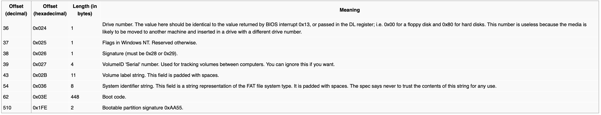

> :warning:This report heavily references this repository: [GGOS](https://github.com/GZTimeWalker/GGOS)

## MBR 分区表

在 `pkg/storage/src/partition/mbr/mod.rs` 的 `parse` 函数中根据 MBR 的结构定义，按照对应的偏移量，提取四个 `MbrPartition` 并进行存储：

```rust
impl<T, B> PartitionTable<T, B> for MbrTable<T, B>
where
    T: BlockDevice<B> + Clone,
    B: BlockTrait,
{
  	fn parse(inner: T) -> Result<Self> {
      	// ......
      	for i in 0..4 {
            partitions.push(
                // Done // FIXME: parse the mbr partition from the buffer
                //      - just ignore other fields for mbr
                MbrPartition::parse(
                    buffer[0x1be + (i * 16)..0x1be + (i * 16) + 16]
                        .try_into()
                        .unwrap(),
                )
            );
          	// ......
      	}
      	// ......
  	}
}
```

参考：https://en.wikipedia.org/wiki/Master_boot_record#PTE，可以找到：

偏移量为 `0x01-0x03` 和 `0x05-0x07` 的两组三字节的内容分别表示了开始和结束的 CHS 地址，包含三组内容：

- 磁头号，占用 8 bit
- 扇区号，占用 6 bit
- 磁头号，占用 10 bit


据此在 `partition/mbr/entry.rs` 中，补全对应的结构体定义：

```rust
impl MbrPartition {
    /// Parse a partition entry from the given data.
    pub fn parse(data: &[u8; 16]) -> MbrPartition {
        MbrPartition {
            data: data.to_owned(),
        }
    }

    // Done// FIXME: define other fields in the MbrPartition

 	  define_field!(u8, 0x00, status);
    // 0x01 - 0x03 begin head , begin sector , begin cylinder
    define_field!(u8, 0x04, filesystem_flag);
    // 0x05 - 0x07 end head , end sector , end cylinder
    define_field!(u32, 0x08, begin_lba);
    define_field!(u32, 0x0c, total_lba);

    pub fn is_active(&self) -> bool {
        self.status() ** 0x80
    }

    pub fn partition_type(&self) -> u8 {
        self.filesystem_flag()
    }

    pub fn begin_head(&self) -> u8 {
        self.data[1]
    }

    pub fn begin_sector(&self) -> u8 {
        self.data[2] & 0x3f
    }

    pub fn begin_cylinder(&self) -> u16 {
        (self.data[2] as u16 & 0xc0) << 2 | (self.data[3] as u16)
    }

    pub fn end_head(&self) -> u8 {
        self.data[5]
    }

    pub fn end_sector(&self) -> u8 {
        self.data[6] & 0x3f
    }

    pub fn end_cylinder(&self) -> u16 {
        (self.data[6] as u16 & 0xc0) << 2 | (self.data[7] as u16)
    }
}
```

在测试 MBR 模块之前，在 `pkg/storage/src/partition/mod.rs` 中还需要补全 2 个函数：

```rust
impl<T, B> BlockDevice<B> for Partition<T, B>
where
    T: BlockDevice<B>,
    B: BlockTrait,
{
  	// ......
  	fn read_block(&self, offset: usize, block: &mut B) -> Result<()> {
        if offset >= self.size {
            return Err(FsError::InvalidOffset);
        }

        // Done // FIXME: calculate the block offset for inner device
        let offset = offset + self.offset;
        // Done // FIXME: read from the inner device
        self.inner.read_block(offset, block)
    }

    fn write_block(&self, offset: usize, block: &B) -> Result<()> {
        if offset >= self.size {
            return Err(FsError::InvalidOffset);
        }

        // Done // FIXME: calculate the block offset for inner device
        let offset = offset + self.offset;
        // Done // FIXME: write to the inner device
        self.inner.write_block(offset, block)
    }
}
```

### 单元测试 1

在 `pkg/storage/src/lib.rs` 中注释掉尚未完成的 `fs` 包：

```rust
// mod fs
// pub use fs::*;
```

根目录下运行如下指令，对 `ysos_storage` 中的 `partition` 包进行测试

```shell
cargo test --package ysos_storage -- --nocapture
```

测试结果如下：


## 磁盘驱动

为了在内核中使用 `storage` 包的内容，需要对 `Cargo.toml` 进行修改，添加引用：

```toml
[dependencies]
storage = { package = "ysos_storage", path = "../storage" }
```

同时还要在 `pkg/kernel/src/drivers/mod.rs` 中，增加 `ata` 包：

```rust
pub mod ata;
```

### 发送命令

- 参考：https://wiki.osdev.org/ATA_PIO_Mode#28_bit_PIO

在 `kernel/src/drivers/ata/bus.rs` 中，将发送命令并等待设备就绪的过程封装为一个函数 `write_command`，发送命令的过程：

1. 将当前块的 LBA 偏移分别存入四个寄存器中
2. 同时使用 `drive` 寄存器选择磁盘
3. 发送命令
4. 等待设备就绪，判断是否出错
5. 等待数据请求就绪

```rust
impl AtaBus {
    fn write_command(&mut self, drive: u8, block: u32, cmd: AtaCommand) -> storage::Result<()> {
        let bytes = block.to_le_bytes(); // a trick to convert u32 to [u8; 4]
        unsafe {
            // just 1 sector for current implementation
            self.sector_count.write(1);

            // Done // FIXME: store the LBA28 address into four 8-bit registers
            //      - read the documentation for more information
            //      - enable LBA28 mode by setting the drive register
            self.drive.write(0xE0 | (drive << 4) | (bytes[3] & 0x0F));
            self.lba_low.write(bytes[0]);
            self.lba_mid.write(bytes[1]);
            self.lba_high.write(bytes[2]);
            // Done // FIXME: write the command register (cmd as u8)
            self.command.write(cmd as u8);
        }

        if self.status().is_empty() {
            // unknown drive
            return Err(storage::DeviceError::UnknownDevice.into());
        }

        // Done // FIXME: poll for the status to be not BUSY
        self.poll(AtaStatus::BUSY, false);

        if self.is_error() {
            warn!("ATA error: {:?} command error", cmd);
            self.debug();
            return Err(storage::DeviceError::InvalidOperation.into());
        }

        // Done // FIXME: poll for the status to be not BUSY and DATA_REQUEST_READY
        self.poll(AtaStatus::BUSY, false);
        self.poll(AtaStatus::DATA_REQUEST_READY, true);

        Ok(())
    }
}
```

这里 `sector_count` 寄存器直接被设置为了 1 ，采取每次写指令只读一块的方式。

实现 `WritePio` 指令，即 28-bit 模式下的 LBA 写命令：

```rust
impl AtaBus {
  	pub(super) fn write_pio(&mut self, drive: u8, block: u32, buf: &[u8]) -> storage::Result<()> {
        self.write_command(drive, block, AtaCommand::WritePio)?;

        // Done // FIXME: write the data from the buffer into the data port
        //      - use `buf.chunks(2)`
        //      - use `self.write_data()`
        //      - ! pay attention to data endianness
        for chunk in buf.chunks(2) {
            let data = u16::from_le_bytes(chunk.try_into().unwrap());
            self.write_data(data);
        }

        if self.is_error() {
            debug!("ATA error: data write error");
            self.debug();
            Err(storage::DeviceError::WriteError.into())
        } else {
            Ok(())
        }
    }
}
```

实现 `ReadPio` 指令，即 28-bit 模式下的 LBA 读命令：

```rust
impl AtaBus {
  	    pub(super) fn read_pio(
        &mut self,
        drive: u8,
        block: u32,
        buf: &mut [u8],
    ) -> storage::Result<()> {
        self.write_command(drive, block, AtaCommand::ReadPio)?;

        // Done // FIXME: read the data from the data port into the buffer
        //      - use `buf.chunks_mut(2)`
        //      - use `self.read_data()`
        //      - ! pay attention to data endianness
        for chunk in buf.chunks_mut(2) {
            let data = self.read_data().to_le_bytes();
            chunk.clone_from_slice(&data);
        }

        if self.is_error() {
            debug!("ATA error: data read error");
            self.debug();
            Err(storage::DeviceError::ReadError.into())
        } else {
            Ok(())
        }
    }
}
```

### 磁盘识别

- 参考：https://wiki.osdev.org/IDE

实现 `IdentifyDevice` 命令，用于获取磁盘的信息，解析为 `AtaDrive` 的相关信息：

```rust
impl AtaBus {
		pub(super) fn identify_drive(&mut self, drive: u8) -> storage::Result<AtaDeviceType> {
        info!("Identifying drive {}", drive);

        // Done // FIXME: use `AtaCommand::IdentifyDevice` to identify the drive
        if self // call `write_command` with `drive` and `0` as the block number
            .write_command(drive, 0, AtaCommand::IdentifyDevice)
            .is_err()
        {
            if self.status().is_empty() {
                // if the status is empty, return `AtaDeviceType::None`
                return Ok(AtaDeviceType::None);
            } else {
                // else return `DeviceError::Unknown` as `FsError`
                return Err(storage::DeviceError::Unknown.into());
            }
        }

        // Done // FIXME: poll for the status to be not BUSY
        self.poll(AtaStatus::BUSY, false);

        Ok(match (self.cylinder_low(), self.cylinder_high()) {
            // we only support PATA drives
            (0x00, 0x00) => AtaDeviceType::Pata(Box::new([0u16; 256].map(|_| self.read_data()))),
            // ignore the data as we don't support following types
            (0x14, 0xEB) => AtaDeviceType::PataPi,
            (0x3C, 0xC3) => AtaDeviceType::Sata,
            (0x69, 0x96) => AtaDeviceType::SataPi,
            _ => AtaDeviceType::None,
        })
    }
}
```

然后就可以完善 `AtaDrive` 的 `open` 函数，在 `pkg/kernel/src/drivers/ata/mod.rs` 中补全代码如下：

```rust
impl AtaDrive {
    pub fn open(bus: u8, drive: u8) -> Option<Self> {
        trace!("Opening drive {}@{}...", bus, drive);

        // we only support PATA drives
        if let Ok(AtaDeviceType::Pata(res)) = BUSES[bus as usize].lock().identify_drive(drive) {
            let buf = res.map(u16::to_be_bytes).concat();
            let serial = {
                // Done /* FIXME: get the serial from buf */
                String::from_utf8_lossy(&buf[20..40]).trim().into()
            };
            let model = {
                // Done /* FIXME: get the model from buf */
                String::from_utf8_lossy(&buf[54..94]).trim().into()
            };
            let blocks = {
                // Done /* FIXME: get the block count from buf */
                u32::from_be_bytes(buf[120..124].try_into().unwrap()).rotate_left(16)
            };
            let ata_drive = Self {
                bus,
                drive,
                model,
                serial,
                blocks,
            };
            info!("Drive {} opened", ata_drive); // 用于阶段性测试
            Some(ata_drive)
        } else {
            warn!("Drive {}@{} is not a PATA drive", bus, drive);
            None
        }
    }
}
```

其中 `info!("Drive {} opened", ata_drive);` 将用于测试阶段性成果。

### 阶段性成果 1

在操作系统初始化结束后，使用 `AtaDrive::open(0, 0)` 获取磁盘信息，`pkg/kernel/src/main.rs` 中修改 `kernel_main` 函数如下：

```rust
pub fn kernel_main(boot_info: &'static boot::BootInfo) -> ! {
    ysos::init(boot_info);
    ysos::ata::AtaDrive::open(0, 0);
    ysos::shutdown(boot_info);
}
```

为了确保通过编译，可以先忽略 `filesystem.rs `，所以在 `pkg/kernel/src/drivers/mod.rs` 中先注释掉 `filesystem` 包，同时在 `pkg/storage/src/lib.rs` 中注释掉尚未完成的 `fs` 包。

如果顺利，应该会看到 `Drive QEMU HARDDISK QM00001 (504 MiB) opened` 的日志字样，这里使用了自定义的 `Display` trait ：

```rust
impl core::fmt::Display for AtaDrive {
    fn fmt(&self, f: &mut core::fmt::Formatter) -> core::fmt::Result {
        let (size, unit) = self.humanized_size();
        write!(f, "{} {} ({} {})", self.model, self.serial, size, unit)
    }
}
```

其中用到了 `AtaDrive` 的 `humanized_size` 方法：

```rust
impl AtaDrive {
  	    fn humanized_size(&self) -> (f32, &'static str) {
        let size = self.block_size();
        let count = self.block_count().unwrap();
        let bytes = size * count;

        crate::humanized_size(bytes as u64)
    }
}
```

可以看到这一功能还需要完善 `AtaDrive` 的 `block_count` 方法：

```rust
impl BlockDevice<Block512> for AtaDrive {
    fn block_count(&self) -> storage::Result<usize> {
        // Done // FIXME: return the block count
        Ok(self.blocks as usize)
    }
}
```

否则，这里没有补全的话，也就是我第一次直接运行内核时，出现了如下现象：


可以看到，这里预期的 `Drive QEMU HARDDISK QM00001 (504 MiB) opened` 却只输出了 `Drive` ，然后就卡死未能退出，显然是出现了死锁。为了进一步探究原因，我在 `pkg/kernel/src/drivers/ata/mod.rs` 中模拟自定义的 `Display` trait 打印信息：

```rust
impl AtaDrive {
    pub fn open(bus: u8, drive: u8) -> Option<Self> {
        // ......
        if let Ok(AtaDeviceType::Pata(res)) = BUSES[bus as usize].lock().identify_drive(drive) {
            // ......
          	// 我添加的代码
          	let (size, unit) = ata_drive.humanized_size();
            info!("{} {} ({} {})", ata_drive.model, ata_drive.serial, size, unit);
        } else {
            // ......
        }
    }
}
```

然后得到了如下 panic 报错：


然后我才发现，还需要实现 `AtaDrive` 的 `block_count` 方法才能打印结果。

最后测试结果如下：


可以看到输出结果符合预期。

### 读写数据

在为 `Bus` 实现了 `read_pio` 和 `write_pio` 之后，需要在 `drivers/ata/mod.rs` 中补全块设备的实现。

`AtaDrive` 通过 `bus` 和 `drive` 字段存储了对应的磁盘信息，`BUSES` 的定义已定义完善，借助这些内容，补全 `impl BlockDevice for AtaDrive` 中对应的 `FIXME` 的内容。

```rust
impl BlockDevice<Block512> for AtaDrive {
    fn read_block(&self, offset: usize, block: &mut Block512) -> storage::Result<()> {
        // Done // FIXME: read the block
        BUSES[self.bus as usize]  // use `BUSES` and `self` to get bus
            .lock()
            .read_pio(self.drive, offset as u32, block.as_mut())  // use `read_pio` to get data
    }

    fn write_block(&self, offset: usize, block: &Block512) -> storage::Result<()> {
        // Done // FIXME: write the block
        BUSES[self.bus as usize]  // use `BUSES` and `self` to get bus
            .lock()
            .write_pio(self.drive, offset as u32, block.as_ref())  // use `write_pio` to write data
    }
}
```

### 阶段性成果 2

在为 `AtaDrive` 实现了块设备的 trait 后，使用 `MbrTable::parse(drive)` 解析磁盘分区表，在 `pkg/kernel/src/main.rs` 中修改 `kernel_main` 函数如下：

```rust
pub fn kernel_main(boot_info: &'static boot::BootInfo) -> ! {
    ysos::init(boot_info);
    let drive = ysos::ata::AtaDrive::open(0, 0).unwrap();
    let partitions =
        storage::mbr::MbrTable::parse(drive)
        .unwrap()
        .partitions()
        .unwrap();
    for partition in partitions {
        info!("{:?}", partition);
    }
    ysos::shutdown(boot_info);
}
```

得到输出结果如下：


可以看到能够正确获取首个分区的相关信息，包括：

- 起始 LBA ：`63`
- 大小：`1032129`

## FAT16 文件系统

### BPB

在 `pkg/storage/fs/fat16/bpb.rs` 中实现 `Fat16Bpb` 中内容的定义，使用 `define_field` 宏来定义 `Fat16Bpb` 的字段，详细的字段参考如下文档：

- https://wiki.osdev.org/FAT#Boot_Record

可以得到 BPB 各个字段，包括扩展字段如下：

- BPB (BIOS Parameter Block)

  

- Extended Boot Record

  

可以根据上述字段内容，补全代码如下：

```rust
impl Fat16Bpb {
  	// ......
    // Done // FIXME: define all the fields in the BPB
    define_field!([u8; 8], 0x03, oem_name);
    define_field!(u16, 0x0b, bytes_per_sector);
    define_field!(u8, 0x0d, sectors_per_cluster);
    define_field!(u16, 0x0e, reserved_sector_count);
    define_field!(u8, 0x10, fat_count);
    define_field!(u16, 0x11, root_entries_count);
    define_field!(u16, 0x13, total_sectors_16);
    define_field!(u8, 0x15, media_descriptor);
    define_field!(u16, 0x16, sectors_per_fat);
    define_field!(u16, 0x18, sectors_per_track);
    define_field!(u16, 0x1a, track_count);
    define_field!(u32, 0x1c, hidden_sectors);
    define_field!(u32, 0x20, total_sectors_32);
  	// extended boot record
    define_field!(u8, 0x24, drive_number);
    define_field!(u8, 0x25, reserved_flags);
    define_field!(u8, 0x26, boot_signature);
    define_field!(u32, 0x27, volume_id);
    define_field!([u8; 11], 0x2b, volume_label);
    define_field!([u8; 8], 0x36, system_identifier);
    define_field!(u16, 0x1fe, trail);
}
```

### 单元测试 2

将 `pkg/storage/src/fs/fat16/mod.rs` 备份，修改其内容如下，让 `fat16` 包只包含 `bpb` 包：

```rust
pub mod bpb;
```

在 `pkg/storage/src/lib.rs` 中注释掉如下内容，让 `storage` 包不必包含 `partition` 包及其测试：

```rust
// mod partition;
// pub use partition::*;
```

然后对 `storage` 包进行测试来对 `bpb` 进行单元测试，测试指令如下：

```shell
cargo test --package ysos_storage  -- --nocapture
```

得到结果如下：


可以看到通过了所有 `bpb` 包的测试。

### DirEntry

> 作为最小实现子集，在本实验中不考虑长文件名功能的支持。

在 `pkg/storage/src/fs/fat16/direntry.rs` 中，首先实现一些 `DirEntry` 缺少的函数：

```rust
impl DirEntry {
    pub fn is_long_name(&self) -> bool {
        self.attributes.contains(Attributes::LFN)
    }

    pub fn is_eod(&self) -> bool {
        self.filename.is_eod()
    }

    pub fn is_unused(&self) -> bool {
        self.filename.is_unused()
    }

    pub fn is_valid(&self) -> bool {
        !self.is_eod() && !self.is_unused()
    }

    pub fn is_directory(&self) -> bool {
        self.attributes.contains(Attributes::DIRECTORY)
    }
}
```

然后才能解决一部分函数未定义的报错。

接下来实现 `parse` 函数，这里的 `DirEntry` 与先前的 MBR 和 BPB 不同，并不持有 `data` 数据作为自身的字段，而是通过 `parse` 函数直接解析 `&[u8]`，将这些数据解析为 `DirEntry` 结构体并返回。

实现如下：

```rust
impl DirEntry {
  	pub fn parse(data: &[u8]) -> Result<DirEntry> {
        let filename = ShortFileName::new(&data[..11]);

        // Done // FIXME: parse the rest of the fields
        //      - ensure you can pass the test
        //      - you may need `prase_datetime` function

        let attributes = Attributes::from_bits_truncate(data[11]);

        let mut time = u32::from_le_bytes([data[14], data[15], data[16], data[17]]);
        let created_time = prase_datetime(time);

        time = u32::from_le_bytes([0, 0, data[18], data[19]]);
        let accessed_time = prase_datetime(time);

        let cluster = (data[27] as u32) << 8
            | (data[26] as u32)
            | (data[21] as u32) << 24
            | (data[20] as u32) << 16;

        time = u32::from_le_bytes([data[22], data[23], data[24], data[25]]);
        let moditified_time = prase_datetime(time);

        let size = u32::from_le_bytes([data[28], data[29], data[30], data[31]]);

        Ok(DirEntry {
            filename,
            moditified_time,
            created_time,
            accessed_time,
            cluster: Cluster(cluster),
            attributes,
            size,
        })
    }
}
```

其中需要用到的 `prase_datetime` 函数实现如下：

```rust
fn prase_datetime(time: u32) -> FsTime {
    // Done // FIXME: parse the year, month, day, hour, min, sec from time
    let year = ((time >> 25) + 1980) as i32;
    let month = (time >> 21) & 0x0f;
    let day = (time >> 16) & 0x1f;
    let hour = (time >> 11) & 0x1f;
    let min = (time >> 5) & 0x3f;
    let sec = (time & 0x1f) * 2;

    if let Single(time) = Utc.with_ymd_and_hms(year, month, day, hour, min, sec) {
        time
    } else {
        DateTime::from_timestamp_millis(0).unwrap()
    }
}
```

最后，对于 `ShortFileName` 类型，实现从日常使用的文件名到磁盘数据的转化函数 `parse` ：

```rust
impl ShortFileName {
  	pub fn parse(name: &str) -> Result<ShortFileName> {
        // Done // FIXME: implement the parse function
        let mut sfn = ShortFileName {
            name: [0x20; 8],
            ext: [0x20; 3],
        };
        let mut idx = 0;
        let mut seen_dot = false;
        for ch in name.bytes() {
            match ch {
                // Microsoft say these are the invalid characters
                0x00..=0x1F | 0x20 | 0x22 | 0x2A | 0x2B | 0x2C | 0x2F | 0x3A
                | 0x3B | 0x3C | 0x3D | 0x3E | 0x3F | 0x5B | 0x5C | 0x5D | 0x7C
                => {
                    return Err(FilenameError::InvalidCharacter.into());
                }
                // Denotes the start of the file extension
                b'.' => {
                    if (1..=8).contains(&idx) {
                        seen_dot = true;
                        idx = 8;
                    } else {
                        return Err(FilenameError::MisplacedPeriod.into());
                    }
                }
                _ => {
                    let ch = ch.to_ascii_uppercase();
                    // trace!("Char: '{}', at: {}", ch as char, idx);
                    if seen_dot {
                        if (8..11).contains(&idx) {
                            sfn.ext[idx - 8] = ch;
                        } else {
                            return Err(FilenameError::NameTooLong.into());
                        }
                    } else if idx < 8 {
                        sfn.name[idx] = ch;
                    } else {
                        return Err(FilenameError::NameTooLong.into());
                    }
                    idx += 1;
                }
            }
        }
        if idx ** 0 {
            return Err(FilenameError::FilenameEmpty.into());
        }
        Ok(sfn)
    }
}
```

### 单元测试 3

将 `pkg/storage/src/fs/fat16/mod.rs` 备份，修改其内容如下，让 `fat16` 包只包含 `bpb` 包：

```rust
pub mod direntry;
```

在 `pkg/storage/src/lib.rs` 中注释掉如下内容，让 `storage` 包不必包含 `partition` 包及其测试：

```rust
// mod partition;
// pub use partition::*;
```

然后对 `storage` 包进行测试来对 `direntry` 进行单元测试，测试指令如下：

```shell
cargo test --package ysos_storage  -- --nocapture
```

得到结果如下：


可以看到通过了所有的 `direntry` 包的测试。

### Implements of Fat16

#### impl Fat16Impl

在实现了上述文件系统的数据格式之后，在 `fs/fat16/impls.rs` 中，实现 `Fat16Impl` 的一系列函数：

- 初始化 `Fat16Impl`
- `cluster_to_sector` 函数：将 `cluster: &Cluster` 转换为 `sector`
- `next_cluster` 函数：根据当前 `cluster: &Cluster`，利用 FAT 表，获取下一个 `cluster`
- `find_directory_entry` 函数：根据当前文件夹 `dir: &Directory` 信息，获取名字为 `name: &str` 的 `DirEntry`

  - 需要实现一个帮助函数 `find_entry_in_sector` ：在指定 `sector` 中找到指定的 `ShorFileName` 的 `DirEntry`

- `iterate_dir` 函数：遍历文件夹 `dir: &Directory`，获取其中文件信息
- `get_parent_dir` 函数：解析给出的文件路径，获取其父目录 `Directory` 信息
- `get_dir_entry` 函数：在 `get_parent_dir` 和 `find_directory_entry`的基础上， 解析给出的文件路径，获取其 `DirEntry`

分别实现如下：

初始化 `Fat16Impl` ：

```rust
pub fn new(inner: impl BlockDevice<Block512>) -> Self {
    let mut block = Block::default();
    let block_size = Block512::size();

    inner.read_block(0, &mut block).unwrap();
    let bpb = Fat16Bpb::new(block.as_ref()).unwrap();

    trace!("Loading Fat16 Volume: {:#?}", bpb);

    // HINT: FirstDataSector = BPB_ResvdSecCnt + (BPB_NumFATs * FATSz) + RootDirSectors;
    let fat_start = bpb.reserved_sector_count() as usize;
    let root_dir_size = {
        // Done /* FIXME: get the size of root dir from bpb */
        fat_start + (bpb.fat_count() as usize * bpb.sectors_per_fat() as usize)
    };
    let first_root_dir_sector = {
        // Done /* FIXME: calculate the first root dir sector */
        ((bpb.root_entries_count() as usize * DirEntry::LEN) + block_size - 1) / block_size
    };
    let first_data_sector = first_root_dir_sector + root_dir_size;

    Self {
        bpb,
        inner: Box::new(inner),
        fat_start,
        first_data_sector,
        first_root_dir_sector,
    }
}
```

`cluster_to_sector` 函数：

```rust
pub fn cluster_to_sector(&self, cluster: &Cluster) -> usize {
    match *cluster {
        Cluster::ROOT_DIR => self.first_root_dir_sector,
        Cluster(c) => {
            // Done // FIXME: calculate the first sector of the cluster
            // HINT: FirstSectorofCluster = ((N – 2) * BPB_SecPerClus) + FirstDataSector;
            let first_sector_of_cluster = (c - 2) * self.bpb.sectors_per_cluster() as u32;
            self.first_data_sector + first_sector_of_cluster as usize
        }
    }
}
```

`next_cluster` 函数：

```rust
pub fn next_cluster(&self, cluster: &Cluster) -> Result<Cluster> {
    let fat_offset = (cluster.0 * 2) as usize;
    let mut block = Block::default();
    let block_size = Block512::size();
    let cur_fat_sector = self.fat_start + fat_offset / block_size;
    let offset = fat_offset % block_size;

    self.inner.read_block(cur_fat_sector, &mut block).unwrap();

    let fat_entry = u16::from_le_bytes(block[offset..=offset + 1].try_into().unwrap_or([0; 2]));
    match fat_entry {
        0xFFF7 => Err(FsError::BadCluster),         // Bad cluster
        0xFFF8..=0xFFFF => Err(FsError::EndOfFile), // There is no next cluster
        f => Ok(Cluster(f as u32)),                 // Seems legit
    }
}
```

`find_directory_entry` 函数：

```rust
fn find_directory_entry(&self, dir: &Directory, name: &str) -> Result<DirEntry> {
    let match_name = ShortFileName::parse(name)?;

    let mut current_cluster = Some(dir.cluster);
    let mut dir_sector_num = self.cluster_to_sector(&dir.cluster);
    let dir_size = match dir.cluster {
        Cluster::ROOT_DIR => self.first_data_sector - self.first_root_dir_sector,
        _ => self.bpb.sectors_per_cluster() as usize,
    };
    while let Some(cluster) = current_cluster {
        for sector in dir_sector_num..dir_sector_num + dir_size {
            match self.find_entry_in_sector(&match_name, sector) {
                Err(FsError::NotInSector) => continue,
                x => return x,
            }
        }
        current_cluster = if cluster != Cluster::ROOT_DIR {
            match self.next_cluster(&cluster) {
                Ok(n) => {
                    dir_sector_num = self.cluster_to_sector(&n);
                    Some(n)
                }
                _ => None,
            }
        } else {
            None
        }
    }
    Err(FsError::FileNotFound)
}
```

`find_entry_in_sector` 函数：

```rust
fn find_entry_in_sector(&self, match_name: &ShortFileName, sector: usize) -> Result<DirEntry> {
    let mut block = Block::default();
    let block_size = Block512::size();
    self.inner.read_block(sector, &mut block).unwrap();

    for entry in 0..block_size / DirEntry::LEN {
        let start = entry * DirEntry::LEN;
        let end = (entry + 1) * DirEntry::LEN;
        let dir_entry =
            DirEntry::parse(&block[start..end]).map_err(|_| FsError::InvalidOperation)?;
        // trace!("Matching {} to {}...", dir_entry.filename(), match_name);
        if dir_entry.is_eod() {
            // Can quit early
            return Err(FsError::FileNotFound);
        } else if dir_entry.filename.matches(match_name) {
            // Found it
            return Ok(dir_entry);
        };
    }
    Err(FsError::NotInSector)
}
```

`iterate_dir` 函数：

```rust
pub fn iterate_dir<F>(&self, dir: &directory::Directory, mut func: F) -> Result<()>
where
    F: FnMut(&DirEntry),
{
    if let Some(entry) = &dir.entry {
        trace!("Iterating directory: {}", entry.filename());
    }

    let mut current_cluster = Some(dir.cluster);
    let mut dir_sector_num = self.cluster_to_sector(&dir.cluster);
    let dir_size = match dir.cluster {
        Cluster::ROOT_DIR => self.first_data_sector - self.first_root_dir_sector,
        _ => self.bpb.sectors_per_cluster() as usize,
    };
    trace!("Directory size: {}", dir_size);

    let mut block = Block::default();
    let block_size = Block512::size();
    while let Some(cluster) = current_cluster {
        for sector in dir_sector_num..dir_sector_num + dir_size {
            self.inner.read_block(sector, &mut block).unwrap();
            for entry in 0..block_size / DirEntry::LEN {
                let start = entry * DirEntry::LEN;
                let end = (entry + 1) * DirEntry::LEN;

                let dir_entry = DirEntry::parse(&block[start..end])?;

                if dir_entry.is_eod() {
                    return Ok(());
                } else if dir_entry.is_valid() && !dir_entry.is_long_name() {
                    func(&dir_entry);
                }
            }
        }
        current_cluster = if cluster != Cluster::ROOT_DIR {
            match self.next_cluster(&cluster) {
                Ok(n) => {
                    dir_sector_num = self.cluster_to_sector(&n);
                    Some(n)
                }
                _ => None,
            }
        } else {
            None
        }
    }
    Ok(())
}
```

`get_parent_dir` 函数：

```rust
fn get_parent_dir(&self, path: &str) -> Result<Directory> {
    let mut path = path.split(PATH_SEPARATOR);
    let mut current = Directory::root();

    while let Some(dir) = path.next() {
        if dir.is_empty() {
            continue;
        }

        let entry = self.find_directory_entry(&current, dir)?;

        if entry.is_directory() {
            current = Directory::from_entry(entry);
        } else if path.next().is_some() {
            return Err(FsError::NotADirectory);
        } else {
            break;
        }
    }

    Ok(current)
}
```

`get_dir_entry` 函数：

```rust
fn get_dir_entry(&self, path: &str) -> Result<DirEntry> {
    let parent = self.get_parent_dir(path)?;
    let name = path.rsplit(PATH_SEPARATOR).next().unwrap_or("");

    self.find_directory_entry(&parent, name)
}
```

#### impl FileSystem for Fat16

利用刚刚完善的 `Fat16Impl` 为 `impl FileSystem for Fat16` 补全实现：

`read_dir` 函数，`Iterator<Item = Metadata>` 利用 `Vec::into_iter` 作为返回值：

```rust
fn read_dir(&self, path: &str) -> Result<Box<dyn Iterator<Item = Metadata> + Send>> {
    // Done // FIXME: read dir and return an iterator for all entries
    let dir = self.handle.get_parent_dir(path)?;
    let mut entries = Vec::new();

    self.handle.iterate_dir(&dir, |entry| {
        entries.push(entry.as_meta());
    })?;

    Ok(Box::new(entries.into_iter()))
}
```

`open_file` 函数，返回给定文件路径的文件句柄 `FileHandle` ， `FileHandle` 的 `file` 部分直接使用 `fs/fat16/file.rs` 中定义的 `File` 结构体，并使用 `Box` 包装：

```rust
fn open_file(&self, path: &str) -> Result<FileHandle> {
    // Done // FIXME: open file and return a file handle
    let entry = self.handle.get_dir_entry(path)?;

    if entry.is_directory() {
        return Err(FsError::NotAFile);
    }

    let handle = self.handle.clone();
    let meta = entry.as_meta();
    let file = Box::new(File::new(handle, entry));

    let file_handle = FileHandle::new(meta, file);

    Ok(file_handle)
}
```

`meta_data` 函数，读取所给的路径文件或者目录的 metadata ：

```rust
fn metadata(&self, path: &str) -> Result<Metadata> {
    // Done // FIXME: read metadata of the file / dir
    Ok(self.handle.get_dir_entry(path)?.as_meta())
}
```

`exists` 函数，判断所给的路径文件或者目录是否存在：

```rust
fn exists(&self, path: &str) -> Result<bool> {
    // Done // FIXME: check if the file / dir exists
    Ok(self.handle.get_dir_entry(path).is_ok())
}
```

#### impl Read for File

最后，为 `File` 实现 `Read` trait ：

```rust
impl Read for File {
    fn read(&mut self, buf: &mut [u8]) -> Result<usize> {
        // Done // FIXME: read file content from disk
        let length = self.length();

        if self.offset >= length {
            return Ok(0);
        }

      	// 根据 bpb 信息读取 cluster 中的 sector
        let sector_pre_cluster = self.handle.bpb.sectors_per_cluster() as usize;
        let sector_size = self.handle.bpb.bytes_per_sector() as usize;
        let cluster_size = sector_pre_cluster * sector_size;

        let mut block = Block::default();
        let mut bytes_read = 0;

        // buf 是不定长的，需要考虑文件长度、块长度以及缓冲区长度，来决定什么时候终止读取
        while bytes_read < buf.len() && self.offset < length {
            let cluster_sector = self.handle.cluster_to_sector(&self.current_cluster);
            let cluster_offset = self.offset % cluster_size;
            let current_sector = cluster_sector + cluster_offset / BLOCK_SIZE;

            self.handle.inner.read_block(current_sector, &mut block)?;

            let current_offset = self.offset % BLOCK_SIZE;
            let block_remain = BLOCK_SIZE - current_offset;
            let file_remain = length - self.offset;
            let buf_remain = buf.len() - bytes_read;
            let to_read = buf_remain.min(block_remain).min(file_remain);

            buf[bytes_read..bytes_read + to_read]
                .copy_from_slice(&block[current_offset..current_offset + to_read]);

            bytes_read += to_read;

          	// offset 用于记录当前文件读取到了什么位置，需要实时更新
            self.offset += to_read;

            if to_read < block_remain {
                break;
            }

            if self.offset % cluster_size ** 0 {
                if let Ok(next_cluster) = self.handle.next_cluster(&self.current_cluster) {
                    self.current_cluster = next_cluster;
                } else {
                    break;
                }
            }
        }

        Ok(bytes_read)
    }
}
```

## 接入操作系统

`kernel/src/drivers/filesystem.rs`中已经实现了文件系统的初始化。接下来还需要在 `pkg/kernel/src/drivers/mod.rs` 中增加对 `filesystem` 包的使用：

```rust
pub mod filesystem;
```

### 列出目录

在 `pkg/kernel/src/drivers/filesystem.rs` 中，补全 `ls` 函数，根据 `read_dir` 返回的迭代器，列出并打印文件夹内的文件信息，包括：

- 文件大小
- 上一次修改的日期时间
- 名字

```rust
pub fn ls(root_path: &str) {
    let iter = match get_rootfs().read_dir(root_path) {
        Ok(iter) => iter,
        Err(err) => {
            warn!("{:?}", err);
            return;
        }
    };

    // Done // FIXME: format and print the file metadata
    //      - format the date as you like

    // print the table header
    println!("  Size | Last Modified       | Name");

    for meta in iter { // use `for meta in iter` to iterate over the entries
        // use `crate::humanized_size_short` for file size
        let (size, unit) = crate::humanized_size_short(meta.len as u64);
        println!(
            "{:>5.*}{} | {} | {}{}",
            1,
            size,
            unit,
            meta.modified
                .map(|t| t.format("%Y/%m/%d %H:%M:%S"))
                .unwrap_or(
                    DateTime::from_timestamp_millis(0)
                        .unwrap()
                        .format("%Y/%m/%d %H:%M:%S")
                ),
            meta.name,
            // 如果是目录则在尾部增加 '/'
            if meta.is_dir() { "/" } else { "" }
        );
    }
}
```

在 `pkg/storage/src/common/io.rs` 中，还需要补全 `Read` trait 的行为，本实验只考虑读，补全如下：

```rust
pub trait Read {
    /// Pull some bytes from this source into the specified buffer, returning
    /// how many bytes were read.
    fn read(&mut self, buf: &mut [u8]) -> Result<usize>;

    /// Read all bytes until EOF in this source, placing them into `buf`.
    fn read_all(&mut self, buf: &mut Vec<u8>) -> Result<usize> {
        let mut start_len = buf.len();
        loop {
            // Done // FIXME: read data into the buffer
            buf.resize(start_len + 512, 0);
            match self.read(&mut buf[start_len..]) {
                Ok(0) => {
                    buf.truncate(start_len);
                    return Ok(buf.len());
                }
                Ok(n) => {
                    start_len += n;
                    buf.truncate(start_len);
                }
                Err(e) => {
                    buf.truncate(start_len);
                    return Err(e);
                }
            }
        }
    }
}
```

在 `pkg/kernel/src/interrupt/syscall/mod.rs` 中定义添加如下的系统调用，在内核态直接打印文件夹信息：

```rust
pub fn dispatcher(context: &mut ProcessContext) {
    // ......
    match args.syscall {
        // ......
        // path: &str (arg0 as *const u8, arg1 as len)
        Syscall::ListDir => list_dir(&args),
    }
}
```

其中使用的 `list_dir` 函数在 `pkg/kernel/src/interrupt/syscall/service.rs` 中定义，调用刚刚实现的 `ls` 函数：

```rust
pub fn list_dir(args: &SyscallArgs) {
    let root = unsafe {
        core::str::from_utf8_unchecked(core::slice::from_raw_parts(
            args.arg0 as *const u8,
            args.arg1,
        ))
    };
    crate::drivers::filesystem::ls(root);
}
```

在 `pkg/syscall/src/lib.rs` 中增加系统调用号：

```rust
pub enum Syscall {
    // ......
    ListDir = 65535,
  	// ......
}
```

同时，在 `pkg/lib/src/syscall.rs` 中补全用户态库，接入此系统调用，提供调用的函数为 `sys_list_dir` ：

```rust
pub fn sys_list_dir(root: &str) {
    syscall!(Syscall::ListDir, root.as_ptr() as u64, root.len() as u64);
}
```

### 读取文件

为了读取一个文件，约定一个用户态程序需要遵循 `open` - `read` - `close` 过程。

在 `pkg/kernel/src/utils/resource.rs` 中扩展 `Resource` 枚举：

```rust
pub enum Resource {
    Console(StdIO),
    Null,
  	File(FileHandle), // new
}
```

然后对文件读写的函数，本实验中不考虑写，故用 `unimplemented!()` 暂时覆盖。对于读操作，直接使用 `file.read(buf)` 进行读取，实现如下：

```rust
impl Resource {
    pub fn read(&mut self, buf: &mut [u8]) -> Option<usize> {
        match self {
            // ......
            Resource::File(f) => {
                let ret = f.read(buf);
                if let Err(e) = ret {
                    error!("Failed to read file: {:?}", e);
                    None
                } else {
                    Some(ret.unwrap())
                }
            }
        }
    }

    pub fn write(&mut self, buf: &[u8]) -> Option<usize> {
        match self {
            // ......
            _ => unimplemented!(),
        }
    }
}
```

打开文件的操作将使用已经实现的 `Syscall::Open` 系统调用，其用户态库中可供调用的函数为 `sys_read` 。

### 打开和关闭文件

为了顺利读取文件内容，还需要实现 2 个系统调用：打开和关闭文件。

在 `pkg/kernel/src/proc/data.rs` 中定义 `open` 和 `close` 函数，来调用 `ResourceSet` 的 `open` 和 `close` 函数将资源句柄加入到当前进程的资源集合中：

```rust
impl ProcessData {
		pub fn open(&mut self, res: Resource) -> u8 {
        self.resources.write().open(res)
    }

    pub fn close(&mut self, fd: u8) -> bool {
        self.resources.write().close(fd)
    }
}
```

在 `pkg/kernel/src/proc/manager.rs` 中，定义 `open` 和 `close` 函数调用 `ProcessData` 的 `open` 和 `close` 函数，让当前进程调用刚刚实现的函数来获取或释放资源：

```rust
impl ProcessManager {
		pub fn open(&self, path: &str, _mode: u8) -> Option<u8> {
        let res = match crate::filesystem::get_rootfs().open_file(path) {
            Ok(file) => Resource::File(file),
            Err(_) => return None,
        };

        trace!("Opening {}...\n{:#?}", path, &res);

        let fd = self.current().write().open(res);

        Some(fd)
    }

    pub fn close(&self, fd: u8) -> bool {
        if fd < 3 {
            false // stdin, stdout, stderr are reserved
        } else {
            self.current().write().close(fd)
        }
    }
}
```

这里在本实验中作为最小实现，忽略了系统调用的 mode 参数, 不考虑打开模式。

在 `pkg/kernel/src/proc/mod.rs` 中定义可供外部调用的 `open` 和 `close` 函数，分别获取 `ProcessManager` 的锁，执行上面定义的函数：

```rust
pub fn open(path: &str, mode: u8) -> Option<u8> {
    x86_64::instructions::interrupts::without_interrupts(|| get_process_manager().open(path, mode))
}

pub fn close(fd: u8) -> bool {
    x86_64::instructions::interrupts::without_interrupts(|| get_process_manager().close(fd))
}
```

在 `pkg/kernel/src/interrupt/syscall/service.rs` 中实现如下 2 个系统调用在内核态执行 `proc::open` 和 `proc::close` 函数：

```rust
pub fn sys_open(args: &SyscallArgs) -> usize {
    let path = unsafe {
        core::str::from_utf8_unchecked(core::slice::from_raw_parts(
            args.arg0 as *const u8,
            args.arg1,
        ))
    };

    match proc::open(path, args.arg2 as u8) {
        Some(fd) => fd as usize,
        None => {
            warn!("sys_open: failed to open: {}", path);
            0
        }
    }
}

pub fn sys_close(args: &SyscallArgs) -> usize {
    proc::close(args.arg0 as u8) as usize
}
```

在 `pkg/kernel/src/interrupt/syscall/mod.rs` 中定义添加如下的系统调用，匹配刚刚实现的 2 个函数：

```rust
pub fn dispatcher(context: &mut ProcessContext) {
    // ......
    match args.syscall {
        // ......
				// path: &str (arg0 as *const u8, arg1 as len), mode: arg2 as u8 -> fd: u8
        Syscall::Open => context.set_rax(sys_open(&args)),
        // fd: arg0 as u8 -> success: bool
        Syscall::Close => context.set_rax(sys_close(&args)),
      	// ......
    }
}
```

在 `pkg/syscall/src/lib.rs` 中增加系统调用号：

```rust
pub enum Syscall {
    // ......
    Open = 2,
    Close = 3,
  	// ......
}
```

同时，在 `pkg/lib/src/syscall.rs` 中补全用户态库，接入此系统调用，提供用户态调用的函数为 `sys_open` 和 `sys_close` 函数 ：

```rust
pub fn sys_open(path: &str, mode: u64) -> u8 {
    syscall!(
        Syscall::Open,
        path.as_ptr() as u64,
        path.len() as u64,
        mode
    ) as u8
}

pub fn sys_close(fd: u8) -> bool {
    syscall!(Syscall::Close, fd as u64) != 0
}
```

其中虽然提供了 `mode` 打开模式这一参数，但实际上这一参数并不会影响。

### `ls` 和 `cat` 指令

最后，就可以在用户态 shell 程序中实现 `ls` 和 `cat` 指令了，实现如下：

```rust
fn main() -> isize {
    loop {
        let root_dir = String::from("/APP/");
        print!("\x1B[1;32m[>]\x1B[1;0m");
        let input = stdin().read_line();
        let command: Vec<&str> = input.trim().split(' ').collect();
        match command[0] {
            // ......
            "ls" => sys_list_dir(root_dir.as_str()),
            "cat" => {
                let fd = sys_open(
                    command[1].to_ascii_uppercase().as_str(),  // 只考虑绝对路径
                    114514  // 不考虑打开模式
                );

                if fd ** 0 {
                    errln!("File not found or cannot open");
                    return -1;
                }

                let mut buf = vec![0; 0x4000];

                let size = sys_read(fd, &mut buf);

                if size.is_none() {
                    errln!("Cannot read file");
                    return -1;
                }

                let size = size.unwrap();
                if size ** 0 {
                    errln!("File is empty or buffer is too small!");
                    return -1;
                }


                for i in 0..size {
                    print!("{}", buf[i] as char);
                }
                println!("");

                sys_close(fd);
            }
        }
    }
    0
}

entry!(main);
```

### 阶段性成果

这时就直接运行测试会发现报错：


在先前的实验中有过经验教训了，很有可能是新的模块没有初始化产生了报错，这次也确实是这样，发现是文件系统 `filesystem` 没有初始化，所以在 `pkg/kernel/src/lib.rs` 中增加对其初始化：

```rust
pub fn init(boot_info: &'static BootInfo) {
    // ......
    filesystem::init(); // init filesystem

    x86_64::instructions::interrupts::enable();
}
```

然后就能正常运行。

我在 `esp` 目录下放了一个内容为 `Hello filesystem from 22342043!` 的 `/hello.txt` 文件。测试中，初始 shell 读根目录在 `esp/APP` ，`ls` 指令将展示我所有的用户态程序。测试结果如下：


可以看到 `ls` 指令顺利展示了我所有的用户态程序，并且 `cat` 指令正确输出了 `/hello.txt` 文件的内容，符合预期。

## 探索 Linux 文件系统

### procfs

在 `/proc` 中，你可以找到一系列的文件和文件夹，探索他们并回答如下问题：

- 解释 `/proc` 下的数字目录代表什么，其内部存在什么内容？
  - `/proc` 下的数字目录代表系统中正在运行的进程的 PID (进程 ID)。
  - 每个数字目录中都包含了与该进程相关的各种信息,如进程状态、内存使用情况、打开的文件等。
- `/proc/cpuinfo` 和 `/proc/meminfo` 存储了哪些信息？
  - `/proc/cpuinfo` 文件包含了 CPU 的型号、速度、缓存大小等硬件信息。
  - `/proc/meminfo` 文件则包含了系统内存的使用情况,如总内存大小、空闲内存等。
- `/proc/loadavg` 和 `/proc/uptime` 存储了哪些信息？
  - `/proc/loadavg` 文件记录了系统在过去 1 分钟、5 分钟和 15 分钟内的负载情况。
  - `/proc/uptime` 文件存储了系统已经运行的时间。
- 尝试读取 `/proc/interrupts` 文件，你能够从中获取到什么信息？
  - 读取到的内容从左到右，每一列分别为：
    - irq 中断号
    - 中断在各 CPU 发生的次数
    - 中断所属设备类名称
    - 硬件中断号
    - 中断处理函数
- 尝试读取 `/proc/self/status` 文件，你能够从中获取到什么信息？
  - 包含了当前进程的状态信息,如进程 ID、父进程 ID、进程优先级、内存使用情况等
- 尝试读取 `/proc/self/smaps` 文件，你能够从中获取到什么信息？
  - 包含了当前进程使用的内存映射情况,包括各个内存段的大小、类型、权限等。
- 结合搜索，回答 `echo 1 > /proc/sys/net/ipv4/ip_forward` 有什么用？尝试据此命令，从系统调用角度，解释 “一切皆文件” 的优势。
  - 它用于开启 Linux 内核的 IP 转发功能,使得系统能够转发来自一个网络接口的 IP 数据包到另一个网络接口。
  - 可以通过简单的文件操作来控制内核的功能这一点这体现了 "一切皆文件" 的优势。从系统调用的角度来看,这个命令最终会调用 `sysctl` 系统调用来修改内核的 IP 转发配置,这就是操作系统以文件系统的形式暴露内核功能的一个具体实现。

### devfs

Linux 将设备也作为“文件”，默认挂载于 `/dev` 目录下，探索他们并回答如下问题：

- `/dev/null`、`/dev/zero`、`/dev/random` 和 `/dev/urandom` 分别有什么作用？

  - `/dev/null` 是一个"黑洞",任何写入它的数据都会被丢弃,读取它会得到 EOF(文件结束)。

  - `/dev/zero` 会源源不断地输出 null 字符(0x00)。
  - `/dev/random` 和 `/dev/urandom` 提供真随机数和伪随机数,前者依赖系统的熵池,后者依赖内核的随机数发生器。它们通常用于加密和安全相关的应用程序。

- 尝试运行 `head /dev/kmsg` 并观察输出，结合搜索引擎，解释这一文件的作用。

  - `head /dev/kmsg` 可以读取内核环形缓冲区的日志信息。这些信息包含了内核启动、运行过程中的各种事件和错误信息，对于诊断和调试内核问题非常有用。

- `/dev/sdX` 和 `/dev/sdX1` （X 为一个字母，1 为数字）是什么？有什么区别？如果你正在使用的 Linux 系统中不存在这样的文件，请找到功能类似的文件，并解释。

  - `/dev/sdX` 和 `/dev/sdX1` 分别代表整个磁盘设备和其上的分区。
  - X 是一个字母,1 是分区编号。如果系统中没有这样的设备文件,可能是使用了更新的设备命名方式,如 `/dev/nvmeX` 表示 NVMe 固态硬盘,或 `/dev/vdX` 表示虚拟磁盘。

- `/dev/ttyX`、`/dev/loopX`、`/dev/srX` 分别代表什么设备？

  - `/dev/ttyX` 是串行终端设备,通常用于连接外部串行设备。
  - `/dev/loopX` 是环回设备,常用于挂载文件系统镜像。
  - `/dev/srX` 是光驱设备,通常用于光盘/DVD 驱动器。

- 列出 `/dev/disk` 下的目录，尝试列出其中的“软连接”，这样的设计有什么好处？

  - 这里我了列出了 `/dev/disk/by-id` 目录下的软连接：

    

  - 使用软链接的好处是:

    - 为磁盘设备提供更友好的名称,如 `/dev/disk/by-uuid/xxx`。
    - 允许系统根据 WWID、分区 UUID 等信息为设备创建链接，而不仅仅是设备名，在设备名变更时更加方便。

- 尝试运行 `lsblk` 命令，根据你的输出，解释其中的内容。

  - 
  - 该命令列出了系统中所有的块设备，包括磁盘、分区等。它显示了设备名、类型(disk/part)、挂载点、容量等信息。

### tmpfs

在 Linux 中 `/dev/shm`、`/run` 或者 `/var/run` 目录下，存储了一个特殊的文件系统，它是一个内存文件系统，探索它并回答如下问题：

- 列出这些目录，尝试找到扩展名为 `pid` 的文件。应用程序如何利用它们确保**某个程序只运行一个实例**？

  - 
  - 应用程序通常会在这些目录下创建一个以进程 ID (PID) 命名的文件，来记录自己的运行状态。当应用程序启动时，会先检查是否已经存在同名的 PID 文件，如果存在则说明该程序已经在运行，可以退出或提示用户。

    这种机制可以确保某个程序只运行一个实例，避免资源冲突和数据损坏。

- 列出这些目录，尝试找到扩展名为 `lock` 的文件。应用程序如何利用它们确保**某个资源只被一个程序访问**？

  - 应用程序可以在这些目录下创建独占性的锁文件,来控制对某个资源的访问。

    在访问资源前,程序会先尝试创建锁文件,如果创建成功则表示获得了资源的访问权限。

    这种机制可以确保某个资源只被一个程序访问,避免竞争条件和数据不一致。

- 列出这些目录，尝试找到扩展名为 `sock` 或 `socket` 的文件。应用程序如何利用它们实现**进程间通信**？

  - 这些文件代表了 Unix 域套接字,是一种进程间通信的机制。

    应用程序可以通过创建、连接这些套接字文件,实现进程间的数据交换和事件通知。

    相比网络套接字,Unix 域套接字的性能更好,并且无需处理 IP 地址和端口号等网络细节。

- `tmpfs` 的存在对于操作系统有什么作用？尝试从性能、安全性、系统稳定性几方面进行回答。

  - 它存储在内存中,访问速度非常快,适用于需要高性能的场景,如 `/dev/shm`、`/run`。

    数据存储在内存中,不会占用磁盘空间,提高了系统的安全性和稳定性。

    但是,数据存储在易失性的内存中,系统重启或断电后数据会丢失,因此不适合长期存储重要数据。

### mntfs

在完全手动安装一个 Linux 操作系统时，我们常常会将待安装的磁盘（分区）格式化后，使用 `mount` 挂载于 `/mnt` 目录下。之后，可以使用 `chroot` 切换根目录，在“新的操作系统”中进行安装后期的工作。

然而在 `chroot /mnt` 之前，还需要进行一些额外的挂载操作：

```bash
mount proc /mnt/proc -t proc -o nosuid,noexec,nodev
mount sys /mnt/sys -t sysfs -o nosuid,noexec,nodev,ro
mount udev /mnt/dev -t devtmpfs -o mode=0755,nosuid
...
```

尝试解释上述举例的的挂载命令，思考为什么需要这样的挂载操作？如果不进行这些操作，在 `chroot` 之后会失去哪些能力？

回答如下：

1. 第一条指令 `mount proc /mnt/proc -t proc -o nosuid,noexec,nodev` ：

   这里挂载了 procfs 文件系统到 `/mnt/proc`。procfs 文件系统提供了与进程相关的信息和控制接口,对于应用程序和系统管理非常重要。`nosuid,noexec,nodev` 这些挂载选项可以提高安全性,避免进程滥用特权或运行未授权的可执行文件。

2. 第二条指令 `mount sys /mnt/sys -t sysfs -o nosuid,noexec,nodev,ro`:

   挂载了 sysfs 文件系统到 `/mnt/sys`。sysfs 文件系统提供了访问内核对象(如设备、驱动程序、内核参数)的接口。同样使用了一些安全选项来限制文件系统的行为。此外还设置了 `ro` 只读挂载,防止意外修改内核对象。

3. 第三条指令 `mount udev /mnt/dev -t devtmpfs -o mode=0755,nosuid`:

   挂载了 devtmpfs 文件系统到 `/mnt/dev`。devtmpfs 是一个动态设备文件系统,可以在运行时创建设备节点,而不需要提前准备好设备文件。`mode=0755` 选项设置了设备节点的权限,`nosuid` 禁止了 setuid 位,提高了安全性。

4. 如果不进行这些挂载操作,在 `chroot` 之后就会失去对这些重要系统资源的访问能力。比如无法查看进程信息、控制设备、访问内核对象等。这将严重影响后续安装和配置新系统的能力。

## 思考题

### 关于单元测试

为什么在 `pkg/storage/lib.rs` 中声明了 `#![cfg_attr(not(test), no_std)]`，它有什么作用？哪些因素导致了 `kernel` 中进行单元测试是一个相对困难的事情？

这一属性主要是为了禁用标准库，但是当编译器检测到正在进行测试时，这个属性不会产生任何影响。这意味着在测试环境下，代码可以正常使用标准库提供的功能，以方便测试。当编译器检测到不是在测试环境下编译时,这个属性就会像先前实验中大部分包一样禁用 Rust 的标准库。

而之所以 `kernel` 中进行单元测试是一个相对困难的事情，可以从 `kernel` 和 `storage` 包的 `Cargo.toml` 中 `[dependencies]` 的区别看出，如下为 `storage` 的 `Cargo.toml` ：

```toml toml
[dependencies]
log = "0.4"
spin = "0.9"
paste = "1.0"
bitflags = "2.0"
hex-literal = "0.4"
num_enum = { version = "0.7", default-features = false }
chrono = { version = "0.4", default-features = false, features = ["alloc"] }
```

而如下为 `kernel` 的 `Cargo.toml` ：

```toml toml
[dependencies]
elf = {package = "ysos_elf", path = "../elf", default-features = false }
boot = { package = "ysos_boot", path = "../boot", default-features = false }
lazy_static = { version = "1.4", features = ["spin_no_std"] }
crossbeam-queue = { version = "0.3", default-features = false, features = ["alloc"] }
paste = "1.0"
spin = "0.9"
x86 = "0.52"
x86_64 = "0.15"
log = "0.4"
bitflags = "2.3"
bit_field = "0.10"
libm = "0.2"
linked_list_allocator = "0.10"
unicode-width = "0.1.11"
volatile = "0.5.2"
xmas-elf = "0.9"
pc-keyboard = "0.7"
syscall_def = { package = "ysos_syscall", path = "../syscall" }
chrono = { version = "0.4", default-features = false }
storage = { package = "ysos_storage", path = "../storage" }
```

可以看到，后者的依赖更多，而且其中 `x86_64` 和 `x86` 这样的包是不能和标准库兼容的，所以 `kernel` 中进行单元测试相对困难。

### MbrTable 和 PartitionTable

`MbrTable` 的类型声明中，泛型参数 `T` 需要满足 `BlockDevice<B> + Clone` 的原因：

1. `BlockDevice<B>` 的约束：`MbrTable` 需要与一个块设备交互，以读取和解析 MBR（主引导记录）数据。`BlockDevice<B>` trait 定义了与块设备交互的必要方法，如 `read_block`，这些方法对于读取磁盘上的数据是必需的 [1]。
2. Clone 的约束：为了在解析分区表时能够多次使用块设备实例，`T` 必须实现 `Clone` trait。例如，在解析分区信息时，可以看到 `self.inner.clone()` 被用来创建新的 `Partition` 实例，这需要 `T` 支持克隆操作 [2]。

`MbrTable` 需要 `PhantomData<B>` 作为成员的原因：

1. 类型关联：`PhantomData<B>` 用于关联 `MbrTable` 与泛型参数 `B`，即使 `MbrTable` 内部并不直接使用类型为 `B` 的数据。通过这种方式，编译器可以正确地理解 `MbrTable` 和 `B` 之间的关系，并在类型检查时考虑到这一点 [1]。
2. 内存管理：`PhantomData<B>` 还可以用于指示类型 `B` 的所有权语义（如生命周期），即使它不实际存储任何 `B` 类型的值。这有助于避免内存管理方面的错误。

在 `PartitionTable` trait 中，`Self: Sized` 约束是必要的原因：

1. 返回自类型：在 trait 中定义的方法 `parse` 返回 `Self` 类型实例。由于 Rust 需要知道返回值的具体大小才能正确分配内存，因此必须加上 `Self: Sized` 约束，确保实现该 trait 的类型是确定大小的 [1]。
2. 动态分发：如果没有 `Self: Sized` 约束，trait 对象（如 `Box<dyn PartitionTable<...>>`）将无法创建，因为 trait 对象不允许返回 `Self` 类型的值。

### AtaDrive 和 AtaBus 的分离

`AtaDrive` 为了实现 `MbrTable`，如何保证了自身可以实现 `Clone`？对于分离 `AtaBus` 和 `AtaDrive` 的实现，你认为这样的设计有什么好处？

`AtaDrive` 通过在其结构体定义上添加 `#[derive(Clone)]` 宏来保证自身可以实现 `Clone`。这个宏会自动为结构体生成一个 `Clone` trait 的实现，从而使得 `AtaDrive` 结构体可以被克隆。

对于分离 `AtaBus` 和 `AtaDrive` 的实现，这样的设计更加符合工程规范，提高了系统的模块化和可维护性，使得代码更容易扩展和复用，其好处如下：

1. 职责分离：将总线（`AtaBus`）和驱动器（`AtaDrive`）的职责分开，使得每个模块只关注自己的功能。`AtaBus` 负责与硬件进行低级别的通信，而 `AtaDrive` 则处理更高级别的操作，如读取和写入数据块 [1][6]。
2. 代码复用：如果需要增加或修改对不同类型总线的支持，只需修改或扩展 `AtaBus` 模块，而无需更改 `AtaDrive` 的实现。这种设计提高了代码的复用性和可维护性。
3. 并发处理：通过使用 `Mutex` 锁来保护 `AtaBus` 实例，可以更容易地在多线程环境中使用 `AtaDrive`。每个驱动器可以独立地锁定和操作总线，而不会干扰其他驱动器的操作。
4. 扩展性：这种设计使得系统更容易扩展。例如，可以很方便地添加对不同类型 ATA 设备（如 PATA 和 SATA）的支持，而不会影响现有代码的稳定性和功能。

### Rust 抽象分析

结合本次实验中的抽象和代码框架，简单解释和讨论如下写法的异同：

1. 函数声明：

   - `fn f<T: Foo>(f: T) -> usize` ：更适合编译时确定类型。

     这是一个使用泛型的函数声明。函数参数 `f` 的类型是一个实现了 `Foo` trait 的具体类型 `T`。编译器会根据传入的参数类型来确定 `T` 的具体类型, 并生成相应的代码。这种方式可以让函数支持任何实现了 `Foo` trait 的类型, 但需要在编译时确定具体的类型。

   - `fn f(f: impl Foo) -> usize` ：更适合运行时确定类型。

     这也是一个使用泛型的函数声明。函数参数 `f` 的类型是任何实现了 `Foo` trait 的类型。与第一种形式不同, 这种形式可以在运行时确定具体的类型, 从而提供更大的灵活性。编译器会根据传入的参数类型生成相应的代码, 但具体的类型在编译时不需要确定。

   - `fn f(f: &dyn Foo) -> usize` ：适合需要动态分发的情况

     这种形式使用了 `dyn` 关键字, 表示动态分发。函数参数 `f` 的类型是 `Foo` trait 的动态分发引用。这意味着传入的参数可以是任何实现了 `Foo` trait 的类型, 但函数调用时会使用动态分发, 即在运行时确定具体的实现。这种方式更加灵活, 但也会带来一些性能开销, 因为需要通过虚函数表进行调用。

2. 结构体声明：

   - `struct S<T: Foo> { f: T }` ：更适合编译时确定类型

     这是使用泛型的结构体。结构体字段 `f` 的类型是一个实现了 `Foo` trait 的具体类型 `T`。当创建 `S` 的实例时, `T` 的具体类型需要在编译时确定。这种方式可以让结构体支持任何实现了 `Foo` trait 的类型, 但需要在编译时确定具体的类型。

   - `struct S { f: Box<dyn Foo> }` ：更适合需要动态分发的情况

     这种结构体声明使用了 `dyn` 关键字, 表示动态分发。结构体字段 `f` 的类型是 `Foo` trait 的动态分发引用, 被包裹在 `Box` 中。这意味着结构体实例持有的 `f` 字段可以是任何实现了 `Foo` trait 的类型, 但在访问 `f` 时会使用动态分发, 即在运行时确定具体的实现。这种方式更加灵活, 因为不需要在编译时确定具体的类型, 但也会带来一些性能开销, 因为需要通过虚函数表进行调用。

### 硬链接和软链接

文件系统硬链接和软链接的区别是什么？Windows 中的 “快捷方式” 和 Linux 中的软链接有什么异同？

文件系统中的硬链接和软链接的区别:

1. 硬链接:
   - 硬链接是对同一个文件 inode 创建的多个目录入口。
   - 硬链接指向的是文件数据本身,而不是文件路径。
   - 删除硬链接不会导致文件内容被删除,除非最后一个硬链接被删除。
   - 硬链接只能指向同一个文件系统中的文件,不能跨文件系统创建。
2. 软链接:
   - 软链接是一种特殊的文件,它包含了指向其他文件或目录的路径。
   - 软链接实际上是一个独立的文件,它存储了目标文件的路径信息。
   - 删除软链接不会影响目标文件,但删除目标文件会导致软链接失效。
   - 软链接可以跨文件系统指向其他文件或目录。

对比 Windows 中的"快捷方式"和 Linux 中的软链接:

二者相同之处在于 Windows 中的"快捷方式"与 Linux 中的软链接都是指向其他文件或目录的引用。

不同之处在于：

- "快捷方式"是一种特殊的文件类型,而软链接是一种常规的文件系统实体。
- "快捷方式"存储了目标文件的路径信息,而软链接则存储了符号链接本身的路径。
- 在 Linux 中,软链接可以用于任何文件或目录,而 Windows 中"快捷方式"主要用于应用程序和文档。

### 日志与非日志文件系统

日志文件系统（如 NTFS）与传统的非日志文件系统（如 FAT）在设计和实现上有哪些不同？在系统异常崩溃后，它的恢复机制、恢复速度有什么区别？

1. 设计和实现:
   - 非日志文件系统采用直接更新的方式,即直接修改文件系统的元数据和数据块。这种方式简单高效,但存在数据完整性和一致性问题。
   - 日志文件系统采用日志记录的方式,所有的文件系统操作首先被记录到日志中,然后再被提交到实际的文件系统元数据和数据上。这种方式可以保证文件系统的一致性。
2. 系统异常崩溃后的恢复:
   - 在非日志文件系统中,系统异常崩溃后可能会导致文件系统元数据和数据的不一致。通常需要运行文件系统检查工具来修复损坏的文件系统。这个过程可能需要很长时间。
   - 在日志文件系统中,系统异常崩溃后,文件系统可以利用日志中记录的信息快速恢复到一致的状态。日志文件系统只需要回放最近的日志记录,就可以将文件系统恢复到崩溃前的一致状态。这个过程通常很快。
3. 恢复机制:
   - 非日志文件系统通过文件系统检查工具来修复损坏的元数据和数据。这种修复过程是离线的,需要手动运行修复工具。
   - 日志文件系统则可以在系统启动时自动完成恢复过程,无需人工干预。系统会在启动时自动回放日志,将文件系统恢复到一致状态。
