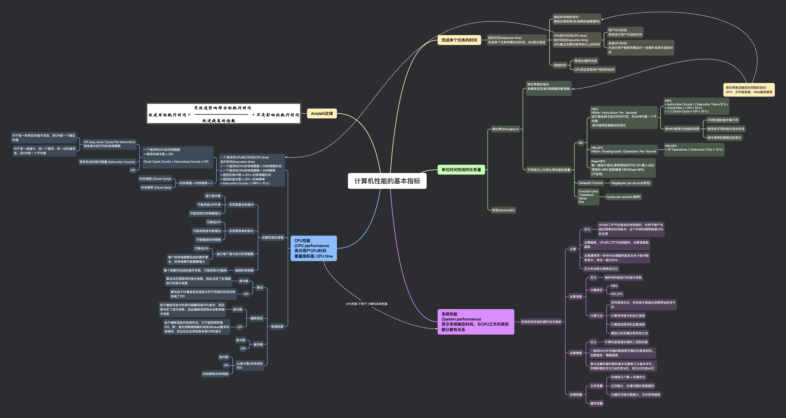

## 思维导图

## 完成单个任务的时间

### 响应时间(response time)：

完成单个任务所需的总时间，由 2 部分组成

- 响应时间短的场合：
  事务处理系统(存/取款的速度要快)

- CPU 执行时间(CPU time)
  执行时间(Execution time)
  CPU 真正花费在程序执行上的时间

  - 用户 CPU 时间:
    用来运行用户代码的时间

  - 系统 CPU 时间：
    为执行用户程序而需运行一些操作系统代码的时间

- 其他时间

  - 等待 I/O 操作完成

  - CPU 花在其他用户程序的时间

## 单位时间完成的任务量

### 吞吐率(throughput)

- 吞吐率高的场合：
  多媒体应用(音/视频播放要流畅)

- 不同层次上对吞吐率性能的度量

  - ISA

    - MIPS
      Million Instructions Per Seconds
      因为每条指令执行时间不同，所以 MIPS 是一个平均值，
      指令使用的频度动态变化

      - MIPS
        = Instruction Counts / ( Execution Time ×10^6 )
        = Clock Rate / ( CPI × 10^6 )
        = 1 / ( Clock Cycle × CPI × 10^6 )

      - 用 MIPS 数表示性能有局限

        - 不同机器的指令集不同

        - 程序由不同的指令混合而成

        - 指令使用的频度动态变化

    - MFLOPS
      Million Floating-point Operations Per Second

      - MFLOPS
        = FP Operations / ( Execution Time × 10^6 )

    - Peak MIPS
      取一组指令组合,使得得到的平均 CPI 最小,由此得到的 MIPS 就是峰值 MIPS(Peak MIPS)
      (不实用)

  - Datapath Control
    - Megabytes per second(带宽)
  - Function Units

    - Transistors
    - Wires
    - Pins

    - Cycles per second (频率)

### 带宽(bandwidth)

## 系统性能

(System performance)
表示系统响应时间，与 CPU 之外的其他部分都有关系

### 影响系统性能的硬件技术指标

- 主频

  - 定义

    - CPU 的工作节拍是由时钟控制的，时钟不断产生固定频率的时钟脉冲，这个时钟的频率就是 CPU 的主频

  - 主频越高，CPU 的工作节拍就越快，运算速度就越高

  - 主频通常用一秒钟内处理器所能发出电子脉冲数来表示，单位一般为 GHz

  - 芯片的功耗与频率成正比

- 运算速度

  - 定义

    - 每秒钟所能执行的指令条数

  - 计量单位

    - MIPS

    - MFLOPS

  - 计算方法

    - 吉布森混合法：各类指令根据出现频率加权求平均

    - 计算各种指令的执行速度

    - 计算典型程序的运算速度

    - 模型分析和模拟等其他方法

- 运算精度

  - 定义

    - 计算机能直接处理的二进制位数

  - 一般和 CPU 中存储的数据寄存器的位数是相同。位数越多，精度越高

  - 参与运算的操作数的基本位数称之为基本字长 。早期的微机字长为 8 位或 16 位，现为 32 位或 64 位

- 存储容量

  - 主存容量

    - 存储单元个数 × 存储字长

    - 主存越大，处理问题的速度越快

    - 与辅存交换次数越少，访存效率越高

  - 辅存容量

## CPU 性能

(CPU performance)
表示用户 CPU 时间
衡量指标是: CPU time

### 一个程序的 CPU 执行时间(CPU time)

执行时间(Execution time)
= 一个程序的 CPU 时钟周期数 × 时钟周期时间
= 一个程序的 CPU 时钟周期数 ÷ 时钟频率
= 程序的指令数 × CPI × 时钟周期时间
= 程序的指令数 × CPI ÷ 时钟频率
= Instruction Counts / ( MIPS × 10^6 )

- 一个程序的 CPU 时钟周期数
  ＝程序的指令数 × CPI

Clock Cycle Counts = Instructions Counts × CPI

    - CPI (avg. clock Cycles Per Instruction)

每条指令的平均时钟周期数

    	- 对于某一条特定的指令而言，其CPI是一个确定的值

    	- 对于某一类指令、或一个程序、或一台机器而言，其CPI是一个平均值

    - 程序包含的指令数量 (Instruction Counts)

    - CPI

- 时钟周期 × 时钟频率 = 1

  - 时钟周期 (Clock Cycle)

  - 时钟频率 (Clock Rate)

### 改善性能的措施

- 采用更复杂的指令

  - 减少指令数

  - 可能导致 CPI 升高

  - 可能导致时钟周期增大

- 采用更简单的指令

  - 可降低 CPI

  - 可能导致指令数增加

  - 可能缩短时钟周期

- 减少每个指令执行的周期数

  - 可降低 CPI

  - 每个时钟周期需完成的操作更多，时钟周期可能需要增大

- 缩短时钟周期

  - 每个周期内完成的操作有限，可能导致 CPI 提高

### 影响因素

- 算法

  - 指令数

    - 算法决定源程序的指令条数，因此决定了处理器执行的指令条数

  - CPI

    - 算法由于对慢速或快速指令的不同倾向性而同样影响了 CPI

- 编程语言

  - 指令数

    - 由于编程语言中的语句被翻译成 CPU 指令，而后者决定了指令条数，因此编程语言势必会影响指令条数

  - CPI

    - 由于编程语言的自身特点，它可能同样影响 CPI。例：强支持数据抽象的语言(如 Java)要求间接调用，而这往往会用到具有高 CPI 的指令

- 编译器

  - 指令数

  - CPI

- IS/指令集/体系结构
  /ISA

  - 指令数

  - CPI

  - 时钟频率/时钟周期

## Amdahl 定律

###

## 吞吐率高且响应时间短的场合：

ATM、文件服务器、Web 服务器等
