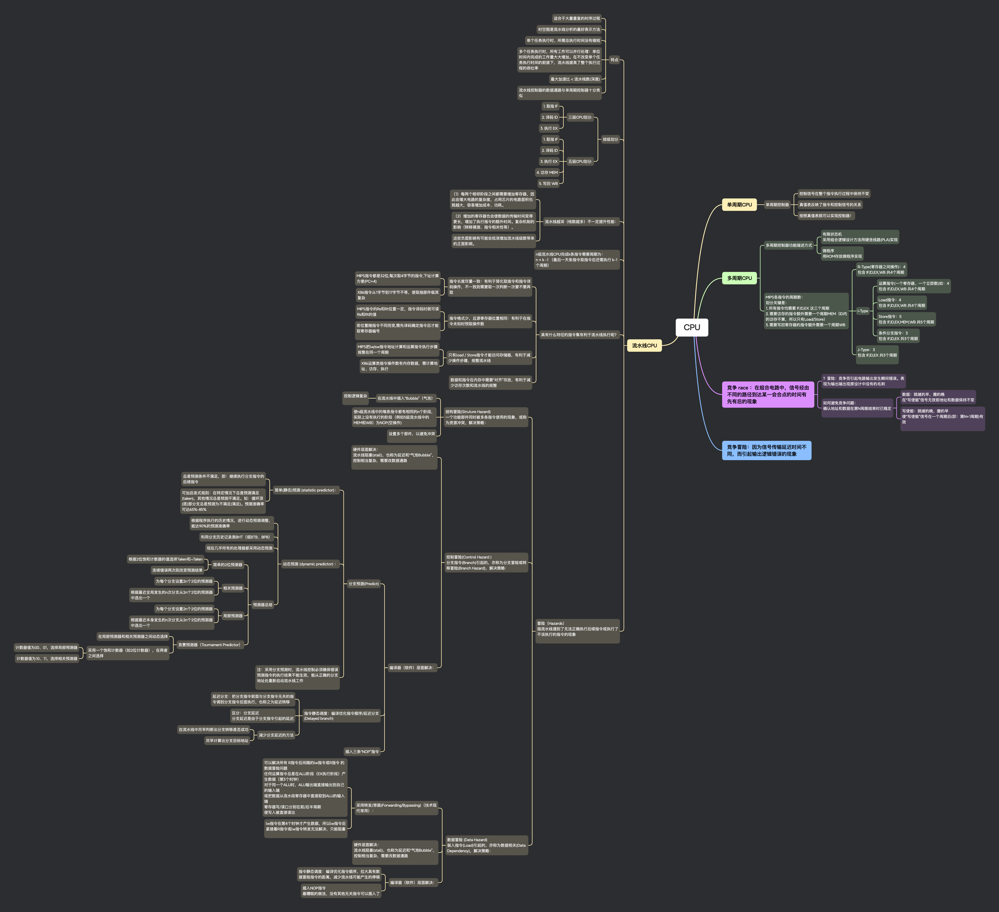

## 思维导图

CPU

## 单周期 CPU

### 单周期控制器

- 控制信号在整个指令执行过程中保持不变

- 真值表反映了指令和控制信号的关系

- 按照真值表就可以实现控制器！

## 多周期 CPU

### 多周期控制器功能描述方式

- 有限状态机
  采用组合逻辑设计方法用硬连线路(PLA)实现

- 微程序
  用 ROM 存放微程序实现

### MIPS 各指令的周期数：

划分关键是：

1. 所有指令均需要 IF,ID,EX 这三个周期
2. 需要访存的指令额外需要一个周期 MEM（ID 内的访存不算，所以只有 Load/Store）
3. 需要写回寄存器的指令额外需要一个周期 WB

- R-Type(寄存器之间操作)：4
  包含 IF,ID,EX,WB 共 4 个周期

- I-Type

  - 运算指令(一个寄存器、一个立即数)如：4
    包含 IF,ID,EX,WB 共 4 个周期

  - Load 指令：4
    包含 IF,ID,EX,WB 共 4 个周期

  - Store 指令：5
    包含 IF,ID,EX,MEM,WB 共 5 个周期

  - 条件分支指令：3
    包含 IF,ID,EX 共 3 个周期

- J-Type：3
  包含 IF,ID,EX 共 3 个周期

## 竞争 race ：在组合电路中，信号经由不同的路径到达某一会合点的时间有先有后的现象

### ？冒险：竞争而引起电路输出发生瞬间错误。表现为输出端出现原设计中没有的毛刺

### 如何避免竞争问题：

确认地址和数据在第 N 周期结束时已稳定

- 数据：就绪的早，撤的晚
  在“写使能”信号无效前地址和数据保持不变

- 写使能：就绪的晚，撤的早
  使“写使能”信号在一个周期后(即：第 N+1 周期)有效

## 竞争冒险：因为信号传输延迟时间不同，而引起输出逻辑错误的现象

## 流水线 CPU

### 特点

- 适合于大量重复的时序过程

- 时空图是流水线分析的最好表示方法

- 单个任务执行时，所需总执行时间没有缩短

- 多个任务执行时，所有工作可以并行处理：单位时间内完成的工作量大大增加。在不改变单个任务执行时间的前提下，流水线提高了整个执行过程的吞吐率

- 最大加速比 < 流水栈数(深度)

- 流水线控制器的数据通路与单周期控制器十分类似

### 按级划分

- 三级 CPU 划分:

  - 1. 取指 IF

  - 2. 译码 ID

  - 3. 执行 EX

- 五级 CPU 划分:

  - 1. 取指 IF

  - 2. 译码 ID

  - 3. 执行 EX

  - 4. 访存 MEM

  - 5. 写回 WB

### 流水线越深（栈数越多）不一定提升性能：

- （1）每两个相邻阶段之间都需要增加寄存器，因此会增大电路的复杂度，占用芯片的电路面积也就越大，容易增加成本、功耗。

- （2）增加的寄存器也会使数据的传输时间变得更长，增加了执行指令的额外时间。复杂机制的影响（转移猜测、指令相关性等）。

- 这些负面影响有可能会抵消增加流水线级数带来的正面影响。

### n 级流水线 CPU 完成 k 条指令需要周期为：

n + k -1 （最后一天条指令取指令后还需执行 k-1 个周期）

### 具有什么特征的指令集有利于流水线执行呢？

- 指令长度尽量一致：有利于简化取指令和指令译码操作，不一致则需要取一次判断一次要不要再取

  - MIPS 指令都是 32 位,每次取 4 字节的指令,下址计算方便(PC+4)

  - X86 指令从 1 字节到 17 字节不等，使取指部件极其复杂

- 指令格式少，且源寄存器位置相同：有利于在指令未知时预取操作数

  - MIPS 指令的 Rs 和 Rt 位置一定，指令译码时就可读 Rs 和 Rt 的值

  - 若位置随指令不同而变,需先译码确定指令后才能取寄存器编号

- 只有 load / Store 指令才能访问存储器，有利于减少操作步骤，规整流水线

  - MIPS 把 lw/sw 指令地址计算和运算指令执行步骤规整在同一个周期

  - X86 运算类指令操作数有内存数据，需计算地址、访存、执行

- 数据和指令在内存中需要“对齐”存放，有利于减少访存次数和流水线的规整

### 冒险（Hazards）

指流水线遇到了无法正确执行后续指令或执行了不该执行的指令的现象

- 结构冒险(Struture Hazard)
  一个功能部件同时被多条指令使用的现象，或称为资源冲突，解决策略：

  - 在流水线中插入“Bubble”（气泡）

    - 控制逻辑复杂

  - 使 n 级流水线中的每条指令都有相同的 n 个阶段，实际上没有执行的阶段（例如 5 级流水线中的 MEM 和 WB）为 NOP(空操作)
  - 设置多个部件，以避免冲突

- 控制冒险(Control Hazard )
  分支指令(Branch)引起的，亦称为分支冒险或转移冒险(Branch Hazard)，解决策略：

  - 硬件层面解决：
    流水线阻塞(stall)，也称为延迟和“气泡 Bubble”，控制相当复杂，需要改数据通路

  - 编译器（软件）层面解决：

    - 分支预测(Predict)

      - 简单(静态)预测 (statistic predictor)：

        - 总是预测条件不满足，即：继续执行分支指令的后续指令
        - 可加启发式规则：在特定情况下总是预测满足(taken)，其他情况总是预测不满足。如：循环顶(底)部分支总是预测为不满足(满足)。预测准确率可达 65%-85%

      - 动态预测 (dynamic predictor) ：
        - 根据程序执行的历史情况，进行动态预测调整，能达 90%的预测准确率
        - 利用分支历史记录表 BHT（或 BTB、BPB）
        - 现在几乎所有的处理器都采用动态预测
        - 预测器总结
          - 简单的 2 位预测器
            - 根据 2 位饱和计数器的值选择 Taken 和 ¬Taken
            - 连续错误两次则改变预测结果
          - 相关预测器
            - 为每个分支设置 2n 个 2 位的预测器
            - 根据最近全局发生的 n 次分支从 2n 个 2 位的预测器中选出一个
          - 局部预测器
            - 为每个分支设置 2n 个 2 位的预测器
            - 根据最近本身发生的 n 次分支从 2n 个 2 位的预测器中选出一个
          - 竞赛预测器（Tournament Predictor）
            - 在局部预测器和相关预测器之间动态选择
            - 采用一个饱和计数器（如 2 位计数器），在两者之间选择

              - 计数器值为 00、01，选择局部预测器

              - 计数器值为 10、11，选择相关预测器
      - 注：采用分支预测时，流水线控制必须确保错误预测指令的执行结果不能生效，能从正确的分支地址处重新启动流水线工作

    - 指令静态调度：编译优化指令顺序/延迟分支(Delayed branch)

      - 延迟分支：把分支指令前面与分支指令无关的指令调到分支指令后面执行，也称之为延迟转移
      - 区分：分支延迟
        分支延迟是由于分支指令引起的延迟

      - 减少分支延迟的方法

        - 在流水线中尽早判断出分支转移是否成功

        - 尽早计算出分支目标地址

    - 插入三条“NOP”指令

- 数据冒险 (Data Hazard)
  装入指令(Load)引起的，亦称为数据相关(Data Dependency)，解决策略：

  - 采用转发/旁路(Forwarding/Bypassing)（技术现代常用）：

    - 可以解决所有 R 指令后间隔的 lw 指令或 R 指令 的数据冒险问题
      任何运算指令总是在 ALU 阶段（EX 执行阶段）产生数据（第 3 个时钟）
      对于同一个 ALU 时，ALU 输出端直接输出到自己的输入端
      或把数据从流水段寄存器中直接取到 ALU 的输入端
      寄存器写/读口分别在前/后半周期
      使写入被直接读出

    - lw 指令在第 4 个时钟才产生数据，所以 lw 指令后紧接着 R 指令或 lw 指令转发无法解决，只能阻塞

  - 硬件层面解决：

    流水线阻塞(stall)，也称为延迟和“气泡 Bubble”，控制相当复杂，需要改数据通路

  - 编译器（软件）层面解决：
    - 指令静态调度：编译优化指令顺序，拉大具有数据冒险指令的距离，减少流水线可能产生的停顿
    - 插入 NOP 指令
      最糟糕的做法，没有其他无关指令可以插入了
