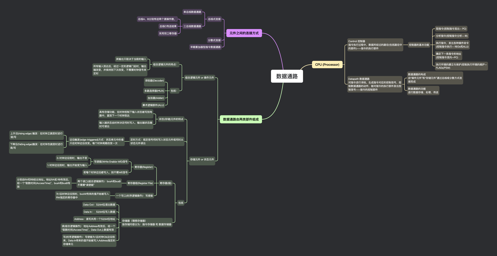

## 思维导图

## CPU (Processor)

### Control 控制器

指令执行过程中，数据所经过的路径(包括路径中的部件)——指令的执行部件

- 控制器的基本功能

  - 取指令(控制指令流出— PC)

  - 分析指令(控制指令分析— IR)

  - 执行指令，发出各种操作命令
    (控制指令执行— REGs 和 ALU)

  - 确定下一条指令的地址
    (控制指令流向—PC)

  - 执行环境的建立与保护(控制执行环境的维护—FLAGs/PSW)

### Datapath 数据通路

对指令进行译码，生成指令对应的控制信号，控制数据通路的动作，能对指令的执行部件发出控制信号——指令的控制部件

- 数据通路的构成
  由“操作元件”和“存储元件”通过总线或分散方式连接而成

- 数据通路的功能
  进行数据存储、处理、传送

## 数据通路由两类部件组成

### 组合逻辑元件 or 操作元件

- 组合逻辑元件的特点：

  - 其输出只取决于当前的输入

  - 所有输入到达后，经过一定的逻辑门延时，输出端改变，并保持到下次改变，不需要时钟信号来定时

- 包括：

  - 译码器(Decoder)

  - 多路选择器(MUX)
  - 加法器(Adder)
  - 算术逻辑部件(ALU)

### 存储元件 or 状态元件

- 状态(存储)元件的特点

  - 具有存储功能，在时钟控制下输入状态被写到电路中，直到下一个时钟到达

  - 输入端状态由时钟决定何时写入，输出端状态随时可读出

- 定时方式：规定信号何时写入状态元件或何时从状态元件读出

  - 边沿触发(edge-triggered)方式：状态单元中的值只在时钟边沿改变。每个时钟周期改变一次

    - 上升沿(rising edge) 触发：在时钟正跳变时进行读/写

    - 下降沿(falling edge)触发：在时钟负跳变时进行读/写

- 包括

  - 寄存器(组)

    - 寄存器(Register)

      - 写使能(Write Enable-WE)信号

        - 0: 时钟边沿到时，输出不变

        - 1: 时钟边沿到时，输出开始变为输入

      - 若每个时钟边沿都写入，则不需 WE 信号

    - 寄存器组(Register File)

      - 两个读口(组合逻辑操作)：busA 和 busB
        不需要“读使能”

        - 分别由 RA 和 RB 给出地址。地址 RA 或 RB 有效后，经一个“取数时间(AccessTime)”，busA 和 busB 有效

    - 一个写口(时序逻辑操作)：写使能

      - 为 1 且时钟边沿到时，busW 传来的值开始被写入 RW 指定的寄存器中

  - 存储器（理想存储器）
    按存储内容分为：指令存储器 和 数据存储器

    - Data Out：32/64 位读出数据

    - Data In： 32/64 位写入数据

    - Address：读写共用一个 32/64 位地址

    - 读(组合逻辑操作)：地址 Address 有效后，经一个“取数时间(AccessTime)”，Data Out 上数据有效

    - 写(时序逻辑操作)：写使能为 1 且时钟 Clk 边沿到来，Data In 传来的值开始被写入 Address 指定的存储单元

## 元件之间的连接方式

### 总线式连接

- 单总线数据通路

- 三总线数据通路

  - 总线 A、B 分别传送两个源操作数，

  - 总线 C 传送结果

  - 采用双口寄存器

### 分散式连接

### 早期累加器型指令数据通路
