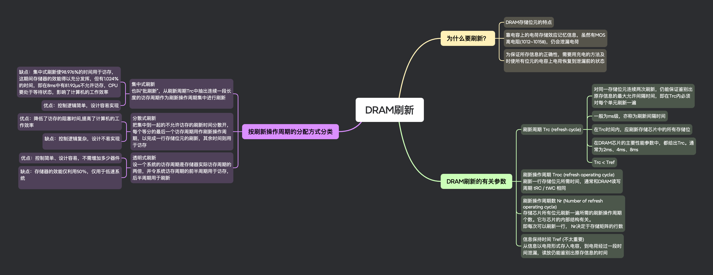

## 思维导图

## 为什么要刷新？

### DRAM 存储位元的特点

### 靠电容上的电荷存储效应记忆信息，虽然有 MOS 高电阻($10^{12} \sim 10^{15} \Omega$)，仍会泄漏电荷

### 为保证所存信息的正确性，需要用充电的方法及时使所有位元的电容上电荷恢复到泄漏前的状态

## DRAM 刷新的有关参数

### 刷新周期 Trc (refresh cycle)

- 对同一存储位元连续两次刷新，仍能保证鉴别出原存信息的最大允许间隔时间，即在 Trc 内必须对每个单元刷新一遍

- 一般为 ms 级，亦称为刷新间隔时间

- 在 Trc 时间内，应刷新存储芯片中的所有存储位

- 在 DRAM 芯片的主要性能参数中，都给出 Trc。通常为 2ms、4ms、8ms

- Trc < Tref

### 刷新操作周期 Troc (refresh operating cycle)

刷新一行存储位元所需时间，通常和 DRAM 读写周期 tRC / tWC 相同

### 刷新操作周期数 Nr (Number of refresh operating cycle)

存储芯片所有位元刷新一遍所需的刷新操作周期个数。它与芯片的内部结构有关。
即每次可以刷新一行， Nr 决定于存储矩阵的行数

### 信息保持时间 Tref (不太重要)

从信息以电荷形式存入电容，到电荷经过一段时间泄漏，读放仍能鉴别出原存信息的时间

## 按刷新操作周期的分配方式分类

### 集中式刷新

也叫“批刷新”，从刷新周期 Trc 中抽出连续一段长度的访存周期作为刷新操作周期集中进行刷新

- 缺点：集中式刷新使 98.976%的时间用于访存，这期间存储器的效能得以充分发挥，但有 1.024%的时间，即在 8ms 中有 81.92μs 不允许访存，CPU 要处于等待状态，影响了计算机的工作效率

- 优点：控制逻辑简单，设计容易实现

### 分散式刷新

把集中到一起的不允许访存的刷新时间分散开，每个等分的最后一个访存周期用作刷新操作周期，以完成一行存储位元的刷新，其余时间则用于访存

- 优点：降低了访存的阻塞时间,提高了计算机的工作效率

- 缺点：控制逻辑复杂，设计不易实现

### 透明式刷新

设一个系统的访存周期是存储器实际访存周期的两倍，并令系统访存周期的前半周期用于访存，后半周期用于刷新

- 优点：控制简单、设计容易，不需增加多少器件

- 缺点：存储器的效能仅利用 50％，仅用于低速系统
