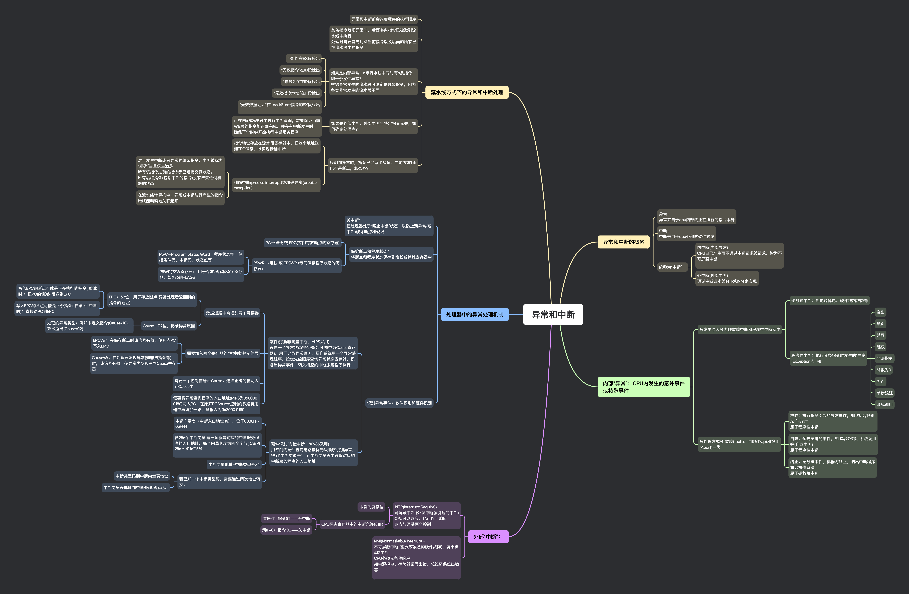

## 思维导图

## 异常和中断的概念

### 异常：

异常来自于 cpu 内部的正在执行的指令本身

### 中断：

中断来自于 cpu 外部的硬件触发

### 统称为“中断”：

- 内中断(内部异常)
  CPU 自己产生而不通过中断请求线请求，皆为不可屏蔽中断

- 外中断(外部中断)
  通过中断请求线 INTR 和 NMI 来实现

## 内部“异常”：CPU 内发生的意外事件或特殊事件

### 按发生原因分为硬故障中断和程序性中断两类

- 硬故障中断：如电源掉电、硬件线路故障等

- 程序性中断：执行某条指令时发生的“异常(Exception)”，如

  - 溢出

  - 缺页

  - 越界

  - 越权

  - 非法指令

  - 除数为 0

  - 断点

  - 单步跟踪

  - 系统调用

### 按处理方式分 故障(fault)、自陷(Trap)和终止(Abort)三类

- 故障：执行指令引起的异常事件，如 溢出 /缺页 /访问超时
  属于程序性中断

- 自陷：预先安排的事件，如 单步跟踪、系统调用等(自愿中断)
  属于程序性中断

- 终止：硬故障事件，机器将终止，调出中断程序重启操作系统
  属于硬故障中断

## 外部“中断”：

### INTR(Interrupt Require)：

可屏蔽中断 (外设中断源引起的中断)
CPU 可以响应、也可以不响应
响应与否受两个控制：

- 本身的屏蔽位

- CPU 标志寄存器中的中断允许位(IF)

  - 置 IF=1：指令 STI——开中断

  - 清 IF=0：指令 CLI——关中断

### NMI(Nonmaskable Interrupt)：

不可屏蔽中断 (重要或紧急的硬件故障)，属于类型 2 中断
CPU 必须无条件响应
如电源掉电、存储器读写出错、总线奇偶位出错等

## 处理器中的异常处理机制

### 关中断：

使处理器处于“禁止中断”状态，以防止新异常(或中断)破坏断点和现场

### 保护断点和程序状态：

将断点和程序状态保存到堆栈或特殊寄存器中

- PC→ 堆栈 或 EPC(专门存放断点的寄存器)

- PSWR → 堆栈 或 EPSWR (专门保存程序状态的寄存器)

  - PSW—Program Status Word：程序状态字，包括条件码、中断码、状态位等

  - PSWR(PSW 寄存器)：用于存放程序状态字寄存器。如 X86 的 FLAGS

### 识别异常事件：软件识别和硬件识别

- 软件识别(非向量中断、MIPS 采用)
  设置一个异常状态寄存器(如 MIPS 中为 Cause 寄存器)，用于记录异常原因。操作系统用一个异常处理程序，按优先级顺序查询异常状态寄存器，识别出异常事件，转入相应的中断服务程序执行

  - 数据通路中需增加两个寄存器

    - EPC：32 位，用于存放断点(异常处理后返回到的指令的地址)

      - 写入 EPC 的断点可能是正在执行的指令( 故障 时)：把 PC 的值减 4 后送到 EPC

      - 写入 EPC 的断点可能是下条指令( 自陷 和 中断 时)：直接送 PC 到 EPC

    - Cause：32 位，记录异常原因

      - 处理的异常类型：例如未定义指令(Cause=10)、算术溢出(Cause=12)

  - 需要加入两个寄存器的“写使能”控制信号

    - EPCWr：在保存断点时该信号有效，使断点 PC 写入 EPC

    - CauseWr：在处理器发现异常(如非法指令等)时，该信号有效，使异常类型被写到 Cause 寄存器

  - 需要一个控制信号 IntCause：选择正确的值写入到 Cause 中

  - 需要将异常查询程序的入口地址(MIPS 为 0x8000 0180)写入 PC：在原来 PCSource 控制的多路复用器中再增加一路，其输入为 0x8000 0180

- 硬件识别(向量中断、80x86 采用)
  用专门的硬件查询电路按优先级顺序识别异常，得到“中断类型号”，到中断向量表中读取对应的中断服务程序的入口地址

  - 中断向量表（中断入口地址表），位于 0000H ～ 03FFH

  - 含 256 个中断向量,每一项就是对应的中断服务程序的入口地址，每个向量长度为四个字节( CS:IP)
    256 = 4*16*16/4

  - 中断向量地址=中断类型号 ×4
  - 若已知一个中断类型码，需要通过两次地址转换：
    - 中断类型码到中断向量表地址
    - 中断向量表地址到中断处理程序地址

## 流水线方式下的异常和中断处理

### 异常和中断都会改变程序的执行顺序

### 某条指令发现异常时，后面多条指令已被取到流水线中执行

处理时需要首先清除当前指令以及后面的所有已在流水线中的指令

### 如果是内部异常，n 级流水线中同时有 n 条指令，哪一条发生异常？

根据异常发生的流水段可确定是哪条指令，因为各类异常发生的流水段不同

- “溢出”在 EX 段检出

- “无效指令”在 ID 段检出

- “除数为 0”在 ID 段检出

- “无效指令地址”在 IF 段检出

- “无效数据地址”在 Load/Store 指令的 EX 段检出

### 如果是外部中断，外部中断与特定指令无关，如何确定处理点？

- 可在 IF 段或 WB 段中进行中断查询，需要保证当前 WB 段的指令能正确完成，并在有中断发生时，确保下个时钟开始执行中断服务程序

### 检测到异常时，指令已经取出多条，当前 PC 的值已不是断点，怎么办？

- 指令地址存放在流水段寄存器中，把这个地址送到 EPC 保存，以实现精确中断

- 精确中断(precise interrupt)或精确异常(precise exception)

  - 对于发生中断或者异常的单条指令，中断被称为“精确”当且仅当满足：
    所有该指令之前的指令都已经提交其状态；
    所有后继指令(包括中断的指令)没有改变任何机器的状态

  - 在流水线计算机中，异常或中断与其产生的指令始终能精确地关联起来
