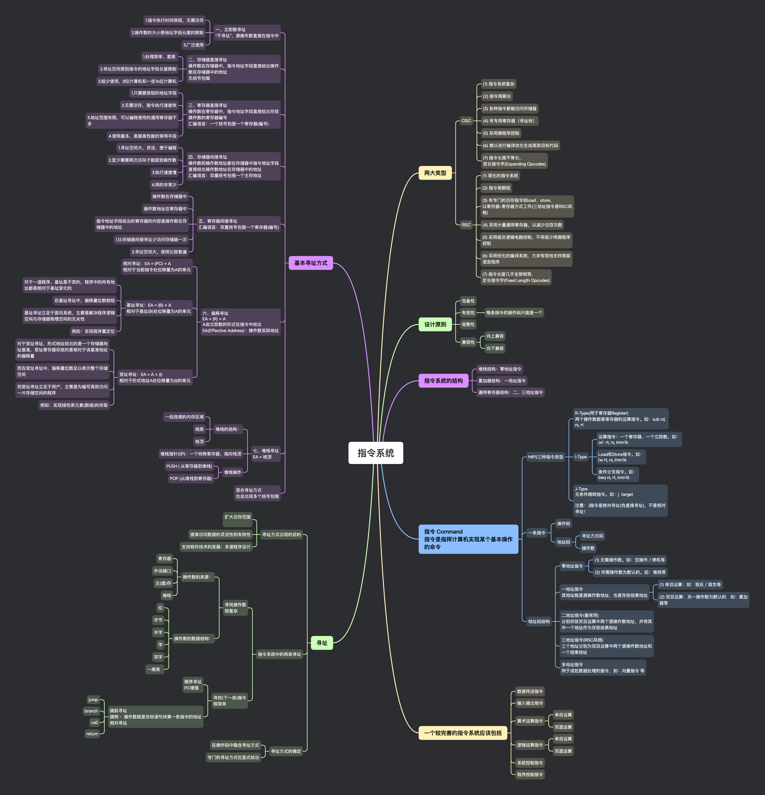

## 思维导图

## 两大类型

### CISC

- (1) 指令系统复杂
- (2) 指令周期长
- (3) 各种指令都能访问存储器
- (4) 有专用寄存器（寻址快）
- (5) 采用微程序控制
- (6) 难以进行编译优化生成高效目标代码
- (7) 指令长度不等长，
  变长指令字(Expanding Opcodes)

### RISC

- (1) 简化的指令系统
- (2) 指令周期短
- (3) 有专门的访存指令如 load、store，
  以寄存器-寄存器方式工作(三地址指令是 RISC 风格)
- (4) 采用大量通用寄存器，以减少访存次数
- (5) 采用组合逻辑电路控制，不用或少用微程序控制
- (6) 采用优化的编译系统，力求有效地支持高级语言程序
- (7) 指令长度几乎全部相等，
  定长指令字(Fixed Length Opcodes)

## 设计原则

### 完备性

### 有效性

- 每条指令的操作码只能是一个

### 规整性

### 兼容性

- 向上兼容
- 向下兼容

## 指令系统的结构

### 堆栈结构：零地址指令

### 累加器结构：一地址指令

### 通用寄存器结构：二、三地址指令

## 指令 Command

指令是指挥计算机实现某个基本操作的命令

### MIPS 三种指令类型

- R-Type(用于寄存器 Register)
  两个操作数都是寄存器的运算指令。如：sub rd, rs, rt
- I-Type

  - 运算指令：一个寄存器、一个立即数。如：
    ori rt, rs, imm16
  - Load 和 Store 指令。如：
    lw rt, rs, imm16
  - 条件分支指令。如：
    beq rs, rt, imm16

- J-Type
  无条件跳转指令。如：j target

注意：J 指令是绝对寻址(伪直接寻址)，不是相对寻址！

### 一条指令

- 操作码
- 地址码

  - 寻址方式码
  - 操作数

### 地址码结构

- 零地址指令

  - (1) 无需操作数。如：空操作／停机等
  - (2) 所需操作数为默认的。如：堆栈等

- 一地址指令
  其地址既是源操作数地址，也是存放结果地址

  - (1) 单目运算：如：取反／取负等
  - (2) 双目运算：另一操作数为默认的　如：累加器等

- 二地址指令(最常用)
  分别存放双目运算中两个源操作数地址，并将其中一个地址作为存放结果地址
- 三地址指令(RISC 风格)
  三个地址分别为双目运算中两个源操作数地址和一个结果地址
- 多地址指令
  用于成批数据处理的指令，如：向量指令 等

## 一个较完善的指令系统应该包括

### 数据传送指令

### 输入输出指令

### 算术运算指令

- 单目运算
- 双面运算

### 逻辑运算指令

- 单目运算
- 双面运算

### 系统控制指令

### 程序控制指令

## 寻址

### 寻址方式出现的目的

- 扩大访存范围

- 提高访问数据的灵活性和有效性
- 支持软件技术的发展：多道程序设计

### 指令系统中的两类寻址

- 寻找操作数
  较复杂

  - 操作数的来源：

    - 寄存器
    - 外设端口
    - 主(虚)存
    - 堆栈

  - 操作数的数据结构：

    - 位
    - 字节
    - 半字
    - 字
    - 双字
    - 一维表

- 寻找(下一条)指令
  较简单

  - 顺序寻址
    PC 增值
  - 跳跃寻址
    跳转 ：操作数就是目标语句块第一条指令的地址
    相对寻址

    - jump
    - branch
    - call
    - return

### 寻址方式的确定

- 在操作码中隐含寻址方式
- 专门的寻址方式位显式给出

## 基本寻址方式

### 一、立即数寻址

“不寻址”，源操作数直接在指令中

- 1.指令执行时间很短，无需访存
- 2.操作数的大小受地址字段长度的限制
- 3.广泛使用

### 二、存储器直接寻址

操作数在存储器中，指令地址字段直接给出操作数在存储器中的地址
无括号包围

- 1.处理简单、直接
- 2.寻址空间受到指令的地址字段长度限制
- 3.较少使用，8 位计算机和一些 16 位计算机

### 三、寄存器直接寻址

操作数在寄存器中，指令地址字段直接给出存放操作数的寄存器编号
汇编语言：一个括号包围一个寄存器(编号)

- 1.只需要很短的地址字段
- 2.无需访存，指令执行速度快
- 3.地址范围有限，可以编程使用的通用寄存器不多
- 4.使用最多，是提高性能的常用手段

### 四、存储器间接寻址

操作数和操作数地址都在存储器中指令地址字段直接给出操作数地址在存储器中的地址
汇编语言：双重括号包围一个主存地址

- 1.寻址空间大，灵活，便于编程
- 2.至少需要两次访存才能取到操作数
- 3.执行速度慢
- 4.用的非常少

### 五、寄存器间接寻址

汇编语言：双重括号包围一个寄存器(编号)

- 操作数在存储器中
- 操作数地址在寄存器中
- 指令地址字段给出的寄存器的内容是操作数在存储器中的地址
- 1.比存储器间接寻址少访问存储器一次
- 2.寻址空间大，使用比较普遍

### 六、偏移寻址

EA = (R) + A
A 由立即数的形式在指令中给出
EA(Effective Address)：操作数实际地址

- 相对寻址：EA = (PC) + A
  相对于当前指令处位移量为 A 的单元
- 基址寻址：EA = (B) + A
  相对于基址(B)处位移量为 A 的单元

  - 对于一道程序，基址是不变的，程序中的所有地址都是相对于基址变化的
  - 在基址寻址中，偏移量位数较短
  - 基址寻址立足于面向系统，主要是解决程序逻辑空间与存储器物理空间的无关性
  - 例如：实现程序重定位

- 变址寻址：EA = A + (I)
  相对于形式地址 A 处位移量为(I)的单元

  - 对于变址寻址，形式地址给出的是一个存储器地址基准，变址寄存器存放的是相对于该基准地址的偏移量
  - 而在变址寻址中，偏移量位数足以表示整个存储空间
  - 而变址寻址立足于用户，主要是为编写高效访问一片存储空间的程序
  - 例如：实现线性表元素(数组)的存取

### 七、堆栈寻址

EA = 栈顶

- 堆栈的结构：

  - 一段连续的内存区域
  - 栈底
  - 栈顶

- 堆栈指针(SP)：一个特殊寄存器，指向栈顶
- 堆栈操作

  - PUSH ( 从寄存器到堆栈)
  - POP (从堆栈到寄存器)

### 混合寻址方式

也会出现多个括号包围
