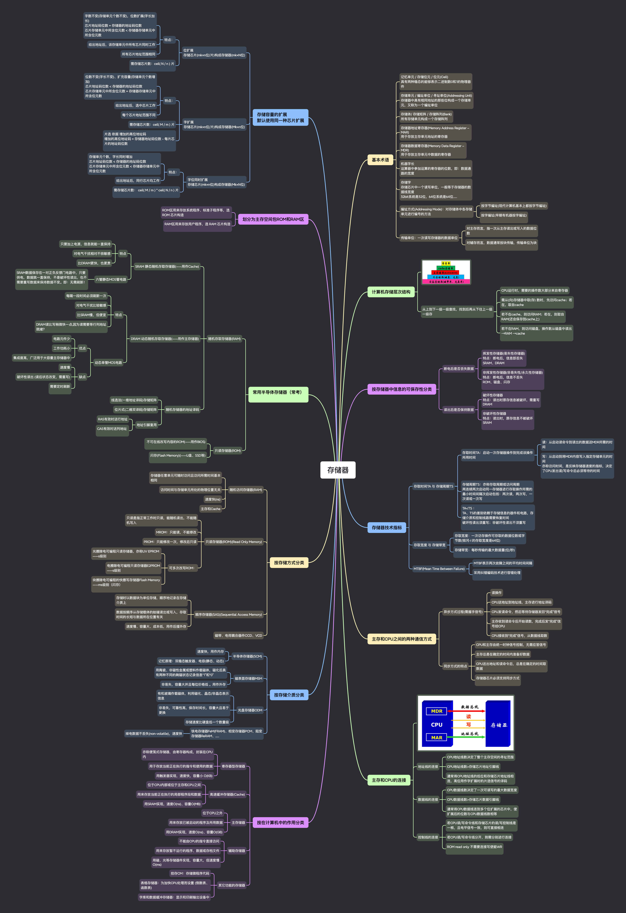

## 思维导图

## 基本术语

### 记忆单元 / 存储位元 / 位元(Cell)

具有两种稳态的能够表示二进制数 0 和 1 的物理器件

### 存储单元 / 编址单位 / 寻址单位(Addressing Unit)

存储器中具有相同地址的那些位构成一个存储单元，又称为一个编址单位

### 存储体/ 存储矩阵 / 存储阵列(Bank)

所有存储单元构成一个存储阵列

### 存储器地址寄存器(Memory Address Register – MAR)

用于存放主存单元地址的寄存器

### 存储器数据寄存器(Memory Data Register – MDR)

用于存放主存单元中数据的寄存器

### 机器字长

运算器中参加运算的寄存器的位数，即：数据通路的宽度

### 存储字

存储芯片中一个读写单位，一般等于存储器的数据线宽度
32bit 系统是 32 位，64 位系统是 64 位......

### 编址方式(Addressing Mode)：对存储体中各存储单元进行编号的方法

- 按字节编址(现代计算机基本上都按字节编址)

- 按字编址(早期有机器按字编址)

### 传输单位：一次读写存储器的数据单位

- 对主存而言，指一次从主存读出或写入的数据位数

- 对辅存而言，数据通常按块传输，传输单位为块

## 计算机存储层次结构

###

### 从上到下一级一级查找，找到后再从下往上一级一级存

- CPU 运行时，需要的操作数大部分来自寄存器

- 需从(向)存储器中取(存) 数时，先访问 cache；若在，取自 cache

- 若不在 cache，则访问 RAM；若在，则取自 RAM(还会保存到 cache 上)

- 若不在 RAM，则访问磁盘，操作数从磁盘中读出 →RAM →cache

## 按存储器中信息的可保存性分类

### 断电后是否丢失数据

- 挥发性存储器(易失性存储器)
  特点：断电后，信息即丢失
  SRAM、DRAM

- 非挥发性存储器(非易失性/永久性存储器)
  特点：断电后，信息不丢失
  ROM、磁盘、闪存

### 读出后是否保持数据

- 破坏性存储器
  特点：读出时原存信息被破坏，需重写
  DRAM

- 非破坏性存储器
  特点：读出时，原存信息不被破坏
  SRAM

## 存储器技术指标

### 存取时间 TA 与 存储周期 TS

- 存取时间 TA：启动一次存储器操作到完成该操作所用时间

  - 读：从启动读命令到读出的数据送 MDR 所需的时间

  - 写：从启动到将 MDR 内容写入指定存储单元的时间
    亦称访问时间，是反映存储器速度的指标，决定了 CPU 发出读/写命令后必须等待的时间

- 存储周期 TS：亦称存取周期或访问周期
  两连续两次启动同一存储器进行存取操作所需的最小时间间隔次启动包括：两次读，两次写，一次读或一次写

- TA<TS ：
  TA、TS 的差别依赖于存储信息的器件和电路，存储介质和控制线路需要恢复时间
  破坏性读出须重写；非破坏性读出不须重写

### 存取宽度 与 存储带宽

- 存取宽度：一次访存操作可存取的数据位数或字节数(银河-I 的存取宽度是 64 位)

- 存储带宽：每秒传输的最大数据量(位/秒)

### MTBF(Mean Time Between Failure)

- MTBF 表示两次故障之间的平均时间间隔

- 采用纠错编码技术进行容错处理

## 主存和 CPU 之间的两种通信方式

### 异步方式过程(需握手信号)

- 读操作

- CPU 送地址到地址线，主存进行地址译码

- CPU 发读命令，然后等待存储器发回“完成”信号

- 主存收到读命令后开始读数，完成后发“完成”信号给 CPU

- CPU 接收到“完成”信号，从数据线取数

### 同步方式的特点

- CPU 和主存由统一时钟信号控制，无需应答信号

- 主存总是在确定的时间内准备好数据

- CPU 送出地址和读命令后，总是在确定的时间取数据

- 存储器芯片必须支持同步方式

## 主存和 CPU 的连接

###

### 地址线的连接

- CPU 地址线数决定了整个主存空间的寻址范围

- CPU 地址线数>存储芯片地址引脚线

- 通常将 CPU 地址线的低位和存储芯片地址线相连，高位用作字扩展时的片选信号的译码

### 数据线的连接

- CPU 数据线数决定了一次可读写的最大数据宽度

- CPU 数据线数>存储芯片数据引脚线

- 通常将 CPU 数据线连到多个位扩展的芯片中，使扩展后的位数与 CPU 数据线数相等

### 控制线的连接

- 若 CPU 读/写命令线和存储芯片的读/写控制线是一根，且电平信号一致，则可直接相连

- 若 CPU 读/写命令线分开，则需分别进行连接

- ROM read only 不需要连接写使能 WR

## 按在计算机中的作用分类

### 寄存器型存储器

- 亦称便笺式存储器，由寄存器构成，封装在 CPU 内

- 用于存放当前正在执行的指令和使用的数据

- 用触发器实现，速度快，容量小 O(KB)

### 高速缓冲存储器(Cache)

- 位于 CPU 内部或位于主存和 CPU 之间

- 用来存放当前正在执行的局部程序段和数据

- 用 SRAM 实现，速度 O(ns)、容量 O(MB)

### 主存储器

- 位于 CPU 之外

- 用来存放已被启动的程序及所用数据

- 用 DRAM 实现，速度 O(ns)、容量 O(GB)

### 辅助存储器

- 不能由 CPU 的指令直接访问

- 用来存放暂不运行的程序、数据或存档文件

- 用磁、光等存储器件实现，容量大，但速度慢 O(ms)

### 其它功能的存储器

- 控存 CM：存储微程序代码

- 表格存储器：为加快 CPU 处理而设置 (倒数表、函数表)

- 字库和数据缓冲存储器：显示和印刷输出设备中

## 按存储介质分类

### 半导体存储器(SCM)

- 速度快，用作内存

- 记忆原理：双稳态触发器、电容(静态、动态)

### 磁表面存储器 MSM

- 用陶瓷、非磁性金属或塑料作载磁体，磁化后具有两种不同的剩磁状态记录信息“1”和“0”

- 非易失，容量大并且每位价格低 。用作外存

### 光盘存储器 ODM

- 有机玻璃作载磁体，利用磁化、晶态/非晶态表示信息

- 非易失，可靠性高，保存时间长，容量大且易于更换

- 存储速度比硬盘低一个数量级

### 铁电存储器 FeM(FRAM)、相变存储器 PCM、阻变存储器 ReRAM、......

- 掉电数据不丢失(non-volatile)，速度快

## 按存储方式分类

### 随机访问存储器(RAM)

- 存储器任意单元可随时访问且访问所需时间基本相同

- 访问时间与存储单元所处的物理位置无关

- 速度快(ns)

- 主存和 Cache

### 只读存储器(ROM)(Read Only Memory)

- 只读是指正常工作时只读，能随机读出，不能随机写入

- MROM：只能读，不能修改

- PROM：只能修改一次，修改后只读

- 可多次改写 ROM：

  - 光擦除电可编程只读存储器，亦称 UV EPROM
    ——s 级别

  - 电擦除电可编程只读存储器 E2PROM
    ——s 级别

  - 块擦除电可编程的快擦写存储器 Flash Memory
    ——ms 级别（闪存）

### 顺序存储器(SAS)(Sequential Access Memory)

- 存储时以数据块为单位存储，顺序地记录在存储介质上

- 数据按顺序从存储载体的始端读出或写入，存取时间的长短与数据所在位置有关

- 速度慢、容量大、成本低，用作后援外存

### 磁带、电荷耦合器件 CCD、VCD

## 常用半导体存储器（常考）

### 随机存取存储器(RAM)

- SRAM 静态随机存取存储器(——用作 Cache)

  - 特点

    - 只要加上电源，信息就能一直保持

    - 对电气干扰相对不很敏感

    - 比 DRAM 更快，也更贵

  - 六管静态 MOS 管电路

    - SRAM 数据保存在一对正负反馈门电路中，只要供电，数据就一直保持，不是破环性读出，也不需要重写数据来保持数据不变。即：无需刷新！

- DRAM 动态随机存取存储器(——用作主存储器)

  - 特点

    - 每隔一段时间必须刷新一次

    - 对电气干扰比较敏感

    - 比 SRAM 慢，但便宜

    - DRAM 读比写稍微快一点,因为读需要等行列地址就绪？

  - 动态单管 MOS 电路

    - 优点

      - 电路元件少

      - 工作功耗小

      - 集成度高，广泛用于大容量主存储器中

    - 缺点

      - 速度慢

      - 破坏性读出 (读后状态改变，需重写)

      - 需要定时刷新

- 随机存储器的地址译码

  - 线选法(一维地址译码)存储矩阵

  - 位片式(二维双译码)存储矩阵

  - 地址引脚复用

    - RAS 有效时送行地址

    - CAS 有效时送列地址

### 只读存储器(ROM)

- 不可在线改写内容的 ROM(——用作 BIOS)

- 闪存(Flash Memory)(——U 盘、SSD 等)

## 划分为主存空间包 ROM 和 RAM 区

### ROM 区用来存放系统程序、标准子程序等，选 ROM 芯片构造

### RAM 区用来存放用户程序，选 RAM 芯片构造

## 存储容量的扩展

默认使用同一种芯片扩展

### 位扩展

存储芯片(mk×n 位/片)构成存储器(mk×N 位)

- 特点：

  - 字数不变(存储单元个数不变)，位数扩展(字长加长)
    芯片地址码位数 = 存储器的地址码位数
    芯片存储单元中所含位元数 < 存储器存储单元中所含位元数

  - 给出地址后，该存储单元中所有芯片同时工作

  - 所有芯片地址范围相同

- 需存储芯片数：ceil( N / n ) 片

### 字扩展

存储芯片(mk×n 位/片)构成存储器(Mk×n 位)

- 特点：

  - 位数不变(字长不变)、扩充容量(存储单元个数增加)
    芯片地址码位数 < 存储器的地址码位数
    芯片存储单元中所含位元数 = 存储器存储单元中所含位元数

  - 给出地址后，选中芯片工作

  - 每个芯片地址范围不同

- 需存储芯片数：ceil( M / m ) 片

- 片选 依据 增加的高位地址码
  增加的高位地址码 = 存储器地址码位数 - 每片芯片的地址码位数

### 字位同时扩展

存储芯片(mk×n 位)构成存储器(Mk×N 位)

- 特点：

  - 存储单元个数，字长同时增加
    芯片地址码位数 < 存储器的地址码位数
    芯片存储单元中所含位元数 < 存储器存储单元中所含位元数

  - 给出地址后，同行芯片均工作

- 需存储芯片数： ceil( M / m ) \* ceil( N / n ) 片
