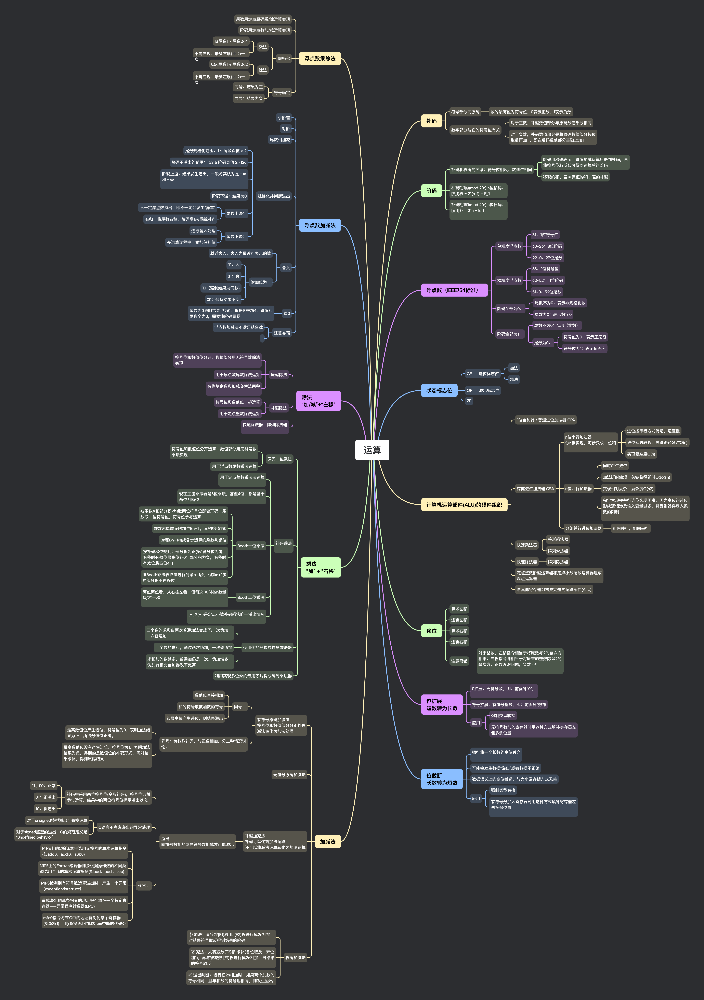

## 思维导图

## 补码

### 符号部分同原码

- 数的最高位为符号位，0 表示正数，1 表示负数

### 数字部分与它的符号位有关

- 对于正数，补码数值部分与原码数值部分相同

- 对于负数，补码数值部分是将原码数值部分按位取反再加 1 ，即在反码数值部分基础上加 1

## 阶码

### 补码和移码的关系：符号位相反、数值位相同

- 阶码用移码表示，阶码加减运算后得到补码，再将符号位取反即可得到运算后的阶码

- 移码的和、差 = 真值的和、差的补码

### 补码 E_1 的(mod 2^n) n 位移码：

[E_1]移 = 2^(n-1) + E_1

### 补码 E_1 的(mod 2^n) n 位补码：

[E_1]补 = 2^n + E_1

## 浮点数（IEEE754 标准）

### 单精度浮点数

- 31：1 位符号位

- 30~23：8 位阶码

- 22~0：23 位尾数

### 双精度浮点数

- 63：1 位符号位

- 62~52：11 位阶码

- 51~0：52 位尾数

### 阶码全部为 0：

- 尾数不为 0：表示非规格化数

- 尾数为 0：表示数字 0

### 阶码全部为 1：

- 尾数不为 0：NaN（非数）

- 尾数为 0：

  - 符号位为 0：表示正无穷

  - 符号位为 1：表示负无穷

## 状态标志位

### CF——进位标志位

- 加法

- 减法

### OF——溢出标志位

### ZF

## 计算机运算部件(ALU)的硬件组织

### 1 位全加器 / 普通进位加法器 CPA

### 存储进位加法器 CSA

- n 位串行加法器
  分 n 步实现，每步只求一位和

  - 进位按串行方式传递，速度慢
  - 进位延时较长，关键路径延时 O(n)
  - 实现复杂度 O(n)

- n 位并行加法器

  - 同时产生进位

  - 加法延时缩短，关键路径延时 O(log n)

  - 实现相对复杂，复杂度 O(n2)

  - 完全大规模并行进位实现困难，因为高位的进位形成逻辑涉及输入变量过多，将受到器件扇入系数的限制

- 分组并行进位加法器

  - 组内并行，组间串行

### 快速乘法器

- 柱形乘法器

- 阵列乘法器

### 快速除法器

- 阵列除法器

### 定点整数阶码运算器和定点小数尾数运算器组成浮点运算器

### 与其他寄存器组构成完整的运算部件(ALU)

## 移位

### 算术左移

### 逻辑左移

### 算术右移

### 逻辑右移

### 注意易错

- 对于整数，左移指令相当于将原数与 2 的幂次方相乘；右移指令则相当于将原来的整数除以 2 的幂次方。正数没啥问题，负数不行！

## 位扩展

短数转为长数

### 0 扩展：无符号数，即：前面补“0”，

### 符号扩展：有符号整数，即：前面补“数符

### 应用

- 强制类型转换

- 无符号数加入寄存器时用这种方式填补寄存器左侧多余位置

## 位截断

长数转为短数

### 强行将一个长数的高位丢弃

### 可能会发生数据“溢出”或者数据不正确

### 数据语义上的高位截断，与大小端存储方式无关

### 应用

- 强制类型转换

- 有符号数加入寄存器时用这种方式填补寄存器左侧多余位置

## 加减法

### 有符号原码加减法

符号位和数值部分分别处理
减法转化为加法处理

- 同号：

  - 数值位直接相加

  - 和的符号取被加数的符号

  - 若最高位产生进位，则结果溢出

- 异号：负数取补码，与正数相加，分二种情况讨论：

  - 最高数值位产生进位，符号位为 0，表明加法结果为正，所得数值位正确。

  - 最高数值位没有产生进位，符号位为 1，表明加法结果为负，得到的是数值位的补码形式，需对结果求补，得到原码结果

### 无符号原码加减法

### 补码加减法

补码可以化简加法运算
还可以将减法运算转化为加法运算

- 溢出
  同符号数相加或异符号数相减才可能溢出

  - 补码中采用两位符号位(变形补码)，符号位仍然参与运算，结果中的两位符号位标示溢出状态

    - 11、00：正常

    - 01：正溢出

    - 10：负溢出

  - C 语言不考虑溢出的异常处理

    - 对于 unsigned 整型溢出：做模运算

    - 对于 signed 整型的溢出，C 的规范定义是“undefined behavior”

  - MIPS：

    - MIPS 上的 C 编译器会选用无符号的算术运算指令(如 addu、addiu、subu)

    - MIPS 上的 Fortran 编译器则会根据操作数的不同类型选用合适的算术运算指令(如 add、addi、sub)

    - MIPS 检测到有符号数运算溢出时，产生一个异常（exception/interrupt）

    - 造成溢出的那条指令的地址被存放在一个特定寄存器——异常程序计数器(EPC)

    - mfc0 指令将 EPC 中的地址复制到某个寄存器($k0/$k1)，用 jr 指令返回到溢出而中断的代码处

### 移码加减法

- ① 加法：直接将[E1]移 和 [E2]移进行模 2n 相加，对结果符号取反得到结果的阶码

- ② 减法：先将减数[E2]移 求补(各位取反，末位加 1)，再与被减数 [E1]移进行模 2n 相加，对结果的符号取反

- ③ 溢出判断：进行模 2n 相加时，如果两个加数的符号相同，且与和数的符号也相同，则发生溢出

## 乘法

“加” + “右移”

### 原码一位乘法

- 符号位和数值位分开运算，数值部分用无符号数乘法实现

- 用于浮点数尾数乘法运算

### 补码乘法

- 用于定点整数乘法法运算

- 现在主流乘法器是 3 位乘法，甚至 4 位，都是基于两位判断位

- Booth 一位乘法

  - 被乘数 A 和部分积 P 均取两位符号位即变形码，乘数取一位符号位，符号位参与运算

  - 乘数末尾增设附加位 Bn+1 ，其初始值为 0

  - Bn 和 Bn+1 构成各步运算的乘数判断位

  - 按补码移位规则：部分积为正(第 1 符号位为 0)，右移时有效位最高位补 0；部分积为负，右移时有效位最高位补 1

  - 按 Booth 乘法表算法进行到第 n+1 步，但第 n+1 步的部分积不再移位

- Booth 二位乘法

  - 两位两位看，从右往左看，但每次[A]补的“数量级”不一样

- (-1)X(-1)是定点小数补码乘法唯一溢出情况

### 使用伪加器构成柱形乘法器

- 三个数的求和由两次普通加法变成了:一次伪加，一次普通加

- 四个数的求和，通过两次伪加，一次普通加

- 求和加的数越多，普通加仍是一次，伪加增多，伪加器相比全加器效率更高

### 利用实现多位乘的专用芯片构成阵列乘法器

## 除法

“加/减”+“左移”

### 原码除法

- 符号位和数值位分开，数值部分用无符号数除法实现

- 用于浮点数尾数除法运算

- 有恢复余数和加减交替法两种

### 补码除法

- 符号位和数值位一起运算

- 用于定点整数除法运算

### 快速除法器：阵列除法器

## 浮点数加减法

### 求阶差

### 对阶

### 尾数相加减

### 规格化并判断溢出

- 尾数规格化范围：1 ≤ 尾数真值 < 2

- 阶码不溢出的范围：127 ≥ 阶码真值 ≥ -126

- 阶码上溢：结果发生溢出，一般将其认为是＋ ∞ 和－∞

- 阶码下溢：结果为 0

- 尾数上溢：

  - 不一定浮点数溢出，即不一定会发生“异常”

  - 右归：将尾数右移，阶码增 1 来重新对齐

- 尾数下溢：

  - 进行舍入处理

  - 在运算过程中，添加保护位

### 舍入

- 就近舍入，舍入为最近可表示的数

- 附加位为：

  - 11：入

  - 01：舍

  - 10（强制结果为偶数)

  - 00：保持结果不变

### 置 0

- 尾数为 0 说明结果也为 0，根据 IEEE754，阶码和尾数全为 0，需要将阶码置零

### 注意易错

- 浮点数加减法不满足结合律

## 浮点数乘除法

### 尾数用定点原码乘/除运算实现

### 阶码用定点数加/减运算实现

### 规格化

- 乘法

  - 1≤ 尾数 1 × 尾数 2<4

  - 不需左规、最多右规(➗2)一次

- 除法

  - 0.5<尾数 1 ÷ 尾数 2<2

  - 不需右规、最多左规(✖️2)一次

### 符号确定

- 同号：结果为正

- 异号：结果为负
