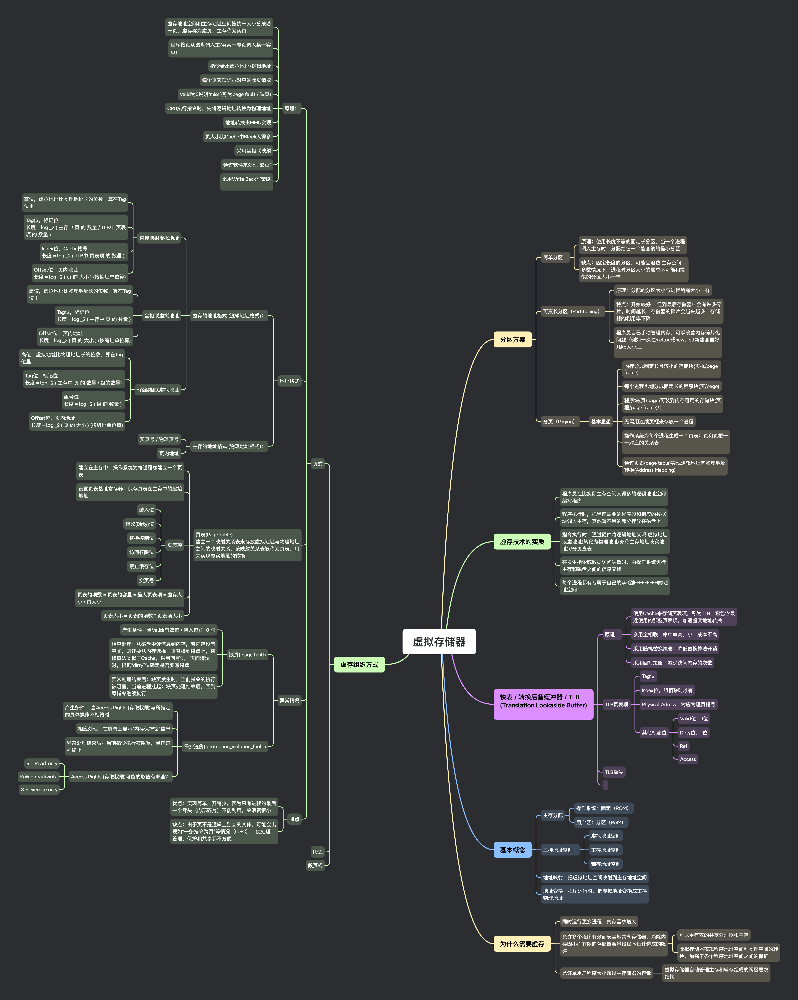

## 思维导图

## 分区方案

### 简单分区：

- 原理：使用长度不等的固定长分区，当一个进程调入主存时，分配给它一个能容纳的最小分区

- 缺点：固定长度的分区，可能会浪费 主存空间。多数情况下，进程对分区大小的需求不可能和提供的分区大小一样

### 可变长分区（Partitioning）

- 原理：分配的分区大小与进程所需大小一样

- 特点：开始较好 ，但到最后存储器中会有许多碎片。时间越长，存储器的碎片会越来越多，存储器的利用率下降

- 程序员自己手动管理内存，可以改善内存碎片化问题（例如一次性 malloc 或 new、stl 新建容器好几 kb 大小......

### 分页（Paging）

- 基本思想

  - 内存分成固定长且较小的存储块(页框/page frame)

  - 每个进程也划分成固定长的程序块(页/page)

  - 程序块(页/page)可装到内存可用的存储块(页框/page frame)中

  - 无需用连续页框来存放一个进程

  - 操作系统为每个进程生成一个页表：页和页框一一对应的关系表

  - 通过页表(page table)实现逻辑地址向物理地址转换(Address Mapping)

## 虚存技术的实质

### 程序员在比实际主存空间大得多的逻辑地址空间编写程序

### 程序执行时，把当前需要的程序段和相应的数据块调入主存，其他暂不用的部分存放在磁盘上

### 指令执行时，通过硬件将逻辑地址(亦称虚拟地址或虚地址)转化为物理地址(亦称主存地址或实地址)//分页查表

### 在发生指令或数据访问失效时，由操作系统进行主存和磁盘之间的信息交换

### 每个进程都有专属于自己的从 0 到 FFFFFFFFH 的地址空间

## 快表 / 转换后备缓冲器 / TLB (Translation Lookaside Buffer)

### 原理：

- 使用 Cache 来存储页表项，称为 TLB，它包含最近使用的那些页表项，加速虚实地址转换

- 多用全相联：命中率高，小、成本不高

- 采用随机替换策略：降低替换算法开销

- 采用回写策略：减少访问内存的次数

### TLB 页表项

- Tag 位

- Index 位，组相联时才有

- Physical Adress，对应物理页框号

- 其他标志位

  - Valid 位，1 位

  - Dirty 位，1 位

  - Ref

  - Access

### TLB 缺失

## 基本概念

### 主存分配

- 操作系统：固定（ROM）

- 用户区：分区（RAM）

### 三种地址空间：

- 虚拟地址空间

- 主存地址空间

- 辅存地址空间

### 地址映射：把虚拟地址空间映射到主存地址空间

### 地址变换：程序运行时，把虚拟地址变换成主存物理地址

## 为什么需要虚存

### 同时运行更多进程，内存需求增大

### 允许多个程序有效而安全地共享存储器，消除内存因小而有限的存储器容量给程序设计造成的障碍

- 可以更有效的共享处理器和主存

- 虚拟存储器实现程序地址空间到物理空间的转换，加强了各个程序地址空间之间的保护

### 允许单用户程序大小超过主存储器的容量

- 虚拟存储器自动管理主存和辅存组成的两级层次结构

## 虚存组织方式

### 页式

- 原理：

  - 虚存地址空间和主存地址空间按统一大小分成若干页，虚存称为虚页，主存称为实页

  - 程序按页从磁盘调入主存(某一虚页调入某一实页)

  - 指令给出虚拟地址/逻辑地址

  - 每个页表项记录对应的虚页情况

  - Valid 为 0 说明“miss”(称为 page fault / 缺页)

  - CPU 执行指令时，先将逻辑地址转换为物理地址

  - 地址转换由 MMU 实现

  - 页大小比 Cache 中 Block 大得多

  - 采用全相联映射

  - 通过软件来处理“缺页”

  - 采用 Write Back 写策略

- 地址格式

  - 虚存的地址格式 (逻辑地址格式)：

    - 直接映射虚拟地址

      - 高位，虚拟地址比物理地址长的位数，算在 Tag 位里

      - Tag 位，标记位
        长度 = log \_2 ( 主存中 页 的 数量 / TLB 中 页表项 的 数量 )

      - Index 位，Cache 槽号
        长度 = log \_2 ( TLB 中 页表项 的 数量 )

      - Offset 位，页内地址
        长度 = log \_2 ( 页 的 大小 ) (按编址单位算)

    - 全相联虚拟地址

      - 高位，虚拟地址比物理地址长的位数，算在 Tag 位里

      - Tag 位，标记位
        长度 = log \_2 ( 主存中 页 的 数量 )

      - Offset 位，页内地址
        长度 = log \_2 ( 页 的 大小 ) (按编址单位算)

    - n 路组相联虚拟地址

      - 高位，虚拟地址比物理地址长的位数，算在 Tag 位里

      - Tag 位，标记位
        长度 = log \_2 ( 主存中 页 的 数量 / 组的数量)

      - 组号位
        长度 = log \_2 ( 组 的 数量 )

      - Offset 位，页内地址
        长度 = log \_2 ( 页 的 大小 ) (按编址单位算)

  - 主存的地址格式 (物理地址格式)：

    - 实页号 / 物理页号

    - 页内地址

- 页表(Page Table)
  建立一个映射关系表来存放虚拟地址与物理地址之间的映射关系，该映射关系表被称为页表，用来实现虚实地址的转换

  - 建立在主存中，操作系统为每道程序建立一个页表

  - 设置页表基址寄存器：保存页表在主存中的起始地址

  - 页表项

    - 装入位

    - 修改(Dirty)位

    - 替换控制位

    - 访问权限位

    - 禁止缓存位

    - 实页号

  - 页表的项数 = 页表的容量 = 最大页表项 = 虚存大小 / 页大小

  - 页表大小 = 页表的项数 \* 页表项大小

- 异常情况

  - 缺页( page fault)

    - 产生条件：当 Valid(有效位 / 装入位)为 0 时

    - 相应处理：从磁盘中读信息到内存，若内存没有空间，则还要从内存选择一页替换到磁盘上，替换算法类似于 Cache，采用回写法，页面淘汰时，根据“dirty”位确定是否要写磁盘

    - 异常处理结束后：缺页发生时，当前指令的执行被阻塞，当前进程挂起；缺页处理结束后，回到原指令继续执行

  - 保护违例( protection_violation_fault )

    - 产生条件： 当 Access Rights (存取权限)与所指定的具体操作不相符时

    - 相应处理：在屏幕上显示“内存保护错”信息

    - 异常处理结束后：当前指令执行被阻塞，当前进程终止

    - Access Rights (存取权限)可能的取值有哪些？

      - R = Read-only

      - R/W = read/write

      - X = execute only

- 特点

  - 优点：实现简单，开销少。因为只有进程的最后一个零头（内部碎片）不能利用，故浪费很小

  - 缺点：由于页不是逻辑上独立的实体，可能会出现如“一条指令跨页”等情况（CISC），使处理、管理、保护和共享都不方便

### 段式

### 段页式
