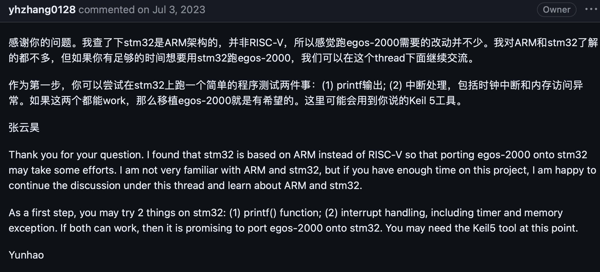
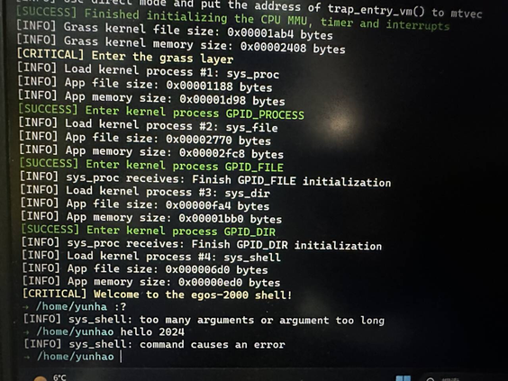

2023 年秋季学期的计算机组成原理实验项目 YatCPU 的实验报告

### YatCPU 相关资料

- YatCPU 的教学[文档](https://yatcpu.sysu.tech)和[仓库](https://github.com/hrpccs/2022-fall-yatcpu-repo)

- 2023 年秋季学期由 Tokisakix 整理的[文档](http://www.tokisakix.cn/2023-Fall-YatCPU-Docs)和[仓库](https://github.com/Tokisakix/2023-fall-yatcpu-repo)，新纳入了 docker 环境搭建脚本、zybo-z710 开发板移植及烧板脚本

### 关于挑战实验

阅读了 egos-2000 操作系统的文档和仓库，按照其教程实现了操作系统映像文件的编译和写入 microSD 卡的过程

但是 egos-2000 操作系统暂时只支持 Arty A7-35T board、A7-100T board 和 S7-50 board，移植到 z710 上比较困难，所以没能成功

关于开发板移植的问题仓库有人咨询过，作者给出的回答也很有参考价值：

目前只成功在 qemu 上运行了 egos-2000 操作系统：

> 我们的板子 z710 上原本有一个 ARM 处理器，在官方网站和文档可以查到官方配套的在 z710 上运行 linux 操作系统的方法和工具。但是这个方法使用的是已有的 ARM 处理器
