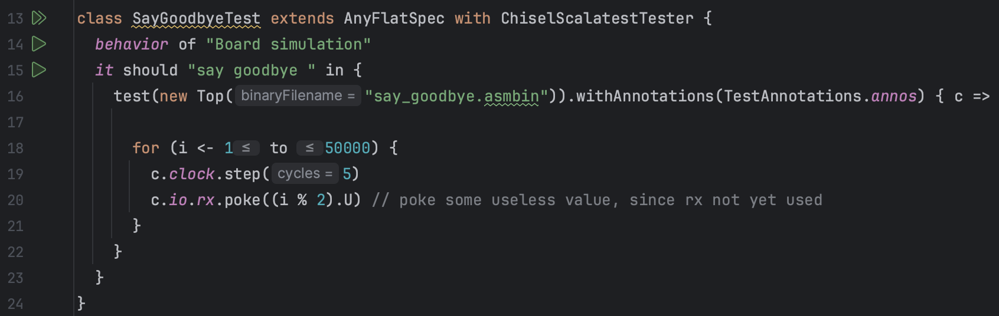
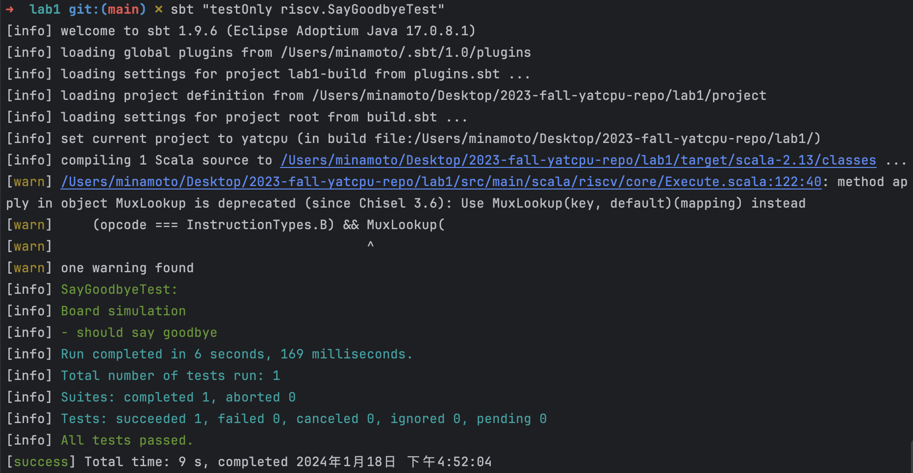
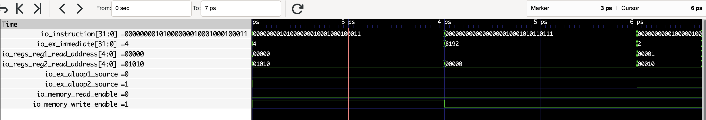
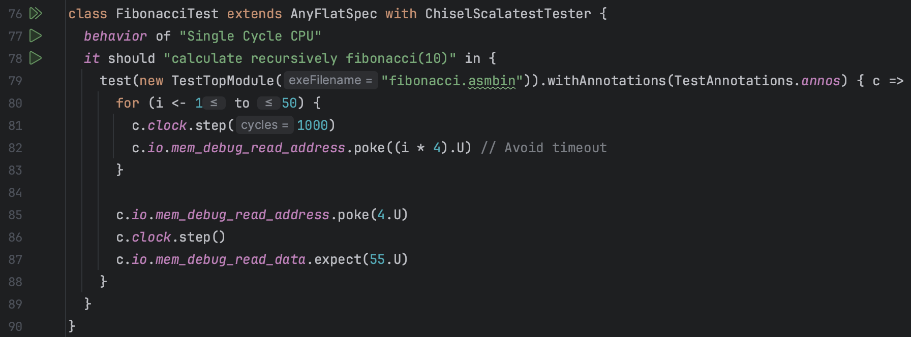
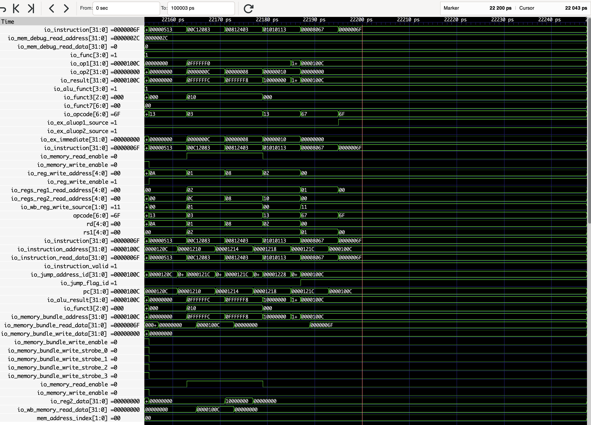
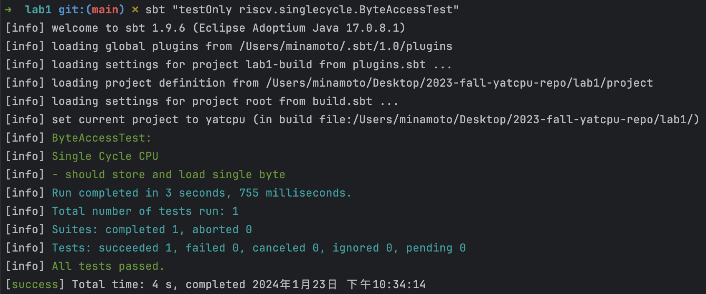

:::primary
[YatCPU](/computer-science/principles-of-computer-composition/yatcpu/yatcpu-report/) - - - [lab1](/computer-science/principles-of-computer-composition/yatcpu/lab-reports/lab1/) - - - [lab2](/computer-science/principles-of-computer-composition/yatcpu/lab-reports/lab2/) - - - [lab3](/computer-science/principles-of-computer-composition/yatcpu/lab-reports/lab3/) - - - [lab4](/computer-science/principles-of-computer-composition/yatcpu/lab-reports/lab4/)
## 测试用例及其波形图分析

### SayGoodbyeTest

src/test/scala/riscv/BoardTest.scala



其中`Top`模块来自：


#### 测试用例的功能

用于烧板验证，但由于 CPU 还未能实现中断，该程序只能通过 LED 灯闪烁判断 CPU 能否正常工作

在 lab1 中该测试用例可以用于检查 CPU 及其内部各个模块、模块内的端口信号是否有完整地实现、初始化，即"Fully initialized"。若有信号定义后没有完整实现，则该项会测试后报错：` Reference xxx is not fully initialized.` 则表明可能该处有代码空缺没有填补完整。

#### 从什么层面测试 CPU

从完整性的层面测试 CPU，CPU 能否正常工作

但测试程序并没有测试 CPU 的正确性，只是进行了`poke`和`step`，没有对任何信号进行`expect`检查。

#### 加载测试程序的方法

利用定义在`ssrc/main/scala/board/z710/Top.scala`中的模块`Top`，用 RISC-V 程序`src/main/resources/say_goodbye.asmbin` 初始化进行仿真

#### 测试用例的执行结果



#### 输出波形图


该测试只向波形文件写入了 Top 模块的信号

#### 执行不同指令时候对应的部件的关键信号的变化情况

由 clock 信号变化可以看出时钟周期为 2 ps

测试中循环执行了 50000 次`step(5)`，即 250000 个时钟周期，输出的波形图总时长为 500001 ps ，除去半个用于 reset 的时钟周期之外恰好 250000 个时钟周期。

可以看到波形图中除了 clock 信号有规律的周期性变化之外， io_rx 也在周期性地在 0 和 1 之间变化。从波形图也可以看出每 10 ps 即 5 个时钟周期 io_rx 变化一次，符合`step(5)`一次`c.io.rx.poke((i % 2).U)`一次的变化规律。

### ExecuteTest

src/test/scala/riscv/singlecycle/ExecuteTest.scala


#### 测试用例的功能

该测试用例用于检查 Execute 模块的正确性，包括：

##### 执行 ALU 加法运算

测试程序循环执行了 100 次两个随机生成的 int 整型操作数 op1 和 op2 的求和运算，检查 R 型指令 add 的正确性。

同时检查跳转信号是否始终保持 0(fasle)，确保 CPU 在非跳转指令下不跳转

##### 处理 beq 指令是否跳转

测试程序按顺序测试了两个情况：

跳转，即 op1 等于 op2 ，此时跳转信号应该为 1(true)，原指令地址(PC):2 应该与立即数 2 相加得到新的指令地址(PC):4

不跳转，即 op1 不等于 op2 ，此时跳转信号应该为 0(false)，指令地址(PC)保持 4 不变

#### 从什么层面测试 CPU

从 CPU 运算处理的层面测试 CPU ，即能否正确控制 ALU 的输入输出，以及输入输出结果对指令跳转的控制

#### 加载测试程序的方法

利用定义在`src/main/scala/riscv/core/Execute.scala` 中的模块`Execute`，不使用任何 RISC-V 程序初始化进行仿真，直接仿真测试

#### 测试用例的执行结果


#### 输出波形图


#### 执行不同指令时候对应的部件的关键信号的变化情况

##### ALU 加法运算

总共执行了 102 个时钟周期，测试了 101 次随机样例(循环从 i=0 到 i=100 执行了 101 次)。


###### io_funct3[2:0]

该信号始终保持 000B 不变，与 io_opcode 一起指示 ALU 执行 R 类型指令 add 的加法运算

###### io_opcode[6:0]

该信号始终保持 0110011B 不变，与 io_funct3 一起指示 ALU 执行 R 类型指令 add 的加法运算


###### io_alu_funct[3:0]

按照`src/main/scala/riscv/core/ALU.scala`定义的 ChiselEnum 枚举类型如下：


由于总共有 11 种取值，默认从 0 开始计数直到 10 ，需要二进制 4 位数才能表示，因此对应的 io_alu_funct 为 4 位二进制数

在加法运算时该信号始终保持 0001B 不变，对应 ChiselEnu 类型定义的 ALUFunctions 中从 0 开始计数的第二个 add，指示 ALU 执行加法运算

###### io_op1[31:0]

该信号来自`c.io.reg1_data.poke(op1.U)`，在 add 指令中 ALU 的运算操作数 op1 来自寄存器，因此 Execute 模块的 io_reg1_data 直接传递给 ALU 模块的 io_op1

每隔一个时钟周期(2 ps)变化一次，每次均为一个新的随机 int 型整数

###### io_op2[31:0]

该信号来自`c.io.reg2_data.poke(op1.U)`，在 add 指令中 ALU 的运算操作数 op2 来自寄存器，因此 Execute 模块的 io_reg2_data 直接传递给 ALU 模块的 io_op2

每隔一个时钟周期(2 ps)变化一次，每次均为一个新的随机 int 型整数

###### io_result[31:0]

每隔一个时钟周期(2 ps)变化一次，每次均为当前 io_op1 与 io_op2 的算术和，同时该值直接传递给 Execute 模块的 mem_alu_result

##### 指令

总共执行 3 个时钟周期，先后测试了成功跳转和不成功跳转两种情况。


###### io_funct3[2:0]

该信号始终保持 000B 不变，与 io_opcode 一起指示 ALU 执行 B 类型指令 beq 的加法运算计算跳转目标地址，以及控制跳转信号 io_if_jump 的产生

###### io_opcode[6:0]

该信号始终保持 1100011B 不变，与 io_funct3 一起指示 ALU 执行 B 类型指令 beq 的加法运算计算跳转目标地址，以及控制跳转信号 io_if_jump 的产生


###### io_reg1_data[31:0]

该信号表示所读取的来自寄存器的数据，在 beq 指令中直接将两个寄存器的值进行比较得到跳转信号 io_if_jump

在测试的后 2 个时钟周期内其值均为 9 ，来自测试程序中的`c.io.reg1_data.poke(9.U)`

###### io_reg2_data[31:0]

该信号表示所读取的来自寄存器的数据，在 beq 指令中直接将两个寄存器的值进行比较得到跳转信号 io_if_jump

在第 2 个时钟周期内其值为 9 ，来自测试程序中的`c.io.reg2_data.poke(9.U)`

在第 3 个时钟周期内其值为 19 ，来自测试程序中的`c.io.reg2_data.poke(19.U)`

###### io_if_jump

该信号表示 PC 下一条指令是否要跳转，是则 io_if_jump = 1 ，否则 io_if_jump = 0

在第 2 个时钟周期其值为 1 ，因为此时 io_reg1_data = 9 = io_reg2_data

在第 3 个时钟周期其值为 0 ，因为此时 io_reg1_data = 9 , io_reg2_data = 19

###### io_alu_funct[3:0]

在 beq 指令中，ALU 执行加法运算，io_alu_funct = 1

###### alu_io_op1[31:0]

由于`c.io.aluop1_source.poke(1.U)`，aluop1_source = 1 指示该信号 alu_io_op1 来自 instruction_address ，同时`c.io.instruction_address.poke(2.U)`，因此 alu_io_op1 = 2

###### alu_io_op2[31:0]

由于`c.io.aluop2_source.poke(1.U)`，aluop2_source = 1 指示该信号 alu_io_op2 来自立即数 io_immediate ，同时`c.io.immediate.poke(2.U)`，因此 alu_io_op2 = 2

###### io_if_jump_address[31:0]

表示跳转成功时 PC 跳转的目标指令地址，在 beq 指令中等于 ALU 计算出来的结果 alu_io_result

在 2 个时钟周期内均为 4 ，即 alu_io_op1 与 alu_io_op2 的和

### InstructionDecoderTest

src/test/scala/riscv/singlecycle/InstructionDecoderTest.scala


#### 测试用例的功能

测试了 InstructionDecode 模块的正确性，包括：

##### S 型指令

测试了对 S 型指令 sw 翻译的正确性，包括读取正确的寄存器并且将正确的操作数传递给 ALU。

在 S 型指令中，存储的数据来自寄存器，存储目标的内存地址由另一寄存器中的数据和指令中的立即数作为偏移量共同决定。

##### lui 指令

测试了对高位加载立即数指令 lui 翻译的正确性，包括读取正确的寄存器并且将正确的操作数传递给 ALU

在 lui 指令中，符号位扩展的 20 位立即数左移 12 位后，将低 12 位置零，传入 ALU，同时 ALU 另一个操作数设置为 0 号寄存器(内容始终为 0)的值，即另一个操作数为 0，ALU 做加法运算，相当于将位扩展后的结果直接作为写入的值，写入目标寄存器中

##### add 指令

测试了对 R 型指令 add 翻译的正确性，主要测试了是否控制选择寄存器作为 ALU 操作数

#### 从什么层面测试 CPU

从指令的翻译、分析层面，指导 CPU 如何根据当前指令进行工作，包括立即数的提取、各个控制信号的取值等

#### 加载测试程序指令的方法

利用定义在`src/main/scala/riscv/core/InstructionDecode.scala`中的模块`InstructionDecode`，不使用任何 RISC-V 程序初始化进行仿真，直接仿真测试

#### 测试用例的执行结果


#### 输出波形图


#### 执行不同指令时候对应的部件的关键信号的变化情况

##### S 型指令

总共执行了一个时钟周期 ( 2 ~ 4 ps )，测试了 S 型指令 sw 在 ID 阶段的信号输出



###### io_instruction[31:0]

该信号直接来自 `c.io.instruction.poke(00a02223L.U)` ，对应二进制码为：0000000 0


###### io_ex_immediate[31:0]

该信号由 io_instruction 的 [11:5] 部分 0000000B 和 [11:7] 部分 00100B 组成 004H ，再位扩展后得到 00000004H = 4，作为立即数传入 ALU

###### io_regs_reg1_read_address[4:0]

该信号来自 io_instruction 的 [19:15] 部分，为 00000B，对应 0 号寄存器

###### io_regs_reg2_read_address[4:0]

该信号来自 io_instruction 的 [24:20] 部分，为 01010B，对应 10 号寄存器

###### io_ex_aluop1_source

在 S 型指令中， io_ex_aluop1_source = 0 ，指示读取寄存器的数据传给 ALU 作为其中一个操作数

###### io_ex_aluop2_source

在 S 型指令中， io_ex_aluop2_source = 1 ，指示将立即数 io_ex_immediate 传给 ALU 作为其中一个操作数

###### io_memory_read_enable

S 型指令没有读取内存，所以 io_memory_read_enable = 0

###### io_memory_write_enable

S 型指令需要写内存，所以 io_memory_write_enable = 1

##### lui 指令

总共执行了一个时钟周期( 4 ~ 6 ps )，测试了 lui 指令在 ID 阶段的信号输出


###### io_instruction[31:0]

该信号直接来自 `c.io.instruction.poke(000022b7L.U)` ，对应二进制码为：00000000000000000010 00101 01


###### io_ex_immediate[31:0]

该信号由 io_instruction 的 [31:12] 部分 00002H 位扩展后得到 00002000H = 2，作为立即数传入 ALU

###### io_reg_write_address[4:0]

该信号来自 io_instruction 的 [11:7] 部分，其值为 00101 ，对应 5 号寄存器，即结果要写入 5 号寄存器

###### io_ex_aluop1_source

在 lui 指令中， io_ex_aluop1_source = 0 ，指示读取寄存器( 0 号寄存器)的数据( 0 )传给 ALU 作为其中一个操作数

###### io_ex_aluop2_source

在 lui 指令中， io_ex_aluop1_source = 1 ，指示将立即数 io_ex_immediate 传给 ALU 作为其中一个操作数

###### io_regs_reg1_read_address[4:0]

在 lui 指令中， 该值被设置为 00000 ，对应 0 号寄存器

###### io_reg_write_enable

在 lui 指令中，需要写入寄存器，所以 io_reg_write_enable = 1

###### io_wb_reg_write_source[1:0]

在 lui 指令中，写入寄存器的值为 ALU 计算结果，所以 io_wb_reg_write_source 的值为 00 ，指示选择 ALU 输出结果作为写入寄存器的数据源

###### io_memory_write_enable

lui 指令没有写内存，所以 io_memory_write_enable = 0 ，避免误写内存

##### 指令

总共执行了一个时钟周期( 4 ~ 6 ps )，测试了 lui 指令在 ID 阶段的信号输出


###### io_instruction[31:0]

该信号直接来自 `c.io.instruction.poke(002081b3L.U)` ，对应二进制码为：= 0000000 00010 00001 000 00011 0110011 B ，其中[6:0] 部分、 [14:12] 部分和 [31:25] 部分一起决定了当前指令为 add 指令；[19:15] 部分和 [24:20] 部分分别为操作数寄存器地址，对应信号 io_regs_reg1_read_address 和 io_regs_reg2_read_address ；[11:7] 部分作为目标寄存器的地址，对应 io_reg_write_address


###### io_reg_write_address[4:0]

该信号来自 io_instruction 的 [11:7] 部分，其值为 00011 ，对应 3 号寄存器，即结果要写入 3 号寄存器

###### io_regs_reg1_read_address[4:0]

该信号来自 io_instruction 的 [19:15] 部分，为 00001B，对应 1 号寄存器

###### io_regs_reg2_read_address[4:0]

该信号来自 io_instruction 的 [24:20] 部分，为 00010B，对应 2 号寄存器

###### io_ex_aluop1_source

在 add 指令中， io_ex_aluop1_source = 0 ，指示读取寄存器的数据传给 ALU 作为其中一个操作数

###### io_ex_aluop2_source

在 add 指令中， io_ex_aluop1_source = 0 ，指示读取寄存器的数据传给 ALU 作为其中一个操作数

###### io_reg_write_enable

在 add 指令中，需要写入寄存器，所以 io_reg_write_enable = 1

###### io_wb_reg_write_source[1:0]

在 add 指令中，写入寄存器的值为 ALU 计算结果，所以 io_wb_reg_write_source 的值为 00 ，指示选择 ALU 输出结果作为写入寄存器的数据源

###### io_memory_write_enable

R 型指令 add 没有写内存，所以 io_memory_write_enable = 0 ，避免误写内存

### InstructionFetchTest

src/test/scala/riscv/singlecycle/InstructionFetchTest.scala


#### 测试用例的功能

模拟了 CPU 执行连续的 100 条随机指令时 InstructionFetch 模块能否正确顺序执行指令或跳转

#### 从什么层面测试 CPU

从指令取指层面测试 CPU 的正确性

#### 加载测试程序指令的方法

利用定义在`src/main/scala/riscv/core/InstructionFetch.scala`中的模块`InstructionFetch`，不使用任何 RISC-V 程序初始化进行仿真，直接仿真测试

#### 测试用例的执行结果


#### 输出波形图


#### 执行不同指令时候对应的部件的关键信号的变化情况

###### 不跳转


此时 io_jump_flag = 0，指示不跳转，pc 的值每隔一个时钟周期( 2 ps )就递增 4 ，指令顺序执行

###### 跳转


io_jump_flag = 1 时指示 pc 跳转，pc 的值在 io_jump_flag = 1 出现后的第二个时钟周期被置为跳转目标地址 io_jump_address_id = 00001000H，实现指令跳转

### RegisterFileTest 1 : read the writing content

src/test/scala/riscv/singlecycle/RegisterFileTest.scala


#### 测试用例的功能

测试了写入寄存器操作的时钟周期内目标寄存器内容的变化，即测试了写寄存器功能的正确性

#### 从什么层面测试 CPU

从寄存器的读写层面测试了 CPU ，测试了寄存器模块

#### 加载测试程序指令的方法

利用定义在`src/main/scala/riscv/core/RegisterFile.scala`中的模块`RegisterFile`，不使用任何 RISC-V 程序初始化进行仿真，直接仿真测试

#### 测试用例的执行结果


#### 输出波形图


#### 执行不同指令时候对应的部件的关键信号的变化情况

测试总共执行了 2 个时钟周期，第 1 个时钟周期内检测了 2 号寄存器内的值是否为 0 ，即是否为初始状态，同时测试程序模拟了一次写寄存器操作，向 2 号寄存器写入数据 DEADBEEFLH 。在第 2 个时钟周期再次检测 2 号寄存器的值，看其内容是否已经变为写入的数据。在这个过程中始终检测读取 2 号寄存器，所以信号 io_read_address 的内容始终为 2 ；第 1 个时钟周期模拟写入 2 号寄存器的过程，第 2 个时钟周期没有再写入过，所以信号 io_write_address 的内容始终为 2 且 io_write_data 的内容始终为 DEADBEEFLH ；在写寄存器操作后的下一个时钟周期上升沿到来时 register_2[31:0] 的内容变为 DEADBEEFLH ，表明写寄存器操作正确执行；io_read_data_1[31:0] 的值在第 2 个时钟周期上升沿到来前为 0 ，在第 2 个时钟周期上升沿到来时变为 DEADBEEFLH

### RegisterFileTest 2 : read the written content

src/test/scala/riscv/singlecycle/RegisterFileTest.scala


#### 测试用例的功能

测试了写入寄存器操作后的下一个时钟周期能否在目标寄存器读出写入的数据，即测试了写寄存器功能的正确性

#### 从什么层面测试 CPU

从寄存器的读写层面测试了 CPU ，测试了寄存器模块

#### 加载测试程序指令的方法

利用定义在`src/main/scala/riscv/core/RegisterFile.scala`中的模块`RegisterFile`，不使用任何 RISC-V 程序初始化进行仿真，直接仿真测试

#### 测试用例的执行结果


#### 输出波形图


#### 执行不同指令时候对应的部件的关键信号的变化情况

测试执行了一个时钟周期，测试程序在一个 timescope 内模拟了一次写入寄存器的操作，将数据 DEADBEEFLH 写入 1 号寄存器，这个过程将 io_write_enable 打开；将 io_write_address 赋值为 1 ，即写入 1 号寄存器；将 io_write_data 赋值为 DEADBEEFLH 。然后在下一个时钟周期模拟测试了能否从 1 号寄存器读出正确的数据，这个测试过程由于没有 `clock.step()` 所以没有显示在波形图中。但在波形图中可以看到第一个时钟周期后在下一个时钟上升沿到来之前，1 号寄存器的内容 register_1[31:0] 以及变为了 DEADBEEFLH ，表明写入寄存器操作正确执行。

### RegisterFileTest 3 : x0 always be zero

src/test/scala/riscv/singlecycle/RegisterFileTest.scala


#### 测试用例的功能

测试了写入 0 号寄存器后 0 号寄存器的内容是否保持 0 不变

#### 从什么层面测试 CPU

从寄存器的读写层面测试了 CPU ，测试了寄存器模块

#### 加载测试程序指令的方法

利用定义在`src/main/scala/riscv/core/RegisterFile.scala`中的模块`RegisterFile`，不使用任何 RISC-V 程序初始化进行仿真，直接仿真测试

#### 测试用例的执行结果


#### 输出波形图


#### 执行不同指令时候对应的部件的关键信号的变化情况

测试总共执行了一个时钟周期，模拟了将写入目标寄存器设置为 0 号寄存器 x0 时的写寄存器操作。io_write_address = 0 ，表示写入 0 号寄存器；io_write_data = DEADBEEFH ，输入为要写入的数据；io_write_enable = 1 ，打开寄存器写使能；register_0 = 0 始终不变，表明测试成功，0 号寄存器的内容没有被改变始终为 0

### FibonacciTest

src/test/scala/riscv/singlecycle/CPUTest.scala



csrc/fibonacci.c


#### 测试用例的功能

测试了利用递归方法计算斐波那契数列第 10 项的程序能否在 CPU 上正常执行，并计算出结果存储到内存目标地址上

#### 从什么层面测试 CPU

从最终完整执行一个程序的层面测试 CPU ，包括除了中断处理、与外设通信以外的所有 CPU 功能

#### 加载测试程序指令的方法

利用定义在`src/test/scala/riscv/singlecycle/CPUTest.scala`中的模块`TestTopModule ，模拟一个简单的计算机，连接了 CPU 、Memory、InstructionRom 、ROMLoader几个模块。用 RISC-V 程序`src/main/resources/fibonacci.asmbin``` 初始化 instruction_rom 模块作为运行程序进行仿真

#### 测试用例的执行结果


#### 输出波形图


#### 执行不同指令时候对应的部件的关键信号的变化情况

##### 程序指令的执行

为了保证程序完整执行完毕，测试程序循环执行了 50 次 `c.clock.step(1000)` ，总共执行了 50000 个时钟周期。其中大约前 20 ns 的时间内 CPU 各个信号不断变化，表明程序在执行。此后所有信号稳定，表明程序执行已经结束。




从第 279 ps 开始 CPU 的信号开始发生变化，计算斐波那契数列的程序开始执行，到 22299 ps 为止 CPU 的所以信号稳定，表明 CPU 已经执行完毕。

在执行过程中可以看到 io_instruction 信号以 8 ps 为周期变化一次，即 CPU 周期为 8 ps ，相当于 4 个时钟周期。


寄存器信号中可以发现，在程序运行过程中只有 1、2、8、10、11 号寄存器不断发生变化，也即程序只使用了除 0 号寄存器以外 5 个寄存器。

##### 程序结果的检测

在 csrc/fibonacci.c 程序中可以看到，最终计算结果为斐波那契数列第 10 项，结果存储在地址为 4 的内存空间里。程序结果的检测执行了一个时钟周期


###### io_mem_debug_read_address[31:0]

该信号直接来自`c.io.mem_debug_read_address.poke(4.U)` ，表示检测读取的内存地址为 4

###### io_mem_debug_read_data[31:0]

一个时钟周期后读取内存地址为 4 的内容得到该信号的值为 00000037H = 55 ，表明程序结果正确

### QuicksortTest

src/test/scala/riscv/singlecycle/CPUTest.scala


csrc/quicksort.c


#### 测试用例的功能

测试程序给出了一个由 10 个阿拉伯数字组成的数组：`{6,2,4,5,3,1,0,9,7,8}` ，利用递归实现的 quicksort 函数对该数组进行排序，检测是否得到一个正确的有序数组

#### 从什么层面测试 CPU

从最终完整执行一个程序的层面测试 CPU ，包括除了中断处理、与外设通信以外的所有 CPU 功能

#### 加载测试程序指令的方法

利用定义在`src/test/scala/riscv/singlecycle/CPUTest.scala`中的模块`TestTopModule` ，模拟一个简单的计算机，连接了 CPU 、Memory、InstructionRom 、ROMLoader 几个模块。用 RISC-V 程序`src/main/resources/quicksort.asmbin` 初始化进行仿真

#### 测试用例的执行结果


#### 输出波形图


#### 执行不同指令时候对应的部件的关键信号的变化情况

##### 程序指令的执行

为了保证程序完整执行完毕，测试程序循环执行了 50 次 `c.clock.step(1000)` ，总共执行了 50000 个时钟周期。其中大约前 15 ns 的时间内 CPU 各个信号不断变化，表明程序在执行。此后所有信号稳定，表明程序执行已经结束。


从第 525 ps 开始 CPU 的信号开始发生变化，快排程序开始执行，到 13931 ps 为止 CPU 的所以信号稳定，表明 CPU 已经执行完毕。

在执行过程中可以看到 io_instruction 信号以 8 ps 为周期变化一次，即 CPU 周期为 8 ps ，相当于 4 个时钟周期。


寄存器信号中可以发现，在程序运行过程中只有 1、2、8、10、11 、12 号寄存器不断发生变化，也即程序只使用了除 0 号寄存器以外 6 个寄存器。其中 1、2、8、12 号寄存器的变化呈现较同步的规律，说明这 4 个寄存器中的数据与递归有关；而 10、11 号寄存器的内容总是在频繁变化，说明这两个寄存器主要用来存储 ALU 运算的操作数

##### 程序结果的检测

在 csrc/quicksort.c 程序中可以看到，排列得到的结果，结果存储在起始地址为 4 ，长度为 10 个 int 类型大小的内存空间里。程序结果的检测执行了 10 个时钟周期，利用循环程序对检测的内存地址递增，逐个访问目标内存，看所存储的内容是否上是从 0 到 9 的升序排列数组


###### io_mem_debug_read_address[31:0]

该信号直接来自`c.io.mem_debug_read_address.poke((4*i).U)` ，`i` 从 1 到 10 递增，`4*i`从 4 到 40 变化，即检测读取的内存地址从 00000004H 到 00000028H 变化

###### io_mem_debug_read_data[31:0]

内存地址从 00000004H 到 00000028H 变化的同时 io_mem_debug_read_data 读取内存的内容也从 0 到 9 变化，表明程序结果正确

### ByteAccessTest

src/test/scala/riscv/singlecycle/CPUTest.scala


csrc/sb.S


#### 测试用例的功能

在 RISCV 手册第 30 页可以查到寄存器编号即助记名如下：


对测试使用的 RISCV 汇编代码具体解释如下：

```shell RISCV汇编
.globl _start 			;声明_start为全局符号
	_start:         	;程序从这里开始执行
	li a0, 0x4      	;将立即数 0x4 加载到寄存器 a0 (x10) 中
	li t0, 0xDEADBEEF ;将立即数 0xDEADBEEF 加载到寄存器 t0(x5) 中
	sb t0, 0(a0)    	;将寄存器 t0(x5) 的值存储到地址为 a0(x10) 的内存位置中
	lw t1, 0(a0)    	;将地址为 a0(x10) 的内存位置中的值加载到寄存器 t1(x6) 中
	li s2, 0x15    		;将立即数 0x15 加载到寄存器 s2(x18) 中
	sb s2, 1(a0)   		;将寄存器 s2(x18) 的值存储到地址为 (a0+1) 的内存位置中
	lw ra, 0(a0)    	;将地址为 a0(x10) 的内存位置中的值加载到寄存器 ra(x1) 中
loop:           		;循环的标签
	j loop          	;无条件地跳转到标签 loop，实现无限循环
```

#### 从什么层面测试 CPU

从指令的层面测试 CPU ，测试了 CPU 对若干连续的 S 型和 L 型指令能否正确执行。主要检测了执行指令读写寄存器功能是否正确

#### 加载测试程序指令的方法

利用定义在`src/test/scala/riscv/singlecycle/CPUTest.scala`中的模块`TestTopModule`，模拟一个简单的计算机，连接了 CPU 、Memory、InstructionRom 、ROMLoader 几个模块。用 RISC-V 程序`src/main/resources/sb.asmbin` 初始化进行仿真

#### 测试用例的执行结果



#### 输出波形图


#### 执行不同指令时候对应的部件的关键信号的变化情况

上图中可以看到有 5 个寄存器的值发生了变化：

register_10[31:0] 即 10 号寄存器 x10 或 a0 ，由`li a0, 0x4` 赋值后信号稳定为 4

register_5[31:0] 即 5 号寄存器 x5 或 t0 ，由`li t0, 0xDEADBEEF` 赋值时，由于寄存器写使能信号 io_reg_write_enable 此时仍保持打开的，因为上一条指令`li a0, 0x4` 执行时也打开了寄存器写使能，所以此时写入目标寄存器 5 号寄存器的内容出现了毛刺 DEADC000H ，但在下一个时钟周期恢复正确值 DEADBEEFH 并稳定

register_6[31:0] 即 6 号寄存器 x6 或 t1 ，由`lw t1, 0(a0)` 赋值后信号稳定。内存地址 DEADBEEFH 的内容由`sb t0, 0(a0) ` 赋值，而 sb 指令存储时只存低位字节，且 RISCV 为小端存储模式，所以存入内存的只有 EFH ，读取内存时 EFH 即为最低位字节，存到 6 号寄存器的内容为 000000EFH

register_18[31:0] 即 18 号寄存器 x18 或 s2 ，由`li s2, 0x15 ` 赋值后信号稳定为 15H

register_1[31:0] 即 1 号寄存器 x1 或 ra，由`lw ra, 0(a0)` 赋值后信号稳定。内存地址 DEADBEEFH 的内容原本只有只有 EFH ，sb s2, 1(a0) 再次对该地址赋值，而 sb 指令存储时只存低位字节，按照 RISCV 的小端存储模式，此时存入内存的只有 15H ，且存到 DEADBEEFH +1 的地址，即存到 EFH 的下一个地址。读取内存时字节从低到高为 EFH、15H ，存到 1 号寄存器的内容为 000015EFH

测试程序检测了 ，与波形图对应寄存器内容的信号最后稳定的值相同，表明指令正确执行

## 填空涉及到的信号分析

(src/main/scala/riscv/)

### core/InstructionFetch.scala

#### io.jump_flag_id

该控制信号告诉 CPU 取指阶段下一条指令是否需要跳转，如果是则将 PC 设置为跳转目标指令地址，否则 PC+4，下一个时钟周期顺序读取下一条指令

### core/InstructionDecode.scala

#### io.ex_aluop2_source

改控制信号控制 ALU 输入端的第二个输入源，分别有以下两种：


ALUOp2Source.Immediate:
将 io.ex_aluop2_source 设置为该值后 ALU 输入端端第二个输入源是来自指令的立即数

ALUOp2Source.Register:
将 io.ex_aluop2_source 设置为该值后 ALU 输入端端第二个输入源是读取寄存器得到的数据


根据以上 RISC-V 手册第 25 页指令译码过程可以知道，需要使用到立即数的指令有：

- U 型指令
  - lui
  - auipc
- J 型指令
  - jal
  - jalr
- I 型指令
- L 型指令
- B 型指令
- 其他
  - fence 同步内存和 I/O
  - CSR 型指令
  - nop 伪指令

因此当执行上述指令时，将 io.ex_aluop2_source 设置为 ALUOp2Source.Immediate

#### io.memory_read_enable

RISCV 中只有 L 型指令需要读取内存，所以执行 L 型指令时将 io.memory_read_enable 设置为 1，否则均设置为 0

#### io.memory_write_enable

RISCV 中只有 S 型指令需要写内存，所以执行 S 型指令时将 io.memory_write_enable 设置为 1，否则均设置为 0

#### io.wb_reg_write_source

查阅手册各个指令的功能可知，需要写回寄存器的指令及其对应写入数据源如下：

- R 型指令：ALU 计算结果
- U 型指令
  - lui：ALU 计算结果
  - auipc：ALU 计算结果
- I 型指令：ALU 计算结果
- L 型指令：内存
- 其他
  - nop 伪指令：ALU 计算结果

不考虑中断的 CSR 作为写入数据源，其余指令均可设置 io.wb_reg_write_source 为 NextInstructionAddress (作为默认值)

### core/Execute.scala

#### alu.io.func

该信号传给 ALU ，决定 ALU 执行何种运算，实际上该信号的取值为`src/main/scala/riscv/core/ALU.scala`定义的 ChiselEnum 枚举类型，在 “ alu.io.func

#### alu.io.op1

该信号传给 ALU，决定 ALU 的第一个操作数的数据源为 PC 还是寄存器。其控制已在 InstructionDecode 模块实现，其传入 Execute 模块的信号为 io.aluop1_source ，根据该信号即可确定 alu.io.op1

#### alu.io.op2

该信号传给 ALU，决定 ALU 的第一个操作数的数据源为立即数还是寄存器。其控制已在 InstructionDecode 模块实现，其传入 Execute 模块的信号为 io.aluop2_source ，根据该信号即可确定 alu.io.op2

### core/CPU.scala

所填代码主要涉及传递给 Execute 模块的信号，各个赋值语句对应了连线图的控制信号连线、模块之间的端口的连接

#### ex.io.instruction := inst_fetch.io.instruction

取指阶段得到的指令传递给 Execute 模块

#### ex.io.instruction_address := inst_fetch.io.instruction_address

取指阶段得到的指令地址传递给 Execute 模块

#### ex.io.reg1_data := regs.io.read_data1

寄存器组将读取的第 1 个数据传递给 Execute 模块

#### ex.io.reg2_data := regs.io.read_data2

寄存器组将读取的第 2 个数据传递给 Execute 模块

#### ex.io.immediate := id.io.ex_immediate

译码阶段得到的立即数传递给 Execute 模块

#### ex.io.aluop1_source := id.io.ex_aluop1_source

译码阶段得到的 ALU 第 1 个操作数的数据源的控制信号传递给 Execute 模块

#### ex.io.aluop2_source := id.io.ex_aluop2_source

译码阶段得到的 ALU 第 2 个操作数的数据源的控制信号传递给 Execute 模块

## 在完成实验的过程中，遇到的关于实验指导不明确或者其他问题，或者改进的建议。

~~使用实验板上的数码管、视频输出等外设，输出一个完整程序的运行结果，或者参考硬件调试一节的内容，用硬件波形的方法捕获程序运行结果。给出你的 CPU 可以正确在实验板上运行程序的照片或者硬件调试器波形截图。~~
