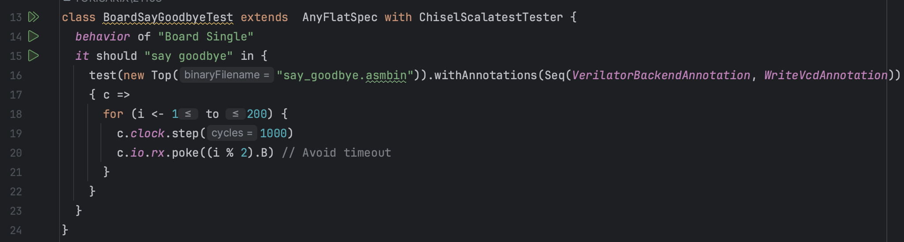
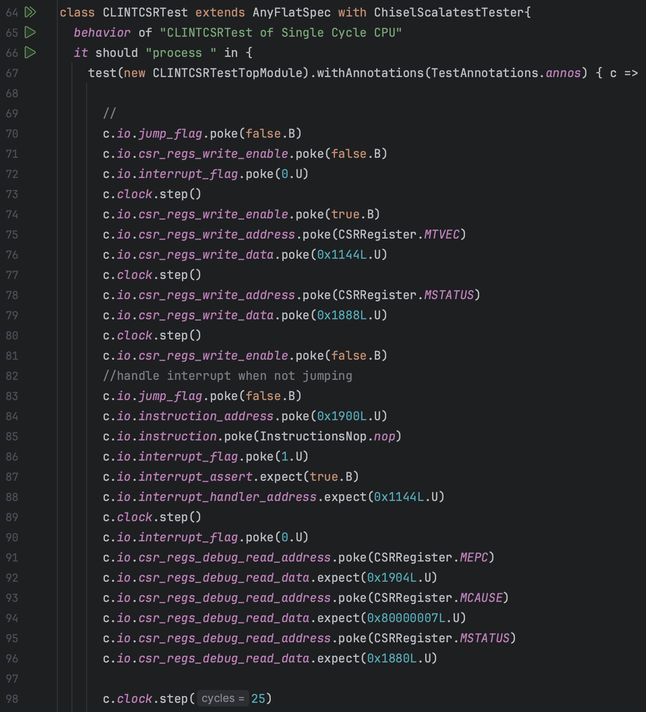
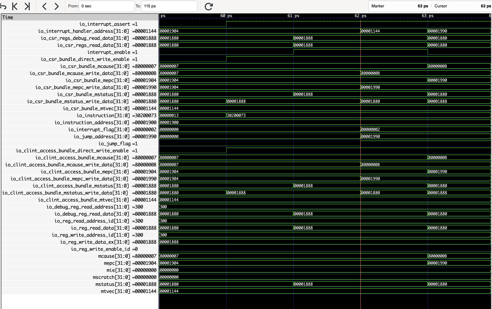
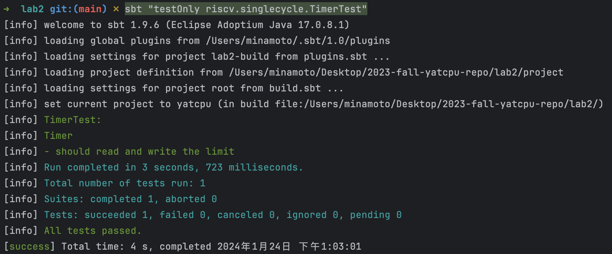

:::primary
[YatCPU](/computer-science/principles-of-computer-composition/yatcpu/yatcpu-report/) - - - [lab1](/computer-science/principles-of-computer-composition/yatcpu/lab-reports/lab1/) - - - [lab2](/computer-science/principles-of-computer-composition/yatcpu/lab-reports/lab2/) - - - [lab3](/computer-science/principles-of-computer-composition/yatcpu/lab-reports/lab3/) - - - [lab4](/computer-science/principles-of-computer-composition/yatcpu/lab-reports/lab4/)
## 测试用例及其波形图分析

### BoardSayGoodbyeTest

src/test/scala/riscv/BoardTest.scala

其中`Top`模块来自：

测试执行程序来自 csrc/say_goodbye.c ：

#### 测试用例的功能

测试能否正常执行打印 "Never gonna give you up~ Never gonna let you down~\nNever gonna run around and~ desert you~" ，用于烧板后测试能否实现打印，即测试 CPU 包括 lab1 的功能以及能否实现中断处理

#### 从什么层面测试 CPU

从完整性的层面测试 CPU ，若 CPU 可以打印，说明 CPU 具备了中断处理的能力

但并没有测试 CPU 的正确性，只是进行了`poke`和`step`，但没有对任何信号进行`expect`检查。实际验证需要烧板手动测试能否打印。

#### 加载测试程序的方法

利用定义在`src/main/scala/board/z710/Top.scala`中的模块`Top`，用 RISC-V 程序`src/main/resources/say_goodbye.asmbin` 初始化进行仿真

#### 测试用例的执行结果

#### 输出波形图

#### 执行不同指令时候对应的部件的关键信号的变化情况

由 clock 信号变化可以看出时钟周期为 2 ps

测试中循环执行了 200 次`step(1000)`，即 200000 个时钟周期，输出的波形图总时长为 400001 ps ，除去半个用于 reset 的时钟周期之外恰好 200000 个时钟周期。

波形图中 CPU 内信号一直在不断变化，且按照一定序列无限循环周期变化，说明程序进入了死循环

Timer 模块中的 count 不断自增，但到仿真结束为止页没达到 limit 信号的值 05F5E100H ，所以一直没有进入中断

### ExecuteTest

src/test/scala/riscv/singlecycle/ExecuteTest.scala

#### 测试用例的功能

该测试用例用于检查 Execute 模块的正确性，包括：

##### 执行 csrrci 指令

测试指令 csrci ，即立即数读后清除控制状态寄存器 ( csr ) 指令，测试其是否将控制状态寄存器 csr 的值与按位取反后的 5 位的零扩展立即数 zimm 按位与的结果写入 csr

##### 执行 csrrsi 指令

测试指令 csrrsi ，即立即数读后设置控制状态寄存器 ( csr ) 指令，测试其是否将控制状态寄存器 csr 的值与 5 位的零扩展立即数 zimm 按位或的结果写入 csr

##### 执行 csrrw 指令

测试指令 csrrw ，即读后写控制状态寄存器 ( csr ) 指令，测试其是否将对应寄存器中的值写入 csr

##### 执行 csrrs 指令

测试指令 csrrs ，即读后置位控制状态寄存器 ( csr ) 指令，测试其是否将控制状态寄存器 csr 的值与对应寄存器中的值按位或的结果写入 csr

#### 从什么层面测试 CPU

从 CPU 执行处理层面测试了 CPU，主要测试这个阶段对中断相关的 csr 指令的执行处理

#### 加载测试程序的方法

利用定义在`src/main/scala/riscv/core/Execute.scala` 中的模块`Execute`，不使用任何 RISC-V 程序初始化进行仿真，直接仿真测试

#### 测试用例的执行结果

#### 输出波形图

#### 执行不同指令时候对应的部件的关键信号的变化情况

测试主要使用了下图中的指令：

##### 指令

测试执行了 1 个时钟周期

###### io_funct3[2:0]

该信号为 111B ，与 io_opcode 一起指示 ALU 执行 CPU 执行 csr 类型指令 csrrci

###### io_opcode[6:0]

该信号为 1110011B ，与 io_funct3 一起指示 CPU 执行 csr 类型指令 csrrci

###### zimm[31:0]

零扩展的 5 位立即数，来自指令，值为 8

###### io_reg1_data[31:0]

从寄存器读取的值，直接来自 `c.io.reg1_data.poke(0x1880L.U)` ，值为 1880H

###### io_csr_reg_read_data[31:0]

从 csr 寄存器读取的值，直接来自 `c.io.csr_reg_data.poke(0x1888L.U)` ，值为 1888H

###### io_csr_reg_write_data[31:0]

写入 csr 寄存器的值，在 csrrci 指令中该值等于 io_csr_reg_read_data & ~zimm ，结果为 1880H ，与波形图结果一致，说明执行正确

##### 指令

测试执行了 1 个时钟周期

###### io_funct3[2:0]

该信号为 110B ，与 io_opcode 一起指示 ALU 执行 CPU 执行 csr 类型指令 csrrsi

###### io_opcode[6:0]

该信号为 1110011B ，与 io_funct3 一起指示 CPU 执行 csr 类型指令 csrrsi

###### zimm[31:0]

零扩展的 5 位立即数，来自指令，值为 8

###### io_reg1_data[31:0]

从寄存器读取的值，直接来自 `c.io.reg1_data.poke(0x1880L.U)` ，值为 1880H

###### io_csr_reg_read_data[31:0]

从 csr 寄存器读取的值，直接来自 `c.io.csr_reg_data.poke(0x1880L.U)` ，值为 1880H

###### io_csr_reg_write_data[31:0]

写入 csr 寄存器的值，在 csrrsi 指令中该值等于 io_csr_reg_read_data | zimm ，结果为 1880H ，与波形图结果一致，说明执行正确

##### 指令

测试执行了 1 个时钟周期

###### io_funct3[2:0]

该信号为 001B ，与 io_opcode 一起指示 ALU 执行 CPU 执行 csr 类型指令 csrrsw

###### io_opcode[6:0]

该信号为 1110011B ，与 io_funct3 一起指示 CPU 执行 csr 类型指令 csrrsw

###### zimm[31:0]

零扩展的 5 位立即数，来自指令，值为 AH

###### io_reg1_data[31:0]

从寄存器读取的值，直接来自 `c.io.reg1_data.poke(0x1888L.U)` ，值为 1888H

###### io_csr_reg_read_data[31:0]

从 csr 寄存器读取的值，直接来自 `c.io.csr_reg_data.poke(0.U)` ，值为 0

###### io_csr_reg_write_data[31:0]

写入 csr 寄存器的值，在 csrrsi 指令中该值等于 io_reg1_data ，结果为 1888H ，与波形图结果一致，说明执行正确

##### 指令

测试执行了 1 个时钟周期

###### io_funct3[2:0]

该信号为 010B ，与 io_opcode 一起指示 ALU 执行 CPU 执行 csr 类型指令 csrrs

###### io_opcode[6:0]

该信号为 1110011B ，与 io_funct3 一起指示 CPU 执行 csr 类型指令 csrrs

###### zimm[31:0]

零扩展的 5 位立即数，来自指令，值为 0

###### io_reg1_data[31:0]

从寄存器读取的值，直接来自 `c.io.reg1_data.poke(0.U)` ，值为 0

###### io_csr_reg_read_data[31:0]

从 csr 寄存器读取的值，直接来自 `c.io.csr_reg_data.poke(0x1888L.U)` ，值为 1888H

###### io_csr_reg_write_data[31:0]

写入 csr 寄存器的值，在 csrrs 指令中该值等于 io_csr_reg_read_data | io_reg1_data ，结果为 1888H ，与波形图结果一致，说明执行正确

### CLINTCSRTest

src/test/scala/riscv/singlecycle/CLINTCSRTest.scala

#### 测试用例的功能

测试了 CLINT 模块和 CSR 模块的正确性，测试了以下几种情况：

##### 无跳转的情况下处理中断请求

此时应该进入中断：

- 将 PC 设为中断处理程序入口
- 写入 CSR 寄存器
  - 将 MIE 置 0
  - 将 PC 的值存入 MEPC ，实际上为中断发生的指令的下一条指令的地址
  - 写入恰当的中断原因存入 MCAUSE

##### 跳转的情况下处理中断请求

此时应该进入中断，处理与上一种情况相同，但是存入 MEPC 的值不是 PC 而是跳转目标地址

##### 退出中断

- 将 PC 设为 MEPC
- 写入 CSR 寄存器
  - 将 MIE 置为 MPIE

##### 不响应中断

当 MPIE 位为 0 时，禁用中断

#### 从什么层面测试 CPU

从中断处理层面测试，主要测试对不同情况 CPU 能否正确决定是否响应中断、响应中断时是否正确处理中断、能否正确退出中断

#### 加载测试程序指令的方法

利用定义在`src/main/scala/riscv/core/CLINT.scala`中的模块 CLINT 和定义在`src/main/scala/riscv/core/CSR.scala`中的模块 CSR ，不使用任何 RISC-V 程序初始化进行仿真，直接仿真测试

#### 测试用例的执行结果

#### 输出波形图

#### 执行不同指令时候对应的部件的关键信号的变化情况

##### 无跳转的情况下处理中断请求

###### io_interrupt_assert

该信号决定 PC 是否跳转，在输入的 interrupt_flag 信号拉高的同时也拉高，表示进入中断，跳转到中断处理程序

###### io_interrupt_handler_address[31:0]

该信号在输入的 interrupt_flag 信号拉高的同时变为 00001144H ，表示中断处理程序入口地址，从下一条指令开始进入中断

###### mepc[31:0]

该信号在进入中断后的下一时钟周期变为 1904H ，等于原 PC 值 1900H + 4 ，表示原本 PC 所在指令的下一条指令地址

###### mcause[31:0]

该信号主要由引起中断的 io.interrupt_flag 信号决定，在进入中断后的下一时钟周期变为 80000007H ，表示 timer 引起中断

###### mstatus[31:0]

该信号在进入中断后的下一时钟周期由 00001888H 变为 00001880H ，表示 MPIE 被置 0 ，禁用中断

##### 退出中断

###### io_interrupt_assert

该信号决定 PC 是否跳转，在输入的 io_instruction 变为 30200073H 的同时拉高，即遇到 mret 信号拉高，表示退出中断，跳转到中断前原程序

###### io_interrupt_handler_address[31:0]

该信号在退出中断的同时保持 00001904H 不变，为 PC 跳转提供目标地址

###### mstatus[31:0]

该信号在退出中断后的下一时钟周期由 00001880H 变为 00001888H ，表示 MPIE 被置 1 ，启用中断

##### 跳转的情况下处理中断请求

###### io_interrupt_assert

在输入的 interrupt_flag 信号拉高的同时也高，表示进入中断，跳转到中断处理程序

由于上一个时钟周期控制器在退出中断，所以上一个时钟周期 PC 也发生跳转，该信号也为 1 ，所以波形图中表现为连续高电位

###### io_interrupt_handler_address[31:0]

该信号在输入的 interrupt_flag 信号拉高的同时变为 00001144H ，表示中断处理程序入口地址，从下一条指令开始进入中断

###### mepc[31:0]

该信号在进入中断后的下一时钟周期变为 1990H ，等于原跳转指令对应的跳转目标地址，表示原本 PC 所在指令所要跳转的指令地址

###### mcause[31:0]

该信号主要由引起中断的 io.interrupt_flag 信号决定，在进入中断后的下一时钟周期变为 8000000BH ，表示外部引起中断

###### mstatus[31:0]

该信号在进入中断后的下一时钟周期由 00001888H 变为 00001880H ，表示 MPIE 被置 0 ，禁用中断

##### 退出中断

再次退出中断，与 情况一致

##### 不响应中断

原本测试程序无法显示该处波形，需要加一条`c.clock.step()` 才能显示出波形

###### io_clint_access_bundle_mstatus[31:0]

该信号由` c.io.csr_regs_write_data.poke(0x1880L.U)` 输入，表示写入 mstatus 的值。其中低位第三位为 0 ，即 MPIE = 0 ，禁用中断

###### interrupt_enable

在输入的 io_clint_access_bundle_mstatus 信号变为 1880H 的同时拉低，表示禁用中断

###### io_interrupt_flag[31:0]

由输入`c.io.interrupt_flag.poke(1.U)` 拉高该信号，表示中断请求

###### io_interrupt_assert

io_interrupt_flag 拉高的同时，该信号为低电位，表示拒绝中断请求

### TimerTest

src/test/scala/riscv/singlecycle/TimerTest.scala

#### 测试用例的功能

测试了 Timer 模块能否正确处理信号

##### 写 limit

检测 Timer 模块能否实现正确的写入到 limit 变量操作

##### 写 enabled

检测 Timer 模块能否实现正确的写入到 enabled 变量操作，以及根据变量输出正确的中断信号

#### 从什么层面测试 CPU

从外围设备层面测试 CPU 的正确性，准确来说测试 peripheral 设备 Timer 的正确性

#### 加载测试程序指令的方法

利用定义在`src/main/scala/riscv/core/peripheral/Timer.scala`中的模块 Timer，不使用任何 RISC-V 程序初始化进行仿真，直接仿真测试

#### 测试用例的执行结果

#### 输出波形图

#### 执行不同指令时候对应的部件的关键信号的变化情况

##### limit

io_bundle_write_data 变为 00990315H 时，io_bundkle_address 值为 4，表示写入 limit 的地址，写入数据为 00990315 ， limit 的值也在写入操作的下一个时钟周期由初始值变为 00990315H ，可见写操作正确执行

##### enabled

io_bundle_write_data 变为 0 时，io_bundkle_address 值为 8，表示写入 enable 的地址，写入数据为 0 ，enabled 信号关闭不允许启用中断，enabled 的值也在写入操作的下一个时钟周期由 1 变为 0 ，可见写操作正确执行

### SimpleTrapTest

src/test/scala/riscv/singlecycle/SimpleTrapTest.scala

csrc/simpletest.c

#### 测试用例的功能

测试了 CPU 能否完整的运行一个中断处理程序，并退出中断

#### 从什么层面测试 CPU

从 CPU 整体功能层面测试了 CPU ，测试了 CPU 处理自陷的功能

#### 加载测试程序指令的方法

利用定义在`src/test/scala/riscv/singlecycle/CPUTest.scala`中的模块`TestTopModule` ，模拟一个简单的计算机，连接了 CPU 、Memory、InstructionRom 、ROMLoader 几个模块。用 RISC-V 程序`src/main/resources/simpletest.asmbin` 初始化进行仿真

#### 测试用例的执行结果

#### 输出波形图

#### 执行不同指令时候对应的部件的关键信号的变化情况

测试总共执行了 2007 个时钟周期，在前 1000 多个时钟周期测试了 simpletest.asmbin 的程序，即将数据 DEADBEEFH 存到内存地址为 4 的内存空间。后 1000 多个时钟周期产生了一个中断请求信号，完整执行了一遍 simpletest.asmbin 自定义的中断处理程序。中断处理程序将数据 2022 重新写入内存地址为 4 的内存空间覆盖原来的数据，因此测试程序最后从该地址读取的数据为 2022 ，表明中断处理程序正确执行

波形图表现为前后两段信号不断变化的区间，分别代表 simpletest.asmbin 的 main 函数程序和中断处理程序 trap_handler 的执行。由波形图可见中断处理程序结束后顺利退出了中断

## 填空涉及到的信号分析

(src/main/scala/riscv/)

主要在填空代码处以注释的形式进行了分析

## 在完成实验的过程中，遇到的关于实验指导不明确或者其他问题，或者改进的建议。

~~使用实验板上的数码管、视频输出等外设，输出一个完整程序的运行结果，或者参考硬件调试一节的内容，用硬件波形的方法捕获程序运行结果。给出你的 CPU 可以正确在实验板上运行程序的照片或者硬件调试器波形截图。~~
