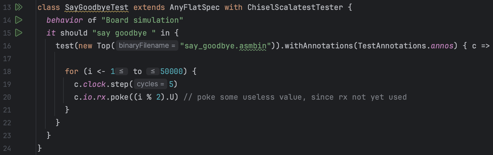
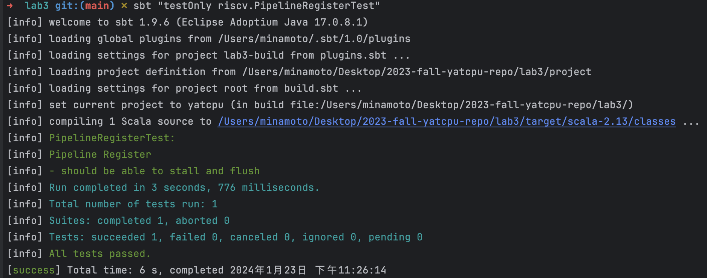
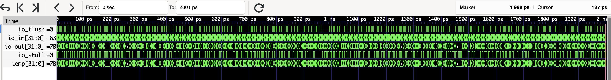
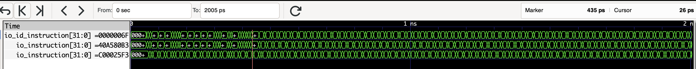
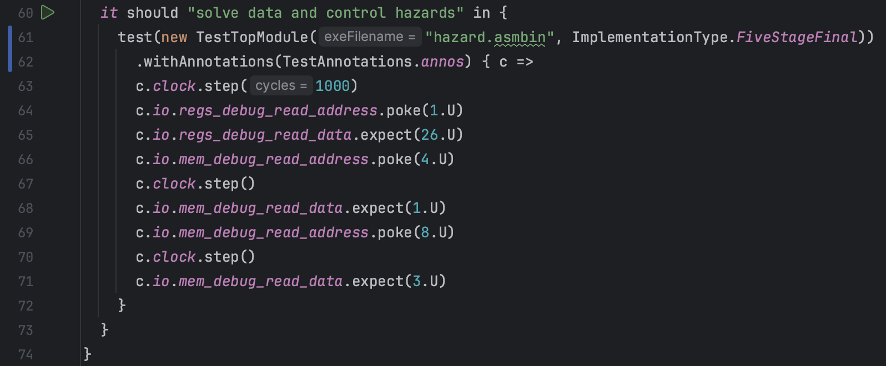

:::primary
[YatCPU](/computer-science/principles-of-computer-composition/yatcpu/yatcpu-report/) - - - [lab1](/computer-science/principles-of-computer-composition/yatcpu/lab-reports/lab1/) - - - [lab2](/computer-science/principles-of-computer-composition/yatcpu/lab-reports/lab2/) - - - [lab3](/computer-science/principles-of-computer-composition/yatcpu/lab-reports/lab3/) - - - [lab4](/computer-science/principles-of-computer-composition/yatcpu/lab-reports/lab4/)
## 测试用例及其波形图分析

### SayGoodbyeTest

src/test/scala/riscv/BoardTest.scala



其中`Top`模块来自：


测试执行程序来自 csrc/say_goodbye.c ：


#### 测试用例的功能

与 lab2 中 BoardSayGoodbyeTest 功能相似

测试能否正常执行打印 "Never gonna give you up~ Never gonna let you down~\nNever gonna run around and~ desert you~" ，用于烧板后测试能否实现打印，即测试 CPU 包括 lab1 的功能以及能否实现中断处理

#### 从什么层面测试 CPU

从完整性的层面测试 CPU ，若 CPU 可以打印，说明 CPU 具备了中断处理的能力

但并没有测试 CPU 的正确性，只是进行了`poke`和`step`，但没有对任何信号进行`expect`检查。实际验证需要烧板手动测试能否打印。

#### 加载测试程序的方法

利用定义在`src/main/scala/board/z710/Top.scala`中的模块`Top`，用 RISC-V 程序`src/main/resources/say_goodbye.asmbin` 初始化进行仿真

#### 测试用例的执行结果


#### 输出波形图


#### 执行不同指令时候对应的部件的关键信号的变化情况

测试中循环执行了 50000 次`step(5)`，即 250000 个时钟周期，输出的波形图总时长为 500001 ps ，除去半个用于 reset 的时钟周期之外恰好 250000 个时钟周期。

由 io_jump_flag 、io_id_flush 、io_if_flush 、io_if_stall 、io_pc_stall 几个信号变化可以看出，CPU 在执行程序过程中较频繁地出现了控制冒险和数据冒险，需要通过阻塞、清除、转发等操作处理

### PipelineRegisterTest

src/test/scala/riscv/PipelineRegisterTest.scala


#### 测试用例的功能

该测试用例用于检查 PipelineRegister 模块的正确性，测试程序模拟了 3 种情况：

##### 既不清除也不阻塞

在当前指令既不清除也不阻塞的情况，PipelineRegister 模块应该更新内容

##### 阻塞

在当前指令需要阻塞的情况，PipelineRegister 模块应该保持原本内容不变，实现“暂停”

##### 清除

在当前指令需要清除的情况，PipelineRegister 模块的内容应该恢复默认值，默认值代表清除时塞入的“气泡”，例如：

- instruction 的默认初始值为 nop
- instruction_address 的默认初始值为程序入口指令地址

#### 从什么层面测试 CPU

从辅助寄存器 PipelineRegister 层面测试了 CPU，主要测试流水线 CPU 不同级之间的寄存器能否实现流水线 CPU 所需要的基本功能

#### 加载测试程序的方法

利用定义在`src/main/scala/riscv/core/PipelineRegister.scala` 中的模块`PipelineRegister`，不使用任何 RISC-V 程序初始化进行仿真，直接仿真测试

#### 测试用例的执行结果



#### 输出波形图



#### 执行不同指令时候对应的部件的关键信号的变化情况

测试程序模拟了 3 中不同情况，并且重复对三种情况中随机一个进行测试，总共测试了 1000 次，执行了 1000 个时钟周期

##### 既不清除也不阻塞


io_flush = 0 且 io_stall = 0 ，表示既不清除也不阻塞的情况，PipelineRegister 模块应该更新内容，所以存储变量 temp 和输出端口的值 io_out 均变为输入寄存器的新的值 io_in = 59111E2DH

##### 阻塞


io_flush = 0 且 io_stall = 1 ，表示阻塞的情况，PipelineRegister 模块应该维持原本内容不变，所以存储变量 temp 和输出端口的值 io_out 均不受输入寄存器的新的值 io_in = 4846D70DH 的影响，维持 7B035A8H 不变

##### 清除


io_flush = 1 且 io_stall = 0 ，表示清除的情况，PipelineRegister 模块应该重制内容为默认初始值，所以存储变量 temp 和输出端口的值 io_out 均不受输入寄存器的新的值 io_in = 4C52A358H 的影响，变为测试程序随机生成的默认初始值 7B035A8H

### hazard.S

后面几个测试都使用了 src/main/resources/hazard.asmbin 进行仿真，其汇编源文件为 csrc/hazard.S ，该文件内容源代码如下


对这段汇编代码出现的冒险分析如下：

```shell RISCV汇编
.globl _start
_start:
  csrr a0, cycle
  addi t0, zero, 1    ## 数据冒险：下一条指令 sub 需要使用 ALU 计算结果 t0 的值
  sub t1, zero, t0    ## 数据冒险：需要使用上一条指令 addi 的 ALU 计算结果 t0 的值
                      ##          下一条指令 and 需要使用 ALU 计算结果 t1 的值
  and t2, t0, t1      ## 数据冒险：需要使用上一条指令 sub 的 ALU 计算结果 t1 的值
                      ##          下一条指令 sw 需要使用 ALU 计算结果 t2 的值
  sw t2, 4(zero)      ## 数据冒险：需要使用上一条指令 and 的 ALU 计算结果 t2 的值
  j skip1             ## 控制冒险：无条件跳转指令，后续指令会被抛弃
  or t2, t0, t1       ## 控制冒险：将会无条件跳转到skip1标签处，此指令将被抛弃
  xor t2, t0, t1      ## 控制冒险：将会无条件跳转到skip1标签处，此指令将被抛弃

skip1:
  addi t1, t2, 1      ## 数据冒险：下一条指令 add 需要使用 ALU 计算结果 t1 的值
  add t2, t1, t2      ## 数据冒险：需要使用上一条指令 addi 的 ALU 计算结果 t1 的值
                      ##          下一条指令 and 需要使用 ALU 计算结果 t2 的值
  and t2, t1, t2      ## 数据冒险：需要使用上一条指令 and 的 ALU 计算结果 t2 的值
                      ##          下一条指令 lw 需要使用 ALU 计算结果 t2 的值
  lw t2, 2(t2)        ## 数据冒险：需要使用上一条指令 and 的 ALU 计算结果 t2 的值
  or t3, t1, t2       ## 数据冒险：需要使用上一条指令 lw 读取内存得到的 t2 的值
  blt t2, t3, skip2   ## 数据冒险：需要使用上一条指令 or 的 ALU 计算结果 t3 的值
                      ## 控制冒险：条件分支，后续指令可能会被抛弃
  or t3, t0, t0       ## 控制冒险：如果分支条件满足，将会跳转到 skip2 标签处，此指令将被抛弃
  xor t3, t0, t1      ## 控制冒险：如果分支条件满足，将会跳转到 skip2 标签处，此指令将被抛弃

skip2:
  addi t4, zero, 3    ## 数据冒险：下一条指令 bne 需要使用 ALU 计算结果 t4 的值
  bne t3, t4, skip1   ## 数据冒险：需要使用上一条指令 addi 的 ALU 计算结果 t4 的值
                      ## 控制冒险：条件分支，后续指令可能会被抛弃
  sw t3, 8(zero)
  auipc t4, 0         ## 控制冒险：如果分支条件满足，将会跳转到 skip1 标签处，此指令将被抛弃
                      ## 数据冒险：下一条指令 jalr 需要使用扩展立即数结果 t4 的值
  jalr t4, 8(t4)      ## 控制冒险：如果分支条件满足，将会跳转到 skip1 标签处，此指令将被抛弃
                      ## 数据冒险：需要使用上一条指令 auipc 扩展立即数写入寄存器 t4 的值
                      ## 控制冒险：无条件跳转指令，后续指令会被抛弃
  jalr t4, 4(t4)      ## 控制冒险：无条件跳转指令，后续指令会被抛弃
  csrr a1, cycle      ## 控制冒险：将会无条件跳转到未知地址，此指令可能被抛弃
                      ## 数据冒险：下一条指令 sub 需要使用读取计数器得到的 a1 的值
  sub ra, a1, a0      ## 控制冒险：将会无条件跳转到未知地址，此指令可能被抛弃
                      ## 数据冒险：需要使用上一条指令 csrr 读取计数器得到的 a1 的值

loop:
  j loop
```

上述分析基于五级流水线 CPU 进行分析，若为三级流水线 CPU，则不存在数据冒险，只存在控制冒险

若所有冒险都能正确处理，则程序应该按照如下过程执行：

```shell RISCV汇编
.globl _start
_start:
  csrr a0, cycle          ## 读取计时器的当前值，存入寄存器a0

  addi t0, zero, 1        ## 将0加上立即数1，结果存入寄存器t0，t0=1
  sub t1, zero, t0        ## 将0减去寄存器t0的值，结果存入寄存器t1，t1=-1
  and t2, t0, t1          ## 将寄存器t0和寄存器t1进行按位与操作，结果存入寄存器t2，t2=1
  sw t2, 4(zero)          ## 将寄存器t2的值存入内存地址4

  j skip1                ## 无条件跳转到标签skip1
  or t2, t0, t1          ## 控制冒险：此指令将被跳过，不会执行
  xor t2, t0, t1         ## 控制冒险：此指令将被跳过，不会执行

skip1:
  addi t1, t2, 1          ## 将寄存器t2的值加上立即数1，结果存入寄存器t1，t1=2
  add t2, t1, t2          ## 将寄存器t1和寄存器t2相加，结果存入寄存器t2，t2=3
  and t2, t1, t2          ## 将寄存器t1和寄存器t2进行按位与操作，结果存入寄存器t2，t2=2
  lw t2, 2(t2)            ## 从内存地址(t2+2)处读取值，存入寄存器t2，t2=1
  or t3, t1, t2           ## 将寄存器t1和寄存器t2进行按位或操作，结果存入寄存器t3，t3=3
  blt t2, t3, skip2       ## t2 < t3，跳转到标签skip2
  or t3, t0, t0           ## 控制冒险：此指令将被跳过，不会执行
  xor t3, t0, t1          ## 控制冒险：此指令将被跳过，不会执行

skip2:
  addi t4, zero, 3        ## 将0加上立即数3，结果存入寄存器t4，t4=3
  bne t3, t4, skip1       ## t3和t4相等，不跳转，继续执行下面的指令
  sw t3, 8(zero)          ## 将寄存器t3的值存入内存地址8
  auipc t4, 0             ## 将当前PC的高20位加上立即数0存入寄存器t4，t4=当前指令PC+4
  jalr t4, 8(t4)          ## 跳转到地址(t4+8)，并将返回地址存入寄存器t4，t4=上一条指令PC+4+8=当前指令PC+8
  jalr t4, 4(t4)          ## 控制冒险：此指令将被跳过，不会执行，跳转到下一条指令
  csrr a1, cycle          ## 读取计时器的当前值，存入寄存器a1
  sub ra, a1, a0          ## 将寄存器a1减去寄存器a0的值，结果存入寄存器ra

loop:
  j loop                  ## 无条件跳转到标签loop，形成一个无限循环
```

程序结束时，寄存器的值如下：

- `a0`：存储了起始时刻的计时器值
- `a1`：存储了结束时刻的计时器值
- `ra`：存储了计时器结束时刻减去起始时刻的差值，即进入死循环前程序运行了多少时钟周期
- t0、t1、t2、t3、t4 寄存器的值如下：
  - `t0`： 1
  - `t1`： -1
  - `t2`：1
  - `t3`：3
  - `t4`：指令`csrr a1, cycle` 的地址

内存地址中存储的数据如下：

- 内存地址 4：存储了的值为 1
- 内存地址 8：存储了的值为 3

后面几个流水线 CPU 测试使用到的斐波那契数列计算、快排、读写单个字节这 3 个测试均已在 lab1 分析过，与单周期 CPU 无异，所以只分析他们对冒险的处理，即只分析他们对上述程序的执行处理过程

### ThreeStageCPUTest

src/test/scala/riscv/ThreeStageCPUTest.scala


#### 测试用例的功能

测试了三级流水线 CPU 的完整功能正确性，检测其是否解决 hazard.asmbin 的所有控制冒险问题

#### 从什么层面测试 CPU

从对冒险的处理层面测试三级流水线 CPU

#### 加载测试程序指令的方法

利用定义在`src/main/scala/riscv/TestTopModule.scala`中的模块 TestTopModule ，使用任何 RISC-V 程序 src/main/resources/hazard.asmbin 初始化进行仿真测试

#### 测试用例的执行结果


#### 输出波形图


#### 执行不同指令时候对应的部件的关键信号的变化情况

输出波形图中可以看到前面 120 ps 内测试程序执行完毕，此后程序进入死循环，不断重复执行 0000006FH 指令，即 jal 指令，原地循环

###### 

如上图所示，波形图中自上到下三个信号分别为 IF、ID、EX 阶段的指令信号，当信号连续 2 个周期不发生改变，说明该阶段指令阻塞；当信号变为默认初始值 00000013H ，说明该阶段指令清空。


当确保程序执行完毕后，测试程序检测结果，读取寄存器和内存的值，看其是否符合预期。

##### io_regs_debug_read_data[31:0]

`c.io.regs_debug_read_address.poke(1.U)` 使信号 io_regs_debug_read_address[4:0] 的值为 1 ，表示读取 1 号寄存器，即读取 ra 寄存器，读取 io_regs_debug_read_data 的值应当为三级流水线 CPU 执行 hazard.asmbin 两次 csrr 指令之间所花费的时钟周期

两次 csrr 指令之间有 18 条指令（包括两条 csrr ）在三级流水线执行过程都进入 EX 阶段过，即没有被跳过；且两次 csrr 指令之间经历了 4 次跳转指令控制冒险，从波形图可以看出 EX 阶段发生了 4 次阻塞，每次阻塞 2 个时钟周期。因此两次 csrr 指令之间所花费的时钟周期数为 18+4\*2 = 26

波形图可见最后读取到 io_regs_debug_read_data 的值等于 26 ，说明三级流水线 CPU 符合预期正确处理了所有控制冒险

##### io_mem_debug_read_data[31:0]

先后两个时钟周期检测了两个地址所存储的内容

`c.io.mem_debug_read_address.poke(4.U)` 读取内存地址为 4 的内容，结果为 1 ，符合预期；

`c.io.mem_debug_read_address.poke(8.U)` 读取内存地址为 8 的内容，结果为 3 ，符合预期；

### FiveStageCPUStallTest

src/test/scala/riscv/FiveStageCPUStallTest.scala


#### 测试用例的功能

测试了只使用阻塞解决冒险的五级流水线 CPU 的完整功能正确性，检测其是否解决 hazard.asmbin 的所有控制冒险问题

#### 从什么层面测试 CPU

从对冒险的处理层面测试五级流水线 CPU

#### 加载测试程序指令的方法

利用定义在`src/main/scala/riscv/TestTopModule.scala`中的模块 TestTopModule ，使用任何 RISC-V 程序 src/main/resources/hazard.asmbin 初始化进行仿真测试

#### 测试用例的执行结果


#### 输出波形图



#### 执行不同指令时候对应的部件的关键信号的变化情况

输出波形图中可以看到前面 450 ps 内测试程序执行完毕，此后程序进入死循环，不断重复执行 0000006FH 指令，即 jal 指令，原地循环

###### 

如上图所示，波形图中自上到下三个信号分别为 IF、ID、EX 阶段的指令信号，当信号连续 多 个周期不发生改变，说明该阶段指令阻塞；当信号变为默认初始值 00000013H ，说明该阶段指令清空。


当确保程序执行完毕后，测试程序检测结果，读取寄存器和内存的值，看其是否符合预期。

##### io_regs_debug_read_data[31:0]

`c.io.regs_debug_read_address.poke(1.U)` 使信号 io_regs_debug_read_address[4:0] 的值为 1 ，表示读取 1 号寄存器，即读取 ra 寄存器，读取 io_regs_debug_read_data 的值应当为五级流水线 CPU 执行 hazard.asmbin 两次 csrr 指令之间所花费的时钟周期

两次 csrr 指令之间有 18 条指令（包括第二条 csrr 但不包括第一条 csrr）在五级流水线执行过程都进入 EX 阶段过，即没有被跳过；且两次 csrr 指令之间经历了 4 次跳转指令控制冒险、10 次数据冒险，从波形图可以看出 EX 阶段发生了 14 次阻塞，每次阻塞 2 个时钟周期。因此两次 csrr 指令之间所花费的时钟周期数为 18+14\*2 = 46

波形图可见最后读取到 io_regs_debug_read_data 的值等于 46 ，说明五级流水线 CPU 符合预期正确处理了所有冒险

##### io_mem_debug_read_data[31:0]

先后两个时钟周期检测了两个地址所存储的内容

`c.io.mem_debug_read_address.poke(4.U)` 读取内存地址为 4 的内容，结果为 1 ，符合预期；

`c.io.mem_debug_read_address.poke(8.U)` 读取内存地址为 8 的内容，结果为 3 ，符合预期；

### FiveStageCPUForwardTest

src/test/scala/riscv/FiveStageCPUForwardTest.scala


#### 测试用例的功能

测试了使用阻塞和转发解决冒险的五级流水线 CPU 的完整功能正确性，检测其是否解决 hazard.asmbin 的所有控制冒险问题

#### 从什么层面测试 CPU

从对冒险的处理层面测试五级流水线 CPU

#### 加载测试程序指令的方法

利用定义在`src/main/scala/riscv/TestTopModule.scala`中的模块 TestTopModule ，使用任何 RISC-V 程序 src/main/resources/hazard.asmbin 初始化进行仿真测试

#### 测试用例的执行结果


#### 输出波形图


#### 执行不同指令时候对应的部件的关键信号的变化情况

输出波形图中可以看到前面 300 ps 内测试程序执行完毕，此后程序进入死循环，不断重复执行 0000006FH 指令，即 jal 指令，原地循环

###### 

如上图所示，波形图中自上到下三个信号分别为 IF、ID、EX 阶段的指令信号，当信号连续多个周期不发生改变，说明该阶段指令阻塞；当信号变为默认初始值 00000013H ，说明该阶段指令清空。


当确保程序执行完毕后，测试程序检测结果，读取寄存器和内存的值，看其是否符合预期。

##### io_regs_debug_read_data[31:0]

`c.io.regs_debug_read_address.poke(1.U)` 使信号 io_regs_debug_read_address[4:0] 的值为 1 ，表示读取 1 号寄存器，即读取 ra 寄存器，读取 io_regs_debug_read_data 的值应当为五级流水线 CPU 执行 hazard.asmbin 两次 csrr 指令之间所花费的时钟周期

两次 csrr 指令之间有 18 条指令（包括第二条 csrr 但不包括第一条 csrr）在五级流水线执行过程都进入 EX 阶段过，即没有被跳过；且两次 csrr 指令之间经历了 4 次跳转指令控制冒险、1 次无法用转发解决的数据冒险即`lw t2, 2(t2)`和`or t3, t1, t2` 之间的数据冒险，读取内存的数据必须等到下一个周期 MEM 阶段才能得到数据。从波形图可以看出 EX 阶段发生了 4 次阻塞，每次阻塞 2 个时钟周期，同时数据冒险还在 IF 和 ID 阶段阻塞了 1 个时钟周期。因此两次 csrr 指令之间所花费的时钟周期数为 18+4\*2+1 = 27

波形图可见最后读取到 io_regs_debug_read_data 的值等于 27 ，说明五级流水线 CPU 符合预期正确处理了所有冒险

##### io_mem_debug_read_data[31:0]

先后两个时钟周期检测了两个地址所存储的内容

`c.io.mem_debug_read_address.poke(4.U)` 读取内存地址为 4 的内容，结果为 1 ，符合预期；

`c.io.mem_debug_read_address.poke(8.U)` 读取内存地址为 8 的内容，结果为 3 ，符合预期；

### FiveStageCPUFinalTest

src/test/scala/riscv/FiveStageCPUFinalTest.scala



#### 测试用例的功能

测试了使用阻塞、转发以及 ID 阶段判断分支来解决冒险的五级流水线 CPU 的完整功能正确性，检测其是否解决 hazard.asmbin 的所有控制冒险问题

#### 从什么层面测试 CPU

从对冒险的处理层面测试五级流水线 CPU

#### 加载测试程序指令的方法

利用定义在`src/main/scala/riscv/TestTopModule.scala`中的模块 TestTopModule ，使用任何 RISC-V 程序 src/main/resources/hazard.asmbin 初始化进行仿真测试

#### 测试用例的执行结果


#### 输出波形图


#### 执行不同指令时候对应的部件的关键信号的变化情况

输出波形图中可以看到前面 300 ps 内测试程序执行完毕，此后程序进入死循环，不断重复执行 0000006FH 指令，即 jal 指令，原地循环

###### 

如上图所示，波形图中自上到下三个信号分别为 IF、ID、EX 阶段的指令信号，当信号连续多个周期不发生改变，说明该阶段指令阻塞；当信号变为默认初始值 00000013H ，说明该阶段指令清空。


当确保程序执行完毕后，测试程序检测结果，读取寄存器和内存的值，看其是否符合预期。

##### io_regs_debug_read_data[31:0]

`c.io.regs_debug_read_address.poke(1.U)` 使信号 io_regs_debug_read_address[4:0] 的值为 1 ，表示读取 1 号寄存器，即读取 ra 寄存器，读取 io_regs_debug_read_data 的值应当为五级流水线 CPU 执行 hazard.asmbin 两次 csrr 指令之间所花费的时钟周期

两次 csrr 指令之间有 18 条指令（包括第二条 csrr 但不包括第一条 csrr）在五级流水线执行过程都进入 EX 阶段过，即没有被跳过；且两次 csrr 指令之间经历了 4 次跳转指令控制冒险、1 次无法用转发解决的数据冒险即`lw t2, 2(t2)`和`or t3, t1, t2` 之间的数据冒险，读取内存的数据必须等到下一个周期 MEM 阶段才能得到数据。其中第一次控制冒险是由无条件跳转指令引起的，可以通过 ID 阶段只阻塞 1 个周期解决；其余 3 个控制冒险都需要阻塞 2 个时钟周期才能解决；同时数据冒险还在 IF 和 ID 阶段阻塞了 1 个时钟周期。因此两次 csrr 指令之间所花费的时钟周期数为 18+1+3\*2+1 = 26

波形图可见最后读取到 io_regs_debug_read_data 的值等于 26 ，说明五级流水线 CPU 符合预期正确处理了所有冒险

##### io_mem_debug_read_data[31:0]

先后两个时钟周期检测了两个地址所存储的内容

`c.io.mem_debug_read_address.poke(4.U)` 读取内存地址为 4 的内容，结果为 1 ，符合预期；

`c.io.mem_debug_read_address.poke(8.U)` 读取内存地址为 8 的内容，结果为 3 ，符合预期；

## 填空涉及到的信号分析

(src/main/scala/riscv/)

主要在填空代码处以注释的形式进行了分析

## 在完成实验的过程中，遇到的关于实验指导不明确或者其他问题，或者改进的建议。

~~使用实验板上的数码管、视频输出等外设，输出一个完整程序的运行结果，或者参考硬件调试一节的内容，用硬件波形的方法捕获程序运行结果。给出你的 CPU 可以正确在实验板上运行程序的照片或者硬件调试器波形截图。~~
