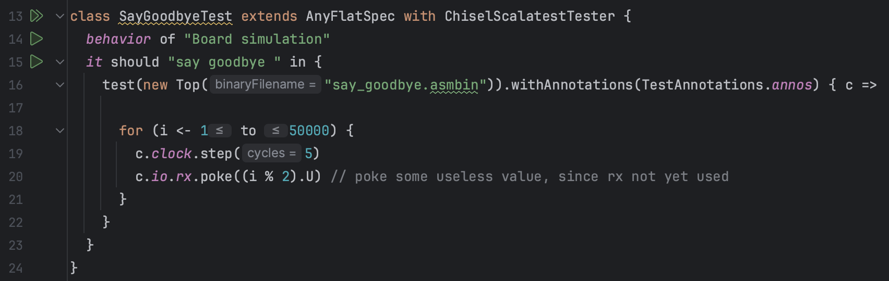
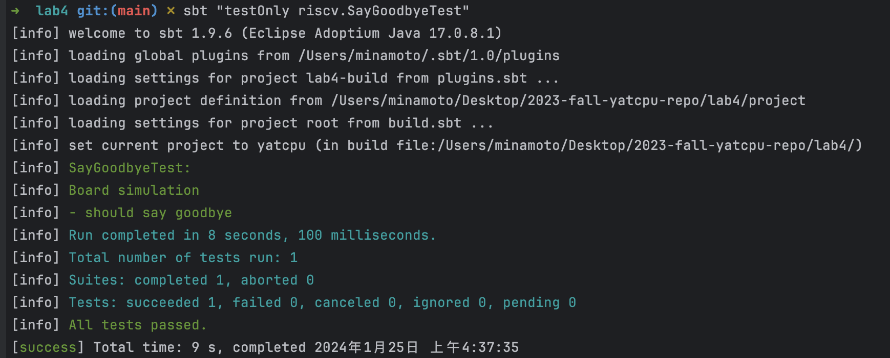
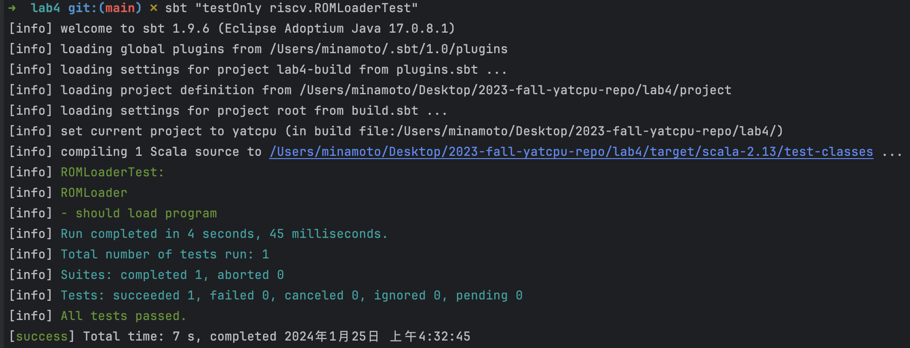
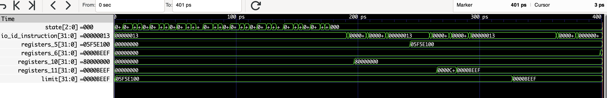
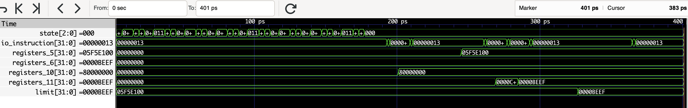
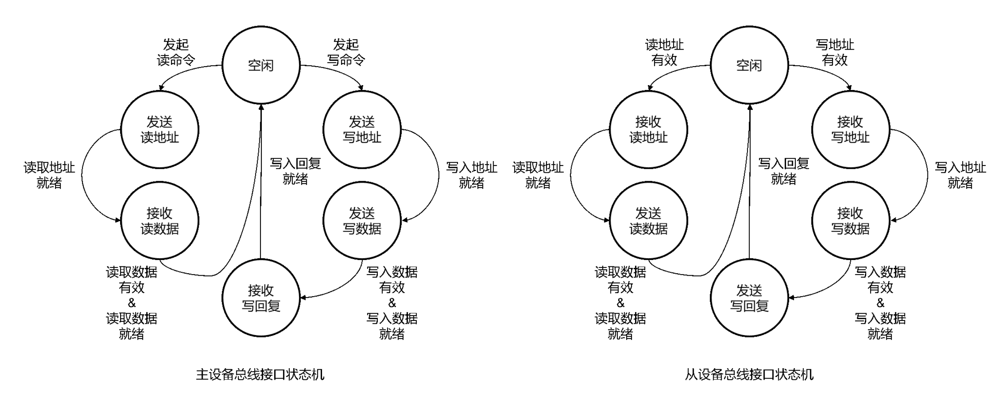

:::primary
[YatCPU](/computer-science/principles-of-computer-composition/yatcpu/yatcpu-report/) - - - [lab1](/computer-science/principles-of-computer-composition/yatcpu/lab-reports/lab1/) - - - [lab2](/computer-science/principles-of-computer-composition/yatcpu/lab-reports/lab2/) - - - [lab3](/computer-science/principles-of-computer-composition/yatcpu/lab-reports/lab3/) - - - [lab4](/computer-science/principles-of-computer-composition/yatcpu/lab-reports/lab4/)
## 测试用例及其波形图分析

### SayGoodbyeTest

src/test/scala/riscv/BoardTest.scala



其中`Top`模块来自：


测试执行程序来自 csrc/say_goodbye.c ：


#### 测试用例的功能

测试能否正常执行打印 "Never gonna give you up~ Never gonna let you down~\nNever gonna run around and~ desert you~" ，用于烧板后测试能否实现打印，即测试 CPU 包括 lab1 的功能以及能否实现中断处理

此外，测试用例还通过波形图展示了总线连接下各个设备之间的通信

#### 从什么层面测试 CPU

从完整性的层面测试 CPU ，若 CPU 可以打印，则说明 CPU 实现了总线以及各个设备通过总线协议的通信

但并没有测试 CPU 的正确性，只是进行了`poke`和`step`，但没有对任何信号进行`expect`检查。实际验证需要烧板手动测试能否打印

#### 加载测试程序的方法

利用定义在`src/main/scala/board/z710/Top.scala`中的模块`Top`，用 RISC-V 程序`src/main/resources/say_goodbye.asmbin` 初始化进行仿真

#### 测试用例的执行结果



#### 输出波形图


#### 执行不同指令时候对应的部件的关键信号的变化情况

所展示波形图里的信号自上而下分别表示：dummy 主设备、CPU、dummy 从设备、instruction_rom 从设备、mem 从设备、timer 从设备、uart 从设备的状态信号 state 变化情况

instruction_rom 设备状态在一开始不断变化的过程即为加载程序的过程，在 ROMLoaderTest 中体现了这一过程

instruction_rom 设备加载结束后，程序被加载到内存，CPU 的状态信号开始不断变化，表示 CPU 开始工作，执行程序

### TimerTest

src/test/scala/riscv/TimerTest.scala


#### 测试用例的功能

该测试用例用于检查总线模块的正确性，利用 Timer 模块作为从设备，与自定义的 master 模块作为主设备进行通信

#### 从什么层面测试 CPU

从总线上设备的通信层面测试了 CPU

#### 加载测试程序的方法

利用定义在`src/main/scala/riscv/core/peripheral/Timer.scala`中的模块 Timer、定义在`src/main/scala/bus/AXI4Lite.scala`中的模块 AXI4LiteMaster 、AXI4LiteSlave 等模块 ，不使用任何 RISC-V 程序初始化进行仿真，直接仿真测试

#### 测试用例的执行结果


#### 输出波形图


#### 执行不同指令时候对应的部件的关键信号的变化情况

测试程序模拟了先后向 Timer 写数据、读数据的信号变化不同情况:

##### 写数据

信号 io_bundle_write = 1 被拉高，向 Timer 内地址为 4 的空间写入数据 io_bundle_write_data = 00990315H ，即向 Timer 的 limit 写入 00990315H 的数据

写入操作开始后 io_bundle_busy 信号变为 1 ，表示 Timer 忙碌，现在正在与主设备通信实现写操作

##### 写数据成功

向 Timer 写数据开始的 7 个时钟周期后 Timer 的变量 limit 才变为 00990315H ，此后又花了 1 个时钟周期回复确认，也即 Timer 和主设备之间花了 8 个时钟周期才实现握手、写操作、写回复等。写入 limit 成功后，io_bundle_busy 随即被拉低，表示 Timer 空闲，io_write_valid 被拉高表示写操作请求完成

##### 数据

信号 io_bundle_read = 1 被拉高，向 Timer 申请读取地址为 4 的数据 limit = 00990315H

读数据操作开始后 io_bundle_busy 信号变为 1 ，表示 Timer 忙碌，现在正在与主设备通信实现读操作

##### 读数据成功

向 Timer 写数据开始的 5 个时钟周期后 io_bundle_read_data 才变为 00990315H ，此后又花了 1 个时钟周期回复确认，也即 Timer 和主设备之间花了 6 个时钟周期才实现握手、读操作等。读取 limit 成功后，io_bundle_busy 随即被拉低，表示 Timer 空闲，io_read_valid 被拉高表示读操作成功执行

### MemoryTest

src/test/scala/riscv/MemoryTest.scala


#### 测试用例的功能

该测试用例用于检查总线模块的正确性，利用 Memory 模块作为从设备，与自定义的 master 模块作为主设备进行通信

#### 从什么层面测试 CPU

从总线上设备的通信层面测试了 CPU

#### 加载测试程序的方法

利用定义在`src/main/scala/riscv/core/peripheral/Memory.scala`中的模块 Memory、定义在`src/main/scala/bus/AXI4Lite.scala`中的 AXI4LiteMaster 、AXI4LiteSlave 等模块，不使用任何 RISC-V 程序初始化进行仿真，直接仿真测试

#### 测试用例的执行结果


#### 输出波形图


#### 执行不同指令时候对应的部件的关键信号的变化情况

测试程序模拟了先后向 Memory 写数据、读数据的信号变化不同情况:

##### 写数据

信号 io_bundle_write = 1 被拉高，向 Memory 内地址为 4 的空间写入数据 io_bundle_write_data = DEADBEEFH

写入操作开始后 io_bundle_busy 信号变为 1 ，表示 Memory 忙碌，现在正在与主设备通信实现写操作

##### 写数据成功

向 Memory 写数据开始的 8 个时钟周期后 io_bundle_busy 被拉低，表示 Memory 空闲，io_write_valid 被拉高表示写操作请求完成，也即 Timer 和主设备之间花了 8 个时钟周期才实现握手、写操作、写回复等。

##### 数据

信号 io_bundle_read = 1 被拉高，向 Memory 申请读取地址为 4 的数据

读数据操作开始后 io_bundle_busy 信号变为 1 ，表示 Memory 忙碌，现在正在与主设备通信实现读操作

##### 读数据成功

向 Timer 写数据开始的 6 个时钟周期后读取 limit 成功，io_bundle_busy 被拉低，表示 Timer 空闲，io_read_valid 被拉高表示读操作成功执行，io_bundle_read_data 信号为 DEADBEEFH ，符合预期

### ROMLoaderTest

src/test/scala/riscv/ROMLoaderTest.scala


#### 测试用例的功能

该测试用例用于检查总线模块的正确性，利用 ROMLoader 模块作为从设备，与自定义的 slave 模块作为主设备进行通信

#### 从什么层面测试 CPU

从总线上设备的通信层面测试了 CPU

#### 加载测试程序的方法

利用定义在`src/main/scala/peripheral/ROMLoader.scala`中的模块 ROMLoader、定义在`src/main/scala/bus/AXI4Lite.scala`中的 AXI4LiteMaster 、AXI4LiteSlave 等模块，不使用任何 RISC-V 程序初始化进行仿真，直接仿真测试

#### 测试用例的执行结果



#### 输出波形图


#### 执行不同指令时候对应的部件的关键信号的变化情况

测试程序模拟检测了 ROMLoader 加载程序，即将 ROM 数据写入内存( 从设备 )过程的信号变化过程

波形图中最底下 2 个信号从上到下分别表示主设备和从设备的 state 状态变量信号，它们的变化展现了 ROMLoader 加载程序过程的不断

##### 写入从设备数据

信号 io_load_start = 1 被拉高，下一个时钟周期开始 ROMLoader 按顺序将数据写入从设备

io_load_address 被设置为 100H ，表示从内存地址 100H 开始写数据

一开始 io_rom_address 的值为 0 ，表示用 rom 内容最开始处的数据写到从设备

##### 写入数据成功

写入操作开始后 8 个时钟周期后 io_bundle_write 被拉高，表示成功写入数据

##### 加载程序结束

又进行一次写操作后，由于已经遍历了 ROM 的空间为 2 ，达到了测试程序定义的 ROMLoader 模块设置的最大容量 capacity = 2 ，所以加载程序过程停止。此时 io_load_finish 信号拉高变为 1 ，表明程序加载结束，符合预期

### threestage.MMIOTest

src/test/scala/riscv/threestage/CPUTest.scala


csrc/mmio.S


对该程序分析如下：

```raw
.globl _start
_start:
  li a0, 0x80000000   ## 将立即数 0x80000000 加载到寄存器 a0 中，a0=80000000H
  lw t0, 4(a0)        ## 从地址 a0+4=80000004H 处加载一个字（32位）到寄存器 t0 中，t0=05F5E100H（limit默认初始值）
  li a1, 0xBEEF       ## 将立即数 0xBEEF 加载到寄存器 a1 中，a1=BEEFH
  sw a1, 4(a0)        ## 将寄存器 a1 的内容存储到地址 a0+4=80000004H 处，limit=BEEFH
  nop                 ## 空指令，不执行任何操作
  lw t1, 4(a0)        ## 从地址 a0+4 处加载一个字（32位）到寄存器 t1 中，t1=BEEFH
loop:
  j loop              ## 无条件跳转到标签 loop 处
```

可知程序执行结束后，各个寄存器的内容如下：

- a0：80000000H
- a1：BEEFH
- t0：05F5E100H
- t1：BEEFH

且主存地址为 80000004H 处的 Timer 内部数据 limit 变为 BEEFH

#### 测试用例的功能

测试了 CPU 能否与计时器 Timer 通信，并实现 CPU 作为主设备对 Timer 的读写功能

#### 从什么层面测试 CPU

从总线上设备的通信层面测试了 CPU

#### 加载测试程序指令的方法

利用定义在`src/main/scala/riscv/TestTopModule.scala`中的模块 TestTopModule ，使用任何 RISC-V 程序 src/main/resources/mmio.asmbin 初始化进行仿真测试

#### 测试用例的执行结果


#### 输出波形图



#### 执行不同指令时候对应的部件的关键信号的变化情况

测试程序总共执行了 200 个时钟周期：

- 前面几乎一半时间用来加载程序，波形图上表现为 ROMLoader 的状态变量 state 在这一段时间不断变化，然后稳定

- 后面剩余时间用于 CPU 执行程序，波形图上表现为 IF 阶段的 io_id_instruction 变两在这段时间不断变化

当确保程序执行完毕后，测试程序检测结果，读取寄存器和内存的值，看其是否符合预期

##### register_5[31:0]

CPU 5 号寄存器的值，即 t0 寄存器的值，最后结果为 05F5E100H，符合预期

##### register_6[31:0]

CPU 6 号寄存器的值，即 t1 寄存器的值，最后结果为 BEEFH ，符合预期

##### register_10[31:0]

CPU 10 号寄存器的值，即 a0 寄存器的值，最后结果为 80000000H，符合预期

##### register_11[31:0]

CPU 11 号寄存器的值，即 a1 寄存器的值，最后结果为 BEEFH，符合预期

##### limit[31:0]

计时器 Timer 的变量，即内存地址空间为 80000004H 的值，最后结果为 BEEFH，符合预期

### fivestage.MMIOTest

该测试与 threestage.MMIOTest 基本一致，不再重复分析

#### 测试用例的执行结果


#### 输出波形图



## 填空涉及到的信号分析

(src/main/scala/riscv/)

主要在填空代码处以注释的形式进行了分析

状态转移图：



## 在完成实验的过程中，遇到的关于实验指导不明确或者其他问题，或者改进的建议。

~~使用实验板上的数码管、视频输出等外设，输出一个完整程序的运行结果，或者参考硬件调试一节的内容，用硬件波形的方法捕获程序运行结果。给出你的 CPU 可以正确在实验板上运行程序的照片或者硬件调试器波形截图。~~
