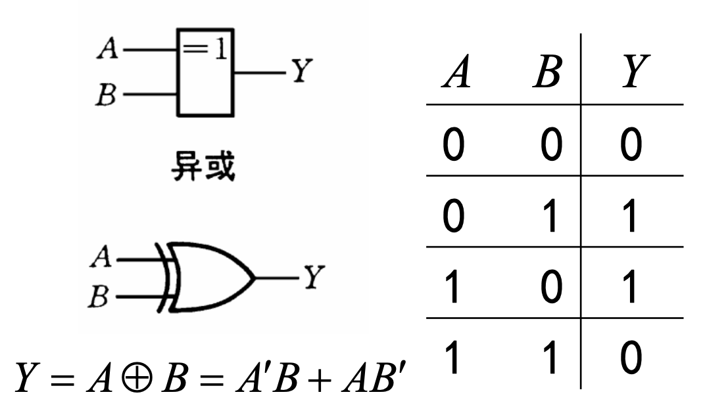

## 逻辑代数中的基本运算

### 三种基本运算

### 真值表

表征逻辑事件输入（条件）和输出（结果）之间全部可能状态的表格

与运算：

| A   | B   | Y   |
| --- | --- | --- |
| 0   | 0   | 0   |
| 0   | 1   | 0   |
| 1   | 0   | 0   |
| 1   | 1   | 1   |

或运算：

| A   | B   | Y   |
| --- | --- | --- |
| 0   | 0   | 0   |
| 0   | 1   | 1   |
| 1   | 0   | 1   |
| 1   | 1   | 1   |

非运算：

| A   | Y   |
| --- | --- |
| 0   | 1   |
| 1   | 0   |

### 其他复合逻辑运算

#### 与非

“先与再非”

#### 或非

“先或再非”

#### 与或非

“先与再或再非”

#### 异或 XOR

不同时输出 1，相同时输出 0

$$
A\oplus B=\overline{A}B+A\overline{B}
$$

:star:异或运算满足的性质

- 交换律
- 结合律
- 对于任何数 x，都有 $x\oplus x=0$ ，$x\oplus 0=x$ ，$x\oplus 1=\overline{x}$；
- 自反性 $A\oplus B\oplus B=A\oplus0=A$；（经典 coding 小技巧）

#### 同或 XNOR

同或—— 相同时输出 1，不同时输出 0

## 逻辑代数的公式和定理

### 基本公式

#### 常考公式 7/17 分配律

$$
A(B +C) = AB + AC\\ A + BC = (A +B)(A +C)
$$

用途：将“混杂”在一起的变量分离，将逻辑函数表达式化成“与或”形式和“或与”形式；在后面逻辑函数的“最小项之和”和“最大项之积”表示时非常有用

#### 常考公式 8/18 反演律（德·摩根定律）

$$
(AB)' = A' + B' (A + B) ' = A'B'
$$

记忆方法：“与的非等于非的或，或的非等于非的与”；

门电路的角度上，就是：

- 负或门 = 与非门
- 负与门 = 或非门

!!! info 
    与在概率论课程中学习的德摩根定律一致，即“交的反等于反的并，并的反等于反的交”

用途：实现与运算和或运算之间的转换，在后面对函数式进行特定形式的变换时非常有用

### 基本定理

#### 代入定理

在任何一个包含 A 的逻辑等式中，若以另外一个逻辑式代入式中 A 的位置，则等式依然成立；

#### 反演定理

对任一逻辑式 Y ，在求解它的反时（即已知 Y 求解 Y’），只需要在保证运算优先次序不变的原则下，将其中所有的 $\cdot$ 换成 $+$，$+$ 换成 $\cdot$ ，原变量换成反变量，反变量换成原变量（不属于单个变量上的反号不动），1 变成 0，0 变成 1，得到的结果就是 Y’；

#### 对偶定理

若两逻辑表达式相等，则它们的对偶式也相等；

所谓的对偶式指的是在保持运算优先顺序不变的原则下，将表达式中所有的 $\cdot$ 换成 $+$，$+$ 换成 $\cdot$ ，0 换成 1，1 换成 0；

!!! warning
    注意与反演定理的区别！变量不取反！

主要应用于证明题当中，证明两个形式较复杂的逻辑式相等，可以尝试：

- 两边同时取对偶式，证明它们的对偶式相等
- 对等号某一侧表达式先取对偶式，对对偶式进行化简之后，再取对偶就可以得到等号另一侧表达式

## 逻辑函数及其表示方法

以逻辑变量为输入，运算结果为输出，则输入变量值确定以后，输出的取值也随之而定，因此输入—输出之间是一种函数关系，称作逻辑函数；

在我们学习的二值逻辑 (布尔逻辑) 中，输入变量和输出变量只有 0 和 1 两种状态；

!!! warning
    在求解实际应用问题中的逻辑函数关系时，首先必须做的事情是将具体事物抽象为逻辑变量并规定其不同状态（0 或 1），这是很重要的解题习惯，类似于在概率论答题时首先要记不同的事件为 A、B......；这里只研究现有的抽象后的逻辑函数式；

### 不同表示方法

#### 真值表

遍历输入变量所有取值下的输出值，列成表格

#### 逻辑函数式

将输出写成输入变量的与、或、非等逻辑运算的组合式

#### 逻辑图

逻辑函数式用图形符号表示

#### 波形图

输入变量所有取值可能与对应输出的时域波形

#### 卡诺图

#### 计算机软件中的描述方式

例如 Verilog 语言

### 不同表示方法间的转换

#### 真值表 -> 逻辑函数式 (重点)

(逻辑函数的最小项之和形式)

1. 找出真值表中使逻辑函数输出 Y = 1 的输入变量取值的组合即使 Y = 1 的行；
2. 使 Y = 1 的每组输入变量取值的组合（即每一行）对应一个乘积项，取值为 1 写入原变量，取值为 0 写入反变量；
3. 将各行对应的乘积项相加，即最终结果为“与或”形式；

#### 逻辑函数式 <-> 逻辑图

##### 逻辑函数式 -> 逻辑图

用图形符号代替逻辑函数式中的逻辑运算符；

##### 逻辑图 -> 逻辑函数式

从输入到输出逐级写出每个图形符号对应的逻辑运算式；

#### 真值表 <-> 波形图

##### 真值表 -> 波形图

将所有输入变量与对应输出变量的取值依次排列，以时间为横轴；

##### 波形图 -> 真值表

在波形图中找出每个时间段里输入变量与输出变量的取值列成表格（ 对于 $N$ 个输入变量要对应 $2^N$ 个组合即 $2^N$ 行）

### 标准/规范 形式

#### DNF/SOP

别名：

- 最小项标准式
- 析取范式
- 积之和范式
- 与或范式
- Disjunctive Normal Form (DNF)
- Sum of Product (SOP)

任何一个逻辑函数式都可以化为若干个最小项之和的形式

##### 最小项 _m_ 的定义：

_m_ 是乘积项，包含 _n_ 个因子，_n_ 个变量均以原变量或反变量的形式在 _m_ 中出现一次；

##### 最小项的特点

- 全体最小项之和为 1
- 各个最小项之间是互斥的，即任何两个最小项之积为 0 ；换句话说，对于任何一个特定的输入变量取值，有且仅有一个最小项为 1；
- 两个相邻的最小项之和可以合并，消去一对因子，只留下公共因子；

!!! info 
    这里的“相邻”不是按照自然二进制数编号后的相邻，而是指逻辑上的相邻，规定仅一个变量不同的最小项彼此称为相邻；

例如 $A' B' C$、 $A'BC'$、 $A'BC$ 即 $m_1$ 、$m_2$ 、$m_3$， $m_1$ 和 $m_2$ 不是相邻，$m_1$ 和 $m_3$ 才是相邻；$m_1$ 和 $m_3$ 可以合并消去因子 $B+B'$

##### 转化为 DNF

事实上最小项就是在列写 _n_ 个输入变量的逻辑函数的真值表时每一行对应的输入变量的乘积项，取值为 1 写入原变量，取值为 0 写入反变量；使最小项取值为 1 的变量取值，按照 _n_ 位自然二进制数排列后对应的十进制数就是这个最小项的编号

#### CNF/POS

别名：

- 最大项标准式
- 合取范式
- 和之积范式
- 或与范式
- conjunctive normal form (CNF)
- Product of Sum (POS)

任何一个逻辑函数式都可以化为若干个最大项之积的形式

##### 最大项 _M_ 的定义

_M_ 是相加项，包含 _n_ 个因子，_n_ 个变量均以原变量和反变量的形式在 _M_ 中出现一次；可以把最大项看作是对每一个最小项应用反演定理，因此，最大项的编号原则是反的，即原变量记为 0，反变量记为 1，_n_ 位自然二进制数排列后对应的十进制数为编号；

例如 _A+B+C′_ 的编号是 001 即 *M*1 ；

（记忆方法：对于与运算即乘积项，得 1“容易”，即得 1 时输入变量组唯一确定；对于或运算即相加项，得 0“容易”，即得 0 时输入变量组唯一确定；）

##### 最大项的特点

- 全体最大项之积为 0 ;
- 任何两个最大项之和为 1 ；换句话说，对于任何一个特定的输入变量取值，有且仅有一个最小项为 0；
- 两个相邻的最大项之积保留公共变量

!!! info 
    这里的相邻和前面最小项的相邻一致，都是指逻辑上的相邻，即只有一个变量不同。

例如 $A+B+C'$ 和 $A+B'+C'$ 为相邻，即 $M_1$ 和 $M_3$ 相邻，两者的乘积项即相与的结果是 $A+C'$ ；

##### 转化为 CNF

当给定的逻辑函数式不是标准的最大项之积的形式时，一般不断地利用 $A\cdot A'=0$ 补全缺少的因子，并结合分配律 $A + BC = (A +B)(A +C)$ 将与或形式转化为或与形式；

#### 最小项与最大项的关系

根据最大项和最小项的定义以及德·摩根定理，易推导得到：

$$
M_i=m'_i
$$

如果将逻辑函数写成最小项之和的形式：

$$
\sum_{i\in R_1} m_i
$$

再将其写成最大项之积的形式：

$$
\prod_{i\in R_2} M_i
$$

则两者的下标编号集合 $R_1$ 和 $R_2$ 是互补的。

所以很多时候不需要直接展开求解最大项之积，先求解最小项之和更方便

## 逻辑函数的化简

### 逻辑函数的化简的目标

逻辑函数的最小项之和虽然是通用的标准形式，但不一定就是最简的；在实际数字逻辑电路设计时，需要考虑在逻辑功能相同的条件下使用尽可能简单的电路，即电子器件数量足够少；

事实上，没有绝对的最简，由于我们习惯性将逻辑函数写成 最小项之和 即 与或形式 ，因此对于 与或形式 的逻辑函数，包含的乘积项最少，且每个乘积项里的因子也不能再减少时，称其为最简形式即最简与或形式；其他形式的最简同理；

常考最简式包括：

- 最简与或式
- 最简或与式
- 最简与非—与非式
- 最简或非—或非式
- 最简与或非式

!!! info 
    实际的逻辑电路设计可能会受到电子器件种类与数量的限制，因此可能要进行变换；直接用卡诺图化简得到的最简与或式并不一定是设计时需要的逻辑函数形式，所以还会需要其他最简形式，例如：

- 只能用或非门实现：与非—与非式
- 只能用或非门实现：或非—或非式

### 公式化简法

- 使用前面学习的基本公式和常用公式
- 没有固定的步骤，
- 难以确定结果正确与否
- 不通用但有时很快速好用

对公式化简法，要求掌握但不必深入研究，熟悉教材上的例题和课后题即可；

!!! info 
    一个可能会用到公式化简法的情况是，当逻辑函数含有**变量数很多**时，即很难直接采用卡诺图去进行化简时，一般题目的设计会使解题时经常需要用 $AB + A'C + BCD = AB + A'C$ 这个公式来消去多余的变量，接着再用卡诺图去进行化简

### :star:卡诺图化简法 (重点)

#### 卡诺图(Karnaugh)

以 $2^n$ 个小方块分别代表 _n_ 变量的所有最小项，并将它们排列成矩阵，而且使几何位置相邻的两个最小项在逻辑上也是相邻的（只有一个变量不同），就得到表示 _n_ 变量全部最小项的卡诺图；

#### 卡诺图的绘制

横纵轴不是按照自然二进制数排列，按照格雷码排列，目的是为了使逻辑上相邻对应几何上相邻，保证相邻的方块只有一个变量不同

记忆方法：

- 增加一个变量看作是折纸一样翻折
- 轴对称位置上的最小项也满足相邻
- 把卡诺图看作是闭合的图形 (横纵轴都是循环的)

教材上的卡诺图并不是唯一的，只要能够保证**逻辑对称性**与**几何对称性**一致即可，最好去理解卡诺图绘制的过程

**无关项**可以用 x 表示，表示可圈起来也可不圈起来

#### 卡诺图化简法的本质

将最小项之和用图形描述，将逻辑上的相邻表现为几何图形的相邻，通过合并相邻的几何图形，合并后对应仅保留公共因子的最小项，最终结果就是**最简与或式**

#### 卡诺图化简逻辑函数的步骤

##### 最简与或式

若只给出逻辑函数则从步骤 1 开始，若给出卡诺图则直接从步骤 2 开始

1. 将逻辑函数写成最小项之和的形式
2. 根据最小项之和绘制对应的卡诺图，逻辑函数式中含有的最小项的对应位置填 1，其余的位置填 0
3. 合并相邻的最小项，对应最终结果为 最简与或式

!!! warning
    - 相邻表示逻辑相邻，轴对称位置上的方块也可合并
    - 合并时，每个方块可以重复使用，因为 $A+A=A$
    - 合并的原则是**乘积项的数目最少，每个乘积项的因子最少**，即画的**圈要尽量大**（消去尽量多的不同的因子），**画圈的数目尽量少**
    - 结果不唯一，但乘积项的数目和每个乘积项的因子个数一致（这也是检查答案是否正确的依据）

##### 最简或与式

1. 对原逻辑函数 $Y$ 取反得到 $Y'$
2. 对 $Y'$ 采用上述卡诺图求最简与或式步骤得到 $Y'$ 的 最简与或式
3. 对 $Y'$ 的 最简与或式 取反变换得到的 或与式 就是原逻辑函数 $Y$ 的 最简或与式

或者直接：

1.  采用上述卡诺图求最简与或式步骤，但是合并为 0 的方块而不是 1 ，得到 $Y'$ 的最简与或式
2.  对 $Y'$ 的 最简与或式 取反变换得到的 或与式 就是原逻辑函数 $Y$ 的 最简或与式

##### 最简与或非形式

与最简或与式实际上是等价的，按照求最简或与式步骤即可，只是最后一步取反直接加上取反符号不需要再变换为或与式

##### 最简与非—与非式

将得到的最简与或式取两次反，即逆向利用德·摩根定理

##### 最简或非—或非形式

将与或非形式中的每个乘积项再利用德·摩根定理，即变为或非形式

#### 含有无关项的卡诺图化简

!!! info 
    一般第二章的题目会直接给出无关项，例如：

- $(...) + (...) + ... = 0$
- $\sum d(...)= 0$ （无关项 集合用 $d$ 表示）

后面在基于实际应用设计逻辑电路时应自行根据实际情况来分析确定无关项

1. 根据题意确定无关项
2. 绘制卡诺图时，无关项的方块用 × 表示
3. 化简时根据需要，将无关项填入 1 或 0 ，原则依然是是使化简后的项数最少，每项的因子最少，即**画的圈最大，圈的个数最少**
