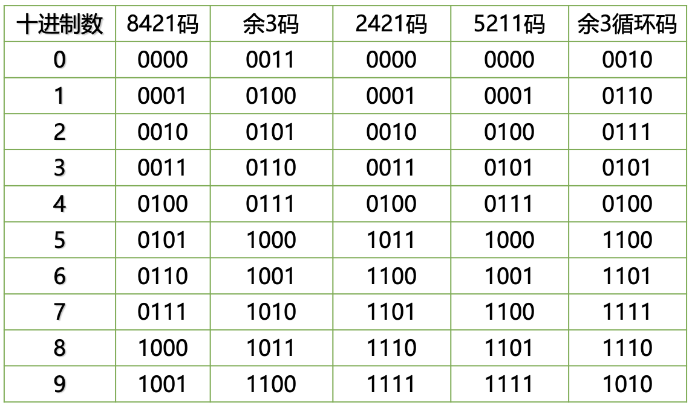
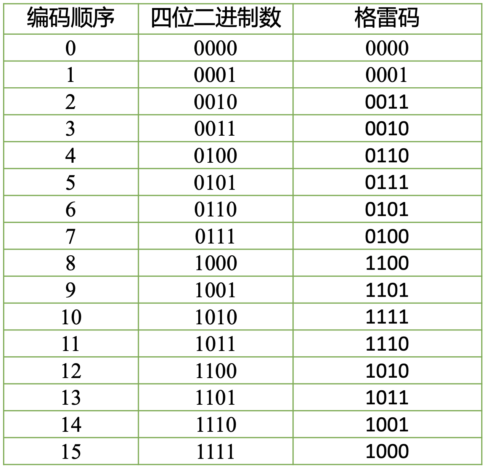

## 编码的概念

广义的编码指的就是将信息从一种形式转换为另一种规范的形式；

对于数字电路，就是将现实世界中的各种物理信息转换为离散的电压序列，来表示、处理和分析信息；

事实上，进位计数制也是一种编码，用不同进制数来表示“量”；

将**数制**与**码制**分开介绍，首先单独讲解数制是因为数制的一个重要的特点是其编码后能够参与算术运算；而一般来说**码制**是对**非数值信息**的表示；

教材中的缩写术语：

- MSB: Most Significant Bit，最高位
- LSB: Least Significant Bit，最低位

## 二进制编码

> 无符号二进制编码只能表示 0 和正数，这里接下来讨论的都是**有符号**数。

（有符号）二进制数：在前面增加一个符号位，0 表示正数，1 表示负数；引入符号位后，一个二进制数的最高位是符号位，符号位的 0 / 1 不代表大小，只是代表正负

有符号二进制数的三种编码表示：

- 原码——Sign Magnitude Representation

  - 正数和 0：普通的二进制数表示
  - 负数：绝对值的二进制数表示加上负号

- 反码——One's Complement

  - 正数和 0： = 原码
  - 负数：原码所有数字位取反

- 补码——Two's Complement
  - 正数和 0： = 原码
  - 负数：=反码+1

$n$ 位补码 $B_{n-1} B_{n-2} B_{n-3}... B_{0}$ 统一表示：

$$
B_{n-1}\cdot(-2^{n-1})+B_{n-2}\cdot2^{n-2}+B_{n-3}\cdot2^{n-3}+...+B_{0}\cdot2^{0}
$$

$n$ 位原码 $B_{n-1} B_{n-2} B_{n-3}... B_{0}$ 统一表示：

$$
B_{n-1}\cdot2^{n-1}+B_{n-2}\cdot2^{n-2}+B_{n-3}\cdot2^{n-3}+...+B_{0}\cdot2^{0}
$$

!!! info 
    补码的补码即为原码

关于原码、反码、补码的易错点：

- 反码取反是指对数字位取反，不改变符号位！
  - 例如 -7 即 1111 的反码是 1000，不是 0000 ！
- 补码是不对称的，例如补码为 1000 代表-8 ，而不代表-0 ！ 即同样位数的二进制补码，负数会比正数“多一个”；
- 补码的“加 1”指的是在最低位加 1 的二进制加法运算，不是指数值 1，即如果含有小数部分，1 是加在整体的最右边；

利用二进制补码运算求解带符号数的加法运算：

1. 分析需要使用多少个数字位；（培养思维习惯！不能忽略！）
2. 用带符号位的二进制数表示，求解每个二进制数的补码；
3. 对补码进行加法运算，再对结果求补码，即为最终结果；

!!! warning
    注意最后一步，对补码进行加法运算时，数字位最高位产生的进位要进到符号位上去！（教材中描述的“舍弃产生的进位”指的是舍弃符号位产生的进位）

### 补码的扩展

将一个 `n` 位补码扩展到 `n+k` 位，只需将最高位符号位复制 `k` 个前置。

### 反码的加法

若最高位产生进位，需要**循环进位**，即最低位“进一位”（`+1`）。

### 无符号数：原码 -> 补码

#### 方法一：

原码**全部**取反，再 `+1`

#### 方法二：

从右向左找到第一个 `1`，这个 `1` 前面的**所有**位取反

若没有 `1`，也就是 `0`，原码=补码

### 负数：补码 -> 原码

!!! warning
    这里只讨论负数的转换，正数不需要转换

#### 方法一：

补码 `-1` ，再取反

#### 方法二：

从右向左找到第一个 `1`，这个 `1` 前面的位取反（**符号位也要变为 0**）

若没有 `1`，也就是 `0`，原码=补码

### 浮点数

IEEE754 标准的 32 位浮点数：

| Sign | Exponent | Mantissa(Fraction) | 表示        |
| ---- | -------- | ------------------ | ----------- |
| 1 位 | 8 位     | 23 位              |             |
|      | 0        | 0                  | 0           |
|      | 511      | 0                  | $\pm\infty$ |
|      | 511      | none zero          | NaN         |

$$
Number=(-1)^{S}(1+F)2^{E-127}
$$

公式中 $F$ 的小数点在最高位前面，将 $E$ 视为无符号二进制数。

## 十进制数的二进制代码

!!! abstract
    十进制代码用四位二进制数（最多可表示 $2^4=16$ 个）来表示 `0`~`9`，没有 `10` :warning:

8421、2421、5211 每个数字指的是每个位的权；

### BCD/8421

8421 码也叫**BCD 码**(Binary Coded Decimal)。可以视为一种压缩编码（相比 `int` 和 `char`）。

**余 3 码**是在 BCD 码即 8421 码的基础上 `+3`，即用 `3`~`12` 对应的二进制数来表示 `0`~`9`；

**余 3 循环码**是取格雷码中的 `3`~`12`；

### 格雷码

教材中的格雷码特指的是四位格雷码，即用四位代码来表示 `0`～`15` 共十六种状态；

#### 编码特点：

- 每一位的状态变化都按一定的顺序循环，以 4 位格雷码为例：
  - `0110`（最低位）
  - `00111100`
  - `0000111111110000`
  - `0000000011111111`（最高位）
    （四位 16 个，只循环半个周期）

其他位数的格雷码表依次类推，自右向左每一位状态循环中连续的 `0` 和 `1` 数目加倍。
按表中顺序变化时，相邻的代码只有一位改变状态，这是格雷码最大的特点和优点；（应用：减少代码转换过程中的过渡噪声）

#### 四维格雷码表

需要熟练掌握！重点是熟悉编码的规则和特点

#### 二进制码与格雷码的映射

二进制码转换成格雷码：

- 最高位相同
- 二进制码从左到右，将相邻 `A`，`B` 两位**异或**（无进位加法），得到格雷码对应的 `B` 位

格雷码转换成二进制码：

- 最高位相同
- 格雷码从左到右，将二进制码上一位 `A`，格雷码当前位 `B` 两位**异或**，得到二进制码对应的 `B` 位

#### 格雷码应用

旋转编码器（Rotate Encoder）

### ASCII 码

美国信息交换标准代码，用 7 位二进制代码（共 128 个）来表示信息，广泛应用于计算机和通信领域中；

在线查询：

- [菜鸟教程](https://www.runoob.com/w3cnote/ascii.html)
- [OSchina](https://tool.oschina.net/commons?type=4)

## 校验

- 奇校验
  - 在二进制串的**末尾**增加一位 `1` 或 `0`，使得整个新二进制的 `1` 的个数为奇数
- 偶校验
  - 在二进制串的**末尾**增加一位 `1` 或 `0`，使得整个新二进制的 `1` 的个数为偶数
