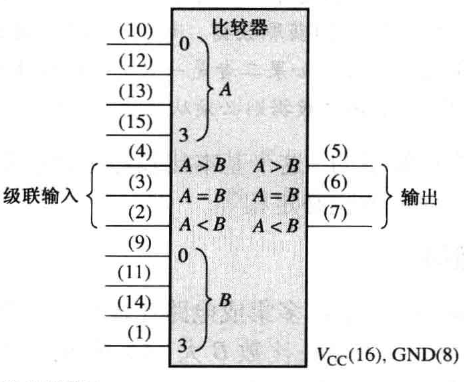
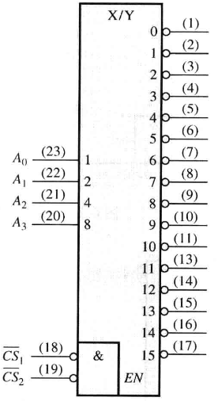

!!! abstract
    基本框架

- 数字电路
  - 组合逻辑电路
    - 以门电路为基本单元
  - 时序逻辑电路
    - 以触发器为基本单元

## 组合逻辑电路基础

!!! abstract
    Programmable Logic Device : PLD —— 可编程逻辑器件

### 特点

功能上，任意时刻的输出仅仅取决于该时刻的输入，与电路原来的状态无关；

结构上，组合逻辑电路不含有存储单元（记忆单元），只有从输入到输出的通路，**没有反馈环路**

### 分析方法

给定一个组合逻辑电路，分析其电路逻辑功能：

1. 根据电路图，从输入到输出逐级分析，得到输出与输入的逻辑函数式；
2. 对得到的逻辑函数式进行化简、形式变换或列出真值表，最后分析其逻辑功能；

### 设计方法

- Step 1：逻辑抽象；
  - 分析因果关系，确定输入/输出变量；
  - 定义逻辑状态的含意（赋值）；
    - 输入和输出都有可能需要多个变量
    - 一个对象有 $k$ 种状态，则可能需要 $n=\lceil\log_2k\rceil$ 个信号来表示；若 $2^n\gt k$，多余的项为**无关项中的约束项**，可以不写在真值表中
  - 列出真值表；
- Step 2：将真值表转换为逻辑函数式；
- Step 3：选定器件类型；
  - 是否有器件类型限制，例如 “只能用与非门” 这类条件；
  - 是否有指定使用的中规模器件，例如 “使用数据选择器” 这类条件；
- Step 4：根据所选器件，对逻辑式进行化简或形式变换；（或进行相应的描述（PLD））
  - 与非门——**与非—与非式**
  - 或非门——**或非—或非式**
- Step 5：画出逻辑电路连接图

## 加法器

### 半加法器

Basic Adders

| A   | B   | $C_{out}$ | $\Sigma$ |
| --- | --- | --------- | -------- |
| 0   | 0   | 0         | 0        |
| 0   | 1   | 0         | 1        |
| 1   | 0   | 0         | 1        |
| 1   | 1   | 1         | 0        |

$$
\begin{aligned}
C_{out}&=AB\\
\Sigma&=A\oplus B
\end{aligned}
$$

门电路实现：

### 全加法器

Full-adder

| A   | B   | $C_{in}$ | $C_{out}$ | $\Sigma$ |
| --- | --- | -------- | --------- | -------- |
| 0   | 0   | 0        | 0         | 0        |
| 0   | 0   | 1        | 0         | 1        |
| 0   | 1   | 0        | 0         | 1        |
| 0   | 1   | 1        | 1         | 0        |
| 1   | 0   | 0        | 0         | 1        |
| 1   | 0   | 1        | 1         | 0        |
| 1   | 1   | 0        | 1         | 0        |
| 1   | 1   | 1        | 1         | 1        |

$$
\begin{aligned}
C_{out}&=AB+(A\oplus B)C_{in}\\
\Sigma&=A\oplus B\oplus C_{in}
\end{aligned}
$$

输出写为这个形式，与半加法器的输出对比，全加法器可以用 **2 个半加法器级联和 1 个或门**实现

门电路实现全加法器：

半加法器实现全加法器：

### 二进制加法器

Parallel Binary Adders

全加法器级联实现，利用了**模块化设计的思想**。

!!! abstract
    模块化思想，或者说集成化思想，是人们不断积累的设计经验。有很多场合下的逻辑问题是具有共性的，为了更方便地设计电路，通常可以将一些具有特定功能、解决某类问题的电路封装打包即集成化，组成一些常用的组合逻辑电路模块（中规模集成器件）；在设计大规模的集成电路时，就可以调用这些典型的电路模块而避免使用复杂且数量巨大的分立的门电路

#### 74LS283

4-bit parallel adder, 4 位二进制加法器

2 个 74LS283 级联可以得到 8 位二进制加法器（8-bit parallel adder）：

4 个全加法器级联实现，但是这样上一级的 $C_{out}$ 到下一级 $C_{in}$ 会存在延迟，级联越多，这样的串行部分产生的延迟越多

全加法器中，令：

$$
\begin{aligned}
C_{g}&=AB\\
C_{p}&=A+B
\end{aligned}
$$

则有：

$$
C_{out}=C_{g}+C_{p}C_{in}
$$

## 比较器

comparator

简单的 1、2 位比较器直接利用异或门可以实现。

位数比较多时，比如 4 位比较器，从高位开始比较，若出现不一样则剩余低位可以不必比较，直接输出结果（大于、小于）否则直到所有位比较完，并且都相等，则输出“相等”

### 74LS85

4 位比较器

- 8 位数据输入，按从 3 到 0 的高位到低位顺序比较
- 3 位级联输入，当本次比较结果为相等时输出级联输入的结果
- 3 位比较结果输出，高电平有效

注意 3 个级联输入: $A<B$ 、$A=B$ 和 $A>B$ 。 这些输入允许几个比较器级联起来，用来比较大于 4 位数字的数。

- 低位比较器的 $A<B$ 、$A =B$ 和 $A>B$ 输出与对应的下一个较高位比较器的级联输入相连接;
- 最低位比较器在 $A=B$ 输入端又必须接高电平，在 $A<B$ 和 $A>B$ 输入端又必须接低电平;

#### 扩展 8 位比较器

2 个 74HC85 扩展为 8 位比较器：

#### 扩展 16 位比较器

5 个 74LS85 扩展为 16 位比较器：

## 译码器(n:m)

decoder

### 74HC154(4:16)

4 位译码器，4 线 - 16 线译码器，也是 4 线 - 16 线解多路复用器

- 4 位输入
- 2 位片选，当且仅当 2 位都为低位时才正常工作
- 16 位输出，低电平有效

#### 扩展

74HC54 扩展实现 5 位输入译码器：

### 74HC42

BCD-十进制译码器，把每 一个 BCD 码(8421 码)转换成 10 个十进制数中的一个数所表示的输出

- 4 位输入，$A_0,A_1,A_2,A_3$ 分别表示 1 2 4 8
- 10 位输出， 低电平有效

### 74LS47

BCD-7 段译码器/驱动器，它把一个 BCD 输入进行译码，并驱动 7 段显示器

- 4 位输入，$A_0,A_1,A_2,A_3$ 分别表示 1 2 4 8 ，**高电平有效**！
- 3 位控制位
  - $\overline{LT}$，输入低电平有效时**试灯**；
  - $\overline{RBI}$，输入低电平有效，且该位当前状态为 `0` 时**灭 `0`**；
  - $\overline{BI}/\overline{RBO}$，输出低电平有效表示该位当前状态为 `0`；
- 7 位输出，**低电平有效**

!!! abstract
    74LS48 与它的区别在于输出的 7 位没有取非，它的输出是高电平有效

#### 灭零

$\overline{LT}\ \overline{RBI}=10$ 时**灭零**。把数字前面的 0 熄灭称为头部灭零，把数字尾端的 0 熄灭称为尾部灭零。只是把不需要的零熄灭！

##### 头部灭零

##### 尾部灭零

#### 试灯

$\overline{LT}=0$ 时试灯，即显示为 `8`。

### 2-4 译码器

### 3-8 译码器

3 线 - 8 线译码器

### :star:74LS138(3:8)

- 3 位输入位为选择位
- 8 位输出位
- 3 位片选位

### 5-32 译码器

可以用 1 个 74LS139 和 4 个 74LS138 实现

## 编码器(n:m)

数字电路中的编码器是在已经实现了非电信号到电信号的转换、模拟信号到数字信号的转换之后对信息进行编码，即此时输入的信号是一组 高、低电平 （1 和 0 ）；

编码器的功能就是根据输入的每一个高、低电平来输出其对应的二进制代码

输入 $n$ 个**电平信号**，至少需要 $\lceil\log_2n\rceil$ 个输出端口，即 $\lceil\log_2n\rceil$ 位二进制编码

### 普通编码器

普通编码器规定了**任意时刻有且只有一个有效输入信号**，作为默认给定的约束条件

#### 十进制-BCD 编码器

#### 8/3 普通编码器

真值表：（不包含无关项）

| $I_0$ | $I_1$ | $I_2$ | $I_3$ | $I_4$ | $I_5$ | $I_6$ | $I_7$ | $Y_2$ | $Y_1$ | $Y_0$ |
| ----- | ----- | ----- | ----- | ----- | ----- | ----- | ----- | ----- | ----- | ----- |
| 1     |       |       |       |       |       |       |       |       |       |       |
|       | 1     |       |       |       |       |       |       |       |       | 1     |
|       |       | 1     |       |       |       |       |       |       | 1     |       |
|       |       |       | 1     |       |       |       |       |       | 1     | 1     |
|       |       |       |       | 1     |       |       |       | 1     |       |       |
|       |       |       |       |       | 1     |       |       | 1     |       | 1     |
|       |       |       |       |       |       | 1     |       | 1     | 1     |       |
|       |       |       |       |       |       |       | 1     | 1     | 1     | 1     |

因为任一时刻只能有一个输入为 1，因此只需要将输入为 1 的变量保留，其余的变量无关（相当于在卡诺图中 x 的方块填入 1 合并消去无关变量）化简为最简与或式：

$$
Y_2=I_4+I_5+I_6+I_7\\
Y_1=I_2+I_3+I_6+I_7\\
Y_0=I_1+I_3+I_5+I_7
$$

从而可画出逻辑电路图：

此设计存在的问题：

- 不能有多个信号同时输入
- 也不能没有信号输入（因为根据我们的约束条件，00000000 也属于无关项）；

因此我们以上的设计只是一个思路的训练，最终的设计结果并不能直接应用到实际当中

### 优先编码器

- 允许多个信号**同时输入**
- 编码时存在**优先顺序**

#### 8/3 优先编码器

规定:

- 高电平输入有效，即输入 1 表示对此输入信号编码，输出的 $Y_2Y_1Y_0$ 即为 0 ~ 7 对应的三位二进制代码 000~111；
- 二进制数大的优先级高，即 $I_7$ 优先级最高，$I_0$ 最低；

真值表：（不包含无关项）

| $I_0$ | $I_1$ | $I_2$ | $I_3$ | $I_4$ | $I_5$ | $I_6$ | $I_7$ | $Y_2$ | $Y_1$ | $Y_0$ |
| ----- | ----- | ----- | ----- | ----- | ----- | ----- | ----- | ----- | ----- | ----- |
| x     | x     | x     | x     | x     | x     | x     | 1     | 1     | 1     | 1     |
| x     | x     | x     | x     | x     | x     | 1     |       | 1     | 1     |       |
| x     | x     | x     | x     | x     | 1     |       |       | 1     |       | 1     |
| x     | x     | x     | x     | 1     |       |       |       | 1     |       |       |
| x     | x     | x     | 1     |       |       |       |       |       | 1     | 1     |
| x     | x     | 1     |       |       |       |       |       |       | 1     |       |
| x     | 1     |       |       |       |       |       |       |       |       | 1     |
| 1     |       |       |       |       |       |       |       |       |       |       |

此真值表不完整！当前只有 $2^8–1$ 行，缺少了一行 00000000 ！

这时存在的问题是，输入全为 0 时输出为 $I_0$ 表示的状态，无法表示输入全为 0 的状态。在实际应用的 8/3 优先编码器中，还附加了其他的输入输出端口，以便于片选和拓展。

!!! info 
    附加了其他的输入输出端口进行片选和拓展的最主要目还是厂家希望产品应用更广泛，同种型号芯片可以实现不同功能

#### 75LS148(8:3)

- 8 位输入，低电平有效
- 1 位片选位 $\overline{EI}$ ，低电平有效，正常工作
- 3 位输出编码，低电平有效:warning:
- 2 位输出有效位
  - $\overline{EO}$ ， $\overline{EI}$ 有效且所有输入都无效时为 0
  - $\overline{GS}$ ， $\overline{EI}$ 无效且任何一个输入有效时为 0

功能表：

| $EI'$ | $I_0'$ | $I_1'$ | $I_2'$ | $I_3'$ | $I_4'$ | $I_5'$ | $I_6'$ | $I_7'$ | $Y_2'$ | $Y_1'$ | $Y_0'$ | $EO'$ | $GS'$ |
| ----- | ------ | ------ | ------ | ------ | ------ | ------ | ------ | ------ | ------ | ------ | ------ | ----- | ----- |
| 1     | x      | x      | x      | x      | x      | x      | x      | x      | 1      | 1      | 1      | 1     | 1     |
|       | 1      | 1      | 1      | 1      | 1      | 1      | 1      | 1      | 1      | 1      | 1      |       | 1     |
|       | x      | x      | x      | x      | x      | x      | x      |        |        |        |        | 1     |       |
|       | x      | x      | x      | x      | x      | x      |        | 1      |        |        | 1      | 1     |       |
|       | x      | x      | x      | x      | x      |        | 1      | 1      |        | 1      |        | 1     |       |
|       | x      | x      | x      | x      |        | 1      | 1      | 1      |        | 1      | 1      | 1     |       |
|       | x      | x      | x      |        | 1      | 1      | 1      | 1      | 1      |        |        | 1     |       |
|       | x      | x      |        | 1      | 1      | 1      | 1      | 1      | 1      |        | 1      | 1     |       |
|       | x      |        | 1      | 1      | 1      | 1      | 1      | 1      | 1      | 1      |        | 1     |       |
|       |        | 1      | 1      | 1      | 1      | 1      | 1      | 1      | 1      | 1      | 1      | 1     |       |

##### 扩展

2 个 74LS148 实现 16 线 - 4 线编码器：

## 多路复用器(n:1)

（Mux）**多路复用器**（Multiplexer）或**数据选择器**（Data Selector），能够实现**并行**数据到**串行**数据的转化。

包括：

- 数据选择位（低电平有效）
- 数据输入位
- 数据输出位

此时数据输入输出位不必再关心是否低电平有效

### 4 路复用器

- 2 位数据选择位 $\overline{S_0},\overline{S_1}$ ，低电平有效
- 4 位数据输入位 $D_0,D_1,D_2,D_3$；
- 1 位数据输出位 $Y$；

$$
Y=\overline{S_1S_0}D_0+\overline{S_1}S_0D_1+S_1\overline{S_0}D_0+S_1S_0D_1
$$

### 8 路复用器

$$
\begin{aligned}
Y&=\overline{S_3S_2S_1S_0}D_0+\overline{S_3S_2S_1}S_0D_1+\overline{S_3S_2}S_1\overline{S_0}D_2+\overline{S_3S_2S_1S_0}D_3
\end{aligned}
$$

### 74LS151

#### 扩展 16 路复用器

2 个 74LS151 扩展实现 16 路复用器

### 74LS153

双 4 选 1 数据选择器，也就是 2 组 4 选 1 共用同一个选择输入和同一个片选输入。

### 74LS157

四 2 选 1 数据选择器，也就是 4 组 2 选 1 共用同一个选择输入和同一个片选输入。

- 1 位片选输入，电平有效
- 1 位选择输入
- 8 位数据输入
- 4 位数据输出

### 7 段显示多路复用器

把 BCD 数字分配到一个 7 段显示器上的一个简单方法

### :star:扩展

2 个 4 选 1 扩展为 8 选 1

1 个 4 选 1 + 门电路扩展为 5 选 1

5 个 4 选 1 扩展为 16 选 1 （:star:树状扩展）

### :star:实现门电路

## 解多路复用器(1:n)

**解多路分配器**（Demultiplexer）或**数据分配器**（）

!!! info 
    数据选择器的逆

### 1 线-4 线多路分配器

### 74HC154

4 位译码器 74HC154 可以作为 4 线 - 16 线解多路复用器

## 传输时延与竞争冒险

!!! abstract
    - 毛刺 glitch
- 竞争 race
- 冒险 hazard

时延导致竞争的存在，竞争可能产生毛刺，竞争导致了逻辑误判，就是**冒险**

### 消除冒险的方法

#### 滤波电容

#### 冗余项
