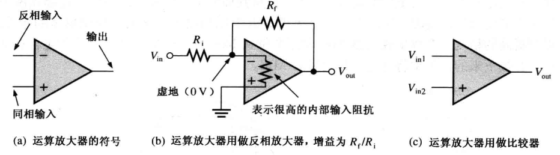
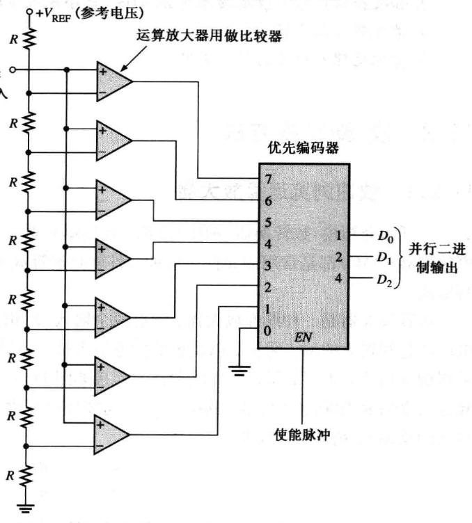
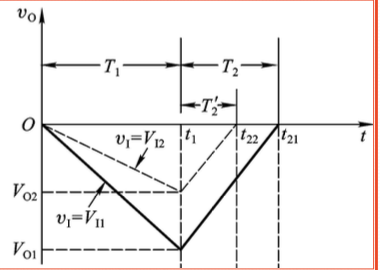
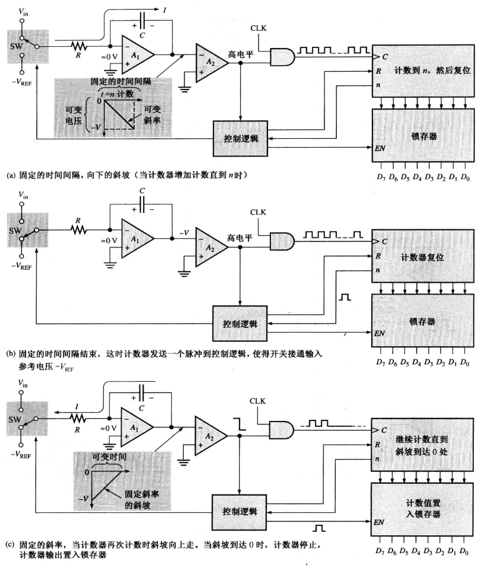
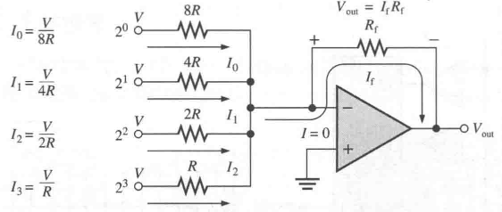
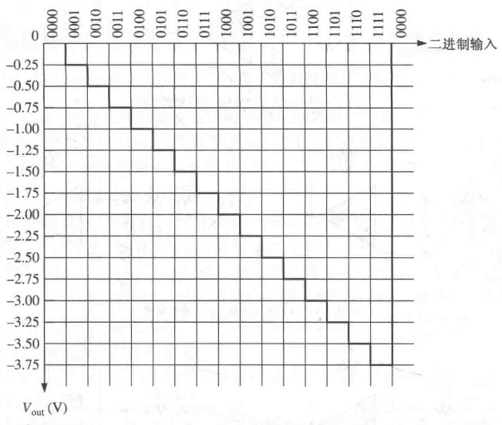
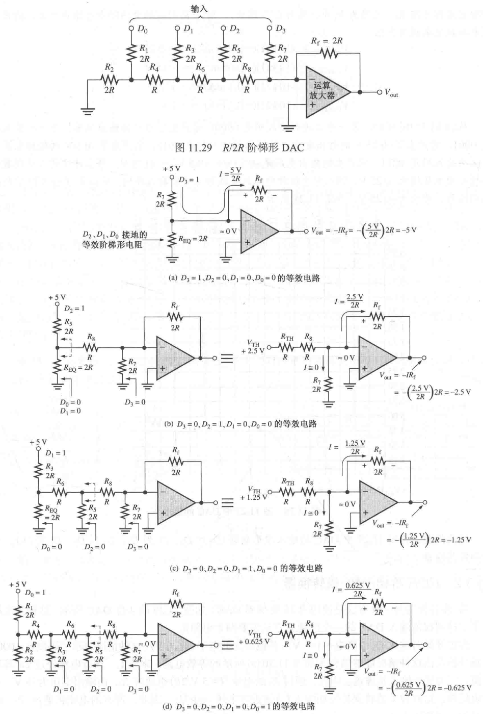

## 采样定理

略

## ADC

### 运算放大器

运算放大器是一种线性放大器。

- 两个输入
  - 反相
  - 同相
- 和一个输出

特点：

- 很高的电压增益
- 很大的输入阻抗
- 很低的输出阻抗

运算放大器的 3 种使用方式：

用做反相放大器时，图中，**虚地**处电压为 0 V ，由于很大的输入阻抗没有电流流入运算放大器，输入电压处 $V_{in}$ 所有电流流向输出电压处 $V_{out}$ ，可得：

$$
\frac{V_{out}}{V_{in}}=-\frac{R_f}{R_i}
$$

其中 $R_f$ 是反馈电阻，$R_i$ 是输入电阻。

其 中 $\frac{V_{out}}{V_{in}}$ 是**闭环电压增益**(闭环是指由电阻 R，提供的从输出到输入的反馈)，负号表示反相。

### 快速 ADC

3 位快速 ADC：

每个比较器的参考电压都由电阻分压电路设定。每个比较器的输出都连接到优先权编码器的一个输入。编码器由 EN 输入上的一个脉冲使能，3 位码表示出现在编码器输出上的输入值。 二进制数由最高级别输入的高电平决定。 二进制数的序列表示 ADC 的输入，每次使能脉冲有效的期间，输入信号得到采样。转换的精度由 2 个因素确定：

- 使能脉冲的频率
- 二进制编码的位数

### 双积分 ADC

一个斜坡发生器(积分器)用来产生双积分特性。本质是在一个计数器进位的时间周期内，信号对电容充电，然后在恒定的电容放电速度下，在放电时间内计数器计数实现对这一信号电压大小的量化。

这里可变斜率由 $V_{in}$ 的大小决定，越大则可变斜率越大，电容充电速度越快。而电容放电的速度是固定的。

由于需要充电、放电，所以 DAC 相对较慢，而且该方法要求采样保持时间足够长。

## DAC

### 二进制权值输入 DAC

输入的高电平电压若为 5 V ，输出：

### R/2R 阶梯形 DAC

!!! abstract
    这里利用了戴维南定理等效电路

该方法结构更加精简，容易实现。

$n$ 输入的高电平电压若为 $V_i$ ，则输出电压为从 $0$ 到 $V_i$ ，以 $\frac{V_i}{2^n}$ 为间隔，依次对应输入信号的 0 到 $2^n-1$。

