## 基本概念

!!! 可能会在选择填空题中考察

- 上拉—— 使输出钳位至高电平
- 下拉—— 使输出钳位至低电平；

- 灌电流—— 输出为低电平时，负载电流从外部电路注入输出端口；
- 拉电流—— 输出为高电平时，负载电流从输出端口流出到外部电路；

当门电路没有外部的有源输入信号，而是输入端口与地之间接入一个电阻时：

- 关门电阻—— 能够维持门电路输出高电平的电阻的最大值；
- 开门电阻—— 能够维持门电路输出低电平的电阻的最小值；

（联想 TTL 反相器的输入端负载特性曲线）

- 扇入系数—— 门电路允许的输入端的个数；
- 扇出系数—— 门电路允许驱动的同类型负载门的个数；

- 高阻态—— 从输出端口往里看的等效电阻近似无穷大，门电路失去对输出电压的控制，输出端口处电平由外部电路决定，即门电路与后级电路无联系；

- 传输延迟时间—— 由于半导体器件寄生电容的存在，输出量的变化总是滞后于输入量的变化；

- 输入端噪声容限—— 能够维持输出电压在规定高低电平范围内的输入电压的波动范围；

- 缓冲级—— 多级集成门电路应用中为了保持输入输出特性一致性输入级和输出级各加一级反相器；

## 基本逻辑元件

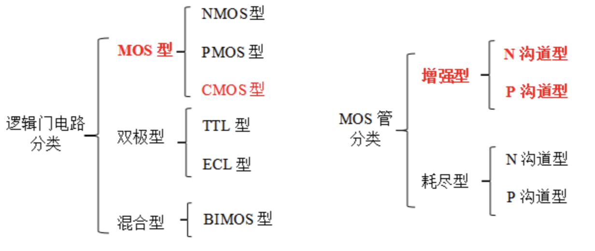

### 与门 AND

$$
X=AB
$$

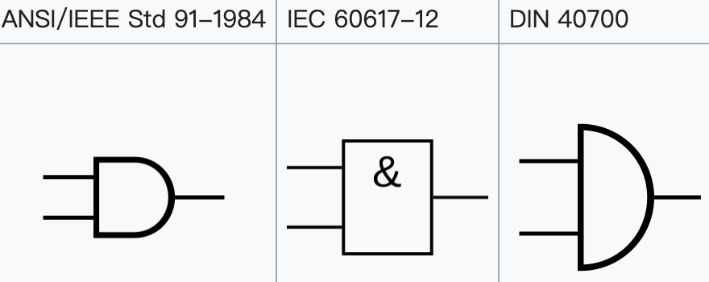

与非门 NAND 构造与门 AND ：

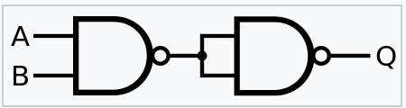

或非门 NOR 构造与门 AND ：

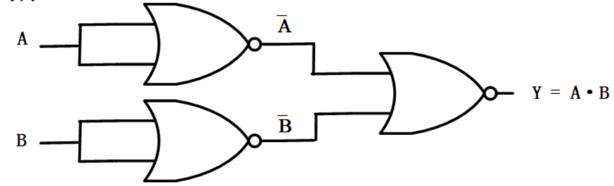

### 或门 OR

$$
X=A+B
$$

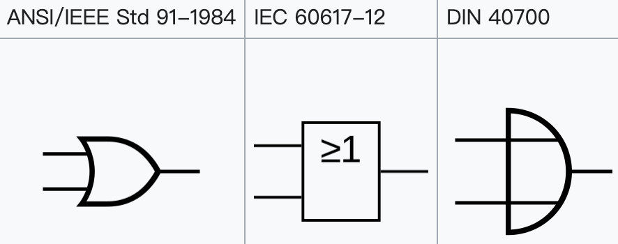

与非门 NAND 构造或门 OR ：

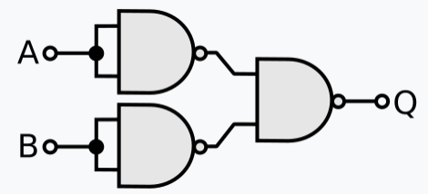

或非门 NOR 构造或门 OR ：

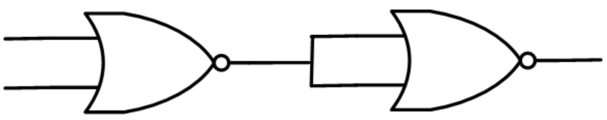

### 非门 Inverter

也叫反相器

$$
Y=\overline{X}
$$

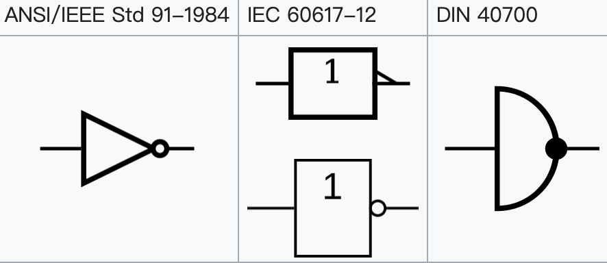

与非门 NAND 构造非门 Inverter ：

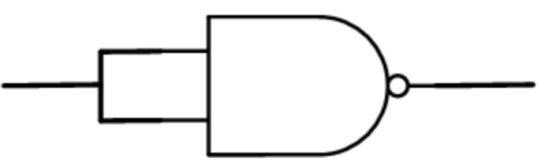

或非门 NOR 构造非门 Inverter ：

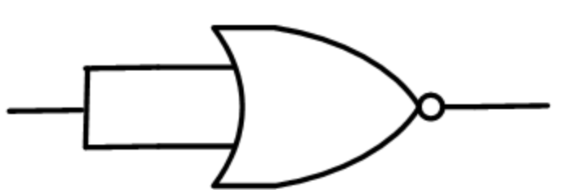

### 与非门 NAND

等价于 Negative-OR

$$
X=\overline{AB}
$$

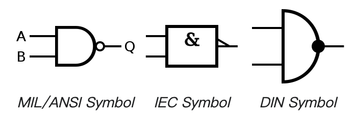

两个输入的与非门真值表：

| 输入 1 | 输入 2 | 输出 |
| ------ | ------ | ---- |
| 0      | 0      | 1    |
| 0      | 1      | 1    |
| 1      | 0      | 1    |
| 1      | 1      | 0    |

对于 n 个输入的与非门，**当且仅当输入全部为 1 时，输出为 0** ，其余情况输出均为 1 ；或者说**任何一个输入为 0 ，则输出为 1** 。

**与非门可以实现与门、或门、非门、或非门**

NOR 门来实现 NAND 门：

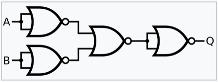

### 或非门 NOR

等价于 Negative-AND

$$
X=\overline{A+B}
$$

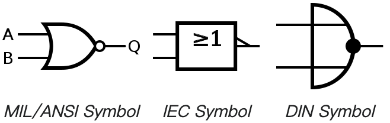

两个输入的或非门真值表：

| 输入 1 | 输入 2 | 输出 |
| ------ | ------ | ---- |
| 0      | 0      | 1    |
| 0      | 1      | 0    |
| 1      | 0      | 0    |
| 1      | 1      | 0    |

对于 n 个输入的或非门，**当且仅当输入全部为 0 时，输出为 1** ，其余情况输出均为 0 ；或者说**任何一个输入为 1 ，则输出为 0** 。

**或非门可以实现与门、或门、非门、或非门**

NAND 门来实现 NOR 门：

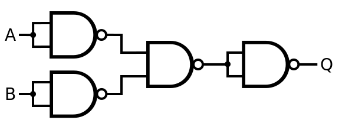

### 异或门 XOR

Exclusive-OR

**XOR** ([/ˌɛks ˈɔːr/](https://en.wikipedia.org/wiki/Help:IPA/English), [/ˌɛks ˈɔː/](https://en.wikipedia.org/wiki/Help:IPA/English), [/ˈksɔːr/](https://en.wikipedia.org/wiki/Help:IPA/English) or [/ˈksɔː/](https://en.wikipedia.org/wiki/Help:IPA/English)), **EOR**, **EXOR**, , , , **⩛**, , , .

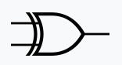

两个输入的或非门真值表：

| 输入 1 | 输入 2 | 输出 |
| ------ | ------ | ---- |
| 0      | 0      | 0    |
| 0      | 1      | 1    |
| 1      | 0      | 1    |
| 1      | 1      | 0    |

对于 n 个输入的异或门，**当且仅当输入不同时，输出为 1** ；输入相同时，输出为 0

异或门可以作为**半加法器**，输出为进位

### 同或门 XNOR

Exclusive-NOR

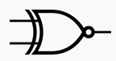

两个输入的或非门真值表：

| 输入 1 | 输入 2 | 输出 |
| ------ | ------ | ---- |
| 0      | 0      | 1    |
| 0      | 1      | 0    |
| 1      | 0      | 0    |
| 1      | 1      | 1    |

对于 n 个输入的同或门，**当且仅当输入相同时，输出为 1** ；输入不同时，输出为 0

## 门电路逻辑功能的分析与设计

一个 CMOS 门电路的构成：

- 上拉部分
  - 由 PMOS 管实现，导通对应输入低电平，输出高电平
- 下拉部分
  - 由 NMOS 管实现，导通对应输入高电平，输出低电平

逻辑功能上：

- 与运算对应到电路中就是串联结构
- 或运算对应到电路中就是并联结构

根据前面的基本设计思想，当含有多个输入变量时，只需要：

- 根据其逻辑输出为 0 时设计下拉部分电路

  - （或先根据其逻辑输出为 1 时设计上拉部分电路，输入变量取反），

- 然后根据对称性绘制另一侧的上/下拉电路（串变为并，并变为串）
- 组合在一起即可；

## 门电路的输入特性与输出特性

## 门电路的输入端负载特性

## OD 门 / OC 门外接上拉电阻的计算分析
