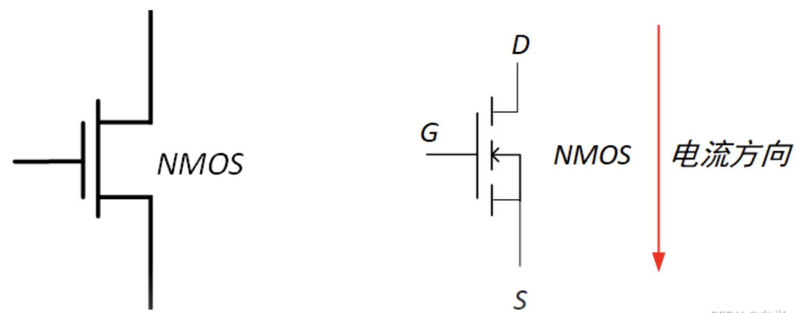
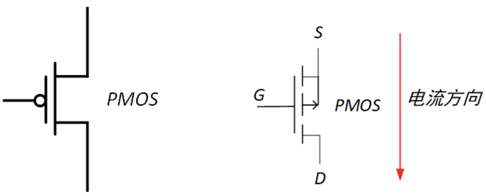

## 逻辑电平规范与抗噪

### 逻辑电平规范

> :star:保证输出的电平作为下一级输入是有效的

#### CMOS

#### TTL

### 噪声容限

> :star:保证输出的电平作为下一级输入是有效的基础上，输出与输入的界限相差即为噪声容限

电路抗噪度的一个衡量标准叫做**噪声容限**(noisemargin)，用伏特表示。对于一个给定的逻辑电路，有两个噪声容限值：

- 噪声容限高电平 ($V_{NH}$) (Noisemargin High)
- 噪声容限低电平 ($V_{NL}$) (Noisemargin Low)

这两个参数由如下的公式定义：

$$
V_{NH}=V_{OH(\min)}-V_{IH(\min)}\\
V_{NL}=V_{IL(\max)}-V_{OL(\max)}
$$

> 有时看到噪声容限是用 $V_{CC}$ 的百分比来表示的

## 负载和扇出

当一个逻辑门的输出连接到了一个或多个其他门的输人时，驱动门上就会有一个负载，对于一个给定的门，它可以驱动的负载门输人是有数量限制的。这个限制就称为这个门的**扇出**。

基本概念：

- **灌电流** —— 输出为低电平时，负载电流从外部电路注入输出端口；
- **拉电流** —— 输出为高电平时，负载电流从输出端口流出到外部电路；
- **扇入系数** —— 门电路允许的输入端的个数；
- **扇出系数** —— 门电路允许驱动的同类型负载门的个数；

### CMOS

当驱动门的输出是高电平时，负载门的输入电容通过驱动门的输出电阻充电。当驱动门电路的输出是低电平时，电容放电：

如果给驱动门的输出添加更多的负载门输人，那么总的电容将会增加，因为输入电容实际上是并行出现的。电容的增加会延长充电和放电时间，因此就会降低这个门电路的最大工作频率。因此，CMOS 门电路的扇出是和工作频率有关的。负载门输入越少，最大频率就越高。

### TTL

TTL 驱动门向处于高电平状态的负载门提供**灌电流** ($I_{IH}$)，从处于低电平状态的负载门吸收**拉电流** ($I_{IL}$)。

TTL 电路的功耗在工作频率的范围以内基本上是恒定功率。

负载元件越多，驱动门承载的灌电流或拉电流就越大，驱动门中内阻的压降就越大，要保证不能脱离标准逻辑电平，限制了扇出。

## CMOS

!!! abstract
    数字电路中只考虑**增强型** MOS 管

### NMOS

NMOSFET，N 型金氧半场效晶体管

N 沟道增强型 MOS 管，箭头往里走，栅级无圆圈

左侧是简化符号，右侧是标准符号

| 状态 | 栅级 G | 漏级 D | 源级 S (接地) |
| ---- | ------ | ------ | ------------- |
| 导通 | 1      | 0      | 1             |
| 关闭 | 0      | 1      | 0             |

### PMOS

PMOSFET，P 型金氧半场效晶体管

P 沟道增强型 MOS 管，箭头往外走，栅级有圆圈

左侧是简化符号，右侧是标准符号

| 状态 | 栅级 G | 漏级 D | 源级 S (接电源) |
| ---- | ------ | ------ | --------------- |
| 导通 | 0      | 1      | 0               |
| 关闭 | 1      | 0      | 1               |

### CMOS

由 NMOS 和 PMOS 两种管子组成的互补 MOS 电路，即 CMOS 电路。

CMOS 电路元件不使用的管脚尽量不能悬空:warning:

#### 非门

#### 与非门

!!! abstract
    或非门和与非门之间存在对偶关系，将 NMOS 和 PMOS 交换、高电平和低电平交换，就能够相互转换

#### 或非门

#### 三态门

三态门引入了**高阻抗状态**。

三态门的 3 个状态如下：

一个错误 ❌ 的三态 CMOS 反相器：

$\overline{Enable}$ 和输入是对称设计的，所以输入为高电平时，输出也一样处于高阻抗状态。

正确设计：

#### 漏极开路门

> Open-drain，OD 门

术语**漏极开路**的意思是输出晶体管的漏极端没有连接，必须从外部通过负载连接到 $V_{DD}$。

实现大负载

与非门示例：

## TTL

TTL 电路中悬空的输入端将起到**高电平**的效果。

TTL 电路元件不使用的管脚尽量不能悬空:warning:，避免噪声影响。

### 双极型晶体管

Bipoplar Junction Transistor (BJT) (三极管)

开关效应原理图：

### TTL 门电路

#### 非门

工作原理如下：

#### 与非门

### 集电极开路门

> Open-Collector Gates，OC 门

驱动 LED 和灯泡：

