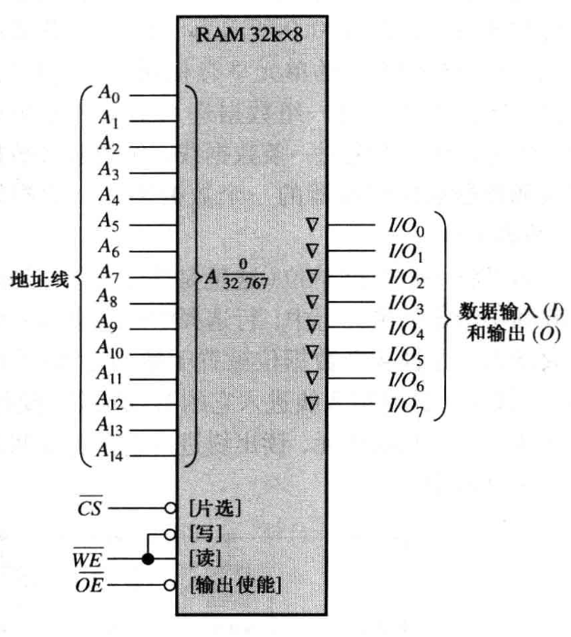
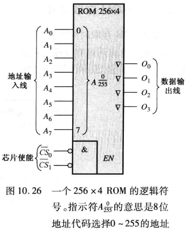
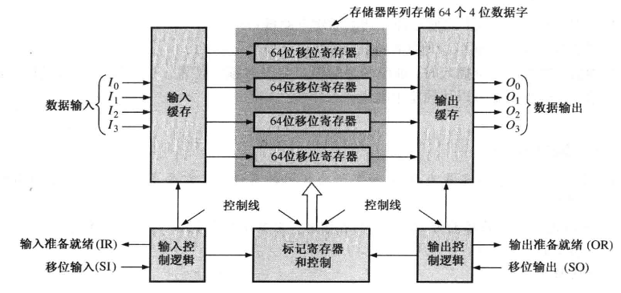

两类主要的半导体存储器是 RAM 和 ROM。

- RAM (随机访问存储器) 类型的存储器在等量时间内可以访问所有的地址，并且可以按照任何顺序来选择这些地址以执行读或者写操作。所有的 RAM 都具有读和写的能力。因为 RAM 在电源关闭时会丢失所存储的数据，所以它是易失性内存。 RAM 系列 RAM 的两种类别是静 RAM (SRAM) 和动态 RAM (DRAM) 。当直流电源移走后， SRAM 和 DRAM 都会丢失存储的数据，因此被归类为易失性存储器。
  - 静态 RAM 通常使用锁存器作为存储元件，因而只要加上直流电源，就可以永远地存储数据。
    - 异步 SRAM (ASRAM)
    - 同步 SRAM (SB SRAM)，具有突发特性
  - 动态 RAM 使用电容作为存储元件，如果没有对电容再充电就不能长期存储数据，再充电则称为刷新过程。
    - 快速页模式 DRAM (FPMDRAM)
    - 扩充数据输出 DRAM (EDO DRAM)
    - 突发 EDO DRAM (BEDO DRAM)
    - 同步 DRAM (SDRAM)
- ROM (只读存储器) 类型的存储器将永久或者半永久地保存数据。数据可以从 ROM 中读出，但是和 RAM 不同，它没有写操作。ROM 和 RAM 相似，也是随机存储器，但是术语 RAM 的 传统意思是随机读/写存储器。本章将会介绍几种类型的 RAM 和 ROM。因为 ROM 在电源关闭 后仍然保存着数据，所以它是永久性存储器
  - MROM (Mask ROM) —— 掩膜 ROM，出场时已经固定，不能更改，适合大量生产，简单，便宜，非易失性。
  - PROM —— 可一次性编程 ROM
  - EPROM —— 可擦除 PROM，也就是可多次编程
  - UV EPROM —— 紫外线版本的 EPROM
  - EEPROM —— 电版本的

!!! abstract
    对于给定的物理空间和成本，DRAM 可以存储比 SRAM 多得多的数据，因为 DRAM 单元更加简单，并在给定芯片面积里，因此可以比 SRAM 填充更多的单元

## RAM

### SRAM

SRAM 基本单元（是 D-触发器 ）：

$32k\times8$ SRAM

逻辑组成如下：

读：

写：

### DRAM

DRAM 的基本单元，使用电容，电容充电表示 1 高电位，放电表示 0 低电位。

DRAM 的 4 种基本操作：

$1M\times1$ DRAM 逻辑图：

DRAM 的读写周期：

## ROM

ROM（Read Only Memory）,即只读存储器，由于其在掉电后数据不会丢失，因此在早期的时候，ROM 芯片中的内容一般都是在生产的时候被烧写进去的，然后终生具有这些固定的内容。不过，随着技术的不断发展和革新，现在很多型号的 ROM 都已经可以被多次修改了，但是大家仍然习惯对其沿用“只读存储器”的称号。

### MOS ROM

MOS ROM 基本单元：

### ROM 设计组合逻辑电路

实际上是枚举所有的输入输出，也就是真值表，存储到 ROM 里。

输入作为地址，通过**地址译码器**，输出相应地址的数据。

- 有黑点 ⚫️ 表示存储 1 ；
- 否则表示存储 0 ；

给出逻辑表达式（函数）时，求出标准的极小值只和的形式，依据极小值的下标确定画 ⚫️ 的位置

### PROM

PROM（Programmable Read Only Memory）,即可编程只读存储器，不过它也只能被程序写一次，以后就只能保存和使用这些数据了，所以 PROM 也称为一次可编程存储器。

### EPROM

EPROM（Erasable Programmable Read Only Memory），即可擦除可编程只读存储器。它解决了 PROM 只能编程一次的问题，不过其存储内容的擦除必须借助紫外线的长时间照射才能完成，所以 EPROM 又叫紫外线擦除可编程只读存储器。

### EEPROM

EEPROM（Electrically Erasable Programmable Read Only Memory），即电可擦除可编程只读存储器。它克服了 EPROM 在擦除时较为麻烦的问题，可以直接通过计算机程序对其进行重复的擦写，其擦除、重写的原理是通过使用高于常规的操作电压实现的。对于 EEPROM 来说，最重要的参数指标就是寿命问题，也就是可擦写的次数。

### 闪存

闪存 Flash Memory 是 EEPROM 的一种特殊形式，也就是变种。

EEPROM 的擦除和重写都是针对整个芯片而言的，但 Flash 的数据删除和重写则是以块（块的容量一般在 256KB~20MB 之间）为单位的，因此 Flash 的更新速度要远比 EEPROM 快。不过由于数据的删除和重写不是以单个字节为单位的，因此 Flash 仍不能达到 RAM 的要求。

Flash 又分为 NOR 型和 NAND 型两个大类，其中 NOR 型具有独立的地址线和数据线，适合频繁的随机读、写场合，适合程序代码的存储和直接运行，但容量通常较小，价格也比较贵；而 NAND 型的地址线和数据线是公用的，因此其本身的操作速度和频率就会偏低，但是容量相对较大，且价格也要便宜，所以适合大量资料的存储。

## 存储器扩展

### 字长扩展

共享数据线和控制线，并联数据线。

2 个 $64k\times4$ ROM 的字长扩展得到个 $64k\times8$ ROM ：

### 字容量扩展

:bulb: 利用**译码器**

### 字长字扩展结合

## 特殊存储器

### FIFO

FIFO 寄存器模块的应用，实现数据整型：

### LIFO

类似栈的效果，LIFO 寄存器结构：

