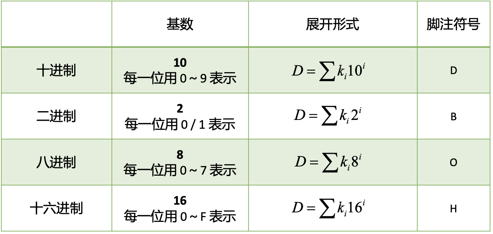

## 数制

### 数制的概念

数制 (numerical system)，又称“计数制”，指用一组固定的符号和统一的规则来表示数值的方法；

数制关注的内容：每一位的构成（使用什么符号即数码）和进位的规则；

基本概念：

- 基数—— 使用的数码的个数，即每一位最多能用多少个符号来表示；基数是 N 则称为 N 进制， 即“逢 N 进一”
- 权—— 每一位的 1 代表的大小；

### 常用数制

### 不同进制的转换

#### 其他进制 -> 十进制

只需要按照 $D=\sum k_i N^i$ 展开即可；

- $k_i$ 为第 i 位的系数
- $N^i$ 为第 i 位的权
- $N$ 为基数

#### 十进制 -> 二进制

##### 整数部分

反复除 2 取余数，**倒排**（从右向左排列）（从低位到高位排列）；

##### 小数部分

反复乘 2 取整数部分，**正排**（从左向右排列）（从高位到低位排列）；

#### 二进制 -> 十六进制

##### 整数部分

从右向左（从低位到高位）每四个划为一组（不够的在左边补 0 ），

##### 小数部分

从左向右（从高位到低位）每四个划为一组（不够的在右边补 0 ）；

#### 二进制 -> 八进制

##### 整数部分

从右向左（从低位到高位）每三个划为一组（不够的在左边补 0 ），

##### 小数部分

从左向右（从高位到低位）每三个划为一组（不够的在右边补 0 ）；

#### 十六进制 -> 二进制

将每一位用对应的四位二进制数代替即可

#### 八进制 -> 二进制

将每一位用对应的三位二进制数代替即可

#### 十进制 -> 八进制、十六进制

先转换为二进制，再将二进制转换为八进制、十六进制

#### 八进制 <-> 十六进制

先转换为二进制，再将二进制转换为目标进制

## 二进制

### 二进制算术运算

特点：

- 和十进制算数运算的规则基本相同，区别在于“逢二进一”
- 乘法和除法可以转化为移位操作与加减操作
- 通过补码运算（即将引入的概念），可以将减法运算转换为加法运算；

因此，数字电路普遍采用二进制进行算术运算
