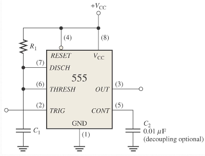
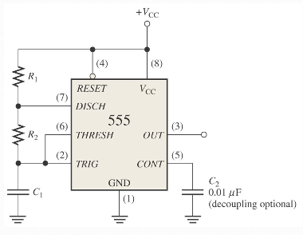
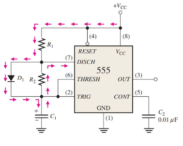
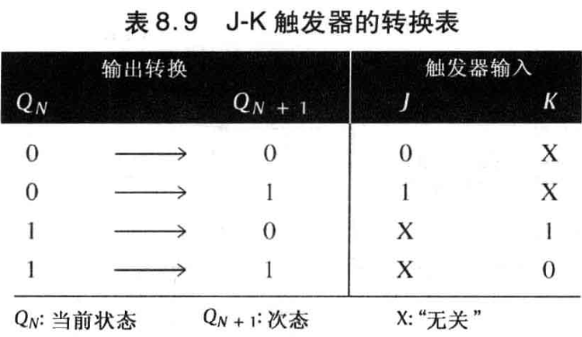

## 基础元件

### 555 Timer

> 可能会考哦

mono-stable one-shot (单稳态触发器)

非稳态延续时间：

$$
t_w=1.1R_1C_1
$$

astable multi-vibration oscillator (非稳态多谐振荡器)

$$
t_H=0.7R_1C_1\\
t_L=1.4R_2C_1
$$

频率：

$$
f=\frac{1.44}{(R_1+2R_2)C_1}\\
$$

占空比（Duty Cycle）$DC$（非空/周期）：

$$
DC=\big(\frac{R_1+R_2}{R_1+2R_2}\big)100\%
$$

上述公式中 $DC\gt\frac{1}{2}$，若要设计 50% 占空比的振荡器，如下图所示：

$$
t_H=0.7R_1C_1\\
t_L=0.7R_2C_1
$$

### S-R 触发器

$$
Q^{n+1}=S+\overline{R}Q^{n}
$$

### D 触发器

$$
Q'=D
$$

$GATE$ 高电平有效使能：

$$
Q^{n+1}=GATE\cdot D+\overline{GATE}\cdot Q^{n}
$$

### :star:J-K 触发器

$$
Q^{n+1}=J\overline{Q^{n}}+Q^{n}\overline{K}
$$

## 设计

### 思路一

1. State Diagram 状态转移图
   - 有多少状态决定使用多少触发器，$n$ 个状态应使用 $\lceil\log_2n\rceil$
2. Next-State Table 次态表（状态转移表）
3. Flip-Flop Transition Table 触发器转换表，由触发器特性方程决定
4. Karnaugh Maps 根据次态表、触发器转换表画出卡诺图
5. Locgi Expressions for Flip-Flop Inputs 根据卡诺图化简得到逻辑表达式
6. Counter Implementation 根据逻辑表达式设计逻辑电路

### 思路二

每一个输入也要视为一个状态位（类似于 $Q$ ）来画卡诺图

卡诺图每一个格子内容为：

$$
Q^{n+1}_3Q^{n+1}_2Q^{n+1}_1Q^{n+1}_0/C
$$

对于不可能的情况，也就是无关项，那么 5 个值统一为 X ，也就是：$XXXX/X$。

将内容拆开，则对应地画出 5 个卡诺图，然后分别化简，则能够得到：

- 4 个状态 (转移) 方程
- 1 个状态输出方程

再根据选定的触发器的特性方程，则可以写出各个触发器的各个输入的驱动方程以及输出方程

在一些芯片上，计数使能被简单地标记为 CTEN (或者一些诸如 G 之类的其他名称)， 终端计数 (TC) 和一些 IC 计数器上的异步 (行波) 时钟输出 (RCO) 比较相似

一些计数器：

- 74HC161 十六进制计数器
- 74HC190 十进制计数器
