## 串行输入/串行输出

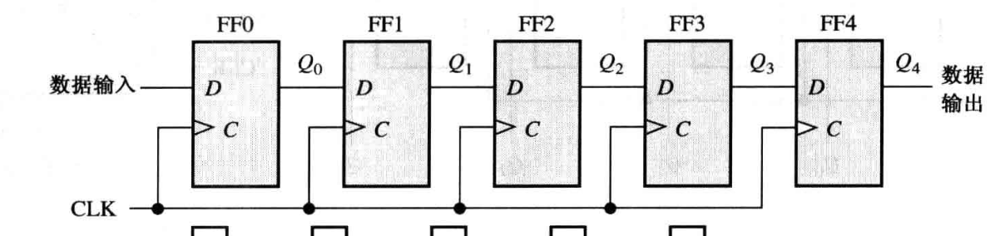

## 串行输入/并行输出

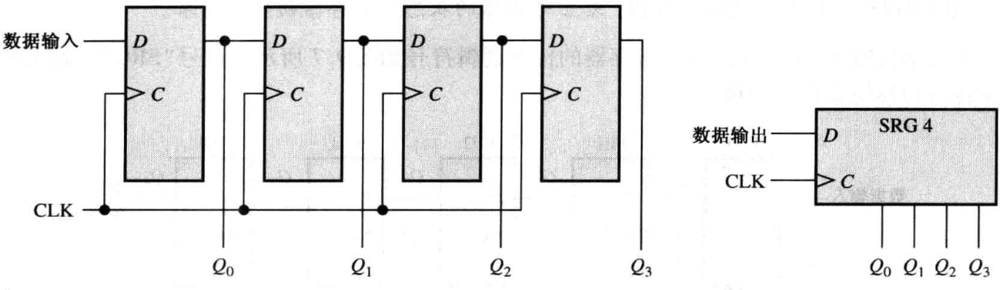

## 并行输入/串行输出

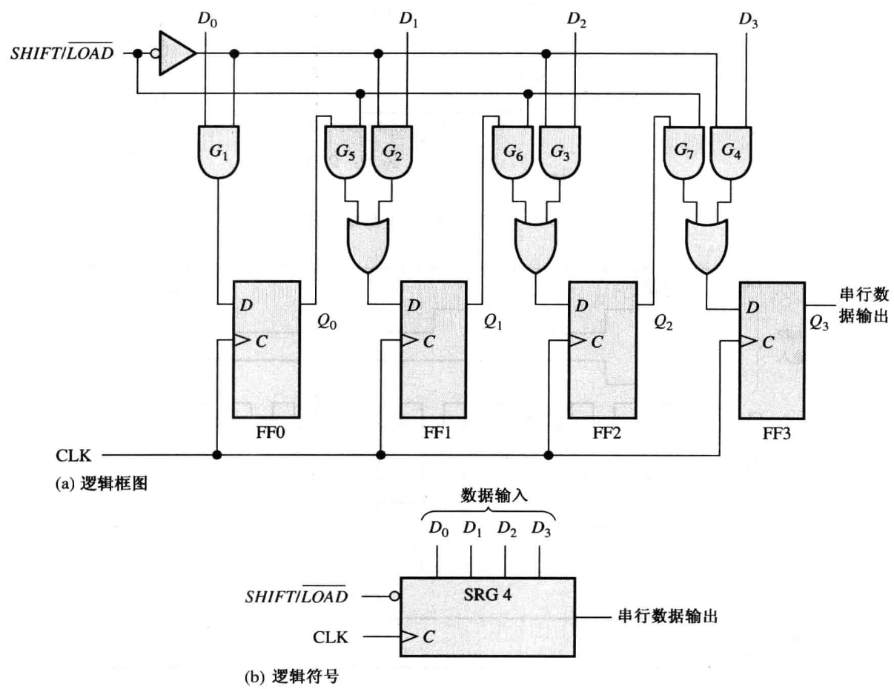

## 并行输入/并行输出

最简单

## 双向移位寄存器

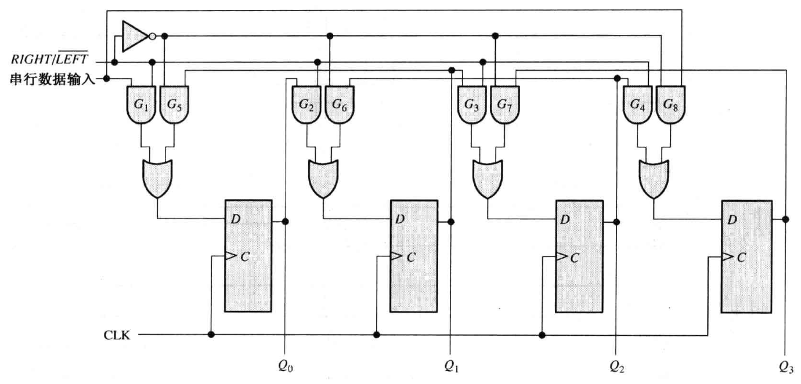

### 74HC194

通用 4 位双向移位寄存器

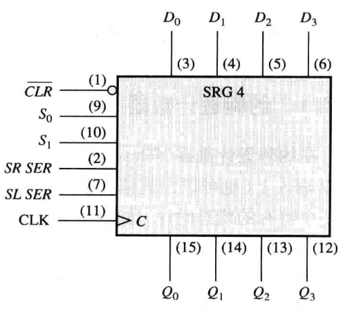

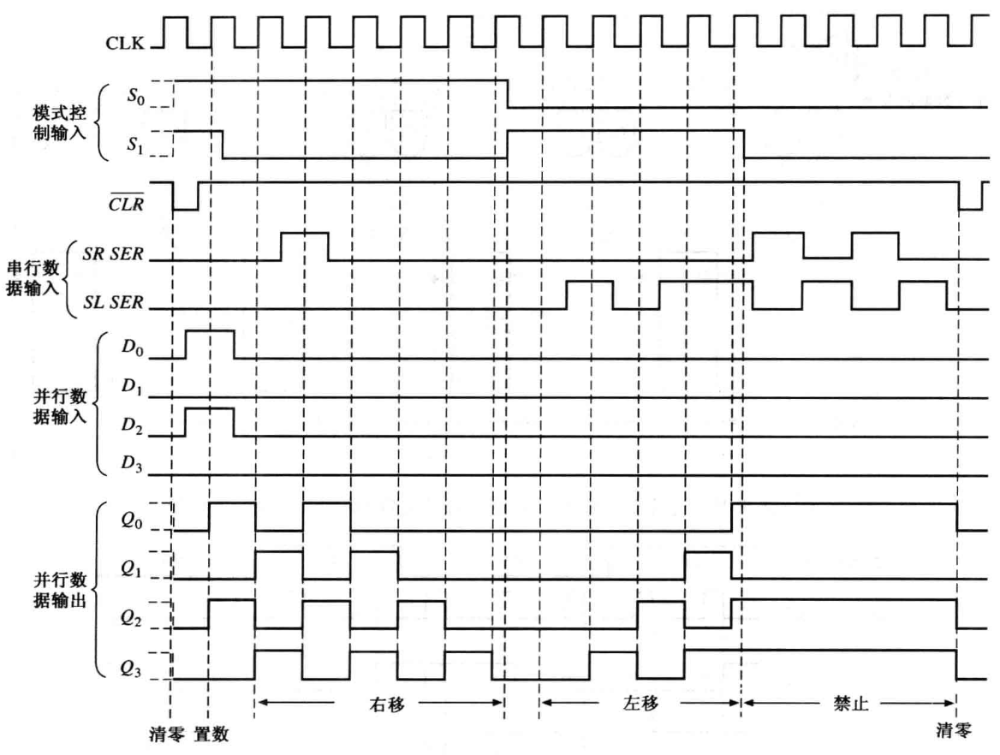

## 移位寄存器计数器

### 约翰逊计数器

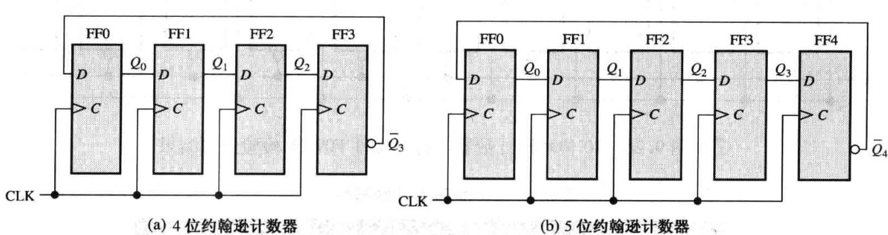

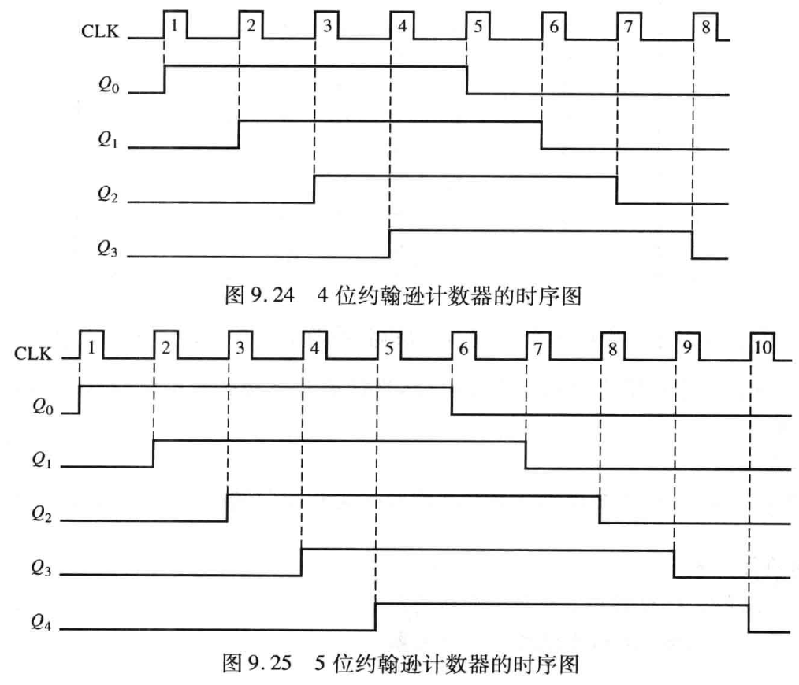

一般来说，约翰逊计 数器将会产生模 $2n$ ，其中 $n$ 是计数器中级的个数

### 环形计数器

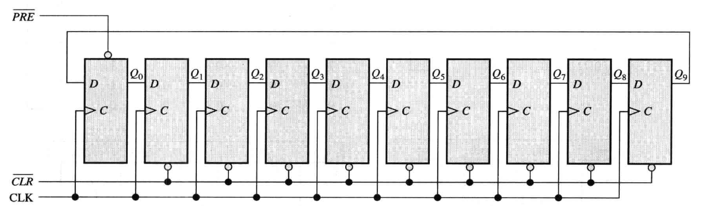

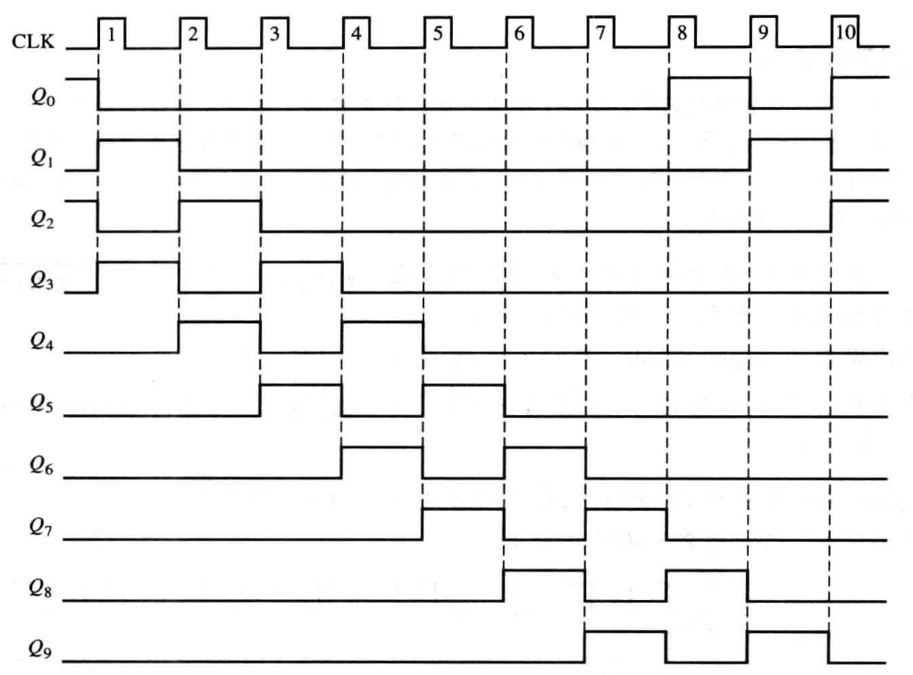

## 移位寄存器应用

### 精确延时控制

串行输入/串行输出移位寄存器可以用来提供从输入到输出的时间延迟，此时间延迟是寄存器中数 $n$ 和时钟频率的函数

从一个数字系统到另一个数字系统的**串行数据传送**，常常用来减少传输线中的导线数

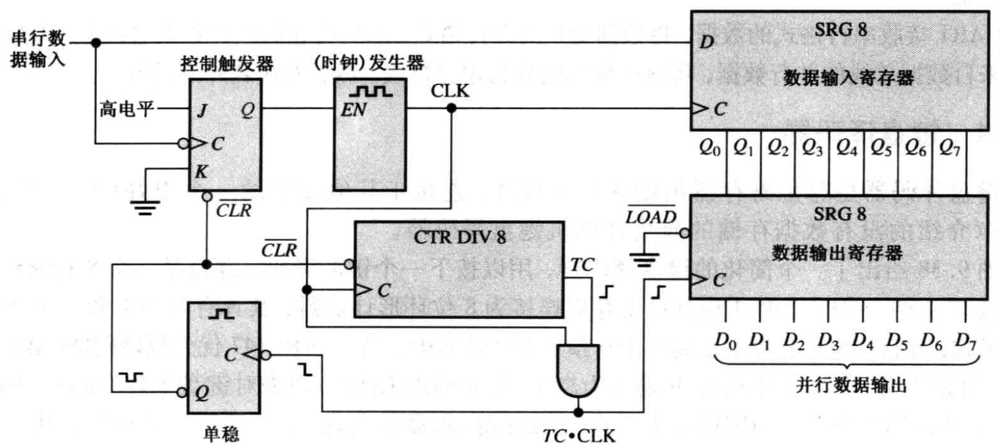

当没有数据被传送时，串行数据线上就会有连续的 1 存在 ，0 位就是数据起始位，告诉串并转换器即将有 8 位数据序列到来：

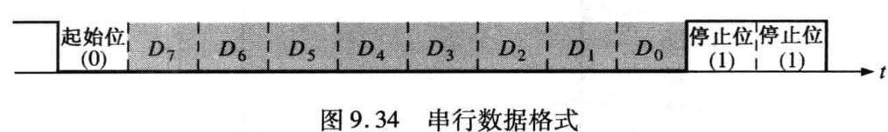

详细波形图解释工作流程如下：

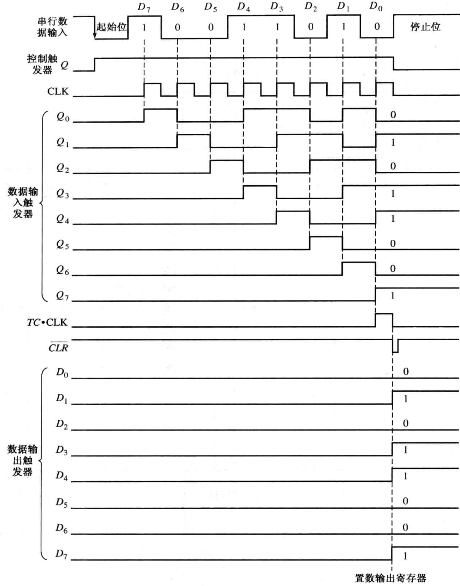
