## 公式表

### 傅里叶变换性质

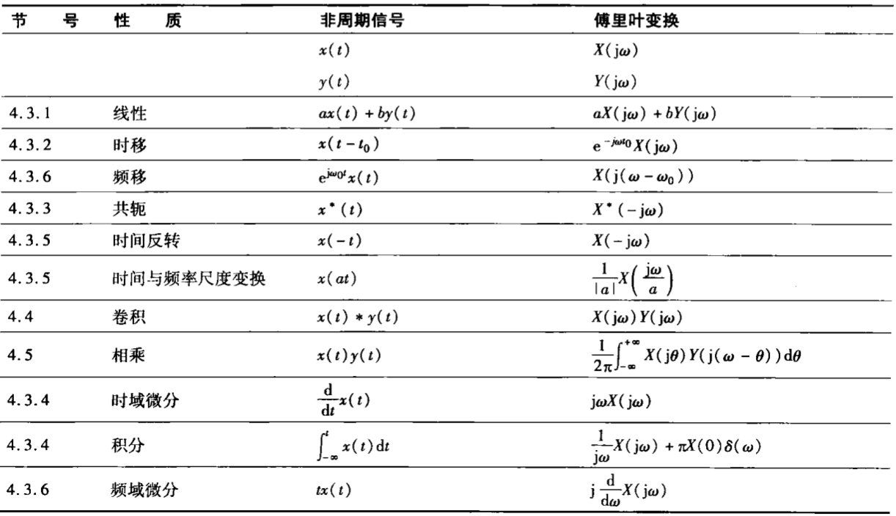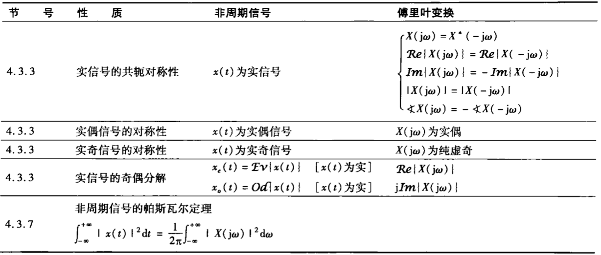

### 基本傅里叶变换对

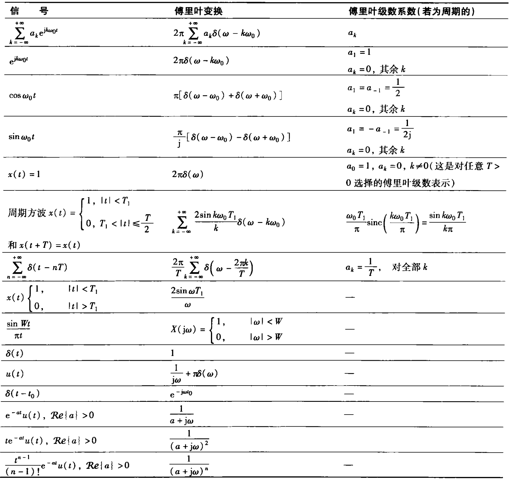

!!! abstract
    连续时间非周期信号傅里叶变换的推导基本思想

- 非周期函数可以通过周期性延拓得到周期函数
- 周期函数可以令基波周期趋于无穷大得到连续的非周期函数

对于周期性矩形脉冲信号：

$$
\begin{aligned}
a_k
&= \frac{2T_1}{T}\text{Sa}(k\pi\frac{2T_1}{T})\\
Ta_k
&= 2T_1\text{Sa}(\omega T_1)
\end{aligned}
$$

其中：$\omega=k\omega_0=\frac{2k\pi}{T}$。

两点之间的距离：

$$
\Delta\omega=(k+1)\omega_0-k\omega_0=\omega_0=\frac{2\pi}{T}
$$

当 $T\to\infty$ 时有 $\omega_0=\frac{2\pi}{T}\to 0$ ，即两点之间距离趋于 0 ，函数包络线趋于连续函数。

## 非周期信号

### FT 公式推导

连续时间非周期信号傅里叶变换的推导

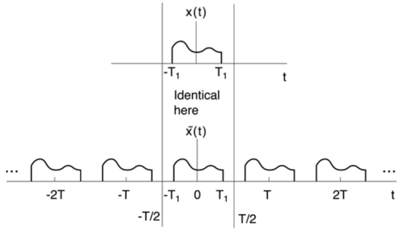

周期函数 $\tilde{x}(t)$ 以 T 为周期，在 $[-\frac{T}{2},\frac{T}{2}]$ 内与 $x(t)$ 相等，它的傅里叶级数表示为：

$$
\tilde{x}(t)=\sum_{k=-\infty}^{+\infty}a_k e^{jk\omega_0 t}
$$

!!! abstract
    波浪号表示周期性

当 $T\to\infty$ 时，在 $(-\infty,\infty)$ 内 $\tilde{x}(t)=x(t)$ ；

$$
\begin{aligned}
a_k
&= \frac{1}{T}{\int}_{-\frac{T}{2}}^{\frac{T}{2}} \tilde{x}(t) e^{-jk\omega_0 t}dt\\
&= \frac{1}{T}{\int}_{-\frac{T}{2}}^{\frac{T}{2}} x(t) e^{-jk\omega_0 t}dt\\
&= \frac{1}{T}{\int}_{-\infty}^{\infty} x(t) e^{-jk\omega_0 t}dt\\
\end{aligned}
$$

定义**频谱**：（傅里叶正变换）

$$
X(j\omega)={\int}_{-\infty}^{\infty} x(t) e^{-jk\omega_0 t}dt
$$

从而 $a_k$ 可以表示为：

$$
a_k=\frac{1}{T}X(jk\omega_0)
$$

因此，在 $[-\frac{T}{2},\frac{T}{2}]$ 内有：

$$
\begin{aligned}
x(t)=\tilde{x}(t)
&= \sum_{k=-\infty}^{+\infty} a_k e^{jk\omega_0 t}\\
&= \frac{1}{T} \sum_{k=-\infty}^{+\infty} X(jk\omega_0) e^{jk\omega_0 t}\\
&= \frac{1}{2\pi} \sum_{k=-\infty}^{+\infty} X(jk\omega_0) e^{jk\omega_0 t}\omega_0\\
&= \frac{1}{2\pi} \sum_{k=-\infty}^{+\infty} X(j\omega) e^{j\omega t}\Delta\omega\\
\end{aligned}
$$

当 $T\to\infty$ 时，$\Delta\omega=\omega_0\to0$，即 $\Delta\omega\to d\omega$ 则得到（傅里叶反变换）：

$$
\begin{aligned}
x(t)=\tilde{x}(t)
&= \frac{1}{2\pi} \int_{-\infty}^{+\infty} X(j\omega) e^{j\omega t}d\omega\\
\end{aligned}
$$

从而得到**傅里叶变换对**：

!!! abstract
    这两个公式是“一对”的，要么同时可积，要么都不可积

**傅里叶正变换**，分析公式，($e^{j\omega t}$ 的线性组合)

$$
X(j\omega)={\int}_{-\infty}^{\infty} x(t) e^{-j\omega t}dt
$$

**傅里叶反变换**，综合公式，(获得 $x(t)$ 的频谱)

$$
\begin{aligned}
x(t)=\frac{1}{2\pi} \int_{-\infty}^{+\infty} X(j\omega) e^{j\omega t}d\omega\\
\end{aligned}
$$

可以表示为：

$$
x(t)\stackrel{CTFT}{\longleftrightarrow}X(j\omega)\\\\
\mathscr{F}\{x(t)\}=X(j\omega)
$$

周期信号傅里叶级数的系数为其一个周期内信号傅里叶变换的等间隔采样：

$$
\begin{cases}
x(t)\lrarr X(j\omega)\\
\tilde{x}(t)\lrarr a_k
\end{cases}
\rArr a_k=\frac{1}{T}X(jk\omega_0)
$$

### 收敛性

既然傅里叶变换是从周期信号的傅里叶级数引出的，傅里叶变换的收敛问题就应该和傅里叶级数的收敛相一致。所以也有对应的两组条件；同样地两组条件并不完全等价。它们都是傅里叶变换存在的充分条件。

:::warning

和周期信号的情况一样，当 $x(t)$ 的傅里叶变换 $X(j\omega)$ 存在时，其反变换在间断点附近会产生 Gibbs 现象

#### 平方可积条件

#### Dirichlet 条件

### 常见信号的 FT

#### 低通信号(单侧)

1.png>)

$$
x(t)=e^{-at}u(t),\ \ \ a\gt0
$$

有正变换：

$$
\begin{aligned}
X(j\omega) &=\int_{0}^{+\infty}e^{-at}e^{-j\omega t}dt=\frac{1}{a+j\omega}\\
|X(j\omega)| &=\frac{1}{\sqrt{a^2+\omega^2}}\\
\frac{d}{d\omega}|X(j\omega)| &=-\arctan\frac{\omega}{a}
\end{aligned}
$$

2.png>)

3.png>)

#### 低通信号(双侧)

1.png>)

$$
x(t)=e^{-a|t|},\ \ \ a\gt0
$$

有正变换：

$$
\begin{aligned}
X(j\omega)
&=\int_{-\infty}^{0}e^{at}e^{-j\omega t}dt
+\int_{0}^{+\infty}e^{-at}e^{-j\omega t}dt\\
&=\frac{1}{a-j\omega}+\frac{1}{a+j\omega}\\
&= \frac{2a}{a^2+\omega^2}\\
\\
|X(j\omega)| &= X(j\omega)\\
\end{aligned}
$$

2.png>)

#### 冲激信号

$$
x(t)=\delta(t)
$$

有正变换：

$$
X(j\omega)=\int_{-\infty}^{+\infty}\delta(t)e^{-j\omega t}dt=1
$$

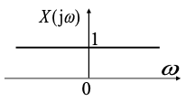

这表明 $\delta(t)$ 中包括了所有的频率成分，且所有频率分量的幅度、相位都相同。因此，系统的单位冲激响应 $h(t)$ 才能完全描述一个 LTI 系统的特性，$\delta(t)$ 才在信号与系统分析中具有如此重要的意义。

#### 常数信号

\*这个名字我乱起的

$$
x(t)=1
$$

因为：

$$
\begin{aligned}
\frac{1}{2\pi} \int_{-\infty}^{+\infty} 2\pi\ \delta(\omega)\ e^{j\omega t}d\omega = 1
\end{aligned}
$$

所以有反变换：

$$
\begin{aligned}
X(j\omega) &= 2\pi\delta(\omega)
\end{aligned}
$$

---

冲激信号和双侧阶跃信号(我乱起名)的对偶关系：

$$
\delta(t)\stackrel{F}{\longleftrightarrow}1\stackrel{F}{\longleftrightarrow}2\pi\delta(\omega)
$$

#### 矩形信号

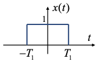

$$
x(t)=
\begin{cases}
1,\ \ \ |t|\lt T_1\\
0,\ \ \ |t|\gt T_1
\end{cases}
$$

有正变换：

$$
\begin{aligned}
X(j\omega) &=\int_{-T_1}^{T_1} e^{-j\omega t}dt\\
&=\frac{2\sin{\omega T_1}}{\omega}\\
&=\frac{2T_1\sin{\omega T_1}}{\omega T_1}\\
&=2T_1\text{Sa}(\omega T_1)
= 2T_1\text{sinc}(\frac{\omega T_1}{\pi})\\\\
a_k = \frac{X(j\omega)}{T}
&= \frac{2T_1}{T}\text{Sa}(k\omega_0 T_1) = \frac{2T_1}{T}\text{Sa}(\frac{2T_1}{T})
\end{aligned}
$$

不同脉冲宽度对频谱的影响：

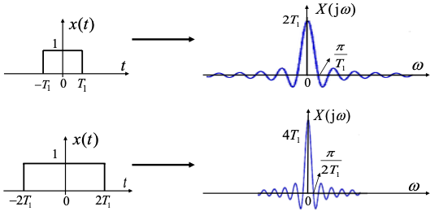

可见，信号宽度在时域和频域之间有一种相反的关系。

#### 采样信号

$$
X(j\omega)=
\begin{cases}
1,\ \ \ |\omega|\lt W\\
0,\ \ \ |\omega|\gt W
\end{cases}
$$

有反变换：

$$
\begin{aligned}
x(t) &=
\frac{1}{2\pi}\int_{-W}^{+W} e^{-j\omega t}d\omega\\
&=\frac{\sin{Wt}}{\pi t}\\
&= \frac{W}{\pi}\text{Sa}(Wt)
= \frac{W}{\pi}\text{Sa}(\frac{Wt}{\pi})
\end{aligned}
$$

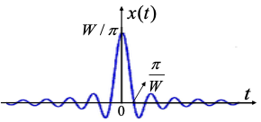

可见 $x(t)$ 是采样信号

---

矩形信号和采样信号的对偶关系：（上矩形信号、下采样信号）

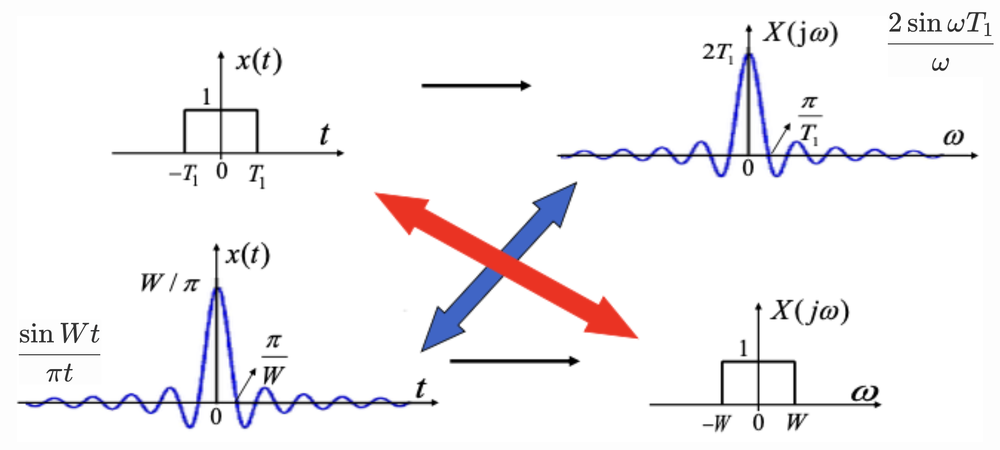

## 周期信号

!!! abstract
    $Ta_k$ 无论在 $T$ 有限还是无限的时候都可以是有限的，所以我们可以将 $T$ 有限时的周期信号和 $T$ 无限时的非周期信号用傅里叶变换统一起来

但是 $a_k$ 却不是，所以我们无法将周期信号和非周期信号都用傅里叶级数表示。

### FT 公式推导

考虑 $X(j\omega)=2\pi\delta(\omega-\omega_0)$ 所对应的信号：

$$
\begin{aligned}
x(t)
&=\frac{1}{2\pi} \int_{-\infty}^{+\infty} X(j\omega)\ e^{j\omega t}d\omega\\
&=\int_{-\infty}^{+\infty} \delta(\omega-\omega_0)\ e^{j\omega t}d\omega\\
&= e^{j\omega_0 t}
\end{aligned}
$$

于是对于表示为傅里叶级数的周期信号 $x(t)$：

$$
x(t)=\sum_{k=-\infty}^{+\infty}a_k\ e^{jk\omega_0 t}
$$

就有**频谱**即**正变换**：

$$
X(j\omega)=2\pi \sum_{k=-\infty}^{+\infty} a_k\ \delta(\omega-\omega_0)
$$

这表明周期信号的傅里叶正变换由一系列位于谐波频率处的冲激组成，其中 $k\omega_0$ 处的冲激强度为对应傅里叶级数系数 $a_k$ 的 $2\pi$ 倍。

### 常见信号的 FT

#### 正弦信号

$$
x(t)=\sin(\omega_0 t)=\frac{1}{2j}(e^{j\omega_0 t}-e^{-j\omega_0 t})
$$

有正变换：

$$
X(j\omega)=\frac{\pi}{j}[\delta(\omega-\omega_0)-\delta(\omega+\omega_0)]
$$

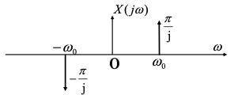

#### 余弦信号

$$
x(t)=\cos(\omega_0 t)=\frac{1}{2}(e^{j\omega_0 t}+e^{-j\omega_0 t})
$$

有正变换：

$$
X(j\omega)=\pi[\delta(\omega-\omega_0)+\delta(\omega+\omega_0)]
$$

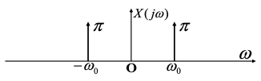

#### 均匀冲激串

$$
x(t)=\sum_{n=-\infty}^{+\infty}\delta(t-nT)
$$

其中 $T=\frac{2\pi}{\omega_0}$；

其傅里叶系数：

$$
\begin{aligned}
a_k
&=\frac{1}{T}\int_{-\frac{T}{2}}^{\frac{T}{2}}\delta(t)\ e^{-j\frac{2\pi}{T}kt}dt\\
&=\frac{1}{T}\int_{-\frac{T}{2}}^{\frac{T}{2}}\delta(t)dt\\
&=\frac{1}{T}
\end{aligned}
$$

可得傅里叶正变换：

$$
X(j\omega)=\frac{2\pi}{T}\sum_{k=-\infty}^{+\infty}\delta(\omega-\frac{2\pi}{T}k)
$$

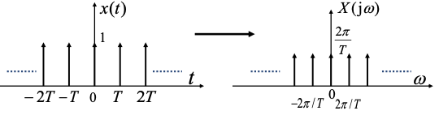

#### 周期性矩形脉冲

其傅里叶系数：

$$
a_k=\frac{2T_1}{T}\text{Sa}(\pi k\frac{2T_1}{T})
$$

有傅里叶正变换：

$$
X(j\omega)=\frac{4\pi T_1}{T}\sum_{k=-\infty}^{+\infty}\text{Sa}(\pi k\frac{2T_1}{T})\ \delta(\omega-\frac{2\pi}{T}k)
=2T_1\omega_0\sum_{k=-\infty}^{+\infty}\text{Sa}(\omega_0T_1\cdot k)\ \delta(\omega-\omega_0\cdot k)
$$

其中 $\omega_0=\frac{2\pi}{T}$ 为谱线间隔。

## 特殊信号 FT

### 符号函数

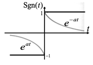

可以将符号函数定义为：

$$
\text{Sgn}(t)=\lim_{a\to0}[e^{-at}u(t)-e^{at}u(-t)]
$$

其傅里叶变换为：

$$
\begin{aligned}
\mathscr{F}\{\text{Sgn}(t)\}
&=\lim_{a\to0}[\frac{1}{a+j\omega}-\frac{1}{a-j\omega}]\\
&=\lim_{a\to0}\frac{-j2\omega}{a^2+(j\omega)^2}\\
&=\frac{2}{j\omega}
\end{aligned}
$$

### 单位阶跃函数

将 $u(t)$ 分解为偶部和奇部有：

$$
\begin{aligned}
&u(t)=u_e(t)+u_o(t)\\
&u_e(t)=\frac{1}{2}\\
&u_o(t)=\frac{1}{2}\text{Sgn}(t)
\end{aligned}
$$

而 $1\stackrel{CTFT}{\longleftrightarrow}2\pi\delta(\omega)$ ，$\text{Sgn}(t)\stackrel{CTFT}{\longleftrightarrow}\frac{2}{j\omega}$ ，因此有：

$$
u(t)\stackrel{F}{\longleftrightarrow}\frac{1}{j\omega}+\pi\delta(\omega)
$$

## 性质

### 线性

$$
x(t)\stackrel{F}{\longleftrightarrow}X(j\omega)\ \ ,\ \ y(t)\stackrel{F}{\longleftrightarrow}Y(j\omega)
\Rightarrow
ax(t)+by(t)\stackrel{F}{\longleftrightarrow}aX(j\omega)+bY(j\omega)
$$

### 时移特性

信号的**时移**会导致其频谱产生一个线性**相移**

$$
x(t)\stackrel{F}{\longleftrightarrow}X(j\omega)
\Rightarrow
x(t-t_0)\stackrel{F}{\longleftrightarrow}X(j\omega)e^{-j\omega t_0}
$$

---

证明

$$
\begin{aligned}
\mathscr{F}\{x(t-t_0)\}
&=\int_{-\infty}^{+\infty}x(t-t_0)\ e^{-j\omega t}dt\\
&=\int_{-\infty}^{+\infty}x(t')\ e^{-j\omega(t'+t_0)}dt'\\
&=e^{-j\omega t_0}\int_{-\infty}^{+\infty}x(t')\ e^{-j\omega t'}dt'\\
&=e^{-j\omega t_0}X(j\omega)
\end{aligned}
$$

### 共轭对称性

$$
x(t)\stackrel{F}{\longleftrightarrow}X(j\omega)
\Rightarrow
x^*(t)\stackrel{F}{\longleftrightarrow}X^*(-j\omega)
$$

特别地，当 $x(t)$ 是实信号(实函数)，则有频谱: $X(j\omega)=X^*(-j\omega)$ 为**共轭偶函数**（**实幅偶，虚相奇**）

---

证明

由 $x(t)$ 的傅里叶正变换两侧同时取共轭有：

$$
\begin{aligned}
X^*(j\omega)
&={\int}_{-\infty}^{\infty} [x(t) e^{-jk\omega_0 t}]^* dt\\
&={\int}_{-\infty}^{\infty} x(t)^* e^{jk\omega_0 t} dt\\
\end{aligned}
$$

所以：

$$
\begin{aligned}
X^*(-j\omega)
&={\int}_{-\infty}^{\infty} x(t)^* e^{-jk\omega_0 t} dt\\
\end{aligned}
$$

即得证：

$$
x^*(t)\stackrel{F}{\longleftrightarrow}X^*(-j\omega)
$$

---

当 $x(t)$ 是实信号时有 $x(t)=x^*(t)$ ，于是有：

$$
X(j\omega)=X^*(-j\omega)=\text{Re}[X(-j\omega)]+j\ \text{Im}[X(-j\omega)]
$$

共轭偶函数：

- **实**部是**偶**函数：$\text{Re}[X(j\omega)]=\text{Re}[X(-j\omega)]$；
- **虚**部是**奇**函数：$\text{Im}[X(j\omega)]=-\text{Im}[X(-j\omega)]$；
- **幅度**是**偶**函数：$|X(j\omega)|=|X(-j\omega)|$；
- **相位**是**奇**函数：$\text{Arg}X(j\omega)=-\text{Arg}X(-j\omega)$；

---

### 奇偶对称性

- 偶信号的傅里叶(正)变换还是偶函数
- 实偶信号的傅里叶(正)变换还是实偶函数
- 奇信号的傅里叶(正)变换还是奇函数
- 实奇信号的傅里叶(正)变换是**虚奇**函数

用表格总结奇偶性、是否为实函数的不同情况下的傅里叶正变换奇偶情况：

| $x(t)$                       | 偶函数:$x(t)=x(-t)$                                 | 奇函数:$x(t)=-x(-t)$                    |
| ---------------------------- | --------------------------------------------------- | --------------------------------------- |
| 一般的                       | $X(j\omega)=X(-j\omega)$                            | $X(j\omega)=-X(-j\omega)$               |
| $x(t)$是实函数:$x(t)=x^*(t)$ | $X(j\omega)=X(-j\omega)=X^*(j\omega)=X^*(-j\omega)$ | $X(j\omega)=-X(-j\omega)=X^*(-j\omega)$ |

#### 奇偶分解

实信号 $x(t)$ 若有奇偶分解 $x(t)=x_e(t)+x_o(t)$ ，则有：

$$
X(j\omega)=X_e(j\omega)+X_o(j\omega)\\
x_e(t)\stackrel{F}{\longleftrightarrow}X_e(-j\omega)\\
x_o(t)\stackrel{F}{\longleftrightarrow}X_o(-j\omega)
$$

### 时域微分特性

可将微分运算转变为代数运算

$$
x(t)\stackrel{F}{\longleftrightarrow}X(j\omega)
\Rightarrow
\frac{d}{dt}x(t)\stackrel{F}{\longleftrightarrow}j\omega X(j\omega)
$$

可以推广到高次微分，在后面的微分方程分析 LTI 系统中会用到：

$$
\frac{d^k}{dt^k}x(t)\stackrel{F}{\longleftrightarrow}(j\omega)^k X(j\omega)
$$

---

证明：傅里叶反变换两侧同时对 $t$ 微分即可

$$
\begin{aligned}
x(t)
&=\frac{1}{2\pi} \int_{-\infty}^{+\infty} X(j\omega) e^{j\omega t}d\omega\\
\frac{d}{dt}x(t)
&=\frac{1}{2\pi}\int_{-\infty}^{+\infty} X(j\omega)\frac{d}{dt}e^{j\omega t}d\omega\\
&=\frac{1}{2\pi}\int_{-\infty}^{+\infty} j\omega X(j\omega)\ e^{j\omega t}d\omega\\
\end{aligned}
$$

### 时域积分特性

可将积分运算转变为代数运算

$$
x(t)\stackrel{F}{\longleftrightarrow}X(j\omega)
\Rightarrow
\int_{-\infty}^{t}x(\tau)d\tau\stackrel{F}{\longleftrightarrow}\frac{1}{j\omega}X(j\omega)+\pi X(0)\delta(\omega)
$$

---

证明：傅里叶正变换两侧同时对 $\tau$ 积分即可

$$
\begin{aligned}
\mathscr{F}\{\int_{-\infty}^{t}x(\tau)d\tau\}
&=\int_{-\infty}^{+\infty}[\int_{-\infty}^{t}x(\tau)d\tau]e^{-j\omega t}dt\\
&=\int_{-\infty}^{+\infty}[\int_{-\infty}^{+\infty}x(\tau)u(t-\tau)d\tau]e^{-j\omega t}dt\\
&=\int_{-\infty}^{+\infty}x(\tau)[\int_{-\infty}^{+\infty}e^{-j\omega t}u(t-\tau)dt]d\tau\\
&=\int_{-\infty}^{+\infty}x(\tau)[\int_{-\infty}^{+\infty}e^{-j\omega(t-\tau)-j\omega\tau}u(t-\tau)d(t-\tau)]d\tau\\
&=\int_{-\infty}^{+\infty}x(\tau)e^{-j\omega\tau}[\int_{-\infty}^{+\infty}e^{-j\omega s}u(s)ds]d\tau\\
&=[\frac{1}{j\omega}+\pi\delta(\omega)]\int_{-\infty}^{+\infty}x(\tau)e^{-j\omega \tau}d\tau\\
&=[\frac{1}{j\omega}+\pi\delta(\omega)]X(j\omega)\\
&=\frac{1}{j\omega}X(j\omega)+\pi X(0)\delta(\omega)
\end{aligned}
$$

其中 $u(s)\stackrel{CTFT}{\longleftrightarrow}\frac{1}{j\omega}+\pi\delta(\omega)$ 是单位阶跃函数的傅里叶变换

### 时域和频域的尺度变换

信号如果在时域扩展 _a_ 倍，则其带宽相应压缩 _a_ 倍，反之亦然

$$
x(t)\stackrel{F}{\longleftrightarrow}X(j\omega)
\Rightarrow
x(at)\stackrel{F}{\longleftrightarrow}\frac{1}{|a|}X(\frac{j\omega}{a})
$$

---

证明：

$$
\begin{aligned}
\mathscr{F}\{x(at)\}
&=\int_{-\infty}^{+\infty}x(at)e^{-j\omega t}dt\\
&=\frac{1}{|a|}\int_{-\infty}^{+\infty}x(\tau)e^{-j\frac{\omega}{a}\tau}d\tau\\
&=\frac{1}{|a|}X(\frac{j\omega}{a})
\end{aligned}
$$

### 对偶性

由对偶性可以方便地将时域的某些特性对偶到频域

$$
x(t)\stackrel{CTFT}{\longleftrightarrow}X(j\omega)
\Rightarrow
X(jt)\stackrel{CTFT}{\longleftrightarrow}2\pi x(-\omega)
$$

---

证明：

$$
\begin{aligned}
x(t)
&=\frac{1}{2\pi} \int_{-\infty}^{+\infty} X(j\omega) e^{j\omega t}d\omega\\
2\pi x(t)
&=\int_{-\infty}^{+\infty} X(j\omega) e^{j\omega t}d\omega\\
2\pi x(\omega)
&=\int_{-\infty}^{+\infty} X(jt) e^{j\omega t}dt\\
2\pi x(-\omega)
&=\int_{-\infty}^{+\infty} X(jt) e^{-j\omega t}dt\\
\end{aligned}
$$

### 移频特性

将时域的时移性对偶可以得到频域的移频特性

$$
x(t)\stackrel{F}{\longleftrightarrow}X(j\omega)
\Rightarrow
x(t)e^{j\omega_0 t}\stackrel{F}{\longleftrightarrow}X[j(\omega-\omega_0)]
$$

---

证明：

$$
x(t)\stackrel{F}{\longleftrightarrow}X(j\omega)\\
\Downarrow\text{对偶性}\\
X(jt)\stackrel{F}{\longleftrightarrow}2\pi x(-\omega)\\
\Downarrow\text{时移特性}\\
X(j(t-\omega_0))\stackrel{F}{\longleftrightarrow}2\pi x(-\omega)e^{-j\omega_0 t}\\
\Downarrow\text{对偶性}\\
2\pi x(-t)e^{-j\omega_0 t}\stackrel{F}{\longleftrightarrow}2\pi X[j(-\omega-\omega_0)]
\Rightarrow
x(t)e^{j\omega_0 t}\stackrel{F}{\longleftrightarrow}X[j(\omega-\omega_0)]
$$

### 频域微分特性

$$
x(t)\stackrel{F}{\longleftrightarrow}X(j\omega)
\Rightarrow
-jtx(t)\stackrel{F}{\longleftrightarrow}\frac{d}{d\omega}X(j\omega)
$$

### 频域积分特性

$$
x(t)\stackrel{F}{\longleftrightarrow}X(j\omega)
\Rightarrow
\frac{x(t)}{-jt}+\pi x(0)\delta(t)\stackrel{F}{\longleftrightarrow}\int_{-\infty}^{\omega}X(j\tau)d\tau
$$

### Parseval 定理

$$
x(t)\stackrel{F}{\longleftrightarrow}X(j\omega)
\Rightarrow
\int_{-\infty}^{+\infty}|x(t)|^2dt=\frac{1}{2\pi}\int_{-\infty}^{+\infty}|X(j\omega)|^2d\omega
$$

这表明：信号的能量既可以在时域求得，也可以在频域求得。由于 $|X(j\omega)^2|$ 表示了信号**能量在频域的分布**，因而称其为**能量谱密度函数**。

### :star:卷积特性

$$
x(t)\stackrel{F}{\longleftrightarrow}X(j\omega)\ \ \ ,\ \ \ h(t)\stackrel{F}{\longleftrightarrow}H(j\omega)
\Rightarrow
x(t)*h(t)\stackrel{F}{\longleftrightarrow}X(j\omega)H(j\omega)
$$

本质上，卷积特性的成立正是因为复指数信号 $e^{jωt}$ 是一切 LTI 系统的特征函数，$H(j\omega)$ 则是对应的特征值

---

证明

令 $y(t)=x(t)*h(t)=\int_{-\infty}^{+\infty}x(\tau)\ h(t-\tau)\ d\tau$ ，求其傅里叶正变换为：

$$
\begin{aligned}
\mathscr{F}\{y(t)\}=Y(j\omega)
&=\int_{-\infty}^{+\infty} e^{-j\omega t}\int_{-\infty}^{+\infty}x(\tau)\ h(t-\tau)\ d\tau\ dt\\
&=\int_{-\infty}^{+\infty} e^{-j\omega(t-\tau)-j\omega \tau}\int_{-\infty}^{+\infty}x(\tau)\ h(t-\tau)\ d\tau\ d(t-\tau)\\
&=\int_{-\infty}^{+\infty} e^{-j\omega s-j\omega \tau}\int_{-\infty}^{+\infty}x(\tau)\ h(s)\ d\tau\ ds\\
&=\int_{-\infty}^{+\infty}e^{-j\omega s}e^{-j\omega \tau}\int_{-\infty}^{+\infty}x(\tau)\ h(s)\ d\tau\ ds\\
&=\int_{-\infty}^{+\infty}x(\tau)\ e^{-j\omega \tau}\ d\tau\int_{-\infty}^{+\infty}h(s)\ e^{-j\omega s}\ ds\\
&=X(j\omega)H(j\omega)
\end{aligned}
$$

另外，可将 $x(t)$ 视为复指数分量 $e^{j\omega t}$ 的线性组合，每个 $e^{j\omega t}$ 通过 LTI 系统时都要受到系统对应的特征值 $H(j\omega)$ 的加权

---

**LTI 系统的单位冲激响应 $h(t)$ 与频率响应 $H(j\omega)$ 一一对应**，因而 LTI 系统可以由其频率响应完全表征。

:warning: 并非任何系统的频率响应都存在。

用频率响应表征系统时，一般都限于对稳定系统。

稳定性保证了 $h(t)$ 的绝对可积，结合 Dirichlet 的另外两个条件（实际系统一般满足），则频率响应必然存在

### :star:相乘特性

$$
s(t)\stackrel{F}{\longleftrightarrow}S(j\omega)\ \ \ ,\ \ \ p(t)\stackrel{F}{\longleftrightarrow}P(j\omega)
\Rightarrow
s(t)p(t)\stackrel{F}{\longleftrightarrow}\frac{1}{2\pi}S(j\omega)*P(j\omega)
$$

---

证明：利用对偶性可以从卷积性质得出相乘性质

由对偶性有：

$$
s(t)\stackrel{F}{\longleftrightarrow}S(j\omega)\ \ \ ,\ \ \ p(t)\stackrel{F}{\longleftrightarrow}P(j\omega)
\Rightarrow
S(jt)\stackrel{F}{\longleftrightarrow}2\pi S(-\omega)\ \ \ ,\ \ \ P(jt)\stackrel{F}{\longleftrightarrow}2\pi P(-\omega)\\
$$

由卷积特性有：

$$
S(jt)*P(jt)\stackrel{F}{\longleftrightarrow}4\pi^2s(-\omega)p(-\omega)
$$

由对偶性有：

$$
\begin{aligned}
4\pi^2s(-t)p(-t)&\stackrel{F}{\longleftrightarrow}2\pi S(-j\omega)*P(-j\omega)\\
s(-t)p(-t)&\stackrel{F}{\longleftrightarrow}\frac{1}{2\pi}S(-j\omega)*P(-j\omega)
\end{aligned}
$$

## 连续时间 LTI 系统的分析

利用傅里叶变换及其特性对 LTI 系统分析

### 频域分析法

根据卷积特性, 可以对 LTI 系统进行频域分析, 其过程为:

1. 求出（或已知、根据系统描述直接得出）系统单位冲激响应 $h(t)$；
2. 求输入 $x(t)$ 的傅里叶正变换：$x(t)\stackrel{CTFT}{\longleftrightarrow}X(j\omega)$；
3. 求单位冲激响应 $h(t)$ 的傅里叶正变换：$h(t)\stackrel{CTFT}{\longleftrightarrow}H(j\omega)$；
4. 若需要求 $Y(j\omega)$ ，由傅里叶变换卷积特性得：$Y(j\omega)=X(j\omega)H(j\omega)$；
5. 若需要求 $y(t)$：
   - $x(t)$ 是非周期的（或非周期部分）：
     - 往往由傅里叶反变换求得：$y(t)=\mathscr{F}^{-1}\{Y(j\omega)\}=\frac{1}{2\pi} \int_{-\infty}^{+\infty} Y(j\omega) e^{j\omega t}d\omega$；
     - 对有理函数求傅里叶反变换通常采用**部分分式展开**和利用**常用变换对**进行
   - $x(t)$ 是周期的（或周期部分）：
     - $|Y(j\omega)|=|X(j\omega)|\times|H(j\omega)|$；
     - $\text{arg}Y(j\omega)=\text{arg}X(j\omega)+\text{arg}H(j\omega)$；

### 线性常微分方程

\*线性常系数微分方程

对于由线性常系数微分方程描述的 LTI 系统：

$$
\sum_{k=0}^{N}a_k\frac{d^ky(t)}{dt^k}=\sum_{k=0}^{M}b_k\frac{d^kx(t)}{dt^k}
$$

对方程两边进行**傅里叶变换**，有：

$$
\begin{aligned}
\sum_{k=0}^{N}a_{k}(j\omega)^{k}Y(j\omega)
&=
\sum_{k=0}^{M}b_{k}(j\omega)^{k}X(j\omega)\\
Y(j\omega)\sum_{k=0}^{N}a_{k}(j\omega)^{k}
&=
X(j\omega)\sum_{k=0}^{M}b_{k}(j\omega)^{k}\\
{Y(j\omega)\over X(j\omega)}
&=
{\sum_{k=0}^{M}b_{k}(j\omega)^{k}\over\sum_{k=0}^{N}a_{k}(j\omega)^{k}}
\end{aligned}
$$

由 CTFT 卷积特性有：

$$
Y(j\omega)=X(j\omega)H(j\omega)
$$

可得：

$$
H(j\omega)={Y(j\omega)\over X(j\omega)}={\sum_{k=0}^{M}b_{k}(j\omega)^{k}\over\sum_{k=0}^{N}a_{k}(j\omega)^{k}}
$$

可见由线性常系数微分方程描述的 LTI 系统的频率响应是一个有理函数。

若要求 $h(t)$ ，也就是系统的单位冲激响应，则往往可以对有理函数（有理分式）形式的 $H(j\omega)$ 变形化得到常用变换对的表示形式，再利用常用变换对反变换得到 $h(t)$ 。

---

反之，若已知一个 LTI 系统的频率响应 $H(j\omega)={Y(j\omega)\over X(j\omega)}$ ，则可以列出两侧分别是关于 $Y(j\omega)$ 和$X(j\omega)$ 的方程，两侧同时进行**傅里叶反变换**，（注意将 $j\omega$ 视为一个整体）则可得到描述该 LTI 系统的线性常系数微分方程
