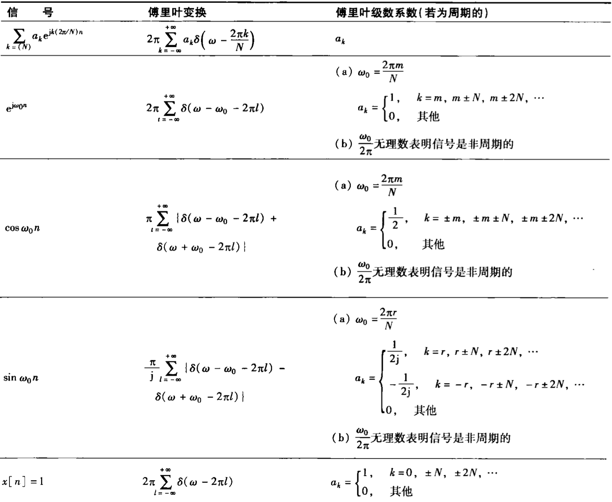
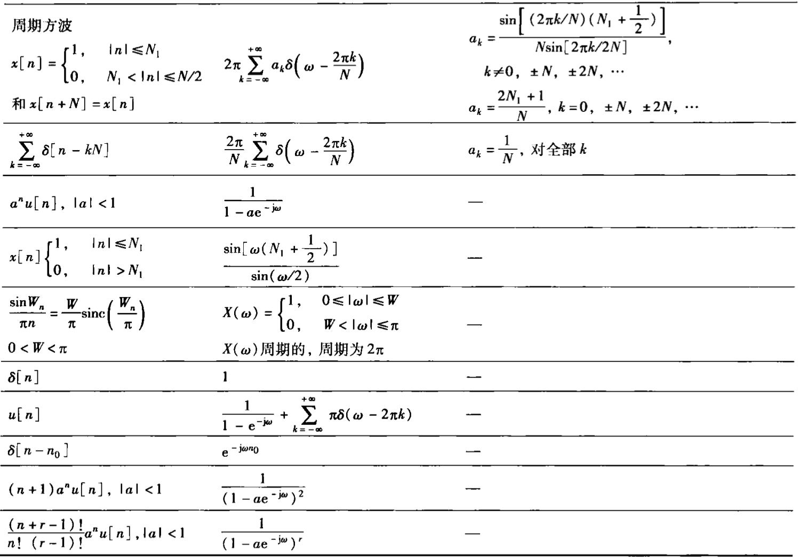
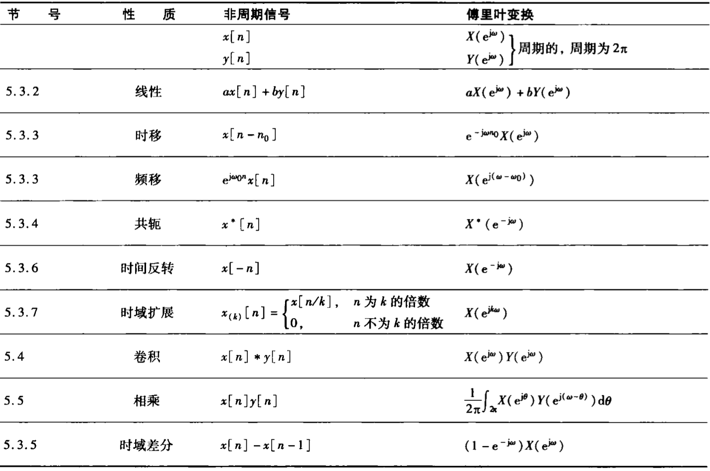
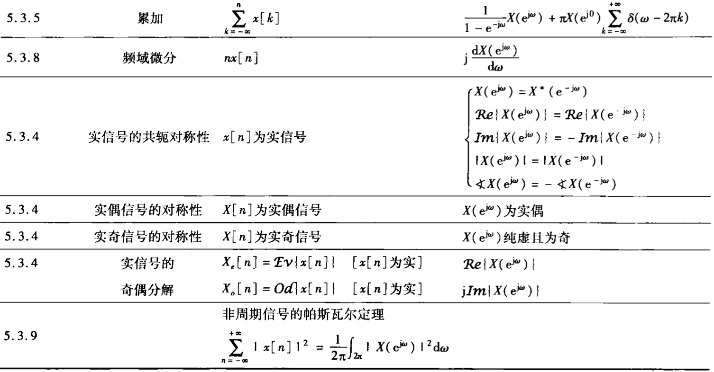
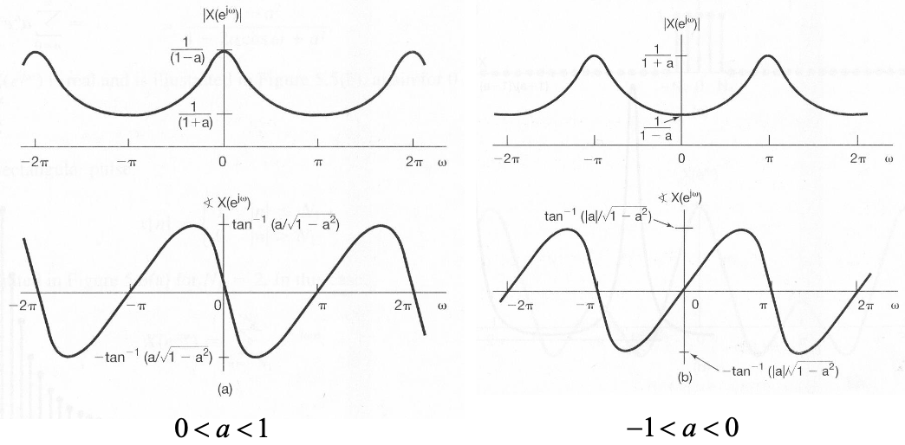

## 公式表

### 基本傅里叶变换对

### 性质

## 非周期信号

### FT 公式推导

定义 $\widetilde{x}[n]$ 为 $x[n]$ 的周期延拓，以 $N$ 为周期，$x[n]$ 是 $\widetilde{x}[n]$ 的一个周期。

当 $T\to\infty$ 时，在 $(-\infty,+\infty)$ 内 $\widetilde{x}[n]=x[n]$ ；在该极限情况下有 $\widetilde{x}[n]$ 的傅里叶级数表示：

$$
\widetilde{x}[n]=\sum_{n=\langle N\rangle}a_{k}e^{jk\omega_{0}n}
$$

其中基波周期 $\omega_0=\frac{2\pi}{N}$ ，可得：

$$
a_k=\frac{1}{N}\sum_{n=\langle N\rangle}\widetilde{x}[n]e^{-jk\omega_{0}n}=\frac{1}{N}\sum_{n=\langle N\rangle}x[n]e^{-jk\omega_{0}n}
$$

定义（**傅里叶正变换**）：

$$
X(e^{j\omega})=\sum_{n=-\infty}^{+\infty}x[n]e^{-j\omega n}
$$

从而 $a_k$ 可以表示为：

$$
a_k=\frac{1}{N}X(e^{jk\omega_0 n})
$$

!!! abstract
    $X(e^{j\omega})$ 是以 $2\pi$ 为周期的。

因此在任意一个周期（$2\pi$）内就有：

$$
\begin{aligned}
x[n]=\widetilde{x}[n]
&=\sum_{n=\langle N\rangle}a_{k}\ e^{jk\omega_{0}n}\\
&=\sum_{n=\langle N\rangle}\frac{1}{N}X(e^{jk\omega_0 n})\ e^{jk\omega_{0}n}\\
&=\frac{1}{2\pi}\sum_{n=\langle N\rangle}X(e^{jk\omega_0 n})\ e^{jk\omega_{0}n}\omega_0
\end{aligned}
$$

令 $\omega=k\omega_0$ 作变量代换，有 $\Delta\omega=\omega_0$ ，且当 $k$ 在一个周期范围内变化时，$kω_0$ 在 $2\pi$ 范围变化（所以积分区间为 $2\pi$ ）；当 $T\to\infty$ 时，$\omega_0=\frac{2\pi}{N}\to0$，即 $\Delta\omega\to d\omega$ 则得到（**傅里叶反变换**）：

$$
x[n]=\frac{1}{2\pi}\int_{2\pi}X(e^{j\omega})e^{j\omega n}d\omega
$$

### 收敛性

当 $x[n]$ 是无限长序列时，由于 $X(e^{j\omega})$ 的表达式是无穷项级数，会存在收敛问题。

收敛的 2 个不等价的充分条件：

- 平方可和
- 绝对可和

当 $x[n]$ 的傅里叶变换 $X(e^{j\omega})$ 存在时，其反变换不会产生 Gibbs 现象，也不存在收敛性问题

### 常见信号的 FT

#### 衰减脉冲(单侧)

\*名字是我乱起的

$$
x[n]=a^nu[n]\ \ \ \ \ |a|\lt1
$$

有傅里叶正变换：

$$
X(e^{j\omega})
=\sum_{n=0}^{+\infty}a^ne^{-j\omega n}
=\sum_{n=0}^{+\infty}(ae^{-j\omega})^n
=\frac{1}{1-ae^{-j\omega}}
$$

其模与相位表达式分别为：

$$
|X(e^{(j\omega)}|=\frac{1}{\sqrt{1+a^2-2a\cos\omega}}\\
\arg X(e^{(j\omega)}=-\arctan\frac{a\sin\omega}{1-a\cos\omega}
$$

#### 衰减脉冲(双侧)

\*名字是我乱起的

$$
x[n]=a^{|n|}\ \ \ \ \ |a|\lt1
$$

$$
x[n]=a^{-n}u[-n-1]+a^nu[n]
$$

有傅里叶正变换：

$$
\begin{aligned}
X(e^{j\omega})
&=\sum_{n=-\infty}^{-1}a^{-n}e^{-j\omega n}+\sum_{n=0}^{+\infty}a^ne^{-j\omega n}\\
&=\sum_{n=1}^{+\infty}a^{n}e^{j\omega n}+\sum_{n=0}^{+\infty}a^ne^{-j\omega n}\\
&=\sum_{n=1}^{+\infty}(ae^{j\omega})^n+\sum_{n=0}^{+\infty}(ae^{-j\omega})^n\\
&=\frac{ae^{j\omega}}{1-ae^{j\omega}}+\frac{1}{1-ae^{-j\omega}}\\
&=\frac{1-a^2}{1+a^2-2a\cos\omega}
\end{aligned}
$$

#### 冲激信号

$$
x[n]=\delta[n]
$$

有傅里叶正变换：

$$
X(e^{j\omega})=\sum_{n=-\infty}^{+\infty}\delta[n]e^{-j\omega n}=1
$$

与 $\delta(t)$ 类似，$\delta[n]$ 中也包括所有的频率成分，且所有频率分量的幅度、相位都相同

#### 矩形脉冲

$$
x[n]=
\begin{cases}
1,\ \ \ |n|\leq N_1\\
0,\ \ \ |n|\gt N_1
\end{cases}
$$

有傅里叶正变换：

$$
X(e^{j\omega})=\sum_{n=-N_1}^{+N_1}e^{-j\omega n}=\frac{\sin[(2N_1+1)\frac{\omega}{2}]}{\sin\frac{\omega}{2}}
$$

显然，将 $X(e^{j\omega})$ 中的 $\omega$ 代之以 $k\omega_0$ 再乘以 $\frac{1}{N}$ ，即是相应周期延拓序列的频谱（傅里叶级数的系数）：$a_k=\frac{1}{N}X(e^{j\omega})|_{\omega=k\omega}$。

#### 采样信号

$$
X(e^{j\omega})=
\begin{cases}
1,\ \ \ |\omega|\lt W\\
0,\ \ \ W\lt|\omega|\leq\pi
\end{cases}
$$

有傅里叶正变换：

$$
\begin{aligned}
x[n]
&=\frac{1}{2\pi}\int_{-W}^{W}e^{j\omega n}d\omega\\
&=\frac{\sin Wn}{\pi n}\\
&=\frac{W}{\pi}\text{Sa}(Wn)\\
&=\frac{W}{\pi}\text{Sinc}(\frac{Wn}{\pi})
\end{aligned}
$$

#### 常数信号

$$
x[n]=1
$$

因为：

$$
\begin{aligned}
\int_{-\pi}^{\pi}\delta(\omega)\cdot e^{j\omega n}d\omega&=1\\
\frac{1}{2\pi}\int_{-\pi}^{\pi}2\pi\cdot\delta(\omega)\cdot e^{j\omega n}d\omega&=1
\end{aligned}
$$

对 $2\pi\delta(\omega)$ 以 $2\pi$ 为周期进行周期延拓，得到 $x[n]=1$ 的傅里叶正变换为：

$$
X(e^{j\omega})=2\pi\sum_{l=-\infty}^{+\infty}\delta(\omega-2\pi l)
$$

## 周期信号

### FT 公式推导

对连续时间信号，有 $e^{j\omega_0 t}\stackrel{CTFT}{\longleftrightarrow}2\pi\delta(\omega-\omega_0)$ ，由此推断，对离散时间信号或许有相似的情况

但对于 $x[n]=e^{jk\omega_0 n}$ ，由于离散时间傅里叶变换是以 $2\pi$ 为周期的，因此频域的冲激应该是周期性的冲激串（周期延拓），也就是：

$$
X(e^{j\omega})=\sum_{l=-\infty}^{+\infty}2\pi\delta(\omega-k\omega_0-2\pi l)
$$

将反变换积分范围包含 $\omega_0$ ，可以得到：

$$
\begin{aligned}
x[n]
&=\frac{1}{2\pi}\int_{2\pi}X(e^{j\omega})e^{j\omega n}d\omega\\
&=\int_{\omega_0-\pi}^{\omega_0+\pi}\delta(\omega-\omega_0)e^{j\omega n}d\omega\\
&=e^{j\omega_0 n}
\end{aligned}
$$

于是对于表示为傅里叶级数的离散时间周期信号：

$$
x[n]=\sum_{k=\langle N\rangle}a_{k}e^{jk\omega_0 n},\ \ \ \omega_0=\frac{2\pi}{N}
$$

就有（**傅里叶正变换**）：

$$
\begin{aligned}
X(e^{j\omega})=\mathscr{F}\{x[n]\}
&=\sum_{k=\langle N\rangle}a_{k}\cdot\mathscr{F}\{e^{jk\omega_{0}n}\}\\
&=\sum_{k=\langle N\rangle}a_{k}\sum_{l=-\infty}^{+\infty}2\pi\delta(\omega-k\omega_0-2\pi l)\\
&=2\pi\sum_{l=-\infty}^{+\infty}\sum_{k=\langle N\rangle}a_{k}\delta(\omega-k\omega_0-lN\omega_0)\\
&=2\pi\sum_{l=-\infty}^{+\infty}\sum_{k=0}^{N-1}a_{k}\delta(\omega-(lN+k)\omega_0)\\
&=2\pi\sum_{l=-\infty}^{+\infty}\ \sum_{lN+k=lN}^{lN+N-1}a_{lN+k}\delta(\omega-(lN+k)\omega_0)\\
&=2\pi\sum_{l=-\infty}^{+\infty}\ \sum_{lN+k=lN}^{lN+N-1}a_{lN+k}\delta(\omega-(lN+k)\omega_0)\\
&=2\pi\sum_{l=-\infty}^{+\infty}a_{k}\delta(\omega-k\omega_0)
\end{aligned}
$$

可以发现 DTFT 与 CTFT 形式一致

## 性质

若 $x[n]\stackrel{DTFT}{\longleftrightarrow}X(e^{j\omega})$ ，则有以下性质成立：

### 周期性

$$
X(e^{j(\omega+2\pi)})=X(e^{j\omega})
$$

### 线性

$$
x[n]\stackrel{DTFT}{\longleftrightarrow}X(e^{j\omega})\ \ ,\ \ y[n]\stackrel{DTFT}{\longleftrightarrow}Y(e^{j\omega})
\Rightarrow
ax[n]+by[n]\stackrel{DTFT}{\longleftrightarrow}aX(e^{j\omega})+bY(e^{j\omega})
$$

### 时移特性

$$
x[n-n_0]\stackrel{DTFT}{\longleftrightarrow}X(e^{j\omega})e^{-j\omega n_0}
$$

### 频移特性

$$
x[n]e^{j\omega_0 n}\stackrel{DTFT}{\longleftrightarrow}X(e^{j(\omega-\omega_0)})
$$

### 时域反转

$$
x[-n]\stackrel{DTFT}{\longleftrightarrow}X(e^{-j\omega})
$$

### 共轭对称性

$$
x^*[n]\stackrel{DTFT}{\longleftrightarrow}X^*(e^{-j\omega})
$$

特别地，当 $x[n]$ 是实信号(实函数)，则有频谱: $X(e^{-j\omega})=X^*(e^{-j\omega})$ 为**共轭偶函数**（**实幅偶，虚相奇**）

共轭偶函数：

- **实**部是**偶**函数：$\text{Re}[X(j\omega)]=\text{Re}[X(-j\omega)]$；
- **虚**部是**奇**函数：$\text{Im}[X(j\omega)]=-\text{Im}[X(-j\omega)]$；
- **幅度**是**偶**函数：$|X(j\omega)|=|X(-j\omega)|$；
- **相位**是**奇**函数：$\text{Arg}X(j\omega)=-\text{Arg}X(-j\omega)$；

### 奇偶对称性

!!! abstract
    与 CTFT 的奇偶对称性一致

- 偶信号的傅里叶(正)变换还是偶函数
- 实偶信号的傅里叶(正)变换还是实偶函数
- 奇信号的傅里叶(正)变换还是奇函数
- 实奇信号的傅里叶(正)变换是**虚奇**函数

用表格总结奇偶性、是否为实函数的不同情况下的傅里叶正变换奇偶情况：

| $x[n]$               | 偶函数:$x[n]=x[-n]$                                 | 奇函数:$x[n]=-x[-n]$                    |
| -------------------- | --------------------------------------------------- | --------------------------------------- |
| 一般的               | $X(j\omega)=X(-j\omega)$                            | $X(j\omega)=-X(-j\omega)$               |
| 实函数:$x[n]=x^*[n]$ | $X(j\omega)=X(-j\omega)=X^*(j\omega)=X^*(-j\omega)$ | $X(j\omega)=-X(-j\omega)=X^*(-j\omega)$ |

### 时域差分特性

$$
x[n]-x[n-1]\stackrel{DTFT}{\longleftrightarrow}(1-e^{-j\omega})X(e^{j\omega})
$$

### 时域累加特性

$$
\sum_{k=-\infty}^{n}x[k]\stackrel{DTFT}{\longleftrightarrow}\frac{X(e^{j\omega})}{1-e^{-j\omega}}+\pi X(e^{j0})\sum_{k=-\infty}^{+\infty}\delta(\omega-2\pi k)
$$

---

!!! abstract
    时域差分与累加特性说明：离散时间傅里叶变换中的 $1-e^{-j\omega}$ 对应于连续时间傅里叶变换中的 $j\omega$。

### 时域内插

信号的时域特性与频域特性之间有一种相反的关系

定义：

$$
x_k[n]=
\begin{cases}
x[\frac{n}{k}], &\text{n为k的整数倍}\\
0, & \text{其他n}
\end{cases}
$$

则有：

$$
x_k[n]\stackrel{DTFT}{\longleftrightarrow}X(e^{jk\omega})
$$

---

证明:

$$
\begin{aligned}
X_k(e^{j\omega})
&=\sum_{n=-\infty}^{+\infty}x_k[n]e^{-j\omega n}\\
&=\sum_{r=-\infty}^{+\infty}x_k[rk]e^{-j\omega rk}\\
&=\sum_{r=-\infty}^{+\infty}x[\frac{rk}{k}]e^{-j\omega rk}\\
&=\sum_{r=-\infty}^{+\infty}x[r]e^{-jk\omega r}\\
&=X(e^{jk\omega})
\end{aligned}
$$

### 频域微分

$$
-jnx[n]\stackrel{DTFT}{\longleftrightarrow}\frac{dX(e^{j\omega})}{d\omega}
$$

### Parseval 定理

$$
\sum_{n=-\infty}^{+\infty}|x[n]|^2=\frac{1}{2\pi}\int_{2\pi}|X(e^{j\omega})|^2d\omega
$$

### 卷积特性

$$
x[n]\stackrel{DTFT}{\longleftrightarrow}X(e^{j\omega})\ \ ,\ \ h[n]\stackrel{DTFT}{\longleftrightarrow}H(e^{j\omega})
\Rightarrow
x[n]*h[n]\stackrel{DTFT}{\longleftrightarrow}X(e^{j\omega})H(e^{j\omega})
$$

该卷积性质使离散时间 LTI 系统的频域分析非常便利。本质上，卷积性质的成立仍是因为复指数信号 $e^{j𝜔n}$ 是一切离散时间 LTI 系统的特征函数，$H(e^{j\omega})$ 则是对应的特征值。

### 相乘特性

如果：

$$
y[n]=x_1[n]\cdot x_2[n]
$$

则：

$$
\begin{aligned}
Y(e^{j\omega})
&=\frac{1}{2\pi}\int_{2\pi}X_1(e^{j\theta})X_2(e^{j(\omega-\theta)})d\theta\\
&=\frac{1}{2\pi}X_1(e^{j\omega})\otimes X_2(e^{j\omega})
\end{aligned}
$$

因此上述卷积称为**周期卷积**，因为 $X_1(e^{j\omega})$ 和 $X_2(e^{j\omega})$ 都是以 $2\pi$ 为周期的

## 离散时间 LTI 系统的分析

### 频域分析法

:warning:并非所有的 LTI 系统都存在频率响应！一般只考虑**稳定**的 LTI 系统的频率响应，因为此时 $h[n]$ 绝对可和，离散时间傅里叶变换（即频率响应）$H(e^{j\omega})$ 存在。

!!! abstract
    与连续时间 LTI 系统的频域分析法基本一致

根据卷积特性, 可以对 LTI 系统进行频域分析, 其过程为:

1. 求出（或已知、根据系统描述直接得出）系统单位冲激响应 $h[n]$；
2. 求输入 $x[n]$ 的傅里叶正变换：$x[n]\stackrel{DTFT}{\longleftrightarrow}X(e^{j\omega})$；
3. 求单位冲激响应 $h[n]$ 的傅里叶正变换：$h[n]\stackrel{DTFT}{\longleftrightarrow}H(e^{j\omega})$；
4. 若需要求 $Y(e^{j\omega})$ ，由傅里叶变换卷积特性得：$Y(e^{j\omega})=X(e^{j\omega})H(e^{j\omega})$；
5. 若需要求 $y[n]$：
   - $x[n]$ 是非周期的（或非周期部分）：
     - 往往由傅里叶反变换求得：$y[n]=\mathscr{F}^{-1}\{Y(e^{j\omega})\}=\frac{1}{2\pi}\int_{-\infty}^{+\infty} Y(e^{j\omega}) e^{j\omega t}d\omega$；
     - 对有理函数求傅里叶反变换通常采用**部分分式展开**和利用**常用变换对**进行
   - $x[n]$ 是周期的（或周期部分）：
     - $|Y(e^{j\omega})|=|X(e^{j\omega})|\times|H(e^{j\omega})|$；
     - $\text{arg}Y(e^{j\omega})=\text{arg}X(e^{j\omega})+\text{arg}H(e^{j\omega})$；

### 线性常差分方程

\*线性常系数差分方程

对于由线性常差分方程描述的 LTI 系统：

$$
\sum_{k=0}^{N}a_ky[n-k]=\sum_{k=0}^{M}b_kx[n-k]
$$

对方程两边进行**傅里叶变换**，有：

$$
\begin{aligned}
\sum_{k=0}^{N}a_{k}e^{-jk\omega}Y(e^{j\omega})
&=
\sum_{k=0}^{M}b_{k}e^{-jk\omega}X(e^{j\omega})\\
Y(e^{j\omega})\sum_{k=0}^{N}a_{k}e^{-jk\omega}
&=
X(e^{j\omega})\sum_{k=0}^{M}b_{k}e^{-jk\omega}\\
{Y(e^{j\omega})\over X(e^{j\omega})}
&=
{\sum_{k=0}^{M}b_{k}e^{-jk\omega}\over\sum_{k=0}^{N}a_{k}e^{-jk\omega}}
\end{aligned}
$$

由 DTFT 卷积特性有：

$$
Y(e^{j\omega})=X(e^{j\omega})H(e^{j\omega})
$$

可得：

$$
H(e^{j\omega})={Y(e^{j\omega})\over X(e^{j\omega})}={\sum_{k=0}^{M}b_{k}e^{-jk\omega}\over\sum_{k=0}^{N}a_{k}e^{-jk\omega}}
$$

可见由线性常系数差分方程描述的 LTI 系统的频率响应是一个有理函数。

若要求 $h[n]$ ，也就是系统的单位冲激响应，则往往可以对有理函数（有理分式）形式的 $H(e^{j\omega})$ 变形化得到常用变换对的表示形式，再利用常用变换对反变换得到 $h[t]$ 。

---

反之，若已知一个 LTI 系统的频率响应 $H(e^{j\omega})={Y(e^{j\omega})\over X(e^{j\omega})}$ ，则可以列出两侧分别是关于 $Y(e^{j\omega})$ 和$X(e^{j\omega})$ 的方程，两侧同时进行**傅里叶反变换**，（注意将 $e^{j\omega}$ 视为一个整体）则可得到描述该 LTI 系统的线性常系数微分方程
