## 连续时间周期信号的傅里叶级数表示

### 连续时间傅里叶级数

成**谐波关系**的复指数信号集：$e^{jk\omega_0 t},\ \ \ k=0,\pm 1,\pm 2,\cdots$ ，满足：

- 每个信号周期为：$\frac{2\pi}{|\omega|}=\frac{2\pi}{|k\omega_0|}$；
- 公共周期为：$T=\frac{2\pi}{|\omega_0|}$；
- 各信号彼此独立

这些信号的线性组合称为(连续)**傅里叶级数**：

$$
x(t)=\sum_{k=-\infty}^{+\infty}a_k e^{jk\omega_0 t},\ \ \ k=0,\pm 1,\pm 2,\cdots
$$

则有：

- 基波频率 $\omega_0$，即 $k=1$ 时的频率 $\omega=k\omega_0$；
- (基波)周期： $T=\frac{2\pi}{|\omega_0|}$；
- $a_k$ 称为傅立叶级数的系数
- k = 0 对应直流分量
- k = ±1 对应一次谐波
- k = ±2 对应二次谐波

### 频谱图

在傅里叶级数中，各个信号分量（谐波分量）间的区别仅仅是**系数**和**频率**不同。

因此，可以用**线段来表示分量的系数**，用**线段的位置表示相应的频率**（谐波次数）

实系数傅里叶级数

$$
x(t)=\sum_{k=-\infty}^{+\infty}a_k e^{jk\omega_0 t},\ \ \ k=0,\pm 1,\pm 2,\cdots,\ \ \ a_k\in\mathbb{R}
$$

可以表示为：

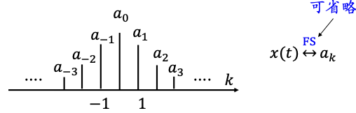

当 $a_k\in\mathbb{C}$ 为复系数傅里叶级数时，通常分幅度与相位分别作图：

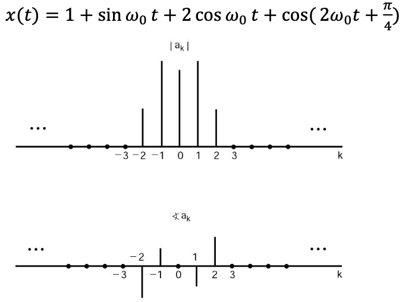

### 确定系数

如果周期信号 x(t)可以表示为傅里叶级数：

$$
x(t)=\sum_{k=-\infty}^{+\infty}a_k e^{jk\omega_0 t},\ \ \ k=0,\pm 1,\pm 2,\cdots,\ \ \ \omega_0=\frac{2\pi}{T}
$$

则有：

$$
x(t) e^{-jn\omega_0 t}
= \sum_{k=-\infty}^{+\infty}a_k e^{j(k-n)\omega_0 t}
$$

对两边同时在一个周期内积分，有：

$$
\begin{aligned}
\int_{0}^{T}x(t) e^{-jn\omega_0 t}dy
&= \sum_{k=-\infty}^{+\infty} a_k \int_{0}^{T} e^{j(k-n)\omega_0 t}dt
\end{aligned}
$$

其中：

$$
\begin{aligned}
\int_{0}^{T} e^{j(k-n)\omega_0 t}dt
&=\int_{0}^{T}cos((k-n)\omega_0 t)dt+j\int_{0}^{T}sin((k-n)\omega_0 t)dt\\
&=
\begin{cases}
0,\ \ \ k\neq n\\
T,\ \ \ k=n
\end{cases}
\end{aligned}
$$

所以：

$$
\begin{aligned}
\int_{0}^{T}x(t) e^{-jn\omega_0 t}dt
&= \sum_{k=-\infty}^{+\infty} a_k \int_{0}^{T} e^{j(k-n)\omega_0 t}dt\\
&= a_n T
\end{aligned}
$$

可得 $a_n$：

$$
\begin{aligned}
a_n &= \frac{1}{T}\int_{0}^{T}x(t) e^{-jn\omega_0 t}dt
\end{aligned}
$$

在确定此积分时，只要积分区间是一个周期即可，对积分区间的起止并无特别要求，因此可表示为:

$$
\begin{aligned}
a_k
&= \frac{1}{T}{\int}_{T} x(t) e^{-jk\omega_0 t}dt\\
&= \frac{1}{T}{\int}_{T} x(t) [\text{cos}(k\omega_0t)-j\ \text{sin}(k\omega_0t)]dt
\end{aligned}
$$

$n=0$ 时信号在一个周期的平均值，通常称**直流分量**：

$$
\begin{aligned}
a_0 &= \frac{1}{T}{\int}_{T} x(t) dt
\end{aligned}
$$

### 周期性矩形脉冲信号

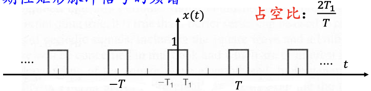

$$
\begin{aligned}
a_k
&= \frac{1}{T}{\int}_{T} x(t) e^{-jk\omega_0 t}dt\\
&= \frac{1}{T}{\int}_{-T_1}^{T_1}e^{-jk\omega_0 t}dt\\
&= -\frac{1}{jk\omega_0 T} e^{-jk\omega_0t}|_{-T_1}^{T_1}\\
&= \frac{2\text{sin}(k\omega_0 T_1)}{k\omega_0 T}\\
&= \frac{2T_1}{T}\frac{2\text{sin}(k\omega_0 T_1)}{k\omega_0 T_1}\\
(\omega_0=\frac{2\pi}{T})
&= \frac{2T_1}{T}\text{Sa}(k\pi\frac{2T_1}{T})
\end{aligned}
$$

其中 $\text{Sa}(...)$ 是抽样信号：

$$
\text{Sa}(x)=\frac{\text{sin}x}{x}
$$

基波频率为：$\omega_0=\frac{2\pi}{T}$。

类似地：

$$
\text{sinc}(x)=\frac{\text{sin}\pi x}{\pi x}
$$

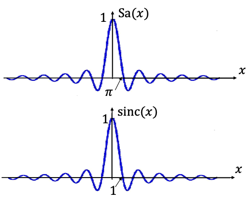

不同占空比的周期性矩形脉冲信号的傅里叶级数表示：

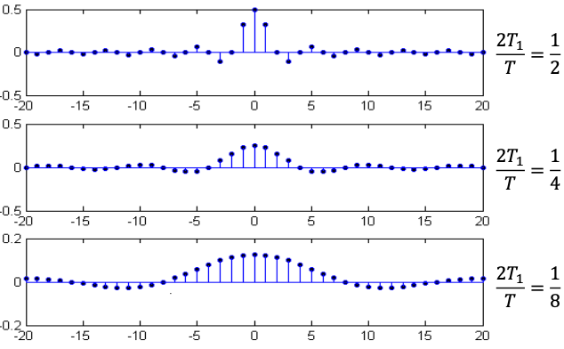

### 收敛性

若 $x(t)$ 以 T 为周期，用有限项级数：

$$
x_N(t)=\sum_{k=-N}^{N}a_k e^{jk\omega_0 t}
$$

近似 $x(t)$ 时，定义误差：

$$
e_N(t)=x(t)-x_N(t)=x(t)-\sum_{k=-N}^{N}a_k e^{jk\omega_0 t}
$$

误差在一个周期内的能量为：

$$
E_N=\int_{T}|e_N(t)|^2dt
$$

可以证明，要使 $E_N$ 最小，应有：

$$
a_k= \frac{1}{T}{\int}_{T} x(t) e^{-jk\omega_0 t}dt
$$

结论：在误差能量$E_N$ 最小的准则下，傅里叶级数是对周期信号的最佳近似

#### 收敛的充分条件

两组条件并不完全等价。它们都是傅里叶级数收敛的充分条件。

相当广泛的信号都能满足这两组条件中的一组，因而用傅里叶级数表示周期信号具有相当的普遍适用性

##### 平方可积条件

如果：

$$
\int_{T}|x(t)|^2dt \lt \infty
$$

则 $a_k$ 必存在。

此时 x(t)与其傅里叶级数表示之间没有能量上的区别

##### Dirichlet 条件

（1）$x(t)$ 在任何周期内信号绝对可积，即：

$$
\int_{T}|x(t)|dt \lt \infty
$$

（2）在任何有限区间内，只有有限个极值点，且极值为有限值

（3）在任何有限区间内，只有有限个间断点，且在这些间断点上，函数值有限

Dirichlet 条件保证在间断点之外 $x(t)$ 等于它的傅里叶级数；而在间断点上，该无穷级数收敛于间断点两边值的平均值

### 实信号的傅里叶级数其他形式(如考)

若 $x(t)$ 是实信号，则有 ：

$$
x(t)=x^*(t)
$$

从而有：

$$
x^*(t)=[\sum_{k=-\infty}^{+\infty}a_k e^{jk\omega_0 t}]^*
$$

---

### Gibbs 现象

满足 Dirichlet 条件的信号，其傅里叶级数是如何收敛于 $x(t)$ 的？特别当 $x(t)$ 具有间断点时，在间断点附近，如何收敛于 $x(t)$ ?

Gibbs 现象表明：

用有限项傅里叶级数表示有间断点的信号时，在间断点附近不可避免的会出现振荡和超量。超量的幅度不会随所取项数的增加而减小。只是随着项数的增多，振荡频率变高，并向间断点处压缩，从而使它所占有的能量减少

---

## 离散时间周期信号的傅里叶级数表示

### 离散时间傅里叶级数

成**谐波关系**的复指数信号集：$\Phi_k[n]=\{e^{j\frac{2\pi}{N}kt}\},\ \ \ k=0,\pm 1,\pm 2,\cdots$ ，满足：

- 每个信号周期为：$\frac{N}{k}$；
- 公共周期为：$N$；
- 各信号彼此独立

这些信号的线性组合称为**离散傅里叶级数**：

$$
x[n]=\sum_{k=\langle N\rangle}a_k e^{j\frac{2\pi}{N}kn},\ \ \ k=0,\pm 1,\pm 2,\cdots
$$

:star:其中 $\langle N\rangle$ 表示一个总共 $N$ 个的连续序列，起始和结束没有要求。

则有：

- 基波频率 $\omega_0=\frac{2\pi}{N}$，即 $k=1$ 时的频率 $\omega=k\omega_0=\frac{2k\pi}{N}$；
- (基波)周期：$N$；
- $a_k$ 为傅立叶级数的系数，也称为 $x[n]$ 的**频谱系数**

### 确定系数

给 $x[n]=\sum_{k=\langle N\rangle}a_{k}e^{j\frac{2\pi}{N}kt}$ 两边同时乘 $e^{-j\frac{2\pi}{N}rn}$ ，可得：

$$
x[n]e^{-j\frac{2\pi}{N}rn}=\sum_{k=\langle N\rangle}a_k e^{j\frac{2\pi}{N}(k-r)n}
$$

显然 $x[n]e^{-j\frac{2\pi}{N}rn}$ 仍然是以 N 为周期的，对两边求和：

$$
\sum_{n=\langle N\rangle}x[n]e^{-j\frac{2\pi}{N}rn}
=\sum_{n=\langle N\rangle}\sum_{k=\langle N\rangle}a_k e^{j\frac{2\pi}{N}(k-r)n}
=\sum_{k=\langle N\rangle}a_k \sum_{n=\langle N\rangle}e^{j\frac{2\pi}{N}(k-r)n}
$$

其中：

$$
\begin{aligned}
\sum_{n=\langle N\rangle}e^{j\frac{2\pi}{N}(k-r)n}
&= \sum_{n=0}^{N-1}e^{j\frac{2\pi}{N}(k-r)n}\\
&= \frac{1-e^{j(k-r)2\pi}}{1-e^{j(k-r)\frac{2\pi}{N}}}\\
&=
\begin{cases}
0,\ \ \ k\neq r\\
N,\ \ \ k=r
\end{cases}
\end{aligned}
$$

从而：

$$
\sum_{n=\langle N\rangle}x[n]e^{-j\frac{2\pi}{N}rn}=Na_r
$$

即可得：( r 换成了 k )

$$
a_k=\frac{1}{N}\sum_{n=\langle N\rangle}x[n]e^{-j\frac{2\pi}{N}kn}
$$

显然上式满足 $a_{k+N}=a_k$ ，即也是以 $N$ 为周期的，或者说 $a_k$ 中只有 $N$ 个是独立的

### 周期性方波序列

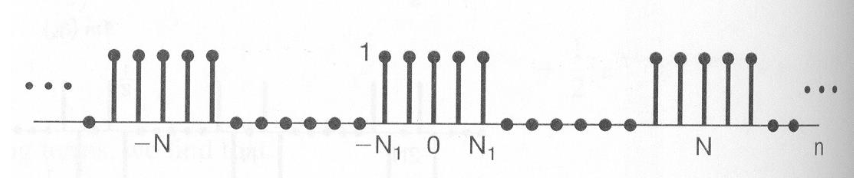

$$
\begin{aligned}
a_k
&= \frac{1}{N}\sum_{n=\langle N\rangle}x[n]e^{-j\frac{2\pi}{N}kn} \\
&= \frac{1}{N}\sum_{n=-N_1}^{N_1}e^{-j\frac{2\pi}{N}kn} \\
&= \frac{1}{N}\frac
{e^{j\frac{2\pi}{N}kN_1}-e^{-j\frac{2\pi}{N}k(N_1+1)}}
{1-e^{-j\frac{2\pi}{N}k}} \\
&= \frac{1}{N}\frac{e^{-j\frac{\pi}{N}k}}{e^{-j\frac{\pi}{N}k}}\frac
{e^{j\frac{2\pi}{N}k(N_1+\frac{1}{2})}-e^{-j\frac{2\pi}{N}k(N_1+\frac{1}{2})}}
{e^{j\frac{\pi}{N}k}-e^{-j\frac{\pi}{N}k}} \\
&= \frac{1}{N}\frac{\text{sin}\frac{\pi}{N}k(2N_1+1)}{\text{sin}\frac{\pi}{N}k},\ \ \ \ k\neq 0,\pm N,\pm 2N,\cdots\\
&= \frac{1}{N}\frac{\text{sin}k\omega_0(N_1+\frac{1}{2})}{\text{sin}\frac{k\omega_0}{2}},\ \ \ \ k\neq 0,\pm N,\pm 2N,\cdots
\end{aligned}
$$

$$
a_k = \frac{2N_1+1}{N},\ \ \ \ k=rN
$$

### 收敛性

离散时间傅里叶级数是一个有限项的级数，确定 $a_k$ 的关系式也是有限项的和式，因而不存在收敛问题，也不会产生 Gibbs 现象

## LTI 系统对复指数信号的响应

### 特征函数与特征值

考查 LTI 系统对复指数信号 $e^{st}$ 作为输入时的响应

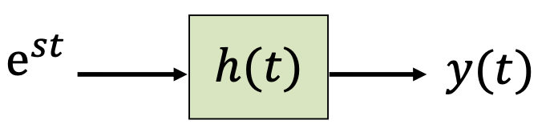

$$
\begin{aligned}
y(t)
&=\int_{-\infty}^{+\infty}e^{s(t-\tau)}h(\tau)d\tau \\
&= e^{st}\int_{-\infty}^{+\infty}e^{-s\tau}h(\tau)d\tau \\
&= e^{st}H(s)
\end{aligned}
$$

其中：

$$
H(s) = \int_{-\infty}^{+\infty}e^{-s\tau}h(\tau)d\tau
$$

考查 LTI 系统对复指数信号 $z^n$ 作为输入时的响应

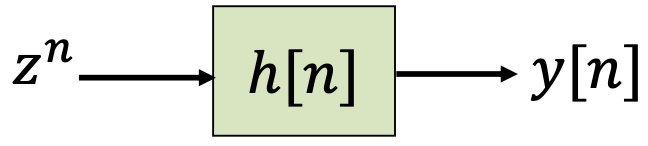

$$
\begin{aligned}
y[n]
&=\sum_{k=-\infty}^{+\infty}z^{n-k}h[k] \\
&=z^{n}\sum_{k=-\infty}^{+\infty}z^{-k}h[k] \\
&= z^{n}H(z)
\end{aligned}
$$

其中：

$$
H(z) = \sum_{k=-\infty}^{+\infty}z^{-k}h[k]
$$

如果系统对某一信号的响应是该信号乘以一个常数，则称该信号是这个系统的**特征函数**，称该常数为系统与特征函数相对应的**特征值**

!!! abstract
    类比线性代数中的特征向量和特征值

复指数函数 $e^{st}$ 和 $z^n$ 是**一切 LTI 系统的特征函数**，$H(s)$、$H(z)$ 分别是 LTI 系统与复指数信号相对应的特征值。这为后面的=

### 频率响应

对时域的任何一个信号 $x(t)$ 或者 $x[n]$，若能将其表示为下列形式：

$$
x(t) = \sum_{k}a_k\ e^{s_k t}\\
x[n] = \sum_{k}a_k\ z_{k}^{n}
$$

令 $s=j\omega$ ，考虑形如 $e^{j\omega t}$ 的基本信号，则有连续时间傅里叶级数与傅里叶级数变换：

$H(j\omega)$ 被称为连续时间 LTI 系统的**频率响应**：

$$
H(j\omega) = \int_{-\infty}^{+\infty}h(t)e^{-j\omega t}dt
$$

令 $z=e^{j\omega}$ ，考虑形如 $e^{j\omega n}$ 的基本信号，则有离散时间傅里叶级数与傅里叶级数变换；

$H(e^{j\omega})$ 称为离散时间 LTI 系统的**频率响应**：

$$
H(e^{j\omega}) = \sum_{n=-\infty}^{+\infty}h[n]e^{-j\omega n}
$$

利用 LTI 系统的特征函数以及齐次性与叠加性，则有:

$$
\text{输入}\to\text{响应}
$$

$$
e^{j\omega t}\to e^{j\omega t}\ H(j\omega ) \\
x(t)= \sum_{k}a_k\ e^{jk\omega_0 t}\to y(t)= \sum_{k}a_k\ e^{jk\omega_0 t}\ H(jk\omega_0)
$$

$$
e^{j\omega n}\to e^{j\omega n}\ H(e^{j\omega})\\
x[n] = \sum_{k}a_k\ e^{j\frac{2\pi}{N}kn}\to y[n]=\sum_{k}a_k\ e^{j\frac{2\pi}{N}kn}\ H(e^{j\frac{2\pi}{N}k})
$$

!!! abstract
    有的题目里会有$\omega=k\omega_0$关系，直接给出$H(j\omega)$、$H(e^{j\omega})$。

LTI 系统对周期信号的响应仍是一个周期信号；

LTI 系统频率响应的意义在于对各个谐波频率的信号分量进行不同的加权处理.

## 滤波

滤波：改变信号中各频率分量的相对大小或消除某些频率分量的过程。

- 频率成形滤波器：改变信号频谱形状的滤波器
- 频率选择性滤波器：基本上无失真地通过某些频率，而显著地衰减或消除另一些频率的滤波器

### 微分器

属于频率成形滤波器

$$
H(j\omega) = \int_{-\infty}^{+\infty}u_1(t)e^{-j\omega t}dt=j\omega
$$

幅度特性：

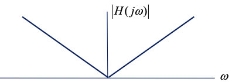

相位特性：

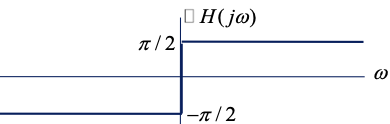

### 低通滤波器 LPF

Lowpass filter，通过低频分量，衰减或阻止高频分量

### 高通滤波器 HPF

Highpass filter，通过高频而衰减或阻止低频

### 带通滤波器 BPF

Bandpass filter，通过一频带范围，衰减或阻止这一频带之外的频率分量

### 带阻滤波器

Band-stop filter 或 band-rejection filter

## 微分方程描述的连续时间滤波器

### RC 低通滤波器

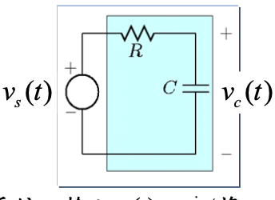

频率响应 $H(j\omega)$，设系统初始松弛，则该系统为 LTI 系统，输入 $v_s(t) = e^{jωt}$ 将产生输出 $v_c(t) = H(j\omega) e^{jωt}$ ，因此：

$$
\begin{aligned}
RC\frac{d}{dt}v_c(t)+v_c(t)&=v_s(t)\\
RC\frac{d}{dt}[H(j\omega)e^{j\omega t}]+H(j\omega)e^{j\omega t}&=e^{j\omega t}
\end{aligned}
$$

可得：

$$
\begin{aligned}
H(j\omega)&=\frac{1}{1+RCj\omega} \\
|H(j\omega)|&=\frac{1}{s\sqrt{1+(RC\omega)^2}}\\
\angle H(j\omega)&=-\text{arctan}(RC\omega)
\end{aligned}
$$

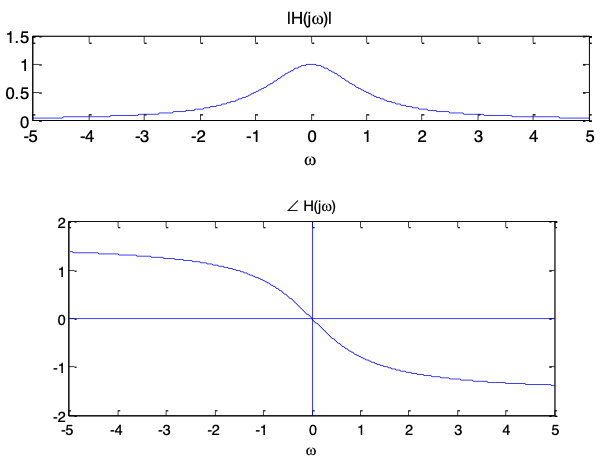

### RC 高通滤波器

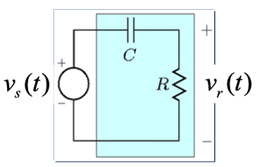

$$
\begin{aligned}
RC\frac{d}{dt}v_r(t)+v_r(t)&=RC\frac{d}{dt}v_s(t)
\end{aligned}
$$

由 $H(j\omega)e^{j\omega t}+G(j\omega)e^{j\omega t}=e^{j\omega t}$ 可利用已经求得的 $H(j\omega)$ 得到 ：可得：

$$
G(j\omega)=1-H(j\omega)=1-\frac{1}{1+RCj\omega}=\frac{RCj\omega}{1+RCj\omega}
$$

$$
\begin{aligned}
H(j\omega)&=\frac{RCj\omega}{1+RCj\omega} \\
|H(j\omega)|&=\frac{RC|\omega|}{s\sqrt{1+(RC\omega)^2}}\\
\angle H(j\omega)&=\text{arctan}(\frac{1}{RC\omega})
\end{aligned}
$$

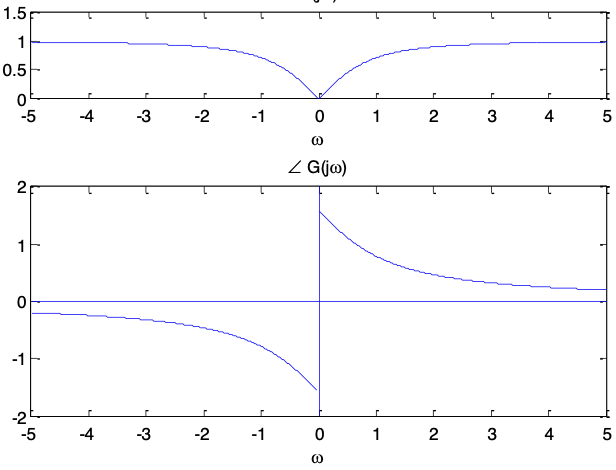

## 差分方程描述的离散时间滤波器

!!! abstract
    这一部分在我刚学这门课时觉得比较难，但还是记了这些笔记。

但后面学了 CTFT、DTFT、LT、zT 后运用后面的方法会发现这里的分析其实很简单，不必按照这里的方法分析。

### 一阶递归离散时间滤波器

对于由一阶差分方程描述的 LTI 系统

$$
y[n]-ay[n-1]=x[n]
$$

输入 $x[n] = e^{j\omega n}$ 将产生输出 $y[n] = H(e^{j\omega}) e^{j\omega n}$ ，因此：

$$
H(e^{j\omega}) e^{j\omega n}-a H(e^{j\omega}) e^{jω(n-1)}=e^{j\omega n}
$$

$$
H(e^{j\omega})=\frac{1}{1-ae^{-j\omega}}
$$

### 非递归离散时间滤波器

#### 移动均值滤波器

输出信号=输入信号的时移和

##### 三点

三点移动均值滤波器中，输入与输出的关系是：

$$
y[n]=\frac{1}{3}(x[n-1]+x[n]+x[n+1])
$$

单位脉冲响应为：

$$
h[n]=\frac{1}{3}(\delta[n-1]+\delta[n]+\delta[n+1])
$$

则频率响应为：

$$
\begin{aligned}
H(e^{j\omega})
&= \sum_{n=-\infty}^{+\infty}h[n]e^{-j\omega n} \\
&= \frac{1}{3}[e^{-j\omega}+1+e^{j\omega}] \\
&= \frac{1}{3}+\frac{2}{3}\text{cos}\omega
\end{aligned}
$$

##### _N_+_M_+1 点

N+M+1 移动均值滤波器中，输入与输出的关系是：

$$
y[n]=\frac{1}{N+M+1}\sum_{k=-N}^{M}x[n-k]
$$

单位脉冲响应为：

$$
h[n]=\frac{1}{N+M+1}\sum_{k=-N}^{M}\delta[n-k]
$$

则频率响应为：

$$
\begin{aligned}
H(e^{j\omega})
&= \frac{1}{N+M+1}\sum_{n=-\infty}^{+\infty}\sum_{k=-N}^{M}\delta[n-k]e^{-j\omega n} \\
&= \frac{1}{N+M+1}\sum_{k=-N}^{M}\sum_{n=-\infty}^{+\infty}\delta[n-k]e^{-j\omega n} \\
&= \frac{1}{N+M+1}\sum_{k=-N}^{M}\delta[n-k]e^{-j\omega k} \\
&= \frac{1}{N+M+1}e^{j\omega\frac{N-M}{2}}\frac{\text{sin}\frac{\omega(N+M+1)}{2}}{\sin(\frac{\omega}{2})} \\
\end{aligned}
$$

#### 差分滤波器

这个名字是我乱起的，为了和移动均值滤波器“对偶”~~也好分类~~

输出信号=输入信号的时移差，也就是输出信号=输入信号的差分

##### (两点)

两点差分滤波器这个名字也是我乱起的

输入与输出的关系是：

$$
y[n]=\frac{1}{2}(x[n]-x[n-1])
$$

单位脉冲响应为：

$$
h[n]=\frac{1}{2}(\delta[n]-\delta[n-1])
$$

则频率响应为：

$$
\begin{aligned}
H(e^{j\omega})
&= \sum_{n=-\infty}^{+\infty}h[n]e^{-j\omega n} \\
&= \frac{1}{2}[1-e^{-j\omega}] \\
&= je^{-\frac{1}{2}j\omega}\sin(\frac{\omega}{2})
\end{aligned}
$$

$$
|H(e^{j\omega})|=|\sin(\frac{\omega}{2})|
$$

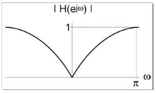
